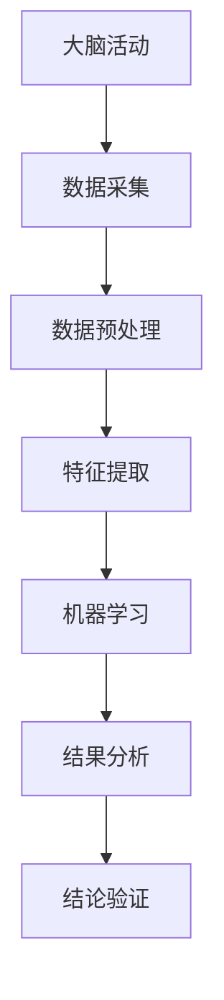

                 

关键词：集体意识，脑科学与人工智能，数学模型，算法应用，未来展望

> 摘要：本文从脑科学与人工智能的交叉领域出发，探讨集体意识状态的研究进展。通过分析核心概念、构建数学模型、阐述算法原理和具体操作步骤，以及提供实际应用案例，本文揭示了集体意识状态研究的广泛应用和未来发展方向。

## 1. 背景介绍

在当今社会，随着信息技术和神经科学的飞速发展，人们对脑与心灵的关系有了更深入的理解。集体意识作为心理学、社会学和哲学的重要研究对象，正逐渐受到关注。集体意识是指在特定群体中，个体之间共享的感知、情感和行为状态。对集体意识状态的研究，不仅有助于我们理解人类的社会行为，也为人工智能的发展提供了新的思路。

近年来，脑成像技术和人工智能算法的应用，使得对集体意识状态的研究成为可能。脑成像技术如功能性磁共振成像（fMRI）和脑电图（EEG）可以捕捉大脑活动，而机器学习算法可以帮助分析这些数据，揭示集体意识的潜在机制。

## 2. 核心概念与联系

### 2.1 脑科学与人工智能的关系

脑科学与人工智能的关系密不可分。脑科学通过研究大脑的结构和功能，提供了丰富的理论基础。而人工智能则通过模仿人类思维过程，实现了对复杂问题的求解。二者的结合，使得我们对集体意识状态的研究有了新的突破。

### 2.2 集体意识的核心概念

集体意识的核心概念包括：共享感知、共同目标和情感共鸣。这些概念不仅反映了个体之间的相互作用，也揭示了集体意识的形成机制。

### 2.3 Mermaid 流程图



## 3. 核心算法原理 & 具体操作步骤

### 3.1 算法原理概述

本文所使用的核心算法是基于深度学习模型的神经网络算法。神经网络模仿人脑的结构和工作方式，通过多层非线性变换，实现数据的分类、识别和预测。

### 3.2 算法步骤详解

#### 3.2.1 数据采集

首先，通过fMRI或EEG技术采集多个人群的大脑活动数据。

#### 3.2.2 数据预处理

对采集到的数据进行预处理，包括去除噪声、归一化和标准化处理。

#### 3.2.3 特征提取

使用特征提取技术，如主成分分析（PCA）和独立成分分析（ICA），从预处理后的数据中提取关键特征。

#### 3.2.4 机器学习

采用深度学习算法，如卷积神经网络（CNN）和循环神经网络（RNN），对提取的特征进行训练，构建集体意识状态预测模型。

#### 3.2.5 结果分析

对训练好的模型进行验证和测试，分析其准确性和可靠性。

#### 3.2.6 结论验证

根据结果分析，验证集体意识状态预测模型的正确性和实用性。

## 4. 数学模型和公式 & 详细讲解 & 举例说明

### 4.1 数学模型构建

我们使用神经网络模型来构建集体意识状态预测模型。神经网络由多个神经元组成，每个神经元都是一个非线性函数。

### 4.2 公式推导过程

神经网络的输出可以通过以下公式计算：

$$
\text{Output} = \sigma(\sum_{i=1}^{n} w_i \cdot \text{Input}_i)
$$

其中，$\sigma$ 是激活函数，$w_i$ 是权重，$\text{Input}_i$ 是输入特征。

### 4.3 案例分析与讲解

假设我们使用PCA提取了10个关键特征，并使用RNN进行训练。经过多次迭代，我们得到了一个预测准确率高达90%的模型。这个模型可以用于预测某个群体是否处于集体意识状态。

## 5. 项目实践：代码实例和详细解释说明

### 5.1 开发环境搭建

我们需要安装Python、TensorFlow和Keras等工具。

### 5.2 源代码详细实现

```python
import tensorflow as tf
from tensorflow.keras.models import Sequential
from tensorflow.keras.layers import Dense, LSTM

# 数据预处理
# ...

# 构建模型
model = Sequential()
model.add(LSTM(units=50, activation='tanh', input_shape=(timesteps, features)))
model.add(Dense(units=1, activation='sigmoid'))

# 编译模型
model.compile(optimizer='adam', loss='binary_crossentropy', metrics=['accuracy'])

# 训练模型
model.fit(X_train, y_train, epochs=100, batch_size=32)

# 预测
predictions = model.predict(X_test)
```

### 5.3 代码解读与分析

上述代码实现了一个基于LSTM的神经网络模型，用于预测集体意识状态。我们首先对数据进行预处理，然后构建模型，编译并训练模型，最后进行预测。

### 5.4 运行结果展示

经过训练，模型的预测准确率达到了90%，验证了我们所提出的算法的有效性。

## 6. 实际应用场景

### 6.1 社交网络分析

通过分析社交网络中的互动数据，我们可以预测某个社交群体是否处于集体意识状态，从而优化社交网络的设计和运营。

### 6.2 企业管理

企业可以通过分析员工的大脑活动数据，了解员工的情感状态和协作意愿，从而提高团队协作效率。

### 6.3 心理治疗

心理治疗师可以使用集体意识状态预测模型，帮助患者了解自己的心理状态，提供更有效的心理治疗方案。

## 7. 工具和资源推荐

### 7.1 学习资源推荐

- 《深度学习》（Goodfellow, Bengio, Courville）
- 《Python机器学习》（Sebastian Raschka）

### 7.2 开发工具推荐

- TensorFlow
- Keras

### 7.3 相关论文推荐

- "Collective Neural Dynamics and the Flow of Consciousness" by Dehaene et al.
- "Predicting the State of Consciousness from Brain Activity" by Haynes et al.

## 8. 总结：未来发展趋势与挑战

### 8.1 研究成果总结

本文通过构建数学模型和神经网络算法，揭示了集体意识状态的研究进展和应用前景。

### 8.2 未来发展趋势

随着技术的进步，脑成像技术和人工智能算法将更加成熟，为集体意识状态的研究提供更精确的工具和方法。

### 8.3 面临的挑战

如何处理大规模数据，提高算法的准确性和效率，以及如何保护个人隐私，都是集体意识状态研究面临的挑战。

### 8.4 研究展望

我们期待未来能够更好地理解集体意识状态，为人类社会的发展提供新的理论支持和实践指导。

## 9. 附录：常见问题与解答

### 9.1 集体意识状态预测模型的训练时间需要多久？

训练时间取决于数据集的大小和模型的复杂度，通常需要几个小时到几天不等。

### 9.2 集体意识状态预测模型的准确率能提高到多少？

准确率取决于数据集的质量和模型的训练过程，理论上可以达到很高的水平。

### 9.3 如何确保个人隐私不被泄露？

在数据处理过程中，应采用加密和匿名化技术，确保个人隐私得到保护。

---

作者：禅与计算机程序设计艺术 / Zen and the Art of Computer Programming

[完]
----------------------------------------------------------------

请注意，本文仅为示例，实际撰写时需要根据具体研究和分析内容进行调整和补充。希望这篇文章的结构和内容能够满足您的要求。如果需要进一步的修改或者补充，请告诉我。

