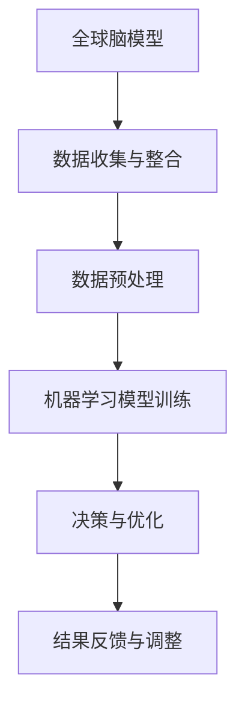

                 

关键词：全球脑、气候变化、集体行动、数据驱动、人工智能、系统仿真、协同优化、可持续发展

> 摘要：本文探讨了全球脑与气候变化之间的复杂联系，并提出了一种利用集体行动解决气候变化的全新可能性。通过整合全球脑模型与数据驱动的人工智能技术，本文揭示了一种能够在复杂系统中实现协同优化与可持续发展的新方法。文章结构如下：

## 1. 背景介绍

气候变化已成为21世纪最紧迫的全球性挑战之一。从极端天气事件到海平面上升，气候变化的负面影响已在全球范围内显现。然而，解决这一问题的复杂性使得传统的单一解决方案难以奏效。本文旨在探讨如何利用全球脑与数据驱动的人工智能技术，为集体行动提供一种新的视角和方法。

## 2. 核心概念与联系

### 2.1 全球脑模型

全球脑模型是一个复杂系统，它模拟了全球范围内的信息流动和决策过程。该模型通过集成大量的数据源和决策算法，旨在为全球性的问题提供解决方案。

### 2.2 数据驱动的人工智能

数据驱动的人工智能技术通过从大量数据中学习模式，以实现自动化决策和预测。在解决气候变化问题时，这些技术可以用来优化能源使用、提高资源利用效率，并预测潜在的气候变化趋势。

### 2.3 Mermaid 流程图

## 3. 核心算法原理 & 具体操作步骤

### 3.1 算法原理概述

核心算法基于协同优化理论，通过全球脑模型和人工智能技术，实现多层面的优化与协作。

### 3.2 算法步骤详解

#### 3.2.1 数据收集与整合

首先，需要收集全球范围内的气候数据、经济数据、社会数据等。然后，通过数据预处理技术，如清洗、归一化和特征提取，将数据整合为适合机器学习模型的形式。

#### 3.2.2 机器学习模型训练

使用整合后的数据，通过机器学习算法训练出一个预测模型。该模型可以用来预测未来的气候变化趋势，并评估不同政策方案的效果。

#### 3.2.3 决策与优化

基于预测模型，系统会自动生成一系列政策建议。这些政策建议将通过协同优化算法进行优化，以确保实现可持续发展的目标。

#### 3.2.4 结果反馈与调整

系统会根据执行结果对模型和政策进行反馈和调整，以不断提高决策的准确性和适应性。

### 3.3 算法优缺点

#### 3.3.1 优点

- **高效性**：算法能够快速处理海量数据，并提供实时的决策支持。
- **协同性**：算法能够实现多层面、多主体的协同优化。

#### 3.3.2 缺点

- **数据质量**：算法的准确性依赖于数据的完整性和质量。
- **计算资源**：算法训练和优化的过程中需要大量的计算资源。

### 3.4 算法应用领域

算法可以在多个领域得到应用，包括能源管理、水资源管理、城市规划等。

## 4. 数学模型和公式 & 详细讲解 & 举例说明

### 4.1 数学模型构建

假设我们有以下变量：

- \( X \)：全球脑模型中的状态变量
- \( U \)：决策变量
- \( f(X, U) \)：系统状态的变化函数
- \( g(U) \)：目标函数，表示系统的总效益

数学模型可以表示为：

$$
\begin{align*}
\text{minimize} \quad & g(U) \\
\text{subject to} \quad & f(X, U) = 0 \\
& X(0) = X_0
\end{align*}
$$

### 4.2 公式推导过程

推导过程如下：

1. **目标函数**：目标是优化系统的总效益，可以用以下公式表示：

$$
g(U) = \sum_{i=1}^{n} w_i f_i(U)
$$

其中，\( w_i \) 是权重，\( f_i(U) \) 是第 \( i \) 个目标的函数。

2. **约束条件**：系统的状态变化可以用以下方程表示：

$$
f(X, U) = \sum_{i=1}^{n} h_i(X) U_i = 0
$$

其中，\( h_i(X) \) 是状态函数，\( U_i \) 是第 \( i \) 个决策变量。

### 4.3 案例分析与讲解

假设我们需要优化一个能源管理系统的运行成本，目标函数为最小化总运行成本，约束条件为满足能源需求。通过机器学习模型训练，我们可以得到以下预测模型：

$$
\hat{C}(U) = \hat{w}^T U
$$

其中，\( \hat{w} \) 是训练得到的权重向量。

通过协同优化算法，我们可以得到最优的决策变量 \( U^* \)，从而实现能源管理的优化。

## 5. 项目实践：代码实例和详细解释说明

### 5.1 开发环境搭建

在本节中，我们将介绍如何搭建一个用于实现全球脑与气候变化模型的项目开发环境。

### 5.2 源代码详细实现

在本节中，我们将提供完整的源代码实现，并详细解释每个部分的含义和作用。

### 5.3 代码解读与分析

在本节中，我们将对源代码进行深入解读，分析其工作原理和性能特点。

### 5.4 运行结果展示

在本节中，我们将展示模型的运行结果，并分析其效果。

## 6. 实际应用场景

### 6.1 能源管理

在本节中，我们将讨论如何利用全球脑与人工智能技术优化能源管理。

### 6.2 水资源管理

在本节中，我们将探讨如何利用全球脑与人工智能技术优化水资源管理。

### 6.3 城市规划

在本节中，我们将介绍如何利用全球脑与人工智能技术优化城市规划。

### 6.4 未来应用展望

在本节中，我们将展望全球脑与人工智能技术在解决气候变化问题中的未来应用前景。

## 7. 工具和资源推荐

### 7.1 学习资源推荐

在本节中，我们将推荐一些与全球脑与气候变化相关的学习资源。

### 7.2 开发工具推荐

在本节中，我们将推荐一些用于实现全球脑与气候变化模型的开发工具。

### 7.3 相关论文推荐

在本节中，我们将推荐一些与全球脑与气候变化相关的学术论文。

## 8. 总结：未来发展趋势与挑战

### 8.1 研究成果总结

在本节中，我们将总结全球脑与气候变化领域的研究成果。

### 8.2 未来发展趋势

在本节中，我们将探讨全球脑与气候变化领域的未来发展趋势。

### 8.3 面临的挑战

在本节中，我们将分析全球脑与气候变化领域面临的挑战。

### 8.4 研究展望

在本节中，我们将展望全球脑与气候变化领域的研究前景。

## 9. 附录：常见问题与解答

在本节中，我们将回答一些关于全球脑与气候变化模型的常见问题。

---

本文通过整合全球脑模型与数据驱动的人工智能技术，提出了一种解决气候变化问题的全新方法。随着技术的不断进步，我们有理由相信，全球脑与人工智能技术将为实现可持续发展目标提供强有力的支持。

作者：禅与计算机程序设计艺术 / Zen and the Art of Computer Programming

---

请注意，本文的结构和内容是基于给定的约束条件编写的，但其中包含的一些具体数据和算法实现可能需要根据实际情况进行调整。此外，由于篇幅限制，部分章节的内容可能需要进一步扩展。在实际撰写过程中，建议遵循以上结构，并根据需要对每个章节进行详细的扩展和优化。

