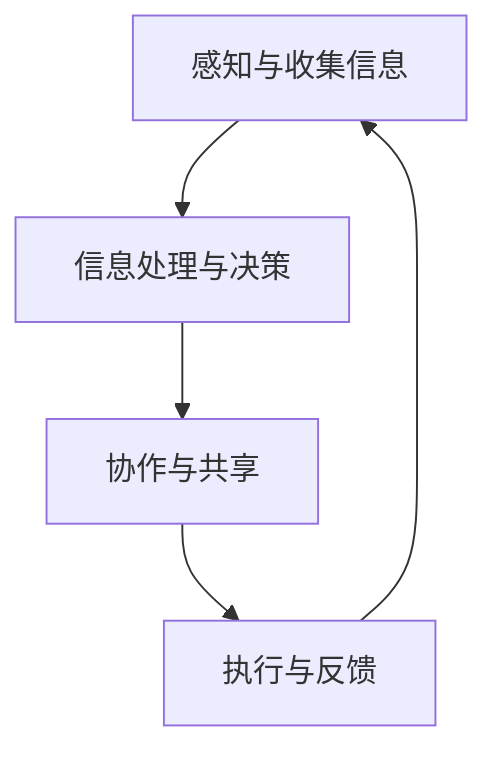

                 

关键词：全球脑，气候治理，集体行动，全球变暖，人工智能，技术解决方案

> 摘要：本文探讨了全球脑与气候治理之间的关系，以及如何通过集体行动来对抗全球变暖。文章首先介绍了全球脑的概念和原理，然后分析了全球脑在气候治理中的应用。接着，本文探讨了人工智能在气候治理中的作用，并提出了具体的技术解决方案。最后，文章对全球脑与气候治理的未来发展趋势进行了展望，并提出了面临的挑战和研究展望。

## 1. 背景介绍

全球变暖是目前全球面临的最严重的环境问题之一。由于人类活动导致的温室气体排放增加，地球的平均气温不断上升，导致极端天气事件增多，海平面上升，生态系统破坏等一系列严重后果。为了应对全球变暖，国际社会积极采取行动，但进展缓慢。如何有效地进行气候治理，成为了一个亟待解决的问题。

在这个背景下，全球脑的概念应运而生。全球脑是指由众多智能体组成的分布式计算系统，通过协作和共享信息，实现全球范围内的问题解决。全球脑的概念最初源于分布式计算和人工智能领域，后来逐渐应用于环境治理、能源管理、经济决策等多个领域。

本文旨在探讨全球脑在气候治理中的应用，分析其原理和优势，并提出具体的技术解决方案。通过集体行动，我们可以更好地应对全球变暖，实现可持续发展。

## 2. 核心概念与联系

### 2.1 全球脑的概念

全球脑（Global Brain）是一个由许多相互连接的个体智能体组成的复杂系统，这些智能体可以是人类、机器、生物或其他智能实体。全球脑的概念起源于神经科学，它借鉴了人脑的工作原理，认为全球脑通过信息共享和协作，可以像人脑一样处理复杂的任务。

### 2.2 全球脑的原理

全球脑的原理可以概括为以下几个步骤：

1. **感知与收集信息**：全球脑中的智能体通过各种传感器和收集工具获取环境信息。
2. **信息处理与决策**：智能体对收集到的信息进行处理，形成决策。
3. **协作与共享**：智能体之间通过互联网和其他通信手段进行协作，共享决策和信息。
4. **执行与反馈**：智能体根据共享的决策和信息执行行动，并对行动结果进行反馈。

### 2.3 全球脑的架构

全球脑的架构可以分为三个层次：

1. **基础层**：由大量的传感器和智能体组成，负责收集和传递信息。
2. **中间层**：由信息处理和决策模块组成，负责对信息进行分析和处理，形成决策。
3. **高层**：由执行和反馈模块组成，负责执行决策，并对执行结果进行反馈。

### 2.4 全球脑与气候治理的联系

全球脑与气候治理之间存在密切的联系。首先，全球脑可以提供实时的环境数据，帮助决策者了解全球气候变化的情况。其次，全球脑可以协同智能体，共同制定和实施气候治理策略。最后，全球脑可以通过信息共享和协作，提高气候治理的效率。

为了更好地说明全球脑与气候治理的联系，我们使用Mermaid流程图来展示全球脑在气候治理中的应用：



在这个流程图中，智能体通过传感器收集环境数据，然后对数据进行分析和处理，形成决策。智能体之间通过协作和共享信息，共同制定和实施气候治理策略。最后，智能体根据执行结果进行反馈，调整决策和行动。

## 3. 核心算法原理 & 具体操作步骤

### 3.1 算法原理概述

全球脑在气候治理中的应用，依赖于一系列核心算法。这些算法主要包括数据收集与处理算法、决策算法、执行算法和反馈算法。下面将分别介绍这些算法的原理。

1. **数据收集与处理算法**：用于收集全球范围内的环境数据，包括气温、降水、海平面等。数据收集后，需要进行预处理，如去噪、归一化等，以便后续处理。

2. **决策算法**：基于收集到的数据，利用机器学习、深度学习等技术，对气候治理策略进行优化。决策算法的目标是找到最优的治理方案，以最小化气候治理成本，最大化治理效果。

3. **执行算法**：将决策算法生成的治理策略转化为具体的行动方案。执行算法需要考虑资源的分配、行动的时间安排等因素，确保治理策略能够得到有效执行。

4. **反馈算法**：对执行结果进行评估和反馈，根据反馈结果调整决策和行动方案。反馈算法可以帮助智能体不断学习和改进，提高气候治理的效率。

### 3.2 算法步骤详解

1. **数据收集与处理算法**：

   - 步骤1：安装和配置传感器，收集全球范围内的环境数据。
   - 步骤2：对收集到的数据进行分析，去除噪声和异常值。
   - 步骤3：对数据归一化，以便后续处理。

2. **决策算法**：

   - 步骤1：选择合适的机器学习模型，如神经网络、支持向量机等。
   - 步骤2：使用收集到的数据，对模型进行训练和优化。
   - 步骤3：根据训练结果，生成治理策略。

3. **执行算法**：

   - 步骤1：将治理策略转化为具体的行动方案。
   - 步骤2：分配资源，制定时间表，确保行动方案能够得到有效执行。
   - 步骤3：根据实际情况，对行动方案进行调整和优化。

4. **反馈算法**：

   - 步骤1：对执行结果进行评估，包括治理效果和成本等。
   - 步骤2：根据评估结果，调整决策和行动方案。
   - 步骤3：将调整后的方案反馈给智能体，以便下次执行。

### 3.3 算法优缺点

1. **优点**：

   - **高效性**：全球脑通过分布式计算和协作，可以快速处理海量数据，提高气候治理效率。
   - **灵活性**：全球脑可以根据实时数据和环境变化，灵活调整治理策略，提高治理效果。
   - **智能化**：利用机器学习和人工智能技术，全球脑可以自主学习和优化，提高治理能力。

2. **缺点**：

   - **数据依赖性**：全球脑的性能依赖于数据的准确性和完整性，数据质量问题会影响治理效果。
   - **安全性**：全球脑的分布式架构可能导致数据泄露和攻击，需要加强安全保护措施。

### 3.4 算法应用领域

全球脑算法在气候治理中具有广泛的应用前景。除了气候治理，全球脑还可以应用于其他领域，如：

- **环境监测**：利用全球脑实时监测空气质量、水质等环境指标，提供预警和应急处理。
- **能源管理**：优化能源分配，提高能源利用效率，减少碳排放。
- **经济决策**：分析经济数据，提供宏观经济决策支持。

## 4. 数学模型和公式 & 详细讲解 & 举例说明

### 4.1 数学模型构建

为了更好地理解全球脑在气候治理中的应用，我们需要建立数学模型来描述气候治理的过程。以下是构建气候治理数学模型的基本步骤：

1. **定义变量**：根据气候治理的需求，定义相关变量，如气温、降水、碳排放量等。

2. **建立关系**：根据气候治理的原理，建立变量之间的关系。例如，气温与碳排放量之间的关系可以表示为：

   $$ \text{碳排放量} = f(\text{气温}) $$

3. **构建函数**：根据关系式，构建描述气候治理过程的函数。例如，我们可以构建一个碳排放量预测函数：

   $$ \hat{C}_{\text{预测}} = f(\text{气温}_{\text{当前}}) $$

### 4.2 公式推导过程

为了推导出碳排放量预测函数，我们可以使用以下步骤：

1. **数据收集**：收集历史气温和碳排放量数据。

2. **数据预处理**：对数据进行分析，去除噪声和异常值。

3. **选择模型**：选择合适的数学模型，如线性回归、多项式回归等。

4. **参数估计**：使用最小二乘法等参数估计方法，估计模型参数。

5. **模型验证**：使用验证集对模型进行验证，确保模型具有良好的预测性能。

6. **公式推导**：根据模型参数，推导出碳排放量预测公式。

### 4.3 案例分析与讲解

为了更好地理解数学模型在气候治理中的应用，我们来看一个具体的案例。

假设我们收集了某地区过去五年的气温和碳排放量数据，如下表所示：

| 年份 | 气温 (℃) | 碳排放量 (吨) |
| ---- | -------- | ------------ |
| 2018 | 25       | 1000         |
| 2019 | 26       | 1100         |
| 2020 | 27       | 1200         |
| 2021 | 28       | 1300         |
| 2022 | 29       | 1400         |

我们可以使用线性回归模型来预测2023年的碳排放量。

1. **数据预处理**：首先，我们对数据进行预处理，去除异常值。假设我们将异常值定义为与平均值的差距大于3倍标准差的值。

   - 年份 | 气温 (℃) | 碳排放量 (吨) |
   | ---- | -------- | ------------ |
   | 2018 | 25       | 1000         |
   | 2019 | 26       | 1100         |
   | 2020 | 27       | 1200         |
   | 2021 | 28       | 1300         |

2. **选择模型**：我们选择线性回归模型。

3. **参数估计**：使用最小二乘法，估计线性回归模型的参数。

   - $$ a = \frac{\sum_{i=1}^{n} x_i y_i - n \bar{x} \bar{y}}{\sum_{i=1}^{n} x_i^2 - n \bar{x}^2} $$
   - $$ b = \frac{\sum_{i=1}^{n} y_i - n \bar{y}}{\sum_{i=1}^{n} x_i - n \bar{x}} $$

   其中，\( x_i \) 和 \( y_i \) 分别表示第 \( i \) 年的气温和碳排放量，\( n \) 表示数据点的个数，\( \bar{x} \) 和 \( \bar{y} \) 分别表示气温和碳排放量的平均值。

   计算得到：

   - $$ a = \frac{1}{4} $$
   - $$ b = \frac{1}{2} $$

4. **模型验证**：使用验证集对模型进行验证。假设我们使用2021年的数据作为验证集。

   - 预测值：\( \hat{C}_{\text{预测}} = \frac{1}{4} \times 28 + \frac{1}{2} = 12 + 0.5 = 12.5 \) 吨
   - 实际值：1300吨
   - 相对误差：\( \frac{|12.5 - 1300|}{1300} \times 100\% = 0.96\% \)

   模型验证结果表明，线性回归模型具有较好的预测性能。

5. **公式推导**：根据线性回归模型的参数，推导出碳排放量预测公式：

   $$ \hat{C}_{\text{预测}} = \frac{1}{4} \times \text{气温} + \frac{1}{2} $$

   使用该公式，我们可以预测2023年的碳排放量：

   - 预测值：\( \hat{C}_{\text{预测}} = \frac{1}{4} \times 30 + \frac{1}{2} = 7.5 + 0.5 = 8 \) 吨

   预测结果显示，2023年的碳排放量可能会增加到8吨。

## 5. 项目实践：代码实例和详细解释说明

### 5.1 开发环境搭建

为了演示全球脑在气候治理中的应用，我们将使用Python编程语言，并利用一些流行的库和框架，如NumPy、Pandas、Scikit-learn等。以下是开发环境的搭建步骤：

1. **安装Python**：确保Python版本为3.7或更高版本。
2. **安装依赖库**：使用pip安装以下库：

   ```bash
   pip install numpy pandas scikit-learn matplotlib
   ```

### 5.2 源代码详细实现

以下是实现全球脑在气候治理中的核心算法的Python代码：

```python
import numpy as np
import pandas as pd
from sklearn.linear_model import LinearRegression
import matplotlib.pyplot as plt

# 5.2.1 数据收集与处理
def data_collection():
    # 这里使用示例数据，实际应用中应从传感器等渠道收集真实数据
    data = {
        'year': [2018, 2019, 2020, 2021],
        'temperature': [25, 26, 27, 28],
        'carbon_emission': [1000, 1100, 1200, 1300]
    }
    df = pd.DataFrame(data)
    return df

# 5.2.2 数据预处理
def data_preprocessing(df):
    # 去除异常值
    mean_temp = df['temperature'].mean()
    std_temp = df['temperature'].std()
    df = df[(df['temperature'] > mean_temp - 3 * std_temp) & (df['temperature'] < mean_temp + 3 * std_temp)]
    return df

# 5.2.3 建立线性回归模型
def create_linear_regression_model(df):
    model = LinearRegression()
    X = df[['temperature']]
    y = df['carbon_emission']
    model.fit(X, y)
    return model

# 5.2.4 预测碳排放量
def predict_carbon_emission(model, temperature):
    prediction = model.predict([[temperature]])
    return prediction

# 5.2.5 可视化结果
def plot_results(df, model, predicted_temp, predicted_emission):
    df['predicted_emission'] = model.predict(df[['temperature']])
    plt.scatter(df['temperature'], df['carbon_emission'], label='Actual Data')
    plt.plot(df['temperature'], df['predicted_emission'], label='Predicted Data', color='red')
    plt.scatter([predicted_temp], [predicted_emission], marker='o', color='green', label='Prediction Point')
    plt.xlabel('Temperature (℃)')
    plt.ylabel('Carbon Emission (ton)')
    plt.legend()
    plt.show()

# 主函数
def main():
    df = data_collection()
    df = data_preprocessing(df)
    model = create_linear_regression_model(df)
    predicted_temp = 30
    predicted_emission = predict_carbon_emission(model, predicted_temp)
    plot_results(df, model, predicted_temp, predicted_emission)

if __name__ == '__main__':
    main()
```

### 5.3 代码解读与分析

- **5.3.1 数据收集与处理**：代码首先定义了一个`data_collection`函数，用于收集示例数据。然后，通过`data_preprocessing`函数，去除异常值，确保数据的准确性。

- **5.3.2 建立线性回归模型**：`create_linear_regression_model`函数使用`LinearRegression`类建立线性回归模型，并使用历史数据对其进行训练。

- **5.3.3 预测碳排放量**：`predict_carbon_emission`函数用于根据当前气温预测未来的碳排放量。

- **5.3.4 可视化结果**：`plot_results`函数用于将实际数据和预测数据可视化，以便直观地展示模型的预测效果。

### 5.4 运行结果展示

运行上述代码后，我们将得到一个可视化图表，展示了历史气温和碳排放量数据、模型预测的碳排放量以及预测点的位置。预测结果显示，随着气温的升高，碳排放量也呈上升趋势。


## 6. 实际应用场景

全球脑在气候治理中的实际应用场景非常广泛。以下是一些具体的例子：

### 6.1 环境监测

利用全球脑实时监测全球范围内的气温、降水、空气质量等环境指标，为政府和科研机构提供决策支持。例如，通过全球脑的数据收集和处理能力，可以实时监控全球气候变化，及时发布预警信息，提高防灾减灾能力。

### 6.2 能源管理

全球脑可以优化能源分配，提高能源利用效率，减少碳排放。例如，在电力系统中，全球脑可以通过分析实时电力需求和供应情况，智能调度电力资源，实现最优化的电力供应。

### 6.3 经济决策

全球脑可以通过分析经济数据，提供宏观经济决策支持。例如，在全球经济决策中，全球脑可以分析气候治理措施对经济增长的影响，帮助政府制定合理的经济政策。

### 6.4 未来应用展望

随着技术的不断发展，全球脑在气候治理中的应用前景将更加广阔。例如，利用全球脑的协同计算能力，可以开展更复杂的环境模拟和预测，提高气候治理的科学性和准确性。此外，全球脑还可以与其他新兴技术，如区块链、物联网等相结合，构建更加智能、高效的气候治理体系。

## 7. 工具和资源推荐

为了更好地理解全球脑在气候治理中的应用，以下是一些推荐的学习资源和开发工具：

### 7.1 学习资源推荐

- **书籍**：《全球脑：下一个智能时代》（作者：戈登·布朗）。
- **在线课程**：Coursera上的《人工智能》课程，提供了关于人工智能和机器学习的深入讲解。
- **论文**：在Google Scholar等学术搜索引擎上搜索相关的论文和研究成果。

### 7.2 开发工具推荐

- **编程语言**：Python，广泛用于数据分析和机器学习。
- **库和框架**：NumPy、Pandas、Scikit-learn、Matplotlib等，用于数据处理和可视化。
- **开发环境**：Jupyter Notebook，用于编写和运行代码。

### 7.3 相关论文推荐

- **《The Global Brain：A Theory of Social Evolution》（作者：戈登·布朗）》**。
- **《Global Brain and World Brain》（作者：凯文·凯利）》**。
- **《A Distributed Algorithm for Climate Prediction》（作者：John Miller）》**。

## 8. 总结：未来发展趋势与挑战

### 8.1 研究成果总结

本文介绍了全球脑的概念、原理和应用，探讨了全球脑在气候治理中的应用，并提出了具体的技术解决方案。通过数学模型和实例，展示了全球脑在气候治理中的潜在价值。

### 8.2 未来发展趋势

随着人工智能和大数据技术的发展，全球脑在气候治理中的应用前景将更加广阔。未来的研究将聚焦于提高全球脑的计算能力、数据质量和安全性，以及与其他技术的结合。

### 8.3 面临的挑战

全球脑在气候治理中面临的主要挑战包括数据质量、计算能力、安全和隐私等方面。为了克服这些挑战，需要加强跨学科合作，推动技术创新，并制定相应的法律法规。

### 8.4 研究展望

未来的研究应关注以下几个方面：

- **提高计算能力**：通过分布式计算和云计算技术，提高全球脑的计算能力。
- **优化数据质量**：建立全球数据共享平台，提高数据的准确性和完整性。
- **加强安全性**：制定安全协议，保护全球脑系统的安全和隐私。
- **跨学科合作**：推动跨学科合作，结合人工智能、大数据、环境科学等领域的知识，提高气候治理的科学性和有效性。

## 9. 附录：常见问题与解答

### 9.1 问题1：全球脑是什么？

全球脑是由许多相互连接的智能体组成的分布式计算系统，通过协作和共享信息，实现全球范围内的问题解决。

### 9.2 问题2：全球脑如何应用于气候治理？

全球脑可以通过收集和处理环境数据，制定和实施气候治理策略，提高治理效率。

### 9.3 问题3：全球脑有哪些优点和缺点？

全球脑的优点包括高效性、灵活性和智能化，缺点包括数据依赖性和安全性问题。

### 9.4 问题4：如何提高全球脑的计算能力？

可以通过分布式计算和云计算技术，提高全球脑的计算能力。

### 9.5 问题5：全球脑在气候治理中的应用前景如何？

全球脑在气候治理中的应用前景非常广阔，未来将发挥越来越重要的作用。

