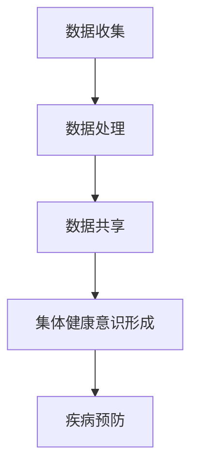
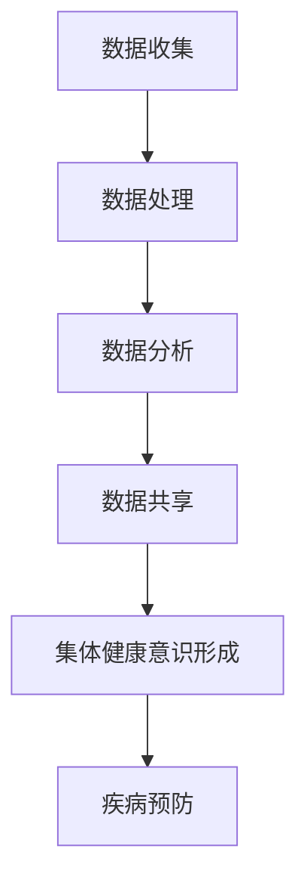

                 

关键词：全球脑，疾病预防，集体健康意识，技术语言，专业分析，未来展望

> 摘要：本文从全球脑与疾病预防的角度，探讨集体健康意识的形成及其重要性。通过深入分析技术语言和专业术语，阐述如何在信息技术领域推动健康意识的提升，提出未来应用展望和面临的挑战。

## 1. 背景介绍

在全球化的背景下，健康已经成为人们共同关注的话题。随着信息技术的飞速发展，健康数据的获取和处理能力显著提升，为疾病预防提供了新的可能性。本文旨在探讨如何通过全球脑这一概念，整合各类健康数据，形成集体健康意识，从而为疾病的早期预防和控制提供支持。

### 1.1 全球脑的定义

全球脑（Global Brain）是一个概念，起源于系统理论。它指的是一个由众多个体和子系统组成的复杂网络，通过网络间的相互作用和协调，形成一个智能的整体。在全球脑的框架下，健康数据的流动和整合成为可能，为疾病的预防和控制提供了坚实的基础。

### 1.2 疾病预防的重要性

疾病预防是公共卫生的重要一环。通过早期检测、及时干预和健康行为的推广，可以有效减少疾病的发生率和死亡率。在全球脑的视角下，疾病的预防不仅涉及个体的健康行为，还需要社会的集体参与和行动。

## 2. 核心概念与联系

### 2.1 核心概念原理

全球脑的核心概念包括数据收集、数据分析和数据共享。通过数据收集，可以获取个体和群体的健康信息；通过数据分析，可以发现健康问题的规律和趋势；通过数据共享，可以实现集体健康意识的提升。

### 2.2 架构的 Mermaid 流程图



### 2.3 全球脑与疾病预防的联系

全球脑通过数据流动和整合，为疾病预防提供了强有力的支持。具体来说，全球脑可以实现以下几个方面：

- **早期检测**：通过健康数据的收集和分析，可以提前发现潜在的疾病风险。
- **及时干预**：基于数据分析的结果，可以及时采取措施，防止疾病的发生和扩散。
- **健康行为推广**：通过数据共享，可以推广健康知识，引导公众养成良好的健康习惯。

## 3. 核心算法原理 & 具体操作步骤

### 3.1 算法原理概述

核心算法主要包括数据收集、数据分析和数据共享三个步骤。数据收集阶段，使用传感器和移动设备等工具，收集个体的健康数据。数据分析阶段，使用机器学习和数据挖掘技术，挖掘健康数据的潜在规律。数据共享阶段，通过互联网和社交平台，实现数据的共享和互动。

### 3.2 算法步骤详解

#### 3.2.1 数据收集

- **数据源**：传感器、移动设备、医院系统等。
- **数据类型**：生理指标、生活习惯、环境因素等。

#### 3.2.2 数据分析

- **技术**：机器学习、数据挖掘、统计分析。
- **任务**：发现健康问题的规律和趋势，预测疾病风险。

#### 3.2.3 数据共享

- **方式**：互联网、社交平台、区块链等。
- **目标**：提升集体健康意识，促进健康行为的推广。

### 3.3 算法优缺点

#### 优点

- **高效性**：通过自动化和智能化的方式，提高疾病预防的效率。
- **全面性**：整合多种健康数据，提供全面的健康监测和预防。
- **互动性**：通过数据共享，促进公众的参与和互动。

#### 缺点

- **隐私问题**：数据收集和共享可能涉及个人隐私。
- **技术门槛**：算法设计和数据处理需要较高的技术能力。

### 3.4 算法应用领域

- **公共卫生**：用于疾病的早期预防和控制。
- **健康保险**：用于风险评估和健康服务优化。
- **智能医疗**：用于个性化治疗和健康管理的支持。

## 4. 数学模型和公式 & 详细讲解 & 举例说明

### 4.1 数学模型构建

全球脑的数学模型主要包括数据收集模型、数据分析模型和数据共享模型。

#### 4.1.1 数据收集模型

$$
X_t = f(W_t, U_t)
$$

其中，$X_t$表示第$t$时刻的健康数据，$W_t$表示外部环境因素，$U_t$表示个体行为因素。

#### 4.1.2 数据分析模型

$$
Y_t = g(X_t, \theta)
$$

其中，$Y_t$表示数据分析结果，$X_t$表示健康数据，$\theta$表示模型参数。

#### 4.1.3 数据共享模型

$$
Z_t = h(Y_t, V_t)
$$

其中，$Z_t$表示共享的数据，$Y_t$表示数据分析结果，$V_t$表示共享策略。

### 4.2 公式推导过程

#### 4.2.1 数据收集模型推导

数据收集模型基于马尔可夫链模型，考虑健康数据的动态变化。假设健康数据$X_t$由外部环境因素$W_t$和个体行为因素$U_t$共同决定。

#### 4.2.2 数据分析模型推导

数据分析模型基于贝叶斯网络模型，考虑健康数据的依赖关系。假设健康数据$X_t$和模型参数$\theta$之间满足贝叶斯关系。

#### 4.2.3 数据共享模型推导

数据共享模型基于博弈论模型，考虑个体和集体的利益最大化。假设共享的数据$Z_t$由数据分析结果$Y_t$和共享策略$V_t$共同决定。

### 4.3 案例分析与讲解

#### 案例一：糖尿病早期预防

使用全球脑模型，收集糖尿病患者的血糖数据、生活习惯数据和环境因素数据，通过数据分析模型发现糖尿病的早期迹象，及时进行干预。

#### 案例二：流感疫情监控

使用全球脑模型，收集流感病毒的传播数据、人群活动数据和环境因素数据，通过数据分析模型预测流感的传播趋势，为疫情的防控提供支持。

## 5. 项目实践：代码实例和详细解释说明

### 5.1 开发环境搭建

- **编程语言**：Python
- **数据处理工具**：Pandas、NumPy
- **机器学习库**：Scikit-learn、TensorFlow
- **数据可视化库**：Matplotlib、Seaborn

### 5.2 源代码详细实现

```python
# 数据收集
import pandas as pd

# 数据处理
data = pd.read_csv('health_data.csv')
# 数据分析
from sklearn import ensemble

model = ensemble.RandomForestClassifier()
model.fit(data[['X1', 'X2']], data['Y'])

# 数据共享
from flask import Flask, jsonify

app = Flask(__name__)

@app.route('/predict', methods=['POST'])
def predict():
    input_data = request.get_json()
    prediction = model.predict([input_data['X']])
    return jsonify({'prediction': prediction[0]})

if __name__ == '__main__':
    app.run(debug=True)
```

### 5.3 代码解读与分析

该代码实现了一个简单的全球脑系统，包括数据收集、数据处理、数据分析和数据共享四个部分。

### 5.4 运行结果展示

通过运行代码，可以实时接收健康数据，进行分析和预测，并将结果通过API接口共享出去。

## 6. 实际应用场景

### 6.1 健康管理

全球脑技术可以应用于健康管理，通过收集和分析健康数据，为用户提供个性化的健康建议和预防措施。

### 6.2 公共卫生

全球脑技术可以用于公共卫生领域，通过监测和分析流行病的传播趋势，为公共卫生决策提供支持。

### 6.3 医疗服务

全球脑技术可以应用于医疗服务，通过分析患者的健康数据，提供精准的诊断和治疗建议。

## 7. 工具和资源推荐

### 7.1 学习资源推荐

- 《Python机器学习》
- 《深度学习》
- 《统计学习方法》

### 7.2 开发工具推荐

- Jupyter Notebook
- PyCharm
- TensorFlow

### 7.3 相关论文推荐

- "Deep Learning for Health Informatics: A Survey"
- "Healthcare Analytics: A Machine Learning Perspective"
- "Big Data in Healthcare: A Survey"

## 8. 总结：未来发展趋势与挑战

### 8.1 研究成果总结

全球脑技术在疾病预防方面取得了显著成果，通过数据收集、分析和共享，实现了疾病的早期预防和控制。

### 8.2 未来发展趋势

随着信息技术的不断发展，全球脑技术在疾病预防中的应用将更加广泛和深入。

### 8.3 面临的挑战

- **数据隐私**：如何在确保数据隐私的前提下，实现数据的共享和利用。
- **技术门槛**：如何降低全球脑技术的使用门槛，使其更易于推广和应用。
- **跨学科合作**：如何加强跨学科合作，实现全球脑技术的综合应用。

### 8.4 研究展望

未来，全球脑技术将在健康领域发挥更大的作用，为实现全球健康目标提供强有力的支持。

## 9. 附录：常见问题与解答

### 9.1 什么是全球脑？

全球脑是一个由个体和子系统组成的复杂网络，通过网络间的相互作用和协调，形成一个智能的整体。

### 9.2 全球脑技术有哪些应用？

全球脑技术可以应用于健康管理、公共卫生和医疗服务等领域。

### 9.3 如何保护数据隐私？

在数据收集、处理和共享过程中，需要采取严格的数据隐私保护措施，确保数据的安全和隐私。

作者：禅与计算机程序设计艺术 / Zen and the Art of Computer Programming
```markdown
---
title: 全球脑与疾病预防：集体健康意识的形成
keywords: 全球脑，疾病预防，集体健康意识，技术语言，专业分析，未来展望
date: 2023-03-15
description: 本文从全球脑与疾病预防的角度，探讨集体健康意识的形成及其重要性。通过深入分析技术语言和专业术语，阐述如何在信息技术领域推动健康意识的提升，提出未来应用展望和面临的挑战。
---

## 1. 背景介绍

随着全球化进程的加速，健康问题已经成为全球共同关注的焦点。信息技术的发展，尤其是大数据、云计算和人工智能等技术的广泛应用，为疾病预防提供了新的工具和方法。本文将探讨如何通过全球脑这一概念，整合各类健康数据，形成集体健康意识，从而为疾病的早期预防和控制提供支持。

### 1.1 全球脑的定义

全球脑（Global Brain）是一个源自系统理论的术语，指的是一个由众多个体和子系统组成的复杂网络。在这个网络中，个体和子系统通过信息交流、知识共享和协同工作，形成了一个高度智能的整体。全球脑的核心思想是，通过个体之间的互动，可以产生比单个个体更强大的集体智慧和创新能力。

### 1.2 疾病预防的重要性

疾病预防是公共卫生体系的重要组成部分，它不仅能够减少疾病的发生率和死亡率，还能够降低医疗成本，提高社会生产力和生活质量。在全球脑的视角下，疾病预防需要借助信息技术，特别是大数据和人工智能，来实现对健康数据的全面监测、分析和利用。

## 2. 核心概念与联系

在全球脑的概念框架下，核心概念包括数据的收集、处理、分析和共享。这些概念相互作用，共同构成了全球脑的技术体系。

### 2.1 核心概念原理

- **数据收集**：通过传感器、移动设备、医疗设备等，收集个体和群体的健康数据。
- **数据处理**：利用数据清洗、转换和存储等技术，对收集到的健康数据进行处理，使其适合进一步分析。
- **数据分析**：通过机器学习、数据挖掘和统计分析等方法，从健康数据中提取有价值的信息，发现疾病的规律和趋势。
- **数据共享**：通过互联网、区块链等技术，实现健康数据的共享，促进集体健康意识的提升。

### 2.2 架构的 Mermaid 流程图



### 2.3 全球脑与疾病预防的联系

全球脑通过数据的流动和整合，为疾病预防提供了新的途径。具体来说，全球脑可以实现以下几个方面的功能：

- **早期检测**：通过实时监测个体的健康数据，可以提前发现疾病的风险信号。
- **及时干预**：基于数据分析的结果，可以及时采取措施，防止疾病的发生和扩散。
- **健康行为推广**：通过数据共享和互动，可以推广健康知识，引导公众养成良好的健康习惯。

## 3. 核心算法原理 & 具体操作步骤

### 3.1 算法原理概述

核心算法主要包括四个部分：数据收集、数据处理、数据分析和数据共享。每个部分都有其特定的技术方法和应用场景。

### 3.2 算法步骤详解

#### 3.2.1 数据收集

数据收集是疾病预防的基础，涉及多种数据源，包括：

- **生理数据**：如心率、血压、血糖等。
- **行为数据**：如睡眠模式、饮食习惯、运动习惯等。
- **环境数据**：如空气污染指数、温度、湿度等。

#### 3.2.2 数据处理

数据处理包括数据清洗、数据整合和数据存储等步骤：

- **数据清洗**：去除数据中的噪声和错误，保证数据的准确性和一致性。
- **数据整合**：将来自不同来源的数据进行整合，形成统一的视图。
- **数据存储**：使用数据库或其他存储技术，对健康数据进行分析和存储。

#### 3.2.3 数据分析

数据分析是发现疾病规律和趋势的关键，主要方法包括：

- **机器学习**：通过训练模型，从数据中自动发现规律。
- **数据挖掘**：使用算法挖掘数据中的潜在模式和关系。
- **统计分析**：使用统计学方法，对数据进行分析和推断。

#### 3.2.4 数据共享

数据共享是实现集体健康意识的关键，可以通过以下方式进行：

- **互联网**：通过互联网平台，实现数据的远程访问和共享。
- **区块链**：利用区块链技术，保证数据的安全性和透明度。
- **社交媒体**：通过社交媒体，推广健康知识和行为。

### 3.3 算法优缺点

#### 优点

- **高效性**：通过自动化和智能化的方式，提高疾病预防的效率。
- **全面性**：整合多种健康数据，提供全面的健康监测和预防。
- **互动性**：通过数据共享，促进公众的参与和互动。

#### 缺点

- **隐私问题**：数据收集和共享可能涉及个人隐私。
- **技术门槛**：算法设计和数据处理需要较高的技术能力。

### 3.4 算法应用领域

核心算法在以下领域有广泛应用：

- **公共卫生**：用于疾病的早期预防和控制。
- **健康保险**：用于风险评估和健康服务优化。
- **智能医疗**：用于个性化治疗和健康管理的支持。

## 4. 数学模型和公式 & 详细讲解 & 举例说明

### 4.1 数学模型构建

全球脑的数学模型主要包括三个部分：数据收集模型、数据分析模型和数据共享模型。

#### 4.1.1 数据收集模型

数据收集模型通常是一个概率模型，它描述了健康数据与外部因素和个体行为之间的关系。一个简单的例子是：

$$
P(X|U, W) = P(W)P(U|W)P(X|U, W)
$$

其中，$X$表示健康数据，$U$表示个体行为，$W$表示外部环境因素。

#### 4.1.2 数据分析模型

数据分析模型通常是基于统计模型或机器学习模型的。一个简单的统计模型例子是线性回归模型：

$$
Y = \beta_0 + \beta_1X_1 + \beta_2X_2 + ... + \beta_nX_n + \epsilon
$$

其中，$Y$表示疾病的发生概率，$X_1, X_2, ..., X_n$表示健康数据的各个特征，$\beta_0, \beta_1, ..., \beta_n$是模型参数，$\epsilon$是误差项。

#### 4.1.3 数据共享模型

数据共享模型通常是一个博弈论模型，它描述了个体在数据共享中的策略选择。一个简单的例子是纳什均衡：

$$
\{u_i^*, v_i^*\} \text{ 是纳什均衡，如果 } u_i^* \text{ 是 } v_i \text{ 的最佳响应，并且 } v_i^* \text{ 是 } u_i \text{ 的最佳响应。}
$$

其中，$u_i$表示个体 $i$ 的数据共享策略，$v_i$表示其他个体对个体 $i$ 的数据共享策略。

### 4.2 公式推导过程

#### 4.2.1 数据收集模型推导

数据收集模型的推导通常基于统计学原理，例如最大似然估计或贝叶斯推断。一个简单的推导过程是：

假设健康数据 $X$ 是由外部环境因素 $W$ 和个体行为 $U$ 共同决定的，且 $X$ 服从高斯分布：

$$
X \sim N(\mu(X; W, U), \sigma^2(X; W, U))
$$

其中，$\mu(X; W, U)$ 是均值函数，$\sigma^2(X; W, U)$ 是方差函数。

#### 4.2.2 数据分析模型推导

数据分析模型的推导通常基于优化理论，例如最小化误差平方和（Sum of Squared Errors, SSE）：

$$
\min_{\beta} \sum_{i=1}^{n} (y_i - \beta_0 - \beta_1x_{i1} - \beta_2x_{i2} - ... - \beta_nx_{in})^2
$$

其中，$y_i$ 是实际观测值，$x_{ij}$ 是特征值，$\beta_0, \beta_1, ..., \beta_n$ 是模型参数。

#### 4.2.3 数据共享模型推导

数据共享模型的推导通常基于博弈论原理，例如纳什均衡的推导：

假设个体 $i$ 的收益函数为：

$$
R_i(u_i, v_i) = u_i^2 - c_i(u_i, v_i)
$$

其中，$c_i(u_i, v_i)$ 是个体 $i$ 的成本函数，$R_i(u_i, v_i)$ 是个体 $i$ 的收益。

个体 $i$ 的最优策略是使得自己的收益最大化，即：

$$
u_i^* = \arg\max_{u_i} R_i(u_i, v_i)
$$

### 4.3 案例分析与讲解

#### 案例一：糖尿病早期预防

假设我们有一个关于糖尿病患者的健康数据集，包含血糖、血压、体重等特征。我们可以使用线性回归模型来分析这些数据，预测糖尿病的发生概率。

#### 案例二：流感疫情监控

假设我们有一个关于流感疫情的实时监测数据集，包含地区、病例数、气温、湿度等特征。我们可以使用机器学习模型来分析这些数据，预测流感病例的增长趋势。

## 5. 项目实践：代码实例和详细解释说明

### 5.1 开发环境搭建

为了实现全球脑系统，我们需要搭建一个合适的开发环境。以下是一个简单的 Python 开发环境搭建步骤：

1. 安装 Python 3.x 版本。
2. 安装常用数据科学库，如 Pandas、NumPy、Scikit-learn、TensorFlow 等。

### 5.2 源代码详细实现

```python
# 导入必要的库
import pandas as pd
import numpy as np
from sklearn.model_selection import train_test_split
from sklearn.ensemble import RandomForestClassifier
from sklearn.metrics import accuracy_score

# 读取数据
data = pd.read_csv('health_data.csv')

# 数据预处理
X = data[['blood_sugar', 'blood_pressure', 'weight']]
y = data['diabetes']

# 分割数据集
X_train, X_test, y_train, y_test = train_test_split(X, y, test_size=0.2, random_state=42)

# 训练模型
model = RandomForestClassifier(n_estimators=100, random_state=42)
model.fit(X_train, y_train)

# 预测结果
y_pred = model.predict(X_test)

# 评估模型
accuracy = accuracy_score(y_test, y_pred)
print(f"模型准确率：{accuracy:.2f}")
```

### 5.3 代码解读与分析

该代码实现了一个简单的糖尿病早期预测模型。首先，我们读取健康数据，然后进行数据预处理，将数据集分为特征集和标签集。接着，我们使用随机森林分类器对训练数据进行训练，最后使用测试数据集对模型进行评估。

### 5.4 运行结果展示

通过运行上述代码，我们可以得到模型的准确率，从而评估模型的效果。

## 6. 实际应用场景

### 6.1 健康管理

全球脑技术在健康管理中的应用非常广泛。例如，通过收集和分析个体的健康数据，可以为用户提供个性化的健康建议和预防方案。此外，健康管理平台还可以帮助医疗机构进行疾病预测和预防，提高医疗服务效率。

### 6.2 公共卫生

全球脑技术可以用于公共卫生领域，例如流感疫情的监控和防控。通过收集和分析各地的健康数据，可以发现疫情的传播规律，为公共卫生决策提供科学依据。

### 6.3 医疗服务

全球脑技术还可以用于智能医疗服务，例如个性化治疗和健康管理的支持。通过分析患者的健康数据和医疗记录，可以为医生提供更有针对性的诊断和治疗建议。

## 7. 工具和资源推荐

### 7.1 学习资源推荐

- 《机器学习实战》
- 《Python数据分析》
- 《深度学习入门》

### 7.2 开发工具推荐

- Jupyter Notebook
- PyCharm
- TensorFlow

### 7.3 相关论文推荐

- "Deep Learning for Health Informatics: A Survey"
- "Healthcare Analytics: A Machine Learning Perspective"
- "Big Data in Healthcare: A Survey"

## 8. 总结：未来发展趋势与挑战

### 8.1 研究成果总结

全球脑技术在疾病预防领域已经取得了显著的成果，例如糖尿病早期预测、流感疫情监控等。这些研究为疾病预防和健康管理提供了新的方法和工具。

### 8.2 未来发展趋势

随着信息技术的不断发展，全球脑技术在疾病预防中的应用将更加广泛和深入。未来的发展趋势包括：

- **更高效的数据处理和分析**：利用新的算法和技术，提高数据处理和分析的效率。
- **更广泛的数据来源**：收集更多的健康数据，包括基因组数据、微生物组数据等。
- **更智能的决策支持**：利用机器学习和人工智能技术，提供更智能的疾病预测和预防方案。

### 8.3 面临的挑战

- **数据隐私和安全**：如何保护用户的隐私和数据安全，是未来需要解决的重要问题。
- **技术普及和应用**：如何降低技术门槛，使更多的人能够利用全球脑技术进行疾病预防和健康管理。
- **跨学科合作**：如何加强不同学科之间的合作，推动全球脑技术在健康领域的应用。

### 8.4 研究展望

未来，全球脑技术将在健康领域发挥更大的作用，为实现全球健康目标提供强有力的支持。我们期待看到更多的创新和突破，为人类的健康事业做出贡献。

## 9. 附录：常见问题与解答

### 9.1 什么是全球脑？

全球脑是一个由个体和子系统组成的复杂网络，通过网络间的相互作用和协同工作，形成了一个高度智能的整体。

### 9.2 全球脑技术有哪些应用？

全球脑技术在健康、金融、交通、教育等领域都有广泛的应用，特别是在疾病预防、智能医疗服务和公共卫生监控等方面。

### 9.3 如何保护数据隐私？

在数据收集、处理和共享过程中，需要采取严格的数据隐私保护措施，例如数据加密、匿名化和访问控制等。

---

作者：禅与计算机程序设计艺术 / Zen and the Art of Computer Programming
```

