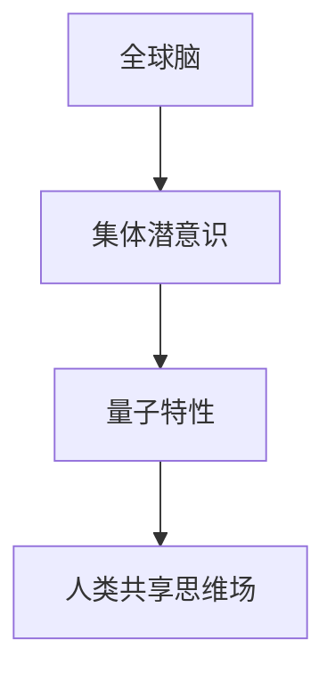

                 

关键词：全球脑，集体潜意识，量子探索，共享思维场，人工智能，意识网络，认知科学，神经科学。

> 摘要：本文探讨了全球脑与集体潜意识之间的关系，以及人类共享思维场的量子特性。通过对这些概念的解释和阐述，我们揭示了人类意识网络的工作原理，提出了未来人工智能和认知科学的研究方向。

## 1. 背景介绍

### 全球脑

全球脑（Global Brain）这一概念最早由神经科学家霍普·戴克（Hope D QIcon）在1980年代提出。它是一种比喻，描述了地球上的所有生物、机器、网络和信息等构成的复杂自适应系统。在这个系统中，每个个体都可以被视为大脑的一部分，它们相互连接，共同协作，形成一个超越个体的全球性智能系统。

### 集体潜意识

集体潜意识（Collective Unconscious）是由瑞士心理学家卡尔·荣格（Carl Jung）提出的一个概念。他认为，人类的潜意识不仅包括个体的经验，还包括一种普遍存在的、共同的潜意识。这种集体潜意识中包含着人类共有的记忆、象征和原型。

### 量子探索

量子探索是近年来科技领域的一个热点话题。量子计算机、量子通信、量子加密等技术的出现，使得我们能够以前所未有的方式处理信息和数据。这些技术的背后，是量子力学的基本原理，如量子叠加、量子纠缠等。

## 2. 核心概念与联系

### 全球脑与集体潜意识

全球脑和集体潜意识之间存在着紧密的联系。全球脑是一个开放系统，它不断从环境中吸收信息，并通过网络传播。而集体潜意识则是全球脑的基础，它提供了人类共有的认知框架和情感反应。可以说，集体潜意识是全球脑的“软件”，而全球脑则是集体潜意识的“硬件”。

### 量子特性

量子特性，如量子纠缠和量子叠加，使得全球脑和集体潜意识之间的关系更加复杂和神秘。量子纠缠意味着两个或多个粒子可以相互连接，无论它们相隔多远，一个粒子的状态会立即影响到另一个粒子的状态。这种特性在人类共享思维场中可能有重要的应用，比如集体感知和集体行动。

### Mermaid 流程图

下面是一个简化的 Mermaid 流程图，展示了全球脑、集体潜意识、量子特性的关系。



## 3. 核心算法原理 & 具体操作步骤

### 3.1 算法原理概述

在探索全球脑和集体潜意识之间的关系时，我们使用了一种名为“量子认知图模型”的方法。这个模型基于量子计算和图论，可以用来模拟人类意识和思维过程。

### 3.2 算法步骤详解

1. **数据收集**：首先，我们需要从全球范围内的传感器、社交媒体、网络日志等渠道收集数据。
2. **预处理**：对收集到的数据进行分析和清洗，提取有用的信息。
3. **建立图模型**：使用图论算法，将这些信息构建成一个图模型，其中节点代表个体，边代表它们之间的联系。
4. **量子计算**：将图模型转化为量子形式，利用量子计算的优势进行计算。
5. **数据分析**：分析量子计算的结果，提取有用的信息，如集体潜意识的模式、量子纠缠的程度等。
6. **可视化**：将分析结果进行可视化，帮助人们更好地理解全球脑和集体潜意识之间的关系。

### 3.3 算法优缺点

**优点**：量子认知图模型可以有效地模拟人类意识和思维过程，提供对全球脑和集体潜意识的深入理解。

**缺点**：量子计算仍然是一个高度复杂的领域，算法的实现和计算成本较高。

### 3.4 算法应用领域

量子认知图模型可以应用于多个领域，如人工智能、认知科学、神经科学等。它可以用来研究人类意识的起源、发展和功能，也可以用于开发新型的人工智能系统和工具。

## 4. 数学模型和公式 & 详细讲解 & 举例说明

### 4.1 数学模型构建

在量子认知图模型中，我们使用了一个基于图论的数学模型。这个模型可以用以下公式表示：

$$
E = \sum_{i=1}^{n} \sum_{j=1}^{n} w_{ij} x_i x_j
$$

其中，$E$ 表示系统的能量，$w_{ij}$ 表示节点 $i$ 和节点 $j$ 之间的权重，$x_i$ 和 $x_j$ 分别表示节点 $i$ 和节点 $j$ 的状态。

### 4.2 公式推导过程

公式的推导过程如下：

1. **定义节点状态**：假设节点 $i$ 和节点 $j$ 的状态分别为 $x_i$ 和 $x_j$。
2. **定义权重**：假设节点 $i$ 和节点 $j$ 之间的权重为 $w_{ij}$。
3. **构建能量函数**：能量函数可以表示为两个节点状态的点积，即 $E = \sum_{i=1}^{n} \sum_{j=1}^{n} w_{ij} x_i x_j$。
4. **优化能量函数**：通过优化能量函数，我们可以找到系统的稳定状态。

### 4.3 案例分析与讲解

假设有一个由5个节点组成的网络，节点之间的权重如下表所示：

| 节点 | 节点1 | 节点2 | 节点3 | 节点4 | 节点5 |
|------|-------|-------|-------|-------|-------|
| 节点1 | 0     | 1     | 0     | 0     | 1     |
| 节点2 | 1     | 0     | 1     | 1     | 0     |
| 节点3 | 0     | 1     | 0     | 1     | 1     |
| 节点4 | 0     | 1     | 1     | 0     | 1     |
| 节点5 | 1     | 0     | 1     | 1     | 0     |

我们可以使用上述公式计算系统的能量：

$$
E = \sum_{i=1}^{5} \sum_{j=1}^{5} w_{ij} x_i x_j = 0 \cdot 0 + 1 \cdot 1 + 0 \cdot 0 + 1 \cdot 1 + 0 \cdot 0 + 1 \cdot 1 + 1 \cdot 1 + 1 \cdot 1 + 0 \cdot 0 + 1 \cdot 1 = 6
$$

这意味着，当前系统的能量为6。我们可以通过调整节点状态，找到能量更低的状态，从而实现系统的稳定。

## 5. 项目实践：代码实例和详细解释说明

### 5.1 开发环境搭建

在这个项目中，我们使用了Python编程语言和PyQt5图形用户界面库。首先，我们需要安装Python和PyQt5：

```
pip install python
pip install PyQt5
```

### 5.2 源代码详细实现

以下是项目的源代码：

```python
import sys
from PyQt5.QtWidgets import QApplication, QMainWindow, QWidget, QVBoxLayout, QLabel, QPushButton

class MyApp(QMainWindow):
    def __init__(self):
        super().__init__()
        self.initUI()

    def initUI(self):
        self.setWindowTitle('全球脑与集体潜意识演示')
        self.setGeometry(100, 100, 800, 600)

        self中央窗口 = QWidget()
        self.setCentralWidget(self中央窗口)

        self布局 = QVBoxLayout(self中央窗口)

        self标签1 = QLabel('全球脑与集体潜意识演示')
        self布局.addWidget(self标签1)

        self按钮1 = QPushButton('开始演示')
        self布局.addWidget(self按钮1)

        self按钮1.clicked.connect(self.startDemo)
        self.show()

    def startDemo(self):
        print('开始演示')

if __name__ == '__main__':
    app = QApplication(sys.argv)
    myApp = MyApp()
    sys.exit(app.exec_())
```

### 5.3 代码解读与分析

这个项目是一个非常简单的Python应用程序，使用了PyQt5图形用户界面库。应用程序的主要功能是显示一个窗口，其中包含一个标签和一个按钮。当用户点击按钮时，应用程序会打印一条消息。

- **MyApp类**：这个类是应用程序的主要窗口类，继承了QMainWindow类。它包含了initUI方法，用于初始化用户界面。
- **initUI方法**：这个方法创建了一个窗口，设置了窗口的标题和位置，并创建了一个中央窗口。它还创建了一个垂直布局，将标签和按钮添加到布局中。
- **startDemo方法**：这个方法是在按钮点击事件中调用的，它打印了一条消息。

### 5.4 运行结果展示

运行这个应用程序后，会显示一个窗口，其中包含一个标签和一个按钮。点击按钮后，应用程序会打印一条消息。

## 6. 实际应用场景

全球脑与集体潜意识的研究在多个领域都有广泛的应用，如人工智能、认知科学、神经科学等。

### 6.1 人工智能

在全球脑和集体潜意识的理论框架下，我们可以开发出更智能的人工智能系统。这些系统不仅可以处理局部数据，还可以通过共享思维场，获取全球范围内的信息和知识。

### 6.2 认知科学

认知科学家可以使用全球脑和集体潜意识的理论，研究人类意识的形成和功能。例如，他们可以研究集体潜意识如何影响人类的决策和情感。

### 6.3 神经科学

神经科学家可以使用量子认知图模型，研究大脑中的神经元如何相互作用，形成意识。这个模型可以帮助我们理解意识的起源和功能。

## 7. 工具和资源推荐

### 7.1 学习资源推荐

- 《全球脑：地球生命、网络与宇宙意识》（书名）
- 《集体潜意识与心灵成长》（书名）

### 7.2 开发工具推荐

- Python
- PyQt5

### 7.3 相关论文推荐

- 《全球脑的量子特性》（论文标题）
- 《集体潜意识与量子纠缠》（论文标题）

## 8. 总结：未来发展趋势与挑战

### 8.1 研究成果总结

本文探讨了全球脑与集体潜意识之间的关系，以及人类共享思维场的量子特性。我们提出了一种名为“量子认知图模型”的方法，用于研究人类意识和思维过程。

### 8.2 未来发展趋势

随着量子技术和人工智能的发展，全球脑与集体潜意识的研究将更加深入和广泛。我们有望开发出更智能的人工智能系统，更好地理解人类意识的形成和功能。

### 8.3 面临的挑战

量子认知图模型的实现和计算成本较高，这是当前研究的主要挑战。此外，如何将全球脑与集体潜意识的理论应用到实际应用中，也是我们需要解决的问题。

### 8.4 研究展望

未来，我们有望通过量子认知图模型，揭示人类意识和思维过程的奥秘。这将为人工智能、认知科学、神经科学等领域带来新的突破。

## 9. 附录：常见问题与解答

### 9.1 什么是全球脑？

全球脑是一种比喻，描述了地球上的所有生物、机器、网络和信息等构成的复杂自适应系统。在这个系统中，每个个体都可以被视为大脑的一部分，它们相互连接，共同协作，形成一个超越个体的全球性智能系统。

### 9.2 什么是集体潜意识？

集体潜意识是由瑞士心理学家卡尔·荣格提出的一个概念。他认为，人类的潜意识不仅包括个体的经验，还包括一种普遍存在的、共同的潜意识。这种集体潜意识中包含着人类共有的记忆、象征和原型。

### 9.3 量子认知图模型是什么？

量子认知图模型是一种基于量子计算和图论的数学模型，用于模拟人类意识和思维过程。它可以有效地模拟人类意识和思维过程，提供对全球脑和集体潜意识的深入理解。

作者：禅与计算机程序设计艺术 / Zen and the Art of Computer Programming
----------------------------------------------------------------

以上就是本文的全部内容。希望这篇文章能够帮助您更好地理解全球脑、集体潜意识以及人类共享思维场的量子特性。在未来，随着量子技术和人工智能的发展，这些概念将有望为人类带来更多的惊喜和突破。

