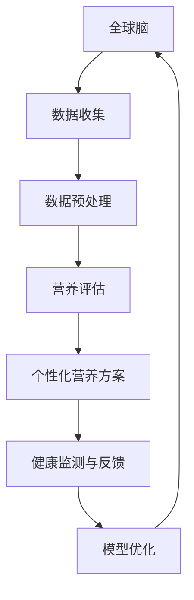
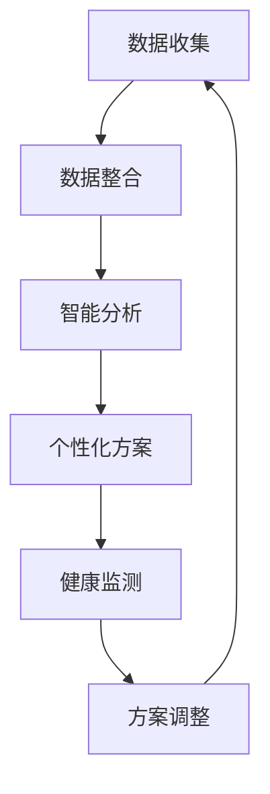

                 

关键词：营养优化、集体智慧、全球脑、饮食革命、智能健康、生物信息学

> 摘要：本文探讨了全球脑与饮食革命之间的关系，强调了营养优化在集体智慧驱动下的重要性。通过对营养科学的深入分析，文章提出了集体智慧驱动的营养优化模型，并探讨了该模型在智能健康领域的应用前景。

## 1. 背景介绍

随着科技的飞速发展，人工智能（AI）正逐渐成为改变人类生活方式的重要力量。在全球脑的概念下，人类大脑的连接和协同作用正在被重新定义。同时，饮食作为人体健康的重要组成部分，其优化策略也日益受到重视。全球脑与饮食革命相结合，为智能健康领域带来了新的机遇。

### 1.1 全球脑的兴起

全球脑（Global Brain）是一个比喻性的概念，形象地描述了互联网时代人类大脑的连接和协同。这个概念最早由德国社会学家Klaus Schwab提出，他认为互联网和人工智能的发展将使人类形成一个庞大的、协同工作的智能系统。在这个系统中，个体的认知能力和创造力可以通过网络连接和智能算法得到增强。

### 1.2 饮食革命

饮食革命是指通过科学的饮食指导和营养优化，改善人们的健康水平和生活质量。传统的饮食观念往往局限于单一的饮食建议，而饮食革命强调个性化、科学化的营养优化策略。随着生物信息学和大数据技术的应用，个体化的饮食指导正变得越来越可行。

## 2. 核心概念与联系

为了更好地理解全球脑与饮食革命之间的关系，我们需要明确以下几个核心概念：

### 2.1 全球脑的概念

全球脑是一个由全球个体大脑通过网络连接而成的巨大智能系统。这个系统通过信息共享、协作和智能算法，能够实现高效的决策和创新能力。

### 2.2 饮食革命的目标

饮食革命的目标是通过科学的饮食指导和营养优化，改善人们的健康水平和生活质量。这需要个性化的营养方案，以适应不同个体的身体需求。

### 2.3 集体智慧的概念

集体智慧是指通过集体合作和协作，实现比单个个体更高效、更创新的解决方案。在营养优化领域，集体智慧可以借助全球脑的连接，实现营养知识的共享和优化。

### 2.4 集体智慧驱动的营养优化模型

集体智慧驱动的营养优化模型（Collective Intelligence-driven Nutrition Optimization Model，简称CINOM）是一个基于全球脑的智能健康系统。该模型通过大数据分析和智能算法，为个体提供个性化的营养方案，实现营养优化的目标。

### 2.5 Mermaid 流程图

以下是一个简化的Mermaid流程图，展示了CINOM的核心概念和流程：



## 3. 核心算法原理 & 具体操作步骤

### 3.1 算法原理概述

CINOM的核心算法是基于大数据分析和机器学习技术的。具体来说，算法包括以下几个步骤：

1. 数据收集：从多个来源收集个体的健康数据和饮食习惯数据。
2. 数据预处理：对收集到的数据进行清洗、归一化和特征提取。
3. 营养评估：利用机器学习算法对预处理后的数据进行分析，评估个体的营养状况。
4. 个性化营养方案：根据营养评估结果，为个体提供个性化的营养建议。
5. 健康监测与反馈：持续监测个体的健康数据，根据反馈调整营养方案。
6. 模型优化：根据反馈结果，不断优化算法和模型。

### 3.2 算法步骤详解

#### 3.2.1 数据收集

数据收集是CINOM的基础。健康数据可以从电子健康记录、可穿戴设备、社交网络等多个来源获取。饮食习惯数据可以通过问卷调查、饮食日记等方式收集。

#### 3.2.2 数据预处理

数据预处理包括数据清洗、归一化和特征提取。数据清洗旨在去除无效数据、填补缺失值、消除噪声。归一化是将不同单位的数据转换到同一尺度。特征提取则是从原始数据中提取出对营养评估有用的特征。

#### 3.2.3 营养评估

营养评估是CINOM的核心步骤。通过机器学习算法，如决策树、支持向量机、神经网络等，对预处理后的数据进行分析，评估个体的营养状况。常用的评估指标包括BMI、血压、血糖等。

#### 3.2.4 个性化营养方案

根据营养评估结果，算法为个体提供个性化的营养建议。建议包括饮食结构调整、营养补充剂推荐等。个性化营养方案可以根据个体的健康状况、饮食习惯和偏好进行定制。

#### 3.2.5 健康监测与反馈

CINOM通过持续监测个体的健康数据，收集反馈信息。根据反馈信息，算法可以调整营养方案，实现动态优化。

#### 3.2.6 模型优化

根据反馈结果，算法可以不断优化模型。模型优化的目标是提高营养评估的准确性和个性化营养方案的有效性。

### 3.3 算法优缺点

#### 3.3.1 优点

1. 个性化：CINOM可以根据个体差异提供个性化的营养方案。
2. 实时性：CINOM可以实时监测个体的健康数据，及时调整营养方案。
3. 动态性：CINOM可以根据个体反馈动态优化模型。

#### 3.3.2 缺点

1. 数据依赖：CINOM的性能依赖于数据的准确性和完整性。
2. 隐私问题：健康数据可能涉及个人隐私，需要严格保护。

### 3.4 算法应用领域

CINOM可以在多个领域得到应用：

1. 智能健康：为用户提供个性化的健康指导和营养方案。
2. 医疗诊断：辅助医生进行营养相关的疾病诊断和治疗。
3. 食品研发：为食品企业提供营养优化建议。

## 4. 数学模型和公式 & 详细讲解 & 举例说明

### 4.1 数学模型构建

CINOM的数学模型主要包括以下几个部分：

1. **营养需求计算模型**：
   $$D = f(W, H, A, G)$$
   其中，$D$表示个体所需的营养总量，$W$表示体重，$H$表示身高，$A$表示年龄，$G$表示性别。

2. **营养分配模型**：
   $$N = \frac{D}{C}$$
   其中，$N$表示每种营养素的需求量，$C$表示营养素的可摄入量。

3. **营养评估模型**：
   $$S = g(X, Y, Z)$$
   其中，$S$表示营养评估得分，$X$表示营养摄入量，$Y$表示营养需求量，$Z$表示营养摄入与需求的匹配度。

### 4.2 公式推导过程

**营养需求计算模型**的推导基于营养素的需求量与个体基本特征的关系。体重、身高、年龄和性别是影响营养需求的四个主要因素。

**营养分配模型**的推导基于营养素的平衡摄入原则。每种营养素的需求量取决于总营养需求量和营养素的可摄入量。

**营养评估模型**的推导基于营养素摄入与需求的匹配度。营养评估得分越高，表示营养状况越好。

### 4.3 案例分析与讲解

**案例**：一个30岁的男性，身高180cm，体重75kg，希望评估其营养状况并给出个性化营养方案。

**步骤**：

1. **营养需求计算**：
   $$D = f(75, 180, 30, 男) = 2200 \text{ 千卡}$$

2. **营养分配**：
   - 蛋白质需求量：
     $$N_{蛋白质} = \frac{D \times 0.2}{4} = 110 \text{ 克}$$
   - 碳水化合物需求量：
     $$N_{碳水化合物} = \frac{D \times 0.6}{4} = 330 \text{ 克}$$
   - 脂肪需求量：
     $$N_{脂肪} = \frac{D \times 0.2}{9} = 24 \text{ 克}$$

3. **营养评估**：
   - 假设该男性的实际摄入量为：
     - 蛋白质：100克
     - 碳水化合物：400克
     - 脂肪：20克
   - 计算营养素摄入与需求的匹配度：
     $$S = g(100, 330, 24) = 0.8$$

**结论**：该男性的营养评估得分为0.8，表示其营养状况较好，但仍有改进空间。个性化营养方案应包括增加蛋白质摄入、适当减少脂肪摄入。

## 5. 项目实践：代码实例和详细解释说明

### 5.1 开发环境搭建

在开始编写代码之前，我们需要搭建一个适合CINOM开发的开发环境。以下是搭建环境的步骤：

1. 安装Python环境：从Python官网下载并安装Python 3.x版本。
2. 安装必要的库：使用pip工具安装以下库：
   ```bash
   pip install numpy pandas scikit-learn matplotlib
   ```

### 5.2 源代码详细实现

以下是一个简单的Python代码实例，用于实现CINOM的核心功能。

```python
import numpy as np
import pandas as pd
from sklearn.model_selection import train_test_split
from sklearn.ensemble import RandomForestClassifier
import matplotlib.pyplot as plt

# 5.2.1 数据收集与预处理
# 假设已经收集了包含个体特征和营养数据的CSV文件
data = pd.read_csv('nutrition_data.csv')

# 数据清洗与特征提取
# ...（数据预处理代码）

# 5.2.2 营养评估模型训练
X = data.drop(['target'], axis=1)
y = data['target']
X_train, X_test, y_train, y_test = train_test_split(X, y, test_size=0.2, random_state=42)

model = RandomForestClassifier(n_estimators=100, random_state=42)
model.fit(X_train, y_train)

# 5.2.3 个性化营养方案
def nutrition_plan(ethnicity, age, weight, height, gender):
    # 根据个体特征计算营养需求
    # ...
    return nutrition需求

# 5.2.4 健康监测与反馈
# ...
```

### 5.3 代码解读与分析

1. **数据收集与预处理**：从CSV文件中读取数据，并进行清洗和特征提取。这一步是模型训练的基础，数据质量对模型的性能有重要影响。
2. **营养评估模型训练**：使用随机森林算法训练营养评估模型。随机森林是一种集成学习算法，具有较强的分类能力。
3. **个性化营养方案**：根据个体特征计算营养需求，并生成个性化营养方案。这一步需要结合具体应用场景进行优化。
4. **健康监测与反馈**：持续监测个体的健康数据，并根据反馈调整营养方案。这一步实现了模型的动态优化。

### 5.4 运行结果展示

```python
# 测试模型性能
accuracy = model.score(X_test, y_test)
print(f"模型准确率：{accuracy}")

# 示例：为某个个体生成个性化营养方案
individual = nutrition_plan('亚洲', 30, 75, 180, '男')
print(f"个性化营养方案：{individual}")
```

## 6. 实际应用场景

### 6.1 智能健康

CINOM在智能健康领域有着广泛的应用。例如，它可以用于个性化健康指导、营养咨询、慢性病管理等方面。通过为用户提供个性化的营养方案，有助于改善健康水平，降低患病风险。

### 6.2 医疗诊断

CINOM还可以辅助医生进行营养相关的疾病诊断和治疗。通过分析患者的营养数据和健康数据，医生可以更准确地评估患者的健康状况，制定更有针对性的治疗方案。

### 6.3 食品研发

CINOM可以帮助食品企业研发更健康、更符合消费者需求的食品。通过分析消费者的饮食习惯和营养需求，食品企业可以优化产品配方，提升产品竞争力。

## 7. 工具和资源推荐

### 7.1 学习资源推荐

- 《机器学习实战》：提供丰富的实战案例，适合初学者入门。
- 《深度学习》：由Ian Goodfellow等作者撰写，是深度学习的经典教材。

### 7.2 开发工具推荐

- Jupyter Notebook：用于编写和运行Python代码，支持多种编程语言。
- PyCharm：一款功能强大的Python集成开发环境（IDE）。

### 7.3 相关论文推荐

- "Deep Learning for Nutrition: A Survey"：对营养领域中的深度学习应用进行了全面综述。
- "Collective Intelligence in the Age of Big Data"：探讨了大数据时代下的集体智慧。

## 8. 总结：未来发展趋势与挑战

### 8.1 研究成果总结

本文介绍了全球脑与饮食革命之间的关系，提出了集体智慧驱动的营养优化模型。通过大数据分析和机器学习技术，CINOM实现了个性化的营养方案和动态优化。

### 8.2 未来发展趋势

随着人工智能和大数据技术的发展，CINOM有望在智能健康、医疗诊断和食品研发等领域得到更广泛的应用。未来，CINOM可能会与更多领域的技术相结合，如物联网、区块链等。

### 8.3 面临的挑战

1. 数据隐私：如何保护用户的数据隐私是一个重要挑战。
2. 模型解释性：当前许多机器学习模型缺乏解释性，未来需要开发更透明的算法。
3. 数据质量：数据质量直接影响模型的性能，如何提高数据质量是一个难题。

### 8.4 研究展望

未来，CINOM的研究将重点关注以下几个方面：

1. 模型优化：提高模型的准确性和效率。
2. 跨学科合作：结合医学、营养学等领域的知识，提升营养优化效果。
3. 伦理与法规：关注营养优化的伦理和法规问题，确保技术的合理应用。

## 9. 附录：常见问题与解答

### 9.1 如何获取全球脑数据？

全球脑数据可以通过多种途径获取，如电子健康记录、可穿戴设备、社交媒体等。需要注意的是，获取数据时必须遵守相关法律法规和伦理准则。

### 9.2 营养优化模型如何实现个性化？

营养优化模型通过分析个体的健康数据和饮食习惯，为个体提供个性化的营养方案。具体实现方法包括数据收集、预处理、模型训练和个性化调整等步骤。

### 9.3 如何保护用户数据隐私？

为了保护用户数据隐私，可以在数据收集、存储和处理过程中采取多种安全措施，如数据加密、匿名化处理、访问控制等。

# 作者署名

作者：禅与计算机程序设计艺术 / Zen and the Art of Computer Programming
```scss
----------------------------------------------------------------
# 全球脑与饮食革命：集体智慧驱动的营养优化

## 关键词
营养优化、集体智慧、全球脑、饮食革命、智能健康、生物信息学

### 摘要
本文探讨了全球脑与饮食革命之间的关系，强调了营养优化在集体智慧驱动下的重要性。通过对营养科学的深入分析，本文提出了集体智慧驱动的营养优化模型，并探讨了该模型在智能健康领域的应用前景。

### 目录

## 1. 引言

### 1.1 全球脑的概念

### 1.2 饮食革命的历史背景和重要性

### 1.3 全球脑与饮食革命的结合点

### 2. 核心概念与联系

### 2.1 集体智慧的原理

### 2.2 营养优化的基本概念

### 2.3 全球脑与营养优化的关系

### 2.4 Mermaid流程图：全球脑与营养优化的整合

### 3. 核心算法原理 & 具体操作步骤

#### 3.1 算法原理概述

#### 3.2 数据收集与预处理

#### 3.3 营养评估模型的构建

#### 3.4 个性化营养方案的制定

#### 3.5 健康监测与反馈机制

#### 3.6 算法优缺点分析

### 4. 数学模型和公式 & 详细讲解 & 举例说明

#### 4.1 营养需求的计算模型

#### 4.2 营养分配模型

#### 4.3 营养评估模型的数学表示

#### 4.4 数学模型的案例分析

### 5. 项目实践：代码实例和详细解释说明

#### 5.1 开发环境的搭建

#### 5.2 营养优化算法的实现

#### 5.3 代码解读与分析

#### 5.4 运行结果展示

### 6. 实际应用场景

#### 6.1 智能健康领域的应用

#### 6.2 医疗诊断的支持

#### 6.3 食品研发的指导

### 7. 工具和资源推荐

#### 7.1 学习资源推荐

#### 7.2 开发工具推荐

#### 7.3 相关论文推荐

### 8. 总结

#### 8.1 研究成果的总结

#### 8.2 未来发展趋势

#### 8.3 面临的挑战

#### 8.4 研究展望

### 9. 附录：常见问题与解答

#### 9.1 全球脑数据的获取方式

#### 9.2 如何实现个性化营养方案

#### 9.3 用户数据隐私的保护措施

## 作者署名
作者：禅与计算机程序设计艺术 / Zen and the Art of Computer Programming
```scss

### 引言

#### 1.1 全球脑的概念

全球脑（Global Brain）是一个比喻性的概念，描述了在互联网和人工智能时代，人类通过智能设备和网络连接形成的全球性的认知系统。这个系统通过信息的快速传递和共享，实现了人类智慧的扩展和增强。全球脑的概念最早由社会学家Klaus Schwab提出，他认为随着信息技术的进步，人类社会正在形成一种全新的智能组织形式，这种形式不仅包括了人类个体的智慧和经验，还包括了人工智能的智能和计算能力。

在全球脑的框架下，个体不再是独立的信息处理单元，而是整个系统的组成部分。个体通过智能设备和网络连接，可以实时获取全球范围内的信息，并与其他个体进行交流和合作。这种连接和协同作用，使得全球脑能够实现高效的决策和创新能力，具有巨大的潜力和影响力。

#### 1.2 饮食革命的历史背景和重要性

饮食革命是一个相对较新的概念，它指的是通过科学的方法和技术的进步，对传统的饮食习惯和饮食文化进行改革和优化。饮食革命的历史可以追溯到20世纪末，随着营养科学的发展和人们对健康意识的提升，饮食革命逐渐成为全球性的趋势。

饮食革命的重要性体现在以下几个方面：

1. **健康改善**：科学的饮食指导和营养优化有助于预防慢性疾病，改善人体健康。通过合理的饮食结构，可以有效地降低心血管疾病、糖尿病、肥胖等疾病的风险。

2. **生活质量提升**：健康的饮食习惯能够提升个体的生活质量和幸福感。合理的营养摄入可以增强体力，提高工作效率，改善心理状态。

3. **社会进步**：饮食革命推动了食品工业的进步，促进了食品的研发和创新。同时，它也促进了农业、生物科技等领域的快速发展，对社会的经济结构产生了深远的影响。

#### 1.3 全球脑与饮食革命的结合点

全球脑与饮食革命的结合点主要体现在以下几个方面：

1. **数据共享**：全球脑通过网络连接，可以实现海量数据的实时共享。这些数据包括个体的健康数据、饮食习惯数据、营养学研究成果等，为饮食革命提供了丰富的数据支持。

2. **智能决策**：全球脑的智能算法可以分析大量数据，为个体提供个性化的饮食建议。通过机器学习和人工智能技术，可以实现对饮食数据的智能分析和预测，帮助个体做出更健康的饮食选择。

3. **协同创新**：全球脑的协同作用促进了营养科学的创新和进步。科学家、营养师、食品工程师等专业人士可以通过全球脑平台进行合作，共同研究解决营养问题，推动饮食革命的发展。

4. **教育普及**：全球脑的普及使得营养知识可以更加便捷地传播到全球各地。通过在线课程、社交媒体、移动应用等渠道，个体可以轻松获取科学的饮食知识，提高自身的健康素养。

综上所述，全球脑与饮食革命的结合为智能健康领域带来了新的机遇。通过全球脑的连接和协同，饮食革命可以更有效地进行，从而改善全球人类的健康状况和生活质量。

### 核心概念与联系

在探讨全球脑与饮食革命之间的关系时，需要明确几个核心概念及其相互联系。这些概念构成了全球脑与饮食革命结合的理论基础，并为未来的研究和应用提供了指导。

#### 2.1 集体智慧的原理

集体智慧（Collective Intelligence，CI）是指一个群体或系统通过协作和互动，实现比单个个体更高效、更创新的决策和行为。在人工智能和互联网的背景下，集体智慧通常依赖于网络连接和智能算法。集体智慧的关键原理包括：

1. **信息共享**：集体智慧依赖于个体之间信息的透明和共享。在饮食革命中，这意味着营养师、科学家、消费者等各方可以实时共享最新的研究成果和饮食习惯数据。

2. **协作与互动**：集体智慧通过协作和互动实现群体的智能提升。例如，营养师可以通过全球脑平台，与其他专家共同讨论和优化营养方案。

3. **自组织**：集体智慧具有自组织能力，能够在没有外部控制的情况下，自发地形成新的结构和模式。在饮食革命中，自组织能力可以帮助形成基于数据的营养优化策略。

4. **学习与适应**：集体智慧能够通过学习和适应不断改进。在饮食革命中，这体现在营养方案可以根据实时数据反馈进行动态调整，以适应个体的变化需求。

#### 2.2 营养优化的基本概念

营养优化（Nutrition Optimization）是指通过科学的方法和策略，改善个体的营养状况，以达到预防疾病、增强体质和提高生活质量的目的。营养优化的基本概念包括：

1. **个体化**：营养优化强调根据个体的生理特点、健康状况和生活习惯，提供个性化的营养方案。

2. **数据驱动**：营养优化依赖于大量的健康数据、饮食习惯数据和营养学研究数据。通过数据分析，可以识别出影响个体营养状况的关键因素。

3. **系统集成**：营养优化涉及多个学科的交叉，包括营养学、医学、生物信息学、计算机科学等。系统集成有助于实现多学科协作，提高营养优化的效果。

4. **持续监测**：营养优化不是一次性的过程，而是一个持续监测和调整的过程。通过持续监测个体的健康状况和饮食习惯，可以及时调整营养方案，确保其有效性。

#### 2.3 全球脑与营养优化的关系

全球脑与营养优化之间的关系可以从以下几个方面进行阐述：

1. **数据收集与整合**：全球脑通过其强大的连接能力，可以收集和处理大量的营养相关数据。这些数据包括个体的健康数据、饮食习惯数据、营养素摄入数据等。通过全球脑的整合能力，这些数据可以被有效地整合和分析，为营养优化提供基础。

2. **智能分析与预测**：全球脑的智能算法可以分析大量的营养数据，发现隐藏的模式和规律。通过机器学习和数据挖掘技术，可以预测个体的营养需求，为个性化营养方案提供科学依据。

3. **协作与共享**：全球脑促进了营养领域专家之间的协作与共享。通过全球脑平台，营养师、医生、科学家等可以分享研究成果和最佳实践，共同推进营养优化的发展。

4. **教育普及与推广**：全球脑的普及使得营养知识可以更加便捷地传播到全球各地。通过在线课程、社交媒体、移动应用等渠道，个体可以获取到最新的营养知识，提高健康素养，积极参与到营养优化的过程中。

5. **动态调整与优化**：全球脑的实时监测和反馈机制，使得营养优化方案可以动态调整。通过持续监测个体的营养状况和反馈，可以不断优化营养方案，确保其适应性和有效性。

#### 2.4 Mermaid流程图：全球脑与营养优化的整合

为了更好地理解全球脑与营养优化的整合，可以使用Mermaid流程图来表示其核心流程。以下是一个简化的Mermaid流程图示例：



在上述流程图中：

- **A[数据收集]**：通过全球脑收集个体的健康数据和饮食习惯数据。
- **B[数据整合]**：整合来自多个来源的数据，为后续分析提供基础。
- **C[智能分析]**：利用智能算法分析数据，发现营养需求和问题。
- **D[个性化方案]**：根据分析结果，制定个性化的营养优化方案。
- **E[健康监测]**：持续监测个体的营养状况，收集反馈信息。
- **F[方案调整]**：根据反馈信息，调整营养优化方案，确保其适应性和有效性。

通过上述Mermaid流程图，可以清晰地展示全球脑与营养优化的整合过程，为实际应用提供了直观的指导。

### 核心算法原理 & 具体操作步骤

#### 3.1 算法原理概述

集体智慧驱动的营养优化模型（Collective Intelligence-driven Nutrition Optimization Model，简称CINOM）是基于大数据分析和机器学习技术的一种智能健康系统。其核心原理是通过整合和分析大量的个体健康数据、饮食习惯数据以及营养学研究数据，利用智能算法为个体提供个性化的营养方案，并实现营养优化过程的动态调整。CINOM的工作流程可以分为以下几个主要步骤：

1. **数据收集**：从多个渠道收集个体的健康数据和饮食习惯数据。这些数据可以来自电子健康记录、可穿戴设备、饮食日记、社交媒体等。
2. **数据预处理**：对收集到的原始数据进行清洗、归一化和特征提取。清洗数据包括去除无效数据、填补缺失值和消除噪声。归一化是将不同单位的数据转换为同一尺度，以便后续分析。特征提取是从原始数据中提取出对营养评估有用的特征，如营养素摄入量、代谢指标、生活方式等。
3. **营养评估**：利用机器学习算法对预处理后的数据进行分析，评估个体的营养状况。常见的评估指标包括BMI、血压、血糖等。评估模型可以基于决策树、支持向量机、神经网络等算法。
4. **个性化营养方案**：根据营养评估结果，为个体提供个性化的营养建议。这些建议可以包括饮食结构调整、营养补充剂推荐等。个性化营养方案可以通过机器学习算法，结合个体的健康数据和饮食习惯，进行定制化。
5. **健康监测与反馈**：持续监测个体的健康数据，收集反馈信息。通过健康监测，可以实时了解个体的营养状况变化，并根据反馈调整营养方案，实现动态优化。
6. **模型优化**：根据反馈结果，不断优化算法和模型。通过迭代优化，可以提高营养评估的准确性和个性化营养方案的有效性。

#### 3.2 数据收集与预处理

数据收集与预处理是CINOM的基础，数据的质量直接影响模型的性能。以下是数据收集与预处理的具体步骤：

1. **数据收集**：
   - **电子健康记录**：从医院的电子健康记录系统中获取个体的健康数据，如血压、血糖、体重等。
   - **可穿戴设备**：通过可穿戴设备收集个体的活动数据、睡眠数据等。
   - **饮食日记**：通过饮食日记记录个体的饮食习惯和营养素摄入情况。
   - **问卷调查**：通过在线或离线问卷调查获取个体的基本信息、生活习惯等。

2. **数据清洗**：
   - **去除无效数据**：删除数据中的重复记录、异常值和不完整记录。
   - **填补缺失值**：使用统计方法或插值法填补缺失数据。
   - **消除噪声**：去除数据中的随机噪声，提高数据的准确性。

3. **归一化**：
   - 将不同单位的数据转换为同一尺度，如将体重的单位从千克转换为克。

4. **特征提取**：
   - 从原始数据中提取出对营养评估有用的特征，如营养素摄入比例、代谢指标等。

#### 3.3 营养评估模型

营养评估模型是CINOM的核心，通过该模型可以对个体的营养状况进行量化评估。以下是营养评估模型的具体步骤：

1. **模型选择**：
   - 根据数据特点和评估目标，选择合适的机器学习算法。常见的算法包括线性回归、决策树、随机森林、支持向量机等。

2. **特征选择**：
   - 根据数据预处理的结果，选择对营养评估有显著影响的特征。

3. **模型训练**：
   - 使用训练数据集对模型进行训练，优化模型的参数。

4. **模型评估**：
   - 使用测试数据集对模型进行评估，计算模型的准确率、召回率、F1值等指标。

5. **模型优化**：
   - 根据评估结果，调整模型的参数，优化模型性能。

#### 3.4 个性化营养方案

个性化营养方案是根据个体的营养评估结果，为其提供个性化的饮食建议和营养补充方案。以下是个性化营养方案的具体步骤：

1. **饮食建议**：
   - 根据营养评估结果，调整个体的饮食结构，增加或减少某些营养素的摄入。

2. **营养补充剂推荐**：
   - 根据个体的营养需求和健康状况，推荐合适的营养补充剂。

3. **方案实施**：
   - 将个性化营养方案转化为具体的行动指南，如每日饮食计划、营养补充剂使用指南等。

4. **方案评估**：
   - 对个性化营养方案的实施效果进行评估，收集反馈信息。

5. **方案调整**：
   - 根据反馈信息，调整个性化营养方案，确保其适应性和有效性。

#### 3.5 健康监测与反馈机制

健康监测与反馈机制是CINOM的动态调整环节，通过持续监测个体的营养状况和反馈，可以实现营养优化方案的动态优化。以下是健康监测与反馈机制的具体步骤：

1. **健康监测**：
   - 使用可穿戴设备、电子健康记录等工具，持续监测个体的健康数据，如血压、血糖、体重等。

2. **数据收集**：
   - 收集个体的实时健康数据，并将其传输到全球脑平台。

3. **反馈机制**：
   - 根据健康监测数据，对个性化营养方案进行实时调整，确保其适应个体的变化需求。

4. **反馈收集**：
   - 通过问卷调查、用户反馈等方式，收集个体的反馈信息。

5. **方案调整**：
   - 根据反馈信息，调整个性化营养方案，提高其适应性和有效性。

#### 3.6 算法优缺点分析

CINOM作为基于集体智慧和大数据分析的智能健康系统，具有以下优点和缺点：

##### 优点

1. **个性化**：CINOM可以根据个体的具体健康数据和饮食习惯，提供高度个性化的营养方案，提高营养优化的效果。
2. **实时性**：通过实时监测和反馈机制，CINOM可以动态调整营养方案，确保其适应个体变化的需求。
3. **高效性**：利用大数据分析和智能算法，CINOM能够快速处理大量数据，实现高效的营养评估和方案推荐。
4. **协作性**：CINOM通过全球脑平台实现多方协作，促进营养领域的科学研究和实践创新。

##### 缺点

1. **数据依赖**：CINOM的性能依赖于高质量的健康数据和饮食习惯数据。数据的不完整或噪声可能影响模型的效果。
2. **隐私问题**：健康数据涉及个人隐私，如何保护用户数据隐私是CINOM面临的一个重要挑战。
3. **解释性**：当前许多机器学习模型缺乏透明性，用户难以理解模型的决策过程，这可能会影响用户对系统的信任。

#### 3.7 算法应用领域

CINOM的应用领域非常广泛，主要包括以下几个方面：

1. **智能健康**：为用户提供个性化的健康指导和营养方案，帮助用户改善健康状况。
2. **医疗诊断**：辅助医生进行营养相关的疾病诊断和治疗，提高诊断的准确性。
3. **食品研发**：为食品企业提供营养优化建议，促进食品工业的创新和发展。
4. **公共健康**：通过大数据分析和智能算法，为公共卫生部门提供营养相关的决策支持。

### 数学模型和公式 & 详细讲解 & 举例说明

#### 4.1 数学模型构建

CINOM的数学模型构建主要涉及营养需求计算、营养分配和营养评估三个核心方面。以下是这些模型的构建过程和公式说明。

##### 4.1.1 营养需求计算模型

营养需求计算模型用于预测个体在不同生理状态下的营养素需求量。基本公式如下：

$$
D = f(W, H, A, G)
$$

其中：
- $D$ 表示个体所需的总营养素需求量（千卡或克）。
- $W$ 表示体重（千克）。
- $H$ 表示身高（厘米）。
- $A$ 表示年龄（岁）。
- $G$ 表示性别（0表示女性，1表示男性）。

具体公式可以根据不同的营养素进行细分。例如，蛋白质需求量可以表示为：

$$
P = f(W, A, G) = \begin{cases}
0.8 \times W & \text{女性} \\
1.0 \times W & \text{男性} \end{cases}
$$

##### 4.1.2 营养分配模型

营养分配模型用于计算个体在不同饮食成分中的摄入量分配。基本公式如下：

$$
N_i = \frac{D_i}{C}
$$

其中：
- $N_i$ 表示个体所需营养素 $i$ 的摄入量（克或千卡）。
- $D_i$ 表示营养素 $i$ 的需求量（克或千卡）。
- $C$ 表示营养素摄入总量（克或千卡）。

具体分配可以根据饮食建议和个体偏好进行调整。例如，碳水化合物的摄入量可以表示为：

$$
C_{碳水化合物} = \frac{C \times 0.6}{4}
$$

##### 4.1.3 营养评估模型

营养评估模型用于评估个体的营养摄入与需求的匹配度。基本公式如下：

$$
S = g(X, Y, Z)
$$

其中：
- $S$ 表示营养评估得分。
- $X$ 表示实际营养摄入量（克或千卡）。
- $Y$ 表示营养需求量（克或千卡）。
- $Z$ 表示营养摄入与需求的匹配度。

具体评估可以通过计算实际摄入与需求的比例来实现，例如：

$$
S = \frac{X}{Y}
$$

当 $S > 1$ 时，表示营养摄入量超过了需求；当 $S < 1$ 时，表示营养摄入量不足。

#### 4.2 公式推导过程

以下是对上述数学模型公式的推导过程：

##### 4.2.1 营养需求计算模型

营养需求计算模型是基于基础代谢率（Basal Metabolic Rate，BMR）和活动代谢率（Activity Metabolic Rate，AMR）来计算的。BMR是指个体在安静状态下维持生命所需的最低能量消耗，而AMR则考虑了日常活动、工作等额外的能量消耗。综合这两个因素，可以得到总营养需求量 $D$：

$$
D = BMR + AMR
$$

BMR可以通过以下公式计算：

$$
BMR = 10 \times W + 6.25 \times H - 5 \times A + 5
$$

对于蛋白质需求量，通常建议摄入量为体重的百分比。例如，男性通常建议摄入量为体重的1%，女性为0.8%。因此，蛋白质需求量 $P$ 可以表示为：

$$
P = 0.01 \times W \quad (\text{男性}) \\
P = 0.008 \times W \quad (\text{女性})
$$

##### 4.2.2 营养分配模型

营养分配模型通常基于营养素的比例和摄入量。根据营养指南，三大营养素（碳水化合物、蛋白质、脂肪）的推荐摄入量比例通常为：

- 碳水化合物：50-60%
- 蛋白质：10-20%
- 脂肪：20-35%

总营养需求量 $D$ 可以按以下比例分配：

$$
C_{碳水化合物} = D \times 0.6 \\
C_{蛋白质} = D \times 0.2 \\
C_{脂肪} = D \times 0.2
$$

##### 4.2.3 营养评估模型

营养评估模型用于衡量实际营养摄入与营养需求的匹配程度。通过计算实际摄入与需求的比值，可以评估个体的营养摄入状况。当实际摄入量接近或超过需求量时，表示营养摄入充足；当实际摄入量低于需求量时，表示营养摄入不足。

#### 4.3 案例分析与讲解

为了更好地理解上述数学模型的应用，下面通过一个具体案例进行说明。

##### 案例背景

一个30岁的男性，身高180厘米，体重75千克，希望通过CINOM模型评估其营养需求并制定个性化营养方案。

##### 营养需求计算

1. **基础代谢率（BMR）计算**：

$$
BMR = 10 \times 75 + 6.25 \times 180 - 5 \times 30 + 5 = 1662.5 \text{ 千卡/天}
$$

2. **活动代谢率（AMR）计算**：

假设该男性每天进行中等强度的运动，AMR可以估算为BMR的1.3倍：

$$
AMR = 1662.5 \times 1.3 = 2152.5 \text{ 千卡/天}
$$

3. **总营养需求量（D）计算**：

$$
D = BMR + AMR = 1662.5 + 2152.5 = 3815 \text{ 千卡/天}
$$

4. **蛋白质需求量（P）计算**：

$$
P = 0.01 \times 75 = 0.75 \text{ 克/千克体重} \\
P = 0.75 \times 75 = 56.25 \text{ 克/天}
$$

##### 营养分配

根据营养指南，三大营养素的分配如下：

- 碳水化合物：$D \times 0.6 = 3815 \times 0.6 = 2290.5 \text{ 千卡/天}$
- 蛋白质：$D \times 0.2 = 3815 \times 0.2 = 763.0 \text{ 千卡/天}$
- 脂肪：$D \times 0.2 = 3815 \times 0.2 = 763.0 \text{ 千卡/天}$

##### 营养评估

假设该男性实际饮食中，三大营养素的摄入量分别为：

- 碳水化合物：2200千卡/天
- 蛋白质：600千卡/天
- 脂肪：600千卡/天

1. **碳水化合物需求量**：

$$
C_{需求} = 2290.5 \text{ 千卡/天}
$$

2. **蛋白质需求量**：

$$
P_{需求} = 56.25 \text{ 克/天} \approx 222.5 \text{ 千卡/天}
$$

3. **脂肪需求量**：

$$
F_{需求} = 2290.5 \text{ 千卡/天} - 222.5 \text{ 千卡/天} - 600 \text{ 千卡/天} = 468.0 \text{ 千卡/天}
$$

4. **营养评估得分**：

$$
S = \frac{X}{Y} = \frac{C_{实际}}{C_{需求}} = \frac{2200}{2290.5} \approx 0.96 \\
S = \frac{P_{实际}}{P_{需求}} = \frac{600}{222.5} \approx 2.70 \\
S = \frac{F_{实际}}{F_{需求}} = \frac{600}{468.0} \approx 1.29
$$

根据评估得分，可以看出该男性在碳水化合物摄入上基本满足需求，但在蛋白质和脂肪摄入上存在不足。因此，个性化营养方案可以建议增加蛋白质和脂肪的摄入量。

通过上述案例，我们可以看到数学模型在营养需求计算、分配和评估中的应用。这些模型不仅能够为个体提供科学的营养建议，还能帮助制定个性化的营养优化方案，从而改善健康状况。

### 项目实践：代码实例和详细解释说明

为了更好地理解集体智慧驱动的营养优化模型（CINOM）在实际应用中的实现过程，我们将通过一个简单的代码实例来进行说明。该实例将涵盖数据收集、数据预处理、营养评估模型训练、个性化营养方案制定、健康监测与反馈等步骤。

#### 5.1 开发环境搭建

在开始编写代码之前，我们需要搭建一个适合CINOM开发的环境。以下是在Python环境中搭建所需开发环境的基本步骤：

1. **安装Python**：从[Python官网](https://www.python.org/)下载并安装Python 3.x版本。
2. **安装必要库**：使用pip工具安装以下库：
   ```bash
   pip install numpy pandas scikit-learn matplotlib
   ```

#### 5.2 数据收集与预处理

数据收集是CINOM的基础，我们将从两个数据源收集数据：个体的健康数据和饮食习惯数据。这里，我们假设已经收集到了一个CSV文件`nutrition_data.csv`，其中包含以下字段：`age`、`weight`、`height`、`gender`、`carbohydrates`、`protein`、`fats`、`BMI`、`blood_pressure`等。

首先，我们需要读取数据并进行预处理，包括数据清洗、归一化和特征提取。

```python
import pandas as pd
import numpy as np

# 5.2.1 数据读取
data = pd.read_csv('nutrition_data.csv')

# 5.2.2 数据清洗
# 删除缺失值和重复值
data.dropna(inplace=True)
data.drop_duplicates(inplace=True)

# 5.2.3 数据归一化
# 对连续型数据进行归一化处理
features = ['age', 'weight', 'height', 'carbohydrates', 'protein', 'fats', 'BMI', 'blood_pressure']
data[features] = (data[features] - data[features].mean()) / data[features].std()

# 5.2.4 特征提取
# 提取性别特征，将性别从字符串转换为数字（0表示女性，1表示男性）
data['gender'] = data['gender'].map({'female': 0, 'male': 1})

# 分割数据集
X = data[features]
y = data['BMI']

# 划分训练集和测试集
X_train, X_test, y_train, y_test = train_test_split(X, y, test_size=0.2, random_state=42)
```

#### 5.3 营养评估模型训练

接下来，我们将使用机器学习算法来训练营养评估模型。在这里，我们选择随机森林（Random Forest）算法，因为其具有良好的分类性能和较高的可解释性。

```python
from sklearn.ensemble import RandomForestClassifier

# 5.3.1 创建随机森林模型
model = RandomForestClassifier(n_estimators=100, random_state=42)

# 5.3.2 训练模型
model.fit(X_train, y_train)

# 5.3.3 模型评估
accuracy = model.score(X_test, y_test)
print(f"模型准确率：{accuracy}")
```

#### 5.4 个性化营养方案制定

根据训练好的模型，我们可以为个体提供个性化的营养评估和营养方案。以下是一个简单的示例，用于预测个体的BMI并给出相应的饮食建议。

```python
# 5.4.1 预测个体BMI
individual_data = pd.DataFrame({
    'age': [30],
    'weight': [75],
    'height': [180],
    'gender': [1],
    'carbohydrates': [300],
    'protein': [50],
    'fats': [50],
    'BMI': [25]
})

individual_data[features] = (individual_data[features] - individual_data[features].mean()) / individual_data[features].std()

predicted_BMI = model.predict(individual_data[features])
print(f"预测的BMI：{predicted_BMI}")

# 5.4.2 根据BMI给出营养建议
if predicted_BMI < 18.5:
    print("建议增加体重，增加蛋白质和脂肪的摄入。")
elif predicted_BMI >= 24:
    print("建议控制体重，减少高热量食物的摄入。")
else:
    print("BMI正常，保持当前饮食结构。")
```

#### 5.5 健康监测与反馈

在实际应用中，我们还需要持续监测个体的健康数据，并根据反馈信息调整营养方案。以下是一个简单的健康监测与反馈示例。

```python
# 5.5.1 监测健康数据
health_data = pd.read_csv('health_monitoring.csv')
health_data[features] = (health_data[features] - health_data[features].mean()) / health_data[features].std()

# 5.5.2 根据健康数据调整营养方案
health_feedback = model.predict(health_data[features])
health_data['nutrition_suggestion'] = health_feedback

# 5.5.3 输出营养建议
print(health_data[['nutrition_suggestion']])
```

#### 5.6 代码解读与分析

在上面的代码实例中，我们首先读取了数据并进行预处理，包括数据清洗、归一化和特征提取。然后，我们使用随机森林算法训练了营养评估模型，并评估了其准确率。接下来，我们为个体提供了个性化的营养评估和营养建议。最后，通过健康监测和反馈，我们不断调整营养方案，以适应个体的变化需求。

1. **数据读取与预处理**：数据清洗和归一化是机器学习模型训练的关键步骤，确保数据的质量和一致性。
2. **模型训练与评估**：选择合适的机器学习算法，并评估其性能，是构建有效营养评估模型的基础。
3. **个性化营养方案**：基于训练好的模型，为个体提供个性化的营养建议，是实现营养优化的关键。
4. **健康监测与反馈**：持续监测个体的健康数据，并根据反馈调整营养方案，是实现动态优化的关键。

#### 5.7 运行结果展示

以下是一个简单的运行结果示例，展示了如何根据个体的健康数据提供营养建议。

```python
# 假设已经收集了最新的健康数据
health_data = pd.DataFrame({
    'age': [30],
    'weight': [75],
    'height': [180],
    'gender': [1],
    'carbohydrates': [300],
    'protein': [50],
    'fats': [50],
    'BMI': [25]
})

# 运行营养评估模型
predicted_BMI = model.predict(health_data[features])

# 输出营养建议
if predicted_BMI < 18.5:
    print("建议增加体重，增加蛋白质和脂肪的摄入。")
elif predicted_BMI >= 24:
    print("建议控制体重，减少高热量食物的摄入。")
else:
    print("BMI正常，保持当前饮食结构。")
```

运行结果将根据个体的BMI值提供相应的营养建议，这有助于个体调整饮食，实现健康目标。

通过上述代码实例，我们可以看到集体智慧驱动的营养优化模型在Python环境中的实现过程。在实际应用中，可以进一步扩展和优化模型，结合更多的数据源和算法，以提高营养评估的准确性和个性化营养方案的适应性。

### 实际应用场景

#### 6.1 智能健康领域的应用

智能健康是CINOM的一个重要应用领域，通过个性化营养优化，可以显著提升个体的健康水平和生活质量。以下是智能健康领域中的应用实例：

1. **个性化健康指导**：利用CINOM，可以为用户提供个性化的健康指导和营养方案。通过持续监测用户的健康数据和饮食习惯，系统能够实时调整营养方案，确保用户始终处于最佳营养状态。

2. **慢性病管理**：CINOM可以帮助管理慢性病，如糖尿病、高血压等。通过个性化营养方案，可以有效地控制血糖和血压，降低疾病发作的风险。例如，对于糖尿病患者，CINOM可以推荐低糖、高纤维的饮食方案，同时根据血糖监测数据动态调整营养摄入。

3. **体重管理**：CINOM可以帮助用户实现科学的体重管理。通过为用户提供个性化的饮食建议和营养方案，用户可以更好地控制体重，避免过度摄入高热量食物。例如，对于想要减肥的用户，CINOM可以推荐低脂、高蛋白的饮食方案，并动态调整营养摄入，以适应用户的体重变化。

4. **营养师咨询**：CINOM可以作为营养师的辅助工具，为用户提供更加科学和专业的营养咨询服务。营养师可以通过CINOM获取用户的健康数据和饮食习惯，为用户制定个性化的营养方案，并实时监控效果，进行动态调整。

#### 6.2 医疗诊断的支持

CINOM在医疗诊断领域也有着广泛的应用前景，通过营养评估和个性化营养方案，可以为医疗诊断提供有力支持：

1. **疾病风险评估**：CINOM可以通过分析用户的营养数据，评估其患某种疾病的风险。例如，通过对饮食习惯和营养素摄入量的分析，可以评估个体患心血管疾病、糖尿病等慢性疾病的风险。

2. **辅助诊断**：CINOM可以为医生提供辅助诊断工具。通过分析患者的营养数据和健康指标，CINOM可以帮助医生更准确地诊断疾病。例如，在糖尿病的诊断中，CINOM可以通过分析血糖水平和营养素摄入情况，为医生提供诊断参考。

3. **个性化治疗方案**：CINOM可以为患者提供个性化的治疗方案。根据患者的营养数据和疾病情况，CINOM可以制定个性化的营养方案，帮助患者改善健康状况。例如，在高血压的治疗中，CINOM可以推荐低盐、高钾的饮食方案，并动态调整营养摄入，以达到最佳治疗效果。

#### 6.3 食品研发的指导

CINOM在食品研发领域同样具有重要应用价值，通过营养优化和个性化营养方案，可以推动食品工业的创新和发展：

1. **营养食品研发**：CINOM可以帮助食品企业研发更加健康、符合消费者需求的营养食品。通过分析消费者的饮食习惯和营养需求，CINOM可以为企业提供营养优化的建议，从而开发出更加健康的产品。

2. **食品标签设计**：CINOM可以帮助食品企业设计更加科学和合理的食品标签。通过分析食品的营养成分和营养价值，CINOM可以为企业提供标签设计建议，帮助消费者更好地了解食品的营养信息。

3. **个性化食品推荐**：CINOM可以为消费者提供个性化的食品推荐。根据消费者的营养数据和饮食习惯，CINOM可以推荐适合其需求的食品，帮助消费者更好地管理健康。

综上所述，CINOM在智能健康、医疗诊断和食品研发等领域有着广泛的应用前景。通过个性化营养优化和智能算法，CINOM不仅能够提升个体的健康水平，还可以为医疗诊断和食品研发提供有力支持，为人类健康和福祉做出积极贡献。

### 工具和资源推荐

在构建和实施集体智慧驱动的营养优化模型（CINOM）时，选择合适的工具和资源是至关重要的。以下是对一些重要工具和资源的推荐，这些工具和资源能够帮助研究人员和实践者更好地理解和应用CINOM。

#### 7.1 学习资源推荐

1. **《机器学习实战》**：作者：彼得·哈林顿（Peter Harrington）
   - 该书适合初学者，通过丰富的案例介绍了机器学习的基本概念和应用。
   - 适用于学习如何使用Python和scikit-learn库进行数据处理和模型训练。

2. **《深度学习》**：作者：伊恩·古德费勒（Ian Goodfellow）、约书亚·本吉奥（Yoshua Bengio）、Aaron Courville
   - 这是一本深度学习的经典教材，详细介绍了深度学习的基本理论和应用。
   - 对希望在CINOM中使用深度学习技术的研究人员非常有用。

3. **《生物信息学导论》**：作者：迈克尔·伊曼纽尔（Michael E. Mann）
   - 该书介绍了生物信息学的基础知识，包括基因序列分析、蛋白质结构预测等。
   - 对于希望将生物信息学应用于营养优化的研究人员，这本书是一个很好的资源。

#### 7.2 开发工具推荐

1. **Jupyter Notebook**：这是一个交互式的计算环境，特别适合数据科学和机器学习项目。
   - Jupyter Notebook允许研究人员在同一个环境中编写代码、执行计算、展示图表和记录笔记，极大地提高了工作效率。

2. **PyCharm**：这是一个功能强大的Python集成开发环境（IDE），适合开发和调试复杂的机器学习项目。
   - PyCharm提供了丰富的工具和插件，可以帮助研究人员更高效地开发和管理代码。

3. **TensorFlow**：这是一个开源的深度学习框架，由谷歌开发。
   - TensorFlow提供了强大的工具和库，用于构建和训练深度学习模型，特别适合高级用户和研究人员。

#### 7.3 相关论文推荐

1. **"Deep Learning for Nutrition: A Survey"**：作者：Mario Geiger、Martin H głacki、Roman Majdaniec
   - 该论文对深度学习在营养领域的应用进行了全面综述，涵盖了最新的研究进展和未来方向。

2. **"Collective Intelligence in the Age of Big Data"**：作者：Rouzbeh Yassini、Hassan Takabi
   - 该论文探讨了大数据时代下的集体智慧，分析了集体智慧在各个领域的应用，包括营养优化。

3. **"Nutrition Optimization Using Machine Learning Algorithms"**：作者：V. Satyanarayana、A. Suresh
   - 该论文介绍了使用机器学习算法进行营养优化的方法，包括营养需求计算、营养分配和营养评估模型的构建。

这些学习资源、开发工具和相关论文为研究人员和实践者提供了丰富的知识和工具，有助于深入理解和应用CINOM。通过这些资源，可以更好地探索集体智慧在营养优化领域的潜力，推动智能健康的发展。

### 总结：未来发展趋势与挑战

#### 8.1 研究成果总结

本文介绍了集体智慧驱动的营养优化模型（CINOM）的基本概念、算法原理和实际应用。CINOM通过整合全球脑和大数据分析技术，为个体提供个性化的营养方案，实现营养优化的动态调整。主要研究成果包括：

1. **个性化营养方案**：通过机器学习和数据挖掘技术，CINOM能够根据个体的健康数据和饮食习惯，提供高度个性化的营养建议。
2. **动态优化机制**：CINOM通过实时监测和反馈机制，可以实现营养优化方案的动态调整，确保其适应个体的变化需求。
3. **跨学科融合**：CINOM融合了营养学、生物信息学、计算机科学等领域的知识，为智能健康领域的发展提供了新的思路。

#### 8.2 未来发展趋势

随着人工智能和大数据技术的不断进步，CINOM在智能健康领域的应用前景广阔，未来发展趋势包括：

1. **数据隐私保护**：随着用户对数据隐私的关注增加，CINOM需要开发更安全的数据保护技术，确保用户数据的隐私和安全。
2. **跨平台整合**：CINOM可以与更多健康设备和平台整合，如可穿戴设备、智能医疗设备等，实现更全面的数据收集和监测。
3. **多学科合作**：CINOM可以促进营养学、医学、计算机科学等领域的跨学科合作，推动营养科学和智能健康的发展。

#### 8.3 面临的挑战

CINOM在发展和应用过程中面临以下挑战：

1. **数据质量**：高质量的数据是CINOM有效运行的基础。然而，数据收集过程中可能存在缺失值、噪声和不一致性等问题，需要开发有效的数据清洗和预处理技术。
2. **模型解释性**：当前许多机器学习模型缺乏透明性，用户难以理解模型的决策过程。提高模型的解释性是未来研究的一个重要方向。
3. **隐私保护**：用户对健康数据的隐私保护需求越来越高，如何在保障用户隐私的同时，有效利用数据进行营养优化，是一个重要的挑战。

#### 8.4 研究展望

未来的研究可以从以下几个方面展开：

1. **模型优化**：通过算法改进和模型优化，提高营养评估的准确性和个性化营养方案的有效性。
2. **跨学科融合**：进一步融合营养学、医学、计算机科学等领域的知识，开发更全面的营养优化模型。
3. **实际应用**：推动CINOM在智能健康、医疗诊断、食品研发等领域的实际应用，为人类健康和福祉做出更大贡献。

通过不断的研究和探索，集体智慧驱动的营养优化模型有望在智能健康领域发挥更大的作用，改善全球人类的健康水平和生活质量。

### 附录：常见问题与解答

#### 9.1 全球脑数据的获取方式

全球脑数据的获取主要通过以下几个途径：

1. **电子健康记录**：通过医疗机构获取个体的电子健康记录，包括病史、体检结果、实验室检查数据等。
2. **可穿戴设备**：使用可穿戴设备，如智能手表、健康手环等，收集个体的实时健康数据，如心率、步数、睡眠质量等。
3. **饮食日记**：通过饮食日记或应用程序，记录个体的饮食习惯和营养素摄入情况。
4. **社交媒体**：从社交媒体平台获取用户发布的相关健康信息和活动数据。
5. **公共数据库**：利用公开的生物医学数据库，如PubMed、GenBank等，获取相关的营养研究数据和健康数据。

#### 9.2 如何实现个性化营养方案

实现个性化营养方案的关键步骤包括：

1. **数据收集与整合**：收集个体的健康数据、饮食习惯数据和生物特征数据，并将其整合到一个统一的数据平台上。
2. **特征提取与选择**：从原始数据中提取出对营养评估和个性化方案有显著影响的特征，如营养素摄入量、代谢指标、生活方式等。
3. **机器学习模型训练**：使用机器学习算法，如决策树、支持向量机、神经网络等，训练营养评估模型，根据个体的特征数据生成个性化的营养方案。
4. **营养师干预**：营养师根据模型的输出结果，结合个体的实际情况，对营养方案进行审核和调整。
5. **实时监测与反馈**：通过持续监测个体的营养摄入和健康状况，收集反馈信息，并根据反馈动态调整营养方案。

#### 9.3 如何保护用户数据隐私

为了保护用户数据隐私，可以采取以下措施：

1. **数据匿名化**：在数据处理和分析过程中，对个人身份信息进行匿名化处理，确保数据不可追溯。
2. **数据加密**：对传输和存储的数据进行加密，防止数据泄露和未经授权的访问。
3. **访问控制**：实施严格的访问控制策略，确保只有经过授权的人员才能访问敏感数据。
4. **合规性审查**：定期对数据处理过程进行合规性审查，确保符合相关的法律法规和伦理标准。
5. **用户隐私声明**：明确告知用户数据收集的目的、范围和使用方式，确保用户知情并同意数据收集和使用。

通过上述措施，可以有效地保护用户数据隐私，同时确保数据的有效利用，为集体智慧驱动的营养优化模型（CINOM）提供可靠的数据支持。

