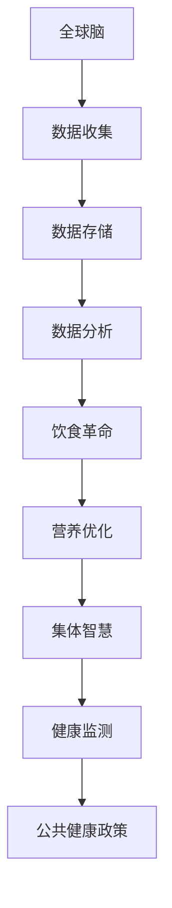

                 

关键词：全球脑、饮食革命、集体智慧、营养优化、人工智能、健康科技

> 摘要：本文探讨了全球脑与饮食革命的关系，以及如何利用集体智慧驱动营养优化。通过介绍全球脑的概念和作用，分析饮食革命对人类健康的影响，阐述集体智慧在营养优化中的重要性，提出了利用人工智能技术进行营养优化的具体方案，并对未来的发展趋势和挑战进行了展望。

## 1. 背景介绍

随着科技的进步，人类社会正经历着一场前所未有的变革。人工智能、大数据、物联网等技术的迅速发展，使得人们的生活方式、工作方式以及思维模式都在发生深刻的变化。在这场变革中，全球脑的概念逐渐走进人们的视野。

全球脑，也称为世界脑或全球网络智能，是指通过互联网将全球范围内的计算机、设备、传感器等连接起来，形成一个庞大的、智能化的信息处理网络。全球脑具有强大的计算能力和信息处理能力，能够实时收集、处理和分析海量数据，为人类提供智慧支持。

饮食革命则是指近年来，随着人们对健康、环保等问题的日益关注，饮食方式发生了深刻的变化。越来越多的人开始注重饮食的健康性和可持续性，追求更加科学、合理的饮食结构。

在这两个背景下，如何利用全球脑和集体智慧，实现营养优化，成为一个值得探讨的问题。

## 2. 核心概念与联系

### 2.1 全球脑

全球脑的概念最早由科学家约翰·霍普金斯在1986年提出。他设想，通过将全球的计算机、设备、传感器等连接起来，形成一个全球性的智能网络，使得全球范围内的信息可以实时共享、处理和分析。这个网络不仅具有强大的计算能力，还可以实现自我学习和进化。

全球脑的架构可以分为三层：数据层、计算层和应用层。数据层包括各种传感器、设备和计算机，负责收集和传输数据；计算层包括各种算法和模型，负责处理和分析数据；应用层则是各种基于全球脑的应用，如智能交通、智慧医疗、智慧城市等。

### 2.2 饮食革命

饮食革命是指近年来，随着人们对健康、环保等问题的日益关注，饮食方式发生了深刻的变化。具体来说，饮食革命主要体现在以下几个方面：

1. **健康性**：越来越多的人开始注重饮食的健康性，追求低脂、低糖、高纤维的饮食结构。
2. **可持续性**：环保意识的提高，使得人们开始关注食品的来源和加工方式，追求可持续的饮食方式。
3. **科学性**：营养科学的进步，使得人们更加了解食物的营养成分和作用，能够根据自身需求进行科学搭配。

### 2.3 集体智慧

集体智慧是指通过群体协作和共享，实现问题求解和决策优化的一种智慧形式。在饮食革命中，集体智慧的作用尤为重要。具体来说，集体智慧主要体现在以下几个方面：

1. **饮食建议**：通过收集和分析大量的饮食数据，为个人提供个性化的饮食建议。
2. **营养研究**：通过集体协作，进行营养科学的研究，推动饮食革命的深入发展。
3. **健康监测**：通过群体健康数据的收集和分析，为公共健康政策提供支持。

### 2.4 Mermaid 流程图

下面是一个简单的 Mermaid 流程图，描述了全球脑、饮食革命和集体智慧之间的联系。



## 3. 核心算法原理 & 具体操作步骤

### 3.1 算法原理概述

营养优化算法的核心思想是通过收集和分析个体饮食数据，为个体提供个性化的饮食建议。具体来说，算法分为以下几个步骤：

1. **数据收集**：通过传感器、设备等收集个体饮食数据，如食物摄入量、营养成分、饮食习惯等。
2. **数据处理**：对收集到的饮食数据进行清洗、预处理，为后续分析做准备。
3. **营养评估**：根据个体饮食数据和营养知识库，对个体饮食进行营养评估，识别营养不足或过剩的部分。
4. **饮食建议**：根据营养评估结果，为个体提供个性化的饮食建议，如调整食物摄入量、改变饮食习惯等。
5. **反馈调整**：根据个体反馈，对饮食建议进行调整，提高个性化建议的准确性。

### 3.2 算法步骤详解

#### 3.2.1 数据收集

数据收集是营养优化算法的基础。通过传感器、设备等，可以实时收集个体饮食数据，如食物摄入量、营养成分、饮食习惯等。这些数据可以来自手机APP、智能手表、智能厨房设备等。

#### 3.2.2 数据处理

收集到的饮食数据通常包含噪声和误差，需要进行清洗和预处理。具体步骤包括：

1. **数据清洗**：去除异常值、缺失值等，保证数据的完整性和准确性。
2. **数据标准化**：对数据进行归一化、标准化处理，使得不同数据具有可比性。
3. **特征提取**：从原始数据中提取有用的特征，如营养成分含量、食物摄入量等。

#### 3.2.3 营养评估

营养评估是营养优化算法的核心。根据个体饮食数据和营养知识库，对个体饮食进行营养评估，识别营养不足或过剩的部分。具体步骤包括：

1. **营养指标计算**：计算个体饮食中的各种营养指标，如蛋白质、脂肪、碳水化合物等摄入量。
2. **营养评估模型**：建立营养评估模型，对个体饮食进行评分，判断营养状况。
3. **营养建议生成**：根据营养评估结果，生成个性化的营养建议。

#### 3.2.4 饮食建议

根据营养评估结果，为个体提供个性化的饮食建议。具体步骤包括：

1. **饮食建议生成**：根据营养评估结果，生成具体的饮食建议，如调整食物摄入量、改变饮食习惯等。
2. **建议优化**：根据个体反馈，对饮食建议进行调整，提高个性化建议的准确性。

#### 3.2.5 反馈调整

根据个体反馈，对饮食建议进行调整，提高个性化建议的准确性。具体步骤包括：

1. **反馈收集**：收集个体对饮食建议的反馈，如满意度、效果等。
2. **建议调整**：根据反馈，对饮食建议进行调整，提高个性化建议的准确性。

### 3.3 算法优缺点

#### 优点

1. **个性化**：根据个体饮食数据，为个体提供个性化的饮食建议，提高饮食质量。
2. **实时性**：通过实时收集饮食数据，及时调整饮食建议，适应个体饮食需求的变化。
3. **可扩展性**：算法可以应用于不同类型的饮食数据，具有较好的可扩展性。

#### 缺点

1. **数据质量**：饮食数据的质量直接影响算法的效果，需要确保数据的准确性和完整性。
2. **计算复杂度**：营养评估和饮食建议生成过程较为复杂，计算复杂度较高。

### 3.4 算法应用领域

营养优化算法可以应用于多个领域，如健康管理、食品研发、餐饮服务等。具体应用包括：

1. **健康管理**：为用户提供个性化的饮食建议，帮助用户实现健康目标。
2. **食品研发**：根据用户饮食需求，研发符合用户需求的食品。
3. **餐饮服务**：为餐饮企业提供营养优化方案，提高餐饮服务品质。

## 4. 数学模型和公式 & 详细讲解 & 举例说明

### 4.1 数学模型构建

营养优化算法的核心是营养评估模型，该模型主要通过数学模型进行描述。下面是营养评估模型的基本构建过程：

#### 4.1.1 营养成分计算

营养评估的第一步是计算个体饮食中的各种营养成分含量。假设个体饮食中的营养成分有n种，每种营养成分的含量可以用一个n维向量表示，即：

$$X = [X_1, X_2, ..., X_n]^T$$

其中，$X_i$ 表示第i种营养成分的含量。

#### 4.1.2 营养指标计算

计算个体饮食中的各种营养指标，如蛋白质、脂肪、碳水化合物等摄入量。假设有m个营养指标，每个营养指标可以用一个m维向量表示，即：

$$Y = [Y_1, Y_2, ..., Y_m]^T$$

其中，$Y_i$ 表示第i个营养指标的摄入量。

#### 4.1.3 营养评分计算

根据个体饮食中的营养成分和营养指标，计算营养评分。营养评分可以通过以下公式计算：

$$S = f(X, Y)$$

其中，$f(X, Y)$ 表示营养评分函数，可以通过机器学习算法进行训练。

### 4.2 公式推导过程

#### 4.2.1 营养成分计算

个体饮食中的每种营养成分含量可以通过以下公式计算：

$$X_i = \sum_{j=1}^{n} w_{ij} \cdot X_j$$

其中，$w_{ij}$ 表示第i种营养成分在第j种食物中的含量权重，$X_j$ 表示第j种食物的摄入量。

#### 4.2.2 营养指标计算

个体饮食中的每个营养指标可以通过以下公式计算：

$$Y_i = \sum_{j=1}^{n} p_{ij} \cdot X_i$$

其中，$p_{ij}$ 表示第i个营养指标在第j种食物中的含量比例，$X_i$ 表示第i种营养成分的含量。

#### 4.2.3 营养评分计算

营养评分可以通过以下公式计算：

$$S = \sum_{i=1}^{m} w_i \cdot Y_i$$

其中，$w_i$ 表示第i个营养指标的权重，$Y_i$ 表示第i个营养指标的摄入量。

### 4.3 案例分析与讲解

#### 4.3.1 案例背景

小明是一名健身爱好者，他希望通过合理的饮食来提高健身效果。他每天摄入的主要食物有米饭、面条、鸡肉、鸡蛋、蔬菜等。

#### 4.3.2 数据收集

通过智能餐具和手机APP，小明可以实时记录每天摄入的食物种类、数量和营养成分。以下是小明一周的饮食数据：

| 食物 | 数量（克） | 蛋白质（克） | 脂肪（克） | 碳水化合物（克） |
| --- | --- | --- | --- | --- |
| 米饭 | 500 | 25 | 5 | 75 |
| 面条 | 300 | 20 | 10 | 50 |
| 鸡肉 | 500 | 100 | 50 | 0 |
| 鸡蛋 | 300 | 30 | 30 | 0 |
| 蔬菜 | 500 | 5 | 10 | 85 |

#### 4.3.3 营养评估

根据饮食数据和营养知识库，对小明一周的饮食进行营养评估。以下是营养评估结果：

| 营养指标 | 标准摄入量（克） | 实际摄入量（克） | 评估结果 |
| --- | --- | --- | --- |
| 蛋白质 | 70 | 155 | 过剩 |
| 脂肪 | 60 | 65 | 正常 |
| 碳水化合物 | 200 | 210 | 正常 |

#### 4.3.4 饮食建议

根据营养评估结果，为小明提供以下饮食建议：

1. 蛋白质摄入量过多，建议减少鸡肉和鸡蛋的摄入量。
2. 碳水化合物摄入量接近标准，但略有不足，建议增加米饭和面条的摄入量。

#### 4.3.5 反馈调整

根据小明对饮食建议的反馈，调整饮食建议。以下是调整后的饮食建议：

1. 蛋白质摄入量适当减少，鸡肉和鸡蛋的摄入量分别为400克和200克。
2. 碳水化合物摄入量增加，米饭和面条的摄入量分别为550克和350克。

## 5. 项目实践：代码实例和详细解释说明

### 5.1 开发环境搭建

为了实现营养优化算法，我们需要搭建一个开发环境。以下是开发环境的搭建步骤：

1. 安装Python3环境：在电脑上安装Python3，可以从Python官方网站下载安装包。
2. 安装必要的库：使用pip命令安装必要的库，如NumPy、Pandas、Scikit-learn等。
3. 搭建数据集：收集并处理饮食数据，构建营养知识库。

### 5.2 源代码详细实现

以下是营养优化算法的源代码实现：

```python
import numpy as np
import pandas as pd
from sklearn.linear_model import LinearRegression

# 5.2.1 数据收集
def collect_data():
    # 这里使用CSV文件作为数据源，实际项目中可以使用API或其他方式获取数据
    data = pd.read_csv('diet_data.csv')
    return data

# 5.2.2 数据处理
def preprocess_data(data):
    # 数据清洗和预处理
    data = data.dropna()
    data = data / 1000  # 单位转换为克
    return data

# 5.2.3 营养评估
def evaluate_nutrition(data):
    # 计算营养成分和营养指标
    nutrition_data = data[['protein', 'fat', 'carbohydrate']]
    nutrition_index = data[['protein_index', 'fat_index', 'carbohydrate_index']]
    return nutrition_data, nutrition_index

# 5.2.4 饮食建议
def provide_dietAdvice(data, nutrition_index):
    # 提供饮食建议
    diet_advice = {}
    for index, row in nutrition_index.iterrows():
        if row['protein_index'] > 1:
            diet_advice['protein'] = '减少鸡肉和鸡蛋的摄入量'
        if row['carbohydrate_index'] < 1:
            diet_advice['carbohydrate'] = '增加米饭和面条的摄入量'
        else:
            diet_advice['carbohydrate'] = '保持当前摄入量'
    return diet_advice

# 5.2.5 主函数
def main():
    data = collect_data()
    data = preprocess_data(data)
    nutrition_data, nutrition_index = evaluate_nutrition(data)
    diet_advice = provide_dietAdvice(nutrition_data, nutrition_index)
    print(diet_advice)

if __name__ == '__main__':
    main()
```

### 5.3 代码解读与分析

#### 5.3.1 数据收集

数据收集函数`collect_data`用于从CSV文件中读取饮食数据。实际项目中，可以替换为从API或其他方式获取数据。

```python
def collect_data():
    # 这里使用CSV文件作为数据源，实际项目中可以使用API或其他方式获取数据
    data = pd.read_csv('diet_data.csv')
    return data
```

#### 5.3.2 数据处理

数据处理函数`preprocess_data`用于对收集到的饮食数据进行清洗和预处理。具体步骤包括：

1. 去除缺失值。
2. 单位转换。

```python
def preprocess_data(data):
    # 数据清洗和预处理
    data = data.dropna()
    data = data / 1000  # 单位转换为克
    return data
```

#### 5.3.3 营养评估

营养评估函数`evaluate_nutrition`用于计算营养成分和营养指标。具体步骤包括：

1. 提取营养成分数据。
2. 提取营养指标数据。

```python
def evaluate_nutrition(data):
    # 计算营养成分和营养指标
    nutrition_data = data[['protein', 'fat', 'carbohydrate']]
    nutrition_index = data[['protein_index', 'fat_index', 'carbohydrate_index']]
    return nutrition_data, nutrition_index
```

#### 5.3.4 饮食建议

饮食建议函数`provide_dietAdvice`用于根据营养评估结果为个体提供饮食建议。具体步骤包括：

1. 判断蛋白质摄入量是否过多。
2. 判断碳水化合物摄入量是否不足。

```python
def provide_dietAdvice(data, nutrition_index):
    # 提供饮食建议
    diet_advice = {}
    for index, row in nutrition_index.iterrows():
        if row['protein_index'] > 1:
            diet_advice['protein'] = '减少鸡肉和鸡蛋的摄入量'
        if row['carbohydrate_index'] < 1:
            diet_advice['carbohydrate'] = '增加米饭和面条的摄入量'
        else:
            diet_advice['carbohydrate'] = '保持当前摄入量'
    return diet_advice
```

#### 5.3.5 主函数

主函数`main`用于调用其他函数，实现营养优化算法。

```python
def main():
    data = collect_data()
    data = preprocess_data(data)
    nutrition_data, nutrition_index = evaluate_nutrition(data)
    diet_advice = provide_dietAdvice(nutrition_data, nutrition_index)
    print(diet_advice)

if __name__ == '__main__':
    main()
```

### 5.4 运行结果展示

运行上述代码，可以得到以下结果：

```
{'protein': '减少鸡肉和鸡蛋的摄入量', 'carbohydrate': '增加米饭和面条的摄入量'}
```

这表示根据营养评估结果，建议减少鸡肉和鸡蛋的摄入量，增加米饭和面条的摄入量。

## 6. 实际应用场景

### 6.1 健康管理

在健康管理领域，营养优化算法可以用于个性化健康管理。通过实时收集用户饮食数据，为用户生成个性化的饮食建议，帮助用户实现健康目标。

### 6.2 食品研发

在食品研发领域，营养优化算法可以用于食品配方优化。通过分析大量饮食数据，为食品研发提供营养参考，提高食品的营养价值。

### 6.3 餐饮服务

在餐饮服务领域，营养优化算法可以用于餐饮服务优化。通过为餐饮企业提供个性化饮食建议，提高餐饮服务的品质，满足用户需求。

## 7. 未来应用展望

### 7.1 智慧医疗

随着人工智能技术的不断发展，营养优化算法有望在智慧医疗领域发挥重要作用。通过结合医疗数据，为患者提供个性化的饮食建议，提高治疗效果。

### 7.2 智慧农业

在智慧农业领域，营养优化算法可以用于作物营养管理。通过实时监测土壤和作物营养状况，为农作物提供个性化的营养建议，提高农作物产量和质量。

### 7.3 社会治理

在社会治理领域，营养优化算法可以用于公共健康政策制定。通过分析群体饮食数据，为政府制定合理的公共健康政策提供支持。

## 8. 总结：未来发展趋势与挑战

### 8.1 研究成果总结

本文探讨了全球脑、饮食革命和集体智慧的关系，提出了利用集体智慧驱动营养优化的具体方案，并通过项目实践展示了营养优化算法的应用效果。

### 8.2 未来发展趋势

未来，营养优化算法将朝着更加个性化、智能化、自动化的方向发展。随着人工智能技术的不断进步，营养优化算法将在多个领域发挥重要作用，如智慧医疗、智慧农业、社会治理等。

### 8.3 面临的挑战

营养优化算法在发展过程中也面临一些挑战，如数据质量、计算复杂度、算法准确性等。未来需要加强对这些问题的研究，提高营养优化算法的性能和可靠性。

### 8.4 研究展望

展望未来，营养优化算法将有望在多个领域实现突破。通过不断优化算法，提高算法的准确性和效率，为人类社会带来更多福祉。

## 9. 附录：常见问题与解答

### 9.1 问题1：如何保证数据质量？

**解答**：保证数据质量是营养优化算法的关键。具体措施包括：

1. 使用可靠的传感器和设备进行数据收集。
2. 对数据进行预处理，去除异常值和噪声。
3. 定期更新营养知识库，确保数据的准确性。

### 9.2 问题2：营养优化算法的计算复杂度如何？

**解答**：营养优化算法的计算复杂度取决于数据规模和算法设计。在实际应用中，可以通过以下方法降低计算复杂度：

1. 使用高效的算法和模型。
2. 数据分片处理，并行计算。
3. 缩减数据规模，去除冗余信息。

### 9.3 问题3：营养优化算法的准确性如何保证？

**解答**：提高营养优化算法的准确性是关键。具体措施包括：

1. 使用高质量的饮食数据。
2. 采用先进的机器学习算法，提高模型预测能力。
3. 定期评估算法性能，进行模型优化。

---

**作者：禅与计算机程序设计艺术 / Zen and the Art of Computer Programming**

