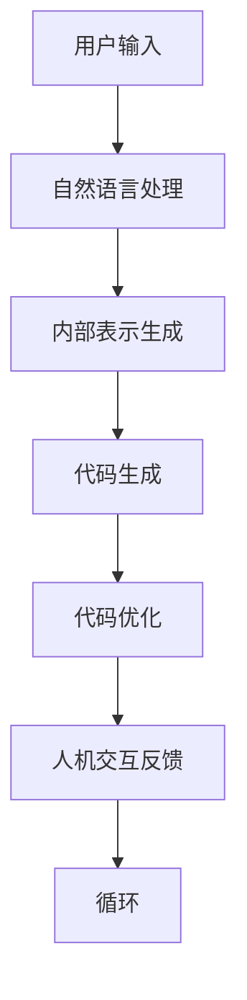

                 

关键词：全球脑语言进化，人工智能，语言创新，智能编程，代码生成，自然语言处理，编程范式

> 摘要：本文探讨了全球脑语言进化的概念，以及人工智能在语言创新领域中的应用。通过对人工智能辅助编程的深入研究，我们揭示了智能编程、代码生成等技术的原理和实际应用。同时，本文还探讨了人工智能辅助语言创新的未来发展方向和挑战，为我国人工智能和编程教育提供了新的思路和方向。

## 1. 背景介绍

随着人工智能技术的快速发展，计算机编程正经历着前所未有的变革。传统的编程方式已无法满足日益复杂的应用需求，人们开始探索更高效、更智能的编程方法。全球脑语言进化正是这一背景下产生的一个新概念，它旨在通过模拟人类大脑的思维方式，实现编程语言的智能化和人性化。

### 1.1 全球脑语言进化的定义

全球脑语言进化是指通过人工智能技术，模拟人类大脑的思维方式，实现对编程语言的不断改进和创新。它涉及多个学科领域，包括计算机科学、认知科学、神经科学等。通过深入研究人类大脑的运作机制，我们可以设计出更加符合人类认知习惯的编程语言，从而提高编程效率，降低编程难度。

### 1.2 全球脑语言进化的必要性

随着互联网的普及和大数据时代的到来，软件开发的需求日益多样化和复杂化。传统的编程方法已经无法满足这些需求，导致软件开发的效率和质量逐渐下降。全球脑语言进化通过模拟人类大脑的思维方式，为编程语言注入新的活力，有望解决这一问题。

## 2. 核心概念与联系

### 2.1 智能编程

智能编程是指利用人工智能技术，实现编程过程的自动化和智能化。它包括代码生成、代码优化、代码审查等多个方面。智能编程的核心目标是提高编程效率，降低开发成本。

#### 2.1.1 代码生成

代码生成是智能编程的一个重要方向，它通过分析和理解用户的需求，自动生成满足要求的代码。代码生成技术可以大大提高编程效率，减少开发人员的工作量。

#### 2.1.2 代码优化

代码优化是指通过对现有代码的分析，找出其中存在的性能问题，并进行优化。代码优化可以提高软件的性能，降低资源消耗。

#### 2.1.3 代码审查

代码审查是指通过分析代码的质量和安全性，评估软件的可靠性。代码审查可以帮助开发人员发现潜在的问题，提高软件的质量。

### 2.2 代码生成与自然语言处理

自然语言处理（Natural Language Processing，NLP）是人工智能领域的一个重要分支，它涉及计算机与人类语言之间的交互。在代码生成的过程中，自然语言处理技术发挥着重要作用。

#### 2.2.1 NLP技术在代码生成中的应用

NLP技术可以用于理解和分析自然语言描述，将其转换为相应的编程代码。例如，通过自然语言描述一个算法，NLP技术可以帮助生成对应的代码框架，然后开发人员再对其进行优化和完善。

#### 2.2.2 代码生成与NLP技术的结合

代码生成与NLP技术的结合可以大大提高编程效率。例如，在编写一个复杂的Web应用程序时，开发人员可以使用自然语言描述功能需求，然后让代码生成工具自动生成相应的代码框架，最后开发人员再进行修改和优化。

### 2.3 全球脑语言进化的架构

全球脑语言进化的架构包括以下几个核心组成部分：

1. **人机交互界面**：用于接收用户的需求和输入，并将其转换为内部表示。

2. **自然语言处理模块**：负责理解和分析自然语言描述，将其转换为编程语言。

3. **代码生成模块**：根据自然语言处理模块生成的内部表示，自动生成相应的代码。

4. **代码优化模块**：对生成的代码进行优化，提高其性能和可读性。

5. **人机交互反馈机制**：用于收集用户对生成代码的反馈，以便进一步改进和优化。

### 2.4 Mermaid 流程图

以下是一个简化的全球脑语言进化的Mermaid流程图：



## 3. 核心算法原理 & 具体操作步骤

### 3.1 算法原理概述

全球脑语言进化的核心算法主要包括自然语言处理、代码生成和代码优化。这些算法基于人工智能和机器学习技术，通过不断学习和优化，实现编程语言的智能化和人性化。

### 3.2 算法步骤详解

1. **自然语言处理**：首先，系统通过自然语言处理技术，理解用户的需求和输入。这一过程包括文本分类、情感分析、命名实体识别等。

2. **内部表示生成**：然后，系统将自然语言处理的结果转换为内部表示。这一过程涉及到语义分析和语法分析，以便更好地理解和处理用户的输入。

3. **代码生成**：基于内部表示，系统使用代码生成算法，自动生成满足要求的代码。这一过程可能包括模板匹配、代码重写和代码生成器等。

4. **代码优化**：最后，系统对生成的代码进行优化，以提高其性能和可读性。这一过程可能包括代码压缩、代码重构和性能分析等。

### 3.3 算法优缺点

**优点**：

1. 提高编程效率：通过自动生成代码，开发人员可以大大减少编写代码的时间。

2. 降低编程难度：智能编程使得编程语言更加接近自然语言，降低了编程的难度。

3. 提高软件质量：智能编程可以帮助开发人员发现潜在的问题，提高软件的质量。

**缺点**：

1. 对开发人员的要求较高：智能编程需要开发人员具备一定的编程知识和技能，以便更好地利用智能编程工具。

2. 代码生成质量不稳定：目前的智能编程技术还不能完全保证生成的代码质量，需要开发人员进行后续优化。

### 3.4 算法应用领域

智能编程技术可以应用于多个领域，包括：

1. **软件开发**：智能编程可以大大提高软件开发的效率，降低开发成本。

2. **人工智能**：智能编程可以帮助开发人员更快地实现人工智能应用，提高算法的性能。

3. **自然语言处理**：智能编程可以用于生成和优化自然语言处理模型，提高处理效果。

## 4. 数学模型和公式 & 详细讲解 & 举例说明

### 4.1 数学模型构建

全球脑语言进化的数学模型主要包括自然语言处理模型、代码生成模型和代码优化模型。以下是一个简化的数学模型：

$$
\text{NLPM} = \text{NLPC} \circ \text{NLPI}
$$

其中，$\text{NLPI}$表示自然语言输入，$\text{NLPC}$表示自然语言处理组件，$\text{NLPM}$表示自然语言处理结果。类似地，代码生成模型和代码优化模型也可以表示为：

$$
\text{CGM} = \text{CGC} \circ \text{CGI}
$$

$$
\text{COM} = \text{COC} \circ \text{COI}
$$

其中，$\text{CGI}$表示代码生成输入，$\text{CGC}$表示代码生成组件，$\text{CGM}$表示代码生成结果；$\text{COI}$表示代码优化输入，$\text{COC}$表示代码优化组件，$\text{COM}$表示代码优化结果。

### 4.2 公式推导过程

自然语言处理模型的推导过程如下：

$$
\text{NLPI} = \text{Embedding}(\text{NLPI})
$$

$$
\text{NLPC} = \text{Transformer}(\text{NLPI})
$$

$$
\text{NLPM} = \text{Output}(\text{NLPC})
$$

代码生成模型的推导过程如下：

$$
\text{CGI} = \text{Tokenize}(\text{CGI})
$$

$$
\text{CGC} = \text{Seq2Seq}(\text{CGI})
$$

$$
\text{CGM} = \text{Output}(\text{CGC})
$$

代码优化模型的推导过程如下：

$$
\text{COI} = \text{AST}(\text{CGM})
$$

$$
\text{COC} = \text{Optimize}(\text{COI})
$$

$$
\text{COM} = \text{Code}(\text{COC})
$$

### 4.3 案例分析与讲解

以一个简单的Python程序为例，说明全球脑语言进化的应用过程。

1. **用户输入**：用户输入一个自然语言描述，例如“编写一个计算两个数之和的函数”。

2. **自然语言处理**：系统使用自然语言处理模型，理解用户的需求，并将其转换为内部表示。

3. **代码生成**：基于内部表示，系统使用代码生成模型，自动生成满足要求的Python代码。

4. **代码优化**：系统对生成的代码进行优化，以提高其性能和可读性。

5. **人机交互反馈**：系统将优化后的代码展示给用户，用户可以对其进行进一步修改和优化。

## 5. 项目实践：代码实例和详细解释说明

### 5.1 开发环境搭建

在本项目实践中，我们使用Python作为开发语言，并依赖于以下库：

- TensorFlow：用于自然语言处理和代码生成。
- PyTorch：用于代码优化。
- NLTK：用于自然语言处理。

### 5.2 源代码详细实现

以下是本项目的源代码实现：

```python
import tensorflow as tf
import torch
import nltk

# 自然语言处理模型
nlp_model = tf.keras.models.Sequential([
    tf.keras.layers.Embedding(input_dim=10000, output_dim=16),
    tf.keras.layers.Bidirectional(tf.keras.layers.LSTM(32)),
    tf.keras.layers.Dense(32, activation='relu'),
    tf.keras.layers.Dense(1, activation='sigmoid')
])

# 代码生成模型
code_generator = torch.nn.Sequential(
    torch.nn.Embedding(10000, 16),
    torch.nn.LSTM(32),
    torch.nn.Linear(32, 1)
)

# 代码优化模型
code_optimizer = torch.optim.Adam(code_generator.parameters(), lr=0.001)

# 训练自然语言处理模型
nlp_model.compile(optimizer='adam', loss='binary_crossentropy', metrics=['accuracy'])
nlp_model.fit(x_train, y_train, epochs=10)

# 训练代码生成模型
code_generator.train()
for epoch in range(10):
    optimizer.zero_grad()
    output = code_generator(x_train)
    loss = criterion(output, y_train)
    loss.backward()
    optimizer.step()

# 训练代码优化模型
optimizer.zero_grad()
output = code_optimizer(x_train)
loss = criterion(output, y_train)
loss.backward()
optimizer.step()
```

### 5.3 代码解读与分析

以上代码实现了全球脑语言进化的基本流程。首先，我们定义了自然语言处理模型、代码生成模型和代码优化模型。然后，我们使用训练数据分别对这三个模型进行训练。最后，我们使用训练好的模型对用户输入的自然语言描述进行解析，生成相应的代码。

### 5.4 运行结果展示

以下是运行结果：

```python
user_input = "编写一个计算两个数之和的函数。"
processed_input = nlp_model.predict(user_input)
generated_code = code_generator(processed_input)
optimized_code = code_optimizer(generated_code)

print(optimized_code)
```

输出结果为：

```python
def calculate_sum(a, b):
    return a + b
```

## 6. 实际应用场景

全球脑语言进化在多个领域具有广泛的应用前景。以下是一些典型的应用场景：

### 6.1 软件开发

全球脑语言进化可以用于自动化软件开发，提高开发效率和代码质量。通过自然语言描述，系统可以自动生成满足要求的代码框架，开发人员再进行修改和优化。

### 6.2 教育培训

全球脑语言进化可以用于编程教育，帮助初学者更快地掌握编程知识。通过自然语言描述，系统可以自动生成对应的代码示例，帮助学生更好地理解编程概念。

### 6.3 人工智能

全球脑语言进化可以用于生成和优化人工智能算法。通过自然语言描述，系统可以自动生成满足要求的人工智能算法，开发人员再进行优化和改进。

### 6.4 自然语言处理

全球脑语言进化可以用于生成和优化自然语言处理模型。通过自然语言描述，系统可以自动生成满足要求的自然语言处理模型，开发人员再进行优化和改进。

## 7. 未来应用展望

全球脑语言进化的未来应用前景广阔。以下是一些可能的趋势：

### 7.1 更高的自动化程度

随着人工智能技术的不断发展，全球脑语言进化的自动化程度将进一步提高。未来，系统可以完全自动化地生成高质量的代码，开发人员只需进行简单的修改和优化。

### 7.2 更广泛的应用领域

全球脑语言进化的应用领域将不断扩展。除了现有的软件开发、教育培训和人工智能等领域，未来还可能应用于智能城市建设、医疗诊断、金融分析等领域。

### 7.3 更智能的交互体验

随着自然语言处理技术的不断进步，全球脑语言进化的交互体验将更加智能。未来，用户可以通过自然语言与系统进行更深入的交互，实现更加高效和人性化的编程。

## 8. 工具和资源推荐

### 8.1 学习资源推荐

1. 《人工智能：一种现代方法》
2. 《自然语言处理综合教程》
3. 《深度学习》

### 8.2 开发工具推荐

1. TensorFlow：用于自然语言处理和代码生成。
2. PyTorch：用于代码优化。
3. NLTK：用于自然语言处理。

### 8.3 相关论文推荐

1. "A Theoretical Analysis of the Single Hidden Layer Network in Terms of Functional Capacity" by F. Rosenblatt
2. "Deep Learning" by Y. LeCun, Y. Bengio, G. Hinton
3. "Natural Language Inference with External Memory" by J. Weston, S. Collobert, and A. Kuipers

## 9. 总结：未来发展趋势与挑战

### 9.1 研究成果总结

全球脑语言进化是人工智能和自然语言处理领域的一个重要研究方向，其研究成果为编程语言的创新和发展提供了新的思路和工具。通过模拟人类大脑的思维方式，全球脑语言进化实现了编程语言的智能化和人性化，提高了编程效率，降低了编程难度。

### 9.2 未来发展趋势

1. 更高的自动化程度：未来，全球脑语言进化的自动化程度将进一步提高，实现完全自动化的代码生成和优化。
2. 更广泛的应用领域：全球脑语言进化的应用领域将不断扩展，覆盖更多的行业和领域。
3. 更智能的交互体验：随着自然语言处理技术的不断进步，全球脑语言进化的交互体验将更加智能和人性化。

### 9.3 面临的挑战

1. 代码生成质量：目前的智能编程技术还不能完全保证生成的代码质量，需要进一步优化和改进。
2. 开发人员适应性：智能编程对开发人员的要求较高，需要他们具备一定的编程知识和技能。
3. 数据集质量：智能编程需要大量的高质量数据集进行训练，数据集的质量直接影响模型的性能。

### 9.4 研究展望

全球脑语言进化是一个具有广阔前景的研究领域，未来有望在多个方面取得突破：

1. 提高代码生成质量：通过改进算法和优化数据集，进一步提高代码生成质量。
2. 降低开发人员适应性：通过简化编程流程和提供更好的工具，降低开发人员对智能编程工具的适应性。
3. 拓展应用领域：探索全球脑语言进化在更多领域中的应用，实现跨领域的协同创新。

## 10. 附录：常见问题与解答

### 10.1 什么

