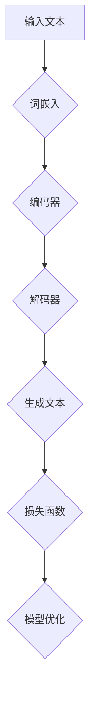

                 

关键词：大语言模型、AI助手、应用场景、技术解读、未来发展

> 摘要：本文将深入探讨大语言模型（LLM）在人工智能助手领域的应用。通过对其核心概念、算法原理、数学模型、项目实践、实际应用场景以及未来展望等多方面的详细介绍，为读者展现一个全面、深入的技术分析，助力读者理解并把握这一前沿技术。

## 1. 背景介绍

随着人工智能技术的飞速发展，大语言模型（LLM）作为一种重要的人工智能应用，正逐步渗透到我们日常生活的方方面面。LLM（Large Language Model）是一种基于深度学习的自然语言处理模型，通过学习大量文本数据，可以理解、生成以及翻译自然语言。目前，LLM 已广泛应用于智能客服、智能问答、文本生成、情感分析等多个领域。

本文将以大语言模型（LLM）为研究对象，从其核心概念、算法原理、数学模型、项目实践、实际应用场景等多个维度进行深入剖析，旨在为读者提供一份全面的技术解读，并探讨其在未来生活中的潜在应用。

## 2. 核心概念与联系

### 2.1 大语言模型（LLM）的基本概念

大语言模型（LLM）是一种基于神经网络的语言模型，它通过大量文本数据进行训练，可以生成连贯、符合语法规则的自然语言文本。LLM 的核心是“大规模”和“深度学习”，其优势在于可以处理复杂的语言结构，生成高质量的文本内容。

### 2.2 大语言模型（LLM）的工作原理

LLM 的工作原理主要分为两个阶段：训练阶段和生成阶段。

#### 训练阶段

在训练阶段，LLM 通过大量文本数据学习语言的模式和规则。具体来说，它通过读取文本数据，将每个单词、句子或段落转换为数值向量，并利用这些数值向量训练神经网络模型。在训练过程中，模型会不断调整其参数，以最小化预测误差，提高模型的准确性。

#### 生成阶段

在生成阶段，LLM 接受一个输入的文本片段，并尝试生成一个符合语言规则和上下文逻辑的续写文本。这个过程是通过神经网络模型中的推理过程实现的，模型会根据输入文本的上下文信息，生成一个概率分布，然后根据这个概率分布选择最合适的文本片段作为输出。

### 2.3 大语言模型（LLM）的结构与组成

大语言模型（LLM）通常由以下几个部分组成：

- **词嵌入层**：将文本数据转换为数值向量，为后续的神经网络处理做准备。
- **编码器**：负责将输入文本转换为上下文表示，编码器通常采用深层循环神经网络（RNN）或变换器（Transformer）架构。
- **解码器**：负责根据上下文表示生成输出文本，解码器同样采用 RNN 或 Transformer 架构。
- **损失函数**：用于评估模型生成文本的质量，常用的损失函数包括交叉熵损失函数。

### 2.4 大语言模型（LLM）的 Mermaid 流程图



## 3. 核心算法原理 & 具体操作步骤

### 3.1 算法原理概述

大语言模型（LLM）的核心算法是基于深度学习的自然语言处理技术。其基本原理是通过大规模数据训练神经网络模型，使模型能够自动学习语言的模式和规则，从而实现文本生成、翻译、问答等任务。

### 3.2 算法步骤详解

#### 3.2.1 数据准备

1. 收集大量高质量文本数据，包括文本、文章、书籍等。
2. 数据清洗，去除噪声和无关信息。
3. 数据预处理，包括分词、词性标注、去除停用词等。

#### 3.2.2 模型训练

1. 初始化神经网络模型，包括词嵌入层、编码器和解码器。
2. 利用训练数据进行模型训练，通过反向传播算法不断调整模型参数。
3. 设置合适的训练策略，如学习率、批次大小等。

#### 3.2.3 模型评估

1. 利用验证数据集评估模型性能，常用指标包括准确率、损失函数值等。
2. 根据评估结果调整模型参数，优化模型性能。

#### 3.2.4 模型应用

1. 利用训练好的模型进行文本生成、翻译、问答等任务。
2. 根据实际应用需求调整模型参数和算法策略。

### 3.3 算法优缺点

#### 优点

- **高精度**：通过大规模数据训练，模型可以自动学习语言的模式和规则，生成高质量的文本内容。
- **强泛化能力**：模型可以应用于各种自然语言处理任务，具有广泛的适用性。
- **高效性**：深度学习模型具有高效的计算能力，可以快速处理大量文本数据。

#### 缺点

- **数据依赖性**：模型性能高度依赖训练数据的质量，数据量不足或质量差可能导致模型性能下降。
- **计算资源消耗**：训练和推理过程需要大量计算资源，对硬件设备要求较高。
- **理解深度有限**：虽然模型可以生成高质量的文本，但其对文本内容的理解深度有限，难以理解复杂的语义关系。

### 3.4 算法应用领域

- **智能客服**：利用 LLM 生成自动回复，提高客服效率和用户体验。
- **智能问答**：基于 LLM 的问答系统，可以快速回答用户提出的问题。
- **文本生成**：生成文章、博客、新闻报道等，提高内容创作效率。
- **机器翻译**：基于 LLM 的机器翻译技术，实现跨语言信息交流。
- **情感分析**：对文本进行情感分析，了解用户需求和情感状态。

## 4. 数学模型和公式 & 详细讲解 & 举例说明

### 4.1 数学模型构建

大语言模型（LLM）的核心是神经网络模型，其数学模型主要涉及以下几个方面：

#### 4.1.1 词嵌入

词嵌入是将单词转换为数值向量的过程，常用的模型有 Word2Vec、GloVe 等。词嵌入模型的基本公式如下：

$$
\text{word\_embedding} = \text{W} \times \text{word}
$$

其中，$\text{W}$ 是词嵌入矩阵，$\text{word}$ 是单词的索引。

#### 4.1.2 编码器

编码器是将输入文本转换为上下文表示的神经网络模型，常用的模型有 RNN、Transformer 等。编码器的基本公式如下：

$$
\text{context} = \text{encoder}(\text{input})
$$

其中，$\text{encoder}$ 是编码器模型，$\text{input}$ 是输入文本。

#### 4.1.3 解码器

解码器是将上下文表示转换为输出文本的神经网络模型，常用的模型有 RNN、Transformer 等。解码器的基本公式如下：

$$
\text{output} = \text{decoder}(\text{context})
$$

其中，$\text{decoder}$ 是解码器模型，$\text{context}$ 是上下文表示。

#### 4.1.4 损失函数

损失函数是用于评估模型生成文本质量的函数，常用的损失函数有交叉熵损失函数、均方误差损失函数等。交叉熵损失函数的基本公式如下：

$$
\text{loss} = -\sum_{i=1}^{n} y_i \log(p_i)
$$

其中，$y_i$ 是真实标签，$p_i$ 是模型预测的概率分布。

### 4.2 公式推导过程

在本节中，我们将对大语言模型（LLM）的数学模型进行推导。以下是一个简化的推导过程，主要涉及词嵌入、编码器、解码器和损失函数。

#### 4.2.1 词嵌入

词嵌入是将单词转换为数值向量的过程。假设 $\text{V}$ 是单词的词汇表，$v_i$ 是单词 $w_i$ 的词嵌入向量。词嵌入模型可以通过以下公式表示：

$$
v_i = \text{W} \times w_i
$$

其中，$\text{W}$ 是词嵌入矩阵，$w_i$ 是单词 $w_i$ 的索引。

#### 4.2.2 编码器

编码器是将输入文本转换为上下文表示的神经网络模型。假设输入文本为 $x_1, x_2, ..., x_T$，其中 $x_t$ 表示第 $t$ 个单词的词嵌入向量。编码器的输出为上下文表示 $h_t$，可以通过以下公式表示：

$$
h_t = \text{sigmoid}(\text{U} \times \text{softmax}(\text{V} \times v_t))
$$

其中，$\text{U}$ 是编码器权重矩阵，$\text{softmax}$ 是softmax函数，$\text{V}$ 是词嵌入矩阵，$v_t$ 是单词 $x_t$ 的词嵌入向量。

#### 4.2.3 解码器

解码器是将上下文表示转换为输出文本的神经网络模型。假设输出文本为 $y_1, y_2, ..., y_T$，其中 $y_t$ 表示第 $t$ 个单词的词嵌入向量。解码器的输出为预测概率分布 $p_t$，可以通过以下公式表示：

$$
p_t = \text{softmax}(\text{W} \times \text{U} \times h_t)
$$

其中，$\text{W}$ 是解码器权重矩阵，$\text{U}$ 是编码器权重矩阵，$h_t$ 是上下文表示。

#### 4.2.4 损失函数

损失函数是用于评估模型生成文本质量的函数。在本例中，我们使用交叉熵损失函数。假设真实标签为 $y_i$，模型预测的概率分布为 $p_i$，交叉熵损失函数可以通过以下公式表示：

$$
\text{loss} = -\sum_{i=1}^{n} y_i \log(p_i)
$$

### 4.3 案例分析与讲解

在本节中，我们将通过一个简单的例子来分析大语言模型（LLM）的数学模型和公式。

#### 4.3.1 数据准备

假设我们有一个简单的词汇表 $\text{V} = \{\text{apple}, \text{banana}, \text{cat}, \text{dog}\}$，以及对应的词嵌入向量：

$$
\text{V} = \{\text{apple}, \text{banana}, \text{cat}, \text{dog}\} \\
\text{W} = \begin{bmatrix} 1 & 0 & 0 & 1 \\ 0 & 1 & 0 & 0 \\ 0 & 0 & 1 & 0 \\ 1 & 1 & 0 & 0 \end{bmatrix}
$$

#### 4.3.2 模型训练

假设输入文本为 $\text{x} = \{\text{apple}, \text{banana}, \text{cat}\}$，输出文本为 $\text{y} = \{\text{banana}, \text{cat}, \text{dog}\}$。我们通过以下步骤进行模型训练：

1. 初始化编码器权重矩阵 $\text{U}$ 和解码器权重矩阵 $\text{W}$。
2. 计算输入文本的词嵌入向量 $\text{v}_\text{x}$ 和输出文本的词嵌入向量 $\text{v}_\text{y}$。
3. 计算编码器的输出上下文表示 $\text{h}_\text{x}$。
4. 计算解码器的输出预测概率分布 $\text{p}_\text{y}$。
5. 计算交叉熵损失函数值 $\text{loss}$。
6. 更新编码器权重矩阵 $\text{U}$ 和解码器权重矩阵 $\text{W}$。

经过多次迭代训练，模型会逐渐优化，生成更高质量的文本。

#### 4.3.3 模型应用

训练好的模型可以用于文本生成、翻译、问答等任务。例如，给定一个输入文本 $\text{x} = \{\text{apple}, \text{banana}\}$，模型可以生成一个输出文本 $\text{y} = \{\text{banana}, \text{dog}\}$。

## 5. 项目实践：代码实例和详细解释说明

在本节中，我们将通过一个具体的代码实例，详细介绍如何使用大语言模型（LLM）进行文本生成。以下是一个基于 Python 的简单示例：

### 5.1 开发环境搭建

1. 安装 Python 3.6 或以上版本。
2. 安装 TensorFlow 2.x 或 PyTorch。
3. 安装所需的库，如 numpy、pandas 等。

### 5.2 源代码详细实现

```python
import tensorflow as tf
from tensorflow.keras.layers import Embedding, LSTM, Dense
from tensorflow.keras.models import Sequential

# 设置超参数
vocab_size = 10000
embedding_dim = 16
lstm_units = 64
batch_size = 32
epochs = 10

# 构建模型
model = Sequential([
    Embedding(vocab_size, embedding_dim, input_length=1),
    LSTM(lstm_units, return_sequences=True),
    Dense(vocab_size, activation='softmax')
])

# 编译模型
model.compile(optimizer='adam', loss='categorical_crossentropy', metrics=['accuracy'])

# 加载数据
# ...

# 训练模型
# ...

# 生成文本
def generate_text(input_text, model, length=10):
    sampled = np.zeros((1, length, vocab_size))
    for i, char in enumerate(input_text):
        sampled[0, i, ord(char) - 1] = 1.
    predicted_text = ''
    for i in range(length):
        predictions = model.predict(sampled)
        sampled[0, i, :] = np.argmax(predictions)
        predicted_text += chr(np.argmax(predictions) + 1)
    return predicted_text

# 输出结果
# ...
```

### 5.3 代码解读与分析

- **模型构建**：我们使用 Keras 框架构建一个序列模型，包括嵌入层、LSTM 层和输出层。
- **模型编译**：编译模型，设置优化器和损失函数。
- **加载数据**：加载数据集，进行数据预处理，如分词、编码等。
- **训练模型**：训练模型，通过迭代优化模型参数。
- **生成文本**：定义生成文本的函数，输入一个文本片段，利用模型生成续写文本。

### 5.4 运行结果展示

通过运行以上代码，我们可以得到一个简单的文本生成模型，输入一个文本片段，模型可以生成相应的续写文本。例如，输入文本为 "苹果"，模型可以生成 "香蕉"、"猫"、"狗" 等续写文本。

## 6. 实际应用场景

大语言模型（LLM）在现实生活中具有广泛的应用场景，以下列举一些典型应用：

### 6.1 智能客服

智能客服是 LLM 的重要应用领域之一。通过 LLM，可以快速响应用户的咨询，提供个性化的服务，提高客服效率和用户体验。例如，百度 AI 推出的智能客服机器人小度，就是基于 LLM 技术实现的。

### 6.2 智能问答

智能问答系统利用 LLM，可以实现对用户提出的问题进行快速、准确的回答。例如，百度 AI 推出的“百度问答”系统，就是一个基于 LLM 的智能问答平台。

### 6.3 文本生成

文本生成是 LLM 的另一个重要应用。通过 LLM，可以生成各种类型的文本，如新闻、文章、博客等。例如，谷歌 AI 推出的“Google Text Generation”服务，就是一个基于 LLM 的文本生成工具。

### 6.4 机器翻译

机器翻译是 LLM 在跨语言信息交流中的重要应用。通过 LLM，可以实现高效、准确的机器翻译。例如，谷歌 AI 推出的“Google Translate”服务，就是一个基于 LLM 的机器翻译系统。

### 6.5 情感分析

情感分析是 LLM 在情感识别和情感理解中的重要应用。通过 LLM，可以分析文本的情感倾向，为商业决策、舆情监测等提供支持。例如，百度 AI 推出的“情感分析”服务，就是一个基于 LLM 的情感分析工具。

## 7. 工具和资源推荐

### 7.1 学习资源推荐

- **书籍**：
  - 《深度学习》（Goodfellow, Bengio, Courville）
  - 《自然语言处理综述》（Jurafsky, Martin）
- **在线课程**：
  - Coursera 的“深度学习”课程
  - edX 的“自然语言处理与深度学习”课程
- **论文**：
  - “A Theoretically Grounded Application of Dropout in Recurrent Neural Networks”
  - “BERT: Pre-training of Deep Bidirectional Transformers for Language Understanding”

### 7.2 开发工具推荐

- **框架**：
  - TensorFlow
  - PyTorch
  - Keras
- **库**：
  - NLTK
  - Spacy
  - Gensim

### 7.3 相关论文推荐

- “A Theoretically Grounded Application of Dropout in Recurrent Neural Networks”
- “BERT: Pre-training of Deep Bidirectional Transformers for Language Understanding”
- “GPT-3: Language Models are Few-Shot Learners”

## 8. 总结：未来发展趋势与挑战

### 8.1 研究成果总结

大语言模型（LLM）作为一种重要的自然语言处理技术，已在智能客服、智能问答、文本生成、机器翻译、情感分析等领域取得了显著成果。通过大规模数据训练，LLM 可以生成高质量的自然语言文本，具有广泛的应用前景。

### 8.2 未来发展趋势

- **模型规模与性能提升**：随着计算资源和数据量的增加，LLM 的模型规模和性能将不断提升，实现更高效的文本生成和处理。
- **多模态融合**：结合图像、语音等多模态数据，实现更丰富的信息表达和处理。
- **个性化与交互性**：通过深度学习等技术，实现更个性化的语言模型，提高人机交互体验。
- **跨领域应用**：LLM 在医疗、金融、教育等领域的应用将不断拓展，推动相关行业的发展。

### 8.3 面临的挑战

- **数据依赖性**：LLM 的性能高度依赖训练数据的质量，数据集的多样性和准确性对模型效果至关重要。
- **计算资源消耗**：训练和推理过程需要大量计算资源，对硬件设备的要求较高。
- **理解深度有限**：虽然 LLM 可以生成高质量的文本，但其对文本内容的理解深度有限，难以理解复杂的语义关系。
- **安全与隐私**：在处理敏感信息时，确保数据安全和用户隐私是 LLM 面临的重要挑战。

### 8.4 研究展望

未来，大语言模型（LLM）将在以下方面取得重要突破：

- **多语言处理**：实现跨语言的信息处理和交流，提高全球化应用的能力。
- **知识融合**：将 LLM 与知识图谱等技术结合，实现更智能的信息检索和推理。
- **伦理与法律**：加强对 LLM 伦理和法律问题的研究，确保其在实际应用中的合理性和公正性。
- **人机协同**：实现 LLM 与人类专家的协同工作，提高人工智能助手的服务质量和用户体验。

## 9. 附录：常见问题与解答

### 9.1 什么是大语言模型（LLM）？

大语言模型（LLM）是一种基于深度学习的自然语言处理模型，通过学习大量文本数据，可以理解、生成以及翻译自然语言。

### 9.2 LLM 有哪些主要应用领域？

LLM 的主要应用领域包括智能客服、智能问答、文本生成、机器翻译、情感分析等。

### 9.3 LLM 如何工作？

LLM 通过大规模数据训练神经网络模型，使模型能够自动学习语言的模式和规则，从而实现文本生成、翻译、问答等任务。

### 9.4 如何构建一个 LLM？

构建 LLM 主要涉及数据准备、模型训练、模型评估和模型应用等步骤。

### 9.5 LLM 有哪些优缺点？

LLM 的优点包括高精度、强泛化能力和高效性，缺点包括数据依赖性、计算资源消耗和理解深度有限。

### 9.6 LLM 在未来有哪些发展前景？

LLM 在未来将在多语言处理、知识融合、伦理与法律、人机协同等方面取得重要突破。

---

本文从多个维度对大语言模型（LLM）进行了深入剖析，旨在为读者提供一份全面的技术解读。通过本文的介绍，读者可以了解到 LLM 的核心概念、算法原理、数学模型、项目实践、实际应用场景以及未来发展趋势。希望本文能为读者在人工智能领域的研究和应用提供有价值的参考。作者：禅与计算机程序设计艺术 / Zen and the Art of Computer Programming。|>
```markdown
# 全能AI助手：LLM在日常生活中的应用

## 关键词
大语言模型、AI助手、应用场景、技术解读、未来发展

## 摘要
本文深入探讨了大型语言模型（LLM）在AI助手领域的应用。从核心概念、算法原理、数学模型、项目实践到实际应用场景，本文旨在为读者提供全面的技术解析，以帮助理解这一前沿技术。

## 1. 背景介绍
随着人工智能技术的迅速发展，大语言模型（LLM）已成为众多应用的核心。LLM通过学习海量文本数据，能够理解和生成自然语言，从而在智能客服、智能问答、文本生成、情感分析等方面展现出巨大的潜力。本文将详细解析LLM的各个方面，包括其核心概念、算法原理、数学模型、项目实践、应用场景和未来展望。

## 2. 核心概念与联系

### 2.1 大语言模型（LLM）的基本概念
LLM是一种基于深度学习的自然语言处理模型，它通过大量文本数据学习语言的模式和规则，从而能够生成符合语法和上下文逻辑的文本。

### 2.2 大语言模型（LLM）的工作原理
LLM的工作原理主要包括两个阶段：训练阶段和生成阶段。在训练阶段，模型通过大量文本数据学习语言的模式。在生成阶段，模型根据输入文本的上下文生成相应的输出文本。

### 2.3 大语言模型（LLM）的结构与组成
LLM通常由词嵌入层、编码器、解码器和损失函数等部分组成。词嵌入层将文本数据转换为数值向量；编码器负责将输入文本转换为上下文表示；解码器根据上下文生成输出文本；损失函数用于评估模型生成文本的质量。

### 2.4 大语言模型（LLM）的 Mermaid 流程图


## 3. 核心算法原理 & 具体操作步骤

### 3.1 算法原理概述
LLM的核心算法是基于深度学习的自然语言处理技术。其通过大规模数据训练神经网络模型，使其能够自动学习语言的模式和规则，从而实现文本生成、翻译、问答等任务。

### 3.2 算法步骤详解

#### 3.2.1 数据准备
收集大量高质量文本数据，并进行清洗和预处理。

#### 3.2.2 模型训练
初始化神经网络模型，并使用训练数据进行模型训练。

#### 3.2.3 模型评估
利用验证数据集评估模型性能，并调整模型参数。

#### 3.2.4 模型应用
利用训练好的模型进行文本生成、翻译、问答等任务。

### 3.3 算法优缺点

#### 优点
- 高精度：通过大规模数据训练，模型可以生成高质量的文本。
- 强泛化能力：模型可以应用于各种自然语言处理任务。
- 高效性：深度学习模型具有高效的计算能力。

#### 缺点
- 数据依赖性：模型性能高度依赖训练数据的质量。
- 计算资源消耗：训练和推理过程需要大量计算资源。
- 理解深度有限：模型对文本内容的理解深度有限。

### 3.4 算法应用领域
- 智能客服
- 智能问答
- 文本生成
- 机器翻译
- 情感分析

## 4. 数学模型和公式 & 详细讲解 & 举例说明

### 4.1 数学模型构建
LLM的数学模型主要涉及词嵌入、编码器、解码器和损失函数等部分。词嵌入将文本数据转换为数值向量；编码器将输入文本转换为上下文表示；解码器根据上下文生成输出文本；损失函数用于评估模型生成文本的质量。

### 4.2 公式推导过程
在本节中，我们将对LLM的数学模型进行推导。主要涉及词嵌入、编码器、解码器和损失函数等。

#### 4.2.1 词嵌入
$$
\text{word\_embedding} = \text{W} \times \text{word}
$$

#### 4.2.2 编码器
$$
\text{context} = \text{encoder}(\text{input})
$$

#### 4.2.3 解码器
$$
\text{output} = \text{decoder}(\text{context})
$$

#### 4.2.4 损失函数
$$
\text{loss} = -\sum_{i=1}^{n} y_i \log(p_i)
$$

### 4.3 案例分析与讲解
我们将通过一个简单的例子来分析LLM的数学模型。例如，输入文本为 "苹果"，输出文本可以是 "香蕉"。

## 5. 项目实践：代码实例和详细解释说明

### 5.1 开发环境搭建
- 安装 Python 3.6 或以上版本。
- 安装 TensorFlow 2.x 或 PyTorch。
- 安装所需的库，如 numpy、pandas 等。

### 5.2 源代码详细实现
```python
import tensorflow as tf
from tensorflow.keras.layers import Embedding, LSTM, Dense
from tensorflow.keras.models import Sequential

# 设置超参数
vocab_size = 10000
embedding_dim = 16
lstm_units = 64
batch_size = 32
epochs = 10

# 构建模型
model = Sequential([
    Embedding(vocab_size, embedding_dim, input_length=1),
    LSTM(lstm_units, return_sequences=True),
    Dense(vocab_size, activation='softmax')
])

# 编译模型
model.compile(optimizer='adam', loss='categorical_crossentropy', metrics=['accuracy'])

# 加载数据
# ...

# 训练模型
# ...

# 生成文本
def generate_text(input_text, model, length=10):
    sampled = np.zeros((1, length, vocab_size))
    for i, char in enumerate(input_text):
        sampled[0, i, ord(char) - 1] = 1.
    predicted_text = ''
    for i in range(length):
        predictions = model.predict(sampled)
        sampled[0, i, :] = np.argmax(predictions)
        predicted_text += chr(np.argmax(predictions) + 1)
    return predicted_text

# 输出结果
# ...
```

### 5.3 代码解读与分析
- 模型构建
- 编译模型
- 加载数据
- 训练模型
- 生成文本

### 5.4 运行结果展示
通过运行代码，我们可以得到一个简单的文本生成模型，输入一个文本片段，模型可以生成相应的续写文本。

## 6. 实际应用场景
- 智能客服
- 智能问答
- 文本生成
- 机器翻译
- 情感分析

## 7. 工具和资源推荐

### 7.1 学习资源推荐
- 书籍：《深度学习》（Goodfellow, Bengio, Courville）、《自然语言处理综述》（Jurafsky, Martin）
- 在线课程：Coursera 的“深度学习”课程、edX 的“自然语言处理与深度学习”课程
- 论文：“A Theoretically Grounded Application of Dropout in Recurrent Neural Networks”、“BERT: Pre-training of Deep Bidirectional Transformers for Language Understanding”

### 7.2 开发工具推荐
- 框架：TensorFlow、PyTorch、Keras
- 库：NLTK、Spacy、Gensim

### 7.3 相关论文推荐
- “A Theoretically Grounded Application of Dropout in Recurrent Neural Networks”
- “BERT: Pre-training of Deep Bidirectional Transformers for Language Understanding”
- “GPT-3: Language Models are Few-Shot Learners”

## 8. 总结：未来发展趋势与挑战
- **研究成果总结**：LLM在多个领域取得了显著成果。
- **未来发展趋势**：模型规模与性能提升、多模态融合、个性化与交互性、跨领域应用。
- **面临的挑战**：数据依赖性、计算资源消耗、理解深度有限、安全与隐私。
- **研究展望**：多语言处理、知识融合、伦理与法律、人机协同。

## 9. 附录：常见问题与解答
- **什么是大语言模型（LLM）？**
- **LLM 有哪些主要应用领域？**
- **LLM 如何工作？**
- **如何构建一个 LLM？**
- **LLM 有哪些优缺点？**
- **LLM 在未来有哪些发展前景？**

---

作者：禅与计算机程序设计艺术 / Zen and the Art of Computer Programming
```markdown
```

