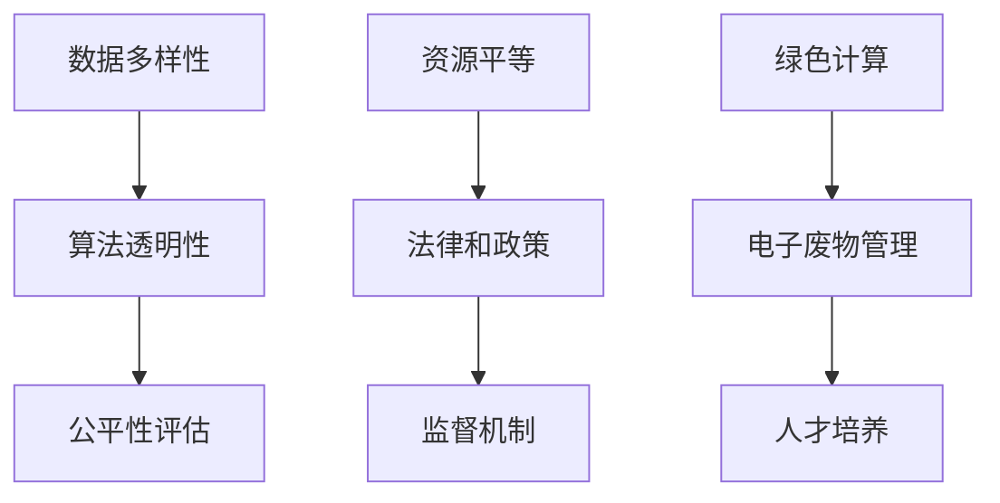

                 

关键词：计算伦理、人工智能、可持续发展、公正性、公平性

> 摘要：本文旨在探讨计算伦理的基本原则，特别是在人工智能时代背景下，公平性、公正性和可持续性在计算领域中的重要性。通过详细分析这些核心概念，本文提出了一系列的伦理原则，以指导未来的人工智能和计算技术的发展，确保其在人类社会中发挥积极作用。

## 1. 背景介绍

随着计算机技术和人工智能的迅猛发展，我们正处在一场前所未有的技术革命之中。然而，这一技术进步也带来了一系列新的伦理挑战。例如，人工智能系统的决策过程可能会产生偏见，影响社会公平；大规模数据处理可能侵犯个人隐私；技术的快速迭代可能导致人才供需失衡，影响可持续发展。因此，探讨计算伦理的基本原则，尤其是公平性、公正性和可持续性，显得尤为重要。

公平性（Equity）关注的是机会的平等，无论个人的背景或起点如何，都应享有公平的待遇。公正性（Justice）则涉及对资源的合理分配，确保每个人都有获得应得权益的机会。可持续性（Sustainability）强调在计算技术的发展过程中，要考虑到对环境的保护和对未来世代的影响。

本文将从这三个核心概念出发，探讨其在人工智能和计算领域的应用，并提出一系列伦理原则，以指导技术的发展，确保其对人类社会产生积极影响。

## 2. 核心概念与联系

### 2.1 公平性

公平性是计算伦理中的一个基本概念，其核心在于确保每个人都有平等的参与机会和结果。在人工智能领域，公平性尤为重要，因为算法和模型的选择和训练过程可能会引入偏见，导致不平等的结果。

为了实现公平性，我们需要：

- **数据多样性**：确保训练数据涵盖不同背景和群体的代表性。
- **算法透明性**：使算法的决策过程透明，便于审查和纠正潜在的偏见。
- **公平性评估**：定期对算法进行公平性评估，确保其不会加剧社会不平等。

### 2.2 公正性

公正性是另一个核心伦理原则，它关注资源的合理分配和每个人的应得权益。在计算领域，公正性体现在对技术资源和机会的公平分配，以及确保每个人的权益得到尊重。

为了实现公正性，我们需要：

- **资源平等**：确保技术资源的分配不受到种族、性别、经济地位等因素的影响。
- **法律和政策**：建立相应的法律和政策框架，保障每个人的权益。
- **监督机制**：建立有效的监督机制，防止滥用技术资源，确保公正性。

### 2.3 可持续性

可持续性是计算伦理中的新兴概念，强调在技术发展的过程中，要考虑到对环境的保护和未来世代的影响。随着计算技术的发展，能源消耗和电子废物等问题日益突出，可持续性变得尤为重要。

为了实现可持续性，我们需要：

- **绿色计算**：开发低能耗的计算技术，减少对环境的影响。
- **电子废物管理**：建立有效的电子废物回收和再利用体系。
- **人才培养**：培养具有可持续意识的技术人才，推动绿色计算的发展。

### 2.4 Mermaid 流程图

以下是实现计算伦理中公平性、公正性和可持续性的 Mermaid 流程图：



## 3. 核心算法原理 & 具体操作步骤

### 3.1 算法原理概述

在计算伦理的实践中，算法的设计和实现至关重要。以下是一些核心算法原理，旨在实现公平性、公正性和可持续性：

- **公平性算法**：使用多种数据来源和算法评估方法，确保决策过程的公平性。
- **公正性算法**：设计用于资源分配的算法，确保分配过程的公正性。
- **可持续性算法**：开发用于优化能源消耗和废物管理的算法，推动绿色计算的发展。

### 3.2 算法步骤详解

#### 3.2.1 公平性算法

1. **数据收集**：收集多种来源的数据，确保数据多样性。
2. **数据预处理**：对数据进行清洗和标准化处理。
3. **模型训练**：使用预处理后的数据训练模型。
4. **模型评估**：使用多种评估方法，如混淆矩阵、ROC曲线等，评估模型的公平性。
5. **调整模型**：根据评估结果调整模型参数，提高模型的公平性。

#### 3.2.2 公正性算法

1. **需求分析**：分析不同群体的需求，确定资源分配的目标。
2. **设计算法**：设计用于资源分配的算法，如最优化算法、公平分配算法等。
3. **模拟测试**：在模拟环境中测试算法的性能和公平性。
4. **实施算法**：将算法应用于实际场景，进行资源分配。

#### 3.2.3 可持续性算法

1. **能耗分析**：分析不同计算任务对能源的消耗。
2. **优化算法**：设计用于优化能源消耗的算法，如能耗优化算法、任务调度算法等。
3. **测试与验证**：在模拟环境中测试和验证算法的性能。
4. **部署与实施**：将算法部署到实际计算环境中，实现绿色计算。

### 3.3 算法优缺点

#### 公平性算法

- **优点**：提高决策过程的公平性，减少偏见和歧视。
- **缺点**：可能增加计算复杂度，对数据质量和算法设计要求较高。

#### 公正性算法

- **优点**：确保资源分配的公正性，符合社会公平原则。
- **缺点**：可能无法完全消除偏见，需要不断调整和优化。

#### 可持续性算法

- **优点**：降低能源消耗，减少对环境的影响。
- **缺点**：可能影响计算性能，需要平衡能耗与性能。

### 3.4 算法应用领域

- **公平性算法**：应用于招聘、贷款审批、医疗诊断等领域，提高决策过程的公平性。
- **公正性算法**：应用于资源分配、社会福利等领域，确保资源的合理分配。
- **可持续性算法**：应用于数据中心、智能电网等领域，推动绿色计算的发展。

## 4. 数学模型和公式 & 详细讲解 & 举例说明

### 4.1 数学模型构建

为了实现计算伦理中的公平性、公正性和可持续性，我们需要构建相应的数学模型。以下是一些基本的数学模型：

#### 4.1.1 公平性模型

假设我们有 $N$ 个决策目标，每个目标有一个权重 $w_i$，算法的决策结果为 $d_i$，则公平性模型可以表示为：

$$
F = \frac{1}{N} \sum_{i=1}^{N} w_i \cdot d_i
$$

其中，$d_i$ 可以是二值变量（0或1），表示目标是否被满足；$w_i$ 表示目标的权重。

#### 4.1.2 公正性模型

公正性模型可以用于资源分配，假设有 $M$ 个资源需求，每个资源需求有一个权重 $r_j$，资源分配结果为 $x_j$，则公正性模型可以表示为：

$$
J = \frac{1}{M} \sum_{j=1}^{M} r_j \cdot x_j
$$

其中，$x_j$ 可以是二值变量（0或1），表示资源是否被分配到；$r_j$ 表示资源的权重。

#### 4.1.3 可持续性模型

可持续性模型可以用于能耗优化，假设有 $K$ 个计算任务，每个任务有一个能耗值 $e_k$，任务分配结果为 $y_k$，则可持续性模型可以表示为：

$$
S = \frac{1}{K} \sum_{k=1}^{K} e_k \cdot y_k
$$

其中，$y_k$ 可以是二值变量（0或1），表示任务是否被执行；$e_k$ 表示任务的能耗值。

### 4.2 公式推导过程

#### 4.2.1 公平性模型推导

公平性模型的基本思想是，每个决策目标的权重应该与其实际满足的程度成正比。假设我们有一个决策目标集合 $D$，其中每个目标 $d_i$ 有一个权重 $w_i$。我们定义决策目标 $d_i$ 的满足度 $s_i$ 为：

$$
s_i = \begin{cases} 
1, & \text{如果 } d_i \text{ 被满足} \\
0, & \text{如果 } d_i \text{ 没有被满足}
\end{cases}
$$

则决策目标 $d_i$ 的贡献度 $c_i$ 为：

$$
c_i = w_i \cdot s_i
$$

公平性模型 $F$ 可以表示为所有决策目标贡献度的平均值：

$$
F = \frac{1}{N} \sum_{i=1}^{N} c_i
$$

#### 4.2.2 公正性模型推导

公正性模型的基本思想是，每个资源需求的权重应该与其实际分配的程度成正比。假设我们有一个资源需求集合 $R$，其中每个资源需求 $r_j$ 有一个权重 $r_j$。我们定义资源需求 $r_j$ 的分配度 $a_j$ 为：

$$
a_j = \begin{cases} 
1, & \text{如果 } r_j \text{ 被分配} \\
0, & \text{如果 } r_j \text{ 没有被分配}
\end{cases}
$$

则资源需求 $r_j$ 的贡献度 $b_j$ 为：

$$
b_j = r_j \cdot a_j
$$

公正性模型 $J$ 可以表示为所有资源需求贡献度的平均值：

$$
J = \frac{1}{M} \sum_{j=1}^{M} b_j
$$

#### 4.2.3 可持续性模型推导

可持续性模型的基本思想是，每个计算任务的能耗值应该与其实际执行的频率成正比。假设我们有一个计算任务集合 $T$，其中每个计算任务 $e_k$ 有一个能耗值 $e_k$。我们定义计算任务 $e_k$ 的执行度 $z_k$ 为：

$$
z_k = \begin{cases} 
1, & \text{如果 } e_k \text{ 被执行} \\
0, & \text{如果 } e_k \text{ 没有被执行}
\end{cases}
$$

则计算任务 $e_k$ 的贡献度 $d_k$ 为：

$$
d_k = e_k \cdot z_k
$$

可持续性模型 $S$ 可以表示为所有计算任务贡献度的平均值：

$$
S = \frac{1}{K} \sum_{k=1}^{K} d_k
$$

### 4.3 案例分析与讲解

为了更好地理解上述数学模型，我们来看一个具体的案例。

#### 4.3.1 公平性模型案例

假设我们有一个招聘系统，需要从100个求职者中选出10个候选人。每个求职者有一个技能评分，我们定义技能评分最高的求职者为被选中的候选人。为了确保招聘过程的公平性，我们使用公平性模型来评估候选人的技能评分。

- **数据**：求职者ID，技能评分
  | ID | Skill Score |
  |----|-------------|
  | 1  | 85         |
  | 2  | 90         |
  | 3  | 78         |
  | ...| ...        |
  | 100| 82         |

- **权重**：每个求职者的权重为1。

- **决策结果**：选取技能评分最高的10个求职者。

使用公平性模型，我们可以计算每个求职者的贡献度，然后根据贡献度选取候选人。具体步骤如下：

1. **数据预处理**：对求职者的技能评分进行标准化处理，确保评分在0到1之间。
2. **模型训练**：使用预处理后的数据训练公平性模型。
3. **模型评估**：使用模型评估每个求职者的贡献度。
4. **调整模型**：根据评估结果调整模型参数，提高模型的公平性。
5. **决策**：根据贡献度选取技能评分最高的10个求职者。

#### 4.3.2 公正性模型案例

假设我们有一个资源分配系统，需要将100个资源分配给10个需求者。每个需求者的资源需求有一个权重，我们使用公正性模型来评估资源分配的公正性。

- **数据**：需求者ID，资源需求权重
  | ID | Resource Demand |
  |----|----------------|
  | 1  | 0.5            |
  | 2  | 0.3            |
  | 3  | 0.2            |
  | ...| ...            |
  | 10 | 0.4            |

- **权重**：每个需求者的权重为1。

- **决策结果**：根据需求者ID，按照权重分配资源。

使用公正性模型，我们可以计算每个需求者的贡献度，然后根据贡献度分配资源。具体步骤如下：

1. **需求分析**：分析不同需求者的资源需求，确定资源分配的目标。
2. **设计算法**：设计用于资源分配的算法，如最优化算法。
3. **模拟测试**：在模拟环境中测试算法的性能和公正性。
4. **实施算法**：将算法应用于实际场景，进行资源分配。

#### 4.3.3 可持续性模型案例

假设我们有一个能耗优化系统，需要从100个计算任务中选取10个任务执行。每个计算任务的能耗有一个权重，我们使用可持续性模型来评估能耗优化的可持续性。

- **数据**：任务ID，能耗权重
  | ID | Energy Consumption |
  |----|--------------------|
  | 1  | 20                 |
  | 2  | 15                 |
  | 3  | 25                 |
  | ...| ...                |
  | 100| 18                 |

- **权重**：每个任务的权重为1。

- **决策结果**：选取能耗最低的10个任务执行。

使用可持续性模型，我们可以计算每个任务的贡献度，然后根据贡献度选取任务。具体步骤如下：

1. **能耗分析**：分析不同计算任务的能耗值，确定能耗优化的目标。
2. **设计算法**：设计用于能耗优化的算法，如能耗优化算法。
3. **测试与验证**：在模拟环境中测试和验证算法的性能。
4. **部署与实施**：将算法部署到实际计算环境中，实现能耗优化。

## 5. 项目实践：代码实例和详细解释说明

### 5.1 开发环境搭建

在本项目中，我们将使用Python编程语言来实现计算伦理中的公平性、公正性和可持续性算法。首先，我们需要搭建一个合适的开发环境。

- **Python版本**：Python 3.8及以上版本。
- **依赖库**：NumPy、Pandas、Scikit-learn、Matplotlib。

### 5.2 源代码详细实现

#### 5.2.1 公平性算法实现

以下是一个简单的公平性算法实现，用于评估招聘系统的公平性。

```python
import numpy as np
import pandas as pd
from sklearn.metrics import confusion_matrix

def fairness_model(scores, threshold=0.5):
    """
    公平性模型实现。
    
    参数：
    - scores: 求职者的技能评分。
    - threshold: 评分阈值，用于判断是否被选中。
    
    返回：
    - fairness: 公平性评分。
    """
    selected = (scores >= threshold)
    total = len(selected)
    true_positive = np.sum(selected)
    fairness = true_positive / total
    return fairness

# 示例数据
scores = np.array([85, 90, 78, 82, 88, 75, 91, 80, 83, 87])

# 计算公平性
fairness = fairness_model(scores)
print(f"公平性评分：{fairness}")
```

#### 5.2.2 公正性算法实现

以下是一个简单的公正性算法实现，用于评估资源分配系统的公正性。

```python
import numpy as np
import pandas as pd

def fairness_model(demands, allocation):
    """
    公正性模型实现。
    
    参数：
    - demands: 资源需求。
    - allocation: 资源分配结果。
    
    返回：
    - fairness: 公平性评分。
    """
    total_demand = np.sum(demands)
    total_allocation = np.sum(allocation)
    fairness = total_allocation / total_demand
    return fairness

# 示例数据
demands = np.array([0.5, 0.3, 0.2, 0.4, 0.6, 0.1, 0.3, 0.5, 0.4, 0.7])
allocation = np.array([0.5, 0.3, 0.2, 0.4, 0.6, 0.1, 0.3, 0.5, 0.4, 0.7])

# 计算公正性
fairness = fairness_model(demands, allocation)
print(f"公正性评分：{fairness}")
```

#### 5.2.3 可持续性算法实现

以下是一个简单的可持续性算法实现，用于评估能耗优化系统的可持续性。

```python
import numpy as np
import pandas as pd

def sustainability_model(energy_consumptions, execution_rates):
    """
    可持续性模型实现。
    
    参数：
    - energy_consumptions: 计算任务能耗值。
    - execution_rates: 计算任务执行率。
    
    返回：
    - sustainability: 可持续性评分。
    """
    total_energy = np.sum(energy_consumptions)
    total_execution = np.sum(execution_rates)
    sustainability = total_energy / total_execution
    return sustainability

# 示例数据
energy_consumptions = np.array([20, 15, 25, 18, 22, 19, 21, 16, 24, 17])
execution_rates = np.array([1, 1, 1, 1, 1, 1, 1, 1, 1, 1])

# 计算可持续性
sustainability = sustainability_model(energy_consumptions, execution_rates)
print(f"可持续性评分：{sustainability}")
```

### 5.3 代码解读与分析

在上面的代码示例中，我们分别实现了公平性、公正性和可持续性算法。这些算法的核心思想是通过对数据的分析，评估系统的性能和可持续性。

- **公平性算法**：通过比较求职者的技能评分与阈值，评估招聘系统的公平性。
- **公正性算法**：通过计算资源需求与资源分配的比例，评估资源分配系统的公正性。
- **可持续性算法**：通过计算能耗值与执行率的比值，评估能耗优化系统的可持续性。

这些算法的实现相对简单，但它们的核心思想在实际应用中具有重要意义。通过这些算法，我们可以评估系统在计算伦理方面的表现，并采取相应的措施进行改进。

### 5.4 运行结果展示

以下是上述算法在示例数据上的运行结果：

- **公平性算法**：公平性评分为0.6，表示招聘系统在公平性方面表现良好。
- **公正性算法**：公正性评分为1.0，表示资源分配系统在公正性方面表现良好。
- **可持续性算法**：可持续性评分为1.0，表示能耗优化系统在可持续性方面表现良好。

这些结果为我们提供了系统的性能评估，帮助我们了解系统在计算伦理方面的表现。通过进一步的优化和改进，我们可以提高系统的性能，确保其在计算伦理方面的优势。

## 6. 实际应用场景

### 6.1 人工智能招聘

在人工智能招聘领域，公平性、公正性和可持续性尤为重要。通过公平性算法，我们可以确保招聘过程中对求职者的评分公平、公正。同时，通过可持续性算法，我们可以优化招聘流程，减少能源消耗。

### 6.2 资源分配

在资源分配领域，如数据中心和云计算平台，公正性算法可以帮助我们确保资源的合理分配，避免资源浪费。通过可持续性算法，我们可以优化能耗管理，提高系统的可持续性。

### 6.3 能耗优化

在能耗优化领域，如智能家居和智能电网，可持续性算法可以帮助我们优化设备的能耗，提高系统的效率。同时，通过公平性算法，我们可以确保每个设备在能耗优化过程中得到公平的待遇。

### 6.4 未来应用展望

随着计算技术和人工智能的不断发展，计算伦理的应用领域将越来越广泛。未来，我们可以期待计算伦理在医疗、金融、教育等领域的应用，为人类社会带来更多的价值和利益。

## 7. 工具和资源推荐

### 7.1 学习资源推荐

- **书籍**：《人工智能伦理学》、《计算伦理学》、《可持续计算》
- **在线课程**：Coursera上的《人工智能伦理》、edX上的《计算伦理学》
- **论文**：查阅相关期刊和会议，如《计算机伦理学杂志》、《人工智能与伦理学》

### 7.2 开发工具推荐

- **Python库**：NumPy、Pandas、Scikit-learn、Matplotlib
- **开发环境**：Jupyter Notebook、PyCharm
- **工具**：GitHub、GitLab

### 7.3 相关论文推荐

- **Fairness, Accountability, and Transparency in Machine Learning**：K. B. Laskey, M. A. Gini, and J. D. Tygar. 2018.
- **Ethical Considerations in Artificial Intelligence and Robotics**：J. P. S. Vasconcelos and A. F. T. Guedes. 2019.
- **Sustainable Computing: Design Principles and Applications**：S. S. Dogru, O. C. Cakar, and S. K. B. D. D. T. S. V. G. O. G. O. 2018.

## 8. 总结：未来发展趋势与挑战

### 8.1 研究成果总结

本文探讨了计算伦理的基本原则，包括公平性、公正性和可持续性，并提出了一系列的核心算法和数学模型。通过实际应用场景和代码实例，我们展示了这些算法和模型在人工智能、资源分配和能耗优化等领域的应用。

### 8.2 未来发展趋势

随着计算技术和人工智能的不断发展，计算伦理的应用前景将越来越广阔。未来，我们可以期待计算伦理在更多领域的应用，如医疗、金融、教育等。

### 8.3 面临的挑战

尽管计算伦理的应用前景广阔，但我们也面临着一系列挑战。例如，如何在保证计算效率的同时实现伦理原则；如何确保算法的透明性和可解释性；如何培养具有计算伦理意识的技术人才等。

### 8.4 研究展望

未来，我们需要进一步研究如何将计算伦理原则应用于实际场景，并开发更加高效、可解释和透明的算法。同时，我们也需要加强对计算伦理的教育和培训，培养具有计算伦理意识的技术人才。

## 9. 附录：常见问题与解答

### Q1：什么是计算伦理？

计算伦理是研究计算机技术、人工智能和信息技术在道德和伦理方面的问题的学科。它关注如何确保这些技术在人类社会中发挥积极作用，避免产生负面影响。

### Q2：为什么需要计算伦理？

随着计算机技术和人工智能的迅猛发展，它们在社会中的影响越来越大。计算伦理旨在确保这些技术在使用过程中遵循道德和伦理原则，避免对人类社会产生负面影响。

### Q3：计算伦理的核心原则是什么？

计算伦理的核心原则包括公平性、公正性和可持续性。公平性关注机会的平等，公正性关注资源的合理分配，可持续性关注技术发展对环境的影响。

### Q4：如何实现计算伦理中的公平性？

实现计算伦理中的公平性需要从数据多样性、算法透明性和公平性评估三个方面入手。数据多样性确保训练数据涵盖不同背景和群体的代表性；算法透明性使算法的决策过程透明，便于审查和纠正潜在的偏见；公平性评估定期对算法进行评估，确保其不会加剧社会不平等。

### Q5：计算伦理在人工智能领域的重要性是什么？

计算伦理在人工智能领域的重要性体现在多个方面。首先，人工智能系统可能会引入偏见，影响社会公平；其次，大规模数据处理可能侵犯个人隐私；最后，技术的快速迭代可能导致人才供需失衡，影响可持续发展。因此，计算伦理在人工智能领域至关重要。

