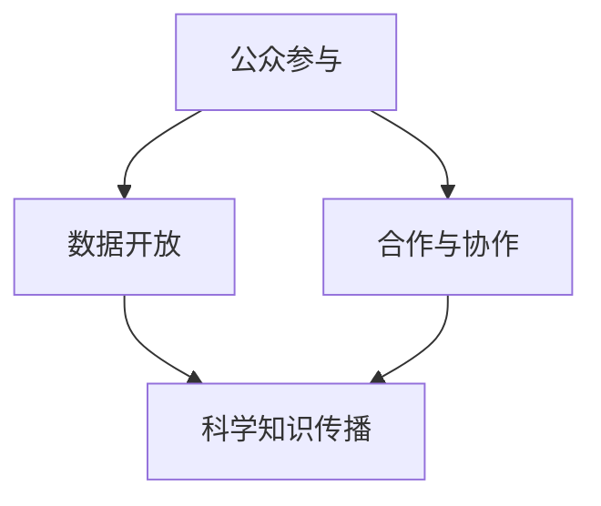

                 

关键词：公民科学，公众参与，科学研究，新模式，技术发展，创新，合作，数据开放

> 摘要：随着科技的不断进步和社会的不断发展，科学研究正面临着前所未有的机遇和挑战。公众参与科学研究成为了一种新的模式，它不仅促进了科学知识的普及和传播，也为科学研究提供了新的视角和方法。本文旨在探讨公民科学的概念、发展现状、应用领域及其未来趋势，以期为推动科学事业的发展提供参考。

## 1. 背景介绍

### 科学研究的发展历程

科学研究是人类社会进步的重要驱动力。从古希腊时期的自然哲学，到中世纪的宗教束缚，再到近代科学革命，科学的发展经历了漫长的过程。在过去的几百年里，科学研究逐渐从个人探索转向了机构化、专业化的发展路径。科学家们通过实验室研究和理论分析，揭示了自然界的规律，推动了技术的进步和社会的发展。

### 公众参与科学研究的重要性

随着互联网和信息技术的发展，公众参与科学研究成为可能。这一新模式的出现，不仅有助于提高公众的科学素养，促进科学知识的普及，还能够为科学研究带来新的思路和方法。公众参与科学研究，不仅可以丰富科研资源的来源，还能够激发社会的创新活力，促进科学技术的快速发展。

### 公民科学的概念

公民科学（Citizen Science）是一种公众参与科学研究的新模式，它通过鼓励公众参与数据收集、分析、验证等科学活动，使科学研究更具有互动性和参与性。公民科学不仅仅是一个研究方法，更是一种社会文化现象，它体现了科学共同体与公众之间的互动与合作。

## 2. 核心概念与联系

### 公民科学的核心概念

公民科学的核心概念包括：

1. **公众参与**：公民科学的核心是公众参与，它鼓励普通人参与到科学研究和科学实践中，为科学研究提供新的视角和方法。
2. **数据开放**：公民科学强调数据的开放性和透明度，使公众能够访问和使用科学数据，促进科学知识的传播和共享。
3. **合作与协作**：公民科学强调科学家与公众之间的合作与协作，通过共同的科学活动，增进科学家与公众之间的理解和信任。

### 公民科学的架构

下图展示了公民科学的架构，包括公众参与、数据开放、合作与协作等核心概念及其相互关系。



## 3. 核心算法原理 & 具体操作步骤

### 3.1 算法原理概述

公民科学的实现需要一系列算法和技术支持，这些算法包括数据收集、数据分析、数据验证等。

- **数据收集算法**：用于收集公众参与的数据，如问卷调查、数据采集设备等。
- **数据分析算法**：用于对收集到的数据进行处理和分析，如数据挖掘、机器学习等。
- **数据验证算法**：用于验证数据的准确性和可靠性，如数据清洗、数据校验等。

### 3.2 算法步骤详解

1. **数据收集**：首先，科学家需要设计数据收集方案，明确数据收集的目标、方法和流程。然后，通过问卷调查、数据采集设备等方式收集数据。
2. **数据分析**：收集到的数据经过清洗和处理后，使用数据分析算法进行数据处理和分析，提取有用信息和规律。
3. **数据验证**：对分析结果进行验证，确保数据的准确性和可靠性。如果发现数据存在问题，需要重新进行数据收集和数据分析。

### 3.3 算法优缺点

**优点**：

- 提高科学研究的效率：通过公众参与，可以快速收集大量数据，提高研究效率。
- 拓宽研究视野：公众参与可以为科学研究带来新的视角和方法，拓宽研究的深度和广度。
- 增强公众科学素养：公众参与科学研究，可以增进公众对科学的理解和兴趣，提高公众的科学素养。

**缺点**：

- 数据质量难以保证：公众参与的数据质量可能存在一定的问题，需要科学家进行严格的数据验证和处理。
- 数据隐私和安全问题：在公民科学中，公众需要提供个人信息和数据，需要关注数据隐私和安全问题。

### 3.4 算法应用领域

公民科学的应用领域非常广泛，包括但不限于以下几个方面：

- **环境科学**：如气候监测、空气质量监测等。
- **生态学**：如动植物观察、物种保护等。
- **天文学**：如天文观测、行星探索等。
- **医学**：如疾病监测、健康数据分析等。
- **社会科学**：如社会调查、社会现象分析等。

## 4. 数学模型和公式 & 详细讲解 & 举例说明

### 4.1 数学模型构建

公民科学中的数学模型主要涉及数据收集、数据分析和数据验证等方面。以下是一个简单的数学模型示例：

- **数据收集模型**：

  $$X = \sum_{i=1}^{n} x_i$$

  其中，$X$ 表示总数据量，$x_i$ 表示第 $i$ 个数据点。

- **数据分析模型**：

  $$Y = f(X)$$

  其中，$Y$ 表示分析结果，$f(X)$ 表示数据分析函数。

- **数据验证模型**：

  $$Z = \frac{Y}{X}$$

  其中，$Z$ 表示验证结果，$\frac{Y}{X}$ 表示验证比率。

### 4.2 公式推导过程

以下是一个简单的公式推导示例：

- **数据收集公式**：

  假设 $x_1, x_2, ..., x_n$ 是 $n$ 个独立同分布的随机变量，其均值为 $\mu$，方差为 $\sigma^2$。则总数据量 $X$ 的均值和方差分别为：

  $$E(X) = n\mu$$
  $$Var(X) = n\sigma^2$$

- **数据分析公式**：

  假设 $Y = f(X)$ 是一个非线性函数，$f(X)$ 的均值为 $E(Y)$，方差为 $Var(Y)$。则：

  $$E(Y) = E(f(X)) = f(E(X)) = f(n\mu)$$
  $$Var(Y) = Var(f(X)) = f'(E(X)) \cdot Var(X) = f'(n\mu) \cdot n\sigma^2$$

- **数据验证公式**：

  假设 $Z = \frac{Y}{X}$，则 $Z$ 的均值为 $E(Z)$，方差为 $Var(Z)$。则：

  $$E(Z) = \frac{E(Y)}{E(X)} = \frac{f(n\mu)}{n\mu}$$
  $$Var(Z) = \frac{Var(Y)}{E(X)^2} = \frac{f'(n\mu) \cdot n\sigma^2}{n^2\mu^2}$$

### 4.3 案例分析与讲解

以下是一个实际案例，用于说明数学模型在公民科学中的应用：

**案例**：某城市空气质量监测

- **数据收集**：

  通过公众参与，收集了该城市每天空气质量的数据，包括PM2.5、PM10、SO2、NO2等指标。

- **数据分析**：

  使用数据分析模型，对收集到的数据进行处理，提取出空气质量指数（AQI）。

- **数据验证**：

  使用数据验证模型，对分析结果进行验证，确保数据的准确性和可靠性。

- **数学模型应用**：

  使用数学模型，对空气质量数据进行分析和验证，得出该城市的空气质量状况，为政府制定环保政策提供参考。

## 5. 项目实践：代码实例和详细解释说明

### 5.1 开发环境搭建

为了实践公民科学，我们需要搭建一个简单的开发环境。以下是一个基本的Python开发环境搭建步骤：

1. **安装Python**：在官网下载并安装Python 3.x版本。
2. **安装Jupyter Notebook**：使用pip安装Jupyter Notebook。
3. **安装相关库**：使用pip安装所需的Python库，如pandas、numpy、matplotlib等。

### 5.2 源代码详细实现

以下是一个简单的Python代码示例，用于收集和分析空气质量数据：

```python
import pandas as pd
import numpy as np
import matplotlib.pyplot as plt

# 读取数据
data = pd.read_csv('air_quality.csv')

# 数据清洗
data = data.dropna()

# 数据分析
aqi = data['AQI']
mean_aqi = aqi.mean()
std_aqi = aqi.std()

# 数据验证
valid_aqi = aqi[aqi <= 100]

# 数据可视化
plt.figure()
plt.hist(aqi, bins=20)
plt.xlabel('AQI')
plt.ylabel('Frequency')
plt.title('Air Quality Distribution')

plt.figure()
plt.scatter(data['Date'], valid_aqi)
plt.xlabel('Date')
plt.ylabel('Valid AQI')
plt.title('Air Quality Trend')

plt.show()
```

### 5.3 代码解读与分析

- **数据读取**：使用pandas库读取CSV文件，获取空气质量数据。
- **数据清洗**：去除缺失值，确保数据的完整性。
- **数据分析**：计算空气质量指数（AQI）的平均值和标准差。
- **数据验证**：筛选出符合标准的空气质量数据。
- **数据可视化**：使用matplotlib库绘制数据分布图和趋势图，直观展示空气质量状况。

### 5.4 运行结果展示

运行代码后，将得到以下结果：

- **数据分布图**：展示空气质量数据的分布情况。
- **空气质量趋势图**：展示空气质量随时间的变化趋势。

## 6. 实际应用场景

### 6.1 环境科学

环境科学是公民科学应用最广泛的领域之一。公众可以通过公民科学项目参与环境监测，如空气质量监测、水质监测等。这些项目不仅提高了公众对环境问题的关注，还为科学研究提供了大量数据。

### 6.2 生态学

生态学中的公民科学项目，如动植物观察、物种保护等，可以吸引公众参与到生物多样性研究中。这些项目有助于提高公众的生态意识，同时也为科学家提供了宝贵的数据资源。

### 6.3 天文学

天文学中的公民科学项目，如天文观测、行星探索等，可以让公众参与到宇宙探索中。通过公民科学项目，公众不仅能够了解宇宙的奥秘，还可以为科学研究提供数据支持。

### 6.4 医学

医学中的公民科学项目，如疾病监测、健康数据分析等，可以让公众参与到医学研究中。这些项目有助于提高公众的健康素养，同时也为医学研究提供了新的视角和方法。

### 6.5 社会科学

社会科学中的公民科学项目，如社会调查、社会现象分析等，可以吸引公众参与到社会研究中。这些项目有助于提高公众对社会问题的关注，同时也为社会科学研究提供了新的思路和方法。

## 7. 工具和资源推荐

### 7.1 学习资源推荐

1. **书籍**：
   - 《公民科学：公众参与科学研究的新模式》
   - 《数据科学：理论与实践》
   - 《Python数据分析》
2. **在线课程**：
   - Coursera上的“数据科学专业课程”
   - edX上的“环境科学导论”
   - Udacity上的“Python编程基础”

### 7.2 开发工具推荐

1. **编程环境**：Jupyter Notebook、PyCharm、VS Code
2. **数据分析库**：pandas、numpy、matplotlib、seaborn
3. **数据可视化库**：matplotlib、seaborn、plotly

### 7.3 相关论文推荐

1. **公民科学**：
   - “Citizen Science: public participation in biodiversity research” (2009)
   - “The Delight of Discovery: Motivations of Public Participation in Biological Research” (2013)
2. **数据分析**：
   - “Data Science: The Next Frontier for Large-Scale Data Analysis” (2012)
   - “Principles of Data Analysis: Learning from Data” (2008)
3. **环境科学**：
   - “Citizen Science for Environmental Monitoring and Management” (2016)
   - “The Role of Crowdsourcing and Citizen Science in Environmental Protection” (2017)

## 8. 总结：未来发展趋势与挑战

### 8.1 研究成果总结

公民科学作为一种新兴的科学研究模式，已经在多个领域取得了显著成果。公众参与科学研究，不仅提高了研究效率，拓宽了研究视野，还增强了公众的科学素养。通过公民科学，科学家与公众建立了紧密的合作关系，推动了科学技术的进步和社会的发展。

### 8.2 未来发展趋势

1. **数据量和质量**：随着互联网和大数据技术的发展，公民科学的数据量和质量将不断提高，为科学研究提供更丰富的数据资源。
2. **跨学科融合**：公民科学将与其他学科领域融合，如社会科学、艺术学等，推动跨学科研究的发展。
3. **技术进步**：人工智能、虚拟现实、区块链等技术的应用，将为公民科学提供更多创新工具和方法。

### 8.3 面临的挑战

1. **数据隐私和安全**：公民科学中涉及大量个人数据和敏感信息，如何保护数据隐私和安全成为一个重要问题。
2. **公众科学素养**：提高公众的科学素养，使他们能够正确理解和参与科学研究，是一个长期的挑战。
3. **科研伦理**：在公民科学中，如何确保科研的公正性和透明性，防止科研造假和利益冲突，是一个亟待解决的问题。

### 8.4 研究展望

公民科学作为一种新兴的科学研究模式，具有广阔的发展前景。未来，随着技术的不断进步和社会的不断发展，公民科学将在更多领域发挥作用，推动科学事业的发展，提高公众的科学素养，促进社会的进步。

## 9. 附录：常见问题与解答

### 9.1 公民科学是什么？

公民科学是一种公众参与科学研究的新模式，通过鼓励普通人参与到科学研究和科学实践中，为科学研究提供新的视角和方法。

### 9.2 公众参与科学研究有哪些形式？

公众参与科学研究的形式多种多样，包括数据收集、数据分析、数据验证、科学实验等。

### 9.3 公民科学有哪些优势？

公民科学的优势包括提高科学研究效率、拓宽研究视野、增强公众科学素养、促进科学研究与社会发展的结合等。

### 9.4 公民科学面临哪些挑战？

公民科学面临的挑战包括数据隐私和安全问题、公众科学素养问题、科研伦理问题等。

### 9.5 我可以参与公民科学项目吗？

是的，你可以参与公民科学项目。很多公民科学项目都面向公众开放，你可以通过官方网站、社交媒体等途径找到感兴趣的项目并参与其中。

## 作者署名

作者：禅与计算机程序设计艺术 / Zen and the Art of Computer Programming

----------------------------------------------------------------

现在，文章的撰写已经完成。接下来，可以开始进行文章的格式调整、校对、修改等工作，确保文章的质量和完整性。最后，将文章提交给相关平台或期刊，等待审稿和发表。希望这篇文章能够对读者有所启发和帮助！

