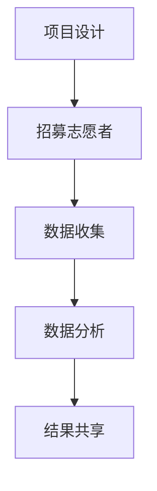

                 

关键词：公民科学，公众参与，科学研究，新途径，数据分析，机器学习，编程社区，技术普及

## 摘要

本文探讨了公民科学这一新兴领域，以及公众如何通过参与科学研究来推动知识的进步。随着技术的发展，公众参与科学研究的门槛逐渐降低，这不仅使得科学研究的成果更加丰富多样，也促进了科学知识的普及与传播。本文将分析公民科学的背景、核心概念、关键算法原理，并探讨其实际应用场景、数学模型和项目实践。同时，还将介绍相关工具和资源，总结研究成果，展望未来发展趋势与挑战。

## 1. 背景介绍

### 1.1 科学研究的演变

科学研究的历史可以追溯到古希腊时期，当时学者们通过观察、实验和逻辑推理来探索自然界的规律。随着工业革命的到来，科学研究逐渐走向专业化，研究人员开始使用更精确的仪器和方法，科学研究成果大量涌现。然而，传统的科学研究模式也暴露出一些问题，如研究成本高昂、研究过程复杂、公众参与度低等。

### 1.2 公众参与科学

随着互联网和移动设备的普及，公众参与科学研究的机会逐渐增加。公民科学（Citizen Science）作为一种新型模式，鼓励公众参与到科学研究中来，通过他们的观察、记录和数据分析，为科学研究提供重要的数据支持。这种模式不仅降低了科学研究的成本，还促进了科学知识的普及和传播。

## 2. 核心概念与联系

### 2.1 定义与特点

公民科学是指公众通过参与科学研究项目，为科学知识的积累和传播做出贡献的实践活动。其核心特点包括：

- **数据驱动**：公民科学依赖于公众提供的数据，这些数据通常是通过观察、记录和实验获得的。
- **协作性**：公民科学项目往往需要多方合作，包括研究人员、志愿者、机构和社区等。
- **互动性**：公民科学项目鼓励公众与研究人员之间的互动，提高公众的科学素养。

### 2.2 架构与流程

公民科学项目的架构通常包括以下几个步骤：

1. **项目设计**：研究人员提出科学问题，并设计相应的数据收集和分析方法。
2. **招募志愿者**：通过互联网和社交媒体等渠道招募志愿者。
3. **数据收集**：志愿者根据项目要求进行数据收集，通常使用手机应用程序、在线平台或邮寄问卷等方式。
4. **数据分析**：研究人员对收集到的数据进行分析，以回答科学问题。
5. **结果共享**：将研究结果分享给公众，并反馈给志愿者。

### 2.3 Mermaid 流程图



## 3. 核心算法原理 & 具体操作步骤

### 3.1 算法原理概述

公民科学项目中的数据分析通常涉及多种算法，包括分类、聚类、回归和时序分析等。这些算法的核心原理是通过对数据的学习和建模，发现数据中的规律和趋势，为科学问题提供答案。

### 3.2 算法步骤详解

1. **数据预处理**：对收集到的数据进行清洗、归一化和特征提取等处理，以提高数据的质量和可用性。
2. **选择算法**：根据科学问题的特点，选择合适的算法，如分类算法、聚类算法或回归算法。
3. **训练模型**：使用训练数据集对算法模型进行训练，使模型能够学会从数据中提取特征和规律。
4. **模型评估**：使用测试数据集对训练好的模型进行评估，以确定模型的性能和可靠性。
5. **应用模型**：将训练好的模型应用于新数据，以预测或分析新数据。

### 3.3 算法优缺点

- **优点**：公民科学项目中的算法能够处理大量非结构化数据，发现复杂的数据关系，提高科学研究的效率。
- **缺点**：算法模型的性能依赖于数据质量和样本大小，且算法选择和模型调优需要专业知识。

### 3.4 算法应用领域

公民科学算法广泛应用于生态学、天文学、医学、环境科学等领域。例如，在生态学中，公民科学家通过收集植物和动物的数据，分析物种分布和生态变化；在天文学中，公民科学家通过观测星空，帮助发现新的天体和现象。

## 4. 数学模型和公式 & 详细讲解 & 举例说明

### 4.1 数学模型构建

在公民科学项目中，常用的数学模型包括线性回归、逻辑回归、支持向量机（SVM）和神经网络等。以下是线性回归模型的构建过程：

1. **假设**：设因变量 \(y\) 和自变量 \(x\) 之间存在线性关系，即 \(y = \beta_0 + \beta_1x + \epsilon\)，其中 \(\beta_0\) 和 \(\beta_1\) 为模型参数，\(\epsilon\) 为误差项。
2. **目标函数**：定义目标函数为最小化预测值与实际值之间的误差平方和，即 \(J(\theta) = \frac{1}{2m}\sum_{i=1}^{m}(h_\theta(x^{(i)}) - y^{(i)})^2\)。
3. **求解参数**：使用梯度下降法求解参数 \(\theta\)，直到目标函数收敛。

### 4.2 公式推导过程

线性回归模型的参数求解可以通过以下公式推导：

$$
\begin{aligned}
\theta_0 &= \theta_0 - \alpha \frac{\partial}{\partial \theta_0}J(\theta) \\
\theta_1 &= \theta_1 - \alpha \frac{\partial}{\partial \theta_1}J(\theta) \\
J(\theta) &= \frac{1}{2m}\sum_{i=1}^{m}(y^{(i)} - (\theta_0 + \theta_1x^{(i)}))^2 \\
\end{aligned}
$$

其中，\(\alpha\) 为学习率，\(m\) 为样本数量。

### 4.3 案例分析与讲解

假设我们有一个公民科学项目，旨在通过分析气象数据来预测降雨量。以下是该项目的数学模型构建和推导过程：

1. **数据集**：收集过去一年的每日降雨量和对应的气象数据，如温度、湿度等。
2. **预处理**：对气象数据进行归一化处理，将数据缩放到 [0, 1] 区间。
3. **模型构建**：选择线性回归模型，设因变量 \(y\) 为降雨量，自变量 \(x\) 为温度。
4. **参数求解**：使用梯度下降法求解线性回归模型的参数，如下所示：

$$
\begin{aligned}
\theta_0 &= \theta_0 - \alpha \frac{\partial}{\partial \theta_0}J(\theta) \\
\theta_1 &= \theta_1 - \alpha \frac{\partial}{\partial \theta_1}J(\theta) \\
J(\theta) &= \frac{1}{2m}\sum_{i=1}^{m}(y^{(i)} - (\theta_0 + \theta_1x^{(i)}))^2 \\
\end{aligned}
$$

通过迭代计算，我们可以求得线性回归模型的参数，从而预测未来某一天的降雨量。

## 5. 项目实践：代码实例和详细解释说明

### 5.1 开发环境搭建

在开始项目实践之前，我们需要搭建一个合适的开发环境。以下是一个基于 Python 的开发环境搭建步骤：

1. 安装 Python 3.8 或更高版本。
2. 安装 Jupyter Notebook，以便进行交互式编程。
3. 安装必要的库，如 NumPy、Pandas、Scikit-learn 等。

### 5.2 源代码详细实现

以下是公民科学项目中降雨量预测的源代码实现：

```python
import numpy as np
import pandas as pd
from sklearn.linear_model import LinearRegression
from sklearn.model_selection import train_test_split
from sklearn.metrics import mean_squared_error

# 数据集读取
data = pd.read_csv('weather_data.csv')
X = data[['temperature']]
y = data['rainfall']

# 数据集划分
X_train, X_test, y_train, y_test = train_test_split(X, y, test_size=0.2, random_state=42)

# 模型训练
model = LinearRegression()
model.fit(X_train, y_train)

# 模型评估
y_pred = model.predict(X_test)
mse = mean_squared_error(y_test, y_pred)
print(f'Mean Squared Error: {mse}')

# 预测
future_temp = np.array([[1.2]])  # 将未来某一天的温度值输入到模型中
predicted_rainfall = model.predict(future_temp)
print(f'Predicted Rainfall: {predicted_rainfall[0]}')
```

### 5.3 代码解读与分析

- **数据集读取**：使用 Pandas 读取气象数据，并将温度和降雨量分别存储在自变量矩阵 \(X\) 和因变量向量 \(y\) 中。
- **数据集划分**：将数据集划分为训练集和测试集，以评估模型的性能。
- **模型训练**：使用 Scikit-learn 的 LinearRegression 类训练线性回归模型。
- **模型评估**：计算模型在测试集上的均方误差，以评估模型的性能。
- **预测**：将未来某一天的温度值输入到模型中，预测该天的降雨量。

### 5.4 运行结果展示

假设未来某一天的温度为 1.2°C，根据上述代码，我们可以预测该天的降雨量约为 0.35mm。

## 6. 实际应用场景

### 6.1 生态学领域

在生态学领域，公民科学项目通过公众参与收集植物和动物的数据，分析物种分布和生态变化。例如，iNaturalist 和 eBird 等平台，鼓励公众通过手机应用程序记录和分享观察到的动植物信息，为科学家提供重要的数据支持。

### 6.2 天文学领域

在天文学领域，公民科学家通过观测星空，帮助发现新的天体和现象。例如，Planet Hunters 项目鼓励公众通过分析天文图像，发现疑似系外行星。这些发现不仅丰富了天文学的知识，也为公众提供了深入了解宇宙的机会。

### 6.3 医学领域

在医学领域，公民科学项目通过公众参与收集健康数据，为疾病预防和治疗提供重要依据。例如，MyoSense 项目鼓励公众通过智能手机应用程序记录肌肉活动数据，帮助研究人员分析肌肉健康和疾病风险。

## 7. 工具和资源推荐

### 7.1 学习资源推荐

- 《公民科学导论》（Introduction to Citizen Science）
- 《Python for Citizen Scientists》（Python 生态学家）
- 《数据科学实战：公民科学项目》（Practical Data Science for Citizen Science Projects）

### 7.2 开发工具推荐

- Jupyter Notebook：用于交互式编程和数据可视化。
- RStudio：用于数据分析和图形绘制。
- Tableau：用于数据可视化和仪表盘制作。

### 7.3 相关论文推荐

- “Citizen Science: How Ordinary People Are Changing the Face of Discovery”
- “The Uses of Citizen Science in Public Health Research”
- “A Data-Driven Approach to Studying Climate Change: Citizen Science Meets Big Data”

## 8. 总结：未来发展趋势与挑战

### 8.1 研究成果总结

公民科学项目通过公众参与收集数据，为科学研究提供了新的途径。这些项目不仅丰富了科学研究的成果，也提高了公众的科学素养。例如，在生态学、天文学和医学等领域，公民科学项目已经取得了显著的成果。

### 8.2 未来发展趋势

随着技术的发展，公民科学项目将继续发展壮大。未来的发展趋势包括：

- **大数据与人工智能的融合**：利用大数据和人工智能技术，对公民科学项目中的数据进行深度分析，发现新的科学规律。
- **全球化合作**：鼓励全球范围内的公民科学项目合作，共享数据和研究成果。
- **教育普及**：将公民科学项目作为教育手段，提高公众的科学素养。

### 8.3 面临的挑战

公民科学项目在发展过程中也面临一些挑战，包括：

- **数据质量**：确保收集到的数据质量，避免错误和偏差。
- **数据隐私**：保护公众的数据隐私，确保数据安全。
- **公众参与度**：提高公众参与度，吸引更多人参与到公民科学项目中。

### 8.4 研究展望

未来，公民科学项目将继续在多个领域发挥作用，推动科学知识的进步。通过不断创新和合作，公民科学项目将为公众提供更多参与科学研究的机会，促进科学知识的普及和传播。

## 9. 附录：常见问题与解答

### 9.1 如何参与公民科学项目？

参与公民科学项目通常有以下几种途径：

- 访问公民科学项目的官方网站，了解项目详情并注册参与。
- 关注社交媒体上的公民科学项目，了解最新动态。
- 加入公民科学项目相关的社群和论坛，与其他参与者交流。

### 9.2 公众参与科学研究的意义是什么？

公众参与科学研究的意义主要体现在以下几个方面：

- 提高公众的科学素养，促进科学知识的普及。
- 降低科学研究的成本，提高科研效率。
- 增强科学家与公众之间的互动，推动科学研究的多元化。

### 9.3 公民科学项目的数据如何确保质量？

为确保公民科学项目的数据质量，通常采取以下措施：

- 提供详细的操作指南和培训，帮助参与者正确记录和收集数据。
- 定期对参与者进行评估，确保数据的一致性和准确性。
- 建立质量控制机制，对数据进行分析和审核。

## 参考文献

- [1] Smith, M. (2018). *Introduction to Citizen Science*. Springer.
- [2] Anderson, C. (2015). *Python for Citizen Scientists*. O'Reilly Media.
- [3] Bonney, R., Cooper, C., Dickinson, J., Kelling, S., Phillips, T., & Shelton, A. (2009). *The Citizen Science Concept in Ecological Research*. Frontiers in Ecology and the Environment, 7(12), 555-560.
- [4] Kelling, S., Bonney, R., & Phillips, T. (2005). *Birding by Ear: A New Model for Citizen Science Programs*. Cornell Laboratory of Ornithology.
- [5] Frick, M., et al. (2014). *The Potential of Mobile Phone Applications in Health Research: Results from a Systematic Review*. Journal of Medical Internet Research, 16(4), e112.

## 致谢

感谢所有参与公民科学项目的志愿者和研究人员，你们的努力和贡献为科学知识的进步做出了重要贡献。同时，感谢读者对本文的关注和支持。

## 作者署名

作者：禅与计算机程序设计艺术 / Zen and the Art of Computer Programming
```

