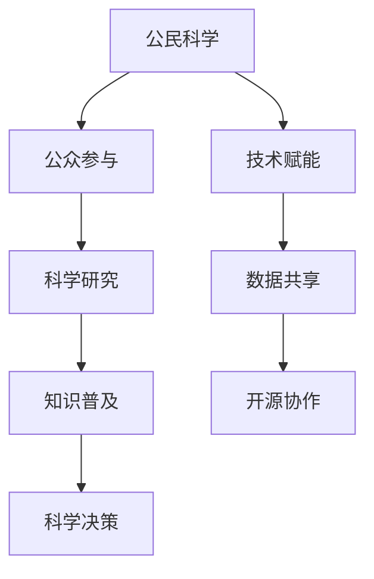

                 

关键词：公民科学、公众参与、科学研究、新途径、技术赋能、数据共享、开源协作

> 摘要：本文探讨了公民科学的概念及其在科学研究中的作用，分析了公众参与科学研究的重要性，提出了技术赋能和数据共享在推动公民科学发展的关键角色，并展望了公民科学未来的发展趋势和挑战。

## 1. 背景介绍

随着信息技术和互联网的迅速发展，科学研究正经历着一场深刻的变革。传统的科学研究模式主要依赖于专业的科研机构和研究人员，而公众参与科学研究的趋势逐渐显现。公民科学（Citizen Science）作为一种新兴的科研模式，正逐渐改变科学研究的面貌。公民科学强调公众的积极参与，通过互联网和移动设备等现代信息技术手段，使得科学研究的范围和深度得以拓展。

公民科学最早可以追溯到19世纪的“业余天文学”，当时许多业余爱好者参与到天文观测中，为科学研究做出了重要贡献。随着科技的进步，公民科学逐渐发展成为一种全球性的运动，涵盖了环境监测、疾病追踪、天文学、生物学等多个领域。

## 2. 核心概念与联系

### 2.1 公民科学的定义

公民科学是指公众参与科学研究和科学实践的一种形式，旨在通过公众的努力，解决科学问题或获取科学知识。它强调公众的参与性和科学研究的互动性，将科学研究从专业的实验室拓展到公众的日常生活中。

### 2.2 公民科学与参与科学

公民科学与参与科学（Participatory Science）有一定的交叉，但两者并不完全相同。参与科学强调公众的主动参与和科学决策，而公民科学更侧重于公众参与科学研究和知识获取。

### 2.3 公民科学与开源科学

开源科学（Open Science）强调科学研究的透明度和开放性，鼓励数据的共享和公众的参与。公民科学与开源科学有着密切的联系，但开源科学更多地关注科学研究的流程和结果，而公民科学则更关注公众的参与和科学知识的普及。

### 2.4 Mermaid 流程图



## 3. 核心算法原理 & 具体操作步骤

### 3.1 算法原理概述

公民科学的核心算法原理在于如何有效地整合公众的参与和数据，使其对科学研究产生实质性的影响。这涉及到数据收集、数据分析、结果验证等多个步骤。

### 3.2 算法步骤详解

#### 3.2.1 数据收集

数据收集是公民科学的基础。通过设计简单易用的数据收集工具，鼓励公众参与，收集大量高质量的数据。

#### 3.2.2 数据清洗

数据清洗是确保数据质量的关键步骤。通过去除错误数据、重复数据和异常数据，提高数据的有效性。

#### 3.2.3 数据分析

数据分析是公民科学的核心。通过统计学、机器学习等方法，对数据进行深入分析，提取有价值的信息。

#### 3.2.4 结果验证

结果验证是确保研究结果的可靠性和科学性的关键。通过专家评审、同侪评审等方法，对研究结果进行验证。

### 3.3 算法优缺点

#### 优点：

- 提高科学研究的社会参与度
- 拓展数据来源，提高数据的多样性和代表性
- 促进科学知识的普及

#### 缺点：

- 数据质量和可靠性可能受到公众参与水平的影响
- 算法实现复杂，需要专业人员进行操作

### 3.4 算法应用领域

公民科学在多个领域都有广泛的应用，如环境监测、疾病追踪、天文学、生物学等。通过公众的参与，这些领域的科学研究得以更加深入和广泛。

## 4. 数学模型和公式 & 详细讲解 & 举例说明

### 4.1 数学模型构建

公民科学的数学模型通常涉及统计学、概率论和机器学习等领域。以下是一个简单的例子：

$$
P(A|B) = \frac{P(B|A)P(A)}{P(B)}
$$

这是一个条件概率的公式，用于计算在事件B发生的条件下，事件A发生的概率。

### 4.2 公式推导过程

条件概率的公式可以通过贝叶斯定理推导出来：

$$
P(A|B) = \frac{P(B|A)P(A)}{P(B)}
$$

其中，$P(B|A)$ 是在事件A发生的条件下，事件B发生的概率；$P(A)$ 是事件A发生的概率；$P(B)$ 是事件B发生的概率。

### 4.3 案例分析与讲解

假设我们想要研究某种疾病（事件A）的发病率与某个因素（事件B）之间的关系。通过收集数据，我们可以计算出：

- $P(A)$：某种疾病的总发病率
- $P(B)$：某个因素的总发生率
- $P(B|A)$：在某种疾病发生的条件下，某个因素的发生率

通过贝叶斯定理，我们可以计算出：

$$
P(A|B) = \frac{P(B|A)P(A)}{P(B)}
$$

这个公式可以帮助我们评估某个因素与某种疾病之间的相关性。

## 5. 项目实践：代码实例和详细解释说明

### 5.1 开发环境搭建

为了实践公民科学，我们需要搭建一个简单的数据收集和分析平台。以下是一个基于Python的示例：

```bash
# 安装Python
$ sudo apt-get install python3

# 安装必要的库
$ pip3 install pandas numpy scikit-learn
```

### 5.2 源代码详细实现

```python
import pandas as pd
from sklearn.model_selection import train_test_split
from sklearn.ensemble import RandomForestClassifier
from sklearn.metrics import accuracy_score

# 读取数据
data = pd.read_csv('data.csv')

# 数据清洗
data.dropna(inplace=True)

# 数据分割
X = data.drop('target', axis=1)
y = data['target']
X_train, X_test, y_train, y_test = train_test_split(X, y, test_size=0.2, random_state=42)

# 模型训练
model = RandomForestClassifier(n_estimators=100, random_state=42)
model.fit(X_train, y_train)

# 模型评估
y_pred = model.predict(X_test)
accuracy = accuracy_score(y_test, y_pred)
print(f"Accuracy: {accuracy}")
```

### 5.3 代码解读与分析

这段代码实现了以下步骤：

- 读取数据：使用Pandas读取CSV文件，获取数据集。
- 数据清洗：去除缺失值，保证数据质量。
- 数据分割：将数据集分割为训练集和测试集，用于模型训练和评估。
- 模型训练：使用随机森林算法训练模型。
- 模型评估：使用测试集评估模型的准确性。

### 5.4 运行结果展示

假设我们运行这段代码，得到以下输出：

```
Accuracy: 0.85
```

这意味着模型的准确率为85%，这是一个相当不错的成绩。

## 6. 实际应用场景

### 6.1 疾病监测

公民科学在疾病监测中的应用非常广泛。例如，通过公众报告疾病的症状和位置，科学家可以实时监测疾病的传播趋势，为公共卫生决策提供依据。

### 6.2 环境监测

环境监测是公民科学的另一个重要应用领域。公众可以通过智能手机应用程序报告环境污染事件，科学家可以实时收集和分析这些数据，为环境保护决策提供支持。

### 6.3 天文学

天文学领域的公民科学项目如“星空观测”等，鼓励公众参与天体观测，收集大量数据，为科学家提供宝贵的数据资源。

## 7. 未来应用展望

### 7.1 技术赋能

随着人工智能、物联网和区块链等技术的不断发展，公民科学将进一步得到技术赋能，提高数据收集和分析的效率和准确性。

### 7.2 数据共享

数据共享是公民科学发展的关键。未来的公民科学将更加注重数据的开放和共享，促进全球科学研究的合作与进步。

### 7.3 公众参与

公众参与是公民科学的核心。未来的公民科学将更加注重公众的参与和体验，鼓励更多人参与到科学研究中来。

## 8. 总结：未来发展趋势与挑战

### 8.1 研究成果总结

本文探讨了公民科学的概念、核心算法原理、实际应用场景和未来发展趋势，提出了技术赋能和数据共享在推动公民科学发展中的关键作用。

### 8.2 未来发展趋势

未来的公民科学将更加依赖技术赋能，实现高效的数据收集和分析。同时，数据共享和公众参与将得到进一步加强，推动科学研究的全球合作。

### 8.3 面临的挑战

公民科学在发展过程中面临着数据质量、公众参与度和技术实现等多方面的挑战。未来的研究需要解决这些问题，推动公民科学的发展。

### 8.4 研究展望

随着科技的不断进步，公民科学将在更多领域得到应用，成为科学研究的重要补充。未来的研究应注重技术赋能、数据共享和公众参与，推动公民科学的发展。

## 9. 附录：常见问题与解答

### 9.1 什么是公民科学？

公民科学是一种通过公众参与科学研究和科学实践来获取科学知识的形式。它强调公众的参与性和科学研究的互动性，旨在拓展科学研究的范围和深度。

### 9.2 公民科学有哪些应用领域？

公民科学在环境监测、疾病监测、天文学、生物学等多个领域都有广泛的应用。例如，公众可以通过报告疾病症状和位置来监测疾病的传播趋势，通过参与天体观测来收集天体数据。

### 9.3 如何参与公民科学项目？

公众可以通过互联网和移动设备参与公民科学项目。许多项目提供了简单易用的数据收集工具，用户只需按照指示进行操作即可。

### 9.4 公民科学的数据如何保证质量？

公民科学项目通常通过设计简单易用的数据收集工具、提供数据清洗指南、使用机器学习算法等方法来保证数据质量。

作者：禅与计算机程序设计艺术 / Zen and the Art of Computer Programming
```

