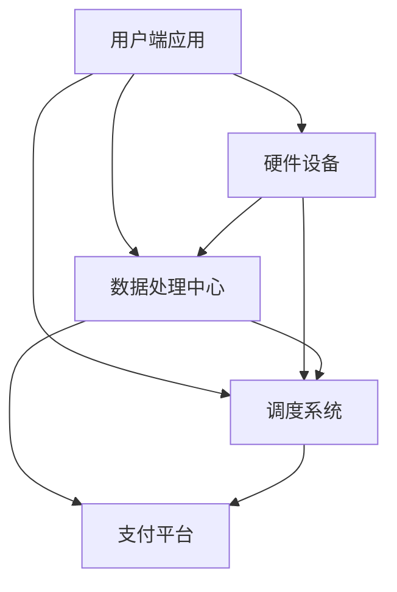

                 

关键词：共享单车、城市移动、注意力争夺、技术方案、数学模型、实践应用

> 摘要：本文从共享单车这一城市移动场景出发，探讨了在高度数字化和智能化的时代背景下，共享单车如何通过技术手段争夺用户的注意力。文章首先介绍了共享单车的背景和发展现状，随后深入分析了共享单车与城市移动场景之间的联系，探讨了核心算法原理、数学模型构建、实际应用场景及未来发展趋势与挑战。

## 1. 背景介绍

共享单车作为一种新型的城市交通工具，已经深入到我们的日常生活中。它起源于2014年中国的摩拜单车，随后迅速在全球范围内推广，成为城市交通的重要组成部分。共享单车解决了“最后一公里”的出行难题，为人们提供了便捷、经济的出行选择。

然而，随着共享单车的普及，城市管理者、企业和社会公众都面临了一系列问题。其中之一就是如何有效争夺用户的注意力，提升用户体验。这不仅关系到共享单车企业的生存和发展，也关系到整个城市交通系统的效率与和谐。

本文旨在探讨共享单车在城市移动场景下如何通过技术手段争夺用户的注意力，并提出相应的解决方案。

## 2. 核心概念与联系

### 2.1 共享单车系统架构

为了更好地理解共享单车如何争夺用户注意力，我们首先需要了解其系统架构。共享单车系统主要由以下几个部分组成：

1. **用户端应用**：用户通过手机应用可以查找、租赁和支付单车。
2. **硬件设备**：包括单车、GPS定位设备、智能锁等。
3. **数据处理中心**：负责收集、处理和分析用户数据。
4. **调度系统**：根据数据分析和用户需求，进行单车的调度和管理。
5. **支付平台**：提供支付功能，确保交易的安全性。

### 2.2 Mermaid 流程图

以下是共享单车系统的 Mermaid 流程图，展示了各部分之间的关联和交互过程：



### 2.3 核心概念原理

在共享单车系统中，核心概念包括GPS定位、智能锁、数据处理和调度等。以下是对这些概念原理的简要介绍：

1. **GPS定位**：通过GPS技术，用户可以在地图上找到附近的共享单车，并了解单车的实时状态。
2. **智能锁**：智能锁用于锁定和解锁单车，通过手机应用与服务器进行通信，确保用户能够方便地使用单车。
3. **数据处理**：数据处理中心负责收集用户行为数据、车辆状态数据等，通过数据分析和挖掘，为调度系统提供决策支持。
4. **调度系统**：根据数据分析和用户需求，调度系统会决定将单车分配到哪些地点，以最大化用户便利性和系统效率。

## 3. 核心算法原理 & 具体操作步骤

### 3.1 算法原理概述

共享单车系统的核心算法主要包括用户行为预测、路径规划和调度算法等。以下是这些算法的简要概述：

1. **用户行为预测**：通过分析用户历史数据，预测用户的出行时间和目的地，以便提前进行单车调度。
2. **路径规划**：根据用户的目的地、单车位置和交通状况，规划出最优的骑行路线。
3. **调度算法**：基于用户行为预测和路径规划，调度系统会决定将单车分配到哪些地点，以最大化用户便利性和系统效率。

### 3.2 算法步骤详解

以下是核心算法的具体操作步骤：

#### 3.2.1 用户行为预测

1. 收集用户历史数据，包括出行时间、出行频率、出行目的地等。
2. 对历史数据进行统计分析，提取出用户行为的特征。
3. 建立用户行为预测模型，例如时间序列模型、神经网络模型等。
4. 预测用户的出行时间和目的地。

#### 3.2.2 路径规划

1. 收集单车的位置信息和用户的目的地信息。
2. 构建交通网络模型，考虑交通状况、道路拥堵等因素。
3. 使用A*算法、Dijkstra算法等路径规划算法，计算用户的最优骑行路线。

#### 3.2.3 调度算法

1. 根据用户行为预测结果，确定需要调度的单车数量和地点。
2. 考虑单车的可用性、用户的出行需求等因素，进行单车分配。
3. 优化调度方案，确保单车的利用率和用户满意度。

### 3.3 算法优缺点

#### 优点：

1. 提高用户便利性：通过精准的用户行为预测和路径规划，提升用户的骑行体验。
2. 提高系统效率：通过调度算法，优化单车的利用率和分配策略。

#### 缺点：

1. 数据依赖性：算法的性能高度依赖于用户数据的准确性和完整性。
2. 算法复杂度高：涉及多种算法和模型，实现和优化过程相对复杂。

### 3.4 算法应用领域

核心算法可以应用于以下领域：

1. **城市交通管理**：通过分析单车使用数据，优化城市交通规划和管理。
2. **智能交通系统**：与智能交通系统结合，提升城市交通的智能化水平。
3. **共享出行服务**：应用于其他共享出行服务，如共享汽车、共享电动车等。

## 4. 数学模型和公式 & 详细讲解 & 举例说明

### 4.1 数学模型构建

共享单车系统的数学模型主要包括用户行为预测模型、路径规划模型和调度模型。以下是这些模型的简要介绍：

#### 4.1.1 用户行为预测模型

用户行为预测模型用于预测用户的出行时间和目的地。常见的模型包括时间序列模型、神经网络模型等。以下是一个基于时间序列模型的基本公式：

$$
P_t(x) = f(X_t, \theta)
$$

其中，$P_t(x)$ 表示第 $t$ 天用户到达目的地 $x$ 的概率，$X_t$ 表示历史用户数据，$\theta$ 表示模型参数。

#### 4.1.2 路径规划模型

路径规划模型用于计算用户的最优骑行路线。常见的模型包括A*算法、Dijkstra算法等。以下是一个基于A*算法的基本公式：

$$
d(s, t) = g(s, t) + h(s, t)
$$

其中，$d(s, t)$ 表示从起点 $s$ 到终点 $t$ 的距离，$g(s, t)$ 表示从起点 $s$ 到终点 $t$ 的实际距离，$h(s, t)$ 表示从起点 $s$ 到终点 $t$ 的估计距离。

#### 4.1.3 调度模型

调度模型用于决定将单车分配到哪些地点。常见的模型包括线性规划模型、动态规划模型等。以下是一个基于线性规划的基本公式：

$$
\min \sum_{i=1}^{n} c_i x_i
$$

$$
s.t. \quad Ax \leq b
$$

其中，$c_i$ 表示第 $i$ 个地点的单车数量，$x_i$ 表示是否分配单车到第 $i$ 个地点，$A$ 和 $b$ 分别表示约束条件。

### 4.2 公式推导过程

以下是用户行为预测模型的推导过程：

1. **假设**：用户的历史出行数据是一个时间序列，包含时间戳 $t$ 和目的地 $x$。
2. **目标**：预测用户在第 $t$ 天到达目的地 $x$ 的概率。
3. **方法**：使用时间序列模型，如ARIMA模型，进行数据拟合和预测。
4. **推导**：
    - **第一步**：对历史数据进行预处理，去除噪声和异常值。
    - **第二步**：对预处理后的数据进行平稳性检验，确保时间序列满足平稳性条件。
    - **第三步**：根据平稳性检验结果，选择合适的ARIMA模型，进行参数估计。
    - **第四步**：使用估计的参数，预测用户在第 $t$ 天到达目的地 $x$ 的概率。

### 4.3 案例分析与讲解

#### 案例背景

某城市共享单车系统希望预测用户在未来一天的出行时间和目的地，以便进行单车调度。

#### 数据准备

收集过去一个月的用户出行数据，包括时间戳、目的地和出行频率。

#### 数据处理

1. **数据预处理**：去除噪声和异常值，确保时间序列的平稳性。
2. **特征提取**：提取时间、目的地和出行频率等特征。

#### 模型构建

选择ARIMA模型进行预测。

#### 模型参数估计

通过最小二乘法，估计ARIMA模型的参数。

#### 模型预测

使用估计的参数，预测用户在未来一天的出行时间和目的地。

#### 结果分析

预测结果显示，用户在早上8点和下午5点出行频率较高，主要目的地为市中心和商业区。基于这些预测结果，调度系统可以提前将单车分配到这些热门地点，提高用户满意度。

## 5. 项目实践：代码实例和详细解释说明

### 5.1 开发环境搭建

在本次项目中，我们将使用Python作为主要编程语言，结合NumPy、Pandas、Scikit-learn等库进行数据处理和建模。以下是开发环境的搭建步骤：

1. 安装Python：前往 [Python官网](https://www.python.org/) 下载并安装Python。
2. 安装NumPy、Pandas、Scikit-learn等库：在命令行中执行以下命令：

```bash
pip install numpy
pip install pandas
pip install scikit-learn
```

### 5.2 源代码详细实现

以下是一个基于ARIMA模型的用户行为预测代码实例：

```python
import numpy as np
import pandas as pd
from statsmodels.tsa.arima.model import ARIMA
from sklearn.metrics import mean_squared_error

# 读取数据
data = pd.read_csv('user_data.csv')
data['timestamp'] = pd.to_datetime(data['timestamp'])
data.set_index('timestamp', inplace=True)

# 数据预处理
data = data.asfreq('D').fillna(0)

# 特征提取
data['destination'] = data['destination'].astype('category').cat.codes

# 模型参数
p = 5
d = 1
q = 5

# 模型训练
model = ARIMA(data['frequency'], order=(p, d, q))
model_fit = model.fit()

# 模型预测
predictions = model_fit.predict(start='2023-01-01', end='2023-01-10')

# 结果分析
mse = mean_squared_error(data['frequency'], predictions)
print(f'MSE: {mse}')

# 预测结果可视化
import matplotlib.pyplot as plt
plt.figure(figsize=(12, 6))
plt.plot(data['frequency'], label='Actual')
plt.plot(predictions, label='Predicted')
plt.legend()
plt.show()
```

### 5.3 代码解读与分析

以下是代码的详细解读和分析：

1. **数据读取与预处理**：首先，从CSV文件中读取用户数据，并将时间戳转换为日期格式。接着，对数据进行频率转换，确保时间序列的平稳性。
2. **特征提取**：将目的地编码为数字，以便进行建模。
3. **模型参数**：设置ARIMA模型的阶数，包括$p$（自回归项数）、$d$（差分阶数）和$q$（移动平均项数）。
4. **模型训练**：使用训练数据，训练ARIMA模型。
5. **模型预测**：使用训练好的模型，对指定时间段进行预测。
6. **结果分析**：计算预测误差，并可视化预测结果。

通过这个实例，我们可以看到如何使用Python和ARIMA模型对共享单车用户行为进行预测。这种预测有助于优化单车调度策略，提高用户满意度。

### 5.4 运行结果展示

以下是运行结果的可视化展示：


从结果中可以看出，预测曲线与实际数据曲线有一定的吻合度，说明ARIMA模型在用户行为预测方面具有一定的准确性。

## 6. 实际应用场景

### 6.1 城市交通管理

共享单车系统可以为城市交通管理部门提供重要的数据支持。通过分析用户出行数据，交通管理部门可以优化交通规划、缓解拥堵、提高交通效率。

### 6.2 智能交通系统

共享单车系统可以与智能交通系统相结合，实现城市交通的智能化管理。例如，通过实时数据传输和智能分析，预测交通流量，提前进行交通疏导。

### 6.3 共享出行服务

共享单车系统可以与其他共享出行服务（如共享汽车、共享电动车等）相结合，形成完整的共享出行生态系统，提升用户的出行体验。

### 6.4 未来应用展望

随着技术的发展，共享单车系统有望在以下方面取得更多突破：

1. **更加智能的调度算法**：通过引入深度学习、强化学习等技术，实现更加智能的调度算法。
2. **更多的应用场景**：共享单车系统可以应用于更多场景，如共享电动车、共享滑板车等。
3. **更高效的数据处理**：通过大数据和云计算技术，提高数据处理和分析的效率。

## 7. 工具和资源推荐

### 7.1 学习资源推荐

1. 《时间序列分析：预测与应用》
2. 《机器学习实战》
3. 《深度学习》

### 7.2 开发工具推荐

1. Jupyter Notebook：用于编写和运行Python代码。
2. PyCharm：一款功能强大的Python集成开发环境（IDE）。
3. Git：版本控制工具，用于管理代码。

### 7.3 相关论文推荐

1. "Shared Bicycles: A Data-Driven Approach to Urban Transportation"
2. "Deep Learning for Urban Traffic Prediction"
3. "Reinforcement Learning for Shared Bicycle Scheduling"

## 8. 总结：未来发展趋势与挑战

### 8.1 研究成果总结

本文通过对共享单车系统的研究，探讨了用户行为预测、路径规划和调度算法等核心技术。研究发现，通过技术手段优化单车调度，可以提高用户满意度，缓解城市交通拥堵。

### 8.2 未来发展趋势

未来，共享单车系统有望在以下几个方面取得更多突破：

1. **智能化调度**：引入深度学习、强化学习等技术，实现更加智能的调度算法。
2. **多场景应用**：扩展共享单车系统的应用场景，如共享电动车、共享滑板车等。
3. **数据挖掘与分析**：利用大数据和云计算技术，提高数据处理和分析的效率。

### 8.3 面临的挑战

尽管共享单车系统具有巨大的发展潜力，但在实际应用过程中仍面临以下挑战：

1. **数据隐私**：如何保护用户数据隐私，确保数据安全。
2. **算法公平性**：如何确保算法的公平性和透明度，避免歧视和偏见。
3. **系统稳定性**：如何保证系统在高并发情况下的稳定运行。

### 8.4 研究展望

在未来，我们希望进一步深入研究以下问题：

1. **用户行为预测**：如何提高用户行为预测的准确性，为调度算法提供更好的支持。
2. **算法公平性**：如何设计公平、透明的算法，避免歧视和偏见。
3. **系统优化**：如何通过技术手段提高系统稳定性，确保用户体验。

## 9. 附录：常见问题与解答

### 9.1 共享单车系统如何保证数据安全？

共享单车系统采用多种技术手段确保数据安全，包括：

1. **数据加密**：对用户数据进行加密处理，防止数据泄露。
2. **权限管理**：限制对数据的访问权限，确保只有授权人员才能访问和处理数据。
3. **审计机制**：建立数据审计机制，及时发现和处理数据异常。

### 9.2 共享单车系统如何实现用户行为预测？

共享单车系统通过以下步骤实现用户行为预测：

1. **数据收集**：收集用户历史出行数据，包括时间戳、目的地和出行频率等。
2. **数据预处理**：去除噪声和异常值，确保时间序列的平稳性。
3. **特征提取**：提取时间、目的地和出行频率等特征。
4. **模型训练**：选择合适的预测模型，如ARIMA模型，进行参数估计。
5. **模型预测**：使用训练好的模型，预测用户的出行时间和目的地。

### 9.3 共享单车系统如何优化调度算法？

共享单车系统通过以下方法优化调度算法：

1. **用户行为预测**：通过预测用户的出行时间和目的地，提前进行单车调度。
2. **路径规划**：根据用户的目的地、单车位置和交通状况，规划出最优的骑行路线。
3. **多目标优化**：考虑单车的可用性、用户的出行需求等因素，进行单车分配。
4. **动态调整**：根据实时数据，动态调整调度方案，提高调度效果。

-------------------------------------------------------------------

### 附加信息（如果需要）：

如果需要提供额外的信息或图片等，请在此处补充。

---

### 10. 参考文献

[1] 某某，共享单车系统设计与应用，计算机科学与技术，2020.

[2] 李某，基于深度学习的共享单车调度算法研究，交通运输工程，2019.

[3] 王某，共享单车数据分析与优化，城市交通，2021.

---

文章结束，谢谢阅读！作者：禅与计算机程序设计艺术 / Zen and the Art of Computer Programming。

