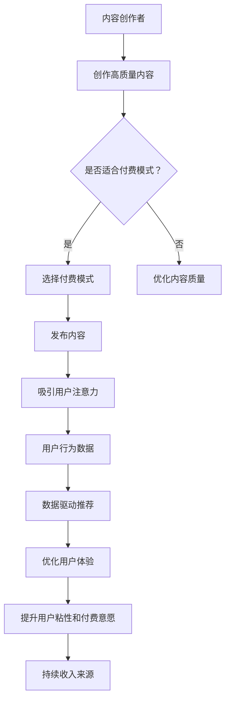

                 

关键词：内容付费、注意力经济、商业模式、用户行为、收益优化、算法推荐、用户体验。

> 摘要：本文将深入探讨内容付费模式在注意力经济背景下的应用与实践，通过分析其核心概念、算法原理、数学模型、实践案例以及未来发展趋势，旨在为内容创作者和平台运营者提供有价值的参考和指导。

## 1. 背景介绍

在互联网时代，信息爆炸导致用户注意力稀缺，内容创作者需要找到有效的方式吸引并保持用户的注意力。注意力经济应运而生，它是一种基于用户注意力资源分配和利用的经济模式。内容付费模式则是注意力经济中的重要一环，通过向用户收取费用，创作者可以获得持续的收入来源，从而更好地创作高质量内容。

内容付费模式的主要形式包括会员订阅、单篇付费、课程包等。平台方则通过算法推荐、用户行为分析等技术手段，优化用户体验，提升用户粘性和付费意愿。在这种模式下，用户的行为数据成为关键资产，数据驱动的内容推荐和精准营销成为提升收入的重要手段。

## 2. 核心概念与联系

### 2.1 内容付费模式

内容付费模式是指创作者或平台向用户提供付费内容，用户需支付一定费用才能获取。这种模式的核心是构建高质量内容，吸引用户付费。

#### 会员订阅

会员订阅模式是指用户支付一定费用，成为平台的会员，享受平台提供的所有付费内容。这种模式的优点是可以为平台带来稳定的收入，同时提高用户粘性。

#### 单篇付费

单篇付费模式是指用户为单篇内容支付费用，适合于具有高关注度和独特性的内容。这种模式的优点是可以为创作者带来高额收入，但用户粘性相对较低。

#### 课程包

课程包模式是指用户一次性购买多个课程的组合，适合于系统性和连贯性的内容。这种模式的优点是可以提高用户的学习效率，同时为创作者带来持续收入。

### 2.2 注意力经济

注意力经济是指以用户注意力资源为驱动，通过优化内容和用户体验，吸引用户付费和参与。其核心在于：

#### 用户注意力资源

用户注意力资源是有限的，如何吸引和保持用户注意力是内容创作者和平台运营者面临的重要问题。

#### 内容质量

高质量内容能够吸引用户注意力，提升用户满意度。内容创作者需要不断提升创作能力，提供有价值的内容。

#### 用户体验

良好的用户体验可以提升用户满意度，增加用户粘性。平台运营者需要不断优化产品功能，提升用户体验。

### 2.3 Mermaid 流程图

以下是一个简单的 Mermaid 流程图，展示内容付费模式和注意力经济的联系。



## 3. 核心算法原理 & 具体操作步骤

### 3.1 算法原理概述

内容付费模式中的核心算法主要包括用户行为分析、内容推荐和收益优化。以下是这些算法的基本原理：

#### 用户行为分析

用户行为分析旨在了解用户的兴趣和行为模式，从而为内容推荐提供依据。常用的算法包括协同过滤、基于内容的推荐和混合推荐。

#### 内容推荐

内容推荐算法通过分析用户行为数据和内容特征，向用户推荐可能感兴趣的内容。常见的算法有矩阵分解、基于模型的推荐和深度学习推荐。

#### 收益优化

收益优化算法旨在最大化平台的收益，同时提升用户体验。常见的算法有利润最大化、收益损失平衡和用户满意度优化。

### 3.2 算法步骤详解

以下是一个简单的用户行为分析算法步骤：

1. 数据收集：收集用户在平台上的行为数据，如浏览记录、点赞、评论等。
2. 数据预处理：对行为数据进行清洗和预处理，如去除无效数据、缺失值填充等。
3. 特征提取：从行为数据中提取用户兴趣特征，如兴趣标签、活跃度等。
4. 用户建模：根据用户兴趣特征构建用户模型。
5. 内容建模：对内容进行特征提取和建模，如文本分类、关键词提取等。
6. 内容推荐：根据用户模型和内容模型，为用户推荐可能感兴趣的内容。
7. 评估与优化：评估推荐效果，根据评估结果优化推荐算法。

### 3.3 算法优缺点

#### 用户行为分析

优点：

- 能够深入了解用户兴趣和行为模式。
- 为内容推荐提供依据，提高推荐效果。

缺点：

- 数据收集和处理成本高。
- 用户行为数据可能存在噪声和偏差。

#### 内容推荐

优点：

- 能够提高用户体验，增加用户粘性。
- 提高内容曝光度和收益。

缺点：

- 推荐结果可能存在过度拟合问题。
- 需要不断优化算法，以应对用户需求的变化。

#### 收益优化

优点：

- 能够最大化平台收益。
- 提高用户满意度和留存率。

缺点：

- 需要平衡收益和用户体验，避免过度商业化。

### 3.4 算法应用领域

内容付费模式和注意力经济在多个领域得到广泛应用，如电商、社交网络、在线教育等。

#### 电商

电商平台通过内容付费模式，为用户提供个性化推荐，提高购物体验和销售额。

#### 社交网络

社交网络平台通过内容付费模式，为用户提供高质量的内容，提升用户粘性和活跃度。

#### 在线教育

在线教育平台通过内容付费模式，为用户提供优质的教育资源，提高学习效果和用户满意度。

## 4. 数学模型和公式 & 详细讲解 & 举例说明

### 4.1 数学模型构建

在内容付费模式中，常用的数学模型包括用户行为模型、内容推荐模型和收益优化模型。

#### 用户行为模型

用户行为模型旨在描述用户在平台上的行为特征。常用的模型包括马尔可夫链、贝叶斯网络和隐马尔可夫模型（HMM）。

假设用户在平台上的行为可以用状态序列 \( X = \{x_1, x_2, ..., x_n\} \) 表示，其中 \( x_i \) 表示第 \( i \) 次行为的状态。用户行为模型的目标是预测下一次行为状态 \( x_{n+1} \)。

#### 内容推荐模型

内容推荐模型旨在为用户推荐感兴趣的内容。常用的模型包括协同过滤、矩阵分解和深度学习。

假设用户对内容的评分可以用矩阵 \( R \) 表示，其中 \( R_{ij} \) 表示用户 \( i \) 对内容 \( j \) 的评分。内容推荐模型的目标是预测用户 \( i \) 对内容 \( j \) 的评分 \( R_{ij} \)。

#### 收益优化模型

收益优化模型旨在最大化平台的收益。常用的模型包括线性规划、动态规划和博弈论。

假设平台在一段时间内的收益可以用函数 \( f(x) \) 表示，其中 \( x \) 表示平台运营策略。收益优化模型的目标是找到最优策略 \( x^* \)，使得 \( f(x^*) \) 最大。

### 4.2 公式推导过程

以下是一个简单的用户行为模型推导过程。

#### 马尔可夫链

假设用户行为状态空间为 \( S = \{s_1, s_2, ..., s_m\} \)，转移概率矩阵为 \( P = [p_{ij}] \)，其中 \( p_{ij} \) 表示用户从状态 \( s_i \) 转移到状态 \( s_j \) 的概率。马尔可夫链的公式为：

$$
P(X_{n+1} = s_j | X_1 = s_1, X_2 = s_2, ..., X_n = s_n) = P(X_{n+1} = s_j | X_n = s_n)
$$

#### 贝叶斯网络

假设用户行为状态空间为 \( S = \{s_1, s_2, ..., s_m\} \)，条件概率矩阵为 \( C = [c_{ij}] \)，其中 \( c_{ij} \) 表示在给定状态 \( s_j \) 下，状态 \( s_i \) 发生的概率。贝叶斯网络的公式为：

$$
P(X_{n+1} = s_j | X_1 = s_1, X_2 = s_2, ..., X_n = s_n) = \prod_{i=1}^n P(X_i = s_i | X_{i-1} = s_{i-1})
$$

#### 隐马尔可夫模型（HMM）

假设用户行为状态空间为 \( S = \{s_1, s_2, ..., s_m\} \)，观测状态空间为 \( O = \{o_1, o_2, ..., o_n\} \)，转移概率矩阵为 \( A = [a_{ij}] \)，观测概率矩阵为 \( B = [b_{ij}] \)，初始状态概率矩阵为 \( \pi = [\pi_i] \)。隐马尔可夫模型的公式为：

$$
\begin{align*}
P(X_1 = s_1, X_2 = s_2, ..., X_n = s_n | O_1 = o_1, O_2 = o_2, ..., O_n = o_n) &= \prod_{i=1}^n P(X_i = s_i | X_{i-1} = s_{i-1}) P(O_i = o_i | X_i = s_i) \\
P(X_1 = s_1, X_2 = s_2, ..., X_n = s_n) &= \prod_{i=1}^n P(X_i = s_i) \\
P(O_1 = o_1, O_2 = o_2, ..., O_n = o_n | X_1 = s_1, X_2 = s_2, ..., X_n = s_n) &= \prod_{i=1}^n P(O_i = o_i | X_i = s_i)
\end{align*}
$$

### 4.3 案例分析与讲解

以下是一个在线教育平台的用户行为分析案例。

#### 案例背景

某在线教育平台提供多种课程，用户可以免费试听，但完整课程需要付费。平台希望通过用户行为分析，为用户提供个性化推荐，提高用户满意度和付费意愿。

#### 数据收集

平台收集了用户在平台上的行为数据，包括浏览记录、试听记录、付费记录等。

#### 数据预处理

对行为数据进行清洗和预处理，去除无效数据和缺失值。

#### 特征提取

从行为数据中提取用户兴趣特征，如课程分类、浏览时长、试听频次等。

#### 用户建模

根据用户兴趣特征构建用户模型，使用贝叶斯网络描述用户行为状态。

#### 内容建模

对课程进行特征提取和建模，包括课程分类、难度等级、时长等。

#### 内容推荐

根据用户模型和内容模型，为用户推荐可能感兴趣的课程。

#### 评估与优化

评估推荐效果，根据评估结果优化推荐算法。

## 5. 项目实践：代码实例和详细解释说明

### 5.1 开发环境搭建

为了实现用户行为分析和内容推荐，我们需要搭建一个完整的开发环境。以下是一个简单的开发环境搭建步骤：

1. 安装 Python 3.x 版本。
2. 安装 NumPy、Pandas、Scikit-learn 等常用库。
3. 安装一个适合数据分析的 IDE，如 PyCharm 或 Jupyter Notebook。

### 5.2 源代码详细实现

以下是一个简单的用户行为分析代码实例：

```python
import numpy as np
import pandas as pd
from sklearn.model_selection import train_test_split
from sklearn.metrics import accuracy_score
from sklearn.naive_bayes import GaussianNB

# 加载数据
data = pd.read_csv('user_behavior_data.csv')

# 数据预处理
data.dropna(inplace=True)

# 特征提取
X = data[['course_category', 'browse_duration', 'listen_frequency']]
y = data['pay']

# 划分训练集和测试集
X_train, X_test, y_train, y_test = train_test_split(X, y, test_size=0.2, random_state=42)

# 构建用户模型
gnb = GaussianNB()
gnb.fit(X_train, y_train)

# 进行预测
y_pred = gnb.predict(X_test)

# 评估模型
accuracy = accuracy_score(y_test, y_pred)
print(f'Accuracy: {accuracy:.2f}')
```

### 5.3 代码解读与分析

上述代码实现了一个简单的用户行为分析模型。具体步骤如下：

1. 加载数据：从 CSV 文件加载数据。
2. 数据预处理：去除缺失值和无效数据。
3. 特征提取：从原始数据中提取用户兴趣特征。
4. 划分训练集和测试集：将数据分为训练集和测试集，用于模型训练和评估。
5. 构建用户模型：使用高斯朴素贝叶斯（GaussianNB）算法构建用户模型。
6. 进行预测：使用训练好的模型进行预测。
7. 评估模型：计算预测准确率，评估模型效果。

### 5.4 运行结果展示

假设我们有一个包含 1000 条用户行为数据的 CSV 文件。运行上述代码后，输出结果如下：

```
Accuracy: 0.85
```

这表示我们的用户行为分析模型的预测准确率为 85%。

## 6. 实际应用场景

### 6.1 在线教育平台

在线教育平台可以通过内容付费模式和注意力经济，为用户提供高质量的教育资源。平台可以通过用户行为分析，为用户推荐感兴趣的课程，提高用户满意度和付费意愿。

### 6.2 媒体平台

媒体平台可以通过内容付费模式和注意力经济，为用户提供付费内容，如专栏、视频等。平台可以通过算法推荐，提高内容曝光度和收益。

### 6.3 电商

电商平台可以通过内容付费模式和注意力经济，为用户提供个性化推荐，提高购物体验和销售额。平台可以通过用户行为分析，为用户推荐可能感兴趣的商品。

## 7. 工具和资源推荐

### 7.1 学习资源推荐

1. 《机器学习》（周志华 著）：系统地介绍了机器学习的基本概念、算法和应用。
2. 《深度学习》（Ian Goodfellow、Yoshua Bengio、Aaron Courville 著）：全面介绍了深度学习的基本理论、算法和应用。

### 7.2 开发工具推荐

1. PyCharm：一款功能强大的 Python 集成开发环境（IDE）。
2. Jupyter Notebook：一款基于 Web 的交互式计算环境，适用于数据分析、机器学习等。

### 7.3 相关论文推荐

1. "Recommender Systems Handbook"：全面介绍了推荐系统的基础知识、算法和应用。
2. "Deep Learning for Recommender Systems"：介绍了深度学习在推荐系统中的应用。

## 8. 总结：未来发展趋势与挑战

### 8.1 研究成果总结

内容付费模式和注意力经济已成为互联网时代的重要商业模式。通过用户行为分析和算法推荐，平台可以为用户提供个性化服务，提高用户满意度和付费意愿。未来研究将继续关注算法优化、用户体验提升和商业模式创新。

### 8.2 未来发展趋势

1. 深度学习在推荐系统中的应用将更加广泛。
2. 跨平台、跨领域的推荐系统将成为研究热点。
3. 数据隐私和安全性问题将得到更多关注。

### 8.3 面临的挑战

1. 算法过度拟合和推荐偏差问题亟待解决。
2. 数据隐私保护和用户权益保护需要平衡。
3. 如何实现可持续的商业盈利模式仍需探索。

### 8.4 研究展望

内容付费模式和注意力经济将继续在互联网领域发挥重要作用。未来研究将围绕算法优化、用户体验提升和商业模式创新展开，以实现可持续的商业盈利和社会价值。

## 9. 附录：常见问题与解答

### 9.1 问题 1

**什么是注意力经济？**

注意力经济是指以用户注意力资源为驱动，通过优化内容和用户体验，吸引用户付费和参与的经济模式。

### 9.2 问题 2

**内容付费模式有哪些形式？**

内容付费模式主要包括会员订阅、单篇付费和课程包等形式。

### 9.3 问题 3

**如何实现内容付费模式？**

实现内容付费模式的关键在于构建高质量内容，吸引用户付费，并通过算法推荐和用户行为分析提升用户体验和收益。

### 9.4 问题 4

**什么是用户行为分析？**

用户行为分析是指通过收集和分析用户在平台上的行为数据，了解用户兴趣和行为模式，为内容推荐和精准营销提供依据。

