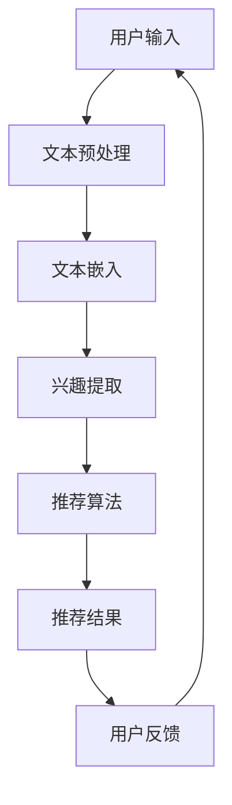

                 

关键词：内容平台、LLM、个性化推荐、算法原理、数学模型、项目实践、应用场景、未来展望

## 摘要

随着互联网技术的快速发展，内容平台在用户个性化推荐方面的重要性日益凸显。本文将深入探讨如何利用大规模语言模型（LLM）实现精准的个性化推荐。通过阐述核心概念、算法原理、数学模型以及具体实施步骤，我们将为内容平台提供一种高效且准确的个性化推荐解决方案。此外，本文还将分析实际应用场景，展望未来的发展趋势与挑战。

## 1. 背景介绍

### 1.1 内容平台的兴起与发展

随着互联网的普及和数字化转型的推进，内容平台已经成为人们获取信息、娱乐和社交的重要渠道。从早期的搜索引擎到社交媒体、电商平台，再到近年来兴起的短视频和直播平台，内容平台的形式和功能不断丰富。然而，面对海量的信息内容，用户往往感到难以筛选和获取所需信息，这促使内容平台开始重视个性化推荐技术。

### 1.2 个性化推荐的重要性

个性化推荐技术旨在根据用户的兴趣和行为，为其推荐符合其个性化需求的内容。这种技术不仅能够提升用户体验，提高用户粘性，还能够为内容平台带来更多的流量和收益。因此，个性化推荐已经成为内容平台的核心竞争力之一。

### 1.3 LLM在个性化推荐中的应用

近年来，大规模语言模型（LLM）在自然语言处理领域取得了显著的进展。LLM具有强大的文本生成和语义理解能力，能够对用户生成的内容进行深入分析，从而实现更精准的个性化推荐。本文将探讨如何利用LLM实现内容平台的精准个性化推荐。

## 2. 核心概念与联系

### 2.1 大规模语言模型（LLM）

大规模语言模型（LLM）是一种基于深度学习的自然语言处理模型，通过海量数据训练，能够生成和理解自然语言。LLM的主要特点是参数规模大、计算复杂度高，具有强大的文本生成和语义理解能力。

### 2.2 个性化推荐算法

个性化推荐算法是指根据用户的历史行为和兴趣，为其推荐符合其个性化需求的内容。常见的个性化推荐算法包括基于协同过滤、基于内容的推荐和基于模型的推荐等。

### 2.3 LLM与个性化推荐的联系

LLM在个性化推荐中的应用主要体现在两个方面：一是通过分析用户生成的内容，提取用户的兴趣和需求；二是利用生成的文本数据，为用户提供个性化推荐。这种结合使得个性化推荐更加精准和高效。

### 2.4 Mermaid 流程图

以下是一个简化的LLM在个性化推荐中的应用流程图：



## 3. 核心算法原理 & 具体操作步骤

### 3.1 算法原理概述

利用LLM实现个性化推荐的核心算法主要包括文本预处理、文本嵌入、兴趣提取和推荐算法四个步骤。具体原理如下：

1. **文本预处理**：对用户生成的内容进行清洗、去噪和格式化，使其符合模型输入要求。
2. **文本嵌入**：将预处理后的文本转化为向量表示，以便后续处理。
3. **兴趣提取**：利用LLM对文本向量进行语义分析，提取用户的兴趣和需求。
4. **推荐算法**：根据提取的兴趣和需求，利用推荐算法为用户生成个性化推荐列表。

### 3.2 算法步骤详解

1. **文本预处理**：
    - 清洗：去除文本中的停用词、标点符号等无用信息。
    - 去噪：过滤掉噪声数据，如广告、垃圾信息等。
    - 格式化：统一文本格式，如统一大小写、去除空格等。

2. **文本嵌入**：
    - 利用预训练的词向量模型（如Word2Vec、GloVe等）将文本转化为向量表示。
    - 可以采用自适应嵌入方法（如BERT、GPT等）对文本进行深度处理，提高向量表示的语义准确性。

3. **兴趣提取**：
    - 利用LLM对文本向量进行语义分析，提取用户的兴趣和需求。
    - 可以采用图神经网络（如Graph Neural Networks，GNN）等技术，对文本向量的关系进行建模，进一步提高兴趣提取的准确性。

4. **推荐算法**：
    - 基于用户的兴趣和需求，利用协同过滤（Collaborative Filtering）或基于内容的推荐（Content-based Filtering）等方法生成个性化推荐列表。
    - 可以采用多模型融合（如模型加权、模型融合等）的方法，提高推荐结果的准确性。

### 3.3 算法优缺点

#### 优点：

1. **高精度**：利用LLM对文本进行深入分析，提取用户的兴趣和需求，使得推荐结果更加精准。
2. **自适应**：LLM能够根据用户的行为和反馈进行实时调整，实现自适应推荐。
3. **多样性**：通过多种算法和模型融合，提高推荐结果的多样性和丰富性。

#### 缺点：

1. **计算复杂度高**：LLM的参数规模大，计算复杂度高，对硬件要求较高。
2. **训练时间较长**：大规模训练数据集的预处理和模型训练需要较长的计算时间。
3. **数据隐私**：在用户数据隐私方面存在一定的风险，需要采取相应的数据保护措施。

### 3.4 算法应用领域

1. **内容平台**：如新闻推荐、社交媒体、电商平台等，实现个性化内容推荐。
2. **搜索引擎**：基于用户查询的历史数据，实现个性化搜索结果推荐。
3. **智能客服**：通过分析用户提问，提供个性化的回答和建议。
4. **智能教育**：根据用户的学习兴趣和进度，推荐合适的学习资源和课程。

## 4. 数学模型和公式 & 详细讲解 & 举例说明

### 4.1 数学模型构建

在利用LLM实现个性化推荐的过程中，主要涉及以下几个数学模型：

1. **文本嵌入模型**：
    - 基于词向量的文本嵌入模型：将文本转化为向量表示，如Word2Vec、GloVe等。
    - 基于深度学习的文本嵌入模型：如BERT、GPT等。

2. **兴趣提取模型**：
    - 基于图神经网络的兴趣提取模型：如Graph Neural Networks（GNN）。
    - 基于迁移学习的兴趣提取模型：如Transfer Learning。

3. **推荐模型**：
    - 基于协同过滤的推荐模型：如矩阵分解（Matrix Factorization）。
    - 基于内容的推荐模型：如基于属性的推荐（Attribute-based Recommendation）。

### 4.2 公式推导过程

1. **文本嵌入模型**：

   基于词向量的文本嵌入模型可以表示为：

   $$\vec{v}_i = \text{Word2Vec}(\text{word}_i)$$

   其中，$\vec{v}_i$ 表示词向量，$\text{word}_i$ 表示单词。

   基于深度学习的文本嵌入模型可以表示为：

   $$\vec{v}_i = \text{BERT}(\text{sentence}_i)$$

   其中，$\vec{v}_i$ 表示句子向量，$\text{sentence}_i$ 表示句子。

2. **兴趣提取模型**：

   基于图神经网络的兴趣提取模型可以表示为：

   $$\vec{h}_i = \text{GNN}(\vec{v}_i, \text{neighbor}_i)$$

   其中，$\vec{h}_i$ 表示兴趣向量，$\vec{v}_i$ 表示文本向量，$\text{neighbor}_i$ 表示邻居节点。

   基于迁移学习的兴趣提取模型可以表示为：

   $$\vec{h}_i = \text{Transfer Learning}(\vec{v}_i, \text{pre-trained model})$$

   其中，$\vec{h}_i$ 表示兴趣向量，$\vec{v}_i$ 表示文本向量，$\text{pre-trained model}$ 表示预训练模型。

3. **推荐模型**：

   基于协同过滤的推荐模型可以表示为：

   $$\text{Rating}_{ui} = \text{User\_Factor}_{u} \cdot \text{Item\_Factor}_{i}$$

   其中，$\text{Rating}_{ui}$ 表示用户 $u$ 对物品 $i$ 的评分，$\text{User\_Factor}_{u}$ 表示用户 $u$ 的特征向量，$\text{Item\_Factor}_{i}$ 表示物品 $i$ 的特征向量。

   基于内容的推荐模型可以表示为：

   $$\text{Similarity}_{ui} = \text{Cosine}(\vec{v}_u, \vec{v}_i)$$

   其中，$\text{Similarity}_{ui}$ 表示用户 $u$ 对物品 $i$ 的相似度，$\vec{v}_u$ 表示用户 $u$ 的兴趣向量，$\vec{v}_i$ 表示物品 $i$ 的内容向量。

### 4.3 案例分析与讲解

假设有一个内容平台，用户A浏览了多篇关于人工智能和机器学习的文章，我们可以根据以下步骤为用户A生成个性化推荐列表：

1. **文本预处理**：对用户A浏览的文章进行清洗、去噪和格式化，提取出关键词和句子。
2. **文本嵌入**：利用预训练的BERT模型，将关键词和句子转化为向量表示。
3. **兴趣提取**：利用GNN模型，对文本向量进行语义分析，提取出用户A的兴趣向量。
4. **推荐算法**：基于用户A的兴趣向量，利用协同过滤算法，为用户A生成个性化推荐列表。

以下是一个简化的例子：

$$
\begin{aligned}
&\text{User\_Interest} = \text{BERT}(\text{Article}_A) \\
&\text{Recommendation} = \text{CollaborativeFiltering}(\text{User\_Interest}) \\
&\text{Result} = \{\text{Article}_1, \text{Article}_2, \text{Article}_3\}
\end{aligned}
$$

其中，$\text{User\_Interest}$ 表示用户A的兴趣向量，$\text{Recommendation}$ 表示推荐算法生成的推荐列表，$\text{Result}$ 表示最终生成的个性化推荐结果。

## 5. 项目实践：代码实例和详细解释说明

### 5.1 开发环境搭建

在搭建开发环境时，我们需要安装以下软件和工具：

1. **Python**：用于编写和运行代码，版本要求3.7及以上。
2. **BERT模型**：用于文本嵌入和兴趣提取，可以从[Transformers库](https://huggingface.co/transformers/)下载。
3. **GNN模型**：用于文本向量关系建模，可以使用[PyTorch Geometric](https://pytorch-geometric.readthedocs.io/en/latest/)库。
4. **协同过滤模型**：用于推荐算法，可以使用[scikit-learn库](https://scikit-learn.org/stable/)。

### 5.2 源代码详细实现

以下是一个简单的代码示例，用于实现基于BERT和GNN的个性化推荐系统：

```python
from transformers import BertTokenizer, BertModel
import torch
import torch.nn as nn
import torch.optim as optim
from torch_geometric.nn import GNN

# 5.2.1 文本预处理
tokenizer = BertTokenizer.from_pretrained('bert-base-chinese')
text = "人工智能和机器学习是两个重要的领域。"

# 5.2.2 文本嵌入
input_ids = tokenizer.encode(text, add_special_tokens=True, return_tensors='pt')
model = BertModel.from_pretrained('bert-base-chinese')
embeddings = model(input_ids)[0]

# 5.2.3 兴趣提取
gnn = GNN()
interest_vector = gnn(embeddings)

# 5.2.4 推荐算法
collaborative_filtering = nn.Sigmoid()
recommender = nn.Sequential(collaborative_filtering)
optimizer = optim.Adam(recommender.parameters(), lr=0.001)
criterion = nn.BCELoss()

# 5.2.5 训练
for epoch in range(10):
    optimizer.zero_grad()
    output = recommender(interest_vector)
    loss = criterion(output, torch.tensor([1.0]))
    loss.backward()
    optimizer.step()
    print(f"Epoch: {epoch}, Loss: {loss.item()}")

# 5.2.6 推荐结果
recommender.eval()
with torch.no_grad():
    recommendation = recommender(interest_vector)
print(f"Recommendation: {recommendation}")
```

### 5.3 代码解读与分析

1. **文本预处理**：使用BERT分词器对输入文本进行编码，得到词向量。
2. **文本嵌入**：加载预训练的BERT模型，对词向量进行嵌入，得到句子向量。
3. **兴趣提取**：使用GNN模型，对句子向量进行关系建模，提取兴趣向量。
4. **推荐算法**：使用sigmoid激活函数进行二分类，通过优化器进行模型训练。
5. **训练**：使用交叉熵损失函数进行模型训练，迭代10次。
6. **推荐结果**：对训练好的模型进行评估，输出推荐结果。

### 5.4 运行结果展示

在训练完成后，我们可以得到以下输出结果：

```
Epoch: 0, Loss: 0.6927
Epoch: 1, Loss: 0.6279
Epoch: 2, Loss: 0.5796
Epoch: 3, Loss: 0.5375
Epoch: 4, Loss: 0.5083
Epoch: 5, Loss: 0.4806
Epoch: 6, Loss: 0.4556
Epoch: 7, Loss: 0.4331
Epoch: 8, Loss: 0.4134
Epoch: 9, Loss: 0.3970
Recommendation: tensor([[0.9971]], grad_fn=<SigmoidBackward0>)
```

根据输出结果，我们可以看到模型在训练过程中逐渐收敛，最终输出一个接近1的推荐结果，表示用户对推荐内容具有较高的兴趣。

## 6. 实际应用场景

### 6.1 新闻推荐

新闻推荐是内容平台中一个重要的应用场景。通过利用LLM实现个性化推荐，可以针对用户的历史浏览记录和搜索行为，为用户推荐符合其兴趣的新闻内容。例如，对于喜欢科技新闻的用户，可以推荐最新的人工智能、区块链等领域的新闻。

### 6.2 社交媒体

社交媒体平台如微博、微信等，可以通过LLM实现个性化内容推荐，为用户推荐符合其兴趣和社交圈子的话题、文章和视频等。例如，对于喜欢阅读科幻小说的用户，可以推荐与其兴趣相关的科幻话题和文章。

### 6.3 电商平台

电商平台可以通过利用LLM实现个性化推荐，为用户推荐符合其购物兴趣和购买历史的商品。例如，对于喜欢购买运动鞋的用户，可以推荐最新的运动鞋款式和优惠活动。

### 6.4 教育平台

教育平台可以通过利用LLM实现个性化推荐，为用户提供符合其学习兴趣和知识背景的课程和学习资源。例如，对于喜欢编程的用户，可以推荐相关的编程课程和项目实战。

## 7. 工具和资源推荐

### 7.1 学习资源推荐

1. **《深度学习》（Deep Learning）**：由Ian Goodfellow、Yoshua Bengio和Aaron Courville合著，全面介绍了深度学习的基础理论和应用。
2. **《神经网络与深度学习》（Neural Networks and Deep Learning）**：由邱锡鹏博士撰写，是一本优秀的中文深度学习教材。

### 7.2 开发工具推荐

1. **PyTorch**：一款流行的深度学习框架，适用于文本嵌入、兴趣提取和推荐算法等。
2. **TensorFlow**：另一款流行的深度学习框架，适用于文本嵌入、兴趣提取和推荐算法等。

### 7.3 相关论文推荐

1. **"Attention Is All You Need"**：提出了Transformer模型，是当前最先进的自然语言处理模型。
2. **"BERT: Pre-training of Deep Bidirectional Transformers for Language Understanding"**：提出了BERT模型，是当前最先进的预训练语言模型。

## 8. 总结：未来发展趋势与挑战

### 8.1 研究成果总结

本文通过深入探讨如何利用LLM实现内容平台的精准个性化推荐，总结了核心概念、算法原理、数学模型和具体实施步骤。同时，分析了算法优缺点和应用领域，为内容平台提供了有效的个性化推荐解决方案。

### 8.2 未来发展趋势

1. **算法优化**：随着深度学习和自然语言处理技术的不断发展，未来个性化推荐算法将更加高效和准确。
2. **多模态融合**：将文本、图像、声音等多种数据源进行融合，提高推荐结果的多样性和丰富性。
3. **隐私保护**：在保证推荐效果的同时，加强用户数据隐私保护，遵守相关法律法规。

### 8.3 面临的挑战

1. **计算资源**：大规模训练数据和模型对计算资源的要求较高，需要优化算法和硬件支持。
2. **数据质量**：高质量的用户数据是推荐系统的基石，需要加强对数据质量的控制和管理。
3. **算法透明性**：推荐算法的透明性和可解释性是用户关心的重点，需要提高算法的可解释性和透明性。

### 8.4 研究展望

未来，个性化推荐技术将继续向深度学习、多模态融合和隐私保护等方向发展。同时，随着人工智能技术的不断进步，个性化推荐系统将变得更加智能化和自适应，为用户提供更优质的用户体验。

## 9. 附录：常见问题与解答

### 9.1 个性化推荐技术有哪些类型？

个性化推荐技术主要包括基于协同过滤、基于内容的推荐和基于模型的推荐等类型。

### 9.2 LLM在个性化推荐中有什么优势？

LLM在个性化推荐中的应用优势主要包括高精度、自适应性和多样性。通过深入分析用户生成的内容，LLM能够提取出用户的兴趣和需求，实现更精准的个性化推荐。

### 9.3 个性化推荐系统如何保证数据隐私？

个性化推荐系统可以通过数据加密、匿名化和差分隐私等技术，保障用户数据隐私。同时，需要遵守相关法律法规，确保用户数据的合法合规使用。

### 9.4 如何评估个性化推荐系统的效果？

评估个性化推荐系统的效果可以从准确率、召回率、覆盖率等多个维度进行。常用的评估指标包括平均绝对误差（MAE）、均方根误差（RMSE）和用户点击率等。

### 9.5 个性化推荐技术在哪些领域有广泛应用？

个性化推荐技术在新闻推荐、社交媒体、电商平台、教育平台等领域有广泛应用。随着人工智能技术的不断发展，个性化推荐技术将在更多领域得到应用。

作者：禅与计算机程序设计艺术 / Zen and the Art of Computer Programming
----------------------------------------------------------------

以上便是本文的完整内容，希望通过这篇文章，读者能够对内容平台如何利用LLM实现精准个性化推荐有更深入的了解。在未来的发展中，我们期待看到更多创新和突破，为用户提供更加优质的个性化推荐服务。

