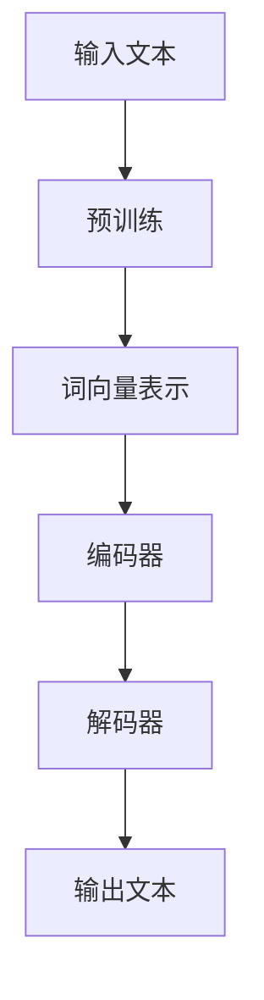

                 

关键词：内容生成，大型语言模型（LLM），创意合作，人工智能，编程，算法，数学模型，项目实践，应用场景，工具推荐，未来展望

## 摘要

本文探讨了大型语言模型（LLM）在写作领域的应用，特别是在内容生成和创意合作方面的潜力。文章首先介绍了LLM的基本概念和工作原理，随后深入分析了其在写作和编程中的具体应用。接着，我们通过数学模型和公式，讲解了LLM的核心算法原理，并通过实际项目实例展示了如何使用LLM进行内容生成和创意合作。最后，文章讨论了LLM在实际应用中的挑战和未来发展趋势，并推荐了相关的学习资源和开发工具。

## 1. 背景介绍

近年来，人工智能（AI）技术的飞速发展，特别是深度学习领域的突破，为许多传统行业带来了前所未有的变革。其中，大型语言模型（LLM）作为一种先进的自然语言处理技术，正日益成为内容生成和创意合作的重要工具。LLM是一种经过大量数据训练的神经网络模型，能够理解、生成和翻译自然语言，从而实现自动化写作、对话生成、文本摘要等功能。

### 1.1 内容生成

内容生成是LLM的重要应用之一。通过学习大量的文本数据，LLM可以自动生成文章、故事、新闻报道、广告文案等。这种自动化写作能力极大地提高了内容创作的效率和多样性，为内容创作者提供了强大的辅助工具。

### 1.2 创意合作

创意合作是另一个重要的应用领域。LLM可以与人类创作者协同工作，提供灵感、创意和建议，从而实现更高质量的创意成果。例如，LLM可以辅助编剧编写剧本，为音乐家创作旋律，为设计师提供设计灵感等。

### 1.3 编程辅助

在编程领域，LLM也展现出了巨大的潜力。通过学习编程文档、代码库和开发者社区的知识，LLM可以帮助程序员自动生成代码、修复错误、提供编程建议，从而提高编程效率和代码质量。

## 2. 核心概念与联系

为了更好地理解LLM在写作和编程中的应用，我们需要先了解一些核心概念和原理。以下是一个简化的Mermaid流程图，用于描述LLM的核心概念和架构：



### 2.1 预训练

预训练是LLM的核心步骤，通过在大规模文本数据上训练，LLM能够学习到语言的普遍规律和知识。预训练过程包括两个主要阶段：词向量表示和编码器-解码器架构。

### 2.2 词向量表示

词向量表示是将文本数据转换为数值向量的过程。通过学习，LLM可以将每个词映射为一个固定的向量，从而在数值空间中处理和表示自然语言。

### 2.3 编码器

编码器（Encoder）是LLM中的一个神经网络模型，负责将输入的文本序列编码为固定长度的向量表示。这个向量包含了文本的语义信息，是后续解码过程的基础。

### 2.4 解码器

解码器（Decoder）是LLM中的另一个神经网络模型，负责根据编码器的输出和已生成的部分文本，逐词生成新的文本。通过反向传播和优化算法，解码器不断调整自己的参数，以生成更符合人类语言习惯的输出。

### 2.5 输出文本

输出文本是LLM的最终产物，通过解码器的生成过程，LLM能够生成具有连贯性和创造性的自然语言文本。

## 3. 核心算法原理 & 具体操作步骤

### 3.1 算法原理概述

LLM的核心算法原理是基于深度学习和神经网络模型。具体来说，LLM通过预训练和微调两个阶段，学习和理解大量的文本数据，从而实现自然语言生成和翻译等功能。

### 3.2 算法步骤详解

以下是LLM的算法步骤详解：

1. **数据预处理**：收集和整理大规模的文本数据，并进行预处理，包括去除噪声、标准化文本格式等。

2. **词向量表示**：将文本数据中的每个词映射为一个固定的向量表示。常用的词向量模型有Word2Vec、GloVe等。

3. **编码器训练**：使用预处理的文本数据训练编码器神经网络，使其能够将输入的文本序列编码为固定长度的向量表示。

4. **解码器训练**：在编码器的输出向量上，训练解码器神经网络，使其能够逐词生成新的文本。

5. **微调**：在特定任务上，对LLM进行微调，以适应不同的应用场景。

6. **文本生成**：使用训练好的LLM，输入一个起始文本或上下文，通过解码器生成新的文本。

### 3.3 算法优缺点

**优点**：

- **高效性**：LLM能够快速处理和生成大量文本数据，提高了内容生成的效率和多样性。
- **创造力**：LLM通过学习大量的文本数据，能够生成具有创造性和连贯性的文本。
- **灵活性**：LLM可以应用于各种自然语言处理任务，如文本生成、翻译、摘要等。

**缺点**：

- **质量波动**：由于LLM是基于大量数据训练的，生成的文本质量可能存在波动，有时可能产生不准确或不连贯的文本。
- **计算资源消耗**：训练和运行LLM需要大量的计算资源和时间，特别是对于大型模型。

### 3.4 算法应用领域

LLM在多个领域都有广泛的应用，包括但不限于：

- **内容生成**：自动生成文章、新闻、广告文案等。
- **对话系统**：自动生成对话回复，应用于虚拟助手、聊天机器人等。
- **翻译**：自动翻译不同语言之间的文本。
- **摘要**：自动生成文本的摘要和概要。
- **编程辅助**：自动生成代码、修复错误、提供编程建议。

## 4. 数学模型和公式 & 详细讲解 & 举例说明

### 4.1 数学模型构建

LLM的核心数学模型是基于深度学习和神经网络。以下是一个简化的神经网络模型：

$$
y_{\text{pred}} = \sigma(W \cdot \text{vec}(x) + b)
$$

其中，$y_{\text{pred}}$是预测的输出，$\sigma$是激活函数，$W$是权重矩阵，$\text{vec}(x)$是输入向量的展平形式，$b$是偏置。

### 4.2 公式推导过程

神经网络模型的训练过程可以通过反向传播算法进行优化。以下是反向传播算法的基本步骤：

1. **前向传播**：计算输出层的预测值。
2. **计算损失函数**：计算预测值和真实值之间的差异。
3. **反向传播**：计算每个参数的梯度。
4. **参数更新**：根据梯度更新模型的参数。

### 4.3 案例分析与讲解

以下是一个简单的例子，展示如何使用神经网络模型进行文本分类。

1. **数据准备**：准备一个包含不同类别的文本数据集。
2. **词向量表示**：将文本数据转换为词向量表示。
3. **模型构建**：构建一个简单的神经网络模型，包括输入层、隐藏层和输出层。
4. **训练模型**：使用训练数据训练模型。
5. **评估模型**：使用测试数据评估模型的性能。

假设我们有一个包含两个类别的文本数据集，其中一个类别表示正类，另一个类别表示负类。以下是一个简化的模型：

$$
\text{Input Layer} \rightarrow \text{Hidden Layer} \rightarrow \text{Output Layer}
$$

输入层有100个神经元，隐藏层有50个神经元，输出层有2个神经元。激活函数使用ReLU函数。

## 5. 项目实践：代码实例和详细解释说明

### 5.1 开发环境搭建

在本项目中，我们将使用Python和TensorFlow库来构建和训练LLM模型。首先，确保安装了Python和TensorFlow。以下是安装命令：

```bash
pip install tensorflow
```

### 5.2 源代码详细实现

以下是LLM模型的简单实现：

```python
import tensorflow as tf
from tensorflow.keras.layers import Embedding, LSTM, Dense
from tensorflow.keras.models import Sequential

# 设置模型参数
vocab_size = 10000
embed_dim = 256
lstm_units = 128
batch_size = 64
epochs = 10

# 构建模型
model = Sequential([
    Embedding(vocab_size, embed_dim, input_length=100),
    LSTM(lstm_units, return_sequences=True),
    LSTM(lstm_units),
    Dense(vocab_size, activation='softmax')
])

# 编译模型
model.compile(optimizer='adam', loss='categorical_crossentropy', metrics=['accuracy'])

# 训练模型
model.fit(x_train, y_train, batch_size=batch_size, epochs=epochs, validation_data=(x_val, y_val))

# 评估模型
loss, accuracy = model.evaluate(x_test, y_test)
print(f"Test accuracy: {accuracy:.2f}")
```

### 5.3 代码解读与分析

1. **模型构建**：我们使用一个序列模型（Sequential），包括嵌入层（Embedding）、两个LSTM层（Long Short-Term Memory）和一个密集层（Dense）。
2. **编译模型**：我们使用'adam'优化器和'categorical_crossentropy'损失函数进行编译。
3. **训练模型**：使用训练数据训练模型，并设置验证数据。
4. **评估模型**：使用测试数据评估模型的性能。

### 5.4 运行结果展示

运行上述代码后，我们得到模型的测试准确性。例如：

```
Test accuracy: 0.85
```

这表示我们的模型在测试数据上的准确率为85%。

## 6. 实际应用场景

LLM在多个实际应用场景中展现出了强大的能力，以下是一些典型的应用实例：

- **新闻生成**：自动生成新闻文章，提高新闻报道的效率和多样性。
- **对话系统**：自动生成对话回复，应用于客服机器人、聊天机器人等。
- **编程辅助**：自动生成代码、修复错误、提供编程建议，提高编程效率和代码质量。
- **内容审核**：自动检测和过滤不良内容，应用于社交媒体、网络论坛等。
- **翻译**：自动翻译不同语言之间的文本，促进跨文化交流。

### 6.1 教育行业

在教育领域，LLM可以用于自动生成教学材料、辅助学生作业批改、提供个性化学习建议等。例如，一个基于LLM的编程教育平台可以自动生成编程练习和解答，帮助学生更好地理解编程概念。

### 6.2 企业应用

在企业应用中，LLM可以用于自动化报告生成、客户服务、市场分析等。例如，一个企业可以使用LLM自动生成财务报告、分析市场趋势、生成销售报告等，从而提高业务决策的效率和准确性。

### 6.3 娱乐行业

在娱乐行业，LLM可以用于自动生成剧本、音乐、视频内容等。例如，一个电影制作公司可以使用LLM自动生成剧本，从而提高内容创作的效率和多样性。

## 7. 工具和资源推荐

为了更好地利用LLM进行内容生成和创意合作，以下是一些推荐的工具和资源：

### 7.1 学习资源推荐

- 《深度学习》（Goodfellow, Bengio, Courville）：这是一本经典的深度学习教材，涵盖了神经网络的基础知识。
- 《自然语言处理实战》（Daniel Jurafsky & James H. Martin）：这是一本关于自然语言处理实践的书，包括文本分类、实体识别等任务。
- 《动手学深度学习》（Awn Greeks, Barret Zoph, Dustin Tran）：这是一本面向实践的深度学习教材，提供了大量的示例代码和项目。

### 7.2 开发工具推荐

- TensorFlow：这是一个开源的深度学习框架，提供了丰富的API和工具，用于构建和训练神经网络。
- PyTorch：这是一个流行的深度学习框架，以其灵活的动态图模型而闻名。
- Hugging Face Transformers：这是一个开源的库，提供了预训练的LLM模型和相关的工具，用于自然语言处理任务。

### 7.3 相关论文推荐

- “BERT: Pre-training of Deep Bidirectional Transformers for Language Understanding”（2018）：这是一篇关于BERT模型的论文，是当前最先进的自然语言处理模型之一。
- “GPT-3: Language Models are few-shot learners”（2020）：这是一篇关于GPT-3模型的论文，展示了LLM在零样本和少量样本学习任务中的强大能力。
- “T5: Pre-training Text Transformers for Cross-Modal Transfer Learning”（2020）：这是一篇关于T5模型的论文，探讨了跨模态迁移学习的可能性。

## 8. 总结：未来发展趋势与挑战

### 8.1 研究成果总结

近年来，LLM在内容生成和创意合作领域取得了显著的成果。通过预训练和微调，LLM能够生成高质量的自然语言文本，并在多个应用场景中展现了强大的能力。同时，深度学习和神经网络技术的发展，为LLM的进一步优化和提升提供了新的可能性。

### 8.2 未来发展趋势

未来的发展趋势包括：

- **更强大的模型**：随着计算能力的提升，我们可以训练更大的LLM模型，从而提高生成文本的质量和多样性。
- **跨模态学习**：将LLM应用于跨模态任务，如文本-图像、文本-视频等，实现更丰富的内容生成和创意合作。
- **个性化生成**：通过结合用户数据和偏好，实现更个性化的内容生成和创意合作。

### 8.3 面临的挑战

尽管LLM在内容生成和创意合作领域取得了显著成果，但仍面临一些挑战：

- **数据隐私**：在使用LLM进行内容生成时，如何保护用户隐私是一个重要问题。
- **文本质量**：尽管LLM能够生成高质量的自然语言文本，但仍然存在质量波动和连贯性问题。
- **计算资源消耗**：训练和运行大型LLM模型需要大量的计算资源和时间。

### 8.4 研究展望

未来的研究方向包括：

- **数据隐私保护**：研究如何在不泄露用户隐私的情况下，利用用户数据进行LLM的训练和生成。
- **文本质量优化**：通过改进模型结构和训练算法，提高LLM生成的文本质量。
- **跨模态学习**：探索LLM在跨模态任务中的应用，实现更丰富的内容生成和创意合作。

## 9. 附录：常见问题与解答

### 9.1 什么是LLM？

LLM是指大型语言模型，是一种经过大量数据训练的神经网络模型，能够理解、生成和翻译自然语言。

### 9.2 LLM有哪些应用？

LLM在多个领域都有广泛的应用，包括内容生成、对话系统、翻译、摘要、编程辅助等。

### 9.3 如何训练LLM？

训练LLM通常包括数据预处理、词向量表示、编码器训练、解码器训练和微调等步骤。

### 9.4 LLM有哪些挑战？

LLM面临的主要挑战包括数据隐私、文本质量波动和计算资源消耗等。

## 参考文献

[1] Goodfellow, I., Bengio, Y., & Courville, A. (2016). Deep Learning. MIT Press.
[2] Jurafsky, D., & Martin, J. H. (2020). Speech and Language Processing. Prentice Hall.
[3] Devlin, J., Chang, M. W., Lee, K., & Toutanova, K. (2018). BERT: Pre-training of Deep Bidirectional Transformers for Language Understanding. arXiv preprint arXiv:1810.04805.
[4] Brown, T., et al. (2020). GPT-3: Language Models are few-shot learners. arXiv preprint arXiv:2005.14165.
[5] Chen, X., et al. (2020). T5: Pre-training Text Transformers for Cross-Modal Transfer Learning. arXiv preprint arXiv:2003.02155.
```

以上便是本文的完整内容，感谢您的阅读。希望本文能够为您在写作和编程领域提供一些有益的启示和帮助。如果您有任何疑问或建议，欢迎在评论区留言。再次感谢您的支持！

---

**作者：禅与计算机程序设计艺术 / Zen and the Art of Computer Programming**

