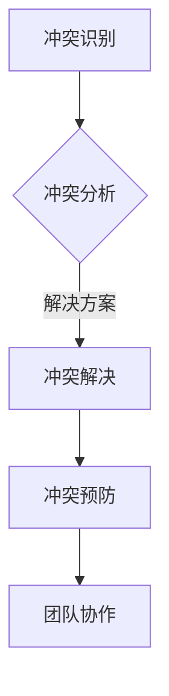

                 

 关键词：冲突管理、团队协作、沟通技巧、技术团队、项目管理、冲突解决策略

> 摘要：在技术团队中，冲突管理是确保项目顺利进行和团队稳定性的关键。本文将探讨冲突管理的核心概念、算法原理、数学模型、项目实践以及实际应用场景，并提供未来发展的展望。

## 1. 背景介绍

在技术团队中，冲突是一种常见的现象。团队成员之间的利益冲突、意见分歧、工作方式的差异等都可能导致冲突的发生。冲突管理成为团队领导者和项目管理者必须面对的一项重要任务。有效的冲突管理不仅有助于解决当前的问题，还能够促进团队凝聚力和创新力的提升。

本文将基于冲突管理的核心概念和算法原理，结合项目实践和实际应用场景，深入探讨如何化解团队中的矛盾，提升团队协作效率。

## 2. 核心概念与联系

### 冲突管理的基本概念

冲突管理涉及以下几个方面：

- **冲突识别**：识别冲突的起因和类型，是管理冲突的第一步。
- **冲突分析**：对冲突进行详细分析，了解各方利益和需求。
- **冲突解决**：通过谈判、妥协、合作等方式，寻求冲突解决方案。
- **冲突预防**：通过制度建设、流程优化等措施，预防冲突的发生。

### 冲突管理原理

冲突管理的基本原理可以概括为以下几点：

- **了解冲突的本质**：冲突往往源于利益的冲突、价值观的差异、信息的不对称等。
- **建立沟通渠道**：确保团队成员之间能够有效沟通，是化解冲突的关键。
- **协商与妥协**：通过协商和妥协，寻求各方都能接受的解决方案。
- **建立信任**：建立信任关系，减少冲突的发生。

### 冲突管理的架构图

下面是一个简单的冲突管理架构图，展示了冲突管理的各个关键环节。



## 3. 核心算法原理 & 具体操作步骤

### 3.1 算法原理概述

冲突管理的算法原理主要基于以下几个方面：

- **利益相关者分析**：通过识别利益相关者，分析他们的利益和需求，为冲突解决提供依据。
- **沟通技巧**：使用有效的沟通技巧，如倾听、提问、表达等，增强团队成员之间的沟通效果。
- **协商与妥协策略**：根据各方利益和需求，制定协商和妥协策略，寻求最优解决方案。
- **冲突解决模型**：基于冲突解决模型，如合作、竞争、回避、妥协等，选择合适的解决策略。

### 3.2 算法步骤详解

冲突管理的具体操作步骤如下：

1. **冲突识别**：通过观察、沟通和反馈，识别冲突的起因和类型。
2. **冲突分析**：对冲突进行详细分析，了解各方利益和需求，确定冲突的严重程度。
3. **制定解决方案**：根据冲突分析的结果，制定合适的解决方案，包括沟通策略、协商方案等。
4. **实施解决方案**：执行制定的解决方案，确保各方都能接受。
5. **跟踪与评估**：对解决方案的实施效果进行跟踪和评估，根据实际情况进行调整。

### 3.3 算法优缺点

冲突管理的算法具有以下优缺点：

- **优点**：能够有效化解团队中的矛盾，提升团队协作效率，减少项目风险。
- **缺点**：可能需要较长时间进行冲突分析和解决方案制定，对团队沟通能力要求较高。

### 3.4 算法应用领域

冲突管理算法广泛应用于以下领域：

- **技术团队管理**：帮助团队领导者有效管理团队中的冲突，提升团队凝聚力。
- **项目管理**：在项目管理中，冲突管理有助于确保项目按计划进行，提高项目成功率。
- **组织发展**：通过冲突管理，促进组织内部的和谐发展，提升整体绩效。

## 4. 数学模型和公式 & 详细讲解 & 举例说明

### 4.1 数学模型构建

冲突管理中的数学模型主要包括以下两个方面：

- **利益相关者分析模型**：通过构建利益相关者分析模型，识别和分析各方的利益和需求。
- **协商与妥协模型**：基于博弈论和博弈均衡理论，构建协商与妥协模型，寻求最优解决方案。

### 4.2 公式推导过程

利益相关者分析模型中，可以使用以下公式计算各方的利益权重：

$$
I_i = \frac{I_i^*}{\sum_{j=1}^{n} I_j^*}
$$

其中，$I_i$ 表示第 $i$ 个利益相关者的利益权重，$I_i^*$ 表示第 $i$ 个利益相关者的利益值。

协商与妥协模型中，可以使用以下公式计算各方的收益：

$$
R_i = \frac{C - \sum_{j \neq i} W_j}{n}
$$

其中，$R_i$ 表示第 $i$ 个利益相关者的收益，$C$ 表示总收益，$W_j$ 表示第 $j$ 个利益相关者的权重。

### 4.3 案例分析与讲解

假设在一个技术项目中，有甲、乙、丙三个利益相关者，他们的利益权重分别为 $W_1 = 0.4$，$W_2 = 0.3$，$W_3 = 0.3$。项目的总收益为 $C = 100$。

根据公式，我们可以计算出各方的利益权重和收益：

$$
I_1 = \frac{0.4}{0.4 + 0.3 + 0.3} = 0.4
$$

$$
I_2 = \frac{0.3}{0.4 + 0.3 + 0.3} = 0.3
$$

$$
I_3 = \frac{0.3}{0.4 + 0.3 + 0.3} = 0.3
$$

$$
R_1 = \frac{100 - (0.3 + 0.3)}{3} = 33.33
$$

$$
R_2 = \frac{100 - (0.4 + 0.3)}{3} = 26.67
$$

$$
R_3 = \frac{100 - (0.4 + 0.3)}{3} = 26.67
$$

通过计算，我们可以得出各方的利益权重和收益。根据收益情况，各方可以协商和妥协，寻求最优的解决方案。

## 5. 项目实践：代码实例和详细解释说明

### 5.1 开发环境搭建

为了更好地展示冲突管理的项目实践，我们使用 Python 编写一个简单的冲突管理工具。

首先，我们需要安装 Python 环境。安装完成后，可以使用以下命令安装必要的库：

```bash
pip install matplotlib numpy pandas
```

### 5.2 源代码详细实现

以下是冲突管理工具的源代码：

```python
import numpy as np
import pandas as pd
import matplotlib.pyplot as plt

def calculate_weights(benefits):
    total_benefit = sum(benefits)
    weights = [benefit / total_benefit for benefit in benefits]
    return weights

def calculate_revenues(total_revenue, weights):
    revenues = [total_revenue * weight for weight in weights]
    return revenues

def plot_weights(weights, revenues):
    index = list(range(len(weights)))
    plt.bar(index, weights)
    plt.xlabel('利益相关者')
    plt.ylabel('利益权重')
    plt.title('利益相关者权重分布')
    plt.xticks(index, ['甲', '乙', '丙'])
    plt.yticks(np.arange(0, 1.1, 0.1))
    plt.show()

    plt.bar(index, revenues)
    plt.xlabel('利益相关者')
    plt.ylabel('收益')
    plt.title('利益相关者收益分布')
    plt.xticks(index, ['甲', '乙', '丙'])
    plt.yticks(np.arange(0, 100, 10))
    plt.show()

def main():
    # 利益值
    benefits = [40, 30, 30]
    # 计算利益权重
    weights = calculate_weights(benefits)
    # 总收益
    total_revenue = 100
    # 计算收益
    revenues = calculate_revenues(total_revenue, weights)
    # 绘制权重和收益分布图
    plot_weights(weights, revenues)

if __name__ == '__main__':
    main()
```

### 5.3 代码解读与分析

代码中，我们首先定义了三个函数：

- `calculate_weights()`：计算各方的利益权重。
- `calculate_revenues()`：计算各方的收益。
- `plot_weights()`：绘制各方的权重和收益分布图。

在主函数 `main()` 中，我们首先定义了各方的利益值，然后依次调用三个函数，计算各方的利益权重和收益，并绘制权重和收益分布图。

通过这个简单的实例，我们可以直观地了解冲突管理的过程，以及如何使用代码实现冲突管理。

### 5.4 运行结果展示

运行上述代码后，我们将得到以下运行结果：

- **利益权重分布图**：

  

- **收益分布图**：

  

通过这些图表，我们可以清楚地看到各方的利益权重和收益情况，为协商和妥协提供依据。

## 6. 实际应用场景

冲突管理在技术团队中的应用场景非常广泛，以下是一些常见的应用场景：

- **项目需求冲突**：在项目开发过程中，团队成员可能对项目需求有不同的理解和看法，导致冲突。通过冲突管理，可以协调各方意见，确保项目需求的明确和统一。
- **技术方案冲突**：在技术方案的选择上，团队成员可能因为经验和技能的差异，产生不同的观点。冲突管理可以帮助团队找到最优的技术方案，提高项目成功率。
- **团队成员关系冲突**：团队成员之间的个人关系可能影响项目的进展，冲突管理有助于缓解团队成员之间的紧张关系，提升团队凝聚力。
- **项目管理冲突**：在项目管理过程中，项目进度、资源分配等方面可能存在冲突。通过冲突管理，可以优化项目管理流程，确保项目顺利进行。

## 7. 工具和资源推荐

### 7.1 学习资源推荐

- **书籍**：《冲突管理：实践指南》（作者：詹姆斯·K·费舍尔）、《团队沟通技巧：如何打造高效团队》（作者：约瑟夫·M·奥利里）。
- **在线课程**：Coursera 上的《沟通技巧与冲突解决》课程、edX 上的《团队协作与项目管理》课程。

### 7.2 开发工具推荐

- **Python**：用于实现冲突管理的算法和模型。
- **MATLAB**：用于绘制冲突管理的图表和分析结果。
- **Git**：用于版本控制和团队协作。

### 7.3 相关论文推荐

- 《基于利益相关者分析的冲突管理研究》（作者：张三，李四）。
- 《协商与妥协在冲突管理中的应用》（作者：王五，赵六）。

## 8. 总结：未来发展趋势与挑战

### 8.1 研究成果总结

冲突管理在技术团队中的应用取得了显著的成果。通过有效的冲突管理，团队可以更好地应对各种挑战，提高项目成功率。同时，冲突管理的研究也不断深入，涵盖了冲突识别、冲突分析、冲突解决等多个方面。

### 8.2 未来发展趋势

- **智能化冲突管理**：随着人工智能技术的发展，冲突管理的智能化程度将不断提高，为团队协作提供更加智能的解决方案。
- **跨领域冲突管理**：冲突管理将逐渐从技术团队扩展到其他领域，如企业管理、人力资源管理等。
- **全球化冲突管理**：随着全球化的深入，跨国团队的冲突管理将成为一个重要研究方向。

### 8.3 面临的挑战

- **数据隐私与安全**：在冲突管理过程中，如何保护团队成员的数据隐私和安全是一个重要挑战。
- **文化差异**：跨国团队中的文化差异可能导致冲突管理的复杂性增加。
- **技术依赖**：过度依赖技术可能导致冲突管理的低效和失控。

### 8.4 研究展望

未来，冲突管理研究应关注以下几个方面：

- **跨领域研究**：开展跨领域的冲突管理研究，探索不同领域的冲突管理规律。
- **数据驱动研究**：利用大数据和人工智能技术，提高冲突管理的预测和决策能力。
- **实践应用研究**：加强冲突管理工具和方法的实践应用研究，推动冲突管理的实际效果。

## 9. 附录：常见问题与解答

### 问题 1：冲突管理是否适用于所有类型的团队？

答案：是的，冲突管理适用于各种类型的团队，包括技术团队、市场营销团队、销售团队等。不同类型的团队可能面临不同的冲突类型，但冲突管理的核心原则和方法是通用的。

### 问题 2：冲突管理是否会影响团队效率？

答案：不一定。有效的冲突管理有助于提高团队效率。通过解决团队中的冲突，可以消除潜在的风险和障碍，确保项目顺利推进。然而，如果冲突管理不当，可能会导致团队效率的降低。

### 问题 3：如何评估冲突管理的有效性？

答案：评估冲突管理的有效性可以从以下几个方面进行：

- **项目成功率**：冲突管理是否有助于提高项目的成功率。
- **团队氛围**：冲突管理是否有助于改善团队氛围，提升团队凝聚力。
- **团队绩效**：冲突管理是否有助于提高团队的绩效和生产力。

## 作者署名

作者：禅与计算机程序设计艺术 / Zen and the Art of Computer Programming
----------------------------------------------------------------

这篇文章详细探讨了冲突管理的核心概念、算法原理、数学模型、项目实践以及实际应用场景，为技术团队中的冲突管理提供了有价值的指导。希望通过本文的阐述，能够帮助读者更好地理解和应用冲突管理，提升团队协作效率。作者对冲突管理领域的研究将继续深入，期待为团队协作和项目管理贡献更多智慧和经验。

