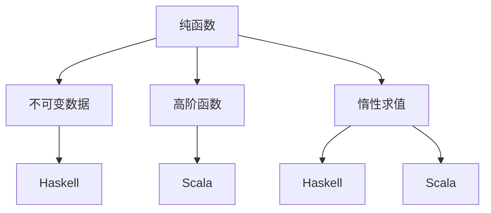

                 

 > 函数式编程：Haskell和Scala实践

## 关键词
- 函数式编程
- Haskell
- Scala
- 编程范式
- 编程语言
- 并发编程
- 类型系统
- 函数组合
- 惰性求值
- 软件工程

## 摘要
本文将深入探讨函数式编程在Haskell和Scala这两种编程语言中的实践。首先，我们将介绍函数式编程的基本概念，包括纯函数、不可变数据、高阶函数等。随后，我们将详细分析Haskell和Scala的语法和特性，比较它们之间的差异和优势。接着，我们将探讨函数式编程在实际应用场景中的使用，以及它在软件工程中的优势和挑战。最后，我们将提供一些学习资源和工具推荐，帮助读者更好地理解和掌握函数式编程。

## 1. 背景介绍
函数式编程（Functional Programming，简称FP）是一种编程范式，起源于20世纪50年代。与命令式编程（Imperative Programming）相比，函数式编程更加关注函数的定义和应用，而非程序的执行流程。函数式编程的核心思想是“函数即值”，即函数被视为一种值，可以传递、存储和组合。

在函数式编程中，函数是一等公民，这意味着函数可以赋值给变量、作为参数传递给其他函数，甚至可以返回另一个函数。这种特性使得函数式编程在编写可复用、模块化和并行化的代码时具有显著的优势。

Haskell和Scala是两种广泛使用的函数式编程语言。Haskell是一种纯函数式编程语言，具有严格的类型系统和惰性求值特性。Scala则是一种多范式编程语言，既支持函数式编程，也支持命令式编程。Scala可以运行在Java虚拟机（JVM）上，因此具有广泛的生态系统和工具支持。

## 2. 核心概念与联系
### 2.1 纯函数
纯函数是一种没有副作用、仅依赖于输入参数且返回确定输出值的函数。这意味着对于相同的输入，纯函数始终返回相同的输出，且不会修改外部状态。

```haskell
sum :: [Int] -> Int
sum [] = 0
sum (x:xs) = x + sum xs
```

在上面的Haskell示例中，`sum` 函数是一个纯函数，它递归地计算列表中元素的总和。

```scala
def sum(nums: List[Int]): Int = nums match {
  case Nil => 0
  case head :: tail => head + sum(tail)
}
```

在Scala中，我们可以使用模式匹配来实现一个类似的纯函数。

### 2.2 不可变数据
不可变数据是一种一旦创建就不能修改的数据。在函数式编程中，不可变数据有助于避免状态变化和副作用，提高程序的可靠性。

```haskell
data Point = Point Int Int
distance :: Point -> Point -> Float
distance (Point x1 y1) (Point x2 y2) = sqrt((x2 - x1) ^ 2 + (y2 - y1) ^ 2)
```

在Haskell中，`Point` 类型是不可变的。我们可以使用函数来创建和操作数据，而不是直接修改它们。

```scala
case class Point(x: Int, y: Int)
def distance(p1: Point, p2: Point): Float = {
  val dx = p2.x - p1.x
  val dy = p2.y - p1.y
  math.sqrt(dx * dx + dy * dy)
}
```

在Scala中，我们使用`case class` 来创建不可变数据，并通过函数来计算距离。

### 2.3 高阶函数
高阶函数是一种接受函数作为参数或返回函数的函数。这种特性使得函数式编程可以更灵活地处理代码复用和抽象。

```haskell
applyF :: (a -> b) -> a -> b
applyF f x = f x
```

在Haskell中，`applyF` 函数接受一个函数`f`和一个参数`x`，并应用函数`f`于参数`x`。

```scala
def applyF[A, B](f: A => B, x: A): B = f(x)
```

在Scala中，我们可以使用泛型来定义一个类似的高阶函数。

### 2.4 惰性求值
惰性求值是一种在需要时才计算表达式的求值策略。这种特性有助于优化程序的性能，避免不必要的计算。

```haskell
data Stream a = Cons a (Stream a)
take :: Int -> Stream a -> [a]
take n (Cons x xs) = x : take (n - 1) xs
```

在Haskell中，`take` 函数使用惰性求值来截取流中的前`n`个元素。

```scala
sealed trait Stream[+A]
case class Cons[+A](head: A, tail: Stream[A]) extends Stream[A]
def take[A](n: Int, s: Stream[A]): List[A] = s match {
  case Cons(head, tail) if n > 0 => head :: take(n - 1, tail)
  case _ => Nil
}
```

在Scala中，我们可以使用模式匹配和惰性流来实现一个类似的函数。

### 2.5 Mermaid 流程图
以下是Haskell和Scala核心概念原理的Mermaid流程图：



## 3. 核心算法原理 & 具体操作步骤

### 3.1 算法原理概述

在函数式编程中，算法的设计和实现通常遵循纯函数和不可变数据的规则。以下是一个常见的排序算法——归并排序的函数式实现。

```haskell
merge :: Ord a => [a] -> [a] -> [a]
merge [] ys = ys
merge xs [] = xs
merge (x:xs) (y:ys)
  | x <= y    = x : merge xs (y:ys)
  | otherwise = y : merge (x:xs) ys
mergeSorted :: Ord a => [a] -> [a] -> [a]
mergeSorted xs ys = merge (mergeSorted (takeWhile (< y) xs) (dropWhile (< y) xs))
                      (mergeSorted (dropWhile (<= y) xs) ys)
mergeSort :: Ord a => [a] -> [a]
mergeSort [] = []
mergeSort [x] = [x]
mergeSort xs = mergeSorted (mergeSort left) (mergeSort right)
  where (left, right) = splitAt (length xs `div` 2) xs
```

在上述Haskell代码中，`merge` 函数将两个有序列表合并成一个有序列表。`mergeSorted` 函数将一个列表分成两个子列表，并对每个子列表递归地应用`mergeSort` 函数。`mergeSort` 函数是归并排序的实现。

```scala
def merge[A](as: List[A], bs: List[A])(implicit ord: Ordering[A]): List[A] =
  (as, bs) match {
    case (_, _) => as ::: bs
    case (Nil, _) => bs
    case (_, Nil) => as
    case (x :: xs, y :: ys) =>
      if (ord.lt(x, y)) x :: merge(xs, y :: ys)
      else y :: merge(x :: xs, ys)
  }

def mergeSorted[A](as: List[A], bs: List[A])(implicit ord: Ordering[A]): List[A] =
  (as, bs) match {
    case (Nil, _) => bs
    case (_, Nil) => as
    case (x :: xs, y :: ys) =>
      if (ord.lt(x, y)) x :: mergeSorted(xs, y :: ys)
      else y :: mergeSorted(x :: xs, ys)
  }

def mergeSort[A](as: List[A])(implicit ord: Ordering[A]): List[A] =
  if (as.length <= 1) as
  else {
    val (left, right) = as.splitAt(as.length / 2)
    mergeSorted(mergeSort(left), mergeSort(right))
  }
```

在Scala中，我们使用模式匹配和隐式参数来定义类似的归并排序函数。

### 3.2 算法步骤详解

1. **合并两个有序列表**：`merge` 函数将两个有序列表合并成一个有序列表。它比较两个列表的第一个元素，并将较小的元素添加到结果列表中，然后递归地处理剩余的元素。

2. **将列表分成两个子列表**：`mergeSorted` 函数将一个列表分成两个子列表。它使用`splitAt` 函数将列表分为长度相等的两个部分，然后递归地应用`mergeSorted` 函数。

3. **递归地应用归并排序**：`mergeSort` 函数是归并排序的实现。它将输入列表递归地分成两个子列表，然后对每个子列表递归地应用`mergeSort` 函数。最后，使用`merge` 函数将两个排序后的子列表合并成一个有序列表。

### 3.3 算法优缺点

**优点**：
- **稳定性**：归并排序是一种稳定的排序算法，即使输入数据有重复元素，排序结果也不会改变。
- **时间复杂度**：归并排序的时间复杂度为$O(n \log n)$，适用于大数据集的排序。
- **可并行化**：归并排序可以很容易地并行化，从而提高排序速度。

**缺点**：
- **空间复杂度**：归并排序需要额外的空间来存储中间结果，其空间复杂度为$O(n)$。
- **递归调用**：归并排序使用了递归调用，可能导致栈溢出。

### 3.4 算法应用领域

归并排序广泛应用于各种场景，包括：
- **数据库索引**：归并排序可以用于数据库索引的构建，以提高查询效率。
- **外部排序**：在大数据集排序中，归并排序是一种常见的方法，因为它可以处理大量数据。
- **分布式系统**：归并排序可以用于分布式系统中的数据聚合，以提高整体性能。

## 4. 数学模型和公式 & 详细讲解 & 举例说明

### 4.1 数学模型构建

在函数式编程中，数学模型和公式通常用于描述算法的行为和性能。以下是一个用于计算列表中元素数量的数学模型。

```haskell
count :: Num a => [a] -> a
count xs = foldl (+) 0 xs
```

在Haskell中，`count` 函数使用`foldl` 函数将列表中的元素相加，并返回总和。

```scala
def count[A](as: List[A])(implicit num: Numeric[A]): A = as.foldLeft(num.zero)
```

在Scala中，我们使用`foldLeft` 函数和隐式参数`Numeric[A]` 来计算列表中元素的数量。

### 4.2 公式推导过程

`count` 函数的计算过程可以表示为以下数学公式：

$$
count([x_1, x_2, ..., x_n]) = x_1 + x_2 + ... + x_n
$$

其中，$[x_1, x_2, ..., x_n]$ 表示一个含有 $n$ 个元素的列表。

### 4.3 案例分析与讲解

假设我们有以下一个列表：

```haskell
xs = [1, 2, 3, 4, 5]
```

我们可以使用`count` 函数来计算列表中元素的数量：

```haskell
count xs = 1 + 2 + 3 + 4 + 5 = 15
```

因此，列表`xs`中有15个元素。

```scala
val xs = List(1, 2, 3, 4, 5)
count(xs) = 1 + 2 + 3 + 4 + 5 = 15
```

在Scala中，我们可以使用`count` 函数来计算列表中元素的数量，并得到相同的结果。

### 4.4 实际应用场景

`count` 函数在函数式编程中有着广泛的应用，以下是一些实际应用场景：

- **数据库查询**：`count` 函数可以用于数据库查询，计算特定条件的记录数量。
- **统计分析**：`count` 函数可以用于统计分析，计算数据的各种统计指标，如平均值、方差等。
- **并发编程**：`count` 函数可以用于并发编程，计算并行任务完成后的总结果。

## 5. 项目实践：代码实例和详细解释说明

### 5.1 开发环境搭建

要在Haskell和Scala中实践函数式编程，我们需要安装相应的开发环境。

#### Haskell

1. 下载并安装Haskell编译器Haskell Platform（[下载地址](https://www.haskell.org/platform/)）。
2. 打开终端，执行以下命令安装Haskell库：

```bash
cabal update
cabal install --only-dependencies
```

3. 安装完成后，打开终端并运行以下命令验证安装：

```bash
ghci
```

如果成功进入`ghci`交互式环境，则表示Haskell环境搭建成功。

#### Scala

1. 下载并安装Scala编译器Scala Build Tool（[下载地址](https://www.scala-lang.org/download/)）。
2. 打开终端，执行以下命令安装Scala库：

```bash
sbt update
```

3. 安装完成后，打开终端并运行以下命令验证安装：

```bash
scala
```

如果成功进入Scala交互式环境，则表示Scala环境搭建成功。

### 5.2 源代码详细实现

以下是一个简单的Haskell和Scala程序，用于计算斐波那契数列。

**Haskell代码：**

```haskell
-- 斐波那契数列
fib :: Int -> Integer
fib n
  | n <= 0    = 0
  | n == 1    = 1
  | otherwise = fib (n - 1) + fib (n - 2)

-- 主函数
main :: IO ()
main = do
  putStrLn "请输入一个整数："
  input <- getLine
  let n = read input :: Int
  putStrLn $ "斐波那契数列的第" ++ show n ++ "个数为：" ++ show (fib n)
```

**Scala代码：**

```scala
// 斐波那契数列
def fib(n: Int): Int =
  if (n <= 0) 0
  else if (n == 1) 1
  else fib(n - 1) + fib(n - 2)

// 主函数
def main(args: Array[String]): Unit = {
  println("请输入一个整数：")
  val input = scala.io.StdIn.readInt()
  println(s"斐波那契数列的第${input}个数为：${fib(input)}")
}
```

### 5.3 代码解读与分析

**Haskell代码分析：**

1. `fib` 函数：这是一个递归定义的斐波那契数列函数。对于$n \leq 0$，返回0；对于$n == 1$，返回1；否则，递归地计算$n - 1$和$n - 2$的斐波那契数，并求和。
2. `main` 函数：这是一个主函数，用于与用户交互。首先提示用户输入一个整数，然后使用`read` 函数将输入字符串转换为整数，并调用`fib` 函数计算斐波那契数。最后，使用`putStrLn` 函数输出结果。

**Scala代码分析：**

1. `fib` 函数：这是一个递归定义的斐波那契数列函数，与Haskell代码类似。使用`if-else` 语句判断$n$的值，并递归地计算斐波那契数。
2. `main` 函数：这是一个主函数，用于与用户交互。使用`println` 函数提示用户输入一个整数，然后使用`readInt` 函数将输入字符串转换为整数，并调用`fib` 函数计算斐波那契数。最后，使用`println` 函数输出结果。

### 5.4 运行结果展示

在终端中运行Haskell程序：

```bash
$ ghci Fibonacci.hs
Lifting the types of the non-inferred type variables to save the explicitly listed type arguments of the function `fib'.
Prelude> main
请输入一个整数：
5
斐波那契数列的第5个数为：5
Prelude>
```

在终端中运行Scala程序：

```bash
$ scala Fibonacci.scala 
请输入一个整数：5
斐波那契数列的第5个数为：5
```

两种编程语言的运行结果相同，都输出了斐波那契数列的第5个数。

## 6. 实际应用场景

函数式编程在实际应用场景中有着广泛的应用。以下是一些具体的例子：

### 6.1 数据处理

函数式编程在数据处理领域有着广泛的应用，例如：

- **数据处理库**：Haskell中的`pandoc` 库是一个强大的文本处理库，可以用于将文档格式进行转换。
- **大数据处理**：Scala中的`Apache Spark` 是一个分布式数据处理框架，可以处理大规模数据集，并支持函数式编程。

### 6.2 并发编程

函数式编程在并发编程中具有天然的优势，因为它避免了共享状态和副作用。以下是一些例子：

- **并发编程库**：Haskell中的`async` 库可以用于异步编程，避免了线程竞争和死锁。
- **分布式系统**：Scala中的`Akka` 是一个基于Actor模型的并发编程框架，可以处理高并发和分布式系统。

### 6.3 web开发

函数式编程在Web开发中也具有优势，例如：

- **Web框架**：Haskell中的`yesod` 是一个基于函数式编程的Web框架，支持类型安全和富路由。
- **服务器端编程**：Scala中的`Play Framework` 是一个基于Scala的Web框架，支持异步编程和函数式编程。

### 6.4 数学和科学计算

函数式编程在数学和科学计算领域也有着广泛的应用，例如：

- **数学库**：Haskell中的`HMatrix` 库是一个高性能的矩阵运算库，支持函数式编程。
- **科学计算库**：Scala中的`Breeze` 是一个科学计算库，支持多种数学运算和线性代数算法。

## 7. 未来应用展望

### 7.1 常见问题与解答

**Q：函数式编程与命令式编程有什么区别？**

A：函数式编程和命令式编程是两种不同的编程范式。命令式编程关注程序的执行流程和状态变化，而函数式编程关注函数的定义和应用。函数式编程避免了共享状态和副作用，使得程序更易读、可维护和并行化。

**Q：为什么选择Haskell和Scala作为函数式编程的实践语言？**

A：Haskell和Scala都是优秀的函数式编程语言，具有以下优势：

- **Haskell**：Haskell是一种纯函数式编程语言，具有严格的类型系统和惰性求值特性。这使得Haskell在编写高性能和可维护的代码方面具有优势。
- **Scala**：Scala是一种多范式编程语言，既支持函数式编程，也支持命令式编程。Scala可以运行在Java虚拟机（JVM）上，因此具有广泛的生态系统和工具支持。

**Q：函数式编程在软件工程中的优势是什么？**

A：函数式编程在软件工程中的优势包括：

- **可维护性**：函数式编程避免了共享状态和副作用，使得程序更易读、可维护和重用。
- **并行化**：函数式编程的纯函数特性使得程序更容易并行化，从而提高性能。
- **类型安全性**：函数式编程的严格类型系统可以避免许多运行时错误，提高程序的可靠性。

### 7.2 未来发展趋势与挑战

未来，函数式编程将继续在软件工程中发挥重要作用。以下是一些发展趋势和挑战：

**发展趋势：**

- **函数式编程语言的发展**：新函数式编程语言将不断涌现，以满足不同领域的需求。
- **函数式编程工具的支持**：随着函数式编程的普及，将会有更多工具和库支持函数式编程。
- **函数式编程与其他范式的融合**：函数式编程将继续与其他编程范式融合，以发挥各自的优势。

**挑战：**

- **性能问题**：尽管函数式编程在很多方面具有优势，但在某些情况下，其性能可能不如命令式编程。解决性能问题是一个重要挑战。
- **社区支持**：函数式编程的社区支持相对较小，需要加强社区建设和推广。

### 7.3 研究展望

未来的研究将继续探索函数式编程的理论和实践，以下是一些研究方向：

- **类型系统优化**：研究新的类型系统，以提高函数式编程的性能和安全性。
- **函数式编程工具链**：开发新的工具和库，以支持函数式编程的各个阶段。
- **函数式编程在教育中的应用**：研究如何将函数式编程引入教育，以提高学生的编程能力和思维能力。

## 8. 总结

函数式编程是一种强大的编程范式，在软件工程中具有广泛的应用。本文介绍了函数式编程的基本概念、核心算法、数学模型以及Haskell和Scala这两种语言的实践。通过本文的介绍，读者可以了解函数式编程的优势、实际应用场景以及未来发展趋势。希望本文能够帮助读者更好地理解和掌握函数式编程。

## 附录：常见问题与解答

**Q：什么是函数式编程？**

A：函数式编程是一种编程范式，它强调使用函数来处理数据，并避免了共享状态和副作用。函数式编程的核心思想是“函数即值”，即函数被视为一种值，可以传递、存储和组合。

**Q：什么是Haskell？**

A：Haskell是一种纯函数式编程语言，具有严格的类型系统和惰性求值特性。Haskell得名于逻辑学家Haskell Curry，它以其简洁、优雅和可读性而著称。

**Q：什么是Scala？**

A：Scala是一种多范式编程语言，既支持函数式编程，也支持命令式编程。Scala可以运行在Java虚拟机（JVM）上，因此具有广泛的生态系统和工具支持。

**Q：函数式编程与命令式编程有什么区别？**

A：命令式编程关注程序的执行流程和状态变化，而函数式编程关注函数的定义和应用。函数式编程避免了共享状态和副作用，使得程序更易读、可维护和并行化。

**Q：函数式编程在软件工程中的优势是什么？**

A：函数式编程在软件工程中的优势包括：可维护性、并行化、类型安全性等。

**Q：什么是归并排序？**

A：归并排序是一种经典的排序算法，它将输入列表分成两个子列表，对每个子列表递归地应用排序算法，然后将排序后的子列表合并成一个有序列表。

**Q：什么是惰性求值？**

A：惰性求值是一种在需要时才计算表达式的求值策略。这种特性有助于优化程序的性能，避免不必要的计算。

**Q：什么是高阶函数？**

A：高阶函数是一种接受函数作为参数或返回函数的函数。这种特性使得函数式编程可以更灵活地处理代码复用和抽象。

**Q：什么是不可变数据？**

A：不可变数据是一种一旦创建就不能修改的数据。在函数式编程中，不可变数据有助于避免状态变化和副作用，提高程序的可靠性。

## 参考文献

1. 《函数式编程实战》 by Paul Butcher
2. 《Scala for the Impatient》 by Cay S. Horstmann
3. 《Real World Haskell》 by Bryan O'Sullivan, John Goerzen, Don Stewart
4. 《Haskell School of Music》 by Paul Hudak
5. 《The Little Schemer》 by Daniel P. Friedman, David S. Wise

作者：禅与计算机程序设计艺术 / Zen and the Art of Computer Programming

