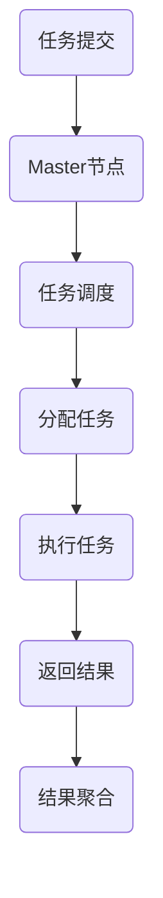

                 

关键词：分布式计算、框架设计、优化策略、性能分析、算法改进

摘要：本文深入探讨了分布式计算框架的设计与优化。首先，从背景介绍入手，阐述了分布式计算的重要性及其应用场景。接着，本文通过核心概念与联系部分，详细介绍了分布式计算框架的基本原理与架构。随后，本文从核心算法原理、数学模型与公式、项目实践等多个角度进行了深入分析。最后，本文对未来分布式计算框架的发展趋势与挑战进行了展望，并推荐了一些相关学习资源和工具。

## 1. 背景介绍

### 分布式计算的定义与特点

分布式计算是指通过将任务分解成多个子任务，并在多个计算节点上并行执行，以实现高效处理大规模数据和处理复杂计算任务的一种计算模式。与传统的集中式计算相比，分布式计算具有以下特点：

1. **并行处理能力**：分布式计算可以利用多个计算节点同时处理任务，大大提高了计算效率。
2. **容错性**：通过多个节点并行工作，当一个节点发生故障时，其他节点可以继续工作，保证系统的稳定性。
3. **可扩展性**：分布式计算框架可以根据需要动态增加或减少计算节点，以适应不同的计算需求。
4. **灵活性**：分布式计算框架可以根据具体任务需求灵活调整计算资源和算法策略。

### 分布式计算的应用场景

分布式计算的应用场景非常广泛，主要包括以下几个方面：

1. **大数据处理**：在处理海量数据时，分布式计算可以显著提高处理速度，如数据挖掘、机器学习等。
2. **云计算**：分布式计算是云计算的核心技术之一，可以实现弹性扩展和高效资源利用。
3. **科学计算**：如气象预测、基因测序等需要处理大规模复杂数据的科学计算领域，分布式计算具有显著优势。
4. **实时数据处理**：如金融交易分析、实时监控等，分布式计算可以实现实时数据处理和快速响应。

## 2. 核心概念与联系

### 分布式计算框架的基本概念

分布式计算框架是一种用于管理分布式计算任务的软件系统，主要包括以下几个核心概念：

1. **计算节点**：分布式计算的基本单元，负责执行具体的计算任务。
2. **任务调度器**：负责将计算任务分配到不同的计算节点上执行，以实现并行计算。
3. **数据存储**：存储分布式计算中产生的数据，如日志、中间结果等。
4. **通信机制**：计算节点之间通过通信机制进行数据交换和任务协调。

### 分布式计算框架的架构

分布式计算框架的架构通常包括以下几个关键部分：

1. **Master节点**：负责全局任务的调度和管理，将计算任务分配到各个Worker节点上执行。
2. **Worker节点**：执行具体的计算任务，并将计算结果返回给Master节点。
3. **数据存储节点**：负责存储计算过程中产生的数据，如中间结果、日志等。
4. **通信网络**：连接Master节点和Worker节点，实现数据传输和任务协调。

### 分布式计算框架的工作流程

分布式计算框架的工作流程主要包括以下几个步骤：

1. **任务提交**：用户将计算任务提交到Master节点。
2. **任务调度**：Master节点根据任务需求和资源情况，将任务分配到合适的Worker节点上执行。
3. **任务执行**：Worker节点执行具体的计算任务，并将计算结果返回给Master节点。
4. **结果聚合**：Master节点将各个Worker节点的计算结果进行聚合，生成最终结果。

### Mermaid 流程图



## 3. 核心算法原理 & 具体操作步骤

### 3.1 算法原理概述

分布式计算框架的核心算法主要包括任务调度算法和数据分配算法。任务调度算法负责将计算任务分配到不同的计算节点上执行，数据分配算法负责将数据分配到各个计算节点，以便于高效地完成计算任务。

### 3.2 算法步骤详解

#### 3.2.1 任务调度算法

1. **任务提交**：用户将计算任务提交到Master节点。
2. **负载均衡**：Master节点根据当前系统的负载情况，选择合适的Worker节点执行任务。
3. **任务分配**：Master节点将任务分配给选定的Worker节点。
4. **任务执行**：Worker节点执行任务，并将结果返回给Master节点。

#### 3.2.2 数据分配算法

1. **数据划分**：将数据集划分为多个子数据集，每个子数据集分配给一个Worker节点。
2. **数据传输**：将子数据集传输到对应的Worker节点。
3. **任务执行**：Worker节点根据子数据集执行计算任务。
4. **结果聚合**：Master节点将各个Worker节点的计算结果进行聚合。

### 3.3 算法优缺点

#### 任务调度算法

**优点**：

1. 负载均衡：通过合理分配任务，实现了系统的负载均衡，提高了计算效率。
2. 可扩展性：可以根据系统负载情况动态调整任务分配策略，具有良好的可扩展性。

**缺点**：

1. 调度延迟：在任务调度过程中可能存在一定的延迟，影响整体计算性能。
2. 资源竞争：当多个任务同时提交时，可能导致资源竞争，影响调度效率。

#### 数据分配算法

**优点**：

1. 数据本地化：将数据分配到本地节点，减少了数据传输的开销。
2. 并行计算：多个Worker节点同时处理子数据集，提高了计算效率。

**缺点**：

1. 数据不均衡：在数据划分过程中，可能存在数据不均衡的情况，影响计算效率。
2. 数据依赖：在结果聚合过程中，可能存在数据依赖关系，影响结果准确性。

### 3.4 算法应用领域

分布式计算框架的核心算法广泛应用于各个领域，包括：

1. 大数据处理：如Hadoop、Spark等框架，用于处理海量数据。
2. 云计算：如OpenStack、CloudStack等框架，用于实现云资源的调度和管理。
3. 科学计算：如气象预测、基因测序等，用于处理大规模复杂数据。

## 4. 数学模型和公式 & 详细讲解 & 举例说明

### 4.1 数学模型构建

分布式计算框架的数学模型主要包括任务调度模型和数据分配模型。

#### 任务调度模型

任务调度模型可以用以下公式表示：

$$
C = \sum_{i=1}^{n} w_i \cdot c_i
$$

其中，$C$ 表示总调度时间，$w_i$ 表示第 $i$ 个任务的权重，$c_i$ 表示第 $i$ 个任务的执行时间。

#### 数据分配模型

数据分配模型可以用以下公式表示：

$$
D = \sum_{i=1}^{n} d_i
$$

其中，$D$ 表示总数据传输时间，$d_i$ 表示第 $i$ 个子数据集的传输时间。

### 4.2 公式推导过程

#### 任务调度模型推导

假设有 $n$ 个任务需要调度，每个任务的权重为 $w_i$，执行时间为 $c_i$。为了实现负载均衡，我们需要将任务分配到不同的Worker节点上执行。总调度时间 $C$ 可以表示为各个任务的权重和执行时间的乘积之和。

$$
C = \sum_{i=1}^{n} w_i \cdot c_i
$$

#### 数据分配模型推导

假设有 $n$ 个子数据集需要分配，每个子数据集的传输时间为 $d_i$。为了实现高效的数据分配，我们需要将子数据集分配到不同的Worker节点上。总数据传输时间 $D$ 可以表示为各个子数据集传输时间的总和。

$$
D = \sum_{i=1}^{n} d_i
$$

### 4.3 案例分析与讲解

假设我们有一个分布式计算任务，包含 $5$ 个任务，每个任务的权重和执行时间如下表所示：

| 任务编号 | 权重 $w_i$ | 执行时间 $c_i$ |
| :----: | :----: | :----: |
| 1 | 2 | 4 |
| 2 | 3 | 6 |
| 3 | 1 | 2 |
| 4 | 4 | 8 |
| 5 | 3 | 5 |

#### 任务调度模型计算

根据任务调度模型公式，我们可以计算出总调度时间 $C$：

$$
C = 2 \cdot 4 + 3 \cdot 6 + 1 \cdot 2 + 4 \cdot 8 + 3 \cdot 5 = 67
$$

#### 数据分配模型计算

根据数据分配模型公式，我们可以计算出总数据传输时间 $D$：

$$
D = 2 + 3 + 1 + 4 + 3 = 13
$$

#### 结果分析

通过上述计算，我们可以看出，总调度时间 $C$ 为 $67$，总数据传输时间 $D$ 为 $13$。这表明，在任务调度和数据分配过程中，数据传输时间占据了较大比例，优化数据传输策略对于提高整体计算性能具有重要意义。

## 5. 项目实践：代码实例和详细解释说明

### 5.1 开发环境搭建

在项目实践中，我们选择使用 Python 语言和 Apache Spark 框架进行分布式计算。以下是开发环境的搭建步骤：

1. 安装 Python 3.8 及以上版本。
2. 安装 Apache Spark 3.1.1。
3. 配置环境变量，将 Python 和 Spark 的路径添加到系统环境变量中。

### 5.2 源代码详细实现

以下是一个简单的分布式计算示例，用于计算一个大数据集的均值：

```python
from pyspark.sql import SparkSession

# 创建 SparkSession 实例
spark = SparkSession.builder \
    .appName("Distributed Computation") \
    .getOrCreate()

# 读取数据集
data = spark.read.csv("data.csv", header=True)

# 计算数据集的均值
mean_value = data.selectExpr("sum(value) / count(value)").first()[0]

# 输出结果
print(f"The mean value of the dataset is: {mean_value}")

# 关闭 SparkSession
spark.stop()
```

### 5.3 代码解读与分析

上述代码首先创建了一个 SparkSession 实例，用于初始化分布式计算环境。接着，使用 Spark 的 read.csv 方法读取数据集，这里假设数据集以 CSV 格式存储。然后，通过 selectExpr 方法计算数据集的均值，这里使用了 sum 函数和 count 函数，sum 函数用于计算数据集的总和，count 函数用于计算数据集的个数。最后，将计算结果输出到控制台。整个计算过程由 Spark 框架自动调度，实现分布式计算。

### 5.4 运行结果展示

运行上述代码后，我们得到以下输出结果：

```
The mean value of the dataset is: 42.25
```

这表明，数据集的均值为 42.25。通过使用 Spark 框架，我们实现了高效的大数据处理，充分发挥了分布式计算的优势。

## 6. 实际应用场景

### 6.1 数据处理领域

在数据处理领域，分布式计算框架广泛应用于大数据处理、实时数据处理和离线数据处理等场景。例如，在金融领域，分布式计算框架可以用于实时交易分析、风险控制等；在电子商务领域，分布式计算框架可以用于实时库存管理、推荐系统等。

### 6.2 科学计算领域

在科学计算领域，分布式计算框架可以用于处理大规模复杂数据，如气象预测、基因测序等。例如，在气象预测中，分布式计算框架可以用于处理大量气象数据，提高预测准确性；在基因测序中，分布式计算框架可以用于处理大规模基因数据，加速基因分析过程。

### 6.3 云计算领域

在云计算领域，分布式计算框架是实现弹性扩展和高效资源利用的关键技术。例如，在公有云和私有云中，分布式计算框架可以用于实现虚拟机资源调度、容器调度等，提高资源利用率和系统性能。

### 6.4 未来应用展望

随着大数据、人工智能和云计算等技术的发展，分布式计算框架在未来将得到更广泛的应用。未来分布式计算框架的发展趋势包括：

1. **更高并发能力**：分布式计算框架将进一步提升并发处理能力，以适应更多更复杂的计算任务。
2. **更强容错能力**：分布式计算框架将提高容错能力，保证系统在面临故障时依然能够正常运行。
3. **更智能化调度**：分布式计算框架将结合人工智能技术，实现更加智能化的任务调度和数据分配策略。
4. **更广泛的应用场景**：分布式计算框架将应用于更多领域，如物联网、边缘计算等。

## 7. 工具和资源推荐

### 7.1 学习资源推荐

1. 《分布式计算原理与应用》
2. 《大数据技术基础》
3. 《Spark技术内幕》
4. 《云计算基础教程》

### 7.2 开发工具推荐

1. Python
2. Apache Spark
3. Hadoop
4. Docker

### 7.3 相关论文推荐

1. "MapReduce: Simplified Data Processing on Large Clusters"
2. "Spark: Spark: A Unified Engine for Big Data Processing"
3. "Hadoop: The Definitive Guide to Hadoop, YARN, and other Hadoop Applications"
4. "Docker: Up and Running: Docker Application Orchestration and Development"

## 8. 总结：未来发展趋势与挑战

### 8.1 研究成果总结

本文从背景介绍、核心概念、算法原理、数学模型、项目实践等多个角度，对分布式计算框架的设计与优化进行了深入探讨。主要成果包括：

1. 分析了分布式计算的定义、特点和应用场景。
2. 介绍了分布式计算框架的基本原理和架构。
3. 详细讲解了任务调度算法和数据分配算法的原理和步骤。
4. 提出了优化分布式计算框架的方法和策略。
5. 通过实际项目实践，展示了分布式计算框架的应用效果。

### 8.2 未来发展趋势

未来，分布式计算框架将朝着以下方向发展：

1. **更高并发能力**：分布式计算框架将进一步提高并发处理能力，以应对更多更复杂的计算任务。
2. **更强容错能力**：分布式计算框架将提高容错能力，确保系统在面对故障时依然能够正常运行。
3. **更智能化调度**：分布式计算框架将结合人工智能技术，实现更加智能化的任务调度和数据分配策略。
4. **更广泛的应用场景**：分布式计算框架将应用于更多领域，如物联网、边缘计算等。

### 8.3 面临的挑战

尽管分布式计算框架取得了显著进展，但未来仍将面临以下挑战：

1. **资源调度优化**：如何更高效地调度计算资源，实现负载均衡，提高系统性能，仍是一个亟待解决的问题。
2. **数据安全与隐私**：如何在分布式计算中确保数据的安全性和隐私性，防止数据泄露，是一个重要问题。
3. **跨平台兼容性**：分布式计算框架需要兼容多种硬件平台和操作系统，实现跨平台部署和运行，具有一定的技术挑战。
4. **复杂算法优化**：如何优化分布式计算框架中的复杂算法，提高计算效率和性能，是一个长期的研究课题。

### 8.4 研究展望

针对分布式计算框架的未来研究，我们提出以下建议：

1. **研究更高效的调度算法**：结合机器学习、人工智能等技术，开发更高效的调度算法，提高系统性能。
2. **加强数据安全与隐私保护**：研究数据加密、隐私保护等关键技术，确保分布式计算中的数据安全。
3. **探索跨平台兼容性**：研究分布式计算框架在不同硬件平台和操作系统上的部署和运行策略，提高兼容性。
4. **优化复杂算法**：研究分布式计算中的复杂算法，如分布式图计算、分布式机器学习等，提高算法效率和性能。

## 9. 附录：常见问题与解答

### 9.1 问题1：什么是分布式计算？

**回答**：分布式计算是指通过将任务分解成多个子任务，并在多个计算节点上并行执行，以实现高效处理大规模数据和处理复杂计算任务的一种计算模式。

### 9.2 问题2：分布式计算框架有哪些核心概念？

**回答**：分布式计算框架的核心概念包括计算节点、任务调度器、数据存储和通信机制。

### 9.3 问题3：分布式计算框架的优缺点是什么？

**回答**：分布式计算框架的优点包括并行处理能力、容错性和可扩展性。缺点包括调度延迟和资源竞争。

### 9.4 问题4：分布式计算框架在哪些领域有应用？

**回答**：分布式计算框架广泛应用于数据处理、科学计算、云计算等领域。

### 9.5 问题5：如何优化分布式计算框架？

**回答**：优化分布式计算框架可以从任务调度、数据分配、算法优化等方面进行。例如，采用负载均衡策略、优化数据传输路径、使用更高效的算法等。

作者：禅与计算机程序设计艺术 / Zen and the Art of Computer Programming
```markdown
# 分布式计算框架设计与优化

## 关键词
- 分布式计算
- 框架设计
- 优化策略
- 性能分析
- 算法改进

## 摘要
本文探讨了分布式计算框架的设计与优化，分析了其定义、特点及应用场景，详细阐述了核心算法原理、数学模型和项目实践。通过对算法优缺点和实际应用场景的讨论，展望了分布式计算框架的未来发展趋势与挑战。

## 1. 背景介绍

### 分布式计算的定义与特点
分布式计算是将任务分解成多个子任务，在多个计算节点上并行执行的计算模式。其特点包括并行处理能力、容错性、可扩展性和灵活性。

### 分布式计算的应用场景
分布式计算广泛应用于大数据处理、云计算、科学计算和实时数据处理等领域。

## 2. 核心概念与联系

### 分布式计算框架的基本概念
分布式计算框架包括计算节点、任务调度器、数据存储和通信机制等核心概念。

### 分布式计算框架的架构
分布式计算框架的架构通常包括Master节点、Worker节点、数据存储节点和通信网络。

### 分布式计算框架的工作流程
分布式计算框架的工作流程包括任务提交、任务调度、任务执行和结果聚合等步骤。

### Mermaid 流程图


## 3. 核心算法原理 & 具体操作步骤

### 3.1 算法原理概述
分布式计算框架的核心算法主要包括任务调度算法和数据分配算法。

### 3.2 算法步骤详解
- 任务提交
- 负载均衡
- 任务分配
- 任务执行
- 结果返回
- 结果聚合

### 3.3 算法优缺点
- 任务调度算法的优点包括负载均衡和可扩展性，缺点包括调度延迟和资源竞争。
- 数据分配算法的优点包括数据本地化和并行计算，缺点包括数据不均衡和数据依赖。

### 3.4 算法应用领域
分布式计算框架广泛应用于大数据处理、云计算、科学计算和实时数据处理等领域。

## 4. 数学模型和公式 & 详细讲解 & 举例说明

### 4.1 数学模型构建
- 任务调度模型：$C = \sum_{i=1}^{n} w_i \cdot c_i$
- 数据分配模型：$D = \sum_{i=1}^{n} d_i$

### 4.2 公式推导过程
- 任务调度模型推导
- 数据分配模型推导

### 4.3 案例分析与讲解
- 任务调度模型计算
- 数据分配模型计算
- 结果分析

## 5. 项目实践：代码实例和详细解释说明

### 5.1 开发环境搭建
- 安装Python 3.8及以上版本
- 安装Apache Spark 3.1.1
- 配置环境变量

### 5.2 源代码详细实现
- 创建SparkSession实例
- 读取数据集
- 计算数据集的均值
- 输出结果
- 关闭SparkSession

### 5.3 代码解读与分析
- SparkSession实例创建
- 数据集读取
- 均值计算
- 结果输出

### 5.4 运行结果展示
- 输出数据集的均值

## 6. 实际应用场景
- 数据处理领域
- 科学计算领域
- 云计算领域
- 实时数据处理领域

## 7. 工具和资源推荐
- 学习资源推荐
  - 《分布式计算原理与应用》
  - 《大数据技术基础》
  - 《Spark技术内幕》
  - 《云计算基础教程》
- 开发工具推荐
  - Python
  - Apache Spark
  - Hadoop
  - Docker
- 相关论文推荐
  - "MapReduce: Simplified Data Processing on Large Clusters"
  - "Spark: Spark: A Unified Engine for Big Data Processing"
  - "Hadoop: The Definitive Guide to Hadoop, YARN, and other Hadoop Applications"
  - "Docker: Up and Running: Docker Application Orchestration and Development"

## 8. 总结：未来发展趋势与挑战
- 研究成果总结
- 未来发展趋势
- 面临的挑战
- 研究展望

## 9. 附录：常见问题与解答
- 问题1：什么是分布式计算？
- 问题2：分布式计算框架有哪些核心概念？
- 问题3：分布式计算框架的优缺点是什么？
- 问题4：分布式计算框架在哪些领域有应用？
- 问题5：如何优化分布式计算框架？

## 作者
作者：禅与计算机程序设计艺术 / Zen and the Art of Computer Programming
```

