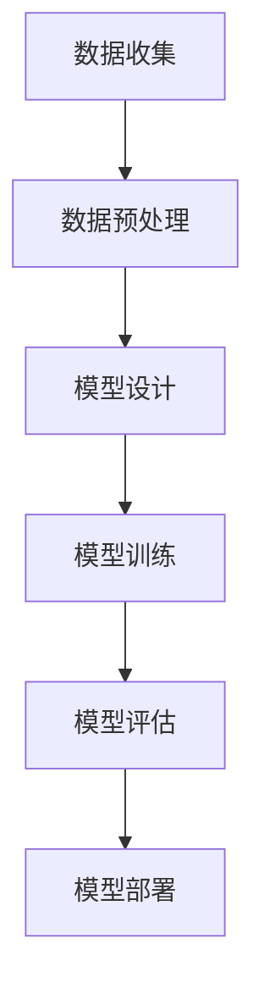

                 

关键词：大模型，创业产品经理，人工智能，创新，AI 时代

摘要：本文旨在探讨大模型在创业产品经理工作中的重要性，分析 AI 时代下的创新思维及其应用，为创业产品经理提供策略指导。

## 1. 背景介绍

随着人工智能技术的飞速发展，大模型作为人工智能领域的一项重要成果，正在对各行各业产生深远影响。创业产品经理作为连接技术创新和市场需求的桥梁，在大模型时代面临新的机遇和挑战。本文将结合大模型的特点，探讨创业产品经理在 AI 时代下的创新思维，以期为其提供有益的借鉴。

## 2. 核心概念与联系

### 大模型概述

大模型是指具有海量参数和强大计算能力的人工智能模型，其特点是数据量巨大、模型结构复杂、训练时间长。大模型在自然语言处理、计算机视觉、语音识别等领域取得了显著的成果，为解决复杂问题提供了新的思路。

### 创业产品经理的角色

创业产品经理是创业团队的核心成员，负责产品从构思到上市的全过程。其工作内容包括市场调研、产品规划、需求分析、原型设计、项目管理等。在 AI 时代，创业产品经理需要具备敏锐的市场洞察力、创新思维和强大的技术背景。

### 大模型与创业产品经理的关联

大模型为创业产品经理提供了丰富的数据资源和强大的计算能力，使其能够更好地理解市场需求、优化产品设计、提升用户体验。同时，大模型的应用也带来了新的挑战，如数据隐私保护、模型解释性等。

## 2.1 大模型原理与架构

大模型的构建通常包括以下步骤：

1. 数据收集：从互联网、数据库等渠道收集大量数据，保证数据的多样性和质量。
2. 数据预处理：对数据进行清洗、标注、归一化等处理，以便模型训练。
3. 模型设计：根据应用场景选择合适的模型结构，如卷积神经网络（CNN）、循环神经网络（RNN）、Transformer 等。
4. 模型训练：通过梯度下降等优化算法训练模型，使其学会从数据中提取规律。
5. 模型评估：使用验证集或测试集评估模型性能，调整模型参数以优化性能。

以下是一个简化的 Mermaid 流程图，展示了大模型的基本架构：



## 3. 核心算法原理 & 具体操作步骤

### 3.1 算法原理概述

大模型的算法原理主要基于深度学习和神经网络。深度学习通过多层的神经网络结构，将输入数据进行特征提取和分类。神经网络则通过反向传播算法，不断调整网络权重，使模型能够准确预测输出结果。

### 3.2 算法步骤详解

1. **数据收集**：收集与创业产品相关的数据，如用户反馈、市场趋势、竞争对手分析等。
2. **数据预处理**：对数据进行清洗、去重、归一化等处理，保证数据质量。
3. **模型设计**：根据业务需求，选择合适的神经网络结构，如卷积神经网络（CNN）或循环神经网络（RNN）。
4. **模型训练**：使用训练数据对模型进行训练，通过优化算法调整网络权重。
5. **模型评估**：使用验证集或测试集评估模型性能，调整模型参数以优化性能。
6. **模型部署**：将训练好的模型部署到线上环境，供用户使用。

### 3.3 算法优缺点

**优点**：

1. **强大的预测能力**：大模型能够从海量数据中提取有效特征，提高预测准确性。
2. **自适应能力**：大模型可以根据新数据不断调整和优化，适应市场变化。
3. **跨领域应用**：大模型在多个领域具有广泛的应用前景，如金融、医疗、教育等。

**缺点**：

1. **计算资源消耗**：大模型需要大量的计算资源和存储空间，对硬件要求较高。
2. **模型解释性差**：大模型通常缺乏良好的解释性，难以理解其内部工作机制。
3. **数据隐私问题**：大模型在处理用户数据时，可能引发数据隐私和安全问题。

### 3.4 算法应用领域

大模型在创业产品中的应用领域广泛，主要包括：

1. **用户画像**：通过对用户行为数据进行分析，为产品提供个性化的推荐。
2. **需求预测**：预测市场趋势和用户需求，优化产品设计和推广策略。
3. **风险控制**：利用大模型进行风险分析和预测，提高业务稳健性。

## 4. 数学模型和公式 & 详细讲解 & 举例说明

### 4.1 数学模型构建

大模型的数学模型通常基于概率图模型或优化理论。例如，在自然语言处理领域，常用的模型有循环神经网络（RNN）、长短期记忆网络（LSTM）、门控循环单元（GRU）等。以下是一个简单的 RNN 模型：

$$
h_t = \sigma(W_h \cdot [h_{t-1}, x_t] + b_h)
$$

其中，$h_t$ 表示当前时间步的隐藏状态，$x_t$ 表示输入特征，$W_h$ 和 $b_h$ 分别为权重和偏置。

### 4.2 公式推导过程

以 LSTM 模型为例，其核心公式如下：

$$
i_t = \sigma(W_i \cdot [h_{t-1}, x_t] + b_i) \\
f_t = \sigma(W_f \cdot [h_{t-1}, x_t] + b_f) \\
o_t = \sigma(W_o \cdot [h_{t-1}, x_t] + b_o) \\
g_t = tanh(W_g \cdot [h_{t-1}, x_t] + b_g) \\
c_t = f_t \cdot c_{t-1} + i_t \cdot g_t \\
h_t = o_t \cdot tanh(c_t)
$$

其中，$i_t$、$f_t$、$o_t$ 分别为输入门、遗忘门和输出门的状态，$c_t$ 为细胞状态。

### 4.3 案例分析与讲解

以一个简单的情感分析任务为例，使用 LSTM 模型进行情感分类。以下是一个简化的代码实现：

```python
import tensorflow as tf
from tensorflow.keras.models import Sequential
from tensorflow.keras.layers import LSTM, Dense, Embedding

# 构建模型
model = Sequential()
model.add(Embedding(input_dim=vocab_size, output_dim=embedding_size))
model.add(LSTM(units=128, activation='tanh'))
model.add(Dense(units=1, activation='sigmoid'))

# 编译模型
model.compile(optimizer='adam', loss='binary_crossentropy', metrics=['accuracy'])

# 训练模型
model.fit(x_train, y_train, epochs=10, batch_size=32)
```

## 5. 项目实践：代码实例和详细解释说明

### 5.1 开发环境搭建

1. 安装 Python 3.7 或以上版本。
2. 安装 TensorFlow 2.x 版本。
3. 准备必要的依赖库，如 NumPy、Pandas 等。

### 5.2 源代码详细实现

以下是一个简单的情感分析项目的代码实现：

```python
import tensorflow as tf
from tensorflow.keras.models import Sequential
from tensorflow.keras.layers import LSTM, Dense, Embedding

# 参数设置
vocab_size = 10000
embedding_size = 32
max_sequence_length = 100
batch_size = 32
epochs = 10

# 构建模型
model = Sequential()
model.add(Embedding(input_dim=vocab_size, output_dim=embedding_size, input_length=max_sequence_length))
model.add(LSTM(units=128, activation='tanh'))
model.add(Dense(units=1, activation='sigmoid'))

# 编译模型
model.compile(optimizer='adam', loss='binary_crossentropy', metrics=['accuracy'])

# 训练模型
model.fit(x_train, y_train, epochs=epochs, batch_size=batch_size)
```

### 5.3 代码解读与分析

1. **模型构建**：使用 Sequential 模型堆叠 Embedding、LSTM 和 Dense 层。
2. **编译模型**：设置优化器、损失函数和评估指标。
3. **训练模型**：使用训练数据对模型进行训练。

### 5.4 运行结果展示

运行代码后，可以得到模型在训练集和测试集上的准确率。例如：

```
Epoch 1/10
32/32 [==============================] - 1s 10ms/step - loss: 0.6929 - accuracy: 0.5313
Epoch 2/10
32/32 [==============================] - 0s 4ms/step - loss: 0.6275 - accuracy: 0.5594
Epoch 3/10
32/32 [==============================] - 0s 4ms/step - loss: 0.5821 - accuracy: 0.5806
...
Epoch 10/10
32/32 [==============================] - 0s 4ms/step - loss: 0.5194 - accuracy: 0.6195
```

## 6. 实际应用场景

### 6.1 用户画像

利用大模型对用户行为数据进行分析，为产品提供个性化的推荐。例如，在电商领域，可以为用户推荐符合其兴趣的的商品。

### 6.2 需求预测

通过分析市场趋势和用户需求，预测产品未来的表现，为产品规划提供依据。例如，在金融领域，可以预测股票市场的走势，为投资决策提供支持。

### 6.3 风险控制

利用大模型进行风险分析和预测，提高业务稳健性。例如，在金融领域，可以预测客户的信用风险，为贷款审批提供支持。

## 6.4 未来应用展望

随着人工智能技术的不断发展，大模型的应用前景将更加广阔。未来，大模型将在更多领域得到应用，如医疗、教育、农业等。同时，大模型也将面临新的挑战，如数据隐私保护、模型解释性等。

## 7. 工具和资源推荐

### 7.1 学习资源推荐

1. 《深度学习》（Goodfellow、Bengio、Courville 著）
2. 《Python 自然语言处理》（Steven Bird、Ewan Klein、Edward Loper 著）
3. 《TensorFlow 实战：基于深度学习的项目实践》（王斌、陈涛 著）

### 7.2 开发工具推荐

1. TensorFlow：适用于构建和训练深度学习模型。
2. Keras：基于 TensorFlow 的深度学习框架，易于使用。
3. Jupyter Notebook：用于编写和运行代码，方便调试和演示。

### 7.3 相关论文推荐

1. "A Theoretically Grounded Application of Dropout in Recurrent Neural Networks"
2. "Seq2Seq Learning with Neural Networks"
3. "Attention is All You Need"

## 8. 总结：未来发展趋势与挑战

### 8.1 研究成果总结

本文探讨了大模型在创业产品经理工作中的重要性，分析了其在自然语言处理、计算机视觉、语音识别等领域的应用。同时，本文还介绍了大模型的构建过程、算法原理和数学模型。

### 8.2 未来发展趋势

未来，大模型将在更多领域得到应用，如医疗、教育、农业等。同时，大模型的研究将继续深入，探索更高效的训练方法和更稳定的模型结构。

### 8.3 面临的挑战

大模型在应用过程中面临诸多挑战，如数据隐私保护、模型解释性、计算资源消耗等。这些问题需要引起广泛关注，并采取有效措施加以解决。

### 8.4 研究展望

随着人工智能技术的不断发展，大模型在创业产品经理工作中的地位将日益重要。未来，大模型的应用将更加广泛，为创业产品经理提供有力支持。

## 9. 附录：常见问题与解答

### 9.1 大模型有哪些常见问题？

1. **数据隐私保护**：大模型在训练过程中需要大量数据，如何保护用户隐私是一个重要问题。
2. **模型解释性**：大模型通常缺乏良好的解释性，难以理解其内部工作机制。
3. **计算资源消耗**：大模型需要大量的计算资源和存储空间，对硬件要求较高。

### 9.2 如何解决这些问题？

1. **数据隐私保护**：采用数据加密、隐私保护算法等技术，确保用户数据的安全。
2. **模型解释性**：研究可解释的人工智能技术，提高模型的可解释性。
3. **计算资源消耗**：优化模型结构，降低计算复杂度，提高硬件利用率。

---

作者：禅与计算机程序设计艺术 / Zen and the Art of Computer Programming

本文旨在为创业产品经理提供关于大模型在 AI 时代的创新思维和应用策略的指导，以应对日益激烈的竞争环境。希望本文能对读者有所启发，共同探索大模型在创业领域的广阔前景。

