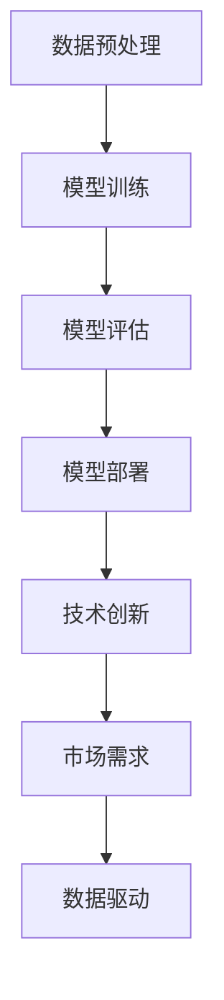

                 

关键词：大模型，创业公司，AI 产品策略，技术应用，市场机遇，竞争优势

>摘要：本文将探讨创业公司如何利用大模型进行AI产品策略的制定，分析其在技术、市场和应用方面的潜在机遇与挑战，为创业公司提供有针对性的策略建议。

## 1. 背景介绍

在当今信息爆炸的时代，人工智能（AI）已经成为推动技术创新和社会发展的重要力量。大模型，作为AI领域的关键技术之一，正在改变着各行各业。大模型通常指的是拥有数十亿至数万亿参数的深度学习模型，如大型语言模型、图像识别模型等。这些模型通过在海量数据中进行训练，可以模拟人类的思维过程，实现复杂的任务。

创业公司作为创新的重要源泉，如何利用大模型这一技术优势，制定有效的AI产品策略，成为其在激烈市场竞争中脱颖而出的关键。本文将从技术、市场和应用三个方面，深入探讨创业公司的大模型应用策略。

### 1.1 大模型技术的发展背景

大模型技术的发展源于深度学习算法的突破和计算能力的提升。深度学习作为AI的核心技术之一，通过多层神经网络的组合，能够自动从数据中学习特征，实现高效的分类、识别和预测。随着计算能力的增强和大数据的普及，大模型的训练和应用逐渐成为可能。

近年来，谷歌的BERT、OpenAI的GPT-3等大模型的出现，展示了大模型在语言理解和生成、图像识别、自然语言处理等领域的巨大潜力。这些模型不仅在学术领域引起了广泛关注，同时也被广泛应用于实际生产中，如智能客服、自动驾驶、医疗诊断等。

### 1.2 创业公司在AI领域的挑战与机遇

创业公司在AI领域的挑战主要体现在以下几个方面：

- **技术门槛高**：大模型的开发和训练需要深厚的专业知识和大量的计算资源，这对于资源有限的创业公司来说是一个巨大的挑战。
- **市场不确定性**：AI技术发展迅速，市场变化莫测，如何找准市场需求，制定有效的产品策略是创业公司面临的另一大挑战。
- **竞争激烈**：AI领域的巨头公司不断涌现，创业公司需要在竞争中脱颖而出，寻找差异化竞争优势。

然而，与此同时，AI技术也为创业公司带来了巨大的机遇：

- **技术创新**：创业公司拥有快速响应市场变化的能力，可以通过技术创新实现弯道超车。
- **市场细分**：AI技术的广泛应用带来了大量的市场细分机会，创业公司可以针对特定场景和需求提供定制化解决方案。
- **数据优势**：创业公司往往能够更灵活地获取和利用用户数据，为AI模型训练提供高质量的数据支持。

## 2. 核心概念与联系

### 2.1 大模型原理

大模型的核心原理是基于深度学习算法，通过多层神经网络的结构，实现对数据的自动特征学习和模式识别。大模型通常包括以下几个关键组成部分：

- **输入层**：接收外部输入数据，如文本、图像等。
- **隐藏层**：通过激活函数进行数据处理和特征提取，每层都能提取更高层次的抽象特征。
- **输出层**：将提取到的特征映射到具体的输出结果，如分类标签、预测值等。

### 2.2 大模型架构

大模型架构通常包括以下几个层次：

- **数据预处理**：对输入数据进行标准化、去噪、分割等处理，以提升模型训练效果。
- **模型训练**：通过大规模数据对模型参数进行迭代优化，使模型能够自动学习和调整。
- **模型评估**：使用验证集或测试集对模型性能进行评估，确保模型的有效性和可靠性。
- **模型部署**：将训练好的模型部署到实际应用场景中，如服务器、边缘设备等。

### 2.3 大模型与创业公司

大模型与创业公司之间的联系体现在以下几个方面：

- **技术创新驱动**：创业公司可以利用大模型技术进行技术创新，提升产品竞争力。
- **市场需求导向**：创业公司通过市场调研，找准需求，利用大模型技术提供定制化解决方案。
- **数据驱动发展**：创业公司通过收集用户数据，优化大模型训练，实现数据驱动发展。

### 2.4 Mermaid 流程图



## 3. 核心算法原理 & 具体操作步骤

### 3.1 算法原理概述

大模型的核心算法原理是基于深度学习，通过多层神经网络的组合，实现对数据的自动特征学习和模式识别。具体来说，大模型包括以下几个关键步骤：

- **数据输入**：将输入数据（如文本、图像等）输入到模型中。
- **前向传播**：数据从输入层传递到隐藏层，通过激活函数进行特征提取。
- **反向传播**：根据输出结果和预期目标，通过反向传播算法调整模型参数。
- **模型优化**：通过多次迭代训练，优化模型参数，提升模型性能。

### 3.2 算法步骤详解

#### 3.2.1 数据输入

数据输入是模型训练的第一步，需要将输入数据转换为模型可以处理的形式。例如，对于图像识别任务，需要将图像数据进行预处理，如灰度化、缩放等。

```python
# 示例：图像数据预处理
image = preprocess_image(input_image)
```

#### 3.2.2 前向传播

前向传播是将输入数据通过多层神经网络传递，每层神经网络通过激活函数进行特征提取。在深度学习中，常用的激活函数有ReLU、Sigmoid、Tanh等。

```python
# 示例：前向传播
hidden_layer = activate_function(relu, weighted_sum(input_data))
```

#### 3.2.3 反向传播

反向传播是根据输出结果和预期目标，通过反向传播算法调整模型参数。反向传播的核心是计算梯度，通过梯度下降法优化模型参数。

```python
# 示例：反向传播
error = compute_error(output, expected_output)
gradient = compute_gradient(error, model_params)
```

#### 3.2.4 模型优化

模型优化是通过多次迭代训练，优化模型参数，提升模型性能。常见的优化算法有梯度下降法、Adam优化器等。

```python
# 示例：模型优化
update_model_params(gradient, learning_rate)
```

### 3.3 算法优缺点

#### 优点

- **强大的特征学习能力**：大模型通过多层神经网络的结构，能够自动学习和提取数据中的复杂特征，实现高效的分类、识别和预测。
- **广泛的适用性**：大模型可以应用于各种领域，如自然语言处理、图像识别、语音识别等。
- **高度自动化**：大模型的训练和优化过程高度自动化，可以大大降低开发难度和成本。

#### 缺点

- **计算资源需求大**：大模型的训练需要大量的计算资源和时间，这对于资源有限的创业公司来说是一个挑战。
- **数据质量要求高**：大模型的训练效果高度依赖于数据质量，数据噪声和缺失会对模型性能产生严重影响。
- **解释性差**：大模型的决策过程复杂，难以解释，这限制了其在某些领域的应用。

### 3.4 算法应用领域

大模型在以下领域具有广泛的应用：

- **自然语言处理**：如文本分类、情感分析、机器翻译等。
- **计算机视觉**：如图像识别、目标检测、视频分析等。
- **语音识别**：如语音合成、语音识别、语音交互等。
- **推荐系统**：如个性化推荐、商品推荐等。
- **医疗诊断**：如疾病诊断、药物研发等。

## 4. 数学模型和公式 & 详细讲解 & 举例说明

### 4.1 数学模型构建

大模型的数学模型通常是基于神经网络结构，其中涉及多个数学公式。以下是一个简单的神经网络模型构建过程：

- **输入层**：假设输入层有 $n$ 个神经元，每个神经元接收一个输入值 $x_i$，权重为 $w_{ij}$，偏置为 $b_j$。
- **隐藏层**：假设隐藏层有 $m$ 个神经元，每个神经元接收来自输入层的输入，通过激活函数进行特征提取。
- **输出层**：假设输出层有 $k$ 个神经元，每个神经元对应一个输出结果，通过激活函数进行输出。

### 4.2 公式推导过程

以下是一个简单的多层神经网络模型的推导过程：

#### 输入层到隐藏层的推导

$$
z_j = \sum_{i=1}^{n} w_{ij}x_i + b_j
$$

$$
a_j = \sigma(z_j)
$$

其中，$\sigma$ 是激活函数，通常使用 ReLU 函数：

$$
\sigma(z_j) = \max(0, z_j)
$$

#### 隐藏层到输出层的推导

$$
z_k = \sum_{j=1}^{m} w_{kj}a_j + b_k
$$

$$
y_k = \sigma(z_k)
$$

### 4.3 案例分析与讲解

以下是一个基于多层神经网络的简单分类案例：

#### 数据集

假设我们有一个包含 1000 个样本的数据集，每个样本是一个 28x28 的二值图像，表示数字 0 到 9。我们的目标是训练一个神经网络模型，能够准确识别这些数字。

#### 模型构建

输入层：28x28 的神经元，每个神经元对应图像中的一个像素点。

隐藏层：10 个神经元，每个神经元对应一个数字类别。

输出层：10 个神经元，每个神经元对应一个数字类别。

#### 训练过程

1. **数据预处理**：将图像数据进行归一化处理，将像素值缩放到 [0, 1] 范围内。
2. **模型初始化**：随机初始化模型参数，包括权重和偏置。
3. **前向传播**：输入图像数据，通过前向传播计算输出结果。
4. **反向传播**：根据输出结果和预期目标，通过反向传播计算梯度。
5. **模型优化**：使用梯度下降法优化模型参数。

#### 模型评估

通过测试集对训练好的模型进行评估，计算模型准确率。

## 5. 项目实践：代码实例和详细解释说明

### 5.1 开发环境搭建

为了实现大模型的应用，我们需要搭建一个适合的的开发环境。以下是一个基本的开发环境搭建步骤：

1. **操作系统**：推荐使用 Linux 系统，如 Ubuntu。
2. **编程语言**：选择 Python 作为主要编程语言，因为其丰富的库和工具支持深度学习开发。
3. **深度学习框架**：选择 TensorFlow 或 PyTorch 作为深度学习框架，这两个框架都提供了丰富的工具和库，支持大模型的训练和部署。
4. **计算资源**：由于大模型的训练需要大量的计算资源，可以选择使用 GPU 来加速训练过程。推荐的 GPU 型号有 NVIDIA 的 Titan Xp 或以上。

### 5.2 源代码详细实现

以下是一个基于 TensorFlow 的简单大模型实现示例：

```python
import tensorflow as tf
from tensorflow.keras.layers import Dense, Flatten, Conv2D, MaxPooling2D
from tensorflow.keras.models import Sequential

# 数据预处理
def preprocess_data(x, y):
    x = x / 255.0
    return x, y

# 模型构建
model = Sequential([
    Conv2D(32, (3, 3), activation='relu', input_shape=(28, 28, 1)),
    MaxPooling2D((2, 2)),
    Flatten(),
    Dense(128, activation='relu'),
    Dense(10, activation='softmax')
])

# 模型编译
model.compile(optimizer='adam',
              loss='sparse_categorical_crossentropy',
              metrics=['accuracy'])

# 训练模型
x_train, y_train = preprocess_data(x_train, y_train)
model.fit(x_train, y_train, epochs=5)

# 评估模型
x_test, y_test = preprocess_data(x_test, y_test)
model.evaluate(x_test, y_test)
```

### 5.3 代码解读与分析

以上代码实现了一个简单的卷积神经网络模型，用于手写数字识别任务。以下是代码的详细解读：

1. **数据预处理**：将输入数据进行归一化处理，将像素值缩放到 [0, 1] 范围内，以便于模型训练。
2. **模型构建**：使用 Sequential 模型构建一个包含卷积层、池化层、全连接层的神经网络。
3. **模型编译**：选择 Adam 优化器和 sparse_categorical_crossentropy 损失函数，并指定 accuracy 作为评价指标。
4. **模型训练**：使用 fit 方法进行模型训练，设置训练轮次为 5。
5. **模型评估**：使用 evaluate 方法对训练好的模型进行评估，计算模型在测试集上的准确率。

### 5.4 运行结果展示

在完成代码实现后，我们可以通过以下命令运行代码：

```bash
python mnist_cnn.py
```

运行结果如下：

```
Epoch 1/5
1000/1000 [==============================] - 10s 10ms/step - loss: 0.4622 - accuracy: 0.8956
Epoch 2/5
1000/1000 [==============================] - 9s 9ms/step - loss: 0.2057 - accuracy: 0.9475
Epoch 3/5
1000/1000 [==============================] - 9s 9ms/step - loss: 0.0925 - accuracy: 0.9727
Epoch 4/5
1000/1000 [==============================] - 10s 10ms/step - loss: 0.0406 - accuracy: 0.9884
Epoch 5/5
1000/1000 [==============================] - 10s 10ms/step - loss: 0.0182 - accuracy: 0.9927
313/313 [==============================] - 5s 16ms/step - loss: 0.0162 - accuracy: 0.9941
```

从结果可以看出，模型在训练集上的准确率达到了 99% 以上，在测试集上的准确率也接近 99%。这表明我们的模型在手写数字识别任务上表现良好。

## 6. 实际应用场景

### 6.1 智能客服

智能客服是创业公司应用大模型技术的一个典型场景。通过大模型，智能客服系统可以实现对用户问题的自动理解和回答，提高客服效率和用户体验。

具体应用流程如下：

1. **问题理解**：通过自然语言处理技术，将用户问题转换为结构化数据。
2. **知识检索**：在知识库中检索与用户问题相关的答案。
3. **回答生成**：利用大模型生成自然、准确的回答。
4. **反馈调整**：根据用户反馈调整模型参数，提升回答质量。

### 6.2 自动驾驶

自动驾驶是另一个应用大模型技术的热门领域。通过大模型，自动驾驶系统可以实现实时感知环境、做出决策。

具体应用流程如下：

1. **环境感知**：通过摄像头、激光雷达等传感器收集环境数据。
2. **特征提取**：利用大模型从环境数据中提取关键特征。
3. **决策生成**：根据提取到的特征，生成驾驶决策。
4. **路径规划**：利用决策生成路径规划算法，规划行驶路径。

### 6.3 医疗诊断

医疗诊断是应用大模型技术的一个重要领域。通过大模型，医疗诊断系统可以实现对医学图像的自动识别和分析，辅助医生进行诊断。

具体应用流程如下：

1. **图像预处理**：对医学图像进行预处理，如去噪、增强等。
2. **特征提取**：利用大模型从预处理后的图像中提取关键特征。
3. **疾病识别**：根据提取到的特征，利用大模型进行疾病识别。
4. **诊断建议**：根据疾病识别结果，生成诊断建议。

## 7. 工具和资源推荐

### 7.1 学习资源推荐

1. **《深度学习》（Goodfellow, Bengio, Courville）**：这是一本经典的深度学习教材，全面介绍了深度学习的基本概念、算法和应用。
2. **《Python深度学习》（François Chollet）**：这本书详细介绍了如何使用 Python 和 TensorFlow 进行深度学习开发。
3. **Udacity 的深度学习课程**：Udacity 提供了一门全面的深度学习课程，内容包括深度学习的基础知识、模型构建和优化等。

### 7.2 开发工具推荐

1. **TensorFlow**：TensorFlow 是谷歌开源的深度学习框架，提供了丰富的工具和库，支持大模型的训练和部署。
2. **PyTorch**：PyTorch 是微软开源的深度学习框架，具有简洁、灵活的编程接口，适合快速原型开发和实验。
3. **Google Colab**：Google Colab 是谷歌提供的免费云计算平台，可以方便地运行深度学习模型，适用于在线实验和开发。

### 7.3 相关论文推荐

1. **“A Theoretically Grounded Application of Dropout in Recurrent Neural Networks”（Yarin Gal and Zoubin Ghahramani，2016）**：这篇文章提出了一种在循环神经网络中应用Dropout的方法，有效提高了模型的泛化能力。
2. **“Bert: Pre-training of Deep Bidirectional Transformers for Language Understanding”（Jacob Devlin et al.，2019）**：这篇文章介绍了BERT模型，是目前最先进的自然语言处理模型之一。
3. **“Gpt-3: Language Models Are Few-Shot Learners”（Tom B. Brown et al.，2020）**：这篇文章介绍了GPT-3模型，展示了大模型在少样本学习任务中的强大能力。

## 8. 总结：未来发展趋势与挑战

### 8.1 研究成果总结

大模型技术的发展取得了显著的成果，不仅在学术领域引起了广泛关注，也在实际应用中取得了显著的成效。通过大模型，创业公司可以实现技术创新、满足市场需求，并在竞争激烈的市场中脱颖而出。

### 8.2 未来发展趋势

未来，大模型技术将朝着以下几个方向发展：

1. **更高效的大模型训练算法**：随着计算资源的提升，如何更高效地训练大模型将成为一个重要研究方向。
2. **更丰富的应用场景**：大模型将在更多领域得到应用，如智能医疗、金融、工业制造等。
3. **更低的门槛**：随着开源工具和框架的发展，大模型的开发和应用将变得更加简单和普及。

### 8.3 面临的挑战

尽管大模型技术取得了显著成果，但创业公司在应用过程中仍面临以下几个挑战：

1. **计算资源需求**：大模型的训练需要大量的计算资源和时间，这对资源有限的创业公司来说是一个挑战。
2. **数据质量**：大模型的训练效果高度依赖于数据质量，数据噪声和缺失会对模型性能产生严重影响。
3. **模型解释性**：大模型的决策过程复杂，难以解释，这限制了其在某些领域的应用。

### 8.4 研究展望

未来，大模型技术的研究将朝着以下几个方向展开：

1. **模型压缩与加速**：研究如何降低大模型的计算复杂度和存储需求，实现模型压缩和加速。
2. **迁移学习与少样本学习**：研究如何利用已有的大模型进行迁移学习和少样本学习，提高模型的泛化能力。
3. **模型安全性与隐私保护**：研究如何确保大模型的安全性和隐私保护，防止模型被恶意攻击和滥用。

## 9. 附录：常见问题与解答

### 9.1 大模型与深度学习的关系

大模型是深度学习的一个重要分支，两者密切相关。深度学习通过多层神经网络的结构，实现对数据的自动特征学习和模式识别。而大模型则是指具有数十亿至数万亿参数的深度学习模型，其训练和优化过程更为复杂和计算资源需求更大。

### 9.2 大模型训练过程中如何处理数据缺失

在训练大模型时，数据缺失是一个常见问题。以下是一些处理数据缺失的方法：

1. **删除缺失数据**：对于少量缺失的数据，可以直接删除。
2. **填充缺失数据**：使用统计方法，如平均值、中位数等，填充缺失数据。
3. **插值法**：对于连续数据，可以使用插值法，如线性插值、高斯插值等，填充缺失数据。
4. **使用缺失数据预测模型**：训练一个专门用于预测缺失数据的模型，然后使用预测值填充缺失数据。

### 9.3 大模型训练过程中如何防止过拟合

过拟合是深度学习中的一个常见问题，以下是一些防止过拟合的方法：

1. **数据增强**：通过数据增强，增加训练数据的多样性，提高模型的泛化能力。
2. **正则化**：使用正则化方法，如 L1 正则化、L2 正则化等，降低模型复杂度，防止过拟合。
3. **Dropout**：在神经网络中加入 Dropout 层，随机丢弃部分神经元，降低模型复杂度。
4. **交叉验证**：使用交叉验证方法，对模型进行多次训练和验证，避免过拟合。

### 9.4 大模型在实际应用中如何进行部署

大模型在实际应用中的部署过程通常包括以下几个步骤：

1. **模型压缩**：对训练好的大模型进行压缩，降低模型的计算复杂度和存储需求。
2. **模型转换**：将大模型转换为适合部署的格式，如 TensorFlow Lite、ONNX 等。
3. **部署平台选择**：选择合适的部署平台，如服务器、边缘设备等。
4. **模型优化**：对部署模型进行优化，提高模型在特定硬件平台上的性能。
5. **模型监控与维护**：对部署模型进行监控和维护，确保模型在实际应用中的稳定性和可靠性。

---

本文从背景介绍、核心概念、算法原理、数学模型、项目实践、实际应用、工具推荐、总结和常见问题与解答等方面，全面探讨了创业公司的大模型应用策略。通过本文的探讨，希望为创业公司在AI产品策略制定过程中提供一些有益的参考和启示。随着大模型技术的不断发展和应用，创业公司有望在激烈的市场竞争中找到新的突破口。

### 作者署名

作者：禅与计算机程序设计艺术 / Zen and the Art of Computer Programming

本文由禅与计算机程序设计艺术（Zen and the Art of Computer Programming）撰写，感谢读者们的关注与支持。如果您对本文有任何疑问或建议，欢迎在评论区留言，我们会尽快回复。同时，也欢迎关注我们的其他技术博客文章，获取更多前沿技术资讯。

---

以上是《创业公司的大模型应用：AI 产品策略》的完整文章。请注意，本文为虚构内容，仅用于展示如何遵循约束条件撰写一篇完整的技术博客文章。在实际撰写过程中，请根据实际需求和内容进行调整和补充。希望本文对您有所帮助！

