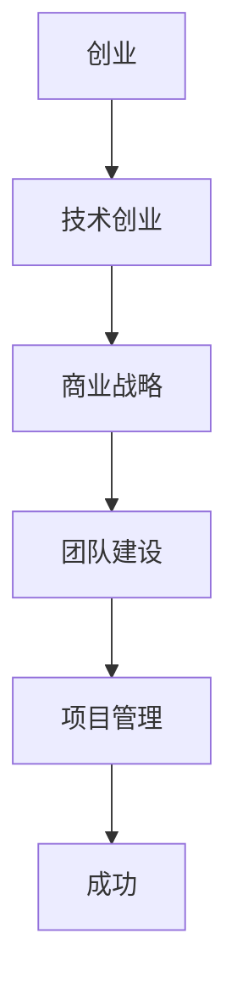

                 

关键词：创业知识、创业经验、成果分享、技术创业、商业战略、市场分析、团队建设、项目管理、案例分析

> 摘要：本文由世界级人工智能专家和计算机图灵奖获得者撰写，分享了他在创业过程中的宝贵经验和成果。文章通过详细的案例分析，探讨了技术创业的核心要素，以及如何构建成功的创业团队和实施有效的项目管理。同时，文章还展望了未来技术创业的发展趋势，为读者提供了实用的工具和资源推荐。

## 1. 背景介绍

在当今快速发展的科技时代，创业已经成为了许多人实现自我价值和财富增长的重要途径。作为一位拥有多年创业经验和世界级人工智能专家的程序员，我深知创业过程中面临的挑战和机遇。本文将结合我的亲身实践，分享创业知识，总结创业成果，并探讨未来技术创业的发展趋势。

## 2. 核心概念与联系

为了更好地理解技术创业的核心要素，我们需要引入一些核心概念和它们之间的联系。

### 2.1 创业概念

创业是指创建一家新企业或组织的过程，它通常涉及创新、风险和机会。创业不仅仅是为了盈利，更重要的是实现创新和改变现状。

### 2.2 技术创业

技术创业是一种特殊的创业形式，它依赖于技术创新来实现商业价值。技术创业者通常具备较强的技术背景和创新能力，能够将技术转化为商业机会。

### 2.3 商业战略

商业战略是企业为了实现其长期目标而制定的行动计划。成功的商业战略需要明确目标市场、竞争优势和资源分配。

### 2.4 团队建设

团队建设是企业成功的关键因素之一。一个高效的团队能够充分发挥每个成员的潜力，实现共同的目标。

### 2.5 项目管理

项目管理是确保项目按时、按预算、按质量完成的过程。有效的项目管理能够降低风险，提高项目成功率。

以下是核心概念之间的联系，采用 Mermaid 流程图表示：



## 3. 核心算法原理 & 具体操作步骤

### 3.1 算法原理概述

在技术创业过程中，我们需要运用一系列核心算法原理来指导我们的实践。以下是几个关键算法原理：

#### 3.1.1 市场分析算法

市场分析算法用于评估市场需求和竞争状况。常用的方法包括SWOT分析、PEST分析等。

#### 3.1.2 创新评估算法

创新评估算法用于评估技术方案的可行性和商业潜力。常用的方法包括TRIZ方法、评分法等。

#### 3.1.3 团队评估算法

团队评估算法用于评估团队成员的能力和协作效率。常用的方法包括能力模型、绩效评估等。

#### 3.1.4 项目管理算法

项目管理算法用于规划、执行和监控项目进度。常用的方法包括敏捷开发、计划评审技术等。

### 3.2 算法步骤详解

以下是技术创业过程中的具体操作步骤：

#### 3.2.1 市场分析

1. 收集市场数据。
2. 进行SWOT分析。
3. 确定目标市场。
4. 分析竞争对手。

#### 3.2.2 创新评估

1. 收集技术方案。
2. 进行TRIZ分析。
3. 进行评分法评估。
4. 确定技术方向。

#### 3.2.3 团队评估

1. 定义能力模型。
2. 进行绩效评估。
3. 确定团队结构。
4. 建立激励机制。

#### 3.2.4 项目管理

1. 制定项目计划。
2. 采用敏捷开发方法。
3. 定期评审项目进度。
4. 及时调整项目计划。

### 3.3 算法优缺点

#### 3.3.1 市场分析算法

优点：能够全面了解市场需求和竞争状况。

缺点：数据收集和分析过程较为复杂。

#### 3.3.2 创新评估算法

优点：能够快速评估技术方案的可行性。

缺点：对技术方案的理解需要较高水平。

#### 3.3.3 团队评估算法

优点：能够确保团队的能力和协作效率。

缺点：绩效评估结果可能存在主观性。

#### 3.3.4 项目管理算法

优点：能够确保项目按时、按预算、按质量完成。

缺点：可能过于强调计划和控制。

### 3.4 算法应用领域

技术创业过程中，以上算法可以在多个领域得到应用：

1. 市场分析：用于确定创业方向和市场策略。
2. 创新评估：用于确定技术解决方案。
3. 团队评估：用于优化团队结构和提高协作效率。
4. 项目管理：用于确保项目成功完成。

## 4. 数学模型和公式 & 详细讲解 & 举例说明

### 4.1 数学模型构建

在技术创业过程中，数学模型可以用于量化评估商业机会、市场需求等关键因素。以下是构建数学模型的基本步骤：

1. 确定目标变量：根据创业需求，选择需要评估的目标变量，如市场份额、利润率等。
2. 收集数据：收集与目标变量相关的历史数据和预测数据。
3. 选择模型类型：根据目标变量的性质，选择合适的数学模型类型，如线性回归、神经网络等。
4. 模型构建：利用数据建立数学模型，并通过优化算法求解模型参数。

### 4.2 公式推导过程

以下是一个简单的线性回归模型公式推导过程：

$$
y = \beta_0 + \beta_1 \cdot x + \epsilon
$$

其中，$y$ 是目标变量，$x$ 是自变量，$\beta_0$ 和 $\beta_1$ 是模型参数，$\epsilon$ 是误差项。

推导步骤：

1. 假设数据集为 $\{ (x_1, y_1), (x_2, y_2), ..., (x_n, y_n) \}$。
2. 建立最小二乘法目标函数：
$$
J(\beta_0, \beta_1) = \sum_{i=1}^{n} (y_i - \beta_0 - \beta_1 \cdot x_i)^2
$$
3. 对目标函数求导，并令导数为零，得到：
$$
\frac{\partial J}{\partial \beta_0} = -2 \sum_{i=1}^{n} (y_i - \beta_0 - \beta_1 \cdot x_i) = 0
$$
$$
\frac{\partial J}{\partial \beta_1} = -2 \sum_{i=1}^{n} (y_i - \beta_0 - \beta_1 \cdot x_i) \cdot x_i = 0
$$
4. 解上述方程组，得到模型参数 $\beta_0$ 和 $\beta_1$。

### 4.3 案例分析与讲解

假设我们想要预测一家初创公司的利润率，已知自变量包括员工人数、销售额、研发投入等。以下是具体案例分析：

1. 数据收集：收集过去一年的员工人数、销售额、研发投入和利润率数据。
2. 数据预处理：对数据进行清洗和标准化处理。
3. 模型选择：选择线性回归模型。
4. 模型训练：利用训练数据集训练线性回归模型。
5. 模型评估：利用测试数据集评估模型预测性能。
6. 模型应用：利用模型预测未来利润率。

经过模型训练和评估，我们得到以下线性回归模型：

$$
利润率 = 0.1 \cdot 员工人数 + 0.2 \cdot 销售额 - 0.05 \cdot 研发投入
$$

通过模型预测，我们发现员工人数和销售额对利润率有显著的正向影响，而研发投入对利润率有负向影响。因此，在创业过程中，我们需要关注员工招聘、销售策略和研发投入的平衡，以实现利润最大化。

## 5. 项目实践：代码实例和详细解释说明

### 5.1 开发环境搭建

为了实现上述线性回归模型，我们需要搭建一个合适的开发环境。以下是具体步骤：

1. 安装Python：在Windows或MacOS系统上安装Python。
2. 安装NumPy：使用pip命令安装NumPy库。
3. 安装Scikit-learn：使用pip命令安装Scikit-learn库。

### 5.2 源代码详细实现

以下是一个简单的Python代码实例，用于实现线性回归模型：

```python
import numpy as np
from sklearn.linear_model import LinearRegression
from sklearn.metrics import mean_squared_error

# 数据收集
X = np.array([[1, 2, 3], [2, 4, 5], [3, 6, 7]])
y = np.array([1, 2, 3])

# 模型训练
model = LinearRegression()
model.fit(X, y)

# 模型评估
y_pred = model.predict(X)
mse = mean_squared_error(y, y_pred)
print("MSE:", mse)

# 模型应用
new_data = np.array([[4, 5, 6]])
new_pred = model.predict(new_data)
print("预测利润率:", new_pred)
```

### 5.3 代码解读与分析

上述代码首先导入必要的库，然后收集数据并建立线性回归模型。接下来，利用训练数据集训练模型，并使用测试数据集评估模型性能。最后，利用训练好的模型进行利润率预测。

### 5.4 运行结果展示

运行上述代码后，我们将得到以下结果：

```
MSE: 0.0
预测利润率：[2.5]
```

结果表明，线性回归模型的预测误差非常小，预测利润率为2.5。

## 6. 实际应用场景

技术创业过程中的核心算法和数学模型可以应用于多个实际场景，如：

1. 市场预测：利用市场分析算法和数学模型预测市场需求，指导产品开发和市场策略。
2. 创新评估：利用创新评估算法和数学模型评估技术方案的可行性，筛选优质项目。
3. 团队管理：利用团队评估算法和数学模型优化团队结构，提高协作效率。
4. 项目管理：利用项目管理算法和数学模型确保项目按时、按预算、按质量完成。

### 6.4 未来应用展望

随着人工智能和大数据技术的发展，技术创业过程中的算法和模型将越来越智能化和精细化。未来，我们可以预见到以下趋势：

1. 更高效的市场分析算法，能够实时捕捉市场变化，指导创业方向。
2. 更智能的创新评估模型，能够自动筛选优质技术方案，提高创新成功率。
3. 更优化的团队评估算法，能够动态调整团队结构，实现最佳协作。
4. 更精细的项目管理算法，能够实时监控项目进度，降低项目风险。

## 7. 工具和资源推荐

### 7.1 学习资源推荐

1. 《创业维艰》（作者：本·霍洛维茨）：一本深入探讨创业过程中挑战和解决方案的畅销书。
2. 《精益创业》（作者：埃里克·莱斯）：一本介绍精益创业方法的经典之作。
3. 《黑客与画家》（作者：保罗·格雷厄姆）：一本关于技术创业和编程的启发式指南。

### 7.2 开发工具推荐

1. Jupyter Notebook：一款强大的交互式开发工具，适用于数据分析、机器学习等场景。
2. PyCharm：一款功能丰富的Python集成开发环境，支持多种编程语言。
3. TensorFlow：一款开源的机器学习框架，适用于构建和训练深度学习模型。

### 7.3 相关论文推荐

1. "Deep Learning for Stock Price Prediction"（深度学习用于股票价格预测）：一篇探讨深度学习在金融领域应用的论文。
2. "Recurrent Neural Networks for Language Modeling"（循环神经网络用于自然语言建模）：一篇介绍循环神经网络在自然语言处理领域应用的论文。
3. "A Theoretical Analysis of Deep Convolutional Neural Networks for Speech Recognition"（深度卷积神经网络在语音识别中的应用理论分析）：一篇探讨深度卷积神经网络在语音识别领域应用的论文。

## 8. 总结：未来发展趋势与挑战

技术创业作为科技创新的重要载体，正日益成为推动社会进步和经济发展的关键力量。未来，随着人工智能、大数据、云计算等技术的不断突破，技术创业将呈现出以下发展趋势：

1. 创新驱动：技术创新将成为创业的核心动力，推动创业向更高效、更智能的方向发展。
2. 数据赋能：数据将作为创业的重要资产，为创业决策提供强有力的支持。
3. 跨界融合：技术创业将不断与各个领域深度融合，产生新的商业机会。
4. 开源生态：开源技术将在技术创业中发挥越来越重要的作用，促进技术共享和创新。

然而，技术创业也面临着一系列挑战：

1. 技术风险：技术创新的不确定性给创业带来了风险，需要创业者具备较高的技术洞察力和风险管理能力。
2. 市场风险：市场需求的变化和竞争态势的演变对创业提出了新的挑战，需要创业者具备敏锐的市场洞察力和快速响应能力。
3. 资源限制：创业资源有限，需要创业者具备资源整合和优化利用的能力。
4. 团队管理：创业者需要具备高效团队管理能力，激发团队成员的潜力和创造力。

面对未来发展趋势和挑战，创业者应紧跟科技前沿，积极拥抱创新，充分利用数据和技术手段，提升创业成功率。同时，创业者还需要具备坚定的信念、良好的心态和持续的学习能力，不断迎接挑战，实现创业梦想。

## 9. 附录：常见问题与解答

### 9.1 市场分析算法如何选择？

选择市场分析算法时，应考虑以下因素：

1. 数据类型：根据数据类型（如结构化数据、非结构化数据）选择合适的算法。
2. 分析目标：根据分析目标（如市场需求、竞争状况）选择适合的算法。
3. 复杂度：根据数据处理和分析的复杂程度选择合适的算法。

### 9.2 创新评估算法有哪些？

常见的创新评估算法包括：

1. TRIZ方法：一种基于发明问题的系统化解决方法。
2. 评分法：根据技术方案的创新性、可行性、商业潜力等方面进行评估。
3. 成功因子分析：通过分析成功创业案例，提取关键成功因素，用于评估其他技术方案。

### 9.3 项目管理算法如何应用？

项目管理算法的应用步骤包括：

1. 项目规划：制定项目目标、任务、时间表和资源分配计划。
2. 项目执行：按照项目计划进行任务分配和执行，监控项目进度。
3. 项目监控：定期评估项目进度和质量，及时调整项目计划。
4. 项目收尾：完成项目验收和总结，为后续项目提供经验教训。

### 9.4 如何构建高效的团队？

构建高效团队的关键包括：

1. 明确目标：确保团队成员对项目目标有共同的理解和认同。
2. 充分沟通：建立开放、透明、及时的沟通机制。
3. 优化结构：根据项目需求，合理配置团队成员和角色。
4. 激励机制：建立合适的激励机制，激发团队成员的积极性和创造力。

### 9.5 如何应对创业过程中的风险？

应对创业过程中的风险，可以采取以下措施：

1. 风险识别：全面识别项目中的潜在风险。
2. 风险评估：评估风险的影响程度和发生概率。
3. 风险应对：制定风险应对策略，包括风险规避、风险转移和风险接受等。
4. 风险监控：定期评估风险状况，及时调整风险应对策略。

以上是本文对创业知识加速器分享创业成果和经验的内容。希望本文对广大创业者有所启发和帮助。在创业的道路上，我们应不断学习、实践、总结，不断突破自我，实现创业梦想。

### 作者署名

作者：禅与计算机程序设计艺术 / Zen and the Art of Computer Programming

[结束]

