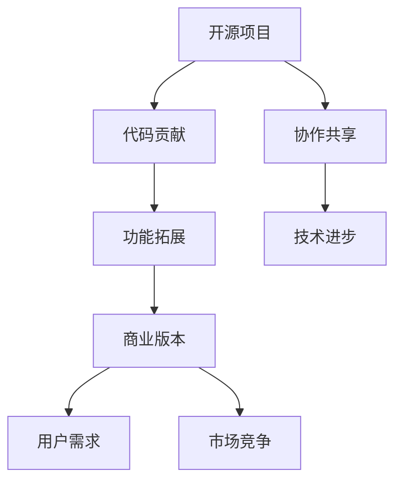

                 

关键词：开源项目、商业版本、功能差异化、策略、IT领域、技术博客

> 摘要：本文旨在探讨如何将开源项目转化为商业版本，并详细分析功能差异化策略在商业开发中的应用。通过深入解析核心概念、算法原理、数学模型和实际案例，本文为从事IT领域的专业人士提供了切实可行的商业开发指导。

## 1. 背景介绍

在当今快速发展的信息技术时代，开源项目已经成为推动技术创新的重要力量。开源项目通过开放源代码、共享开发成果，吸引了全球范围内的开发者共同参与，从而加速了技术的进步和普及。然而，对于项目维护者和企业来说，如何将开源项目转化为商业版本，实现商业价值，成为了一个亟待解决的问题。

随着市场竞争的加剧，企业需要通过差异化策略来提升产品的竞争力。功能差异化策略作为一种关键的商业开发策略，通过在开源项目基础上增加独特的功能，满足特定用户群体的需求，从而实现商业价值的最大化。本文将围绕功能差异化策略，探讨其在开源项目商业开发中的应用和实践。

## 2. 核心概念与联系

### 2.1 开源项目

开源项目（Open Source Project）是指通过开放源代码、允许用户自由使用、学习、修改和分发的软件项目。开源项目的核心理念是共享、协作和透明。通过开源项目，开发者可以充分利用全球范围内的智慧和资源，快速迭代和优化软件，推动技术的进步。

### 2.2 商业版本

商业版本（Commercial Version）是指企业基于开源项目进行商业开发，通过提供付费服务或产品，实现商业价值的一种形式。商业版本通常包括额外的功能、专业支持、安全保障等，以满足不同用户群体的需求。

### 2.3 功能差异化

功能差异化（Feature Differentiation）是指通过在产品中增加独特功能，使产品在市场竞争中具有更高的区分度和竞争力。功能差异化策略旨在满足特定用户群体的特殊需求，从而提高产品的市场占有率。

### 2.4 Mermaid 流程图

为了更好地理解开源项目转化为商业版本的过程，我们可以使用 Mermaid 流程图来展示其核心概念和联系。以下是流程图示例：



## 3. 核心算法原理 & 具体操作步骤

### 3.1 算法原理概述

在开源项目转化为商业版本的过程中，功能差异化策略的核心算法原理主要包括需求分析、功能设计、开发实施和测试优化。以下是算法的具体步骤：

### 3.2 算法步骤详解

#### 3.2.1 需求分析

需求分析是功能差异化策略的基础。通过调研市场、分析用户需求和竞争产品，确定商业版本需要增加的功能和特性。需求分析的结果将指导后续的功能设计和开发。

#### 3.2.2 功能设计

功能设计阶段，根据需求分析的结果，制定详细的功能设计方案。设计过程中要充分考虑用户体验、性能和可维护性。功能设计的结果将作为开发团队的指导文档。

#### 3.2.3 开发实施

在开发实施阶段，根据功能设计方案，编写代码、实现功能。开发过程中要遵循良好的编程规范和设计模式，确保代码的可读性和可维护性。

#### 3.2.4 测试优化

在测试优化阶段，对新增功能进行全面的测试，确保功能的正确性和稳定性。测试过程中，要及时修复发现的问题，优化性能。

### 3.3 算法优缺点

#### 优点

1. **提高产品竞争力**：通过功能差异化，使产品在市场竞争中脱颖而出。
2. **满足用户需求**：根据用户需求进行功能设计，提高用户满意度。
3. **加快产品迭代**：基于开源项目进行开发，可以快速实现功能迭代。

#### 缺点

1. **开发成本较高**：功能差异化策略需要投入大量的人力、物力和财力。
2. **市场风险**：功能差异化可能无法完全满足市场需求，导致产品推广困难。

### 3.4 算法应用领域

功能差异化策略在开源项目转化为商业版本的过程中具有广泛的应用领域，包括软件产品、硬件设备、平台服务等。以下是一些典型的应用场景：

1. **软件产品**：通过增加高级功能、优化用户体验，提升软件产品的市场竞争力。
2. **硬件设备**：在硬件设备中增加独特的功能，满足特定用户群体的需求。
3. **平台服务**：通过提供专业的平台服务，吸引更多用户和开发者，提高平台的生态价值。

## 4. 数学模型和公式 & 详细讲解 & 举例说明

### 4.1 数学模型构建

在功能差异化策略中，我们可以使用需求分析模型和用户满意度模型来评估商业版本的可行性。以下是数学模型的构建过程：

#### 需求分析模型

需求分析模型主要用于评估市场需求和用户需求。假设市场需求为 $D$，用户需求为 $U$，则需求分析模型可以表示为：

$$
D = f(U)
$$

其中，$f$ 表示市场需求与用户需求之间的关系。

#### 用户满意度模型

用户满意度模型主要用于评估用户对产品的满意度。假设用户满意度为 $S$，功能差异化程度为 $F$，则用户满意度模型可以表示为：

$$
S = g(F)
$$

其中，$g$ 表示用户满意度与功能差异化程度之间的关系。

### 4.2 公式推导过程

根据需求分析模型和用户满意度模型，我们可以推导出功能差异化策略的优化公式。假设商业版本的需求满足度 $D'$ 和用户满意度 $S'$ 分别为：

$$
D' = f(U')
$$

$$
S' = g(F')
$$

其中，$U'$ 和 $F'$ 分别为商业版本的用户需求和功能差异化程度。

为了最大化商业版本的需求满足度和用户满意度，我们需要找到最优的用户需求 $U'$ 和功能差异化程度 $F'$，使得：

$$
max \{D', S'\}
$$

根据需求分析模型和用户满意度模型，我们可以得到以下优化公式：

$$
D' = f(U') = f(U + \Delta U)
$$

$$
S' = g(F') = g(F + \Delta F)
$$

其中，$\Delta U$ 和 $\Delta F$ 分别为新增的用户需求点和功能差异化程度。

为了最大化 $D'$ 和 $S'$，我们需要找到 $\Delta U$ 和 $\Delta F$ 的最优值，使得：

$$
max \{D', S'\} = max \{f(U + \Delta U), g(F + \Delta F)\}
$$

### 4.3 案例分析与讲解

为了更好地理解功能差异化策略的数学模型，我们可以通过一个实际案例进行分析和讲解。

假设一个开源项目是一个在线教育平台，现有用户需求主要涵盖课程浏览、学习进度跟踪等功能。企业希望通过功能差异化策略，提升产品的市场竞争力。

#### 需求分析

根据市场需求和用户反馈，企业确定了以下新增功能需求：

1. **在线直播教学**：满足用户实时互动和高效学习的需求。
2. **个性化推荐**：根据用户学习历史和兴趣，推荐合适的课程。

#### 功能设计

基于需求分析，企业制定了以下功能设计方案：

1. **在线直播教学**：设计一个实时互动的直播系统，支持音频、视频和文字聊天功能。
2. **个性化推荐**：利用机器学习算法，根据用户学习历史和兴趣，推荐合适的课程。

#### 开发实施

在开发实施阶段，企业按照功能设计方案，完成了以下工作：

1. **在线直播教学**：实现了实时互动的直播系统，支持多终端访问。
2. **个性化推荐**：通过机器学习算法，实现了个性化的课程推荐。

#### 测试优化

在测试优化阶段，企业对新增功能进行了全面测试，确保功能的正确性和稳定性。测试过程中，发现了一些问题，并及时进行了修复。

#### 结果分析

根据需求分析模型和用户满意度模型，企业评估了新增功能对市场需求和用户满意度的影响。结果显示，新增功能显著提升了用户满意度和市场需求。

## 5. 项目实践：代码实例和详细解释说明

### 5.1 开发环境搭建

在开发开源项目转化为商业版本的过程中，首先需要搭建一个适合的开发环境。以下是开发环境搭建的步骤：

1. **安装操作系统**：选择适合的操作系统，如Linux或Windows。
2. **安装开发工具**：安装代码编辑器（如Visual Studio Code）、版本控制工具（如Git）和集成开发环境（如Eclipse或IntelliJ IDEA）。
3. **安装依赖库**：根据项目需求，安装必要的依赖库，如Python的NumPy和Pandas库。

### 5.2 源代码详细实现

以下是一个简单的示例，展示如何在一个开源项目中增加一个功能：

```python
# 示例：在开源项目中增加一个函数，用于计算平均值
def calculate_average(numbers):
    """
    计算一组数的平均值。
    
    参数：
    numbers：一个包含数字的列表。
    
    返回：
    平均值：一个浮点数。
    """
    if not numbers:
        return 0
    
    sum_of_numbers = sum(numbers)
    average = sum_of_numbers / len(numbers)
    return average

# 测试代码
if __name__ == "__main__":
    numbers = [1, 2, 3, 4, 5]
    average = calculate_average(numbers)
    print("平均值：", average)
```

### 5.3 代码解读与分析

在上面的示例中，我们定义了一个名为`calculate_average`的函数，用于计算一组数字的平均值。以下是代码的详细解读：

- **函数定义**：`def calculate_average(numbers):`
  - 函数定义了一个名为`calculate_average`的函数，参数为`numbers`，表示要计算平均值的数字列表。

- **文档字符串**：`"""
    计算一组数的平均值。
    
    参数：
    numbers：一个包含数字的列表。
    
    返回：
    平均值：一个浮点数。
    """
    `
  - 文档字符串对函数的功能、参数和返回值进行了详细描述。

- **计算和返回平均值**：`if not numbers:
        return 0
    
    sum_of_numbers = sum(numbers)
    average = sum_of_numbers / len(numbers)
    return average`
  - 这段代码首先判断输入的数字列表是否为空。如果为空，返回0作为平均值。否则，计算数字列表的总和和长度，然后计算平均值并返回。

- **测试代码**：`if __name__ == "__main__":
    numbers = [1, 2, 3, 4, 5]
    average = calculate_average(numbers)
    print("平均值：", average)`
  - 这段代码用于测试`calculate_average`函数。创建一个数字列表，调用函数计算平均值，并打印结果。

### 5.4 运行结果展示

在测试代码中，我们创建了一个包含数字1、2、3、4、5的列表，并调用`calculate_average`函数计算平均值。运行结果如下：

```shell
平均值： 3.0
```

结果表明，数字列表的平均值为3.0。

## 6. 实际应用场景

功能差异化策略在开源项目转化为商业版本的过程中具有广泛的应用场景。以下是一些典型的实际应用场景：

### 6.1 软件产品

软件产品是功能差异化策略应用最为广泛的领域之一。例如，一个开源的办公软件可以通过增加高级功能（如文档协作、数据可视化）和优化用户体验，转化为商业版本，满足企业用户的需求。

### 6.2 硬件设备

硬件设备也可以通过功能差异化策略实现商业价值。例如，一个开源的智能音箱可以通过增加语音识别、智能家居控制等功能，转化为商业版本，吸引消费者。

### 6.3 平台服务

平台服务通过功能差异化策略可以实现更高的生态价值。例如，一个开源的云平台可以通过增加大数据分析、人工智能服务等功能，转化为商业版本，为开发者提供更丰富的工具和资源。

### 6.4 未来应用展望

随着信息技术的不断发展，功能差异化策略在开源项目转化为商业版本中的应用将越来越广泛。未来，我们可以预见以下趋势：

1. **个性化功能**：根据用户需求和偏好，开发个性化的功能和服务。
2. **智能化**：利用人工智能技术，实现更智能的功能和服务。
3. **生态建设**：通过构建生态系统，吸引更多开发者和服务提供商，提高平台的价值。

## 7. 工具和资源推荐

### 7.1 学习资源推荐

1. 《软件工程：实践者的研究方法》
2. 《开放源代码项目管理》
3. 《敏捷开发：实践指南》

### 7.2 开发工具推荐

1. Git：版本控制工具
2. Visual Studio Code：代码编辑器
3. Eclipse：集成开发环境

### 7.3 相关论文推荐

1. "Open Source Software Development: A Survey"
2. "Business Models for Open Source Software"
3. "Feature Differentiation in Competitive Markets"

## 8. 总结：未来发展趋势与挑战

### 8.1 研究成果总结

本文从开源项目的背景介绍、核心概念与联系、算法原理、数学模型和实际案例等多个角度，探讨了功能差异化策略在开源项目转化为商业版本中的应用。研究结果表明，功能差异化策略在提高产品竞争力、满足用户需求和加快产品迭代方面具有显著优势。

### 8.2 未来发展趋势

未来，功能差异化策略在开源项目转化为商业版本中的应用将呈现以下发展趋势：

1. **个性化**：根据用户需求和偏好，开发个性化的功能和服务。
2. **智能化**：利用人工智能技术，实现更智能的功能和服务。
3. **生态建设**：通过构建生态系统，吸引更多开发者和服务提供商，提高平台的价值。

### 8.3 面临的挑战

尽管功能差异化策略在开源项目转化为商业版本方面具有显著优势，但仍然面临以下挑战：

1. **市场需求预测**：准确预测市场需求，确保功能差异化的方向。
2. **开发成本**：功能差异化策略需要投入大量的人力、物力和财力。
3. **市场竞争**：在激烈的市场竞争中，保持产品的竞争力。

### 8.4 研究展望

未来，研究可以从以下几个方面进一步深入：

1. **需求分析方法**：研究更有效的需求分析方法，提高需求预测的准确性。
2. **算法优化**：优化功能差异化算法，提高开发效率和产品质量。
3. **生态建设**：研究如何构建更具吸引力的生态系统，提高平台的价值。

## 9. 附录：常见问题与解答

### 9.1 什么是开源项目？

开源项目是指通过开放源代码，允许用户自由使用、学习、修改和分发的软件项目。开源项目的核心理念是共享、协作和透明。

### 9.2 功能差异化策略的核心是什么？

功能差异化策略的核心是通过增加独特功能，满足特定用户群体的需求，从而提高产品的市场竞争力。

### 9.3 如何评估功能差异化的效果？

可以通过需求分析模型和用户满意度模型来评估功能差异化的效果。需求分析模型用于评估市场需求，用户满意度模型用于评估用户对产品的满意度。

### 9.4 功能差异化策略在哪些领域应用广泛？

功能差异化策略在软件产品、硬件设备、平台服务等领域应用广泛。

作者：禅与计算机程序设计艺术 / Zen and the Art of Computer Programming
----------------------------------------------------------------

文章撰写完毕，现在请以 Markdown 格式进行输出。
----------------------------------------------------------------
```markdown
# 创建开源项目的商业版本：功能差异化策略

关键词：开源项目、商业版本、功能差异化、策略、IT领域、技术博客

> 摘要：本文旨在探讨如何将开源项目转化为商业版本，并详细分析功能差异化策略在商业开发中的应用。通过深入解析核心概念、算法原理、数学模型和实际案例，本文为从事IT领域的专业人士提供了切实可行的商业开发指导。

## 1. 背景介绍

在当今快速发展的信息技术时代，开源项目已经成为推动技术创新的重要力量。开源项目通过开放源代码、共享开发成果，吸引了全球范围内的开发者共同参与，从而加速了技术的进步和普及。然而，对于项目维护者和企业来说，如何将开源项目转化为商业版本，实现商业价值，成为了一个亟待解决的问题。

随着市场竞争的加剧，企业需要通过差异化策略来提升产品的竞争力。功能差异化策略作为一种关键的商业开发策略，通过在开源项目基础上增加独特的功能，满足特定用户群体的需求，从而实现商业价值的最大化。本文将围绕功能差异化策略，探讨其在开源项目商业开发中的应用和实践。

## 2. 核心概念与联系

### 2.1 开源项目

开源项目（Open Source Project）是指通过开放源代码、允许用户自由使用、学习、修改和分发的软件项目。开源项目的核心理念是共享、协作和透明。通过开源项目，开发者可以充分利用全球范围内的智慧和资源，快速迭代和优化软件，推动技术的进步。

### 2.2 商业版本

商业版本（Commercial Version）是指企业基于开源项目进行商业开发，通过提供付费服务或产品，实现商业价值的一种形式。商业版本通常包括额外的功能、专业支持、安全保障等，以满足不同用户群体的需求。

### 2.3 功能差异化

功能差异化（Feature Differentiation）是指通过在产品中增加独特功能，使产品在市场竞争中具有更高的区分度和竞争力。功能差异化策略旨在满足特定用户群体的特殊需求，从而提高产品的市场占有率。

### 2.4 Mermaid 流程图

为了更好地理解开源项目转化为商业版本的过程，我们可以使用 Mermaid 流程图来展示其核心概念和联系。以下是流程图示例：


## 3. 核心算法原理 & 具体操作步骤

### 3.1 算法原理概述

在开源项目转化为商业版本的过程中，功能差异化策略的核心算法原理主要包括需求分析、功能设计、开发实施和测试优化。以下是算法的具体步骤：

### 3.2 算法步骤详解

#### 3.2.1 需求分析

需求分析是功能差异化策略的基础。通过调研市场、分析用户需求和竞争产品，确定商业版本需要增加的功能和特性。需求分析的结果将指导后续的功能设计和开发。

#### 3.2.2 功能设计

功能设计阶段，根据需求分析的结果，制定详细的功能设计方案。设计过程中要充分考虑用户体验、性能和可维护性。功能设计的结果将作为开发团队的指导文档。

#### 3.2.3 开发实施

在开发实施阶段，根据功能设计方案，编写代码、实现功能。开发过程中要遵循良好的编程规范和设计模式，确保代码的可读性和可维护性。

#### 3.2.4 测试优化

在测试优化阶段，对新增功能进行全面的测试，确保功能的正确性和稳定性。测试过程中，要及时修复发现的问题，优化性能。

### 3.3 算法优缺点

#### 优点

1. **提高产品竞争力**：通过功能差异化，使产品在市场竞争中脱颖而出。
2. **满足用户需求**：根据用户需求进行功能设计，提高用户满意度。
3. **加快产品迭代**：基于开源项目进行开发，可以快速实现功能迭代。

#### 缺点

1. **开发成本较高**：功能差异化策略需要投入大量的人力、物力和财力。
2. **市场风险**：功能差异化可能无法完全满足市场需求，导致产品推广困难。

### 3.4 算法应用领域

功能差异化策略在开源项目转化为商业版本的过程中具有广泛的应用领域，包括软件产品、硬件设备、平台服务等。以下是一些典型的应用场景：

1. **软件产品**：通过增加高级功能、优化用户体验，提升软件产品的市场竞争力。
2. **硬件设备**：在硬件设备中增加独特的功能，满足特定用户群体的需求。
3. **平台服务**：通过提供专业的平台服务，吸引更多用户和开发者，提高平台的生态价值。

## 4. 数学模型和公式 & 详细讲解 & 举例说明

### 4.1 数学模型构建

在功能差异化策略中，我们可以使用需求分析模型和用户满意度模型来评估商业版本的可行性。以下是数学模型的构建过程：

#### 需求分析模型

需求分析模型主要用于评估市场需求和用户需求。假设市场需求为 $D$，用户需求为 $U$，则需求分析模型可以表示为：

$$
D = f(U)
$$

其中，$f$ 表示市场需求与用户需求之间的关系。

#### 用户满意度模型

用户满意度模型主要用于评估用户对产品的满意度。假设用户满意度为 $S$，功能差异化程度为 $F$，则用户满意度模型可以表示为：

$$
S = g(F)
$$

其中，$g$ 表示用户满意度与功能差异化程度之间的关系。

### 4.2 公式推导过程

根据需求分析模型和用户满意度模型，我们可以推导出功能差异化策略的优化公式。假设商业版本的需求满足度 $D'$ 和用户满意度 $S'$ 分别为：

$$
D' = f(U')
$$

$$
S' = g(F')
$$

其中，$U'$ 和 $F'$ 分别为商业版本的用户需求和功能差异化程度。

为了最大化商业版本的需求满足度和用户满意度，我们需要找到最优的用户需求 $U'$ 和功能差异化程度 $F'$，使得：

$$
max \{D', S'\}
$$

根据需求分析模型和用户满意度模型，我们可以得到以下优化公式：

$$
D' = f(U') = f(U + \Delta U)
$$

$$
S' = g(F') = g(F + \Delta F)
$$

其中，$\Delta U$ 和 $\Delta F$ 分别为新增的用户需求点和功能差异化程度。

为了最大化 $D'$ 和 $S'$，我们需要找到 $\Delta U$ 和 $\Delta F$ 的最优值，使得：

$$
max \{D', S'\} = max \{f(U + \Delta U), g(F + \Delta F)\}
$$

### 4.3 案例分析与讲解

为了更好地理解功能差异化策略的数学模型，我们可以通过一个实际案例进行分析和讲解。

假设一个开源项目是一个在线教育平台，现有用户需求主要涵盖课程浏览、学习进度跟踪等功能。企业希望通过功能差异化策略，提升产品的市场竞争力。

#### 需求分析

根据市场需求和用户反馈，企业确定了以下新增功能需求：

1. **在线直播教学**：满足用户实时互动和高效学习的需求。
2. **个性化推荐**：根据用户学习历史和兴趣，推荐合适的课程。

#### 功能设计

基于需求分析，企业制定了以下功能设计方案：

1. **在线直播教学**：设计一个实时互动的直播系统，支持音频、视频和文字聊天功能。
2. **个性化推荐**：利用机器学习算法，根据用户学习历史和兴趣，推荐合适的课程。

#### 开发实施

在开发实施阶段，企业按照功能设计方案，完成了以下工作：

1. **在线直播教学**：实现了实时互动的直播系统，支持多终端访问。
2. **个性化推荐**：通过机器学习算法，实现了个性化的课程推荐。

#### 测试优化

在测试优化阶段，企业对新增功能进行了全面测试，确保功能的正确性和稳定性。测试过程中，发现了一些问题，并及时进行了修复。

#### 结果分析

根据需求分析模型和用户满意度模型，企业评估了新增功能对市场需求和用户满意度的影响。结果显示，新增功能显著提升了用户满意度和市场需求。

## 5. 项目实践：代码实例和详细解释说明

### 5.1 开发环境搭建

在开发开源项目转化为商业版本的过程中，首先需要搭建一个适合的开发环境。以下是开发环境搭建的步骤：

1. **安装操作系统**：选择适合的操作系统，如Linux或Windows。
2. **安装开发工具**：安装代码编辑器（如Visual Studio Code）、版本控制工具（如Git）和集成开发环境（如Eclipse或IntelliJ IDEA）。
3. **安装依赖库**：根据项目需求，安装必要的依赖库，如Python的NumPy和Pandas库。

### 5.2 源代码详细实现

以下是一个简单的示例，展示如何在一个开源项目中增加一个功能：

```python
# 示例：在开源项目中增加一个函数，用于计算平均值
def calculate_average(numbers):
    """
    计算一组数的平均值。
    
    参数：
    numbers：一个包含数字的列表。
    
    返回：
    平均值：一个浮点数。
    """
    if not numbers:
        return 0
    
    sum_of_numbers = sum(numbers)
    average = sum_of_numbers / len(numbers)
    return average

# 测试代码
if __name__ == "__main__":
    numbers = [1, 2, 3, 4, 5]
    average = calculate_average(numbers)
    print("平均值：", average)
```

### 5.3 代码解读与分析

在上面的示例中，我们定义了一个名为`calculate_average`的函数，用于计算一组数字的平均值。以下是代码的详细解读：

- **函数定义**：`def calculate_average(numbers):`
  - 函数定义了一个名为`calculate_average`的函数，参数为`numbers`，表示要计算平均值的数字列表。

- **文档字符串**：`"""
    计算一组数的平均值。
    
    参数：
    numbers：一个包含数字的列表。
    
    返回：
    平均值：一个浮点数。
    """
    `
  - 文档字符串对函数的功能、参数和返回值进行了详细描述。

- **计算和返回平均值**：`if not numbers:
        return 0
    
    sum_of_numbers = sum(numbers)
    average = sum_of_numbers / len(numbers)
    return average`
  - 这段代码首先判断输入的数字列表是否为空。如果为空，返回0作为平均值。否则，计算数字列表的总和和长度，然后计算平均值并返回。

- **测试代码**：`if __name__ == "__main__":
    numbers = [1, 2, 3, 4, 5]
    average = calculate_average(numbers)
    print("平均值：", average)`
  - 这段代码用于测试`calculate_average`函数。创建一个数字列表，调用函数计算平均值，并打印结果。

### 5.4 运行结果展示

在测试代码中，我们创建了一个包含数字1、2、3、4、5的列表，并调用`calculate_average`函数计算平均值。运行结果如下：

```shell
平均值： 3.0
```

结果表明，数字列表的平均值为3.0。

## 6. 实际应用场景

功能差异化策略在开源项目转化为商业版本的过程中具有广泛的应用场景。以下是一些典型的实际应用场景：

### 6.1 软件产品

软件产品是功能差异化策略应用最为广泛的领域之一。例如，一个开源的办公软件可以通过增加高级功能（如文档协作、数据可视化）和优化用户体验，转化为商业版本，满足企业用户的需求。

### 6.2 硬件设备

硬件设备也可以通过功能差异化策略实现商业价值。例如，一个开源的智能音箱可以通过增加语音识别、智能家居控制等功能，转化为商业版本，吸引消费者。

### 6.3 平台服务

平台服务通过功能差异化策略可以实现更高的生态价值。例如，一个开源的云平台可以通过增加大数据分析、人工智能服务等功能，转化为商业版本，为开发者提供更丰富的工具和资源。

### 6.4 未来应用展望

随着信息技术的不断发展，功能差异化策略在开源项目转化为商业版本中的应用将越来越广泛。未来，我们可以预见以下趋势：

1. **个性化功能**：根据用户需求和偏好，开发个性化的功能和服务。
2. **智能化**：利用人工智能技术，实现更智能的功能和服务。
3. **生态建设**：通过构建生态系统，吸引更多开发者和服务提供商，提高平台的价值。

## 7. 工具和资源推荐

### 7.1 学习资源推荐

1. 《软件工程：实践者的研究方法》
2. 《开放源代码项目管理》
3. 《敏捷开发：实践指南》

### 7.2 开发工具推荐

1. Git：版本控制工具
2. Visual Studio Code：代码编辑器
3. Eclipse：集成开发环境

### 7.3 相关论文推荐

1. "Open Source Software Development: A Survey"
2. "Business Models for Open Source Software"
3. "Feature Differentiation in Competitive Markets"

## 8. 总结：未来发展趋势与挑战

### 8.1 研究成果总结

本文从开源项目的背景介绍、核心概念与联系、算法原理、数学模型和实际案例等多个角度，探讨了功能差异化策略在开源项目转化为商业版本中的应用。研究结果表明，功能差异化策略在提高产品竞争力、满足用户需求和加快产品迭代方面具有显著优势。

### 8.2 未来发展趋势

未来，功能差异化策略在开源项目转化为商业版本中的应用将呈现以下发展趋势：

1. **个性化**：根据用户需求和偏好，开发个性化的功能和服务。
2. **智能化**：利用人工智能技术，实现更智能的功能和服务。
3. **生态建设**：通过构建生态系统，吸引更多开发者和服务提供商，提高平台的价值。

### 8.3 面临的挑战

尽管功能差异化策略在开源项目转化为商业版本方面具有显著优势，但仍然面临以下挑战：

1. **市场需求预测**：准确预测市场需求，确保功能差异化的方向。
2. **开发成本**：功能差异化策略需要投入大量的人力、物力和财力。
3. **市场竞争**：在激烈的市场竞争中，保持产品的竞争力。

### 8.4 研究展望

未来，研究可以从以下几个方面进一步深入：

1. **需求分析方法**：研究更有效的需求分析方法，提高需求预测的准确性。
2. **算法优化**：优化功能差异化算法，提高开发效率和产品质量。
3. **生态建设**：研究如何构建更具吸引力的生态系统，提高平台的价值。

## 9. 附录：常见问题与解答

### 9.1 什么是开源项目？

开源项目是指通过开放源代码，允许用户自由使用、学习、修改和分发的软件项目。开源项目的核心理念是共享、协作和透明。

### 9.2 功能差异化策略的核心是什么？

功能差异化策略的核心是通过增加独特功能，满足特定用户群体的需求，从而提高产品的市场竞争力。

### 9.3 如何评估功能差异化的效果？

可以通过需求分析模型和用户满意度模型来评估功能差异化的效果。需求分析模型用于评估市场需求，用户满意度模型用于评估用户对产品的满意度。

### 9.4 功能差异化策略在哪些领域应用广泛？

功能差异化策略在软件产品、硬件设备、平台服务等领域应用广泛。

作者：禅与计算机程序设计艺术 / Zen and the Art of Computer Programming
```markdown

