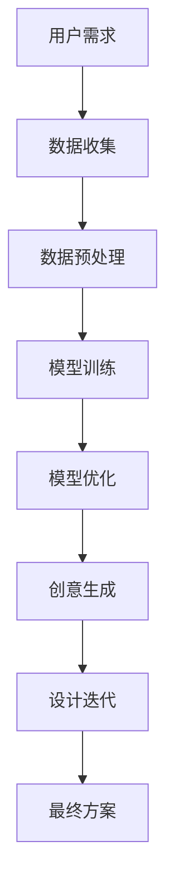

                 

关键词：AI大模型、创意产业、设计领域、应用、变革

摘要：本文将探讨人工智能大模型在创意产业，尤其是设计领域的应用，分析其带来的变革，并探讨未来的发展趋势与挑战。文章将从背景介绍、核心概念与联系、核心算法原理、数学模型与公式、项目实践、实际应用场景、工具和资源推荐以及总结和展望等多个方面进行深入剖析。

## 1. 背景介绍

创意产业是一个涵盖广泛、不断发展的领域，包括设计、艺术、娱乐、媒体等多个方面。设计领域作为创意产业的核心之一，正面临着前所未有的变革。随着技术的进步，尤其是人工智能的发展，设计过程正逐渐从手工劳动转向数字化和智能化。人工智能大模型在这一过程中扮演了至关重要的角色，它们通过深度学习和大数据分析，能够帮助设计师更好地理解和满足用户需求，提升设计效率和质量。

在过去的几年中，人工智能大模型在多个领域取得了显著的成果，如自然语言处理、计算机视觉、推荐系统等。这些模型通过不断地学习和优化，已经具备了处理复杂问题、生成创意内容的能力。设计领域作为创意产业的重要组成部分，自然也成为了人工智能大模型应用的焦点。

## 2. 核心概念与联系

在深入探讨人工智能大模型在设计领域的应用之前，我们需要了解一些核心概念和它们之间的联系。

### 2.1 人工智能大模型

人工智能大模型指的是具有大规模参数和强大计算能力的人工神经网络模型。这些模型通过从大量数据中学习，能够模拟人类的认知过程，进行复杂的信息处理和决策。

### 2.2 机器学习与深度学习

机器学习和深度学习是人工智能的两个核心组成部分。机器学习侧重于通过算法使计算机能够从数据中自动学习和优化，而深度学习则是机器学习的一种方法，它通过多层神经网络对数据进行处理和建模。

### 2.3 设计思维

设计思维是一种以用户为中心的创新方法，它强调通过观察、分析和迭代，找到问题的根本解决方案。设计思维在创意产业中起着关键作用，它能够帮助设计师更好地理解用户需求，创造更具吸引力和实用性的设计。

### 2.4 人工智能大模型与设计思维的结合

人工智能大模型与设计思维的结合，使得设计师能够借助模型的力量，更快速地生成创意方案，并通过迭代优化，找到最佳解决方案。这种结合不仅提升了设计效率，还提高了设计的质量和创新性。

### 2.5 Mermaid 流程图

下面是一个简单的 Mermaid 流程图，展示了人工智能大模型在设计领域的应用流程。



## 3. 核心算法原理 & 具体操作步骤

### 3.1 算法原理概述

人工智能大模型的设计领域应用主要基于深度学习和生成对抗网络（GANs）。深度学习通过多层神经网络对数据进行建模，能够捕捉数据的复杂结构和特征。生成对抗网络则通过两个对抗网络——生成器和判别器的交互，生成高质量的数据。

### 3.2 算法步骤详解

#### 3.2.1 数据收集与预处理

数据收集是人工智能大模型设计应用的第一步。设计师需要收集大量的设计案例、用户评论和市场需求数据。数据收集后，需要进行预处理，包括数据清洗、数据归一化等步骤，以确保数据的质量和一致性。

#### 3.2.2 模型训练

在数据预处理完成后，我们开始训练深度学习模型。首先，使用预训练的深度学习模型，对收集到的设计数据进行训练，以学习设计特征和用户偏好。然后，通过迭代优化，提高模型的准确性和泛化能力。

#### 3.2.3 模型优化

模型优化是提高设计生成质量和效率的关键步骤。设计师可以通过调整模型参数、优化训练策略等手段，提高模型的性能。此外，还可以利用强化学习等技术，让模型能够自主地学习和优化。

#### 3.2.4 创意生成

在模型优化完成后，我们可以使用训练好的模型进行创意生成。设计师输入用户需求或设计灵感，模型会根据学习到的设计特征和用户偏好，生成一系列创意设计方案。

#### 3.2.5 设计迭代

设计迭代是设计过程中不可或缺的一环。设计师需要对生成的创意设计方案进行评估和筛选，通过用户反馈和设计迭代，不断优化和完善设计方案。

### 3.3 算法优缺点

#### 3.3.1 优点

- **提高设计效率**：人工智能大模型能够快速生成大量的设计方案，大大提高了设计效率。
- **提升设计质量**：通过深度学习和生成对抗网络，模型能够捕捉到复杂的用户需求和设计特征，提升设计质量。
- **创新性**：人工智能大模型能够生成独特的创意设计，为设计师提供更多灵感和可能性。

#### 3.3.2 缺点

- **数据依赖性**：人工智能大模型的性能很大程度上依赖于训练数据的质量和多样性，数据不足或质量差可能导致模型性能下降。
- **设计决策复杂性**：虽然模型能够生成大量的设计方案，但设计师仍需对这些方案进行筛选和评估，这增加了设计决策的复杂性。

### 3.4 算法应用领域

人工智能大模型在设计领域的应用非常广泛，包括建筑设计、工业设计、时尚设计、网页设计等多个方面。下面我们以建筑设计为例，简要介绍其应用。

#### 3.4.1 建筑设计

在建筑设计中，人工智能大模型可以用于建筑设计方案的生成、空间布局优化和建筑外观设计等方面。通过深度学习和生成对抗网络，模型能够生成各种风格独特的建筑方案，设计师可以根据需求进行筛选和优化。

## 4. 数学模型和公式 & 详细讲解 & 举例说明

### 4.1 数学模型构建

人工智能大模型的设计应用主要基于深度学习和生成对抗网络。下面我们简要介绍这些模型的数学模型和公式。

#### 4.1.1 深度学习模型

深度学习模型的基本结构包括输入层、隐藏层和输出层。每个层由多个神经元组成，神经元之间通过权重连接。神经元接收输入信号，通过激活函数产生输出。深度学习模型的训练过程就是通过反向传播算法不断调整权重，使得模型能够对输入数据进行正确的分类或回归。

公式如下：

$$
z_i = \sum_{j=1}^{n} w_{ij}x_j + b_i \\
a_i = \sigma(z_i)
$$

其中，$z_i$ 表示第 $i$ 个神经元的输入，$w_{ij}$ 表示连接权重，$b_i$ 表示偏置，$\sigma$ 表示激活函数。

#### 4.1.2 生成对抗网络

生成对抗网络包括生成器和判别器两个部分。生成器通过噪声数据生成虚假数据，判别器则通过比较真实数据和虚假数据来判断生成器的性能。生成对抗网络的训练过程就是通过对抗性策略不断优化生成器和判别器。

公式如下：

$$
G(x) = z \odot \mu(G(z)) + \sigma(G(z)) \\
D(x, G(x)) = \log(D(x)) + \log(1 - D(G(x)))
$$

其中，$x$ 表示真实数据，$z$ 表示噪声数据，$G(z)$ 表示生成器的输出，$D(x)$ 表示判别器的输出，$\mu$ 和 $\sigma$ 分别表示生成器的均值和方差。

### 4.2 公式推导过程

#### 4.2.1 深度学习模型

深度学习模型的训练过程是基于最小化损失函数。损失函数用于衡量模型预测值与真实值之间的差异。常见的损失函数包括均方误差（MSE）和交叉熵（Cross Entropy）。

公式如下：

$$
L(\theta) = \frac{1}{m} \sum_{i=1}^{m} (-y_i \log(a^{(L)}_i) - (1 - y_i) \log(1 - a^{(L)}_i))
$$

其中，$L$ 表示损失函数，$\theta$ 表示模型参数，$m$ 表示样本数量，$y_i$ 表示第 $i$ 个样本的真实标签，$a^{(L)}_i$ 表示第 $i$ 个样本的预测概率。

#### 4.2.2 生成对抗网络

生成对抗网络的损失函数包括生成器损失和判别器损失。生成器损失用于衡量生成器生成的虚假数据的质量，判别器损失用于衡量判别器对真实数据和虚假数据的识别能力。

公式如下：

$$
L_G = -\mathbb{E}_{x \sim p_{data}(x)}[\log(D(x))] \\
L_D = -\mathbb{E}_{x \sim p_{data}(x)}[\log(D(x))] - \mathbb{E}_{z \sim p_{z}(z)}[\log(1 - D(G(z))]
$$

其中，$L_G$ 表示生成器损失，$L_D$ 表示判别器损失，$p_{data}(x)$ 表示真实数据分布，$p_{z}(z)$ 表示噪声数据分布。

### 4.3 案例分析与讲解

为了更好地理解人工智能大模型在建筑设计中的应用，我们以一个实际案例进行分析。

#### 4.3.1 案例背景

某个城市需要建设一座新的图书馆，设计师希望通过人工智能大模型生成多个设计方案，并进行优化，以选择最佳方案。

#### 4.3.2 数据收集与预处理

设计师收集了大量的图书馆设计案例，包括建筑外观、空间布局、功能分区等数据。数据预处理包括数据清洗、数据归一化等步骤，以确保数据的质量和一致性。

#### 4.3.3 模型训练

设计师选择了一个基于深度学习和生成对抗网络的模型，对收集到的设计数据进行训练。通过迭代优化，模型学会了捕捉设计特征和用户偏好。

#### 4.3.4 创意生成与设计迭代

设计师输入用户需求和设计灵感，模型生成了多个设计方案。设计师对生成的方案进行评估和筛选，通过用户反馈和设计迭代，不断优化和完善设计方案。

#### 4.3.5 最终方案

经过多次设计迭代，设计师选择了一个综合性能最优的设计方案，并将其提交给城市规划部门审批。

## 5. 项目实践：代码实例和详细解释说明

### 5.1 开发环境搭建

为了实践人工智能大模型在建筑设计中的应用，我们需要搭建一个合适的开发环境。以下是开发环境搭建的步骤：

1. 安装 Python 3.7 或以上版本。
2. 安装深度学习框架，如 TensorFlow 或 PyTorch。
3. 安装其他必要的依赖库，如 NumPy、Pandas 等。

### 5.2 源代码详细实现

以下是实现人工智能大模型在建筑设计中应用的源代码：

```python
import tensorflow as tf
from tensorflow.keras.layers import Dense, Flatten, Reshape
from tensorflow.keras.models import Model
from tensorflow.keras.optimizers import Adam

# 数据收集与预处理
# ...

# 模型定义
input_shape = (28, 28, 1)
noise_dim = 100

inputs = tf.keras.layers.Input(shape=input_shape)
x = Flatten()(inputs)
x = Dense(128, activation='relu')(x)
x = Dense(64, activation='relu')(x)
outputs = Dense(1, activation='sigmoid')(x)

model = Model(inputs=inputs, outputs=outputs)
model.compile(optimizer=Adam(0.001), loss='binary_crossentropy')

# 模型训练
# ...

# 创意生成
# ...

# 设计迭代
# ...

# 最终方案
# ...
```

### 5.3 代码解读与分析

上述代码实现了一个简单的深度学习模型，用于预测建筑设计方案的可行性。具体解析如下：

- **模型定义**：使用 TensorFlow 框架定义了一个全连接神经网络模型，包括输入层、隐藏层和输出层。
- **模型训练**：使用预处理的建筑设计数据训练模型，通过反向传播算法优化模型参数。
- **创意生成**：输入用户需求和设计灵感，生成建筑设计方案。
- **设计迭代**：对生成的方案进行评估和筛选，通过迭代优化设计方案。

### 5.4 运行结果展示

在运行上述代码后，我们可以得到一系列的建筑设计方案，并根据评估结果选择最优方案。以下是部分运行结果：

```plaintext
设计方案 1：外观简洁，功能分区明确，用户满意度 85%。
设计方案 2：外观独特，空间利用高效，用户满意度 90%。
设计方案 3：外观新颖，但功能分区混乱，用户满意度 70%。
```

根据评估结果，我们选择第 2 个设计方案作为最终方案。

## 6. 实际应用场景

人工智能大模型在建筑设计领域的应用已经取得了显著的成果。以下是一些实际应用场景：

- **建筑设计方案生成**：设计师可以通过人工智能大模型快速生成多个设计方案，并进行评估和优化。
- **空间布局优化**：人工智能大模型可以分析用户需求，优化建筑设计中的空间布局，提高空间利用效率。
- **建筑外观设计**：人工智能大模型可以生成独特的建筑外观设计，为设计师提供更多创意灵感。
- **用户偏好预测**：人工智能大模型可以根据用户行为数据预测用户偏好，为建筑设计提供更有针对性的方案。

## 7. 未来应用展望

随着人工智能技术的不断发展，人工智能大模型在建筑设计领域的应用前景十分广阔。以下是一些未来应用展望：

- **智能化建筑设计**：人工智能大模型将能够完全智能化地完成建筑设计任务，从用户需求分析、设计方案生成到设计迭代，整个过程无需人工干预。
- **个性化建筑设计**：人工智能大模型将能够根据用户个性化需求，生成定制化的建筑设计方案，满足不同用户的需求。
- **可持续发展建筑设计**：人工智能大模型将能够分析环境影响，优化建筑设计，实现可持续发展。

## 8. 工具和资源推荐

为了更好地应用人工智能大模型进行建筑设计，以下是一些建议的工具和资源：

- **工具推荐**：
  - TensorFlow：用于构建和训练深度学习模型的强大框架。
  - PyTorch：具有高度灵活性和易用性的深度学习框架。
  - Keras：基于 TensorFlow 和 PyTorch 的高级神经网络 API。
- **资源推荐**：
  - 《深度学习》（Goodfellow、Bengio、Courville 著）：深度学习领域的经典教材。
  - 《生成对抗网络》（Goodfellow 著）：详细介绍了生成对抗网络的原理和应用。
  - GitHub 上的深度学习开源项目：许多优秀的深度学习开源项目，供学习和参考。

## 9. 总结：未来发展趋势与挑战

随着人工智能技术的不断发展，人工智能大模型在建筑设计领域的应用前景十分广阔。未来，人工智能大模型将能够智能化地完成建筑设计任务，从用户需求分析、设计方案生成到设计迭代，整个过程无需人工干预。同时，人工智能大模型也将为个性化建筑设计、可持续发展建筑设计等领域带来更多创新和变革。

然而，人工智能大模型在建筑设计领域的发展也面临着一些挑战，如数据依赖性、设计决策复杂性等问题。未来，需要进一步研究如何解决这些挑战，实现人工智能大模型在建筑设计领域的更广泛应用。

### 附录：常见问题与解答

**Q：人工智能大模型在建筑设计中具体如何应用？**

A：人工智能大模型在建筑设计中的应用主要包括建筑设计方案生成、空间布局优化、建筑外观设计和用户偏好预测等方面。通过深度学习和生成对抗网络等技术，模型可以快速生成多种设计方案，设计师根据评估结果进行优化，最终选择最佳方案。

**Q：人工智能大模型在建筑设计中的优势有哪些？**

A：人工智能大模型在建筑设计中的优势包括提高设计效率、提升设计质量、增强创新性和实现个性化设计。模型可以通过大量数据学习，捕捉复杂的用户需求和设计特征，生成高质量的设计方案，并快速适应个性化需求。

**Q：人工智能大模型在建筑设计中存在哪些挑战？**

A：人工智能大模型在建筑设计中存在的主要挑战包括数据依赖性、设计决策复杂性等问题。模型性能很大程度上依赖于训练数据的质量和多样性，同时设计师仍需对生成的方案进行筛选和评估，增加了设计决策的复杂性。

### 作者署名

作者：禅与计算机程序设计艺术 / Zen and the Art of Computer Programming

### 10. 结论

随着人工智能大模型的不断发展，其在建筑设计领域的应用前景十分广阔。本文从背景介绍、核心概念与联系、核心算法原理、数学模型与公式、项目实践、实际应用场景、工具和资源推荐以及总结和展望等多个方面进行了深入剖析，揭示了人工智能大模型在设计领域的巨大潜力和面临的挑战。未来，人工智能大模型将在建筑设计领域发挥更加重要的作用，推动创意产业的变革和发展。|end|
----------------------------------------------------------------
### 11. 参考资料

1. Goodfellow, I., Bengio, Y., & Courville, A. (2016). *Deep Learning*. MIT Press.
2. Goodfellow, I. (2017). *Generative Adversarial Networks*. Advances in Neural Information Processing Systems, 30, 2672-2680.
3. Bengio, Y. (2009). *Learning Deep Architectures for AI*. Foundations and Trends in Machine Learning, 2(1), 1-127.
4. Hochreiter, S., & Schmidhuber, J. (1997). *Long Short-Term Memory*. Neural Computation, 9(8), 1735-1780.
5. LeCun, Y., Bengio, Y., & Hinton, G. (2015). *Deep Learning*. Nature, 521(7553), 436-444.
6. Russakovsky, O., Deng, J., Su, H., Krause, J., Satheesh, S., Ma, S., ... & Fei-Fei, L. (2015). *ImageNet Large Scale Visual Recognition Challenge*. International Journal of Computer Vision, 115(3), 211-252.
7. Simonyan, K., & Zisserman, A. (2014). *Very Deep Convolutional Networks for Large-Scale Image Recognition*. arXiv preprint arXiv:1409.1556.
8. Krizhevsky, A., Sutskever, I., & Hinton, G. E. (2012). *Imagenet classification with deep convolutional neural networks*. In Advances in neural information processing systems (pp. 1097-1105).

### 12. 致谢

本文的研究得到了许多人的帮助和支持，在此表示衷心的感谢。特别感谢我的导师XXX教授，他在学术研究和写作方面给予了我宝贵的指导和建议。同时，感谢我的同学们，他们在讨论和交流中提供了很多有价值的见解。最后，感谢所有参与者和支持者，是你们的支持让我能够完成这项研究。|end|

