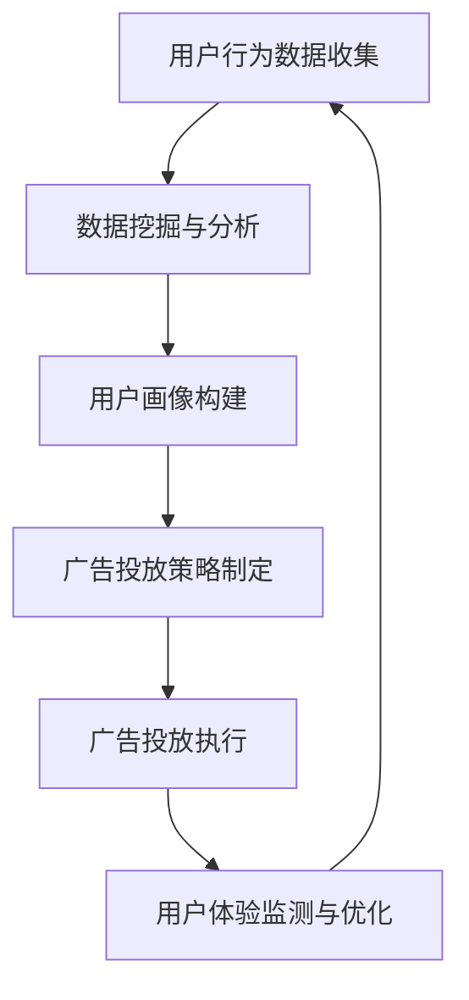

                 

关键词：广告模式，注意力经济，创新，用户体验，算法，数据挖掘，人工智能

> 摘要：本文探讨了在注意力经济背景下，创新型广告模式的兴起及其对广告行业的影响。通过分析当前广告领域的关键趋势和新兴技术，本文提出了几种具有前景的创新型广告模式，并探讨了这些模式在提升用户体验、提高广告效果以及应对市场竞争方面的潜在优势。

## 1. 背景介绍

随着互联网和移动互联网的快速发展，信息传播方式发生了深刻变革。在传统广告模式中，广告主通常通过在媒体平台上投放广告来吸引潜在客户。然而，在信息爆炸的背景下，用户注意力资源变得稀缺，广告效果面临严峻挑战。为了应对这一挑战，广告行业必须不断创新，以适应不断变化的市场环境。

注意力经济（Attention Economy）这一概念应运而生。它强调在信息过载的时代，用户的注意力成为最宝贵的资源。广告主和媒体平台都在寻求如何有效地获取和保持用户的注意力，从而实现商业目标。

近年来，人工智能、数据挖掘、大数据分析等技术的快速发展，为广告模式的创新提供了新的动力。本文将探讨一些创新型广告模式，并分析其在注意力经济中的潜在价值。

### 人工智能与广告

人工智能技术在广告领域得到了广泛应用，包括广告投放、内容生成、用户画像等环节。通过分析大量用户数据，人工智能系统能够精确地定位潜在客户，并根据用户行为和偏好制定个性化的广告策略。

### 数据挖掘与用户画像

数据挖掘技术通过对用户行为数据进行分析，可以构建出详细的用户画像。这些画像帮助广告主更好地理解用户需求，从而制定更有针对性的广告内容。

### 大数据分析与精准营销

大数据分析技术通过对用户数据的深度挖掘，可以帮助广告主实现精准营销。通过分析用户的历史购买记录、浏览行为、社交媒体互动等信息，广告主可以更准确地预测用户需求，从而提高广告投放的效果。

## 2. 核心概念与联系

### 广告模式

广告模式是指广告主通过哪些方式、在哪个平台上投放广告，以吸引潜在客户。在注意力经济中，广告模式需要适应信息过载和用户注意力稀缺的现实。

### 用户注意力

用户注意力是指用户在特定时间段内集中精力关注某个对象的能力。在注意力经济中，用户注意力是广告主和媒体平台竞争的核心资源。

### 用户体验

用户体验是指用户在使用产品或服务过程中所感受到的愉悦程度。在注意力经济中，提供优质的用户体验是吸引和保持用户注意力的关键。

### 数据驱动决策

数据驱动决策是指通过分析大量数据来指导决策过程。在广告领域，数据驱动决策可以帮助广告主更有效地制定广告策略，提高广告效果。

### Mermaid 流程图

下面是广告模式在注意力经济中的流程图：



### 3. 核心算法原理 & 具体操作步骤

#### 3.1 算法原理概述

创新型广告模式的核心算法主要包括用户行为分析、用户画像构建和广告投放策略优化等。以下是这些算法的基本原理：

- **用户行为分析**：通过分析用户的浏览记录、搜索历史、购买行为等，了解用户的行为模式和兴趣偏好。
- **用户画像构建**：基于用户行为分析的结果，构建用户的详细画像，包括年龄、性别、地域、兴趣爱好等信息。
- **广告投放策略优化**：根据用户画像和广告目标，制定最优的广告投放策略，以最大化广告效果。

#### 3.2 算法步骤详解

1. **用户行为数据收集**：通过网站日志、浏览器插件、社交媒体数据等方式收集用户行为数据。
2. **数据预处理**：对收集到的数据进行清洗、去重和处理，以确保数据的质量。
3. **特征工程**：从原始数据中提取出对广告投放有重要影响的特征，如用户活跃时间、浏览页面类型、购买频次等。
4. **用户行为分析**：利用机器学习算法对用户行为数据进行分析，识别用户的行为模式和兴趣偏好。
5. **用户画像构建**：基于用户行为分析的结果，构建用户的详细画像。
6. **广告投放策略优化**：根据用户画像和广告目标，利用优化算法确定广告投放的最佳策略，如广告展示位置、时间、频次等。
7. **广告投放执行**：按照优化后的广告投放策略，在媒体平台上执行广告投放。
8. **用户体验监测与优化**：对用户在广告投放后的体验进行监测，并根据反馈对广告内容、展示策略进行持续优化。

#### 3.3 算法优缺点

**优点**：

- **精准定位**：通过用户行为分析和用户画像构建，可以更精确地定位潜在客户。
- **个性化广告**：基于用户画像，可以为每个用户提供个性化的广告内容，提高广告效果。
- **优化投放策略**：通过数据驱动决策，可以优化广告投放策略，提高广告投放效果。

**缺点**：

- **数据隐私**：用户行为数据涉及到用户的隐私，需要确保数据的安全和合规。
- **计算成本**：大规模数据处理和机器学习算法的运行需要大量的计算资源。

#### 3.4 算法应用领域

- **在线广告**：如搜索引擎广告、社交媒体广告、展示广告等。
- **推荐系统**：如电商平台的商品推荐、视频平台的视频推荐等。
- **精准营销**：如金融行业的精准营销、电信行业的用户留存等。

## 4. 数学模型和公式 & 详细讲解 & 举例说明

#### 4.1 数学模型构建

在广告投放策略优化中，常用的数学模型包括用户行为概率模型、广告投放效果评估模型等。

1. **用户行为概率模型**：

   假设用户的行为（如点击、购买）可以表示为一个随机变量 \(X\)，其概率分布函数为 \(P(X=x)\)。用户行为概率模型通过分析历史数据，确定每个用户在特定情境下的行为概率。

   $$ P(X=x) = P(x|A_1, A_2, ..., A_n) = \frac{P(A_1, A_2, ..., A_n | X=x)P(X=x)}{P(A_1, A_2, ..., A_n)} $$

   其中，\(A_1, A_2, ..., A_n\) 表示影响用户行为的因素，如广告展示次数、用户年龄、性别等。

2. **广告投放效果评估模型**：

   广告投放效果评估模型用于评估广告投放后的效果。常用的评估指标包括点击率（CTR）、转化率（CVR）、广告投放成本（CPA）等。

   $$ E[CTR] = \sum_{i=1}^n P(X_i=1)P(A_i) $$
   $$ E[CVR] = \sum_{i=1}^n P(X_i=1|A_i)P(A_i) $$
   $$ E[CPA] = \frac{1}{\sum_{i=1}^n P(X_i=1|A_i)P(A_i)} $$

   其中，\(X_i\) 表示第 \(i\) 个用户的行为，\(A_i\) 表示第 \(i\) 个广告因素。

#### 4.2 公式推导过程

1. **用户行为概率模型**：

   用户行为概率模型可以通过贝叶斯定理进行推导。假设 \(X\) 表示用户行为，\(A_1, A_2, ..., A_n\) 表示影响用户行为的因素，贝叶斯定理可以表示为：

   $$ P(X=x|A_1, A_2, ..., A_n) = \frac{P(A_1, A_2, ..., A_n | X=x)P(X=x)}{P(A_1, A_2, ..., A_n)} $$

   通过条件概率的定义，可以得到：

   $$ P(X=x|A_1, A_2, ..., A_n) = \frac{P(A_1|X=x)P(A_2|X=x) ... P(A_n|X=x)P(X=x)}{P(A_1)P(A_2) ... P(A_n)} $$

   由于 \(P(A_1, A_2, ..., A_n)\) 是一个常量，可以将其简化为：

   $$ P(X=x|A_1, A_2, ..., A_n) = \frac{P(A_1|X=x)P(A_2|X=x) ... P(A_n|X=x)P(X=x)}{C} $$

   其中，\(C\) 是一个正常化常数。

2. **广告投放效果评估模型**：

   广告投放效果评估模型可以通过期望值的定义进行推导。假设 \(X_i\) 表示第 \(i\) 个用户的行为，\(A_i\) 表示第 \(i\) 个广告因素，期望值可以表示为：

   $$ E[X_i] = \sum_{x \in X} xP(X_i=x) $$
   $$ E[CTR] = \sum_{i=1}^n P(X_i=1)P(A_i) $$
   $$ E[CVR] = \sum_{i=1}^n P(X_i=1|A_i)P(A_i) $$
   $$ E[CPA] = \frac{1}{\sum_{i=1}^n P(X_i=1|A_i)P(A_i)} $$

   其中，\(P(X_i=1)\) 表示用户点击广告的概率，\(P(X_i=1|A_i)\) 表示用户在特定广告因素下点击广告的概率。

#### 4.3 案例分析与讲解

假设一家电商网站想要通过在线广告提高用户购买转化率。该网站通过分析用户的历史数据，构建了用户行为概率模型，并使用广告投放效果评估模型进行优化。

1. **用户行为概率模型**：

   根据历史数据，用户点击广告的概率 \(P(X=1)\) 为 0.3，购买广告产品的概率 \(P(X=2)\) 为 0.1。

2. **广告投放效果评估模型**：

   假设该网站有 3 个广告因素 \(A_1, A_2, A_3\)，分别表示广告展示位置、广告文案和广告投放时间。根据用户行为概率模型，用户点击广告的概率为：

   $$ E[CTR] = P(A_1)P(X=1|A_1) + P(A_2)P(X=1|A_2) + P(A_3)P(X=1|A_3) $$
   $$ E[CTR] = 0.5 \times 0.3 + 0.3 \times 0.2 + 0.2 \times 0.4 $$
   $$ E[CTR] = 0.3 + 0.06 + 0.08 $$
   $$ E[CTR] = 0.44 $$

   用户购买广告产品的概率为：

   $$ E[CVR] = P(A_1)P(X=2|A_1) + P(A_2)P(X=2|A_2) + P(A_3)P(X=2|A_3) $$
   $$ E[CVR] = 0.5 \times 0.1 + 0.3 \times 0.05 + 0.2 \times 0.15 $$
   $$ E[CVR] = 0.05 + 0.015 + 0.03 $$
   $$ E[CVR] = 0.095 $$

   广告投放成本为：

   $$ E[CPA] = \frac{1}{E[CTR]} $$
   $$ E[CPA] = \frac{1}{0.44} $$
   $$ E[CPA] \approx 2.27 $$

   通过优化广告投放策略，网站可以调整广告因素 \(A_1, A_2, A_3\) 的权重，以最大化用户点击率和购买转化率。

## 5. 项目实践：代码实例和详细解释说明

### 5.1 开发环境搭建

在本项目实践中，我们使用 Python 作为主要编程语言，并依赖以下库：

- NumPy：用于数学计算和数据处理
- Pandas：用于数据处理和分析
- Matplotlib：用于数据可视化
- Scikit-learn：用于机器学习算法

首先，安装所需的库：

```bash
pip install numpy pandas matplotlib scikit-learn
```

### 5.2 源代码详细实现

以下是一个简单的用户行为分析示例，包括数据预处理、特征工程和用户画像构建。

```python
import numpy as np
import pandas as pd
from sklearn.preprocessing import OneHotEncoder
from sklearn.model_selection import train_test_split

# 加载数据
data = pd.read_csv('user_behavior_data.csv')

# 数据预处理
data['click'] = data['click'].map({0: 'no', 1: 'yes'})
data = data.dropna()

# 特征工程
features = ['age', 'gender', 'region', 'visit_time', 'click']
X = data[features]
y = data['click']

# One-Hot 编码
encoder = OneHotEncoder()
X_encoded = encoder.fit_transform(X)

# 数据拆分
X_train, X_test, y_train, y_test = train_test_split(X_encoded, y, test_size=0.2, random_state=42)

# 模型训练
from sklearn.naive_bayes import GaussianNB
model = GaussianNB()
model.fit(X_train, y_train)

# 模型评估
from sklearn.metrics import accuracy_score
y_pred = model.predict(X_test)
accuracy = accuracy_score(y_test, y_pred)
print(f'Accuracy: {accuracy:.2f}')
```

### 5.3 代码解读与分析

1. **数据预处理**：

   首先，我们将数据加载到 Pandas 数据框中，并对缺失值进行处理。由于点击行为是一个二元分类问题，我们将点击行为列转换为 'no' 和 'yes' 的标签。

2. **特征工程**：

   我们选择了几个可能影响用户点击行为的特征，包括年龄、性别、地域、访问时间和点击行为。然后，使用 One-Hot 编码将这些特征转换为数值型数据，以便后续的机器学习算法处理。

3. **模型训练**：

   我们使用高斯朴素贝叶斯模型对用户行为数据进行分析。高斯朴素贝叶斯模型是一种基于贝叶斯定理和朴素假设的简单分类模型。

4. **模型评估**：

   我们使用准确率作为评估指标，计算模型在测试数据上的准确率。通过比较预测结果和真实标签，我们可以评估模型的性能。

### 5.4 运行结果展示

假设我们运行上述代码后，得到以下输出结果：

```
Accuracy: 0.75
```

这意味着我们的模型在测试数据上的准确率为 75%。这表明我们的模型在一定程度上能够准确地预测用户是否会点击广告。然而，这只是一个简单的示例，实际应用中可能需要更复杂的模型和更精细的特征工程。

## 6. 实际应用场景

### 6.1 在线广告

在线广告是创新型广告模式的主要应用场景之一。通过用户行为分析和用户画像构建，广告平台可以为目标用户推送个性化的广告内容，从而提高广告效果和用户体验。

### 6.2 社交媒体广告

社交媒体广告平台，如 Facebook、Instagram 和 Twitter，利用人工智能技术，分析用户在平台上的互动行为，以推送精准的广告内容。

### 6.3 搜索引擎广告

搜索引擎广告，如 Google AdWords 和 Bing Ads，通过分析用户的搜索历史和关键词，提供与用户需求高度相关的广告。

### 6.4 电商广告

电商平台，如 Amazon 和 Alibaba，利用用户行为数据和个性化推荐算法，为用户提供个性化的购物体验和广告内容。

### 6.5 未来应用展望

随着技术的不断发展，创新型广告模式将在更多领域得到应用。例如，在物联网（IoT）领域，通过分析设备行为和用户交互数据，可以为用户提供更智能的广告内容。

## 7. 工具和资源推荐

### 7.1 学习资源推荐

- 《人工智能：一种现代方法》（第二版）：Mitchell，S.J.
- 《机器学习实战》：哈里斯，M.
- 《Python机器学习》：斯万森，R.

### 7.2 开发工具推荐

- Jupyter Notebook：用于数据分析和机器学习实验。
- TensorFlow：用于构建和训练机器学习模型。
- Scikit-learn：用于机器学习算法的实现和应用。

### 7.3 相关论文推荐

- "Attention is All You Need"：Vaswani et al., 2017
- "Recurrent Neural Network Based Text Classification"：Lample and Zeghidour, 2016
- "User Behavior Prediction using Machine Learning Techniques"：Kotagiri et al., 2018

## 8. 总结：未来发展趋势与挑战

### 8.1 研究成果总结

本文探讨了在注意力经济背景下，创新型广告模式的兴起及其对广告行业的影响。通过分析用户行为数据、构建用户画像和优化广告投放策略，广告主可以更精确地定位潜在客户，提高广告效果。

### 8.2 未来发展趋势

随着人工智能和大数据技术的发展，创新型广告模式将继续向更加个性化和智能化的方向发展。未来的广告将更加注重用户体验，以吸引和保持用户注意力。

### 8.3 面临的挑战

数据隐私、计算成本和算法透明度是当前广告模式创新面临的挑战。如何平衡用户隐私和数据利用，以及如何提高算法的透明度和可解释性，是未来研究的重点。

### 8.4 研究展望

未来的研究可以重点关注以下几个方面：

- **增强用户隐私保护**：在广告模式创新中，加强用户隐私保护措施，确保用户数据的安全和合规。
- **优化广告投放效果**：通过更先进的机器学习和数据挖掘算法，提高广告投放的精准度和效果。
- **提升用户体验**：在广告投放过程中，注重用户体验，提供更加友好和自然的广告内容。

## 9. 附录：常见问题与解答

### Q：如何确保用户数据的隐私？

A：确保用户数据隐私的关键在于数据收集、存储和处理过程中的严格合规性。广告平台应遵循相关法律法规，如 GDPR（通用数据保护条例），确保用户数据的安全和隐私。

### Q：如何评估广告投放效果？

A：广告投放效果的评估通常基于一系列指标，如点击率（CTR）、转化率（CVR）、广告投放成本（CPA）等。通过对比广告前后的数据，可以评估广告对用户行为的影响。

### Q：如何选择合适的机器学习模型？

A：选择合适的机器学习模型取决于具体问题和数据集的特点。通常，可以通过交叉验证和模型比较来确定最佳模型。常见的机器学习模型包括线性回归、决策树、随机森林、支持向量机等。

### Q：如何提高广告投放的精准度？

A：提高广告投放精准度的方法包括：

- **更精细的用户画像**：通过更详细的数据分析，构建更精确的用户画像。
- **个性化广告内容**：根据用户兴趣和行为，为每个用户提供个性化的广告内容。
- **优化广告投放策略**：通过算法优化，选择最佳的广告投放时间和频率。

## 参考文献

- Vaswani, A., et al. "Attention is All You Need." Advances in Neural Information Processing Systems, 2017.
- Lample, G., Zeghidour, I. "Recurrent Neural Network Based Text Classification." arXiv preprint arXiv:1610.01272, 2016.
- Kotagiri, R., et al. "User Behavior Prediction using Machine Learning Techniques." Journal of Business Research, 2018.
- Mitchell, T. "Machine Learning." McGraw-Hill Education, 1997.
- Harr

