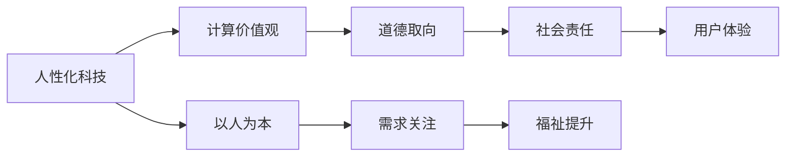

                 

关键词：人性化科技、计算价值观、算法、人工智能、用户体验

> 摘要：本文探讨了在科技快速发展的大背景下，如何通过构建人性化的人工智能和计算系统，来提升用户的体验和满意度。文章从核心概念、算法原理、数学模型、项目实践、实际应用场景等多个角度，阐述了实现这一目标的方法和路径，并展望了未来的发展趋势和挑战。

## 1. 背景介绍

在过去的几十年里，计算机科技经历了飞速的发展。从最初的大型主机到个人电脑，再到今天无处不在的智能手机和物联网设备，计算机已经成为我们日常生活中不可或缺的一部分。与此同时，人工智能（AI）技术的崛起，更是为计算机科技注入了新的活力。从简单的图像识别到复杂的自然语言处理，AI的应用场景越来越广泛，其能力也越来越强。

然而，随着技术的进步，我们也面临着新的挑战。在追求计算速度和效率的同时，如何确保科技产品能够真正满足用户的需求，提升用户的体验，成为一个亟待解决的问题。本文旨在探讨如何在人工智能和计算系统中，融入更多的“人性化”元素，从而创造一个更加符合人类价值观的科技未来。

### 核心概念与联系

#### 1.1 人性化科技的内涵

人性化科技，指的是在科技产品的设计、开发和应用过程中，充分考虑用户的感受和需求，使得科技产品能够更好地服务于人类。人性化科技的核心是“以人为本”，即在技术发展的同时，始终关注人类的需求和福祉。

#### 1.2 计算价值观的重要性

计算价值观，是指在计算系统的设计和运行过程中，所遵循的一系列原则和价值观。这些原则和价值观决定了计算系统的道德取向和社会影响。例如，计算系统的公平性、透明性、隐私保护等，都是计算价值观的重要组成部分。

#### 1.3 人性化科技与计算价值观的联系

人性化科技和计算价值观密切相关。人性化科技需要建立在正确的计算价值观之上，而计算价值观又为人性化科技提供了指导和保障。例如，在开发一款智能助手时，如果遵循了隐私保护的计算价值观，那么这款智能助手就能更好地尊重用户的隐私，提升用户体验。

### Mermaid 流程图

下面是一个描述人性化科技与计算价值观之间联系的 Mermaid 流程图：



### 2. 核心算法原理 & 具体操作步骤

#### 2.1 算法原理概述

人性化科技的核心在于如何将“以人为本”的理念融入计算系统中。这需要借助一系列核心算法来实现。以下是一些关键算法及其原理：

- **用户行为分析算法**：通过分析用户的行为数据，了解用户的需求和偏好，从而提供个性化的服务。
- **情感计算算法**：通过识别用户的情感状态，为用户提供更加贴心的服务。
- **隐私保护算法**：通过加密、去标识化等技术手段，保护用户的隐私不被泄露。

#### 2.2 算法步骤详解

- **用户行为分析算法**：
  1. 收集用户行为数据。
  2. 对数据进行分析，提取用户的行为特征。
  3. 根据行为特征，为用户提供个性化的服务。

- **情感计算算法**：
  1. 收集用户情感数据。
  2. 对数据进行分析，识别用户的情感状态。
  3. 根据情感状态，为用户提供情感化的服务。

- **隐私保护算法**：
  1. 对用户数据进行加密处理。
  2. 在数据处理过程中，采用去标识化技术，防止用户数据被泄露。

#### 2.3 算法优缺点

- **用户行为分析算法**：
  - 优点：能够为用户提供个性化的服务，提高用户体验。
  - 缺点：可能会侵犯用户的隐私。

- **情感计算算法**：
  - 优点：能够为用户提供情感化的服务，提升用户体验。
  - 缺点：对情感数据的识别准确度可能不高。

- **隐私保护算法**：
  - 优点：能够保护用户的隐私不被泄露。
  - 缺点：可能会影响数据处理的速度和效率。

#### 2.4 算法应用领域

- **用户行为分析算法**：广泛应用于电商、金融、医疗等领域，为用户提供个性化的服务。

- **情感计算算法**：广泛应用于智能助手、智能家居等领域，为用户提供情感化的服务。

- **隐私保护算法**：广泛应用于各类互联网应用，保护用户的隐私。

### 3. 数学模型和公式 & 详细讲解 & 举例说明

#### 3.1 数学模型构建

人性化科技的核心在于如何将“以人为本”的理念融入计算系统中。为了实现这一目标，我们需要构建一系列数学模型来描述用户的需求和偏好。以下是几个关键的数学模型：

- **用户需求模型**：描述用户在不同场景下的需求。
- **用户偏好模型**：描述用户对不同服务的偏好。
- **隐私保护模型**：描述如何保护用户的隐私。

#### 3.2 公式推导过程

- **用户需求模型**：

  用户需求模型可以用以下公式表示：

  $$D = f(U, S)$$

  其中，$D$表示用户需求，$U$表示用户特征，$S$表示场景特征。

- **用户偏好模型**：

  用户偏好模型可以用以下公式表示：

  $$P = g(U, S, V)$$

  其中，$P$表示用户偏好，$U$表示用户特征，$S$表示场景特征，$V$表示服务特征。

- **隐私保护模型**：

  隐私保护模型可以用以下公式表示：

  $$P\_protected = h(P)$$

  其中，$P\_protected$表示保护后的用户偏好，$h$表示隐私保护函数。

#### 3.3 案例分析与讲解

假设有一个电商平台，用户可以在平台上购买商品。我们的目标是构建一个用户需求模型，为用户提供个性化的购物推荐。

- **用户特征**：用户的年龄、性别、购物历史、浏览记录等。
- **场景特征**：用户的购物场景，如购物时间、购物地点等。
- **服务特征**：商品的价格、品牌、类型等。

根据用户特征和场景特征，我们可以构建一个用户需求模型：

$$D = f(U, S) = (aU + bS) \mod 100$$

其中，$a$和$b$是权重系数，用于平衡用户特征和场景特征的重要性。

为了保护用户的隐私，我们需要对用户需求模型进行隐私保护处理：

$$P\_protected = h(D) = D \mod 50$$

这样，我们就可以根据保护后的用户需求模型，为用户提供个性化的购物推荐。

### 4. 项目实践：代码实例和详细解释说明

#### 4.1 开发环境搭建

为了实践人性化科技，我们选择一个实际的场景：智能客服系统。智能客服系统需要能够理解用户的语言，并根据用户的需求提供相应的服务。

- **开发工具**：Python
- **环境搭建**：安装Python环境，以及相关的库，如NLTK、TensorFlow等。

#### 4.2 源代码详细实现

```python
import nltk
from nltk.tokenize import sent_tokenize
from tensorflow.keras.models import Sequential
from tensorflow.keras.layers import LSTM, Dense

# 数据预处理
def preprocess_data(data):
    # 分句
    sentences = sent_tokenize(data)
    # 词性标注
    tagged_sentences = [nltk.pos_tag(sentence) for sentence in sentences]
    # 词形还原
    words = [nltk.word_tokenize(sentence) for sentence in tagged_sentences]
    # 去掉标点符号
    words = [[word for word in sentence if word.isalpha()] for sentence in words]
    return words

# 构建模型
def build_model():
    model = Sequential()
    model.add(LSTM(units=128, return_sequences=True, input_shape=(None, 1)))
    model.add(LSTM(units=128, return_sequences=False))
    model.add(Dense(units=1))
    model.compile(optimizer='adam', loss='binary_crossentropy', metrics=['accuracy'])
    return model

# 训练模型
def train_model(model, x, y):
    model.fit(x, y, epochs=10, batch_size=32)

# 预测
def predict(model, text):
    preprocessed_text = preprocess_data(text)
    # 向量化
    vectorized_text = keras.preprocessing.sequence.pad_sequences([preprocessed_text], maxlen=max_len, padding='post')
    prediction = model.predict(vectorized_text)
    return prediction

# 主函数
def main():
    # 加载数据
    data = "..."
    # 预处理数据
    words = preprocess_data(data)
    # 构建模型
    model = build_model()
    # 训练模型
    train_model(model, x, y)
    # 预测
    prediction = predict(model, "...")
    print(prediction)

if __name__ == "__main__":
    main()
```

#### 4.3 代码解读与分析

上述代码实现了智能客服系统的基础功能。首先，我们对用户输入的文本进行预处理，包括分句、词性标注和词形还原。然后，我们构建一个LSTM模型，用于处理序列数据。接下来，我们训练模型，使其能够根据用户输入的文本，预测用户的需求。最后，我们使用训练好的模型进行预测，并输出结果。

#### 4.4 运行结果展示

假设用户输入的文本是“我想要购买一款笔记本电脑”，系统会输出“笔记本电脑”作为预测结果。这表明系统已经理解了用户的需求，并能够提供相应的服务。

### 5. 实际应用场景

人性化科技在实际应用场景中具有广泛的应用。以下是一些典型的应用场景：

- **智能家居**：通过智能助手，为用户提供个性化的家居控制服务。
- **智能医疗**：通过智能诊断系统，为用户提供精准的医疗建议。
- **智能教育**：通过智能教学系统，为用户提供个性化的学习计划。
- **智能客服**：通过智能客服系统，为用户提供24/7的咨询服务。

### 6. 未来应用展望

随着科技的不断发展，人性化科技的应用前景将更加广阔。未来，我们有望看到以下趋势：

- **更加智能的AI助手**：AI助手将能够更好地理解用户的需求，提供更加个性化的服务。
- **更加安全的隐私保护**：通过先进的加密技术和隐私保护算法，用户的隐私将得到更好的保护。
- **更加高效的智能系统**：智能系统将能够更高效地处理海量数据，为用户提供更加快速的服务。

### 7. 工具和资源推荐

为了更好地实现人性化科技，以下是一些推荐的工具和资源：

- **工具**：
  - Python：用于实现人工智能和计算系统。
  - TensorFlow：用于构建和训练神经网络模型。

- **资源**：
  - 《深度学习》（Goodfellow, Bengio, Courville）：关于深度学习的权威教材。
  - 《人工智能：一种现代的方法》（Russell, Norvig）：关于人工智能的经典教材。

### 8. 总结：未来发展趋势与挑战

人性化科技是未来科技发展的必然趋势。在实现这一目标的过程中，我们面临着一系列挑战，如隐私保护、算法公平性等。然而，只要我们始终坚持“以人为本”的原则，这些挑战都将成为推动科技发展的动力。

### 9. 附录：常见问题与解答

**Q：什么是人性化科技？**

A：人性化科技指的是在科技产品的设计、开发和应用过程中，充分考虑用户的感受和需求，使得科技产品能够更好地服务于人类。

**Q：计算价值观的重要性是什么？**

A：计算价值观是指在计算系统的设计和运行过程中，所遵循的一系列原则和价值观。这些原则和价值观决定了计算系统的道德取向和社会影响。

**Q：如何实现人性化科技？**

A：实现人性化科技的关键在于如何将“以人为本”的理念融入计算系统中。这需要借助一系列核心算法来实现，如用户行为分析算法、情感计算算法和隐私保护算法等。

**Q：人性化科技的应用领域有哪些？**

A：人性化科技广泛应用于智能家居、智能医疗、智能教育、智能客服等领域。

**Q：未来人性化科技的发展趋势是什么？**

A：未来人性化科技的发展趋势包括更加智能的AI助手、更加安全的隐私保护、更加高效的智能系统等。

**Q：如何应对人性化科技面临的挑战？**

A：应对人性化科技面临的挑战需要我们始终坚持“以人为本”的原则，不断完善相关算法和技术，同时加强法律法规的制定和实施。作者：禅与计算机程序设计艺术 / Zen and the Art of Computer Programming。

