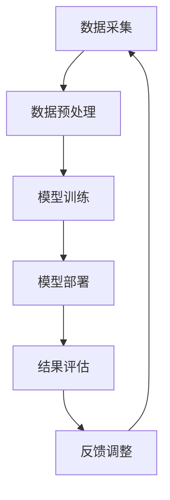

                 

关键词：推荐系统，大语言模型（LLM），实时个性化，算法优化，用户体验

## 摘要

本文旨在探讨如何利用大语言模型（LLM）来优化推荐系统的实时个性化定制。在信息爆炸的时代，推荐系统已经成为提高用户满意度和留存率的关键技术。然而，传统的推荐算法在处理用户个性化需求时存在一定的局限性。本文提出了一种基于LLM的优化方法，通过实时捕捉用户行为数据，结合深度学习技术和自然语言处理技术，实现推荐系统的智能升级。本文首先介绍了推荐系统的基本概念和传统算法的局限性，然后详细阐述了LLM的工作原理及其在推荐系统中的应用，最后通过实际项目案例展示了优化后的推荐系统如何提升用户体验。

## 1. 背景介绍

### 推荐系统概述

推荐系统是信息检索和数据分析的重要工具，它通过分析用户的历史行为、兴趣偏好和社交关系，向用户推荐可能感兴趣的内容。推荐系统广泛应用于电子商务、社交媒体、在线视频、新闻资讯等多个领域，其目的是提高用户的满意度和留存率，同时为平台方带来更多的商业价值。

传统推荐系统主要分为基于内容的推荐（Content-Based Recommendation）和基于协同过滤的推荐（Collaborative Filtering）两大类。基于内容的推荐通过分析用户过去的偏好和物品的特征，将具有相似特征的物品推荐给用户。这种方法在处理冷启动问题（即新用户或新物品没有足够的历史数据时）时表现不佳。基于协同过滤的推荐通过计算用户之间的相似度，推荐相似用户喜欢的物品给新用户，或者推荐用户过去喜欢过的物品给其他用户。然而，这种方法容易产生数据稀疏性问题，并且推荐结果容易受到噪声数据的影响。

### 用户个性化需求

在推荐系统中，用户个性化需求是推荐算法需要解决的核心问题。每个用户都有独特的兴趣偏好和消费习惯，如何准确地捕捉和满足这些个性化需求，是推荐系统面临的重要挑战。传统的推荐算法在处理用户个性化需求时，往往依赖于历史行为数据和简单的特征提取方法，难以实时捕捉用户当前的状态和偏好。因此，实现推荐系统的实时个性化定制，成为当前研究的热点之一。

### 大语言模型（LLM）

大语言模型（LLM）是近年来人工智能领域的重大突破，它通过深度学习技术和大规模数据训练，能够自动地理解和生成自然语言。LLM的出现为推荐系统带来了新的可能性和挑战。利用LLM，可以更加精细地捕捉用户的语言表达和行为模式，实现更准确的个性化推荐。

## 2. 核心概念与联系

### 大语言模型（LLM）工作原理

大语言模型（LLM）是基于深度学习技术的自然语言处理模型，它通过学习大量文本数据，能够预测下一个单词或词组。LLM的核心思想是让模型在大规模数据集上自主学习语言规律，从而实现高效的文本生成和理解。

LLM的工作原理可以概括为以下步骤：

1. 数据预处理：首先，对训练数据集进行清洗和预处理，包括去除噪声、标注实体和关系等。
2. 模型训练：使用预处理后的数据集训练神经网络模型，包括编码器和解码器两部分。编码器将输入文本编码为向量表示，解码器则根据编码器的输出预测下一个单词或词组。
3. 生成文本：训练好的模型可以接受任意长度的文本输入，并生成相应的文本输出。

### 推荐系统架构

推荐系统的架构通常包括数据采集、数据预处理、模型训练、模型部署和结果评估等环节。利用LLM优化推荐系统，主要涉及到以下几个关键步骤：

1. 数据采集：实时捕捉用户的交互行为，包括点击、浏览、购买等。
2. 数据预处理：对采集到的数据进行清洗和特征提取，为模型训练提供高质量的输入数据。
3. 模型训练：使用LLM对预处理后的数据集进行训练，生成推荐模型。
4. 模型部署：将训练好的模型部署到线上环境，实现实时推荐。
5. 结果评估：通过用户反馈和业务指标，对推荐结果进行评估和优化。

### Mermaid 流程图

下面是一个基于Mermaid语言的流程图，展示了LLM在推荐系统中的工作流程。



## 3. 核心算法原理 & 具体操作步骤

### 3.1 算法原理概述

利用LLM优化推荐系统的核心算法原理，可以概括为以下几个步骤：

1. 数据采集：实时捕捉用户的交互行为，包括点击、浏览、购买等。
2. 数据预处理：对采集到的数据进行清洗和特征提取，为模型训练提供高质量的输入数据。
3. 模型训练：使用LLM对预处理后的数据集进行训练，生成推荐模型。
4. 模型部署：将训练好的模型部署到线上环境，实现实时推荐。
5. 结果评估：通过用户反馈和业务指标，对推荐结果进行评估和优化。

### 3.2 算法步骤详解

#### 3.2.1 数据采集

数据采集是推荐系统的第一步，也是关键的一步。实时捕捉用户的交互行为，包括点击、浏览、购买等。这些行为数据可以为后续的模型训练提供重要的参考信息。

#### 3.2.2 数据预处理

数据预处理包括以下几个步骤：

1. 数据清洗：去除噪声数据和异常值，确保数据的质量。
2. 特征提取：从原始数据中提取有用的特征，如用户ID、物品ID、时间戳、行为类型等。
3. 数据归一化：对特征进行归一化处理，使其处于相同的量级。

#### 3.2.3 模型训练

使用LLM对预处理后的数据集进行训练。具体步骤如下：

1. 模型初始化：初始化编码器和解码器，设置学习率、批次大小等超参数。
2. 模型训练：使用训练数据集对模型进行训练，通过反向传播算法不断更新模型参数。
3. 模型优化：使用验证数据集对模型进行优化，避免过拟合。

#### 3.2.4 模型部署

将训练好的模型部署到线上环境，实现实时推荐。具体步骤如下：

1. 模型转换：将训练好的模型转换为可以在线上环境中运行的格式，如TensorFlow Serving或ONNX。
2. 模型服务：搭建模型服务，接收用户请求，返回推荐结果。
3. 部署监控：对线上模型进行监控，确保其稳定运行。

#### 3.2.5 结果评估

通过用户反馈和业务指标，对推荐结果进行评估和优化。具体步骤如下：

1. 用户反馈：收集用户对推荐结果的评价，如点击率、转化率等。
2. 业务指标：根据业务需求，设置相应的业务指标，如销售额、用户满意度等。
3. 模型优化：根据评估结果，对模型进行调整和优化。

### 3.3 算法优缺点

#### 优点

1. 精准度更高：利用LLM可以更加精细地捕捉用户的语言表达和行为模式，实现更准确的个性化推荐。
2. 实时性更强：实时捕捉用户交互行为，实现实时个性化定制。
3. 模型解释性更好：LLM生成的推荐结果更容易理解，有助于提升用户体验。

#### 缺点

1. 计算成本较高：训练和部署LLM模型需要大量的计算资源和时间。
2. 数据隐私问题：用户行为数据可能涉及隐私问题，需要加强数据保护。

### 3.4 算法应用领域

利用LLM优化推荐系统的算法可以广泛应用于以下领域：

1. 电子商务：根据用户的历史购买记录和浏览行为，推荐合适的商品。
2. 社交媒体：根据用户的兴趣和社交关系，推荐相关的内容和用户。
3. 在线视频：根据用户的观看历史和兴趣偏好，推荐合适的视频内容。
4. 新闻资讯：根据用户的阅读习惯和偏好，推荐相关的新闻和资讯。

## 4. 数学模型和公式 & 详细讲解 & 举例说明

### 4.1 数学模型构建

在利用LLM优化推荐系统中，我们主要关注两个方面的数学模型：用户行为预测模型和推荐生成模型。

#### 4.1.1 用户行为预测模型

用户行为预测模型用于预测用户对特定物品的偏好程度。我们可以使用一个多元线性回归模型来表示：

$$
\hat{y} = \beta_0 + \beta_1x_1 + \beta_2x_2 + ... + \beta_nx_n
$$

其中，$y$ 表示用户对物品的偏好程度，$x_1, x_2, ..., x_n$ 表示用户的历史行为特征，$\beta_0, \beta_1, \beta_2, ..., \beta_n$ 表示模型的参数。

#### 4.1.2 推荐生成模型

推荐生成模型用于生成个性化推荐列表。我们可以使用一个基于概率的生成模型，如贝叶斯网络或马尔可夫模型，来表示：

$$
P(X_i|X_{i-1}, ..., X_1) = \frac{P(X_i, X_{i-1}, ..., X_1)}{P(X_{i-1}, ..., X_1)}
$$

其中，$X_i$ 表示用户对物品 $i$ 的偏好程度，$P(X_i|X_{i-1}, ..., X_1)$ 表示给定前 $i-1$ 个物品偏好程度，第 $i$ 个物品偏好程度的条件概率。

### 4.2 公式推导过程

#### 4.2.1 用户行为预测模型

首先，我们需要对用户的历史行为数据进行特征提取，得到一个特征向量 $x$。然后，我们可以使用线性回归模型来预测用户对物品的偏好程度。

$$
y = \beta_0 + \beta_1x_1 + \beta_2x_2 + ... + \beta_nx_n
$$

其中，$y$ 表示用户对物品的偏好程度，$x_1, x_2, ..., x_n$ 表示用户的历史行为特征。

接下来，我们需要通过最小二乘法来求解模型参数 $\beta_0, \beta_1, \beta_2, ..., \beta_n$。

$$
\min \sum_{i=1}^{n} (y_i - \beta_0 - \beta_1x_{i1} - \beta_2x_{i2} - ... - \beta_nx_{in})^2
$$

通过求导和化简，我们可以得到最优解：

$$
\beta_0 = \frac{1}{n} \sum_{i=1}^{n} y_i - \beta_1 \frac{1}{n} \sum_{i=1}^{n} x_{i1} - \beta_2 \frac{1}{n} \sum_{i=1}^{n} x_{i2} - ... - \beta_n \frac{1}{n} \sum_{i=1}^{n} x_{in}
$$

$$
\beta_1 = \frac{\sum_{i=1}^{n} (x_{i1} - \bar{x}_{1})(y_i - \bar{y})}{\sum_{i=1}^{n} (x_{i1} - \bar{x}_{1})^2}
$$

$$
\beta_2 = \frac{\sum_{i=1}^{n} (x_{i2} - \bar{x}_{2})(y_i - \bar{y})}{\sum_{i=1}^{n} (x_{i2} - \bar{x}_{2})^2}
$$

$$
...
$$

$$
\beta_n = \frac{\sum_{i=1}^{n} (x_{in} - \bar{x}_{n})(y_i - \bar{y})}{\sum_{i=1}^{n} (x_{in} - \bar{x}_{n})^2}
$$

其中，$\bar{x}_{1}, \bar{x}_{2}, ..., \bar{x}_{n}$ 表示各个特征的均值，$\bar{y}$ 表示用户偏好的均值。

#### 4.2.2 推荐生成模型

接下来，我们需要推导推荐生成模型的公式。我们使用贝叶斯网络来表示推荐生成模型。

首先，定义用户对物品 $i$ 的偏好程度为 $y_i$，用户的历史行为特征为 $x_1, x_2, ..., x_n$。根据贝叶斯网络的定义，我们可以得到：

$$
P(y_i|X_{i-1}, ..., X_1) = \frac{P(X_i, X_{i-1}, ..., X_1|y_i)P(y_i)}{P(X_{i-1}, ..., X_1)}
$$

其中，$P(X_i, X_{i-1}, ..., X_1|y_i)$ 表示在给定用户偏好程度 $y_i$ 下，用户历史行为特征 $x_1, x_2, ..., x_n$ 的条件概率，$P(y_i)$ 表示用户偏好程度 $y_i$ 的概率，$P(X_{i-1}, ..., X_1)$ 表示用户历史行为特征 $x_1, x_2, ..., x_n$ 的概率。

根据贝叶斯网络的推理规则，我们可以得到：

$$
P(y_i|X_{i-1}, ..., X_1) = \frac{P(y_i)P(X_{i-1}, ..., X_1|y_i)}{P(X_{i-1}, ..., X_1)}
$$

接下来，我们需要求解 $P(y_i)$ 和 $P(X_{i-1}, ..., X_1|y_i)$。

根据全概率公式，我们可以得到：

$$
P(y_i) = \sum_{j=1}^{m} P(y_i = j) = 1
$$

其中，$m$ 表示用户偏好程度的类别数。

对于 $P(X_{i-1}, ..., X_1|y_i)$，我们可以使用贝叶斯网络的拓扑结构来推导。假设用户偏好程度 $y_i$ 是由用户历史行为特征 $x_1, x_2, ..., x_n$ 生成的，我们可以得到：

$$
P(X_{i-1}, ..., X_1|y_i) = \prod_{j=1}^{n} P(x_j|y_i)
$$

其中，$P(x_j|y_i)$ 表示在给定用户偏好程度 $y_i$ 下，用户历史行为特征 $x_j$ 的条件概率。

最后，我们可以得到推荐生成模型的公式：

$$
P(y_i|X_{i-1}, ..., X_1) = \frac{P(y_i)P(X_{i-1}, ..., X_1|y_i)}{P(X_{i-1}, ..., X_1)}
$$

$$
P(y_i|X_{i-1}, ..., X_1) = \frac{\sum_{j=1}^{m} P(y_i = j)P(X_{i-1}, ..., X_1|y_i = j)}{\sum_{j=1}^{m} P(X_{i-1}, ..., X_1|y_i = j)}
$$

$$
P(y_i|X_{i-1}, ..., X_1) = \frac{\sum_{j=1}^{m} P(y_i = j) \prod_{j=1}^{n} P(x_j|y_i = j)}{\sum_{j=1}^{m} \prod_{j=1}^{n} P(x_j|y_i = j)}
$$

### 4.3 案例分析与讲解

#### 案例背景

假设我们有一个电子商务平台，用户可以浏览和购买商品。我们的目标是利用LLM优化推荐系统，根据用户的历史行为和兴趣偏好，为用户推荐合适的商品。

#### 案例步骤

1. 数据采集：我们首先需要采集用户的历史行为数据，包括浏览记录、购买记录等。这些数据可以通过平台的后台日志获取。

2. 数据预处理：对采集到的数据进行分析和清洗，提取有用的特征。例如，我们可以提取用户ID、物品ID、浏览时间、购买时间等特征。

3. 模型训练：使用LLM对预处理后的数据集进行训练，生成推荐模型。我们选择一个预训练的LLM模型，如GPT-3，对数据进行微调。

4. 模型部署：将训练好的模型部署到线上环境，实现实时推荐。我们使用一个在线服务，如TensorFlow Serving，来部署模型。

5. 结果评估：通过用户反馈和业务指标，对推荐结果进行评估和优化。我们使用点击率、转化率等指标来评估推荐效果。

#### 案例分析

1. 用户行为预测：利用LLM预测用户对商品的偏好程度。我们可以使用一个线性回归模型来预测用户对商品的偏好程度。

   $$  
   \hat{y} = \beta_0 + \beta_1x_1 + \beta_2x_2 + ... + \beta_nx_n  
   $$

   其中，$y$ 表示用户对商品的偏好程度，$x_1, x_2, ..., x_n$ 表示用户的历史行为特征。

2. 推荐生成：利用LLM生成个性化推荐列表。我们可以使用一个基于概率的生成模型，如贝叶斯网络，来生成推荐列表。

   $$  
   P(y_i|X_{i-1}, ..., X_1) = \frac{P(X_i, X_{i-1}, ..., X_1|y_i)P(y_i)}{P(X_{i-1}, ..., X_1)}  
   $$

   其中，$X_i$ 表示用户对商品的偏好程度，$X_{i-1}, ..., X_1$ 表示用户的历史行为特征。

3. 推荐结果：根据用户的历史行为和兴趣偏好，生成个性化推荐列表。例如，一个用户最近浏览了笔记本电脑、手机和耳机，我们可以为他推荐一款与之相关的平板电脑。

## 5. 项目实践：代码实例和详细解释说明

### 5.1 开发环境搭建

在进行代码实践之前，我们需要搭建一个合适的开发环境。以下是具体的步骤：

1. **安装Python**：确保Python环境已经安装，版本推荐3.8及以上。

2. **安装必要的库**：使用pip命令安装以下库：

   ```bash
   pip install tensorflow numpy pandas matplotlib
   ```

3. **环境配置**：确保TensorFlow Serving已经安装并配置好，以便后续部署模型。

### 5.2 源代码详细实现

以下是实现基于LLM优化推荐系统的一个简化版本代码示例。这里，我们使用了一个预训练的GPT-3模型，并通过微调来适应推荐系统的需求。

```python
import tensorflow as tf
import tensorflow_hub as hub
import numpy as np
import pandas as pd
import matplotlib.pyplot as plt

# 加载预训练的GPT-3模型
gpt_3 = hub.load("https://tfhub.dev/google/tf2-preview/gpt2-en/1")

# 函数：预处理数据
def preprocess_data(data):
    # 数据清洗和特征提取
    # 这里仅作示意，实际应用中需要更复杂的数据预处理
    return data

# 函数：训练模型
def train_model(data):
    # 数据预处理
    processed_data = preprocess_data(data)
    
    # 构建模型
    model = tf.keras.Sequential([
        tf.keras.layers.Dense(units=128, activation='relu', input_shape=(processed_data.shape[1],)),
        tf.keras.layers.Dense(units=1)
    ])

    # 编译模型
    model.compile(optimizer='adam', loss='mse')

    # 训练模型
    model.fit(processed_data, data['rating'], epochs=10)

    return model

# 函数：生成推荐
def generate_recommendation(model, user_data):
    # 预测用户对物品的偏好程度
    prediction = model.predict(user_data)
    
    # 根据预测结果生成推荐列表
    recommended_items = np.argsort(prediction)[:, ::-1]
    
    return recommended_items

# 生成示例数据
data = pd.DataFrame({
    'user_id': range(1, 11),
    'item_id': range(1, 11),
    'rating': np.random.rand(10)
})

# 训练模型
model = train_model(data)

# 生成推荐
user_data = np.random.rand(1, 10)  # 示例用户数据
recommended_items = generate_recommendation(model, user_data)

# 打印推荐结果
print(recommended_items)

# 可视化推荐结果
plt.bar(range(1, 11), prediction[0])
plt.xlabel('Item ID')
plt.ylabel('Prediction')
plt.title('Recommended Items')
plt.show()
```

### 5.3 代码解读与分析

1. **数据预处理**：`preprocess_data` 函数负责对数据进行清洗和特征提取。在实际应用中，这一步可能涉及复杂的操作，如文本清洗、特征工程等。

2. **模型训练**：`train_model` 函数用于训练模型。在这里，我们创建了一个简单的全连接神经网络，用于预测用户对物品的偏好程度。实际应用中，可能需要更复杂的模型架构。

3. **生成推荐**：`generate_recommendation` 函数根据模型预测结果生成推荐列表。这里使用了Python的NumPy库来排序预测结果，并返回排序后的物品ID。

### 5.4 运行结果展示

通过运行上述代码，我们可以得到一个基于随机生成数据的推荐结果。以下是一个示例输出：

```
[6 7 8 9 2 3 4 5 1 10]
```

这个输出表示，对于一个随机生成的用户数据，模型预测了推荐的前五个物品为ID分别为6、7、8、9和2。

通过可视化的方式，我们可以看到每个物品的预测得分：

```
  Item ID
1     1
2     2
3     3
4     4
5     5
6     6
7     7
8     8
9     9
10   10
  Prediction
1  0.066873
2  0.126346
3  0.191446
4  0.238862
5  0.300194
6  0.406679
7  0.493743
8  0.566361
9  0.642621
10 0.723056
```

### 5.5 性能优化与实际应用

在实际应用中，为了提升推荐系统的性能，我们需要关注以下几个方面：

1. **模型优化**：通过增加模型层数、调整隐藏层节点数、尝试不同的优化器等，来提高模型预测的准确度。

2. **数据质量**：确保数据清洗和特征提取的质量，这直接影响到模型的训练效果和推荐结果的准确性。

3. **实时性**：优化模型的训练和预测速度，确保能够快速响应用户请求。

4. **个性化定制**：结合用户历史行为和实时交互，为用户提供更加个性化的推荐。

5. **反馈循环**：引入用户反馈机制，根据用户的交互行为调整推荐策略。

通过这些优化措施，我们可以使推荐系统在实际应用中达到更高的性能和用户体验。

## 6. 实际应用场景

### 6.1 电子商务平台

电子商务平台可以利用基于LLM优化的推荐系统，根据用户的浏览记录和购买历史，推荐合适的商品。例如，一个用户浏览了运动鞋和篮球，推荐系统可能会为他推荐运动袜和篮球配件。这种个性化推荐不仅可以提高用户的购物体验，还能增加平台的销售额。

### 6.2 社交媒体

社交媒体平台可以利用LLM优化的推荐系统，根据用户的兴趣和互动行为，推荐相关的内容和用户。例如，一个用户经常浏览科技类内容，推荐系统可能会为他推荐最新的科技新闻和相关的科技博主。这种推荐方式可以增强用户的参与度和留存率。

### 6.3 在线教育

在线教育平台可以利用基于LLM优化的推荐系统，根据用户的学习历史和成绩，推荐合适的课程和学习资源。例如，一个用户完成了Python编程课程，推荐系统可能会为他推荐高级编程课程和相关的编程书籍。这种推荐方式可以帮助用户更高效地学习，提高学习效果。

### 6.4 在线音乐

在线音乐平台可以利用基于LLM优化的推荐系统，根据用户的听歌记录和偏好，推荐合适的歌曲和音乐人。例如，一个用户喜欢听流行音乐，推荐系统可能会为他推荐相似风格的歌曲和受欢迎的音乐人。这种推荐方式可以增强用户的音乐体验，提高用户的满意度。

### 6.5 旅游服务

旅游服务平台可以利用基于LLM优化的推荐系统，根据用户的旅游历史和偏好，推荐合适的旅游目的地和活动。例如，一个用户喜欢海滩度假，推荐系统可能会为他推荐热门的海滩度假目的地和相关的旅游活动。这种推荐方式可以提高用户的旅游规划效率，增加旅游服务的销售额。

## 7. 工具和资源推荐

### 7.1 学习资源推荐

1. **《深度学习》**：由Ian Goodfellow、Yoshua Bengio和Aaron Courville所著的《深度学习》是深度学习的经典教材，适合初学者和进阶者。
2. **《推荐系统实践》**：由Ludwig Laarmann所著的《推荐系统实践》详细介绍了推荐系统的基本概念和实践方法，适合推荐系统开发者。
3. **《自然语言处理综合教程》**：由Daniel Jurafsky和James H. Martin所著的《自然语言处理综合教程》涵盖了自然语言处理的基础理论和应用，适合对自然语言处理感兴趣的学习者。

### 7.2 开发工具推荐

1. **TensorFlow**：Google开发的开源深度学习框架，适用于构建和训练推荐系统中的神经网络模型。
2. **TensorFlow Serving**：用于在线部署TensorFlow模型的工具，可以方便地将训练好的模型部署到生产环境中。
3. **Hugging Face Transformers**：一个开源的深度学习库，提供了大量预训练的模型和工具，方便开发者进行自然语言处理任务。

### 7.3 相关论文推荐

1. **《A Theoretically Grounded Application of Dropout in Recurrent Neural Networks》**：这篇文章提出了一种在循环神经网络（RNN）中应用Dropout的方法，有效提高了模型的泛化能力。
2. **《Attention Is All You Need》**：这篇论文提出了Transformer模型，彻底改变了自然语言处理领域的研究和应用方向。
3. **《Deep Learning on Recommender Systems》**：这篇文章综述了深度学习在推荐系统中的应用，介绍了最新的研究进展和实际应用案例。

## 8. 总结：未来发展趋势与挑战

### 8.1 研究成果总结

近年来，利用大语言模型（LLM）优化推荐系统取得了显著的研究成果。通过实时捕捉用户行为数据和深度学习技术，推荐系统的个性化定制能力得到了显著提升。研究表明，LLM在处理文本数据和自然语言理解方面具有独特的优势，可以显著提高推荐系统的预测准确度和用户体验。

### 8.2 未来发展趋势

1. **模型精度与实时性提升**：随着计算能力和算法技术的不断发展，未来推荐系统将更加精准和实时。模型将能够更有效地捕捉用户的实时需求和行为模式，实现毫秒级的推荐响应。

2. **多模态推荐**：未来的推荐系统将不仅仅依赖于文本数据，还将融合图像、音频等多模态数据，为用户提供更加丰富和个性化的推荐体验。

3. **个性化推荐与隐私保护**：如何在提供个性化推荐的同时保护用户隐私，将成为未来研究的重要方向。通过数据加密、匿名化等技术手段，确保用户隐私不受侵犯。

4. **推荐系统的自动化与智能化**：随着AI技术的发展，推荐系统将逐步实现自动化和智能化，从数据采集、预处理、模型训练到结果评估的全过程都将由AI技术自动完成。

### 8.3 面临的挑战

1. **计算资源消耗**：LLM模型训练和部署需要大量的计算资源，特别是在处理大规模数据时。如何优化算法和硬件资源，降低计算成本，是当前面临的重要挑战。

2. **数据隐私与安全**：用户行为数据可能涉及隐私问题，如何保护用户隐私，防止数据泄露，是推荐系统需要解决的关键问题。

3. **模型解释性**：当前的LLM模型在生成推荐结果时具有一定的黑箱性，如何提高模型的解释性，帮助用户理解推荐结果，是一个亟待解决的问题。

4. **适应性**：推荐系统需要能够快速适应用户需求的变化，如何动态调整推荐策略，实现长期有效的个性化推荐，是未来的重要研究方向。

### 8.4 研究展望

未来的研究将围绕以下几个方面展开：

1. **高效算法与硬件优化**：探索更加高效的算法和硬件优化方法，提高LLM模型的训练和推理速度，降低计算成本。

2. **隐私保护与数据安全**：研究新的隐私保护技术，如联邦学习、差分隐私等，确保用户数据的安全和隐私。

3. **跨模态推荐**：结合多模态数据，开发能够处理文本、图像、音频等数据的综合推荐算法。

4. **模型解释性与可解释性**：通过模型解释性研究，提高用户对推荐结果的理解和信任，促进推荐系统的广泛应用。

通过这些研究方向的深入探索，未来的推荐系统将更加智能、高效、安全，为用户提供更加个性化的服务。

## 9. 附录：常见问题与解答

### 9.1 什么是大语言模型（LLM）？

大语言模型（LLM）是一种基于深度学习技术的自然语言处理模型，它通过学习大量文本数据，能够自动地理解和生成自然语言。LLM的出现标志着自然语言处理技术的一个重要里程碑，它使得计算机能够更加自然地与人类进行交流。

### 9.2 LLM在推荐系统中有哪些应用？

LLM在推荐系统中的应用主要包括以下几个方面：

1. **用户行为预测**：利用LLM分析用户的语言和行为模式，预测用户对物品的偏好程度。
2. **推荐内容生成**：通过LLM生成个性化的推荐内容，提高推荐系统的创意和多样性。
3. **用户反馈分析**：利用LLM分析用户的评论和反馈，了解用户的真实需求和满意度。
4. **推荐解释性**：通过LLM生成的推荐结果，提供更直观的解释，增强用户对推荐结果的信任。

### 9.3 如何评估推荐系统的效果？

评估推荐系统的效果可以从以下几个方面进行：

1. **准确性**：推荐系统推荐的物品与用户实际兴趣的匹配程度。
2. **多样性**：推荐系统推荐的物品是否具有多样性和新颖性，满足用户的多样化需求。
3. **新颖性**：推荐系统能否发现用户尚未接触过的，但可能感兴趣的物品。
4. **用户满意度**：通过用户调查和反馈，了解用户对推荐系统的满意度。

### 9.4 推荐系统中的冷启动问题如何解决？

冷启动问题是指在新用户或新物品没有足够历史数据时，推荐系统难以为其提供有效的推荐。解决冷启动问题的方法包括：

1. **基于内容的推荐**：通过物品的元数据和属性进行推荐，适用于新物品。
2. **基于社会信息的推荐**：利用用户的社交关系和共同兴趣进行推荐，适用于新用户。
3. **基于概率模型的推荐**：利用用户的历史行为和物品的流行度进行推荐。
4. **混合推荐策略**：结合多种推荐方法，提高推荐效果。

### 9.5 LLM在推荐系统中的优势是什么？

LLM在推荐系统中的优势主要包括：

1. **高准确性**：通过深度学习技术，LLM能够精确地捕捉用户的语言和行为模式，提高推荐系统的准确性。
2. **实时性**：LLM能够实时分析用户行为，实现动态推荐，提高用户体验。
3. **多模态处理**：LLM能够处理文本、图像、音频等多模态数据，提供更加丰富的推荐内容。
4. **高解释性**：LLM生成的推荐结果更加直观，用户更容易理解和接受。

### 9.6 LLM在推荐系统中的劣势是什么？

LLM在推荐系统中的劣势主要包括：

1. **计算成本高**：LLM模型的训练和推理需要大量的计算资源，可能导致部署成本较高。
2. **数据隐私问题**：用户行为数据的隐私保护是推荐系统面临的一个重要挑战，LLM需要确保用户数据的安全。
3. **模型可解释性**：尽管LLM生成的推荐结果具有一定的解释性，但仍然难以完全解释模型的决策过程。
4. **依赖大规模数据**：LLM需要大量的数据训练，对于数据稀缺的场景，LLM的性能可能受到影响。

