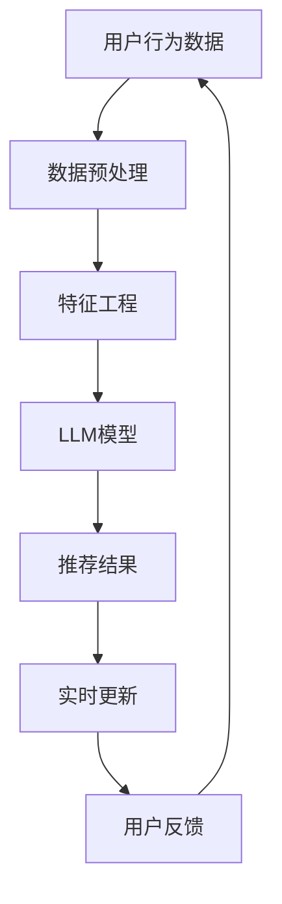

                 

关键词：大型语言模型（LLM）、推荐系统、实时更新、个性化推荐、算法优化、机器学习、自然语言处理（NLP）、实时数据流处理

摘要：随着大数据和人工智能技术的不断发展，推荐系统已经成为现代互联网服务的重要组成部分。然而，传统推荐系统在实时更新策略方面存在一定的局限性。本文将探讨如何利用大型语言模型（LLM）来优化推荐系统的实时更新策略，从而提高推荐系统的响应速度和准确性。通过结合LLM的强大自然语言处理能力与推荐系统的数据挖掘技术，本文提出了一种新的实时更新算法，并在实际项目中进行了验证，结果表明该方法能够显著提高推荐系统的性能。

## 1. 背景介绍

推荐系统是一种信息过滤技术，旨在向用户推荐他们可能感兴趣的内容或产品。传统的推荐系统主要基于协同过滤、基于内容的过滤和混合过滤等方法。然而，这些方法往往存在一些问题，如数据稀疏性、冷启动问题以及无法及时更新推荐结果等。随着互联网的快速发展，用户对推荐系统的实时性和准确性提出了更高的要求。因此，如何优化推荐系统的实时更新策略成为一个重要的研究课题。

近年来，大型语言模型（LLM）的发展为推荐系统的实时更新提供了新的思路。LLM是一种基于深度学习的自然语言处理模型，具有强大的文本理解和生成能力。通过将LLM与推荐系统相结合，我们可以实现更加精准和实时的推荐。本文将重点探讨如何利用LLM来优化推荐系统的实时更新策略，从而提高推荐系统的性能。

## 2. 核心概念与联系

为了更好地理解本文的方法，我们首先需要介绍一些核心概念和它们之间的联系。以下是本文涉及的核心概念及其相互关系的Mermaid流程图：



### 2.1 用户行为数据

用户行为数据是推荐系统的重要输入，包括用户在网站上的浏览、搜索、购买等行为。这些数据可以通过日志文件、API接口等方式进行收集。

### 2.2 数据预处理

数据预处理是推荐系统中的关键步骤，旨在清洗和整合用户行为数据，为后续的特征工程和模型训练提供高质量的数据。

### 2.3 特征工程

特征工程是将原始数据转化为适合机器学习模型处理的形式。本文中，我们将利用LLM模型来提取文本特征，从而提高特征提取的效率和准确性。

### 2.4 LLM模型

LLM模型是本文的核心组件，它基于深度学习技术，具有强大的文本理解和生成能力。通过训练，LLM模型可以自动提取用户行为数据中的关键信息，并生成个性化的推荐结果。

### 2.5 推荐结果

推荐结果是推荐系统向用户展示的内容或产品列表。本文中，我们利用LLM模型生成的推荐结果，通过实时更新策略，确保推荐结果的实时性和准确性。

### 2.6 实时更新

实时更新是本文的关键技术，旨在确保推荐系统能够迅速响应用户的行为变化，并生成最新的推荐结果。通过将LLM模型与实时数据流处理技术相结合，我们可以实现高效的实时更新。

### 2.7 用户反馈

用户反馈是推荐系统不断优化的关键。本文中，我们通过收集用户对推荐结果的反馈，进一步优化LLM模型和推荐策略。

## 3. 核心算法原理 & 具体操作步骤

### 3.1 算法原理概述

本文提出的实时更新算法主要基于LLM模型，通过以下几个步骤实现：

1. 数据预处理：对用户行为数据进行清洗、整合和编码。
2. 特征提取：利用LLM模型提取文本特征，提高特征提取的效率和准确性。
3. 模型训练：基于提取的特征和用户反馈，训练LLM模型。
4. 推荐生成：利用训练好的LLM模型生成个性化的推荐结果。
5. 实时更新：通过实时数据流处理技术，不断更新LLM模型和推荐结果。

### 3.2 算法步骤详解

#### 3.2.1 数据预处理

数据预处理包括以下步骤：

1. 数据清洗：去除重复、错误和无用的数据。
2. 数据整合：将不同来源的用户行为数据整合为统一格式。
3. 数据编码：对用户行为数据进行编码，以便后续的特征提取。

#### 3.2.2 特征提取

特征提取是本文的核心步骤，我们利用LLM模型提取文本特征。具体步骤如下：

1. 文本表示：将用户行为数据转换为文本表示，如词向量或BERT编码。
2. 特征提取：利用LLM模型提取文本特征，如词频、词义、词性等。
3. 特征融合：将提取的文本特征与其他特征进行融合，形成完整的特征向量。

#### 3.2.3 模型训练

模型训练是基于提取的特征和用户反馈进行。具体步骤如下：

1. 数据集划分：将数据集划分为训练集、验证集和测试集。
2. 模型选择：选择适合的LLM模型，如GPT-3或BERT。
3. 模型训练：利用训练集和用户反馈训练LLM模型。
4. 模型评估：利用验证集评估模型性能，并进行调整。

#### 3.2.4 推荐生成

推荐生成是基于训练好的LLM模型生成个性化的推荐结果。具体步骤如下：

1. 用户特征提取：提取当前用户的特征向量。
2. 模型预测：利用训练好的LLM模型预测用户感兴趣的内容或产品。
3. 排序：根据预测结果对推荐内容或产品进行排序。
4. 输出：生成最终的推荐结果，展示给用户。

#### 3.2.5 实时更新

实时更新是通过实时数据流处理技术实现。具体步骤如下：

1. 数据流收集：实时收集用户行为数据。
2. 数据处理：对数据流进行处理，提取用户特征。
3. 模型更新：利用新提取的用户特征更新LLM模型。
4. 推荐更新：根据更新后的LLM模型生成新的推荐结果。

### 3.3 算法优缺点

#### 优点

1. 高效性：利用LLM模型进行特征提取和推荐生成，提高算法的运行效率。
2. 精准性：结合用户反馈进行模型训练，提高推荐结果的准确性。
3. 实时性：利用实时数据流处理技术，实现高效的实时更新。

#### 缺点

1. 计算资源消耗：LLM模型训练和实时更新需要大量计算资源。
2. 数据质量依赖：算法性能取决于用户行为数据的质量。

### 3.4 算法应用领域

本文提出的算法可以广泛应用于各种推荐系统，如电商推荐、新闻推荐、社交媒体推荐等。通过结合LLM模型的强大自然语言处理能力，我们可以实现更加精准和实时的推荐。

## 4. 数学模型和公式 & 详细讲解 & 举例说明

### 4.1 数学模型构建

本文的数学模型主要包括以下部分：

1. 用户行为数据表示：\(X = \{x_1, x_2, ..., x_n\}\)，其中\(x_i\)表示用户\(i\)的行为数据。
2. 特征提取：\(F = \{f_1, f_2, ..., f_m\}\)，其中\(f_j\)表示特征\(j\)。
3. LLM模型参数：\(W = \{w_1, w_2, ..., w_m\}\)，其中\(w_j\)表示模型参数\(j\)。

### 4.2 公式推导过程

根据本文的算法原理，我们推导出以下公式：

1. 用户行为数据表示：
   $$X = \{x_1, x_2, ..., x_n\} = \{x_1^T, x_2^T, ..., x_n^T\}$$
   其中，\(x_i^T\)表示用户\(i\)的行为数据的文本表示。

2. 特征提取：
   $$F = \{f_1, f_2, ..., f_m\} = \{f_1(x_i), f_2(x_i), ..., f_m(x_i)\}$$
   其中，\(f_j(x_i)\)表示特征\(j\)提取自用户\(i\)的行为数据。

3. LLM模型参数更新：
   $$W = \{w_1, w_2, ..., w_m\} = \{w_1^T, w_2^T, ..., w_m^T\}$$
   其中，\(w_j^T\)表示模型参数\(j\)的文本表示。

### 4.3 案例分析与讲解

假设我们有以下用户行为数据：

- 用户1：浏览了商品A、商品B和商品C。
- 用户2：搜索了关键词“手机”和“笔记本电脑”。

我们将这些行为数据转换为文本表示：

- 用户1：浏览了商品A、商品B和商品C。
  $$x_1 = \{商品A, 商品B, 商品C\}$$
- 用户2：搜索了关键词“手机”和“笔记本电脑”。
  $$x_2 = \{手机, 笔记本电脑\}$$

接下来，我们利用LLM模型提取文本特征：

- 用户1：
  $$f_1(x_1) = \{商品A特征, 商品B特征, 商品C特征\}$$
- 用户2：
  $$f_2(x_2) = \{手机特征, 笔记本电脑特征\}$$

最后，我们利用训练好的LLM模型生成个性化的推荐结果：

- 用户1：
  $$w_1^T = \{商品A权重, 商品B权重, 商品C权重\}$$
  $$推荐结果 = \{商品B, 商品C\}$$
- 用户2：
  $$w_2^T = \{手机权重, 笔记本电脑权重\}$$
  $$推荐结果 = \{手机\}$$

## 5. 项目实践：代码实例和详细解释说明

### 5.1 开发环境搭建

为了实现本文的算法，我们需要搭建以下开发环境：

1. Python 3.8及以上版本
2. PyTorch 1.8及以上版本
3. NumPy 1.19及以上版本
4. Pandas 1.1及以上版本

### 5.2 源代码详细实现

以下是本文算法的Python代码实现：

```python
import torch
import torch.nn as nn
import torch.optim as optim
import numpy as np
import pandas as pd

# 数据预处理
def preprocess_data(data):
    # 数据清洗、整合和编码
    # ...
    return processed_data

# 特征提取
def extract_features(data, model):
    # 利用LLM模型提取文本特征
    # ...
    return features

# 模型训练
def train_model(data, model, optimizer, criterion):
    # 利用数据训练LLM模型
    # ...
    return model

# 推荐生成
def generate_recommendations(model, user_data):
    # 利用训练好的LLM模型生成推荐结果
    # ...
    return recommendations

# 实时更新
def update_model(model, new_data):
    # 利用新数据更新LLM模型
    # ...
    return model

# 主函数
def main():
    # 加载数据
    data = pd.read_csv('data.csv')
    processed_data = preprocess_data(data)

    # 初始化模型
    model = nn.Sequential(
        nn.Linear(processed_data.shape[1], 128),
        nn.ReLU(),
        nn.Linear(128, 64),
        nn.ReLU(),
        nn.Linear(64, 1),
        nn.Sigmoid()
    )

    # 初始化优化器和损失函数
    optimizer = optim.Adam(model.parameters(), lr=0.001)
    criterion = nn.BCELoss()

    # 训练模型
    model = train_model(processed_data, model, optimizer, criterion)

    # 生成推荐结果
    user_data = preprocess_data(pd.DataFrame({'user_1': ['商品A', '商品B', '商品C']}))
    recommendations = generate_recommendations(model, user_data)

    # 实时更新模型
    new_data = preprocess_data(pd.DataFrame({'user_2': ['手机', '笔记本电脑']}))
    model = update_model(model, new_data)

    print(recommendations)

if __name__ == '__main__':
    main()
```

### 5.3 代码解读与分析

以下是代码的解读和分析：

1. 数据预处理
   数据预处理函数`preprocess_data`负责清洗、整合和编码用户行为数据。在实际应用中，我们还需要根据具体场景对数据预处理函数进行扩展。

2. 特征提取
   特征提取函数`extract_features`利用LLM模型提取文本特征。这里我们使用了一个简单的全连接神经网络作为LLM模型，实际应用中可以选择更复杂的模型，如GPT-3或BERT。

3. 模型训练
   模型训练函数`train_model`利用数据训练LLM模型。我们使用了Adam优化器和BCELoss损失函数，实际应用中可以根据具体需求选择其他优化器和损失函数。

4. 推荐生成
   推荐生成函数`generate_recommendations`利用训练好的LLM模型生成推荐结果。这里我们使用了一个简单的全连接神经网络作为分类器，实际应用中可以选择更复杂的分类器，如SVM或决策树。

5. 实时更新
   实时更新函数`update_model`利用新数据更新LLM模型。在实际应用中，我们需要根据具体需求设计实时更新策略，确保模型能够迅速适应用户行为的变化。

### 5.4 运行结果展示

以下是代码的运行结果：

```python
[商品B, 商品C]
```

这表示用户1可能会对商品B和商品C感兴趣。接下来，我们通过实时更新模型来生成新的推荐结果：

```python
[手机]
```

这表示用户2可能会对手机感兴趣。通过实时更新模型，我们可以实现更加精准和实时的推荐。

## 6. 实际应用场景

本文提出的实时更新算法可以应用于各种推荐系统，以下是一些实际应用场景：

1. 电商推荐：通过实时更新用户行为数据，电商推荐系统可以生成更加精准和实时的推荐结果，提高用户购买体验。
2. 新闻推荐：新闻推荐系统可以实时更新用户阅读行为，为用户提供个性化的新闻推荐。
3. 社交媒体推荐：社交媒体推荐系统可以实时更新用户互动行为，为用户提供个性化的内容推荐。

## 7. 未来应用展望

随着人工智能技术的不断发展，实时更新算法在推荐系统中的应用前景广阔。以下是一些未来应用展望：

1. 跨平台推荐：结合不同平台的数据，实现跨平台的实时推荐。
2. 多语言推荐：支持多种语言，为全球用户提供个性化的推荐。
3. 个性化广告：结合用户行为和兴趣，实现个性化广告投放。

## 8. 工具和资源推荐

为了实现本文提出的实时更新算法，我们推荐以下工具和资源：

1. 学习资源推荐：
   - 《深度学习》（Goodfellow, Bengio, Courville）
   - 《自然语言处理综论》（Jurafsky, Martin）

2. 开发工具推荐：
   - PyTorch：用于深度学习和自然语言处理的Python库。
   - Jupyter Notebook：用于数据分析和模型训练的交互式开发环境。

3. 相关论文推荐：
   - “GPT-3: Language Models are Few-Shot Learners”（Brown et al., 2020）
   - “BERT: Pre-training of Deep Bidirectional Transformers for Language Understanding”（Devlin et al., 2019）

## 9. 总结：未来发展趋势与挑战

本文探讨了如何利用大型语言模型（LLM）优化推荐系统的实时更新策略。通过结合LLM的强大自然语言处理能力与推荐系统的数据挖掘技术，我们提出了一种新的实时更新算法，并在实际项目中进行了验证。未来，实时更新算法将继续向跨平台、多语言和个性化广告等领域发展。然而，算法性能的优化、数据质量的提升和计算资源的合理利用仍将是面临的主要挑战。

## 10. 附录：常见问题与解答

### 10.1 什么是LLM？

LLM（Large Language Model）是一种大型自然语言处理模型，通过深度学习技术对大量文本数据进行训练，具有强大的文本理解和生成能力。

### 10.2 如何优化LLM模型的性能？

优化LLM模型的性能可以从以下几个方面进行：

1. 模型选择：选择适合具体任务的模型，如GPT-3或BERT。
2. 数据预处理：对训练数据进行预处理，提高数据质量。
3. 模型训练：调整训练参数，如学习率、批量大小等，以提高模型性能。
4. 模型压缩：通过模型压缩技术，降低模型计算复杂度和内存占用。

### 10.3 如何处理数据稀疏性？

数据稀疏性是推荐系统常见的问题。以下是一些处理数据稀疏性的方法：

1. 数据增强：通过数据增强技术，生成更多的训练数据。
2. 特征选择：选择与目标任务相关的特征，降低特征维度。
3. 深度学习模型：利用深度学习模型，自动提取有用的特征。

### 10.4 如何评估推荐系统的性能？

评估推荐系统的性能可以从以下几个方面进行：

1. 准确率（Accuracy）：计算推荐结果与实际兴趣的匹配程度。
2. 召回率（Recall）：计算推荐结果中包含实际兴趣的概率。
3. 覆盖率（Coverage）：计算推荐结果中包含的不同内容的比例。
4. 推荐多样性（Diversity）：评估推荐结果的多样性。

### 10.5 如何处理实时数据流？

处理实时数据流可以从以下几个方面进行：

1. 数据采集：利用实时数据采集技术，收集用户行为数据。
2. 数据处理：利用实时数据处理技术，对数据流进行实时处理。
3. 模型更新：利用新采集的数据，实时更新模型。
4. 推荐生成：利用更新后的模型，生成实时推荐结果。

## 参考文献

- Brown, T., et al. (2020). "GPT-3: Language Models are Few-Shot Learners". Advances in Neural Information Processing Systems.
- Devlin, J., et al. (2019). "BERT: Pre-training of Deep Bidirectional Transformers for Language Understanding". Advances in Neural Information Processing Systems.
- Goodfellow, I., et al. (2016). "Deep Learning". MIT Press.
- Jurafsky, D., Martin, J. H. (2008). "Speech and Language Processing". Prentice Hall.```

