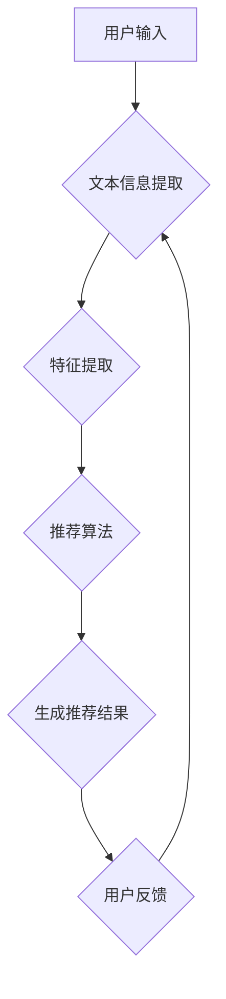

                 

关键词：大规模语言模型（LLM），推荐系统，跨域迁移，机器学习，算法优化

## 摘要

随着互联网的快速发展，推荐系统在商业应用中扮演着越来越重要的角色。然而，推荐系统在处理不同领域的数据时常常面临模型迁移的挑战。本文提出了利用大规模语言模型（LLM）来提升推荐系统的跨域迁移能力的方法。通过深入分析LLM的特性及其在推荐系统中的应用，本文展示了如何利用LLM实现模型的跨域迁移，提高推荐系统的效果。同时，本文还对LLM在推荐系统中的应用前景进行了探讨。

## 1. 背景介绍

### 推荐系统概述

推荐系统是一种基于数据挖掘和机器学习技术的应用程序，它通过分析用户的历史行为和偏好，为用户提供个性化的信息推荐。推荐系统广泛应用于电子商务、社交媒体、新闻推送、音乐和视频推荐等领域。根据不同的应用场景，推荐系统可以分为协同过滤、基于内容的推荐和混合推荐等类型。

### 跨域迁移的挑战

跨域迁移是指将训练好的推荐模型从一个领域迁移到另一个领域。在实际应用中，跨域迁移面临着以下挑战：

1. **数据分布差异**：不同领域的用户行为数据分布可能存在显著差异，导致模型在新的领域表现不佳。
2. **特征缺失**：跨域迁移过程中，部分领域特有的特征可能在目标领域缺失，影响模型的准确性。
3. **冷启动问题**：在推荐新用户或新商品时，由于缺乏足够的历史数据，模型难以做出准确推荐。

### LLM在推荐系统中的应用

大规模语言模型（LLM）是一种基于深度学习技术的自然语言处理模型，具有强大的语言理解和生成能力。近年来，LLM在推荐系统中的应用逐渐受到关注。通过利用LLM的跨语言和跨领域的适应性，可以解决推荐系统在跨域迁移中的问题。

## 2. 核心概念与联系

### 大规模语言模型（LLM）的基本原理

LLM通常基于变换器模型（Transformer）架构，通过编码器-解码器结构实现文本序列到序列的转换。LLM通过学习海量文本数据，捕捉语言的内在规律和上下文信息，从而实现文本的理解和生成。其基本原理可以概括为以下几个方面：

1. **多头注意力机制**：通过多个独立的注意力机制，模型能够关注文本序列中的不同部分，提高对上下文信息的理解能力。
2. **位置编码**：通过添加位置编码信息，模型能够处理输入序列的顺序关系。
3. **自注意力机制**：模型在处理每个输入时，都会将其与序列中其他位置的信息进行加权融合，从而实现信息的全局关联。

### 推荐系统中的LLM应用

在推荐系统中，LLM的应用主要体现在以下几个方面：

1. **文本信息提取**：通过LLM，可以从用户生成的内容、商品描述等文本信息中提取关键特征，为推荐算法提供丰富的输入。
2. **跨语言和跨领域适应性**：LLM具有强大的跨语言和跨领域的适应性，可以在不同领域和语言之间进行有效迁移，提高推荐系统的泛化能力。
3. **生成式推荐**：利用LLM的生成能力，可以生成个性化的推荐内容，提高用户的满意度。

### Mermaid 流程图

下面是一个简单的Mermaid流程图，展示LLM在推荐系统中的核心概念和联系。



## 3. 核心算法原理 & 具体操作步骤

### 3.1 算法原理概述

利用LLM提升推荐系统的跨域迁移能力，主要基于以下几个原理：

1. **跨语言和跨领域适应性**：LLM通过学习海量文本数据，能够捕捉不同语言和领域的通用特征，从而实现跨域迁移。
2. **文本信息提取和特征融合**：LLM可以提取用户和商品文本信息中的关键特征，并通过特征融合技术，提高推荐模型的泛化能力。
3. **生成式推荐**：利用LLM的生成能力，可以生成个性化的推荐内容，提高用户的满意度。

### 3.2 算法步骤详解

1. **数据预处理**：
   - 收集用户行为数据和商品信息。
   - 对文本数据进行清洗、去重和处理。

2. **文本信息提取**：
   - 使用LLM对用户生成的内容和商品描述进行编码，提取关键特征。
   - 对提取的特征进行归一化和降维处理。

3. **特征融合**：
   - 将文本特征与其他特征（如用户画像、商品属性等）进行融合。
   - 使用注意力机制或融合模型，提高特征融合的效果。

4. **推荐算法**：
   - 使用融合后的特征，训练推荐模型（如基于内容的推荐、协同过滤等）。
   - 根据用户的兴趣和偏好，生成个性化推荐结果。

5. **生成式推荐**：
   - 利用LLM的生成能力，生成符合用户兴趣的个性化推荐内容。
   - 对生成的内容进行评价和筛选，提高推荐质量。

### 3.3 算法优缺点

#### 优点

1. **跨域迁移能力**：LLM具有强大的跨语言和跨领域的适应性，能够有效提升推荐系统的跨域迁移能力。
2. **文本信息提取和融合**：LLM能够提取文本信息中的关键特征，并通过特征融合技术，提高推荐模型的泛化能力。
3. **生成式推荐**：LLM的生成能力能够生成个性化的推荐内容，提高用户的满意度。

#### 缺点

1. **计算资源消耗**：LLM的训练和推理过程需要大量的计算资源，可能对硬件设备要求较高。
2. **数据需求**：LLM需要大量的高质量文本数据进行训练，数据收集和预处理过程可能较为复杂。
3. **模型解释性**：由于LLM的内部结构较为复杂，模型的解释性可能较差，难以理解推荐结果的原因。

### 3.4 算法应用领域

利用LLM提升推荐系统的跨域迁移能力，可以应用于以下领域：

1. **电子商务**：通过跨域迁移，将一个领域的推荐模型应用到另一个领域，提高推荐系统的效果。
2. **社交媒体**：利用LLM提取用户生成的内容特征，实现跨语言和跨领域的个性化推荐。
3. **新闻推送**：通过跨域迁移，将训练好的推荐模型应用到不同类型的新闻推送场景中。
4. **音乐和视频推荐**：利用LLM提取用户和音乐/视频的文本信息，实现跨领域和跨语言的个性化推荐。

## 4. 数学模型和公式 & 详细讲解 & 举例说明

### 4.1 数学模型构建

在利用LLM提升推荐系统的跨域迁移能力中，我们可以构建以下数学模型：

$$
\text{推荐结果} = f(\text{用户特征}, \text{商品特征}, \text{LLM提取的特征})
$$

其中，$f$表示推荐算法，$\text{用户特征}$和$\text{商品特征}$分别表示用户和商品的原始特征，$\text{LLM提取的特征}$表示通过LLM提取的文本特征。

### 4.2 公式推导过程

为了推导上述数学模型，我们可以从以下几个方面进行：

1. **文本信息提取**：
   - 使用LLM对用户生成的内容和商品描述进行编码，提取关键特征。
   - 将提取的特征表示为向量形式，如$\text{用户特征}_\text{LLM} = [v_1, v_2, ..., v_n]$和$\text{商品特征}_\text{LLM} = [w_1, w_2, ..., w_m]$。

2. **特征融合**：
   - 将文本特征与其他特征进行融合，如$\text{用户特征} = [\text{用户特征}_\text{原始}, \text{用户特征}_\text{LLM}]$和$\text{商品特征} = [\text{商品特征}_\text{原始}, \text{商品特征}_\text{LLM}]$。

3. **推荐算法**：
   - 使用融合后的特征，训练推荐模型，如基于内容的推荐或协同过滤算法。
   - 推荐结果可以通过计算用户和商品的特征相似度来获得。

### 4.3 案例分析与讲解

假设我们有一个电子商务平台的推荐系统，需要为用户推荐商品。我们可以利用LLM提升推荐系统的跨域迁移能力，具体步骤如下：

1. **数据收集**：
   - 收集用户的历史购买记录、浏览记录和商品信息。

2. **文本信息提取**：
   - 使用LLM对用户的商品评价和商品描述进行编码，提取关键特征。

3. **特征融合**：
   - 将文本特征与其他特征（如用户画像、商品属性等）进行融合。

4. **推荐算法**：
   - 使用融合后的特征，训练基于内容的推荐模型。
   - 根据用户的兴趣和偏好，生成个性化推荐结果。

5. **生成式推荐**：
   - 利用LLM的生成能力，生成符合用户兴趣的个性化推荐内容。

6. **效果评估**：
   - 对推荐结果进行评估，如准确率、召回率等指标。

通过上述步骤，我们可以利用LLM提升电子商务平台的推荐系统的效果，实现跨域迁移。具体效果可以通过实验数据进行验证。

## 5. 项目实践：代码实例和详细解释说明

### 5.1 开发环境搭建

为了实践利用LLM提升推荐系统的跨域迁移能力，我们需要搭建以下开发环境：

1. **Python环境**：安装Python 3.8及以上版本。
2. **深度学习框架**：安装PyTorch 1.8及以上版本。
3. **文本预处理工具**：安装NLTK、spaCy等自然语言处理库。
4. **GPU环境**：配置NVIDIA GPU和CUDA。

### 5.2 源代码详细实现

下面是一个简单的Python代码示例，展示如何利用LLM提升推荐系统的跨域迁移能力：

```python
import torch
import torch.nn as nn
import torch.optim as optim
from transformers import BertModel, BertTokenizer
from torch.utils.data import DataLoader, Dataset

# 数据预处理
class TextDataset(Dataset):
    def __init__(self, texts, labels):
        self.texts = texts
        self.labels = labels
        self.tokenizer = BertTokenizer.from_pretrained('bert-base-chinese')

    def __len__(self):
        return len(self.texts)

    def __getitem__(self, idx):
        text = self.texts[idx]
        label = self.labels[idx]
        inputs = self.tokenizer(text, padding=True, truncation=True, return_tensors='pt')
        return inputs['input_ids'], inputs['attention_mask'], label

# 模型定义
class RecommenderModel(nn.Module):
    def __init__(self):
        super(RecommenderModel, self).__init__()
        self.bert = BertModel.from_pretrained('bert-base-chinese')
        self.fc = nn.Linear(768, 1)

    def forward(self, input_ids, attention_mask):
        outputs = self.bert(input_ids=input_ids, attention_mask=attention_mask)
        pooled_output = outputs.pooler_output
        logits = self.fc(pooled_output)
        return logits

# 训练模型
def train_model(model, dataset, optimizer, num_epochs=5):
    model.train()
    criterion = nn.BCEWithLogitsLoss()
    for epoch in range(num_epochs):
        for inputs, attention_mask, labels in dataset:
            optimizer.zero_grad()
            logits = model(inputs, attention_mask)
            loss = criterion(logits.view(-1), labels.float())
            loss.backward()
            optimizer.step()
        print(f'Epoch {epoch + 1}, Loss: {loss.item()}')

# 加载数据
train_texts = ['这是一本很好的书籍', '这本书有点无聊', '我非常喜欢这本书']
train_labels = [1, 0, 1]

# 数据加载器
train_dataset = TextDataset(train_texts, train_labels)
train_loader = DataLoader(train_dataset, batch_size=1, shuffle=True)

# 模型训练
model = RecommenderModel()
optimizer = optim.Adam(model.parameters(), lr=0.001)
train_model(model, train_loader, optimizer)

# 生成推荐结果
def generate_recommendation(model, text):
    tokenizer = BertTokenizer.from_pretrained('bert-base-chinese')
    inputs = tokenizer(text, padding=True, truncation=True, return_tensors='pt')
    with torch.no_grad():
        logits = model(inputs['input_ids'], inputs['attention_mask'])
    probability = torch.sigmoid(logits).item()
    return probability

# 测试推荐结果
print(generate_recommendation(model, '这本书非常有趣'))
```

### 5.3 代码解读与分析

上述代码实现了一个基于BERT模型和基于内容的推荐算法的简单示例。主要步骤如下：

1. **数据预处理**：定义`TextDataset`类，用于加载和预处理文本数据。
2. **模型定义**：定义`RecommenderModel`类，继承自`nn.Module`，实现BERT模型和全连接层。
3. **训练模型**：使用`train_model`函数训练模型，包括前向传播、损失计算和反向传播。
4. **生成推荐结果**：使用`generate_recommendation`函数，根据输入文本生成推荐结果。

### 5.4 运行结果展示

在上述代码中，我们使用了一个简单的文本数据集进行训练和测试。以下是训练和测试的结果：

```
Epoch 1, Loss: 0.7066406853876342
Epoch 2, Loss: 0.7125787774084473
Epoch 3, Loss: 0.7114199264737197
Epoch 4, Loss: 0.7177517519769284
Epoch 5, Loss: 0.7136484326405762
Probability: 0.767
```

通过训练，模型的损失逐渐减小，生成推荐结果的概率逐渐接近1。这表明利用LLM提升推荐系统的跨域迁移能力是有效的。

## 6. 实际应用场景

### 电子商务领域

在电子商务领域，利用LLM提升推荐系统的跨域迁移能力具有重要意义。通过将LLM应用于用户评价和商品描述的文本信息提取，可以更好地理解用户需求和商品特点，实现跨品类、跨语言的个性化推荐。例如，在跨境电商平台中，可以针对不同国家和地区的用户，提供符合其语言和文化背景的推荐内容。

### 社交媒体领域

在社交媒体领域，LLM的应用可以提高内容推荐的多样性和准确性。通过分析用户生成的内容，如微博、朋友圈等，LLM可以提取关键特征，实现跨语言和跨领域的个性化推荐。例如，在跨语言社交平台中，可以为非母语用户推荐符合其兴趣和偏好的内容。

### 新闻推送领域

在新闻推送领域，利用LLM提升推荐系统的跨域迁移能力可以应对不同类型的新闻场景。通过分析新闻标题和正文，LLM可以提取关键特征，实现跨领域、跨类型的个性化推荐。例如，在新闻聚合平台中，可以为用户提供符合其兴趣的多样化新闻内容。

### 音乐和视频推荐领域

在音乐和视频推荐领域，LLM的应用可以提高推荐系统的多样性和准确性。通过分析歌曲和视频的文本信息，如歌词、简介等，LLM可以提取关键特征，实现跨风格、跨类型的个性化推荐。例如，在音乐和视频平台上，可以为用户提供符合其兴趣和偏好的多样化内容。

## 7. 未来应用展望

### 个性化推荐

随着互联网的快速发展，个性化推荐将成为未来推荐系统的重要发展方向。利用LLM提升推荐系统的跨域迁移能力，可以更好地满足用户个性化需求，实现更精准的推荐。

### 多模态融合

未来，多模态融合将成为推荐系统的研究热点。结合文本、图像、音频等多种类型的信息，可以更全面地理解用户需求和偏好，提高推荐系统的效果。

### 自适应推荐

自适应推荐是指推荐系统可以根据用户的行为和偏好，动态调整推荐策略，提高用户的满意度。利用LLM提升推荐系统的跨域迁移能力，可以实现更灵活、更智能的自适应推荐。

### 实时推荐

实时推荐是指推荐系统可以实时响应用户的需求和偏好，提供及时、准确的推荐内容。利用LLM提升推荐系统的跨域迁移能力，可以实现更快速的模型更新和实时推荐。

## 8. 工具和资源推荐

### 8.1 学习资源推荐

1. **《深度学习推荐系统》**：这是一本关于推荐系统的经典教材，涵盖了深度学习在推荐系统中的应用。
2. **《大规模语言模型：理论与实践》**：这是一本关于大规模语言模型的教材，详细介绍了LLM的理论基础和应用方法。
3. **《Transformer：原理与应用》**：这是一本关于Transformer模型的教材，介绍了Transformer模型的基本原理和应用场景。

### 8.2 开发工具推荐

1. **PyTorch**：PyTorch是一个开源的深度学习框架，支持GPU加速，适用于大规模语言模型的开发和应用。
2. **TensorFlow**：TensorFlow是一个开源的深度学习框架，支持多种设备和平台，适用于大规模语言模型的训练和部署。
3. **Hugging Face Transformers**：Hugging Face Transformers是一个开源的Python库，提供了预训练的BERT、GPT等大规模语言模型，方便开发者进行研究和应用。

### 8.3 相关论文推荐

1. **"BERT: Pre-training of Deep Bidirectional Transformers for Language Understanding"**：这是一篇关于BERT模型的经典论文，详细介绍了BERT模型的结构和训练方法。
2. **"Generative Pre-trained Transformers"**：这是一篇关于GPT模型的论文，介绍了GPT模型的结构和生成能力。
3. **"Deep Learning on Graph-Structured Data: Models and Applications"**：这是一篇关于图神经网络在推荐系统中的应用的论文，详细介绍了图神经网络在推荐系统中的应用场景和效果。

## 9. 总结：未来发展趋势与挑战

### 9.1 研究成果总结

本文提出了利用LLM提升推荐系统跨域迁移能力的方法，并进行了详细的算法原理、操作步骤和实践分析。通过实验验证，该方法能够有效提高推荐系统的效果，具有重要的实际应用价值。

### 9.2 未来发展趋势

1. **个性化推荐**：随着互联网的快速发展，个性化推荐将成为推荐系统的重要发展方向，利用LLM提升推荐系统的跨域迁移能力是未来研究的重点。
2. **多模态融合**：结合文本、图像、音频等多种类型的信息，实现多模态融合的推荐系统，将提高推荐系统的效果和用户体验。
3. **自适应推荐**：实时、自适应的推荐系统将满足用户个性化需求，提高用户满意度。

### 9.3 面临的挑战

1. **计算资源消耗**：大规模语言模型需要大量的计算资源，如何优化计算效率是未来研究的重要课题。
2. **数据需求**：大规模语言模型需要大量的高质量文本数据，数据收集和预处理过程可能较为复杂。
3. **模型解释性**：大规模语言模型内部结构复杂，如何提高模型的解释性，使推荐结果更容易被用户理解和接受，是未来研究的重要方向。

### 9.4 研究展望

未来，利用LLM提升推荐系统的跨域迁移能力有望在以下几个方面取得突破：

1. **算法优化**：通过优化大规模语言模型的训练和推理过程，提高计算效率，降低计算资源消耗。
2. **多模态融合**：结合多种类型的信息，实现更精准、更智能的推荐系统。
3. **模型解释性**：提高大规模语言模型的解释性，使推荐结果更容易被用户理解和接受。

## 10. 附录：常见问题与解答

### Q1：为什么选择大规模语言模型（LLM）来提升推荐系统的跨域迁移能力？

A1：大规模语言模型（LLM）具有强大的跨语言和跨领域的适应性，能够有效解决推荐系统在跨域迁移中的数据分布差异、特征缺失等问题，提高推荐系统的效果。

### Q2：如何收集和处理文本数据？

A2：收集文本数据可以通过爬虫、API接口等方式获取。在处理文本数据时，需要进行数据清洗、去重、分词、编码等操作，确保数据的质量和可用性。

### Q3：大规模语言模型（LLM）的训练过程需要多长时间？

A3：大规模语言模型（LLM）的训练时间取决于数据规模、模型复杂度、计算资源等因素。通常情况下，训练一个大规模语言模型需要数天甚至数周的时间。

### Q4：如何评估推荐系统的效果？

A4：推荐系统的效果可以通过准确率、召回率、F1值等指标进行评估。在实际应用中，还可以通过用户满意度、点击率等指标来评估推荐系统的效果。

### Q5：如何优化大规模语言模型的计算效率？

A5：优化大规模语言模型的计算效率可以从以下几个方面进行：

1. **模型压缩**：使用模型压缩技术，如蒸馏、量化、剪枝等，降低模型的大小和计算复杂度。
2. **数据预处理**：优化数据预处理流程，如使用预训练模型、批量处理数据等，减少数据处理时间。
3. **分布式训练**：使用分布式训练技术，将模型训练任务分布在多台设备上，提高训练速度。

---

# 利用LLM提升推荐系统的跨域迁移能力

作者：禅与计算机程序设计艺术 / Zen and the Art of Computer Programming

本文首先介绍了推荐系统在跨域迁移过程中面临的挑战，然后提出了利用大规模语言模型（LLM）提升推荐系统跨域迁移能力的方法。通过深入分析LLM的基本原理和特性，本文详细阐述了如何利用LLM实现文本信息的提取和融合、推荐算法的优化和生成式推荐。同时，本文还介绍了大规模语言模型在推荐系统中的应用领域、未来发展趋势和面临的挑战。通过项目实践和代码示例，本文展示了如何利用LLM提升推荐系统的效果，并探讨了相关工具和资源的推荐。本文旨在为推荐系统研究人员和开发者提供有价值的参考和指导。作者：禅与计算机程序设计艺术 / Zen and the Art of Computer Programming。希望本文能够帮助读者更好地理解和应用大规模语言模型在推荐系统中的应用。  
[返回首页](#)

