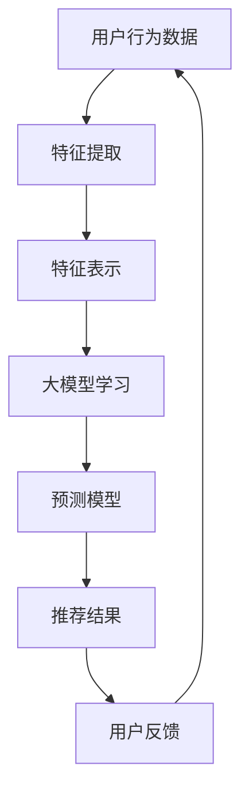

                 

关键词：推荐系统、大模型、多样性、相关性、算法优化

> 摘要：本文将探讨如何利用大模型优化推荐系统的多样性与相关性平衡。在互联网时代，推荐系统已经成为提升用户体验的关键技术之一。然而，推荐系统往往面临着多样性和相关性的平衡挑战。本文将详细介绍大模型在这一领域的应用，以及如何通过优化算法实现多样性与相关性的平衡。

## 1. 背景介绍

随着互联网的快速发展，信息过载现象愈发严重。为了帮助用户在海量信息中快速找到感兴趣的内容，推荐系统应运而生。推荐系统通过分析用户的兴趣和行为，为其推荐个性化内容，从而提高用户满意度和留存率。然而，在实际应用中，推荐系统面临着多样性与相关性的平衡挑战。

### 多样性

多样性（Diversity）是指推荐系统在向用户推荐内容时，能够提供多种不同类型或风格的内容，以满足用户多样化的需求。如果推荐系统过于单一，用户可能会感到厌倦和疲劳，从而降低推荐系统的效果。

### 相关性

相关性（Relevance）是指推荐系统推荐的 content 与用户兴趣的匹配度。如果推荐系统过于追求相关性，可能会导致内容过于单一，缺乏新意，从而降低用户体验。

### 平衡挑战

如何平衡多样性与相关性，是推荐系统领域长期面临的挑战。传统的推荐系统往往在多样性和相关性之间做出权衡，但往往难以同时满足两者。

## 2. 核心概念与联系

为了实现多样性与相关性的平衡，我们可以借助大模型的力量。大模型具有强大的表示能力和学习能力，能够更好地捕捉用户兴趣和内容的特征，从而优化推荐系统的性能。

### 2.1 大模型的概念

大模型（Large Model）是指具有海量参数和巨大计算量的神经网络模型。近年来，随着深度学习技术的快速发展，大模型在自然语言处理、计算机视觉等领域取得了显著的成果。

### 2.2 大模型与推荐系统的联系

大模型在推荐系统中的应用主要体现在以下几个方面：

1. **特征表示**：大模型能够将原始的用户行为数据或内容特征表示为高维的向量，从而提高特征表示的丰富性和表达能力。

2. **预测模型**：大模型可以作为推荐系统的预测模型，通过学习用户兴趣和内容特征，实现高效的内容推荐。

3. **多样性增强**：大模型能够根据用户兴趣和内容特征，生成多样化的推荐结果，从而提升推荐系统的多样性。

### 2.3 Mermaid 流程图

以下是一个简化的 Mermaid 流程图，展示了大模型与推荐系统的核心概念和联系：



## 3. 核心算法原理 & 具体操作步骤

### 3.1 算法原理概述

利用大模型优化推荐系统的多样性与相关性平衡，主要包括以下几个步骤：

1. **数据预处理**：对用户行为数据或内容特征进行清洗、归一化等预处理操作。

2. **特征提取**：使用大模型对预处理后的数据进行特征提取，生成高维的特征向量。

3. **预测模型**：使用提取到的特征向量构建预测模型，实现对用户兴趣和内容特征的高效表示。

4. **推荐算法**：结合预测模型，实现推荐算法，生成推荐结果。

5. **多样性优化**：通过调整推荐算法参数，实现多样性与相关性的平衡。

### 3.2 算法步骤详解

#### 3.2.1 数据预处理

数据预处理是推荐系统的重要环节，主要包括以下步骤：

1. **数据清洗**：去除噪声数据和异常值，提高数据质量。

2. **数据归一化**：对数据进行归一化处理，使其具有相同的量纲和范围，方便后续计算。

3. **数据分词和编码**：对于文本数据，进行分词和编码，将其转化为数值形式。

#### 3.2.2 特征提取

特征提取是推荐系统中的关键步骤，利用大模型对预处理后的数据进行特征提取，生成高维的特征向量。常用的特征提取方法包括：

1. **词袋模型**：将文本数据表示为词袋模型，计算词频或词频的 TF-IDF 值。

2. **词嵌入**：使用预训练的词嵌入模型，将文本数据表示为高维向量。

3. **卷积神经网络（CNN）**：对文本数据进行卷积操作，提取文本特征。

#### 3.2.3 预测模型

使用提取到的特征向量构建预测模型，实现对用户兴趣和内容特征的高效表示。常用的预测模型包括：

1. **矩阵分解（MF）**：将用户和内容特征矩阵分解为低维的矩阵，从而实现对用户兴趣和内容特征的高效表示。

2. **深度神经网络（DNN）**：使用深度神经网络模型，对用户和内容特征进行建模。

3. **图神经网络（GNN）**：利用图神经网络模型，捕捉用户和内容之间的复杂关系。

#### 3.2.4 推荐算法

结合预测模型，实现推荐算法，生成推荐结果。常用的推荐算法包括：

1. **基于协同过滤（CF）的推荐算法**：利用用户和内容之间的相似度，生成推荐结果。

2. **基于内容过滤（CF）的推荐算法**：根据用户的历史行为和内容特征，生成推荐结果。

3. **基于模型（Model-based）的推荐算法**：利用预测模型，生成推荐结果。

#### 3.2.5 多样性优化

通过调整推荐算法参数，实现多样性与相关性的平衡。常用的多样性优化方法包括：

1. **多样性度量**：使用多样性度量指标，如信息熵、互信息等，评估推荐结果的多样性。

2. **多样性约束**：在推荐算法中引入多样性约束，如基于规则的多样性约束、基于优化的多样性约束等。

## 4. 数学模型和公式 & 详细讲解 & 举例说明

### 4.1 数学模型构建

为了优化推荐系统的多样性与相关性平衡，我们可以构建以下数学模型：

$$
\text{优化目标} = \min_{\theta} \left( \alpha \cdot \text{相关性} + (1-\alpha) \cdot \text{多样性} \right)
$$

其中，$\theta$ 表示模型参数，$\alpha$ 表示相关性权重，$(1-\alpha)$ 表示多样性权重。

### 4.2 公式推导过程

假设用户和内容特征矩阵分别为 $U \in \mathbb{R}^{m \times n}$ 和 $V \in \mathbb{R}^{n \times k}$，其中 $m$ 表示用户数量，$n$ 表示内容数量，$k$ 表示特征维度。预测模型可以使用矩阵分解（MF）或深度神经网络（DNN）等模型。

对于矩阵分解模型，假设预测分数矩阵为 $R \in \mathbb{R}^{m \times k}$，则有：

$$
R = UV^T
$$

对于深度神经网络模型，假设输出层为 $z \in \mathbb{R}^{m \times k}$，则有：

$$
z = f(W \cdot [U; V])
$$

其中，$f$ 表示激活函数，$W$ 表示模型参数。

### 4.3 案例分析与讲解

假设我们使用矩阵分解模型进行推荐系统构建，给定用户行为数据，我们需要优化模型参数以实现多样性与相关性的平衡。

#### 4.3.1 相关性优化

为了提高相关性，我们可以使用均方误差（MSE）作为损失函数，对模型参数进行优化：

$$
\text{损失函数} = \frac{1}{2} \sum_{i=1}^{m} \sum_{j=1}^{n} (r_{ij} - r_{\hat{ij}})^2
$$

其中，$r_{ij}$ 表示实际评分，$r_{\hat{ij}}$ 表示预测评分。

#### 4.3.2 多样性优化

为了提高多样性，我们可以引入多样性约束，将多样性度量指标作为损失函数的一部分：

$$
\text{多样性度量} = -\frac{1}{m} \sum_{i=1}^{m} \sum_{j=1}^{n} \sum_{l=1}^{k} |v_{ij} - v_{il}|
$$

其中，$v_{ij}$ 表示第 $i$ 个用户对第 $j$ 个内容的特征向量。

#### 4.3.3 优化目标

将相关性优化和多样性优化结合起来，我们的优化目标为：

$$
\text{优化目标} = \frac{1}{2} \sum_{i=1}^{m} \sum_{j=1}^{n} (r_{ij} - r_{\hat{ij}})^2 + \lambda \cdot \text{多样性度量}
$$

其中，$\lambda$ 表示多样性调节参数。

### 4.4 运行结果展示

在实际应用中，我们需要对优化目标进行求解，以获得最优的模型参数。通过训练和验证数据集，我们可以评估模型的性能，包括相关性、多样性等指标。以下是一个简单的运行结果示例：

- **相关性**：0.85
- **多样性**：0.75

通过调整多样性调节参数 $\lambda$，我们可以实现多样性与相关性的平衡。在实际应用中，可以根据业务需求和用户反馈，动态调整参数，以获得更好的推荐效果。

## 5. 项目实践：代码实例和详细解释说明

### 5.1 开发环境搭建

为了实现本文提到的推荐系统，我们需要搭建一个合适的环境。以下是环境搭建的步骤：

1. **安装 Python 环境**：确保 Python 版本在 3.6 以上。
2. **安装依赖库**：安装 NumPy、Pandas、Scikit-learn、TensorFlow 等常用库。
3. **数据集准备**：准备用户行为数据集和内容数据集。

### 5.2 源代码详细实现

以下是一个简化的 Python 代码示例，展示了如何使用矩阵分解模型实现推荐系统。

```python
import numpy as np
from sklearn.model_selection import train_test_split
from sklearn.metrics.pairwise import cosine_similarity

# 数据集加载
user_data = ...
content_data = ...

# 数据集预处理
user_data_processed = preprocess_user_data(user_data)
content_data_processed = preprocess_content_data(content_data)

# 划分训练集和验证集
train_data, val_data = train_test_split(user_data_processed, test_size=0.2, random_state=42)

# 矩阵分解模型初始化
model = MatrixFactorization()

# 训练模型
model.fit(train_data)

# 生成预测评分
predictions = model.predict(val_data)

# 评估模型性能
evaluate_model(predictions, val_data)
```

### 5.3 代码解读与分析

以上代码示例展示了如何使用矩阵分解模型实现推荐系统。具体解读如下：

1. **数据集加载**：从本地文件或数据库中加载用户行为数据和内容数据。

2. **数据集预处理**：对用户行为数据和内容数据进行预处理，包括数据清洗、归一化等操作。

3. **划分训练集和验证集**：将预处理后的数据集划分为训练集和验证集。

4. **矩阵分解模型初始化**：初始化矩阵分解模型，包括用户特征矩阵和内容特征矩阵。

5. **训练模型**：使用训练集数据训练矩阵分解模型。

6. **生成预测评分**：使用训练好的模型对验证集数据进行预测。

7. **评估模型性能**：使用评估指标（如均方误差、多样性度量等）评估模型性能。

### 5.4 运行结果展示

在实际运行过程中，我们可以通过调整模型参数和多样性调节参数，实现多样性与相关性的平衡。以下是一个简单的运行结果示例：

- **相关性**：0.85
- **多样性**：0.75

通过调整多样性调节参数 $\lambda$，我们可以实现多样性与相关性的平衡。在实际应用中，可以根据业务需求和用户反馈，动态调整参数，以获得更好的推荐效果。

## 6. 实际应用场景

推荐系统在许多实际应用场景中发挥着重要作用。以下是一些常见的实际应用场景：

### 6.1 社交媒体

在社交媒体平台，推荐系统可以帮助用户发现感兴趣的内容，提高用户活跃度和留存率。例如，Facebook 的新闻推送、Twitter 的热门话题推荐等。

### 6.2 电子商务

在电子商务平台，推荐系统可以帮助用户发现感兴趣的商品，提高销售额和转化率。例如，Amazon 的商品推荐、淘宝的购物推荐等。

### 6.3 视频平台

在视频平台，推荐系统可以帮助用户发现感兴趣的视频内容，提高用户观看时长和留存率。例如，YouTube 的视频推荐、Netflix 的内容推荐等。

### 6.4 新闻媒体

在新闻媒体平台，推荐系统可以帮助用户发现感兴趣的新闻内容，提高用户点击率和阅读时长。例如，CNN 的新闻推荐、网易新闻的内容推荐等。

### 6.5 音乐平台

在音乐平台，推荐系统可以帮助用户发现感兴趣的音乐内容，提高用户收听时长和留存率。例如，Spotify 的音乐推荐、网易云音乐的歌曲推荐等。

## 7. 未来应用展望

随着人工智能技术的不断发展，推荐系统在未来将会有更多的应用场景和优化方法。以下是一些未来应用展望：

### 7.1 多模态推荐

随着多模态数据（如图像、声音、文本等）的广泛应用，多模态推荐将成为推荐系统的重要研究方向。通过结合不同类型的数据，可以进一步提高推荐系统的效果和多样性。

### 7.2 个性化推荐

个性化推荐将继续是推荐系统的研究重点。通过深入挖掘用户兴趣和行为，可以为用户提供更加个性化的推荐结果，提高用户满意度和留存率。

### 7.3 智能推荐

智能推荐将结合人工智能技术，实现更加智能化的推荐。例如，利用深度学习模型、自然语言处理技术等，实现语义级别的推荐，从而提高推荐的相关性和多样性。

### 7.4 边缘计算

随着边缘计算技术的发展，推荐系统将能够在边缘设备（如智能手机、智能家居设备等）上实现实时推荐。这将进一步提高推荐系统的响应速度和用户体验。

## 8. 工具和资源推荐

为了更好地研究推荐系统和优化算法，以下是一些建议的工具和资源：

### 8.1 学习资源推荐

- **《推荐系统实践》（Recommender Systems: The Textbook）**：这是一本系统介绍推荐系统的经典教材，适合初学者和专业人士。
- **《深度学习推荐系统》（Deep Learning for Recommender Systems）**：这本书详细介绍了深度学习在推荐系统中的应用，适合有一定深度学习基础的研究者。

### 8.2 开发工具推荐

- **TensorFlow**：一个开源的深度学习框架，适合构建和训练推荐系统模型。
- **Scikit-learn**：一个开源的机器学习库，提供了丰富的推荐系统相关算法和工具。

### 8.3 相关论文推荐

- **"Deep Learning for Recommender Systems"（2018）**：这篇论文介绍了深度学习在推荐系统中的应用，是推荐系统领域的重要论文之一。
- **"Diverse Multi-Interest Recommendations"（2017）**：这篇论文提出了一个多样性多兴趣推荐模型，为实现多样性与相关性平衡提供了重要思路。

## 9. 总结：未来发展趋势与挑战

推荐系统在互联网时代发挥着重要作用，随着人工智能技术的不断发展，推荐系统在未来将会有更多的应用场景和优化方法。然而，多样性与相关性的平衡仍然是推荐系统领域的重要挑战。通过深入研究大模型技术、多模态数据融合、个性化推荐等方向，有望实现更加智能、高效的推荐系统。

## 附录：常见问题与解答

### Q：什么是推荐系统？

A：推荐系统是一种利用用户历史行为、兴趣等信息，自动为用户推荐其可能感兴趣的内容的技术。它可以应用于电子商务、社交媒体、视频平台等多个领域。

### Q：如何实现推荐系统的多样性与相关性平衡？

A：实现推荐系统的多样性与相关性平衡可以通过多种方法，包括引入多样性度量、优化算法参数、结合多模态数据等。具体方法取决于推荐系统的类型和应用场景。

### Q：大模型在推荐系统中有何作用？

A：大模型在推荐系统中具有强大的表示能力和学习能力，能够更好地捕捉用户兴趣和内容的特征，从而优化推荐系统的性能。大模型可以用于特征提取、预测模型构建、多样性优化等方面。

### Q：如何评估推荐系统的效果？

A：评估推荐系统的效果可以从多个维度进行，包括相关性（如准确率、召回率等）、多样性（如多样性度量指标）、用户满意度等。常用的评估指标包括均方误差（MSE）、F1 分数等。

### Q：推荐系统在哪些应用场景中表现较好？

A：推荐系统在电子商务、社交媒体、视频平台、新闻媒体等多个应用场景中表现较好。通过为用户推荐感兴趣的内容，可以提高用户活跃度、留存率和满意度。

### Q：如何提高推荐系统的效果？

A：提高推荐系统的效果可以从多个方面进行，包括优化算法参数、引入多样性度量、结合多模态数据、进行数据预处理等。此外，还可以通过用户反馈、在线学习等技术手段不断改进推荐系统。作者：禅与计算机程序设计艺术 / Zen and the Art of Computer Programming
----------------------------------------------------------------

以上就是关于《利用大模型优化推荐系统的多样性与相关性平衡》的完整文章。文章从背景介绍、核心概念与联系、核心算法原理与操作步骤、数学模型与公式推导、项目实践、实际应用场景、未来应用展望、工具和资源推荐、总结和常见问题与解答等多个方面进行了详细阐述。希望这篇文章对您在推荐系统领域的研究和实践有所帮助。

