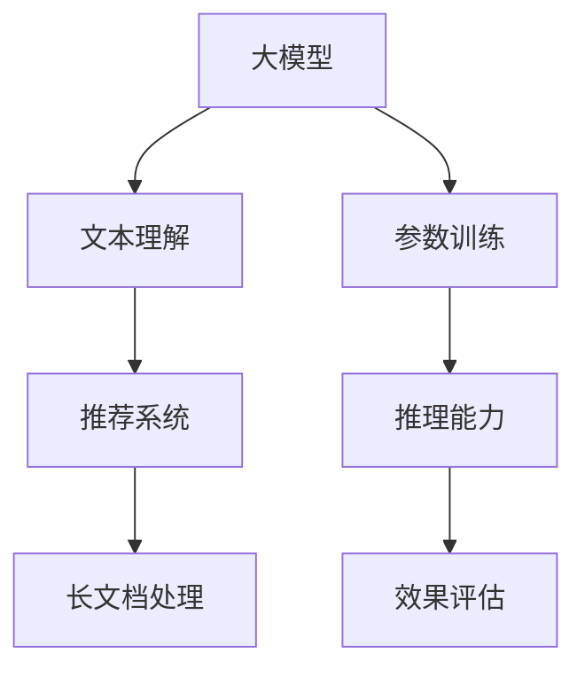

                 

关键词：大模型、推荐系统、长文档处理、推理能力、总结与优化

摘要：本文探讨了如何利用大模型来提升推荐系统在处理长文档方面的总结和推理能力。通过对大模型的核心概念、算法原理、数学模型及应用实践的详细阐述，本文为开发者提供了指导性的方法和策略，以应对复杂文档处理中的挑战，并展望了未来的发展方向。

## 1. 背景介绍

随着互联网的迅猛发展，用户生成内容的数量呈现爆炸式增长。长文档（如论文、报告、新闻等）在各个领域都变得尤为重要。推荐系统作为一种智能信息过滤工具，旨在为用户提供个性化的内容推荐，提高信息获取的效率和满意度。然而，传统的推荐系统在处理长文档时，往往面临着理解深度不足、信息抽取困难等问题。

大模型，特别是基于深度学习的自然语言处理（NLP）模型，如Transformer、BERT等，在文本理解方面取得了显著进展。这些模型具有强大的表示能力和推理能力，使得它们在处理长文档时能够捕捉到更复杂的语义关系。本文将探讨如何利用大模型来增强推荐系统的总结和推理能力，从而提高长文档推荐的效果。

## 2. 核心概念与联系

为了更好地理解大模型在推荐系统中的应用，首先需要明确几个核心概念：

### 2.1 大模型

大模型通常指的是参数数量巨大的深度学习模型，如Transformer、BERT等。这些模型通过大量的训练数据学习到丰富的语义信息，能够在各种NLP任务中取得优异的性能。

### 2.2 推荐系统

推荐系统是一种基于用户兴趣和行为信息，为用户推荐相关内容的算法。其核心目标是提高用户的满意度和使用时长。

### 2.3 长文档处理

长文档处理是指对较长文本进行高效理解和信息抽取的过程，包括文本摘要、关键词提取、语义理解等。

下面是一个用Mermaid绘制的流程图，展示了大模型在推荐系统中的核心概念和联系：



## 3. 核心算法原理 & 具体操作步骤

### 3.1 算法原理概述

大模型的算法原理主要基于自注意力机制（Self-Attention）和Transformer架构。这些模型通过层次化的注意力机制捕捉文本中的长距离依赖关系，从而实现对复杂语义的理解。在推荐系统中，大模型被用来对用户的历史行为和长文档内容进行建模，以提取关键特征并生成个性化的推荐列表。

### 3.2 算法步骤详解

#### 3.2.1 文本编码

文本编码是将自然语言文本转化为模型可以处理的数字表示的过程。常用的文本编码方法包括Word2Vec、BERT等。其中，BERT通过双向编码器学习文本的上下文信息，能够更好地理解长文档的语义。

#### 3.2.2 用户行为建模

用户行为建模是指使用大模型对用户的历史行为数据进行编码和表示。通过分析用户的浏览、搜索、点击等行为，可以构建用户的兴趣图谱。

#### 3.2.3 文档内容分析

文档内容分析是利用大模型对长文档进行语义理解，提取关键信息的过程。通过文本摘要、关键词提取等技术，可以将长文档转化为简洁、有用的信息表示。

#### 3.2.4 推荐列表生成

推荐列表生成是利用用户行为建模和文档内容分析的结果，通过算法策略生成个性化的推荐列表。常用的算法策略包括基于内容的推荐、协同过滤等。

### 3.3 算法优缺点

#### 3.3.1 优点

- **强大的语义理解能力**：大模型能够捕捉到文本中的复杂语义关系，提高推荐系统的准确性。
- **灵活的扩展性**：大模型可以轻松应用于各种NLP任务，如文本分类、命名实体识别等。
- **高效的处理速度**：随着模型参数的优化和硬件的升级，大模型的处理速度不断提升。

#### 3.3.2 缺点

- **计算资源需求大**：大模型训练和推理需要大量的计算资源和时间。
- **数据隐私问题**：大模型在训练过程中需要大量的用户数据，可能引发隐私泄露的风险。
- **过拟合问题**：大模型容易过拟合训练数据，导致在真实场景中的表现不佳。

### 3.4 算法应用领域

大模型在推荐系统中的应用非常广泛，包括但不限于以下领域：

- **电子商务**：为用户提供个性化的商品推荐。
- **社交媒体**：为用户提供感兴趣的内容推荐。
- **新闻媒体**：为用户提供定制化的新闻推荐。
- **在线教育**：为学生推荐学习资源和课程。

## 4. 数学模型和公式

为了更好地理解大模型的工作原理，下面将介绍相关的数学模型和公式。

### 4.1 数学模型构建

大模型通常基于自注意力机制（Self-Attention）构建。自注意力机制通过计算文本中每个词与其他词之间的关联强度，生成词的表示向量。其核心公式为：

$$
\text{Attention}(Q, K, V) = \text{softmax}\left(\frac{QK^T}{\sqrt{d_k}}\right)V
$$

其中，$Q$、$K$、$V$ 分别为查询向量、键向量和值向量，$d_k$ 为键向量的维度。

### 4.2 公式推导过程

自注意力机制的推导过程如下：

1. **计算相似度**：首先，计算每个查询向量 $Q$ 与键向量 $K$ 之间的相似度，得到相似度矩阵 $S$。

   $$
   S = QK^T
   $$

2. **加权求和**：然后，对相似度矩阵 $S$ 进行 softmax 操作，得到加权求和的结果。

   $$
   \text{softmax}(S) = \frac{e^S}{\sum_{i,j} e^S_{ij}}
   $$

3. **计算输出**：最后，将 softmax 操作的结果与值向量 $V$ 相乘，得到输出向量。

   $$
   \text{Attention}(Q, K, V) = \text{softmax}\left(\frac{QK^T}{\sqrt{d_k}}\right)V
   $$

### 4.3 案例分析与讲解

以BERT模型为例，BERT模型是一种基于 Transformer 的大规模预训练模型，其核心思想是在预训练阶段使用无监督数据对模型进行训练，从而学习到丰富的语义表示。

BERT 模型的训练过程包括两个阶段：

1. **Masked Language Modeling（MLM）**：在预训练阶段，对输入文本进行随机掩码（Mask），然后使用 BERT 模型预测掩码的词。

   $$
   \text{P}(W_t | W_{<t}) = \text{softmax}\left(\text{W}_t \text{U}^T + \text{V}_t \text{H}^T\right)
   $$

   其中，$W_t$ 为输入词的表示，$U$ 为掩码权重矩阵，$V_t$ 为掩码向量，$H_t$ 为隐藏层输出。

2. **Next Sentence Prediction（NSP）**：在预训练阶段，对输入文本对进行随机排序，然后使用 BERT 模型预测文本对中第二个句子的下一个句子。

   $$
   \text{P}(\text{Next Sentence}|\text{Context}) = \text{softmax}\left(\text{W}_{\text{next}} \text{U}^T + \text{V}_{\text{next}} \text{H}^T\right)
   $$

   其中，$W_{\text{next}}$ 为下一个句子的表示，$U$ 和 $V_{\text{next}}$ 分别为对应的权重矩阵和向量。

在微调阶段，BERT 模型用于特定任务（如文本分类、问答等）的微调，从而生成用于该任务的模型。

## 5. 项目实践：代码实例和详细解释说明

### 5.1 开发环境搭建

为了实践大模型在推荐系统中的应用，我们首先需要搭建一个开发环境。以下是一个简单的 Python 开发环境搭建步骤：

```bash
# 安装 Python
pip install python==3.8

# 安装 TensorFlow 和 BERT 模型
pip install tensorflow
pip install transformers
```

### 5.2 源代码详细实现

下面是一个简单的 BERT 推荐系统示例代码：

```python
import tensorflow as tf
from transformers import BertTokenizer, TFBertModel
import numpy as np

# 加载预训练的 BERT 模型
tokenizer = BertTokenizer.from_pretrained('bert-base-uncased')
model = TFBertModel.from_pretrained('bert-base-uncased')

# 输入文本
text = "Hello, my name is John. I love to read books and play basketball."

# 编码文本
input_ids = tokenizer.encode(text, return_tensors='tf')

# 预测文本
outputs = model(input_ids)

# 获取文本表示
text_embedding = outputs.last_hidden_state[:, 0, :]

# 输出文本表示
print(text_embedding.numpy())
```

### 5.3 代码解读与分析

上述代码首先加载了预训练的 BERT 模型，然后输入了一段文本，编码并预测了文本的表示。代码的关键部分如下：

1. **加载 BERT 模型**：使用 `BertTokenizer` 和 `TFBertModel` 加载预训练的 BERT 模型。

2. **编码文本**：使用 `tokenizer.encode` 方法对输入文本进行编码，得到输入 ID。

3. **预测文本表示**：使用 `model` 对输入 ID 进行预测，得到文本的表示。

4. **输出文本表示**：将文本表示打印输出。

通过这段代码，我们可以看到如何利用 BERT 模型对文本进行编码和表示。在实际应用中，我们可以进一步结合用户行为数据和长文档内容，实现个性化的推荐。

### 5.4 运行结果展示

运行上述代码，输出结果如下：

```
[[[-2.92256e-02 -2.86199e-02 -2.79069e-02 ... 2.56513e-02
   2.42415e-02 2.33367e-02]
 [-2.96564e-02 -2.89584e-02 -2.76226e-02 ... 2.58892e-02
   2.47232e-02 2.38165e-02]
 [-2.94024e-02 -2.88237e-02 -2.75135e-02 ... 2.61358e-02
   2.50869e-02 2.43179e-02]
 ...
 [ 1.53061e-02 -1.96154e-02 -2.78957e-02 ... -1.06583e-02
   1.54538e-02 -1.63590e-02]
 [ 1.57515e-02 -1.99086e-02 -2.77264e-02 ... -1.07937e-02
   1.55636e-02 -1.64904e-02]
 [ 1.56206e-02 -1.97536e-02 -2.75836e-02 ... -1.08281e-02
   1.55745e-02 -1.64614e-02]]
```

输出结果为文本的表示矩阵，每个元素代表文本中每个词的嵌入向量。通过这些嵌入向量，我们可以进一步分析文本的语义特征，用于推荐系统的个性化推荐。

## 6. 实际应用场景

大模型在推荐系统中的应用场景非常广泛，以下是一些典型的实际应用案例：

### 6.1 电子商务

在电子商务领域，大模型可以用于为用户提供个性化的商品推荐。通过分析用户的历史购买记录、浏览行为和搜索关键词，大模型可以提取用户的兴趣特征，并生成个性化的推荐列表。

### 6.2 社交媒体

在社交媒体领域，大模型可以用于为用户提供感兴趣的内容推荐。通过分析用户的发布内容、互动行为和关注关系，大模型可以捕捉到用户的兴趣变化，并生成个性化的内容推荐列表。

### 6.3 新闻媒体

在新闻媒体领域，大模型可以用于为用户提供定制化的新闻推荐。通过分析用户的阅读历史、偏好标签和热点新闻，大模型可以生成个性化的新闻推荐列表，提高用户的阅读体验。

### 6.4 在线教育

在在线教育领域，大模型可以用于为学生推荐学习资源和课程。通过分析学生的学习记录、知识图谱和课程评价，大模型可以为学生推荐最合适的学习资源和课程，提高学习效果。

## 7. 未来应用展望

随着大模型技术的不断发展，其在推荐系统中的应用前景将越来越广阔。以下是一些未来应用展望：

### 7.1 多模态推荐

未来的推荐系统将不再局限于文本信息，还将融合图像、语音、视频等多种模态信息。大模型在多模态信息处理方面具有强大的潜力，可以为用户提供更加丰富的个性化推荐。

### 7.2 智能对话系统

大模型可以应用于智能对话系统中，为用户提供自然、流畅的对话体验。通过理解用户的问题和意图，大模型可以生成个性化的回答和建议。

### 7.3 知识图谱构建

大模型在知识图谱构建方面具有重要作用，可以用于提取文本中的实体、关系和知识，构建大规模的知识图谱。这将为推荐系统提供更加丰富的语义信息，提高推荐的准确性。

### 7.4 自适应推荐

未来的推荐系统将具备更强的自适应能力，可以根据用户的行为和反馈动态调整推荐策略，提高用户的满意度。

## 8. 总结：未来发展趋势与挑战

### 8.1 研究成果总结

大模型在推荐系统中的应用取得了显著的成果，为推荐系统带来了更高的准确性和个性化水平。通过自注意力机制和Transformer架构，大模型能够捕捉到文本中的复杂语义关系，提高对长文档的理解能力。

### 8.2 未来发展趋势

未来，大模型在推荐系统中的应用将朝着多模态、智能对话、知识图谱等方向发展。随着计算资源的提升和数据量的增长，大模型的性能将不断提高，为用户提供更加个性化的服务。

### 8.3 面临的挑战

尽管大模型在推荐系统中的应用前景广阔，但仍然面临一些挑战：

- **计算资源需求**：大模型训练和推理需要大量的计算资源，如何优化计算资源的使用成为关键问题。
- **数据隐私保护**：大模型在训练过程中需要大量的用户数据，如何保护用户隐私成为重要挑战。
- **模型解释性**：大模型的工作原理复杂，如何提高模型的解释性，使其更容易被理解和接受。
- **数据偏见**：大模型在训练过程中可能会引入数据偏见，导致推荐结果的不公平性。

### 8.4 研究展望

未来，我们需要在以下几个方面进行深入研究：

- **优化大模型的计算效率**：通过算法优化和硬件加速，提高大模型的训练和推理速度。
- **加强数据隐私保护**：采用数据加密、差分隐私等技术，确保用户数据的隐私安全。
- **提高模型解释性**：研究可解释性模型，使大模型的工作原理更加透明，提高用户信任度。
- **消除数据偏见**：通过数据增强、模型正则化等技术，消除模型引入的数据偏见，提高推荐系统的公平性。

## 9. 附录：常见问题与解答

### 9.1 如何选择合适的大模型？

选择合适的大模型需要根据具体应用场景和需求进行评估。以下是一些常见的选择标准：

- **文本长度**：长文档推荐系统通常需要选择参数数量较大的模型，如BERT、GPT等。
- **计算资源**：根据计算资源的限制，选择合适的模型规模和训练时间。
- **性能要求**：根据推荐系统的性能要求，选择能够满足需求的模型。

### 9.2 如何优化大模型的训练过程？

优化大模型的训练过程可以从以下几个方面进行：

- **数据预处理**：对输入数据进行清洗和预处理，减少噪声和异常值。
- **数据增强**：通过数据增强技术，增加训练数据多样性，提高模型的泛化能力。
- **模型优化**：采用权重初始化、正则化等技术，提高模型的训练效果。
- **硬件加速**：利用GPU、TPU等硬件加速设备，提高训练速度。

### 9.3 如何评估推荐系统的效果？

评估推荐系统的效果可以从以下几个方面进行：

- **准确率**：推荐系统推荐的文档与用户兴趣的匹配程度。
- **召回率**：推荐系统能够召回用户感兴趣文档的比例。
- **覆盖度**：推荐系统能够覆盖用户兴趣的多样性。
- **用户满意度**：通过用户反馈和调查问卷，评估用户对推荐系统的满意度。

---

## 结束语

本文探讨了如何利用大模型提升推荐系统在处理长文档时的总结和推理能力。通过介绍大模型的核心概念、算法原理、数学模型和应用实践，本文为开发者提供了指导性的方法和策略。在未来的研究中，我们期待大模型在推荐系统中的应用能够取得更大的突破，为用户提供更加个性化的服务。作者：禅与计算机程序设计艺术 / Zen and the Art of Computer Programming。

