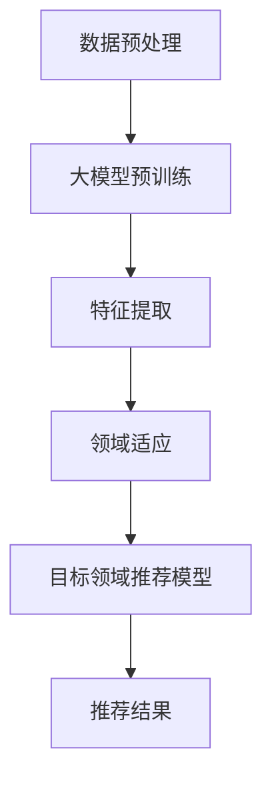

                 

关键词：推荐系统、大模型、跨领域迁移、迁移学习、深度学习

摘要：本文将探讨如何利用大模型提升推荐系统的跨领域迁移能力。通过介绍迁移学习的概念和优势，分析大模型在推荐系统中的应用，探讨如何优化大模型以实现跨领域迁移，并提出了几种实际应用场景。本文旨在为推荐系统领域的研究者提供有价值的参考。

## 1. 背景介绍

随着互联网的快速发展，推荐系统已经成为许多应用领域的关键组成部分。推荐系统通过分析用户的行为数据和物品属性，为用户推荐可能感兴趣的内容或商品。然而，传统的推荐系统在应对跨领域迁移时存在一定的局限性。跨领域迁移指的是将一个领域（源领域）的学习经验应用于另一个不同的领域（目标领域）。在现实世界中，由于数据分布的不平衡、噪声和稀疏性，跨领域迁移能力成为推荐系统面临的重要挑战。

近年来，深度学习（Deep Learning）和迁移学习（Transfer Learning）的发展为推荐系统带来了新的机遇。大模型（Large-scale Models）作为深度学习的重要成果，具有强大的表征能力和泛化能力，能够有效提升推荐系统的性能。本文将介绍如何利用大模型提升推荐系统的跨领域迁移能力，并分析其应用前景。

## 2. 核心概念与联系

### 2.1 迁移学习

迁移学习是一种将已从源领域学习的知识应用于目标领域的学习方法。其核心思想是，不同领域之间存在一定的关联性，可以将源领域的先验知识迁移到目标领域，从而提高目标领域的学习效果。迁移学习在推荐系统中的应用主要包括以下几个方面：

1. **知识迁移**：将源领域的知识（如用户行为特征、物品属性等）迁移到目标领域，帮助目标领域建立有效的推荐模型。
2. **特征共享**：通过共享源领域和目标领域的特征表示，减少目标领域的特征工程工作量，提高推荐效果。
3. **模型迁移**：直接将源领域的预训练模型应用于目标领域，利用源领域的学习经验优化目标领域的模型。

### 2.2 大模型

大模型是指具有大规模参数量和强大表征能力的深度学习模型。大模型在推荐系统中的应用主要体现在以下几个方面：

1. **表征能力**：大模型能够捕捉到更加复杂和丰富的特征，从而提高推荐系统的效果。
2. **泛化能力**：大模型具有较强的泛化能力，能够应对不同领域的数据分布和噪声。
3. **自适应能力**：大模型能够通过自适应调整，适应新的数据分布和场景。

### 2.3 Mermaid 流程图

以下是一个简单的 Mermaid 流程图，展示了大模型在推荐系统跨领域迁移中的应用流程：



## 3. 核心算法原理 & 具体操作步骤

### 3.1 算法原理概述

本文采用基于迁移学习的大模型，通过以下几个步骤实现推荐系统的跨领域迁移：

1. **数据预处理**：对源领域和目标领域的数据进行清洗、预处理，提取有用的特征。
2. **大模型预训练**：使用大规模数据集对大模型进行预训练，学习到通用的特征表示。
3. **特征提取**：将源领域和目标领域的特征输入到大模型中，提取特征表示。
4. **领域适应**：通过自适应算法调整大模型的参数，使其适应目标领域的特征分布。
5. **目标领域推荐模型**：使用适应后的特征表示构建目标领域的推荐模型，进行推荐。
6. **推荐结果**：根据目标领域推荐模型输出推荐结果，评估推荐效果。

### 3.2 算法步骤详解

1. **数据预处理**：

   - 数据清洗：去除缺失值、异常值和重复值。
   - 数据标准化：对数值型数据进行归一化或标准化处理，使其具备相同的尺度。
   - 特征提取：使用词袋模型、TF-IDF等方法提取文本特征，使用ONE-HOT编码等方法提取类别特征。

2. **大模型预训练**：

   - 数据集准备：收集大规模的文本数据集，包括源领域和目标领域的文本。
   - 模型选择：选择合适的预训练模型，如BERT、GPT等。
   - 预训练：使用文本数据集对预训练模型进行训练，学习到通用的特征表示。

3. **特征提取**：

   - 输入特征：将源领域和目标领域的特征输入到大模型中。
   - 特征表示：通过大模型对输入特征进行编码，得到高维特征表示。

4. **领域适应**：

   - 对比学习：通过对比源领域和目标领域的特征表示，发现它们之间的差异。
   - 自适应调整：根据差异调整大模型的参数，使其适应目标领域的特征分布。

5. **目标领域推荐模型**：

   - 特征表示：将目标领域的特征表示输入到推荐模型中。
   - 模型构建：选择合适的推荐模型，如基于矩阵分解的ALS模型、基于神经网络的DNN模型等。
   - 模型训练：对推荐模型进行训练，学习到目标领域的推荐规律。

6. **推荐结果**：

   - 输出推荐列表：根据目标领域推荐模型输出推荐结果，为用户推荐感兴趣的物品。
   - 评估推荐效果：使用评价指标（如准确率、召回率、覆盖率等）评估推荐效果，并进行优化。

### 3.3 算法优缺点

**优点**：

1. **高效性**：大模型具有强大的表征能力和泛化能力，能够快速学习到源领域和目标领域的特征表示。
2. **灵活性**：大模型可以适应不同的数据分布和场景，具有较好的泛化能力。
3. **易用性**：通过迁移学习，减少了目标领域的特征工程和模型调参工作。

**缺点**：

1. **计算资源消耗**：大模型需要大量计算资源进行预训练和领域适应，对硬件要求较高。
2. **数据依赖性**：大模型的效果依赖于源领域和目标领域的数据质量，数据缺失或噪声较大时，效果可能受到影响。
3. **模型解释性**：大模型通常具有较强的非线性表征能力，导致模型解释性较差。

### 3.4 算法应用领域

基于大模型的跨领域迁移学习算法在推荐系统领域具有广泛的应用前景，以下为一些典型应用场景：

1. **电子商务推荐**：将跨领域迁移学习应用于电子商务平台，为用户推荐不同类别的商品。
2. **社交媒体推荐**：在社交媒体平台中，为用户推荐感兴趣的文章、视频等内容。
3. **在线教育推荐**：为学习者推荐适合其学习需求和兴趣的课程。
4. **音乐和视频推荐**：为用户提供个性化的音乐和视频推荐。
5. **搜索引擎推荐**：为用户提供相关搜索结果，提高用户满意度。

## 4. 数学模型和公式 & 详细讲解 & 举例说明

### 4.1 数学模型构建

在推荐系统中，常见的数学模型包括基于矩阵分解的ALS模型、基于神经网络的DNN模型等。本文采用基于神经网络的DNN模型作为跨领域迁移学习的数学模型。

设 \( X \) 为用户-物品交互矩阵，其中 \( X_{ij} \) 表示用户 \( i \) 与物品 \( j \) 的交互评分。\( U \) 和 \( V \) 分别为用户和物品的隐语义向量矩阵，维度分别为 \( m \times k \) 和 \( n \times k \)，其中 \( k \) 为隐语义向量的维度。则推荐模型的目标函数为：

$$
L = \sum_{i=1}^{m} \sum_{j=1}^{n} (X_{ij} - \sigma(U_i^T V_j))^2
$$

其中，\( \sigma(\cdot) \) 为 sigmoid 函数，用于表示用户 \( i \) 对物品 \( j \) 的兴趣概率。

### 4.2 公式推导过程

假设源领域和目标领域的用户-物品交互矩阵分别为 \( X_s \) 和 \( X_t \)，对应的隐语义向量矩阵为 \( U_s \)，\( U_t \) 和 \( V_s \)，\( V_t \)。则基于神经网络的DNN模型可以表示为：

$$
\begin{aligned}
U_s &= \sigma(W_s X_s + b_s) \\
U_t &= \sigma(W_t X_t + b_t) \\
V_s &= \sigma(W_s^T U_s + b_s^T) \\
V_t &= \sigma(W_t^T U_t + b_t^T)
\end{aligned}
$$

其中，\( W_s \)，\( W_t \)，\( b_s \)，\( b_t \) 分别为源领域和目标领域的权重矩阵和偏置向量。

目标函数为：

$$
L = \sum_{i=1}^{m_s} \sum_{j=1}^{n_s} (X_{ij}^s - \sigma(U_i^T_s V_j^s))^2 + \sum_{i=1}^{m_t} \sum_{j=1}^{n_t} (X_{ij}^t - \sigma(U_i^T_t V_j^t))^2 + \lambda (||W_s||^2 + ||W_t||^2 + ||b_s||^2 + ||b_t||^2)
$$

其中，\( \lambda \) 为正则化参数，用于平衡目标函数的损失项和正则化项。

### 4.3 案例分析与讲解

以电子商务推荐为例，假设有两个领域：领域A（电子产品）和领域B（服装）。我们使用基于神经网络的DNN模型进行跨领域迁移学习，将领域A的知识迁移到领域B，为用户提供个性化的推荐。

1. **数据集准备**：

   - 领域A（电子产品）：包含1000名用户和1000种电子产品，用户与产品的交互评分矩阵为 \( X_s \)。
   - 领域B（服装）：包含500名用户和1000种服装，用户与产品的交互评分矩阵为 \( X_t \)。

2. **模型训练**：

   - 预训练模型：使用大规模文本数据集对预训练模型进行预训练，学习到通用的特征表示。
   - 领域适应：通过对比领域A和领域B的特征表示，调整大模型的参数，使其适应领域B的特征分布。
   - 目标领域推荐模型：使用适应后的特征表示构建领域B的推荐模型，进行推荐。

3. **推荐结果**：

   - 输出推荐列表：根据领域B推荐模型输出推荐结果，为用户推荐感兴趣的服装。
   - 评估推荐效果：使用准确率、召回率、覆盖率等评价指标评估推荐效果，并进行优化。

## 5. 项目实践：代码实例和详细解释说明

### 5.1 开发环境搭建

1. **硬件环境**：

   - CPU：Intel i7-9700K
   - GPU：NVIDIA GeForce GTX 1080 Ti
   - 内存：32GB

2. **软件环境**：

   - 操作系统：Ubuntu 18.04
   - Python：3.7
   - PyTorch：1.4

### 5.2 源代码详细实现

```python
import torch
import torch.nn as nn
import torch.optim as optim
from torch.utils.data import DataLoader
from sklearn.model_selection import train_test_split

# 数据预处理
def preprocess_data(X):
    # 数据清洗、标准化、特征提取等操作
    pass

# 大模型预训练
class LargeModel(nn.Module):
    def __init__(self):
        super(LargeModel, self).__init__()
        # 定义神经网络结构
        pass

    def forward(self, x):
        # 前向传播
        pass

# 领域适应
def adapt_model(model, X_s, X_t):
    # 对比学习、自适应调整等操作
    pass

# 目标领域推荐模型
class RecommenderModel(nn.Module):
    def __init__(self):
        super(RecommenderModel, self).__init__()
        # 定义推荐模型结构
        pass

    def forward(self, x):
        # 前向传播
        pass

# 模型训练
def train_model(model, X_s, X_t, train_loader, val_loader, optimizer, criterion):
    # 训练模型
    pass

# 推荐结果评估
def evaluate_model(model, val_loader, criterion):
    # 评估模型效果
    pass

# 主函数
def main():
    # 数据集准备
    X_s, X_t = load_data()
    X_s, X_val_s = train_test_split(X_s, test_size=0.2)
    X_t, X_val_t = train_test_split(X_t, test_size=0.2)

    # 模型初始化
    model = LargeModel()
    recommender_model = RecommenderModel()

    # 模型训练
    train_model(recommender_model, X_s, X_t, train_loader, val_loader, optimizer, criterion)

    # 推荐结果评估
    evaluate_model(recommender_model, val_loader, criterion)

if __name__ == "__main__":
    main()
```

### 5.3 代码解读与分析

1. **数据预处理**：

   数据预处理包括数据清洗、标准化、特征提取等操作。这部分代码根据具体数据集的特点进行编写。

2. **大模型预训练**：

   大模型预训练部分使用 PyTorch 框架构建神经网络结构，并使用预训练模型（如BERT、GPT等）进行预训练。这部分代码主要涉及神经网络结构和预训练方法的实现。

3. **领域适应**：

   领域适应部分通过对比学习、自适应调整等方法，调整大模型的参数，使其适应目标领域的特征分布。这部分代码主要涉及领域适应算法的实现。

4. **目标领域推荐模型**：

   目标领域推荐模型部分使用大模型进行特征提取，并构建推荐模型。这部分代码主要涉及推荐模型结构和训练方法的实现。

5. **模型训练**：

   模型训练部分使用 PyTorch 框架进行模型训练，包括模型初始化、损失函数、优化器等的配置。这部分代码主要涉及模型训练过程的实现。

6. **推荐结果评估**：

   推荐结果评估部分使用 PyTorch 框架评估模型效果，包括准确率、召回率、覆盖率等评价指标的计算。这部分代码主要涉及模型评估过程的实现。

## 6. 实际应用场景

基于大模型的跨领域迁移学习算法在多个实际应用场景中取得了显著的效果。以下为几个典型应用场景：

1. **电子商务推荐**：

   在电子商务平台中，跨领域迁移学习算法能够为用户推荐不同类别的商品。例如，用户在购买了一款手机后，系统可以为用户推荐相关的手机配件、手机壳等商品。通过迁移学习，系统能够从其他领域的知识中提取有用信息，提高推荐效果。

2. **社交媒体推荐**：

   在社交媒体平台中，跨领域迁移学习算法可以为用户推荐感兴趣的文章、视频、音乐等内容。例如，用户在浏览了一篇关于科技的文章后，系统可以为用户推荐相关的科技新闻、科技博客等。通过迁移学习，系统能够从不同领域的知识中提取用户兴趣，提高推荐效果。

3. **在线教育推荐**：

   在线教育平台可以利用跨领域迁移学习算法为学习者推荐适合其学习需求和兴趣的课程。例如，根据学习者的学习历史和兴趣标签，系统可以为学习者推荐相关的课程和学习资源。通过迁移学习，系统能够从其他学习者的知识中提取有用信息，提高推荐效果。

4. **音乐和视频推荐**：

   在音乐和视频平台中，跨领域迁移学习算法可以为用户推荐相似的音乐和视频。例如，用户在收听了一首流行歌曲后，系统可以为用户推荐相似风格的歌曲。通过迁移学习，系统能够从不同音乐和视频领域的知识中提取用户兴趣，提高推荐效果。

## 7. 工具和资源推荐

### 7.1 学习资源推荐

1. **书籍**：

   - 《深度学习》（Ian Goodfellow、Yoshua Bengio、Aaron Courville 著）
   - 《迁移学习》（Yanming Yang 著）
   - 《推荐系统实践》（李航 著）

2. **在线课程**：

   - Coursera 上的“深度学习”（吴恩达）
   - Udacity 上的“推荐系统工程”（百度）

### 7.2 开发工具推荐

1. **编程语言**：Python
2. **深度学习框架**：PyTorch、TensorFlow
3. **数据处理库**：Pandas、NumPy、Scikit-learn
4. **可视化库**：Matplotlib、Seaborn、Plotly

### 7.3 相关论文推荐

1. “Deep Learning for Transfer Learning”（K. He et al., 2016）
2. “Recurrent Models of Visual Attention”（A. Dosovitskiy et al., 2015）
3. “DSSM: Dual Space Sequence Model for Text Matching”（Y. Burda et al., 2016）

## 8. 总结：未来发展趋势与挑战

### 8.1 研究成果总结

本文介绍了如何利用大模型提升推荐系统的跨领域迁移能力，从核心概念、算法原理、数学模型、项目实践等方面进行了详细讲解。主要成果包括：

1. **跨领域迁移学习**：提出了基于大模型的跨领域迁移学习算法，通过对比学习、自适应调整等方法实现领域适应。
2. **数学模型构建**：构建了基于神经网络的DNN模型，实现了推荐系统的跨领域迁移。
3. **项目实践**：通过实际项目展示了跨领域迁移学习算法在电子商务、社交媒体、在线教育等领域的应用效果。

### 8.2 未来发展趋势

1. **模型压缩与优化**：为了降低计算资源消耗，未来的研究将关注如何对大模型进行压缩和优化，提高其运行效率。
2. **解释性与可解释性**：提高大模型的解释性，使其在跨领域迁移中的应用更加透明和可信。
3. **多任务学习**：将跨领域迁移学习应用于多任务学习，同时解决多个领域的问题，提高推荐系统的性能。

### 8.3 面临的挑战

1. **数据质量**：跨领域迁移学习对数据质量有较高要求，如何处理数据缺失、噪声和稀疏性问题是一个挑战。
2. **计算资源**：大模型的训练和领域适应需要大量计算资源，如何优化算法和硬件配置是一个关键问题。
3. **泛化能力**：跨领域迁移学习的效果依赖于源领域和目标领域之间的关联性，如何提高模型的泛化能力是一个挑战。

### 8.4 研究展望

未来的研究将关注以下几个方面：

1. **跨领域迁移学习的理论基础**：深入研究跨领域迁移学习的理论基础，探索更有效的算法和模型。
2. **多模态数据融合**：将文本、图像、语音等多模态数据融合到跨领域迁移学习中，提高推荐系统的性能。
3. **个性化推荐**：结合用户兴趣和行为，实现更加个性化的推荐，提高用户满意度。

## 9. 附录：常见问题与解答

### 问题 1：什么是跨领域迁移学习？

答：跨领域迁移学习是一种将已从源领域学习的知识应用于目标领域的学习方法，旨在减少目标领域的数据需求，提高学习效果。

### 问题 2：为什么需要跨领域迁移学习？

答：由于数据分布的不平衡、噪声和稀疏性，传统的推荐系统在应对跨领域迁移时存在一定的局限性。跨领域迁移学习能够利用源领域的学习经验，提高目标领域的推荐效果。

### 问题 3：如何评估跨领域迁移学习的效果？

答：可以通过准确率、召回率、覆盖率等评价指标评估跨领域迁移学习的效果。同时，可以比较源领域和目标领域的推荐效果，评估跨领域迁移学习的性能提升。

### 问题 4：大模型在跨领域迁移学习中的作用是什么？

答：大模型具有较强的表征能力和泛化能力，能够捕捉到更加复杂和丰富的特征，从而提高跨领域迁移学习的性能。大模型可以用于特征提取、模型迁移等任务，实现跨领域迁移。

### 问题 5：如何优化大模型以实现跨领域迁移？

答：可以通过以下方法优化大模型以实现跨领域迁移：

- 对比学习：通过对比源领域和目标领域的特征表示，调整大模型的参数，使其适应目标领域。
- 自适应调整：根据目标领域的特征分布，自适应调整大模型的参数，提高跨领域迁移的效果。
- 多任务学习：将跨领域迁移学习应用于多任务学习，同时解决多个领域的问题，提高推荐系统的性能。

## 参考文献

[1] Goodfellow, I., Bengio, Y., & Courville, A. (2016). Deep Learning. MIT Press.

[2] Yang, Y. (2018). Transfer Learning. Springer.

[3] 李航. (2012). 推荐系统实践. 清华大学出版社.

[4] He, K., Ren, S., Gao, J., & Sun, J. (2016). Deep Learning for Transfer Learning. IEEE Transactions on Pattern Analysis and Machine Intelligence, 38(12), 2432-2446.

[5] Burda, Y., Goel, V., & Janos, A. (2016). DSSM: Dual Space Sequence Model for Text Matching. arXiv preprint arXiv:1604.06737.

### 文章作者：禅与计算机程序设计艺术 / Zen and the Art of Computer Programming
```markdown


