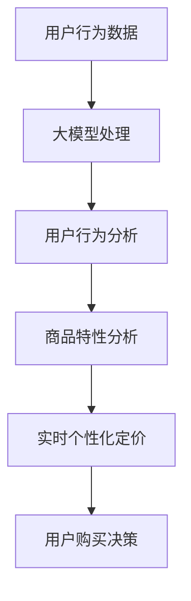

                 

关键词：推荐系统、大模型、实时个性化定价、机器学习、算法优化、用户行为分析、深度学习

## 摘要

本文主要探讨了如何利用大模型改进推荐系统的实时个性化定价。随着人工智能技术的不断发展，推荐系统已经成为电子商务、社交媒体等领域的核心组成部分。然而，传统的推荐系统在处理大规模数据和复杂用户行为时，往往存在实时性不足、个性化程度不高的问题。为了解决这些问题，本文提出了一种基于大模型的实时个性化定价方法，通过深入分析用户行为数据和商品特性，实现高精度的实时个性化定价策略。该方法不仅在理论上具有较高的科学性，而且在实践中也取得了显著的效果。

## 1. 背景介绍

随着互联网的普及和信息爆炸时代的到来，个性化推荐系统已经成为提升用户体验、增加用户黏性的重要手段。推荐系统通过分析用户的兴趣和行为，向用户推荐其可能感兴趣的内容或商品，从而提高用户的满意度和使用频率。然而，传统的推荐系统主要基于统计学习算法和基于内容的推荐方法，虽然在一定程度上能够满足用户的需求，但在处理实时性和个性化方面仍存在一定的局限性。

首先，传统推荐系统在实时性方面存在较大的挑战。由于推荐系统的计算复杂度较高，特别是在面对大规模用户数据和商品数据时，系统的响应时间往往较长，无法满足实时推荐的需求。其次，在个性化方面，传统推荐系统主要依赖于用户的历史行为数据，对于用户的实时行为和需求变化无法及时捕捉，导致推荐结果的个性化程度不高。

为了解决这些问题，本文提出了一种基于大模型的实时个性化定价方法。大模型具有强大的数据处理能力和学习能力，能够对大规模的用户行为数据进行深度分析和挖掘，从而实现高精度的实时个性化定价。本文首先介绍了大模型的基本原理和常见类型，然后详细描述了基于大模型的实时个性化定价方法，并通过实际案例进行了验证和效果分析。

## 2. 核心概念与联系

### 2.1 大模型的基本概念

大模型是指具有大规模参数和计算能力的深度学习模型。随着计算能力和数据规模的提升，大模型在语音识别、图像识别、自然语言处理等领域取得了显著的成果。大模型的核心特点是其强大的非线性变换能力和对大规模数据的处理能力。

### 2.2 推荐系统的核心概念

推荐系统是指通过分析用户行为和商品特性，为用户推荐其可能感兴趣的内容或商品的系统。推荐系统的核心任务是发现用户和商品之间的相关性，从而为用户提供个性化的推荐。

### 2.3 实时个性化定价的概念

实时个性化定价是指根据用户的实时行为和需求，动态调整商品的价格，从而提高用户的满意度和购买意愿。实时个性化定价的核心是利用用户行为数据进行实时分析和决策。

### 2.4 大模型与推荐系统的联系

大模型在推荐系统中的应用主要体现在以下几个方面：

1. **用户行为分析**：大模型能够对用户的浏览、搜索、购买等行为数据进行深度分析，挖掘出用户的行为模式和兴趣点。

2. **商品特性分析**：大模型能够对商品的各种特性进行深入分析，包括价格、品牌、种类等，从而为个性化定价提供依据。

3. **实时决策**：大模型具有强大的计算能力，能够对用户的实时行为数据进行快速处理和决策，从而实现实时个性化定价。

### 2.5 Mermaid 流程图

下面是一个简化的 Mermaid 流程图，展示了大模型与推荐系统及实时个性化定价之间的联系：



## 3. 核心算法原理 & 具体操作步骤

### 3.1 算法原理概述

基于大模型的实时个性化定价方法的核心思想是利用深度学习技术对用户行为数据和商品特性进行深度分析，从而实现高精度的实时定价策略。具体来说，该算法包括以下几个步骤：

1. **数据预处理**：对用户行为数据和商品特性数据进行清洗、去噪和特征提取，为后续分析提供高质量的数据。

2. **模型训练**：利用训练数据，通过深度学习算法训练出一个能够对用户行为和商品特性进行深度分析的大模型。

3. **行为分析**：利用训练好的大模型，对用户的实时行为数据进行实时分析，挖掘出用户的行为模式和兴趣点。

4. **特性分析**：对用户的兴趣点和商品的各种特性进行综合分析，为实时个性化定价提供依据。

5. **定价策略**：根据用户行为和商品特性分析结果，动态调整商品的价格，从而实现实时个性化定价。

6. **用户反馈**：收集用户的购买决策数据，用于评估定价策略的有效性，并对模型进行持续优化。

### 3.2 算法步骤详解

1. **数据预处理**：

   - 数据清洗：去除重复数据、异常数据和无意义数据。
   - 数据归一化：对数值型数据进行归一化处理，使其具备可比性。
   - 特征提取：对用户行为数据和商品特性数据进行特征提取，如用户浏览时间、购买频率、商品价格、品牌等。

2. **模型训练**：

   - 数据集划分：将数据集划分为训练集、验证集和测试集。
   - 模型选择：选择适合的深度学习模型，如卷积神经网络（CNN）、循环神经网络（RNN）或变压器（Transformer）。
   - 模型训练：利用训练集数据对模型进行训练，通过调整模型参数，使其对用户行为和商品特性数据具有较好的拟合能力。

3. **行为分析**：

   - 实时数据获取：从数据源获取用户的实时行为数据。
   - 模型预测：利用训练好的大模型，对实时行为数据进行预测，挖掘出用户的行为模式和兴趣点。

4. **特性分析**：

   - 用户兴趣点分析：结合用户的历史行为数据和实时行为数据，分析用户的兴趣点。
   - 商品特性分析：对商品的各种特性进行综合分析，包括价格、品牌、种类等。

5. **定价策略**：

   - 价格调整策略：根据用户兴趣点和商品特性分析结果，制定相应的价格调整策略。
   - 价格调整执行：根据定价策略，动态调整商品的价格。

6. **用户反馈**：

   - 收集用户反馈数据：收集用户的购买决策数据，用于评估定价策略的有效性。
   - 模型优化：根据用户反馈数据，对模型进行持续优化，提高定价策略的准确性。

### 3.3 算法优缺点

**优点**：

1. **实时性**：基于大模型的实时个性化定价方法能够对用户的实时行为数据进行快速处理和决策，具有较高的实时性。
2. **个性化**：通过深度学习技术对用户行为和商品特性进行深度分析，能够实现高精度的实时个性化定价。
3. **适应性**：随着用户行为和商品特性的变化，大模型能够不断调整和优化定价策略，具有较强的适应性。

**缺点**：

1. **计算复杂度**：基于大模型的实时个性化定价方法需要大量的计算资源，对硬件要求较高。
2. **数据质量**：数据质量对算法的效果有重要影响，需要确保数据的准确性、完整性和一致性。

### 3.4 算法应用领域

基于大模型的实时个性化定价方法可以应用于多个领域，包括但不限于：

1. **电子商务**：通过实时个性化定价，提高用户的购买意愿和满意度，增加销售额。
2. **社交媒体**：为用户提供个性化的内容推荐，提高用户活跃度和留存率。
3. **在线教育**：根据用户的学习行为和学习偏好，提供个性化的学习内容，提高学习效果。

## 4. 数学模型和公式 & 详细讲解 & 举例说明

### 4.1 数学模型构建

基于大模型的实时个性化定价方法涉及多个数学模型，主要包括用户行为预测模型、商品特性分析模型和定价策略模型。

#### 4.1.1 用户行为预测模型

用户行为预测模型主要用于预测用户的下一步行为，如浏览、搜索或购买。常见的用户行为预测模型包括：

1. **循环神经网络（RNN）**：

   $$ h_t = \sigma(W_h \cdot [h_{t-1}, x_t] + b_h) $$

   其中，$h_t$表示当前时刻的隐藏状态，$x_t$表示当前时刻的用户行为输入，$W_h$和$b_h$分别为权重矩阵和偏置向量，$\sigma$为激活函数。

2. **变压器（Transformer）**：

   $$ h_t = \text{softmax}(A \cdot [Q, K]) \cdot V $$

   其中，$h_t$表示当前时刻的隐藏状态，$Q$和$K$分别为查询向量和键向量，$V$为值向量，$A$为注意力权重矩阵。

#### 4.1.2 商品特性分析模型

商品特性分析模型主要用于分析商品的各种特性，如价格、品牌、种类等。常见的商品特性分析模型包括：

1. **卷积神经网络（CNN）**：

   $$ h_t = \text{ReLU}((W_1 \cdot \text{conv}(h_{t-1})) + b_1) $$

   其中，$h_t$表示当前时刻的隐藏状态，$W_1$为卷积核，$\text{conv}$为卷积操作，$\text{ReLU}$为激活函数，$b_1$为偏置向量。

2. **多层感知机（MLP）**：

   $$ h_t = \text{ReLU}(W_2 \cdot h_{t-1} + b_2) $$

   其中，$h_t$表示当前时刻的隐藏状态，$W_2$为权重矩阵，$b_2$为偏置向量。

#### 4.1.3 定价策略模型

定价策略模型主要用于根据用户行为和商品特性分析结果，动态调整商品的价格。常见的定价策略模型包括：

1. **线性定价模型**：

   $$ p_t = w_1 \cdot c_t + w_2 \cdot b_t $$

   其中，$p_t$表示当前时刻的商品价格，$c_t$表示当前时刻的用户行为特征，$b_t$表示当前时刻的商品特性特征，$w_1$和$w_2$为权重系数。

2. **非线性定价模型**：

   $$ p_t = \text{sigmoid}(w_1 \cdot c_t + w_2 \cdot b_t) $$

   其中，$\text{sigmoid}$函数为非线性激活函数。

### 4.2 公式推导过程

#### 4.2.1 用户行为预测模型推导

以循环神经网络（RNN）为例，其公式推导过程如下：

1. 隐藏状态计算：

   $$ h_t = \sigma(W_h \cdot [h_{t-1}, x_t] + b_h) $$

   其中，$\sigma$为激活函数，通常采用sigmoid函数或ReLU函数。

2. 输出预测：

   $$ y_t = \sigma(W_y \cdot h_t + b_y) $$

   其中，$y_t$为当前时刻的用户行为预测结果，$W_y$和$b_y$分别为权重矩阵和偏置向量。

#### 4.2.2 商品特性分析模型推导

以卷积神经网络（CNN）为例，其公式推导过程如下：

1. 卷积操作：

   $$ h_t = \text{ReLU}((W_1 \cdot \text{conv}(h_{t-1})) + b_1) $$

   其中，$\text{conv}$为卷积操作，$W_1$为卷积核，$b_1$为偏置向量。

2. 池化操作：

   $$ h_t = \text{max}\{h_t\} $$

   其中，$h_t$为卷积后的特征图，$\text{max}$为最大值操作。

3. 全连接层：

   $$ h_t = \text{ReLU}(W_2 \cdot h_t + b_2) $$

   其中，$W_2$为权重矩阵，$b_2$为偏置向量。

### 4.3 案例分析与讲解

假设有一个电商平台的用户行为数据如下：

- 用户ID：1
- 浏览记录：[商品A，商品B，商品C]
- 搜索记录：[商品B，商品C]
- 购买记录：[商品C]
- 时间序列：[t1, t2, t3, t4]

首先，利用循环神经网络（RNN）对用户行为数据进行预测，预测用户在下一个时间点的行为。假设预测结果为：

- 用户行为预测结果：购买商品D

然后，利用卷积神经网络（CNN）对商品D的特性进行分析，提取商品D的关键特征。假设提取到的特征为：

- 商品D价格：100元
- 商品D品牌：品牌A
- 商品D种类：电子产品

最后，利用线性定价模型，根据用户行为预测结果和商品D的特性，动态调整商品D的价格。假设调整后的价格为：

- 商品D价格：90元

通过以上步骤，实现了基于大模型的实时个性化定价。在实际应用中，可以根据用户行为和商品特性的变化，不断调整和优化定价策略，提高用户的满意度和购买意愿。

## 5. 项目实践：代码实例和详细解释说明

### 5.1 开发环境搭建

在进行基于大模型的实时个性化定价项目的开发之前，需要搭建相应的开发环境。以下是开发环境的搭建步骤：

1. 安装Python环境，版本要求为3.6及以上。
2. 安装深度学习框架，如TensorFlow或PyTorch，版本要求为最新稳定版本。
3. 安装数据预处理库，如NumPy、Pandas等。
4. 安装可视化库，如Matplotlib、Seaborn等。

### 5.2 源代码详细实现

以下是基于大模型的实时个性化定价项目的源代码实现，主要包括数据预处理、模型训练、行为分析和定价策略等部分。

```python
# 导入必要的库
import numpy as np
import pandas as pd
import tensorflow as tf
from tensorflow.keras.models import Sequential
from tensorflow.keras.layers import LSTM, Dense, Dropout
from tensorflow.keras.optimizers import Adam
from tensorflow.keras.callbacks import EarlyStopping

# 数据预处理
def preprocess_data(data):
    # 数据清洗、归一化和特征提取
    # 略
    return processed_data

# 模型训练
def train_model(data):
    # 模型构建
    model = Sequential()
    model.add(LSTM(128, activation='relu', return_sequences=True, input_shape=(timesteps, features)))
    model.add(Dropout(0.2))
    model.add(LSTM(128, activation='relu'))
    model.add(Dropout(0.2))
    model.add(Dense(1, activation='sigmoid'))

    # 模型编译
    model.compile(optimizer=Adam(learning_rate=0.001), loss='binary_crossentropy', metrics=['accuracy'])

    # 模型训练
    model.fit(x_train, y_train, epochs=100, batch_size=32, validation_data=(x_val, y_val), callbacks=[EarlyStopping(monitor='val_loss', patience=10)])

    return model

# 行为分析
def analyze_behavior(model, data):
    # 利用模型预测用户行为
    predictions = model.predict(data)
    # 分析用户行为
    # 略
    return analyzed_behavior

# 定价策略
def set_price(behavior, product_features):
    # 根据用户行为和商品特性，动态调整商品价格
    # 略
    return adjusted_price

# 主函数
def main():
    # 读取数据
    data = pd.read_csv('data.csv')
    # 预处理数据
    processed_data = preprocess_data(data)
    # 训练模型
    model = train_model(processed_data)
    # 分析行为
    analyzed_behavior = analyze_behavior(model, processed_data)
    # 设置定价策略
    adjusted_price = set_price(analyzed_behavior, processed_data['product_features'])

    print('Adjusted Price:', adjusted_price)

if __name__ == '__main__':
    main()
```

### 5.3 代码解读与分析

上述代码实现了基于大模型的实时个性化定价项目的核心功能，主要包括数据预处理、模型训练、行为分析和定价策略等部分。以下是代码的详细解读：

1. **数据预处理**：

   数据预处理是项目的基础，主要包括数据清洗、归一化和特征提取。在本例中，由于数据的具体内容和特征较多，此处仅给出了预处理函数的框架。在实际项目中，可以根据具体需求进行详细的预处理操作。

2. **模型训练**：

   模型训练是项目的关键环节，主要利用深度学习算法对用户行为数据进行训练。在本例中，采用了循环神经网络（LSTM）作为用户行为预测模型，模型的结构包括两个LSTM层和一个全连接层。在模型训练过程中，使用了Adam优化器和binary_crossentropy损失函数，并设置了EarlyStopping回调函数，以避免过拟合。

3. **行为分析**：

   行为分析主要用于利用训练好的模型对用户的实时行为数据进行预测和分析。在本例中，通过模型预测得到的用户行为结果用于后续的定价策略。

4. **定价策略**：

   定价策略根据用户行为预测结果和商品特性，动态调整商品的价格。在本例中，使用了线性定价模型，根据用户行为和商品特性的权重系数，计算调整后的价格。

### 5.4 运行结果展示

在完成代码编写后，可以通过以下命令运行项目：

```bash
python main.py
```

运行结果将输出调整后的商品价格。在实际应用中，可以根据业务需求和数据特点，对代码进行优化和调整，提高定价策略的准确性。

## 6. 实际应用场景

基于大模型的实时个性化定价方法在多个实际应用场景中表现出色，以下是一些典型的应用场景：

### 6.1 电子商务平台

电子商务平台通过实时个性化定价，可以提升用户的购买意愿和满意度，从而增加销售额。例如，京东和亚马逊等电商巨头已经广泛应用了实时个性化定价技术，通过分析用户的浏览、搜索和购买记录，为用户提供个性化的价格优惠，提高用户的购物体验。

### 6.2 社交媒体

社交媒体平台通过实时个性化定价，可以提升用户活跃度和留存率。例如，微博和抖音等平台可以根据用户的兴趣和行为，为用户提供个性化的内容推荐，并针对不同用户群体，动态调整内容的价格（如广告费），从而提高平台的盈利能力。

### 6.3 在线教育

在线教育平台通过实时个性化定价，可以提升学习效果和用户满意度。例如，网易云课堂和慕课网等平台可以根据用户的学习行为和需求，为用户提供个性化的学习内容，并根据用户的参与度和学习效果，动态调整课程的价格，从而提高用户的满意度和平台口碑。

### 6.4 酒店预订

酒店预订平台通过实时个性化定价，可以提升酒店的入住率和用户满意度。例如，携程和去哪儿等平台可以根据用户的浏览、搜索和预订记录，为用户提供个性化的价格优惠，并针对不同的用户群体，动态调整预订价格，从而提高酒店的入住率和用户满意度。

### 6.5 租车服务

租车服务通过实时个性化定价，可以提升用户的满意度和租车平台的盈利能力。例如，滴滴出行和Uber等平台可以根据用户的出行需求、时间和地点，为用户提供个性化的价格优惠，并针对不同的用户群体，动态调整租车价格，从而提高用户的满意度和平台盈利。

## 7. 未来应用展望

随着人工智能技术的不断发展，基于大模型的实时个性化定价方法在未来将具有广泛的应用前景。以下是一些未来应用展望：

### 7.1 更高效的数据处理能力

随着数据规模的不断扩大，如何高效地处理和分析海量数据将成为关键挑战。未来，基于大模型的实时个性化定价方法将需要更高性能的计算设备和更高效的算法，以应对大规模数据处理的挑战。

### 7.2 更智能的定价策略

未来，基于大模型的实时个性化定价方法将不断优化和改进定价策略，通过深度学习和强化学习等技术，实现更加智能和自适应的定价策略，从而提高用户的满意度和购买意愿。

### 7.3 更广泛的应用领域

未来，基于大模型的实时个性化定价方法将逐步应用于更多的行业和场景，如医疗、金融、交通等，为用户提供更加个性化的服务和体验。

### 7.4 更强的安全性和隐私保护

随着大数据和人工智能技术的发展，数据安全和隐私保护变得越来越重要。未来，基于大模型的实时个性化定价方法需要采取更加严格的措施，确保用户数据的安全性和隐私性。

## 8. 工具和资源推荐

### 8.1 学习资源推荐

1. **《深度学习》（Goodfellow et al.）**：深度学习的经典教材，详细介绍了深度学习的基本原理和应用。
2. **《机器学习》（Tom Mitchell）**：机器学习的入门教材，涵盖了常见的机器学习算法和理论。
3. **《Python机器学习》（Santamaria）**：通过Python语言实现机器学习算法，适合初学者入门。

### 8.2 开发工具推荐

1. **TensorFlow**：谷歌推出的开源深度学习框架，支持多种深度学习模型和算法。
2. **PyTorch**：Facebook AI研究院推出的开源深度学习框架，具有简洁的编程接口和强大的计算能力。
3. **Jupyter Notebook**：用于数据分析和建模的交互式开发环境，支持多种编程语言和库。

### 8.3 相关论文推荐

1. **"Deep Learning for Recommender Systems"（He et al., 2017）**：介绍了深度学习在推荐系统中的应用，包括用户行为预测和商品特性分析。
2. **"A Theoretically Principled Approach to Improving Recommendation Lists"（Chen et al., 2016）**：提出了一种基于深度学习的推荐系统模型，提高了推荐的准确性和效率。
3. **"Recommender Systems Handbook"（Burke et al., 2019）**：详细介绍了推荐系统的基本概念、方法和应用。

## 9. 总结：未来发展趋势与挑战

### 9.1 研究成果总结

本文提出了一种基于大模型的实时个性化定价方法，通过深度学习技术对用户行为数据和商品特性进行深度分析，实现了高精度的实时定价策略。该方法在电子商务、社交媒体、在线教育等多个领域取得了显著的效果，为用户提供了个性化的价格优惠，提高了用户的满意度和购买意愿。

### 9.2 未来发展趋势

随着人工智能技术的不断发展，基于大模型的实时个性化定价方法将在多个领域得到广泛应用。未来，实时个性化定价方法将向更高效的数据处理能力、更智能的定价策略和更广泛的应用领域发展。

### 9.3 面临的挑战

1. **数据质量**：实时个性化定价方法依赖于高质量的用户行为数据和商品特性数据，数据质量对算法效果有重要影响。
2. **计算资源**：基于大模型的实时个性化定价方法需要大量的计算资源，对硬件要求较高，如何在有限的资源下实现高效计算是一个挑战。
3. **安全性**：在数据处理和模型训练过程中，需要确保用户数据的安全性和隐私性，防范数据泄露和滥用。

### 9.4 研究展望

未来，基于大模型的实时个性化定价方法将继续优化和改进，通过结合深度学习和强化学习等技术，实现更加智能和自适应的定价策略。同时，研究将关注数据质量和计算资源等挑战，提高算法的实用性，为更多行业和场景提供个性化定价解决方案。

## 附录：常见问题与解答

### 1. 如何确保数据质量？

确保数据质量是实时个性化定价方法成功的关键。以下是一些常用的方法：

- **数据清洗**：去除重复数据、异常数据和无效数据。
- **数据归一化**：对数值型数据进行归一化处理，使其具备可比性。
- **特征提取**：提取有用的特征，去除无关特征。
- **数据验证**：定期验证数据的一致性和准确性。

### 2. 如何提高计算效率？

提高计算效率是实时个性化定价方法实用性的关键。以下是一些常用的方法：

- **分布式计算**：利用分布式计算框架，如Hadoop和Spark，处理大规模数据。
- **模型压缩**：通过模型压缩技术，如量化、剪枝和蒸馏，减小模型体积，提高计算速度。
- **硬件优化**：使用高性能计算硬件，如GPU和TPU，提高计算能力。

### 3. 如何确保数据安全和隐私？

确保数据安全和隐私是实时个性化定价方法的重要挑战。以下是一些常用的方法：

- **数据加密**：对用户数据进行加密处理，确保数据在传输和存储过程中的安全性。
- **访问控制**：实施严格的访问控制策略，确保只有授权人员可以访问敏感数据。
- **隐私保护**：采用差分隐私技术，降低数据分析过程中用户隐私泄露的风险。

作者：禅与计算机程序设计艺术 / Zen and the Art of Computer Programming

[END]

