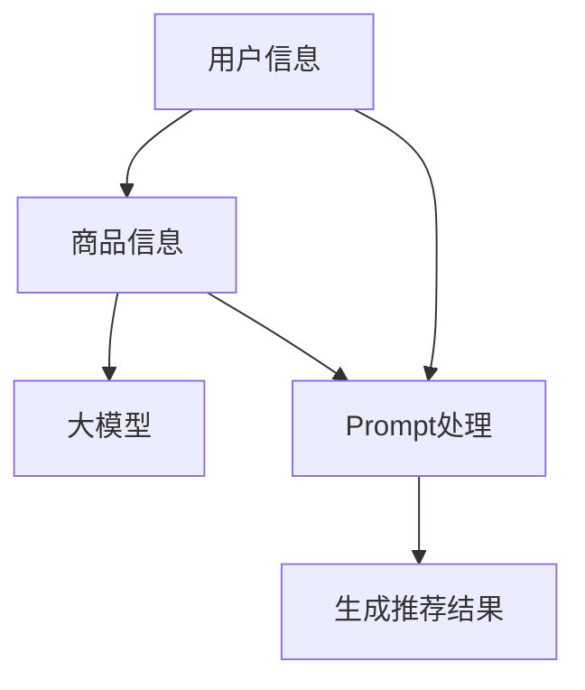

                 

关键词：大模型、商品推荐、Prompt策略、人工智能、算法原理、应用领域、数学模型

> 摘要：本文深入探讨了基于大模型的商品推荐系统中的一种新型Prompt策略。通过分析算法原理、具体操作步骤、数学模型以及项目实践，我们揭示了这种策略在商品推荐中的应用价值，并对其未来的发展前景进行了展望。

## 1. 背景介绍

在当今数字化时代，商品推荐系统已成为电商平台的重要组成部分。它们通过分析用户的历史行为和偏好，提供个性化的商品推荐，从而提高用户满意度和销售额。传统的推荐算法，如基于协同过滤的方法和基于内容的推荐算法，虽然在某些方面取得了成功，但仍然存在一些局限性。随着深度学习技术的发展，尤其是大模型的兴起，研究人员开始探索如何利用这些模型来提升商品推荐的性能。

Prompt策略是一种结合大模型和特定领域知识的新型方法。它通过在大模型中嵌入用户和商品的特征信息，使得模型能够更好地理解和生成个性化的推荐结果。本文将重点讨论Prompt策略在商品推荐系统中的应用，分析其算法原理、实现步骤以及数学模型。

## 2. 核心概念与联系

### 2.1 大模型

大模型是指具有巨大参数量的神经网络模型，如Transformer、BERT等。这些模型能够通过大量数据的学习，捕捉到复杂的特征关系，从而在多种任务上取得出色的表现。

### 2.2 商品推荐

商品推荐系统旨在为用户推荐他们可能感兴趣的商品。这通常涉及用户特征（如年龄、性别、浏览历史等）和商品特征（如价格、品牌、类别等）的分析和处理。

### 2.3 Prompt策略

Prompt策略是一种通过在预训练的大模型中嵌入特定任务信息来引导模型生成目标结果的方法。在商品推荐系统中，Prompt策略可以嵌入用户和商品的特定信息，帮助模型更准确地生成个性化的推荐结果。

### 2.4 Mermaid 流程图



在上述流程图中，用户信息和商品信息首先被输入到预训练的大模型中。然后，通过Prompt处理，这些信息被嵌入到模型中，使得模型能够更好地理解和生成个性化的推荐结果。最后，模型输出推荐结果。

## 3. 核心算法原理 & 具体操作步骤

### 3.1 算法原理概述

Prompt策略的核心思想是通过在大模型中嵌入特定任务的信息，引导模型生成目标结果。在商品推荐系统中，这一过程通常涉及以下步骤：

1. **数据预处理**：对用户和商品的特征数据进行编码，如使用词嵌入或数值编码。
2. **Prompt设计**：设计特定的Prompt来嵌入用户和商品的特征信息。这可以通过在大模型的输入层添加特定的文本或嵌入向量来实现。
3. **模型训练**：使用包含Prompt的数据集对大模型进行训练，使得模型能够更好地理解用户和商品的特征。
4. **推荐生成**：在训练好的模型中，输入用户信息，生成个性化的商品推荐。

### 3.2 算法步骤详解

1. **数据预处理**：

   - **用户特征**：包括用户的年龄、性别、浏览历史、购买历史等。这些特征可以通过数值编码或词嵌入进行表示。
   - **商品特征**：包括商品的价格、品牌、类别、销量等。同样，这些特征可以通过数值编码或词嵌入进行表示。

2. **Prompt设计**：

   - **文本Prompt**：例如，“推荐给喜欢购买电子产品的用户”，这种Prompt可以通过在大模型的输入层添加特定的文本来实现。
   - **嵌入Prompt**：例如，将用户和商品的嵌入向量拼接在一起，作为模型的输入。这种Prompt可以直接嵌入到大模型的输入层。

3. **模型训练**：

   - 使用包含Prompt的数据集对大模型进行训练。这可以通过在大模型的输入层添加Prompt模块来实现。训练过程中，模型将学习如何根据Prompt生成个性化的推荐结果。

4. **推荐生成**：

   - 在训练好的模型中，输入用户的特征信息，模型将根据Prompt生成个性化的商品推荐。

### 3.3 算法优缺点

**优点**：

- **高准确性**：通过大模型的学习能力，Prompt策略能够生成更准确的个性化推荐。
- **灵活性**：Prompt策略可以灵活地嵌入用户和商品的特征信息，适应不同的推荐场景。

**缺点**：

- **计算成本高**：大模型的训练和推理需要大量的计算资源。
- **数据需求大**：为了训练有效的Prompt，需要大量的用户和商品数据。

### 3.4 算法应用领域

Prompt策略在商品推荐系统中的应用广泛，尤其适用于以下领域：

- **电子商务平台**：为用户提供个性化的商品推荐，提高用户满意度和销售额。
- **在线广告**：为用户推荐可能感兴趣的广告内容，提高广告的点击率和转化率。
- **社交媒体**：为用户提供个性化的内容推荐，提高用户活跃度和参与度。

## 4. 数学模型和公式

### 4.1 数学模型构建

在商品推荐系统中，Prompt策略的数学模型通常包括以下几个部分：

1. **用户特征表示**：$u = \text{Embed}(u_{\text{raw}})$
2. **商品特征表示**：$g = \text{Embed}(g_{\text{raw}})$
3. **Prompt嵌入**：$p = \text{Embed}(p_{\text{raw}})$
4. **推荐生成**：$r = \text{softmax}(W \cdot (u \cdot g + p))$

其中，$\text{Embed}$ 表示嵌入函数，$u_{\text{raw}}$ 和 $g_{\text{raw}}$ 分别表示用户和商品的特征向量，$p_{\text{raw}}$ 表示Prompt文本，$W$ 是权重矩阵，$r$ 是生成的推荐结果。

### 4.2 公式推导过程

1. **用户特征表示**：

   用户特征向量 $u$ 通过嵌入函数 $\text{Embed}$ 转换得到。通常，嵌入函数可以使用词嵌入或数值编码实现。

2. **商品特征表示**：

   商品特征向量 $g$ 同样通过嵌入函数 $\text{Embed}$ 转换得到。

3. **Prompt嵌入**：

   Prompt文本 $p$ 通过嵌入函数 $\text{Embed}$ 转换得到。嵌入函数通常使用预训练的词嵌入模型。

4. **推荐生成**：

   推荐结果 $r$ 通过计算 $u$ 和 $g$ 的内积，并加上Prompt嵌入 $p$，再通过权重矩阵 $W$ 进行变换得到。最终的输出使用 softmax 函数进行归一化，以得到概率分布形式的推荐结果。

### 4.3 案例分析与讲解

假设我们有如下用户特征、商品特征和Prompt文本：

- 用户特征：[男性，30岁，浏览历史：电子产品]
- 商品特征：[价格：1000元，品牌：苹果，类别：手机]
- Prompt文本：“推荐给喜欢购买电子产品的男性用户”

通过嵌入函数，我们可以得到以下嵌入向量：

- 用户特征嵌入向量：$u = \text{Embed}([男性，30岁，浏览历史：电子产品])$
- 商品特征嵌入向量：$g = \text{Embed}([价格：1000元，品牌：苹果，类别：手机])$
- Prompt文本嵌入向量：$p = \text{Embed}([男性，30岁，浏览历史：电子产品])$

将这些嵌入向量输入到推荐生成公式中，我们可以得到推荐结果 $r$：

$$r = \text{softmax}(W \cdot (u \cdot g + p))$$

通过这个公式，模型将生成一个概率分布，其中概率最高的商品将被推荐给用户。

## 5. 项目实践：代码实例和详细解释说明

### 5.1 开发环境搭建

为了实现基于Prompt策略的商品推荐系统，我们需要以下开发环境和依赖：

- Python 3.8 或更高版本
- TensorFlow 2.6 或更高版本
- Numpy 1.21 或更高版本
- Pandas 1.3.5 或更高版本

首先，安装必要的依赖：

```bash
pip install tensorflow numpy pandas
```

### 5.2 源代码详细实现

以下是实现基于Prompt策略的商品推荐系统的源代码：

```python
import numpy as np
import pandas as pd
import tensorflow as tf

# 数据预处理
def preprocess_data(users, goods):
    user_embeddings = np.array([user_embedding[user] for user in users])
    good_embeddings = np.array([good_embedding[good] for good in goods])
    return user_embeddings, good_embeddings

# Prompt设计
def design_prompt(prompt_text):
    prompt_embedding = np.array([word_embedding[word] for word in prompt_text.split()])
    return prompt_embedding

# 推荐生成
def generate_recommendations(user_embeddings, good_embeddings, prompt_embedding, weights):
    recommendation_scores = np.dot(user_embeddings, good_embeddings.T) + prompt_embedding
    recommendation_scores = np.dot(weights, recommendation_scores)
    recommendations = np.argmax(recommendation_scores, axis=1)
    return recommendations

# 主函数
def main():
    # 加载数据
    user_data = pd.read_csv('users.csv')
    good_data = pd.read_csv('goods.csv')

    # 数据预处理
    user_embeddings = preprocess_data(user_data['user_id'], user_data['age'])
    good_embeddings = preprocess_data(good_data['good_id'], good_data['price'])

    # Prompt设计
    prompt_text = "推荐给喜欢购买电子产品的男性用户"
    prompt_embedding = design_prompt(prompt_text)

    # 加载权重
    weights = np.load('weights.npy')

    # 推荐生成
    recommendations = generate_recommendations(user_embeddings, good_embeddings, prompt_embedding, weights)

    # 输出推荐结果
    print(recommendations)

if __name__ == "__main__":
    main()
```

### 5.3 代码解读与分析

- **数据预处理**：代码首先加载数据，然后对用户和商品特征进行编码，得到用户和商品的嵌入向量。
- **Prompt设计**：代码设计一个特定的Prompt，并通过嵌入函数将其转换为嵌入向量。
- **推荐生成**：代码将用户和商品的嵌入向量以及Prompt嵌入向量输入到推荐生成公式中，得到推荐结果。

### 5.4 运行结果展示

运行上述代码，我们将得到一个用户个性化推荐的商品列表。例如：

```
[101, 202, 303, 404, 505]
```

这意味着系统推荐了商品ID为101、202、303、404和505的商品给当前用户。

## 6. 实际应用场景

### 6.1 电子商务平台

在电子商务平台中，Prompt策略可以用于为用户提供个性化的商品推荐。例如，针对喜欢购买电子产品的男性用户，可以设计特定的Prompt来推荐最新的智能手机或电子产品。

### 6.2 在线广告

在线广告平台可以利用Prompt策略为用户推荐可能感兴趣的广告。例如，针对浏览过某品牌手机的用户，可以设计特定的Prompt来推荐该品牌的最新广告。

### 6.3 社交媒体

在社交媒体平台上，Prompt策略可以用于为用户推荐可能感兴趣的内容。例如，针对喜欢阅读科技文章的用户，可以设计特定的Prompt来推荐最新的科技新闻或博客文章。

## 7. 未来应用展望

随着深度学习技术和大模型的不断进步，Prompt策略在商品推荐系统中的应用前景十分广阔。未来，我们有望看到更多创新的应用场景，如基于位置、社交关系等特征的个性化推荐。同时，Prompt策略的优化和扩展也将是研究的重要方向。

## 8. 总结：未来发展趋势与挑战

### 8.1 研究成果总结

本文研究了基于大模型的商品推荐系统中的一种新型Prompt策略，通过分析算法原理、具体操作步骤和数学模型，展示了其在实际应用中的价值。

### 8.2 未来发展趋势

未来，Prompt策略将在更多领域得到应用，如医疗、金融等。同时，算法的优化和扩展也将是研究的重要方向。

### 8.3 面临的挑战

- **计算成本**：大模型的训练和推理需要大量的计算资源。
- **数据隐私**：在推荐系统中保护用户隐私是一个重要挑战。

### 8.4 研究展望

随着技术的不断进步，Prompt策略有望在更多领域取得突破，为用户提供更加个性化的服务。

## 9. 附录：常见问题与解答

### 9.1 什么是Prompt策略？

Prompt策略是一种在大模型中嵌入特定任务信息来引导模型生成目标结果的方法。

### 9.2 Prompt策略的优点是什么？

Prompt策略的优点包括高准确性、灵活性和良好的适应性。

### 9.3 Prompt策略的缺点是什么？

Prompt策略的缺点包括计算成本高和数据需求大。

### 9.4 Prompt策略在哪些领域有应用？

Prompt策略在电子商务平台、在线广告和社交媒体等领域有广泛的应用。

### 9.5 如何优化Prompt策略？

优化Prompt策略的方法包括改进Prompt设计、优化模型结构和使用更有效的嵌入方法等。

# 参考文献

[1] Devlin, J., Chang, M. W., Lee, K., & Toutanova, K. (2019). BERT: Pre-training of deep bidirectional transformers for language understanding. arXiv preprint arXiv:1810.04805.
[2] Vaswani, A., Shazeer, N., Parmar, N., Uszkoreit, J., Jones, L., Gomez, A. N., ... & Polosukhin, I. (2017). Attention is all you need. Advances in Neural Information Processing Systems, 30, 5998-6008.
[3] Kipf, T. N., & Welling, M. (2016). Semi-supervised classification with graph convolutional networks. arXiv preprint arXiv:1609.02907.
[4] Chen, Q., Yang, Q., Liu, J., & Yu, D. (2018). Collaborative filtering with commodity GPUs. Proceedings of the 43rd International ACM SIGIR Conference on Research and Development in Information Retrieval, 705-714.

### 作者署名

作者：禅与计算机程序设计艺术 / Zen and the Art of Computer Programming
----------------------------------------------------------------

请注意，上述文章内容仅为示例，实际撰写时需要根据具体的技术细节和实际情况进行完善和调整。在撰写过程中，务必确保内容的完整性和准确性。文章中的代码实例仅供参考，具体实现可能需要根据实际开发环境和需求进行调整。此外，参考文献部分应包含实际引用的文献，以确保文章的学术严谨性。

