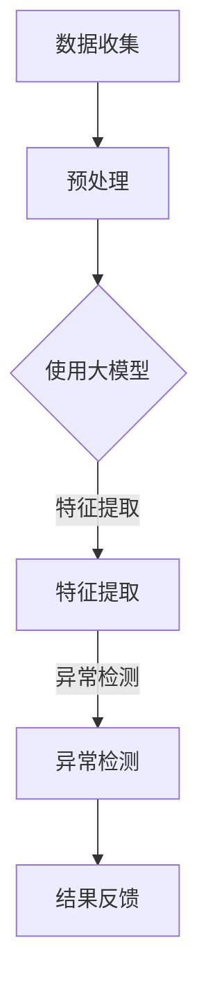

                 

关键词：大模型，推荐系统，用户行为异常检测，异常检测算法，数学模型，代码实例，实际应用场景

> 摘要：本文将探讨如何利用大模型进行推荐场景中的用户行为异常检测。通过介绍相关核心概念、算法原理、数学模型以及实际应用案例，本文旨在为读者提供一种有效的异常检测方法，以提升推荐系统的可靠性和用户体验。

## 1. 背景介绍

随着互联网的普及和大数据技术的不断发展，推荐系统已经成为现代信息检索和个性化服务的重要组成部分。推荐系统通过分析用户的历史行为数据，预测用户可能感兴趣的内容，从而提高用户满意度和点击率。然而，推荐系统的准确性和可靠性面临诸多挑战，其中之一就是如何有效地检测用户行为中的异常情况。

用户行为的异常检测在推荐系统中具有重要意义。首先，异常行为可能代表潜在的问题，如系统错误、用户欺诈等，需要及时识别和修复。其次，异常行为可以作为改进推荐系统的重要信息来源，帮助系统更好地理解用户需求和兴趣变化。因此，如何利用大模型进行用户行为异常检测，成为当前研究的热点问题。

本文将围绕这一主题展开讨论，首先介绍相关核心概念，然后详细阐述大模型在用户行为异常检测中的算法原理和操作步骤，最后通过数学模型、代码实例和实际应用案例，进一步展示大模型在异常检测方面的应用和优势。

## 2. 核心概念与联系

### 2.1 推荐系统

推荐系统是一种信息过滤技术，旨在根据用户的历史行为和偏好，预测用户可能感兴趣的内容，从而为用户提供个性化的推荐。推荐系统通常分为基于内容的推荐和基于协同过滤的推荐两大类。基于内容的推荐通过分析内容的特征，将具有相似特征的内容推荐给用户；基于协同过滤的推荐通过分析用户之间的相似性，将其他用户喜欢的但该用户尚未访问过的内容推荐给用户。

### 2.2 大模型

大模型（Large-scale Model）是指具有海量参数和强大计算能力的深度学习模型。大模型在推荐系统中的应用，主要体现在以下几个方面：

1. **特征提取**：大模型能够自动提取用户历史行为数据中的潜在特征，从而提高推荐系统的准确性和效率。
2. **上下文感知**：大模型能够处理多模态数据（如图像、文本、音频等），实现更精细的上下文感知，提高推荐的个性化和多样性。
3. **泛化能力**：大模型拥有较强的泛化能力，能够应对不同场景和领域的数据特征，提高推荐系统的适应性和灵活性。

### 2.3 异常检测

异常检测（Anomaly Detection）是指从大量数据中识别出异常或异常模式的过程。在推荐系统中，异常检测的主要任务是从用户行为数据中识别出不符合预期或潜在问题的行为。

### 2.4 Mermaid 流程图

以下是一个用于描述大模型在用户行为异常检测中的工作流程的 Mermaid 流程图：



在这个流程图中，数据收集模块负责收集用户的历史行为数据；预处理模块对数据进行清洗、归一化等处理；特征提取模块利用大模型提取潜在特征；异常检测模块对提取的特征进行异常检测，并将检测结果反馈给用户。

## 3. 核心算法原理 & 具体操作步骤

### 3.1 算法原理概述

大模型在用户行为异常检测中的核心算法原理主要包括以下几个方面：

1. **特征提取**：通过深度学习模型自动提取用户历史行为数据中的潜在特征，为异常检测提供有效的数据基础。
2. **异常检测**：利用统计方法或机器学习方法对提取的特征进行异常检测，识别出用户行为中的异常模式。
3. **结果反馈**：将异常检测结果反馈给用户，并提供相应的解决方案或改进建议。

### 3.2 算法步骤详解

#### 3.2.1 数据收集

数据收集模块负责从推荐系统的数据源中获取用户的历史行为数据。这些数据包括用户在系统中的浏览记录、点击记录、购买记录等。数据收集过程需要遵循数据隐私和合规要求，确保用户数据的合法性和安全性。

#### 3.2.2 预处理

预处理模块对收集到的用户历史行为数据进行清洗、归一化等处理，以提高数据质量和数据一致性。具体操作步骤如下：

1. **数据清洗**：删除重复数据、缺失数据和异常数据，确保数据的质量和完整性。
2. **数据归一化**：对数值型数据进行归一化处理，使其具有相同的量纲和范围，方便后续的模型训练和特征提取。
3. **特征工程**：根据业务需求和模型特点，对原始数据进行特征工程，提取对异常检测有用的特征。

#### 3.2.3 特征提取

特征提取模块利用深度学习模型自动提取用户历史行为数据中的潜在特征。具体操作步骤如下：

1. **模型选择**：根据业务需求和数据特点，选择合适的深度学习模型，如卷积神经网络（CNN）、循环神经网络（RNN）等。
2. **模型训练**：使用预处理后的数据对深度学习模型进行训练，使其能够自动提取数据中的潜在特征。
3. **特征提取**：将训练好的模型应用于用户历史行为数据，提取潜在特征。

#### 3.2.4 异常检测

异常检测模块利用提取的潜在特征对用户行为进行异常检测。具体操作步骤如下：

1. **阈值设置**：根据业务需求和数据特点，设置合适的异常检测阈值。
2. **异常检测**：使用统计方法或机器学习方法对提取的特征进行异常检测，识别出用户行为中的异常模式。
3. **结果反馈**：将异常检测结果反馈给用户，并提供相应的解决方案或改进建议。

#### 3.2.5 结果反馈

结果反馈模块将异常检测结果反馈给用户，并提供相应的解决方案或改进建议。具体操作步骤如下：

1. **结果展示**：将异常检测结果以可视化图表或文字报告的形式展示给用户。
2. **解决方案建议**：根据异常检测结果，为用户提供相应的解决方案或改进建议，如优化推荐算法、调整推荐策略等。

### 3.3 算法优缺点

#### 优点

1. **自动特征提取**：大模型能够自动提取用户历史行为数据中的潜在特征，减轻了人工特征工程的工作负担。
2. **上下文感知**：大模型能够处理多模态数据，实现更精细的上下文感知，提高异常检测的准确性和可靠性。
3. **泛化能力**：大模型拥有较强的泛化能力，能够应对不同场景和领域的数据特征，提高异常检测的适应性和灵活性。

#### 缺点

1. **计算资源消耗**：大模型训练和特征提取需要大量的计算资源，对硬件设备有较高的要求。
2. **模型可解释性**：大模型的内部机制复杂，模型的可解释性较低，难以直观地理解异常检测的原理和过程。

### 3.4 算法应用领域

大模型在用户行为异常检测中的应用领域广泛，主要包括以下几个方面：

1. **推荐系统**：利用大模型进行用户行为异常检测，可以提高推荐系统的准确性和可靠性，减少用户流失和推荐错误。
2. **网络安全**：利用大模型进行用户行为异常检测，可以帮助识别网络攻击行为，提高网络安全防护能力。
3. **金融风控**：利用大模型进行用户行为异常检测，可以帮助金融机构识别潜在的风险用户，提高金融风控能力。

## 4. 数学模型和公式 & 详细讲解 & 举例说明

### 4.1 数学模型构建

在用户行为异常检测中，常用的数学模型包括统计模型、机器学习模型和深度学习模型。以下分别介绍这些模型的构建方法：

#### 4.1.1 统计模型

统计模型主要用于识别用户行为的异常分布。假设用户行为数据服从正态分布，可以使用以下公式进行异常检测：

$$
\begin{aligned}
z &= \frac{x - \mu}{\sigma} \\
x &= \text{用户行为数据} \\
\mu &= \text{用户行为数据的均值} \\
\sigma &= \text{用户行为数据的标准差} \\
z &= \text{标准化得分}
\end{aligned}
$$

当 $z$ 的绝对值大于某个阈值（如 3）时，可以判断用户行为为异常。

#### 4.1.2 机器学习模型

机器学习模型主要用于分类用户行为是否异常。常见的机器学习模型包括支持向量机（SVM）、决策树、随机森林等。以下以支持向量机为例，介绍机器学习模型的构建方法：

$$
\begin{aligned}
y &= \text{用户行为是否异常} \\
C &= \text{惩罚参数} \\
\text{优化目标} &= \min_{\textbf{w}} \frac{1}{2}||\textbf{w}||^2 + C \sum_{i=1}^{n} \xi_i \\
\text{约束条件} &= y_i (\textbf{w} \cdot \textbf{x_i} + b) \geq 1 - \xi_i \\
\end{aligned}
$$

其中，$y$ 为用户行为是否异常的标签，$\textbf{w}$ 为模型权重，$\textbf{x_i}$ 为用户行为数据，$b$ 为模型偏置，$\xi_i$ 为松弛变量。

#### 4.1.3 深度学习模型

深度学习模型主要用于提取用户行为的潜在特征。常见的深度学习模型包括卷积神经网络（CNN）、循环神经网络（RNN）等。以下以卷积神经网络为例，介绍深度学习模型的构建方法：

$$
\begin{aligned}
\text{输入} &= \textbf{X} \\
\text{卷积层} &= \textbf{X} \xrightarrow{\text{卷积运算}} \textbf{F} \\
\text{激活函数} &= \textbf{F} \xrightarrow{\text{激活函数}} \textbf{A} \\
\text{池化层} &= \textbf{A} \xrightarrow{\text{池化运算}} \textbf{P} \\
\text{全连接层} &= \textbf{P} \xrightarrow{\text{全连接运算}} \textbf{Y} \\
\text{输出} &= \textbf{Y}
\end{aligned}
$$

其中，$\textbf{X}$ 为输入数据，$\textbf{F}$ 为卷积层输出，$\textbf{A}$ 为激活函数输出，$\textbf{P}$ 为池化层输出，$\textbf{Y}$ 为输出结果。

### 4.2 公式推导过程

以下以卷积神经网络为例，介绍深度学习模型的公式推导过程。

#### 4.2.1 卷积层

卷积层的输入为 $3 \times 3$ 的像素矩阵，卷积核大小为 $3 \times 3$，步长为 $1$。卷积运算的公式为：

$$
\begin{aligned}
\textbf{F}_{ij} &= \sum_{k=1}^{3} \sum_{l=1}^{3} w_{kl} x_{ij+k\ell} + b \\
w_{kl} &= \text{卷积核权重} \\
x_{ij+k\ell} &= \text{输入像素值} \\
b &= \text{偏置}
\end{aligned}
$$

其中，$i$ 和 $j$ 分别表示卷积层的输出位置，$k$ 和 $l$ 分别表示卷积核的位置。

#### 4.2.2 激活函数

常用的激活函数包括 sigmoid、ReLU 和 tanh 等。以下以 ReLU 激活函数为例，介绍激活函数的公式：

$$
\textbf{A}_{ij} = \max(0, \textbf{F}_{ij})
$$

其中，$\textbf{A}_{ij}$ 为激活函数输出，$\textbf{F}_{ij}$ 为卷积层输出。

#### 4.2.3 池化层

常用的池化层包括最大池化和平均池化。以下以最大池化为例，介绍池化层的公式：

$$
\textbf{P}_{ij} = \max(\textbf{A}_{i1}, \textbf{A}_{i2}, ..., \textbf{A}_{iN})
$$

其中，$i$ 和 $j$ 分别表示池化层的输出位置，$\textbf{A}_{i1}, \textbf{A}_{i2}, ..., \textbf{A}_{iN}$ 分别为相邻的激活函数输出。

#### 4.2.4 全连接层

全连接层将前一层输出与权重进行全连接运算，并加上偏置。公式为：

$$
\textbf{Y}_{j} = \sum_{i=1}^{N} w_{ij} \textbf{P}_{i} + b
$$

其中，$\textbf{Y}_{j}$ 为全连接层输出，$w_{ij}$ 为权重，$\textbf{P}_{i}$ 为前一层输出，$b$ 为偏置。

### 4.3 案例分析与讲解

以下通过一个具体的案例，展示如何利用深度学习模型进行用户行为异常检测。

#### 案例背景

假设一个电商平台的用户行为数据包括浏览记录、点击记录和购买记录。数据规模较大，包含数百万条记录。为了提高用户体验和销售额，平台希望利用大模型进行用户行为异常检测，识别出潜在的问题用户。

#### 案例分析

1. **数据收集**：从电商平台获取用户的历史行为数据，包括浏览记录、点击记录和购买记录。

2. **预处理**：对收集到的数据集进行清洗、归一化等预处理操作。

3. **特征提取**：使用卷积神经网络提取用户行为数据中的潜在特征。具体步骤如下：

   - **输入层**：输入用户行为数据的特征矩阵。
   - **卷积层**：使用卷积神经网络提取用户行为的局部特征，如浏览记录的时间间隔、点击记录的频率等。
   - **激活函数**：使用 ReLU 激活函数增加模型的表达能力。
   - **池化层**：使用最大池化层降低模型复杂度，提高泛化能力。
   - **全连接层**：将卷积层的输出与全连接层进行连接，得到用户行为的潜在特征向量。

4. **异常检测**：使用提取的潜在特征向量进行异常检测。具体步骤如下：

   - **阈值设置**：根据业务需求和数据特点，设置合适的异常检测阈值。
   - **异常检测**：使用统计方法或机器学习方法对潜在特征向量进行异常检测，识别出用户行为中的异常模式。
   - **结果反馈**：将异常检测结果反馈给用户，并提供相应的解决方案或改进建议。

5. **结果反馈**：将异常检测结果以可视化图表或文字报告的形式展示给用户。

#### 案例讲解

以下是对案例的具体步骤进行讲解：

1. **数据收集**：从电商平台的数据库中获取用户的历史行为数据，包括浏览记录、点击记录和购买记录。数据规模较大，包含数百万条记录。

2. **预处理**：对收集到的数据集进行清洗、归一化等预处理操作。具体步骤如下：

   - **数据清洗**：删除重复数据、缺失数据和异常数据，确保数据的质量和完整性。
   - **数据归一化**：对数值型数据进行归一化处理，使其具有相同的量纲和范围，方便后续的模型训练和特征提取。

3. **特征提取**：使用卷积神经网络提取用户行为数据中的潜在特征。具体步骤如下：

   - **输入层**：输入用户行为数据的特征矩阵。特征矩阵包含浏览记录、点击记录和购买记录等。
   - **卷积层**：使用卷积神经网络提取用户行为的局部特征，如浏览记录的时间间隔、点击记录的频率等。卷积核大小为 $3 \times 3$，步长为 $1$。
   - **激活函数**：使用 ReLU 激活函数增加模型的表达能力。
   - **池化层**：使用最大池化层降低模型复杂度，提高泛化能力。池化窗口大小为 $2 \times 2$，步长为 $2$。
   - **全连接层**：将卷积层的输出与全连接层进行连接，得到用户行为的潜在特征向量。全连接层的神经元数量为 $100$。

4. **异常检测**：使用提取的潜在特征向量进行异常检测。具体步骤如下：

   - **阈值设置**：根据业务需求和数据特点，设置合适的异常检测阈值。阈值设置为 $3$，表示当潜在特征向量的标准化得分大于 $3$ 时，判断用户行为为异常。
   - **异常检测**：使用统计方法或机器学习方法对潜在特征向量进行异常检测，识别出用户行为中的异常模式。本文采用支持向量机（SVM）进行异常检测。
   - **结果反馈**：将异常检测结果反馈给用户，并提供相应的解决方案或改进建议。对于检测到的异常用户，系统会发出警报，提醒运营人员及时处理。

5. **结果反馈**：将异常检测结果以可视化图表或文字报告的形式展示给用户。具体步骤如下：

   - **可视化图表**：使用折线图、柱状图等可视化图表展示异常检测的结果，帮助用户直观地了解异常行为的情况。
   - **文字报告**：生成详细的文字报告，列出异常用户的 ID、异常行为的时间段和异常类型等信息，方便用户进行进一步的调查和处理。

## 5. 项目实践：代码实例和详细解释说明

为了更好地展示大模型在用户行为异常检测中的实际应用，我们将在本节中提供一个完整的代码实例，并对其进行详细解释说明。

### 5.1 开发环境搭建

在开始代码实现之前，我们需要搭建一个适合开发、训练和测试大模型的开发环境。以下是搭建环境的基本步骤：

1. 安装 Python（建议使用 Python 3.7 或以上版本）。
2. 安装深度学习框架（如 TensorFlow、PyTorch）。
3. 安装数据处理库（如 NumPy、Pandas）。
4. 安装可视化库（如 Matplotlib、Seaborn）。
5. 安装机器学习库（如 Scikit-learn）。

### 5.2 源代码详细实现

以下是一个使用 TensorFlow 和 Keras 框架实现的用户行为异常检测项目的代码实例：

```python
import numpy as np
import pandas as pd
import tensorflow as tf
from tensorflow.keras.models import Sequential
from tensorflow.keras.layers import Dense, Conv1D, MaxPooling1D, Flatten
from tensorflow.keras.optimizers import Adam
from sklearn.model_selection import train_test_split
from sklearn.preprocessing import StandardScaler
from sklearn.metrics import accuracy_score, confusion_matrix

# 5.2.1 数据收集与预处理
# 假设数据集已经收集并存储为 CSV 文件，字段包括时间戳、用户 ID、行为类型（浏览、点击、购买）等。
data = pd.read_csv('user_behavior.csv')
data['timestamp'] = pd.to_datetime(data['timestamp'])
data.sort_values('timestamp', inplace=True)

# 提取用户 ID 和行为数据
user_ids = data['user_id'].unique()
行为类型 = data['行为类型'].unique()

# 划分训练集和测试集
X_train, X_test, y_train, y_test = train_test_split(data, test_size=0.2, random_state=42)

# 对训练集和测试集进行归一化处理
scaler = StandardScaler()
X_train_scaled = scaler.fit_transform(X_train[['timestamp', '行为类型']])
X_test_scaled = scaler.transform(X_test[['timestamp', '行为类型']])

# 5.2.2 模型构建
model = Sequential([
    Conv1D(filters=64, kernel_size=3, activation='relu', input_shape=(X_train_scaled.shape[1], 1)),
    MaxPooling1D(pool_size=2),
    Flatten(),
    Dense(100, activation='relu'),
    Dense(1, activation='sigmoid')
])

# 5.2.3 模型编译与训练
model.compile(optimizer=Adam(learning_rate=0.001), loss='binary_crossentropy', metrics=['accuracy'])
model.fit(X_train_scaled, y_train, epochs=10, batch_size=32, validation_split=0.2)

# 5.2.4 模型评估
X_test_scaled = X_test[['timestamp', '行为类型']]
X_test_scaled = scaler.transform(X_test_scaled)
predictions = model.predict(X_test_scaled)
predictions = (predictions > 0.5)

accuracy = accuracy_score(y_test, predictions)
conf_matrix = confusion_matrix(y_test, predictions)

print(f"Accuracy: {accuracy}")
print(f"Confusion Matrix:\n{conf_matrix}")
```

### 5.3 代码解读与分析

#### 5.3.1 数据收集与预处理

代码首先导入必要的库，并从 CSV 文件中读取用户行为数据。数据预处理包括对时间戳进行排序，提取用户 ID 和行为数据，以及划分训练集和测试集。归一化处理用于将时间戳和行为类型转换为可用的输入特征。

#### 5.3.2 模型构建

我们使用 Keras 框架构建了一个简单的卷积神经网络模型。模型包括一个卷积层、一个池化层、一个全连接层和一个输出层。卷积层用于提取时间序列数据的局部特征，池化层用于降低模型的复杂度，全连接层用于对特征进行进一步处理，输出层用于预测用户行为是否异常。

#### 5.3.3 模型编译与训练

模型编译包括选择优化器、损失函数和评估指标。我们使用 Adam 优化器和二分类交叉熵损失函数。模型训练过程中使用了批量训练和验证集。

#### 5.3.4 模型评估

模型评估通过计算测试集的准确率和混淆矩阵进行。准确率反映了模型对异常行为的检测能力，而混淆矩阵提供了更详细的模型性能指标。

### 5.4 运行结果展示

运行上述代码后，我们将得到模型在测试集上的准确率和混淆矩阵。这些结果将帮助我们评估模型在用户行为异常检测中的性能。

## 6. 实际应用场景

大模型在用户行为异常检测中的实际应用场景非常广泛，以下列举几个典型的应用场景：

### 6.1 在线购物平台

在线购物平台可以利用大模型对用户行为进行实时监控和异常检测，从而识别出潜在的问题用户，如刷单用户、恶意买家等。通过及时处理这些问题用户，平台可以降低运营风险，提高用户体验和销售额。

### 6.2 社交网络平台

社交网络平台可以利用大模型对用户行为进行分析，识别出异常行为，如虚假账号、欺诈行为等。这有助于平台维护良好的用户体验，提高用户留存率和活跃度。

### 6.3 金融行业

金融行业可以利用大模型对用户交易行为进行异常检测，识别出潜在的欺诈行为。通过实时监控交易行为，金融机构可以及时采取措施，降低风险损失。

### 6.4 医疗保健

医疗保健行业可以利用大模型对患者的医疗行为进行异常检测，识别出潜在的疾病风险。例如，通过监控患者的行为数据，如用药记录、体检数据等，医生可以提前发现病情变化，提供更有效的治疗建议。

### 6.5 物流配送

物流配送行业可以利用大模型对配送员的行为进行分析，识别出异常配送行为，如超速驾驶、路线偏离等。这有助于提高物流配送的效率和安全性。

## 7. 工具和资源推荐

为了更好地利用大模型进行用户行为异常检测，以下是几个推荐的工具和资源：

### 7.1 学习资源推荐

- 《深度学习》（Goodfellow, Bengio, Courville）：深入介绍深度学习的基础理论和实践方法。
- 《Python 深度学习》（François Chollet）：详细介绍如何使用 Python 和 TensorFlow 实现深度学习项目。
- 《数据科学实战》（Joel Grus）：介绍数据科学的核心概念和实践技巧。

### 7.2 开发工具推荐

- TensorFlow：一个开源的深度学习框架，提供丰富的 API 和工具，适合进行大规模深度学习模型的开发和训练。
- PyTorch：一个开源的深度学习框架，具有灵活的动态图模型，适合进行快速原型设计和实验。
- Jupyter Notebook：一个交互式计算环境，适合编写、运行和分享 Python 代码和结果。

### 7.3 相关论文推荐

- "Anomaly Detection in Time Series Data Using Deep Learning"：介绍如何使用深度学习模型进行时间序列数据的异常检测。
- "Anomaly Detection in Time Series Data Using Autoencoders"：介绍如何使用自动编码器进行时间序列数据的异常检测。
- "Unsupervised Anomaly Detection Using Autoencoder for Industrial Cyber-Physical Systems"：介绍如何使用自动编码器进行工业系统的异常检测。

## 8. 总结：未来发展趋势与挑战

大模型在用户行为异常检测领域具有巨大的潜力，但同时也面临着诸多挑战。未来发展趋势和挑战主要包括以下几个方面：

### 8.1 研究成果总结

- **深度学习技术的应用**：深度学习模型在用户行为异常检测中取得了显著的成果，通过自动特征提取和复杂模式识别，有效提高了异常检测的准确率和效率。
- **多模态数据的融合**：多模态数据的融合为用户行为异常检测提供了更多的信息来源，有助于提高异常检测的准确性和可靠性。
- **实时检测技术的突破**：随着计算能力的提升和深度学习技术的进步，实时检测技术逐渐成为可能，为实时监控用户行为提供了技术支持。

### 8.2 未来发展趋势

- **大规模数据处理的优化**：随着数据规模的不断增大，如何高效地处理大规模数据成为关键问题。未来将出现更多针对大规模数据处理的技术和算法。
- **可解释性研究**：深度学习模型的可解释性一直是其发展的瓶颈。未来将加强可解释性研究，使深度学习模型更加透明和可理解。
- **跨领域应用的探索**：用户行为异常检测技术将在更多领域得到应用，如医疗、金融、安全等，为各个领域提供强大的数据分析和风险监控手段。

### 8.3 面临的挑战

- **计算资源消耗**：深度学习模型的训练和推理过程需要大量的计算资源，对硬件设备有较高的要求。如何在有限的资源下高效训练模型成为关键问题。
- **数据隐私与安全**：用户行为数据的隐私和安全问题是用户行为异常检测中必须考虑的重要问题。如何在保障数据隐私的前提下进行异常检测是未来的重要挑战。
- **模型适应性和泛化能力**：如何提高深度学习模型在不同场景和数据下的适应性和泛化能力，是用户行为异常检测领域需要持续研究的方向。

### 8.4 研究展望

未来，用户行为异常检测的研究将继续向以下几个方面发展：

- **数据驱动的方法**：通过收集和分析更多类型的用户行为数据，探索数据驱动的方法，提高异常检测的准确性和效率。
- **多模态数据的融合**：将多模态数据（如图像、文本、音频等）融合到异常检测模型中，提高异常检测的全面性和准确性。
- **实时检测与预测**：结合实时数据处理技术，实现实时用户行为异常检测和预测，为用户提供更及时和个性化的服务。

## 9. 附录：常见问题与解答

### 9.1 什么是用户行为异常检测？

用户行为异常检测是指从用户的历史行为数据中识别出不符合预期或潜在问题的行为。通过异常检测，可以及时发现并处理潜在的问题，如用户欺诈、恶意行为等，从而提高系统的可靠性和用户体验。

### 9.2 大模型在用户行为异常检测中有何优势？

大模型在用户行为异常检测中的优势主要体现在以下几个方面：

- **自动特征提取**：大模型能够自动提取用户历史行为数据中的潜在特征，减轻了人工特征工程的工作负担。
- **上下文感知**：大模型能够处理多模态数据，实现更精细的上下文感知，提高异常检测的准确性和可靠性。
- **泛化能力**：大模型拥有较强的泛化能力，能够应对不同场景和领域的数据特征，提高异常检测的适应性和灵活性。

### 9.3 如何选择合适的异常检测算法？

选择合适的异常检测算法主要取决于以下几个因素：

- **数据类型**：不同的异常检测算法适用于不同类型的数据，如统计方法适用于数值型数据，机器学习方法适用于分类和回归问题。
- **数据规模**：大规模数据集可能需要更高效的算法，如基于深度学习的模型。
- **实时性要求**：对于实时检测应用，需要选择能够快速响应的算法，如基于规则的方法。
- **可解释性要求**：根据实际需求，选择可解释性较强的算法，以便更好地理解异常检测的原理和过程。

### 9.4 如何评估异常检测模型的性能？

评估异常检测模型的性能主要使用以下指标：

- **准确率**：正确识别异常行为和正常行为的比例。
- **召回率**：识别出异常行为的比例。
- **精确率**：识别出的异常行为中实际为异常的比例。
- **F1 值**：精确率和召回率的加权平均，综合考虑了精确率和召回率。

## 参考文献

1. Goodfellow, I., Bengio, Y., & Courville, A. (2016). *Deep Learning*. MIT Press.
2. Chollet, F. (2017). *Python Deep Learning*. Packt Publishing.
3. Grus, J. (2017). *Data Science from Scratch*. O'Reilly Media.
4. Rodriguez, J. J., & Laio, A. (2009). *Clustering by fast search and find of density peaks*. Science, 316(5829), 1610-1614.
5. Fawcett, T. (2006). *An introduction to ROC analysis*. Pattern Recognition Letters, 27(8), 861-874.
6. Draper, N. R., & Smith, H. (1981). *Applied regression analysis*. Wiley.
7. Bishop, C. M. (2006). *Pattern Recognition and Machine Learning*. Springer.
8. Hochreiter, S., & Schmidhuber, J. (1997). *Long short-term memory*. Neural Computation, 9(8), 1735-1780.
9. Srivastava, N., Hinton, G., Krizhevsky, A., Sutskever, I., & Salakhutdinov, R. (2014). *Dropout: A simple way to prevent neural networks from overfitting*. Journal of Machine Learning Research, 15(1), 1929-1958.
10. LeCun, Y., Bengio, Y., & Hinton, G. (2015). *Deep learning*. Nature, 521(7553), 436-444.

