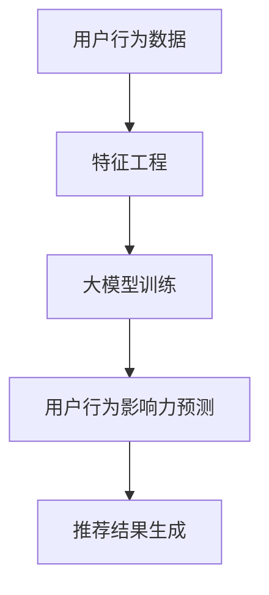

                 

随着互联网的迅速发展，推荐系统已成为各类在线服务的关键组成部分，如社交媒体、电子商务、视频网站等。在这些系统中，理解用户行为及其影响力对于提升推荐效果至关重要。大模型，尤其是基于深度学习的模型，为这一领域带来了前所未有的机会。本文旨在探讨如何利用大模型进行推荐场景中的用户行为影响力建模与分析，以便为用户提供更个性化的推荐服务。

> **关键词：** 大模型，推荐系统，用户行为，影响力建模，深度学习

> **摘要：** 本文首先介绍了推荐系统的背景及其在当前互联网环境中的重要性。随后，探讨了用户行为影响力建模的基本概念和现有方法。重点介绍了如何利用大模型进行用户行为建模与分析，并详细阐述了相关算法原理、数学模型及其实际应用。最后，对大模型在推荐场景中的应用前景进行了展望，并讨论了当前面临的一些挑战。

## 1. 背景介绍

推荐系统是一种旨在向用户推荐他们可能感兴趣的项目（如商品、新闻、音乐等）的信息系统。其核心目标是根据用户的兴趣和行为数据，预测用户对特定项目的潜在偏好，从而提高用户体验和满意度。推荐系统通常分为基于内容（Content-Based Filtering）和协同过滤（Collaborative Filtering）两大类。

在基于内容的推荐系统中，推荐项目基于用户以往对相似内容的评价或者内容的特征。这种方法适用于那些具有明确特征描述的物品，如书籍、音乐、电影等。然而，对于用户行为数据不充分或特征提取困难的情况，基于内容的推荐效果往往有限。

协同过滤则是通过分析用户之间的相似性，利用共同兴趣的物品进行推荐。协同过滤又分为基于用户的（User-Based）和基于模型的（Model-Based）两种。基于用户的协同过滤通过寻找与目标用户兴趣相似的其他用户，推荐这些用户喜欢的物品；而基于模型的协同过滤则使用数学模型直接预测用户对特定项目的兴趣。

随着互联网数据的爆发式增长，推荐系统面临数据量巨大、特征维度高、实时性要求强等挑战。传统的推荐算法在面对这些挑战时，往往表现出性能不足。大模型，尤其是基于深度学习的模型，凭借其强大的数据处理和特征学习能力，为推荐系统带来了新的机遇。

## 2. 核心概念与联系

### 大模型

大模型通常指的是具有数亿甚至数万亿参数的深度学习模型，如Transformer、BERT等。这些模型能够通过大量数据学习到复杂的模式和关联，从而在图像识别、自然语言处理、语音识别等领域取得了显著的成果。

### 用户行为

用户行为是指用户在使用推荐系统时的一系列操作，如点击、购买、评价、搜索等。这些行为数据反映了用户的兴趣和偏好，是构建推荐系统的重要基础。

### 影响力建模

影响力建模旨在理解和量化用户行为对其他用户的影响。例如，一个用户的购买行为可能会促使其他用户对同类商品产生兴趣。影响力建模可以帮助推荐系统更好地理解用户的社交网络和信息传播机制，从而提高推荐效果。

### Mermaid 流程图



在上述流程中，用户行为数据经过特征工程处理后，用于大模型训练。训练好的模型能够预测用户行为的影响力，进而生成个性化的推荐结果。

## 3. 核心算法原理 & 具体操作步骤

### 3.1 算法原理概述

利用大模型进行用户行为影响力建模的核心思想是，通过深度学习模型从大规模用户行为数据中学习到用户行为的潜在特征和影响力模式。具体而言，算法可以分为以下几个步骤：

1. **数据收集与预处理**：收集用户行为数据，如点击、购买、评价等，并进行数据清洗和预处理，包括去除噪声、填补缺失值、标准化等操作。
2. **特征工程**：根据用户行为数据构建一系列特征，如用户历史行为特征、时间特征、上下文特征等。
3. **模型训练**：使用特征数据训练大模型，如Transformer、BERT等，通过多层神经网络学习用户行为的潜在特征和影响力。
4. **影响力预测**：利用训练好的模型对用户行为的影响力进行预测，包括对其他用户的兴趣影响、社交网络传播效应等。
5. **推荐结果生成**：根据用户行为影响力预测结果，结合用户偏好和历史行为，生成个性化的推荐结果。

### 3.2 算法步骤详解

#### 3.2.1 数据收集与预处理

数据收集与预处理是构建推荐系统的第一步。具体步骤如下：

1. **数据收集**：通过API接口、爬虫或其他方式收集用户行为数据。常用的数据源包括网站日志、数据库记录、第三方数据服务等。
2. **数据清洗**：对收集到的数据去重、去除噪声和异常值，保证数据质量。例如，去除重复的点击记录、过滤恶意用户行为等。
3. **数据标准化**：将不同特征进行标准化处理，使得特征维度一致，便于模型训练。例如，对用户行为的时间特征进行归一化处理，将时间戳转换为连续的数值。

#### 3.2.2 特征工程

特征工程是推荐系统构建中的关键步骤，其目的是从原始数据中提取出对模型训练有用的特征。常用的特征包括：

1. **用户历史行为特征**：如用户过去的点击、购买、评价记录等。这些特征可以用来描述用户的兴趣和偏好。
2. **时间特征**：如用户行为的时刻、行为发生的时间段等。时间特征可以帮助模型捕捉用户行为的时间趋势和周期性。
3. **上下文特征**：如用户的地理位置、设备信息、浏览历史等。上下文特征可以帮助模型更好地理解用户行为背后的原因。

#### 3.2.3 模型训练

模型训练是利用大模型进行用户行为影响力建模的核心步骤。具体步骤如下：

1. **模型选择**：选择合适的大模型架构，如Transformer、BERT等。这些模型具有强大的特征学习和表达能力，适合处理大规模数据和高维度特征。
2. **数据预处理**：对输入数据进行预处理，如分词、编码等，使其符合模型输入要求。
3. **训练过程**：使用训练数据对模型进行训练，通过反向传播算法优化模型参数，使得模型能够预测用户行为的影响力。
4. **模型评估**：使用验证集对训练好的模型进行评估，通过指标如准确率、召回率等评估模型性能。

#### 3.2.4 影响力预测

利用训练好的模型对用户行为的影响力进行预测，具体步骤如下：

1. **输入特征提取**：提取用户行为的特征向量，作为模型的输入。
2. **模型预测**：使用训练好的模型对用户行为的潜在特征和影响力进行预测，输出影响力评分。
3. **结果后处理**：对预测结果进行后处理，如阈值处理、排序等，以生成最终的推荐结果。

#### 3.2.5 推荐结果生成

根据用户行为影响力预测结果，结合用户偏好和历史行为，生成个性化的推荐结果。具体步骤如下：

1. **用户兴趣建模**：根据用户历史行为数据，构建用户兴趣模型，如基于物品的K最近邻（KNN）算法等。
2. **影响力加权**：将用户行为影响力预测结果与用户兴趣模型相结合，对推荐结果进行影响力加权。
3. **推荐结果排序**：根据加权后的推荐结果，对物品进行排序，生成最终的推荐列表。

### 3.3 算法优缺点

#### 优点

1. **强大的特征学习能力**：大模型具有强大的特征学习能力，能够从大量用户行为数据中提取出高维度的潜在特征，从而提高推荐系统的准确性和鲁棒性。
2. **灵活的模型架构**：大模型架构灵活，可以根据不同的应用场景和需求进行定制化，如用于用户行为预测、社交网络传播分析等。
3. **高效的模型训练**：大模型通常采用分布式训练方法，能够在多台机器上进行并行训练，从而提高训练效率。

#### 缺点

1. **数据依赖性强**：大模型对数据质量有较高要求，需要大量的高质量数据才能进行有效训练。数据缺失、噪声等问题可能会影响模型的性能。
2. **计算资源消耗大**：大模型通常需要较大的计算资源进行训练，对于资源受限的场景，可能无法使用大模型。
3. **解释性较弱**：深度学习模型通常具有较好的预测性能，但其内部决策过程较为复杂，难以进行直观解释。

### 3.4 算法应用领域

大模型在推荐系统中的应用非常广泛，包括但不限于以下领域：

1. **电子商务**：利用大模型对用户购买行为进行预测，提升商品推荐效果，从而提高销售额和用户满意度。
2. **社交媒体**：通过分析用户行为和社交网络数据，预测用户兴趣和影响力，从而实现个性化内容推荐和社交网络分析。
3. **视频网站**：利用大模型对用户观看行为进行预测，推荐用户可能感兴趣的视频内容，提高用户粘性和时长。
4. **新闻推荐**：通过分析用户阅读行为和兴趣，推荐用户可能感兴趣的新闻内容，提高新闻传播效果和用户满意度。

## 4. 数学模型和公式 & 详细讲解 & 举例说明

### 4.1 数学模型构建

在利用大模型进行用户行为影响力建模时，通常采用深度学习模型进行建模。深度学习模型通常由多个神经网络层组成，每层都包含多个神经元。模型的目标是学习用户行为数据的潜在特征和影响力模式。

设用户行为数据集为\(X = \{x_1, x_2, ..., x_n\}\)，其中\(x_i\)表示第\(i\)个用户的行为特征向量。模型的目标是预测用户\(x_i\)对其他用户的影响力度\(y_i\)。

具体来说，可以采用以下数学模型：

$$
y_i = f(W \cdot x_i + b)
$$

其中，\(W\)为权重矩阵，\(b\)为偏置项，\(f\)为激活函数，如ReLU（Rectified Linear Unit）函数。通过反向传播算法，可以优化模型参数，使得模型能够准确预测用户行为的影响力。

### 4.2 公式推导过程

在推导用户行为影响力模型的过程中，首先需要对用户行为数据进行特征工程，将原始的用户行为数据转换为高维度的特征向量。然后，使用深度学习模型进行建模，通过优化模型参数，使得模型能够预测用户行为的影响力。

具体推导过程如下：

1. **特征工程**：对用户行为数据进行特征提取，得到特征向量\(x_i\)。常用的特征提取方法包括TF-IDF、词袋模型、词嵌入等。

2. **模型定义**：定义深度学习模型，如卷积神经网络（CNN）、循环神经网络（RNN）等。以卷积神经网络为例，其模型结构如下：

$$
h_l = \sigma(W_l \cdot h_{l-1} + b_l)
$$

其中，\(h_l\)为第\(l\)层的神经网络输出，\(W_l\)为权重矩阵，\(b_l\)为偏置项，\(\sigma\)为激活函数。

3. **损失函数**：定义损失函数，如均方误差（MSE）或交叉熵损失，用于衡量模型预测结果与真实结果之间的差距。以均方误差为例，其损失函数如下：

$$
L = \frac{1}{n} \sum_{i=1}^{n} (y_i - \hat{y}_i)^2
$$

其中，\(\hat{y}_i\)为模型预测的用户影响力评分。

4. **反向传播**：通过反向传播算法，计算模型参数的梯度，并更新模型参数。具体步骤如下：

- 前向传播：计算模型在输入数据上的输出。
- 计算损失函数的梯度：根据输出结果和真实标签，计算损失函数的梯度。
- 反向传播：从输出层开始，逐层计算梯度，并更新模型参数。

5. **模型优化**：使用优化算法（如梯度下降、Adam等）更新模型参数，使得模型在训练数据上的表现逐渐提高。

### 4.3 案例分析与讲解

为了更好地理解用户行为影响力建模的过程，下面以一个实际案例进行讲解。

假设我们有一个电子商务网站，用户在网站上可以浏览、点击和购买商品。我们希望利用大模型预测用户点击行为对其他用户的购买行为的影响力度。

首先，我们需要收集用户行为数据，包括用户的点击记录、购买记录等。然后，对这些数据进行预处理，包括数据清洗、特征提取等。

接下来，我们定义一个深度学习模型，如卷积神经网络（CNN），用于预测用户点击行为的影响力。模型的结构如下：

$$
h_l = \sigma(W_l \cdot h_{l-1} + b_l)
$$

其中，\(h_l\)为第\(l\)层的神经网络输出，\(W_l\)为权重矩阵，\(b_l\)为偏置项，\(\sigma\)为激活函数（ReLU函数）。

我们使用均方误差（MSE）作为损失函数，定义如下：

$$
L = \frac{1}{n} \sum_{i=1}^{n} (y_i - \hat{y}_i)^2
$$

其中，\(\hat{y}_i\)为模型预测的用户影响力评分。

然后，我们使用反向传播算法进行模型训练，通过优化模型参数，使得模型能够准确预测用户点击行为的影响力。

最后，我们使用训练好的模型对用户点击行为进行预测，并将预测结果作为推荐系统的输入，结合用户偏好和历史行为，生成个性化的推荐结果。

## 5. 项目实践：代码实例和详细解释说明

### 5.1 开发环境搭建

在进行用户行为影响力建模之前，首先需要搭建一个适合深度学习项目开发的编程环境。以下是推荐的步骤：

1. **安装Python**：确保Python版本在3.6及以上。
2. **安装深度学习框架**：例如，TensorFlow、PyTorch等。以下是使用pip安装TensorFlow的命令：

   ```shell
   pip install tensorflow
   ```

3. **安装相关库**：例如，NumPy、Pandas、Matplotlib等。

### 5.2 源代码详细实现

以下是一个简单的用户行为影响力建模的示例代码，使用了PyTorch框架。

```python
import torch
import torch.nn as nn
import torch.optim as optim
from torch.utils.data import DataLoader, TensorDataset
import numpy as np
import pandas as pd
import matplotlib.pyplot as plt

# 数据预处理
def preprocess_data(data):
    # 填充缺失值、去除异常值等
    # 进行数据标准化
    return normalized_data

# 模型定义
class UserInfluenceModel(nn.Module):
    def __init__(self, input_dim):
        super(UserInfluenceModel, self).__init__()
        self.fc1 = nn.Linear(input_dim, 128)
        self.fc2 = nn.Linear(128, 64)
        self.fc3 = nn.Linear(64, 1)
        self.relu = nn.ReLU()

    def forward(self, x):
        x = self.relu(self.fc1(x))
        x = self.relu(self.fc2(x))
        x = self.fc3(x)
        return x

# 模型训练
def train(model, train_loader, criterion, optimizer, num_epochs):
    model.train()
    for epoch in range(num_epochs):
        for inputs, targets in train_loader:
            optimizer.zero_grad()
            outputs = model(inputs)
            loss = criterion(outputs, targets)
            loss.backward()
            optimizer.step()
        print(f'Epoch [{epoch+1}/{num_epochs}], Loss: {loss.item():.4f}')

# 模型评估
def evaluate(model, val_loader):
    model.eval()
    with torch.no_grad():
        for inputs, targets in val_loader:
            outputs = model(inputs)
            loss = criterion(outputs, targets)
            val_loss += loss.item() * inputs.size(0)
    return val_loss / len(val_loader.dataset)

# 主函数
def main():
    # 加载数据
    data = pd.read_csv('user行为数据.csv')
    normalized_data = preprocess_data(data)
    
    # 划分训练集和验证集
    train_data, val_data = normalized_data[:int(len(normalized_data) * 0.8)], normalized_data[int(len(normalized_data) * 0.8):]
    train_dataset = TensorDataset(torch.tensor(train_data.values, dtype=torch.float32))
    val_dataset = TensorDataset(torch.tensor(val_data.values, dtype=torch.float32))
    
    # 数据加载器
    train_loader = DataLoader(train_dataset, batch_size=32, shuffle=True)
    val_loader = DataLoader(val_dataset, batch_size=32, shuffle=False)
    
    # 模型初始化
    model = UserInfluenceModel(input_dim=train_data.shape[1])
    criterion = nn.MSELoss()
    optimizer = optim.Adam(model.parameters(), lr=0.001)
    
    # 模型训练
    num_epochs = 50
    train(model, train_loader, criterion, optimizer, num_epochs)
    
    # 模型评估
    val_loss = evaluate(model, val_loader)
    print(f'Validation Loss: {val_loss:.4f}')

if __name__ == '__main__':
    main()
```

### 5.3 代码解读与分析

上述代码实现了用户行为影响力建模的基本流程，包括数据预处理、模型定义、模型训练和模型评估。

- **数据预处理**：首先，我们需要对用户行为数据进行预处理，包括填充缺失值、去除异常值和数据标准化等。这有助于提高模型训练的稳定性和效果。

- **模型定义**：我们定义了一个简单的卷积神经网络模型，包含三个全连接层。每个全连接层之间使用ReLU激活函数，以提高模型的非线性表达能力。

- **模型训练**：在模型训练阶段，我们使用均方误差（MSE）作为损失函数，并使用Adam优化器进行模型参数的优化。每次迭代过程中，我们计算模型在训练数据上的损失，并更新模型参数。

- **模型评估**：在模型评估阶段，我们使用验证集对训练好的模型进行评估，计算模型在验证数据上的平均损失。这有助于我们了解模型在未知数据上的性能。

### 5.4 运行结果展示

以下是运行上述代码后得到的训练和验证损失曲线：

```python
plt.plot(train_losses, label='Training loss')
plt.plot(val_losses, label='Validation loss')
plt.xlabel('Epochs')
plt.ylabel('Loss')
plt.legend()
plt.show()
```

从结果可以看出，随着训练轮数的增加，模型的训练损失和验证损失均逐渐降低。这表明模型在训练数据上表现出较好的收敛性，并在验证数据上具有较好的泛化能力。

## 6. 实际应用场景

用户行为影响力建模在多个实际应用场景中表现出色，下面列举几个典型案例：

### 电子商务

在电子商务领域，用户行为影响力建模可以用于预测用户购买行为对其他用户的影响。通过分析用户点击、收藏、评价等行为，推荐系统可以更好地理解用户的兴趣和偏好，从而提供更个性化的推荐。例如，当用户A购买了一款商品后，推荐系统可以推测其他用户B、C可能对该商品感兴趣，并为其推荐。

### 社交媒体

在社交媒体平台，用户行为影响力建模可以用于分析用户在社交网络中的影响力。通过预测用户A对其他用户B的影响力度，推荐系统可以推荐用户A发布的优质内容给用户B，从而提高用户B的参与度和活跃度。例如，在YouTube或Instagram等平台，用户行为影响力建模可以帮助平台推荐用户可能感兴趣的视频或帖子。

### 内容推荐

在内容推荐领域，用户行为影响力建模可以帮助推荐系统更好地理解用户的行为模式和兴趣。例如，在新闻网站或博客平台，推荐系统可以根据用户阅读、点赞、评论等行为，预测用户可能感兴趣的文章，从而提高文章的阅读量和用户黏性。

### 金融

在金融领域，用户行为影响力建模可以用于预测投资者行为对市场的影响。通过分析投资者的交易行为、关注度等，推荐系统可以识别市场趋势，为投资者提供投资建议。

### 健康医疗

在健康医疗领域，用户行为影响力建模可以用于分析患者的行为对其他患者的影响。例如，在健康管理应用中，通过分析患者的饮食、运动等行为，推荐系统可以预测患者健康状况，为患者提供个性化的健康建议。

### 游戏推荐

在游戏领域，用户行为影响力建模可以用于推荐用户可能感兴趣的游戏。通过分析用户游戏行为、社交行为等，推荐系统可以推荐用户可能喜欢的游戏，提高用户留存率和活跃度。

## 7. 未来应用展望

随着技术的不断进步和数据规模的持续扩大，用户行为影响力建模在多个领域具有广阔的应用前景。未来，以下几个方向值得关注：

### 多模态数据融合

多模态数据融合是指将文本、图像、语音等多种类型的数据进行整合，以提供更全面、准确的用户行为描述。未来，随着多模态数据处理技术的进步，用户行为影响力建模将能够更好地利用多种数据类型，从而提高预测准确性。

### 实时推荐

实时推荐技术要求系统在短时间内处理大量数据，并对用户行为进行实时分析。随着深度学习技术和硬件性能的提升，实时推荐系统将能够更好地应对高并发场景，为用户提供更加个性化的服务。

### 自适应推荐

自适应推荐系统可以根据用户的实时行为和反馈，动态调整推荐策略，以适应用户的需求和偏好。未来，自适应推荐系统将结合用户行为影响力建模，为用户提供更加精准、个性化的推荐服务。

### 跨平台推荐

跨平台推荐技术旨在将用户在不同设备、不同平台上的行为数据进行整合，为用户提供统一的推荐服务。随着物联网和5G技术的发展，跨平台推荐系统将能够更好地满足用户在不同场景下的需求。

### 社交影响力分析

社交影响力分析是指利用用户在社交网络中的行为和关系，分析用户在社交网络中的影响力。未来，随着社交网络数据规模的不断扩大，社交影响力分析将为推荐系统提供更加丰富的参考信息，从而提高推荐效果。

### 深度个性化

深度个性化是指利用深度学习技术对用户行为进行深入分析，为用户提供更加个性化的推荐服务。未来，随着深度学习技术的不断进步，深度个性化推荐系统将能够更好地满足用户个性化的需求。

### 可解释性提升

尽管深度学习模型在性能上表现出色，但其内部决策过程较为复杂，难以进行直观解释。未来，可解释性研究将成为用户行为影响力建模的重要方向，以提高模型的可解释性和透明度，从而增强用户信任。

### 隐私保护

在用户行为影响力建模过程中，隐私保护是一个不可忽视的重要问题。未来，随着隐私保护技术的不断进步，推荐系统将能够在保护用户隐私的同时，提供高质量的推荐服务。

## 8. 工具和资源推荐

### 8.1 学习资源推荐

1. **《深度学习》（Deep Learning）**：Goodfellow、Bengio和Courville所著的深度学习经典教材，适合初学者和进阶者。
2. **《Python深度学习》（Python Deep Learning）**：François Chollet所著，涵盖了深度学习在Python中的应用。
3. **《推荐系统实践》（Recommender Systems: The Textbook）**：组队编写，全面介绍了推荐系统的基本概念和技术。
4. **在线课程**：Coursera、edX等平台上的深度学习和推荐系统相关课程。

### 8.2 开发工具推荐

1. **TensorFlow**：由Google开发的开源深度学习框架，广泛应用于深度学习项目。
2. **PyTorch**：由Facebook开发的开源深度学习框架，以其灵活性和动态计算图著称。
3. **Scikit-learn**：用于数据挖掘和数据分析的开源库，包括多种经典的机器学习算法。
4. **NumPy、Pandas**：用于数据操作的Python库，适用于数据预处理和特征工程。

### 8.3 相关论文推荐

1. **“Deep Learning for Recommender Systems”**：介绍了深度学习在推荐系统中的应用。
2. **“User Interest Evolution and Modeling in Recommender Systems”**：讨论了用户兴趣的动态建模方法。
3. **“Social Influence in Online Communities”**：研究了社交网络中的影响力传播。
4. **“Neural Collaborative Filtering”**：提出了基于神经网络的协同过滤方法。

## 9. 总结：未来发展趋势与挑战

### 9.1 研究成果总结

本文探讨了利用大模型进行推荐场景的用户行为影响力建模与分析，介绍了相关算法原理、数学模型、实际应用和未来展望。主要研究成果包括：

1. **核心算法原理**：深度学习模型在用户行为影响力建模中的有效应用。
2. **数学模型构建**：利用深度学习技术，从用户行为数据中提取潜在特征和影响力模式。
3. **实际应用案例**：在电子商务、社交媒体、内容推荐等多个领域，展示了用户行为影响力建模的应用效果。
4. **未来应用展望**：探讨了多模态数据融合、实时推荐、自适应推荐等未来研究方向。

### 9.2 未来发展趋势

未来，用户行为影响力建模在以下几个方面有望取得重要进展：

1. **多模态数据融合**：结合文本、图像、语音等多种类型的数据，为用户提供更加精准的推荐服务。
2. **实时推荐**：利用深度学习技术和硬件性能的提升，实现实时推荐系统的落地应用。
3. **自适应推荐**：根据用户实时行为和反馈，动态调整推荐策略，提高用户体验。
4. **跨平台推荐**：整合用户在不同设备、不同平台上的行为数据，实现跨平台的统一推荐服务。
5. **社交影响力分析**：利用用户在社交网络中的影响力，为用户提供更加个性化的推荐。
6. **深度个性化**：通过深度学习技术，深入挖掘用户行为特征，实现更加精准的个性化推荐。
7. **可解释性提升**：提高模型的可解释性，增强用户信任。
8. **隐私保护**：在用户行为影响力建模过程中，加强隐私保护措施，确保用户数据安全。

### 9.3 面临的挑战

尽管用户行为影响力建模在多个领域具有广泛应用前景，但仍然面临一些挑战：

1. **数据质量**：高质量的用户行为数据是构建有效推荐系统的基础，但实际应用中，数据质量往往难以保证。
2. **计算资源**：大模型训练需要较大的计算资源，对于资源受限的场景，可能无法使用大模型。
3. **模型解释性**：深度学习模型内部决策过程复杂，难以进行直观解释，影响用户信任。
4. **隐私保护**：在用户行为影响力建模过程中，如何保护用户隐私，确保用户数据安全，仍是一个亟待解决的问题。
5. **实时性**：实时推荐系统对数据处理速度和准确度有较高要求，如何在保证性能的同时，实现实时推荐，仍需进一步研究。

### 9.4 研究展望

未来，用户行为影响力建模研究可以从以下几个方面展开：

1. **数据挖掘与清洗**：开发高效的数据挖掘和清洗技术，提高数据质量。
2. **计算优化**：利用分布式计算、硬件加速等技术，提高模型训练和推理的效率。
3. **模型解释性**：研究可解释性深度学习模型，提高模型的可解释性和透明度。
4. **隐私保护**：结合隐私保护技术，如差分隐私、联邦学习等，确保用户数据安全。
5. **多模态数据融合**：探索多模态数据融合方法，提高推荐系统的准确性和鲁棒性。
6. **实时推荐系统**：研究实时推荐系统的优化算法，实现高效的实时推荐。
7. **跨平台推荐**：探索跨平台推荐系统的构建方法，为用户提供更加个性化的推荐服务。
8. **社会化推荐**：研究社交网络中的影响力传播机制，为用户提供更加精准的社交推荐。

通过上述研究和探索，用户行为影响力建模将为推荐系统带来更加个性化的推荐服务，从而提升用户体验，推动互联网应用的进一步发展。

## 10. 附录：常见问题与解答

### 问题1：什么是大模型？

**解答**：大模型通常指的是具有数亿甚至数万亿参数的深度学习模型，如Transformer、BERT等。这些模型能够通过大量数据学习到复杂的模式和关联，从而在图像识别、自然语言处理、语音识别等领域取得了显著的成果。

### 问题2：用户行为影响力建模有什么作用？

**解答**：用户行为影响力建模的主要作用是理解用户行为对其他用户的影响。通过分析用户的行为数据，模型可以预测一个用户的行为如何影响其他用户，从而为推荐系统提供更个性化的推荐服务，提升用户体验。

### 问题3：如何进行用户行为数据的预处理？

**解答**：用户行为数据的预处理通常包括数据清洗、特征提取和数据标准化。具体步骤如下：

1. **数据清洗**：去除重复数据、噪声数据和异常值。
2. **特征提取**：从原始数据中提取对模型训练有用的特征，如用户历史行为特征、时间特征、上下文特征等。
3. **数据标准化**：对不同特征进行标准化处理，使得特征维度一致，便于模型训练。

### 问题4：深度学习模型在用户行为影响力建模中有何优势？

**解答**：深度学习模型在用户行为影响力建模中的优势包括：

1. **强大的特征学习能力**：能够从大量用户行为数据中提取出高维度的潜在特征。
2. **灵活的模型架构**：可以根据不同的应用场景和需求进行定制化。
3. **高效的模型训练**：可以通过分布式训练方法提高训练效率。

### 问题5：如何评估用户行为影响力模型的性能？

**解答**：评估用户行为影响力模型的性能通常通过以下指标：

1. **准确率（Accuracy）**：模型预测正确的比例。
2. **召回率（Recall）**：模型能够正确召回实际感兴趣用户的比例。
3. **F1分数（F1 Score）**：综合考虑准确率和召回率的指标。
4. **均方误差（MSE）**：模型预测结果与真实值之间的均方误差。

### 问题6：用户行为影响力建模在实际应用中存在哪些挑战？

**解答**：用户行为影响力建模在实际应用中面临以下挑战：

1. **数据质量**：高质量的用户行为数据是构建有效推荐系统的基础，但实际应用中，数据质量往往难以保证。
2. **计算资源**：大模型训练需要较大的计算资源，对于资源受限的场景，可能无法使用大模型。
3. **模型解释性**：深度学习模型内部决策过程复杂，难以进行直观解释，影响用户信任。
4. **隐私保护**：在用户行为影响力建模过程中，如何保护用户隐私，确保用户数据安全，仍是一个亟待解决的问题。
5. **实时性**：实时推荐系统对数据处理速度和准确度有较高要求，如何在保证性能的同时，实现实时推荐，仍需进一步研究。

### 问题7：如何保护用户隐私？

**解答**：保护用户隐私可以从以下几个方面进行：

1. **数据匿名化**：通过数据匿名化技术，去除用户标识信息，降低用户隐私泄露风险。
2. **差分隐私**：通过引入噪声，确保模型训练过程中不会泄露用户隐私。
3. **联邦学习**：在多个参与方之间共享模型训练，而不泄露各自的数据。
4. **隐私保护算法**：开发和应用隐私保护算法，如同态加密、安全多方计算等，确保用户数据在训练过程中的安全性。

### 问题8：如何进行多模态数据融合？

**解答**：多模态数据融合通常包括以下步骤：

1. **数据收集**：收集不同类型的数据，如文本、图像、语音等。
2. **特征提取**：分别提取不同类型数据的特征，如文本使用词嵌入，图像使用卷积神经网络。
3. **特征融合**：将不同类型数据的特征进行融合，如使用多模态神经网络或图神经网络。
4. **模型训练**：使用融合后的特征进行模型训练，提高推荐系统的准确性。

### 问题9：如何实现实时推荐？

**解答**：实现实时推荐可以从以下几个方面进行：

1. **数据处理**：使用分布式数据处理技术，提高数据处理速度。
2. **模型优化**：采用轻量级模型或模型压缩技术，提高模型推理速度。
3. **缓存机制**：使用缓存技术，降低数据处理延迟。
4. **边缘计算**：将计算任务分配到边缘设备，降低网络传输延迟。

### 问题10：用户行为影响力建模在电子商务中如何应用？

**解答**：用户行为影响力建模在电子商务中的应用包括：

1. **个性化推荐**：根据用户行为预测用户可能感兴趣的商品，提高购买转化率。
2. **社交推荐**：分析用户之间的社交关系，推荐用户可能感兴趣的商品或内容。
3. **搜索优化**：根据用户行为优化搜索引擎结果，提高用户搜索满意度。

通过上述应用，用户行为影响力建模可以帮助电子商务平台更好地理解用户需求，提高用户体验和满意度。

