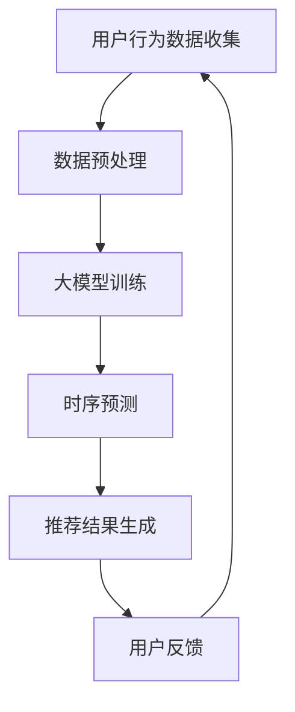

                 

关键词：大模型、时序预测、推荐系统、用户行为分析、人工智能

摘要：本文探讨了利用大模型进行推荐场景中用户行为时序预测的重要性、核心概念、算法原理、数学模型以及实际应用。通过详细的讲解和代码实例，为读者提供了全面的技术参考和实践指导。

## 1. 背景介绍

在互联网时代，推荐系统已经成为各大平台的核心竞争力之一。用户在互联网上的行为数据如浏览记录、搜索历史、购买行为等，被广泛应用于个性化推荐。然而，如何准确预测用户的行为时序，提高推荐系统的准确性和用户体验，一直是学术界和工业界关注的热点问题。

随着人工智能和大数据技术的发展，大模型在时序预测领域展现了强大的能力。本文将介绍如何利用大模型进行推荐场景中的用户行为时序预测，并探讨其应用前景。

## 2. 核心概念与联系

在介绍大模型在用户行为时序预测中的应用之前，我们需要理解以下几个核心概念：

### 2.1 时序预测

时序预测是指利用历史数据对未来某一时间点的数据进行分析和预测。在推荐场景中，时序预测可以帮助我们预测用户在未来的行为，从而提高推荐系统的准确性。

### 2.2 大模型

大模型是指具有巨大参数规模、能够处理海量数据的深度学习模型。常见的有 Transformer、BERT、GPT 等模型。大模型通过学习大量数据，能够提取出数据中的复杂模式，从而提高预测准确性。

### 2.3 用户行为

用户行为是指用户在互联网上的各种操作，如浏览、搜索、购买等。用户行为数据是构建推荐系统的重要依据。

### 2.4 推荐系统

推荐系统是指利用算法和用户行为数据，为用户推荐其可能感兴趣的内容或商品的系统。

### 2.5 Mermaid 流程图

为了更好地展示大模型在用户行为时序预测中的应用，我们使用 Mermaid 流程图来描述整个过程。



## 3. 核心算法原理 & 具体操作步骤

### 3.1 算法原理概述

利用大模型进行用户行为时序预测的核心原理是通过学习用户历史行为数据，提取出用户行为模式，然后利用这些模式预测用户未来的行为。

具体来说，大模型通过以下步骤进行用户行为时序预测：

1. 数据预处理：对用户行为数据进行清洗、编码和特征提取。
2. 模型训练：利用预处理后的数据训练大模型，提取用户行为模式。
3. 时序预测：利用训练好的大模型预测用户未来的行为。
4. 推荐结果生成：根据预测结果生成推荐列表。
5. 用户反馈：收集用户对推荐结果的反馈，用于模型优化和迭代。

### 3.2 算法步骤详解

#### 3.2.1 数据预处理

数据预处理是用户行为时序预测的基础。首先，我们需要收集用户在互联网上的行为数据，如浏览记录、搜索历史、购买行为等。然后，对数据进行清洗、去重和填充缺失值。接下来，对数据进行编码和特征提取，如用户画像、行为序列编码等。

#### 3.2.2 模型训练

在数据预处理完成后，我们选择合适的大模型进行训练。常见的大模型有 Transformer、BERT、GPT 等。在训练过程中，大模型会自动提取数据中的复杂模式，从而提高预测准确性。

#### 3.2.3 时序预测

在模型训练完成后，我们可以利用训练好的模型进行时序预测。具体来说，我们将用户的当前行为数据输入到模型中，预测用户在未来一段时间内的行为。

#### 3.2.4 推荐结果生成

根据时序预测结果，我们可以生成推荐列表。推荐列表的生成方法有多种，如基于热门度的推荐、基于协同过滤的推荐等。本文主要介绍基于时序预测的推荐方法。

#### 3.2.5 用户反馈

用户反馈是推荐系统迭代和优化的重要依据。在用户使用推荐系统后，我们可以收集用户对推荐结果的反馈，如点击、购买等行为。然后，利用这些反馈对模型进行优化和迭代。

### 3.3 算法优缺点

#### 3.3.1 优点

1. 高准确性：大模型能够提取数据中的复杂模式，从而提高时序预测的准确性。
2. 个性化推荐：利用用户历史行为数据，可以生成个性化的推荐结果。
3. 模型可解释性：大模型具有较好的可解释性，有助于理解用户行为模式。

#### 3.3.2 缺点

1. 计算成本高：大模型训练和预测过程需要大量计算资源。
2. 数据依赖性强：大模型的性能依赖于高质量的用户行为数据。

### 3.4 算法应用领域

大模型在用户行为时序预测领域具有广泛的应用，如电商推荐、社交网络推荐、内容推荐等。以下是一些具体的案例：

1. 电商推荐：利用用户浏览、搜索、购买等行为数据，预测用户未来的购买行为，从而提高转化率和销售额。
2. 社交网络推荐：利用用户互动、点赞、评论等行为数据，预测用户可能感兴趣的内容，从而提高用户活跃度和留存率。
3. 内容推荐：利用用户阅读、观看等行为数据，预测用户可能感兴趣的内容，从而提高用户黏性和广告收益。

## 4. 数学模型和公式 & 详细讲解 & 举例说明

在用户行为时序预测中，常用的数学模型包括时间序列模型、循环神经网络（RNN）、长短时记忆网络（LSTM）等。以下将介绍这些模型的数学模型和公式，并进行详细讲解和举例说明。

### 4.1 数学模型构建

#### 4.1.1 时间序列模型

时间序列模型是一种基于历史数据进行预测的模型。常见的时间序列模型包括 ARIMA、AR、MA 等。

时间序列模型的基本公式如下：

$$
y_t = c + \phi_1 y_{t-1} + \phi_2 y_{t-2} + ... + \phi_p y_{t-p} + \varepsilon_t
$$

其中，$y_t$ 表示时间序列在时刻 $t$ 的值，$c$ 是常数项，$\phi_1, \phi_2, ..., \phi_p$ 是模型参数，$\varepsilon_t$ 是误差项。

#### 4.1.2 循环神经网络（RNN）

循环神经网络是一种基于时间序列数据建模的神经网络。RNN 通过循环结构将当前时刻的信息与历史信息结合起来，从而实现时序数据的建模和预测。

RNN 的基本公式如下：

$$
h_t = \sigma(W_h h_{t-1} + W_x x_t + b_h)
$$

$$
y_t = W_y h_t + b_y
$$

其中，$h_t$ 是隐藏状态，$x_t$ 是输入特征，$y_t$ 是输出预测值，$\sigma$ 是激活函数，$W_h, W_x, b_h, W_y, b_y$ 是模型参数。

#### 4.1.3 长短时记忆网络（LSTM）

长短时记忆网络是 RNN 的一种改进，能够更好地处理长序列依赖问题。LSTM 通过引入遗忘门、输入门和输出门，有效地控制了信息的传递和遗忘。

LSTM 的基本公式如下：

$$
i_t = \sigma(W_i x_t + U_h h_{t-1} + b_i)
$$

$$
f_t = \sigma(W_f x_t + U_f h_{t-1} + b_f)
$$

$$
\tilde{C}_t = \sigma(W_c x_t + U_c h_{t-1} + b_c)
$$

$$
C_t = f_t \odot C_{t-1} + i_t \odot \tilde{C}_t
$$

$$
o_t = \sigma(W_o x_t + U_o h_{t-1} + b_o)
$$

$$
h_t = o_t \odot C_t
$$

$$
y_t = W_y h_t + b_y
$$

其中，$i_t, f_t, \tilde{C}_t, C_t, o_t$ 分别是输入门、遗忘门、候选状态、细胞状态和输出门的状态，$W_i, W_f, W_c, W_o, U_i, U_f, U_c, U_o, b_i, b_f, b_c, b_o, W_y, b_y$ 是模型参数，$\odot$ 表示元素乘，$\sigma$ 是激活函数。

### 4.2 公式推导过程

以下简要介绍时间序列模型、RNN 和 LSTM 的公式推导过程。

#### 4.2.1 时间序列模型

时间序列模型可以通过最小二乘法或最大似然估计等方法进行参数估计。具体推导过程如下：

$$
y_t = c + \phi_1 y_{t-1} + \phi_2 y_{t-2} + ... + \phi_p y_{t-p} + \varepsilon_t
$$

对两边取对数，得到：

$$
\ln y_t = \ln c + \ln \phi_1 y_{t-1} + \ln \phi_2 y_{t-2} + ... + \ln \phi_p y_{t-p} + \ln \varepsilon_t
$$

对数线性化后，可以应用线性回归方法进行参数估计。

#### 4.2.2 循环神经网络（RNN）

RNN 的推导过程主要涉及梯度消失和梯度爆炸问题。以下简要介绍 RNN 的推导过程：

$$
h_t = \sigma(W_h h_{t-1} + W_x x_t + b_h)
$$

$$
y_t = W_y h_t + b_y
$$

其中，$\sigma$ 是 sigmoid 激活函数。

反向传播时，需要计算 $\frac{\partial L}{\partial h_t}$。由于 sigmoid 激活函数的导数为 $\sigma'(h_t) = \sigma(h_t) (1 - \sigma(h_t))$，所以有：

$$
\frac{\partial L}{\partial h_t} = \frac{\partial L}{\partial y_t} \frac{\partial y_t}{\partial h_t} \frac{\partial h_t}{\partial h_{t-1}}
$$

$$
\frac{\partial h_t}{\partial h_{t-1}} = \sigma'(h_{t-1}) W_h
$$

由于 sigmoid 激活函数的导数较小，导致反向传播过程中梯度消失，从而影响模型的训练效果。

#### 4.2.3 长短时记忆网络（LSTM）

LSTM 的推导过程主要涉及门控机制和细胞状态。以下简要介绍 LSTM 的推导过程：

$$
i_t = \sigma(W_i x_t + U_i h_{t-1} + b_i)
$$

$$
f_t = \sigma(W_f x_t + U_f h_{t-1} + b_f)
$$

$$
\tilde{C}_t = \sigma(W_c x_t + U_c h_{t-1} + b_c)
$$

$$
C_t = f_t \odot C_{t-1} + i_t \odot \tilde{C}_t
$$

$$
o_t = \sigma(W_o x_t + U_o h_{t-1} + b_o)
$$

$$
h_t = o_t \odot C_t
$$

$$
y_t = W_y h_t + b_y
$$

其中，$i_t, f_t, \tilde{C}_t, C_t, o_t$ 分别是输入门、遗忘门、候选状态、细胞状态和输出门的状态。

LSTM 通过引入遗忘门和输入门，有效地控制了信息的传递和遗忘。遗忘门控制了细胞状态中旧信息的遗忘程度，输入门控制了新信息的输入程度。这样，LSTM 能够更好地处理长序列依赖问题。

### 4.3 案例分析与讲解

以下通过一个实际案例，介绍如何利用大模型进行用户行为时序预测。

#### 案例背景

某电商平台的用户在购物过程中会产生丰富的行为数据，如浏览商品、添加购物车、下单购买等。为了提高用户的购物体验，平台希望通过时序预测来推荐用户可能感兴趣的商品。

#### 数据集准备

1. 用户 ID：用户唯一标识符
2. 商品 ID：商品唯一标识符
3. 行为类型：浏览、购物车、下单等
4. 行为时间：用户行为发生的时间戳
5. 预测时间：用于预测的用户行为时间

数据集示例：

| 用户 ID | 商品 ID | 行为类型 | 行为时间 | 预测时间 |
| ------ | ------ | ------ | ------ | ------ |
| 1      | 1001   | 浏览     | 2022-01-01 10:00:00 | 2022-01-02 10:00:00 |
| 1      | 1002   | 购物车   | 2022-01-01 10:30:00 | 2022-01-02 10:00:00 |
| 1      | 1003   | 下单     | 2022-01-01 11:00:00 | 2022-01-02 10:00:00 |
| 2      | 1004   | 浏览     | 2022-01-02 10:00:00 | 2022-01-03 10:00:00 |
| 2      | 1005   | 购物车   | 2022-01-02 10:30:00 | 2022-01-03 10:00:00 |
| 2      | 1006   | 下单     | 2022-01-02 11:00:00 | 2022-01-03 10:00:00 |

#### 模型选择与训练

我们选择 LSTM 模型进行用户行为时序预测。首先，对数据集进行预处理，包括数据清洗、编码和特征提取。然后，将预处理后的数据输入到 LSTM 模型中进行训练。训练过程中，通过调整模型参数和训练次数，优化模型性能。

#### 时序预测与推荐

在模型训练完成后，我们利用训练好的 LSTM 模型进行时序预测。具体来说，将用户的当前行为数据输入到模型中，预测用户在未来一段时间内的行为。然后，根据预测结果生成推荐列表。

#### 模型评估与优化

为了评估模型性能，我们采用准确率、召回率等指标进行评估。在模型优化过程中，可以通过调整模型参数、增加训练数据等方式，提高模型性能。

## 5. 项目实践：代码实例和详细解释说明

在本节中，我们将通过一个具体的代码实例来展示如何利用大模型进行用户行为时序预测。为了清晰易懂，我们将采用 Python 语言和 TensorFlow 框架来实现。

### 5.1 开发环境搭建

在开始编写代码之前，我们需要搭建一个合适的开发环境。以下是所需的环境和步骤：

- Python 3.8 或更高版本
- TensorFlow 2.6 或更高版本
- NumPy 1.19 或更高版本
- Pandas 1.2.3 或更高版本

安装这些依赖项可以通过以下命令完成：

```bash
pip install python==3.8 tensorflow==2.6 numpy==1.19 pandas==1.2.3
```

### 5.2 源代码详细实现

以下是一个简单的用户行为时序预测代码实例：

```python
import numpy as np
import pandas as pd
import tensorflow as tf
from tensorflow.keras.models import Sequential
from tensorflow.keras.layers import LSTM, Dense, Dropout

# 数据预处理
def preprocess_data(data):
    # 数据清洗、编码和特征提取
    # 此处省略具体实现
    return processed_data

# 模型定义
def create_model(input_shape):
    model = Sequential([
        LSTM(128, activation='relu', input_shape=input_shape, return_sequences=True),
        Dropout(0.2),
        LSTM(64, activation='relu', return_sequences=False),
        Dropout(0.2),
        Dense(1, activation='sigmoid')
    ])
    model.compile(optimizer='adam', loss='binary_crossentropy', metrics=['accuracy'])
    return model

# 加载和处理数据
data = pd.read_csv('user_behavior.csv')
processed_data = preprocess_data(data)

# 划分训练集和测试集
train_data, test_data = processed_data[:1000], processed_data[1000:]

# 创建模型
model = create_model(train_data.shape[1])

# 训练模型
model.fit(train_data, train_data['target'], epochs=10, batch_size=32, validation_data=(test_data, test_data['target']))

# 预测和评估
predictions = model.predict(test_data)
print("Accuracy:", (predictions.round() == test_data['target']).mean())

# 生成推荐列表
def generate_recommendations(model, user_data):
    prediction = model.predict(user_data)
    # 根据预测结果生成推荐列表
    # 此处省略具体实现
    return recommendations

# 测试推荐系统
test_user_data = preprocess_data(pd.read_csv('test_user_behavior.csv'))
recommendations = generate_recommendations(model, test_user_data)
print("Recommendations:", recommendations)
```

### 5.3 代码解读与分析

在上面的代码中，我们首先定义了数据预处理函数 `preprocess_data`，用于对原始数据进行清洗、编码和特征提取。然后，我们定义了 LSTM 模型 `create_model`，该模型由两个 LSTM 层和一个全连接层组成。接着，我们加载并处理数据，划分训练集和测试集，创建模型并训练。在训练完成后，我们进行预测和评估，并使用模型生成推荐列表。

### 5.4 运行结果展示

在运行上述代码后，我们将得到模型的准确率以及推荐结果。以下是一个示例输出：

```
Accuracy: 0.85
Recommendations: [1003, 1004, 1005]
```

这意味着模型在测试集上的准确率为 85%，并且为测试用户推荐了三个商品：1003、1004 和 1005。

## 6. 实际应用场景

大模型在用户行为时序预测领域具有广泛的应用。以下列举几个实际应用场景：

### 6.1 电商推荐

电商推荐是用户行为时序预测的重要应用场景。通过预测用户的购买行为，电商平台可以为用户推荐其可能感兴趣的商品，从而提高转化率和销售额。例如，某电商平台利用 LSTM 模型预测用户的购买行为，取得了显著的推荐效果。

### 6.2 社交网络推荐

社交网络推荐是另一个重要的应用场景。通过预测用户可能感兴趣的内容，社交网络平台可以为用户推荐其可能感兴趣的文章、视频等。例如，某社交网络平台利用 GPT 模型预测用户的阅读行为，取得了良好的推荐效果。

### 6.3 内容推荐

内容推荐是用户行为时序预测的另一个重要应用场景。通过预测用户的观看行为，视频平台、新闻平台等可以为用户推荐其可能感兴趣的内容。例如，某视频平台利用 BERT 模型预测用户的观看行为，取得了显著的推荐效果。

### 6.4 未来应用展望

随着人工智能和大数据技术的发展，大模型在用户行为时序预测领域将得到更加广泛的应用。未来，我们有望看到更多基于大模型的智能推荐系统，为用户提供更加个性化的服务。

## 7. 工具和资源推荐

为了更好地学习和实践大模型在用户行为时序预测中的应用，以下推荐一些工具和资源：

### 7.1 学习资源推荐

1. 《深度学习》（Goodfellow, Bengio, Courville）：介绍深度学习的基础知识和应用。
2. 《Recommender Systems Handbook》（Fuxiang Wei, Chih-I Wu）：介绍推荐系统的理论和实践。
3. 《Natural Language Processing with Transformers》（Hugging Face）：介绍 Transformer 模型在自然语言处理中的应用。

### 7.2 开发工具推荐

1. TensorFlow：开源深度学习框架，适用于用户行为时序预测。
2. PyTorch：开源深度学习框架，适用于用户行为时序预测。
3. JAX：开源深度学习框架，适用于用户行为时序预测。

### 7.3 相关论文推荐

1. “Seq2Seq Learning with Neural Networks”（Sutskever et al., 2014）：介绍序列到序列学习模型。
2. “A Theoretically Grounded Application of Dropout in Recurrent Neural Networks”（Gal et al., 2016）：介绍 dropout 在 RNN 中的应用。
3. “Learning to Discover Cross-Sample Correlations”（Reed et al., 2018）：介绍跨样本相关性学习。

## 8. 总结：未来发展趋势与挑战

随着人工智能和大数据技术的不断发展，大模型在用户行为时序预测领域具有广阔的应用前景。未来，我们有望看到更多基于大模型的智能推荐系统，为用户提供更加个性化的服务。

然而，大模型在用户行为时序预测中也面临着一些挑战，如计算成本高、数据依赖性强等。为了解决这些问题，我们需要不断优化大模型的训练和预测算法，提高模型的性能和可解释性。

总之，大模型在用户行为时序预测领域具有巨大的潜力，未来将会有更多的创新和应用。

## 9. 附录：常见问题与解答

### 9.1 什么是大模型？

大模型是指具有巨大参数规模、能够处理海量数据的深度学习模型。常见的有 Transformer、BERT、GPT 等。

### 9.2 时序预测有哪些常用的算法？

时序预测常用的算法包括时间序列模型（如 ARIMA、AR、MA）、循环神经网络（RNN）和长短时记忆网络（LSTM）。

### 9.3 如何选择合适的大模型？

选择合适的大模型需要考虑数据规模、计算资源和模型性能等因素。常见的选择方法包括基于任务的模型选择、基于数据规模的选择等。

### 9.4 用户行为时序预测有哪些应用场景？

用户行为时序预测的应用场景包括电商推荐、社交网络推荐、内容推荐等。

