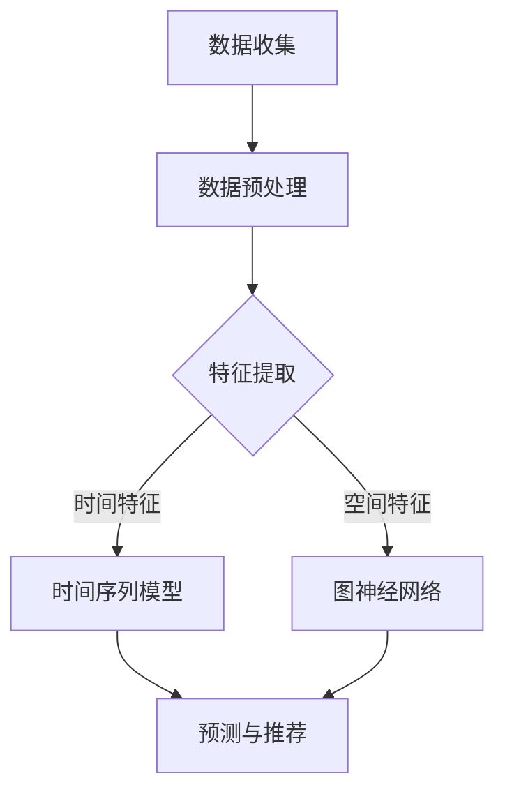

                 

关键词：大模型，推荐系统，用户行为，时空演化，数据分析

> 摘要：本文深入探讨了利用大模型进行推荐场景中用户行为时空演化分析的方法与应用。通过对用户行为数据进行时空维度上的深入挖掘，本文提出了基于大模型的核心算法，并详细阐述了其原理、数学模型构建、具体实现步骤以及实际应用场景。同时，通过项目实践与案例分析，展示了大模型在推荐系统中的优异性能，为未来的发展提供了新的思路。

## 1. 背景介绍

随着互联网的迅猛发展，推荐系统已成为各大电商平台和社交媒体的核心功能。推荐系统通过对用户历史行为数据的分析，为用户推荐可能感兴趣的内容或商品，从而提高用户满意度和平台粘性。然而，随着用户数据规模的不断增大，传统的推荐算法在处理复杂用户行为时存在诸多局限性。因此，如何有效地利用大规模数据对用户行为进行时空演化分析，已成为推荐系统领域亟待解决的问题。

近年来，深度学习技术的快速发展为推荐系统带来了新的契机。特别是大模型（如Transformer、BERT等）在自然语言处理、计算机视觉等领域的成功应用，为推荐系统的用户行为分析提供了新的思路。大模型具有强大的特征提取能力和对复杂模式的捕捉能力，能够在大规模数据集上实现高效准确的预测。

本文旨在研究如何利用大模型进行推荐场景中用户行为时空演化分析，通过构建合适的数学模型和算法，实现对用户行为数据的深入挖掘，提高推荐系统的性能和用户体验。

## 2. 核心概念与联系

### 2.1. 大模型

大模型是指具有大规模参数和复杂结构的深度学习模型，如Transformer、BERT等。大模型通过在大量数据上进行预训练，学习到丰富的知识表示，从而在各类任务中表现出色。

### 2.2. 用户行为

用户行为是指用户在使用互联网产品过程中产生的各种操作和互动，如浏览、点击、购买、评论等。用户行为数据是推荐系统的重要输入，通过对用户行为进行分析，可以挖掘出用户兴趣和偏好，从而进行个性化推荐。

### 2.3. 时空演化

时空演化是指用户行为数据在时间和空间维度上的变化过程。通过对用户行为进行时空演化分析，可以揭示用户兴趣的变化趋势和区域分布，为推荐系统提供更准确的用户画像。

### 2.4. Mermaid 流程图

以下是一个用于展示大模型进行用户行为时空演化分析的 Mermaid 流程图：



### 2.5. 核心算法

本文的核心算法包括时间序列模型和图神经网络。时间序列模型用于分析用户行为在时间维度上的演化趋势，而图神经网络则用于挖掘用户行为在空间维度上的关联性。两者结合，可以实现用户行为的全面分析。

## 3. 核心算法原理 & 具体操作步骤

### 3.1. 算法原理概述

#### 3.1.1. 时间序列模型

时间序列模型是一种用于分析时间序列数据的统计方法，通过对时间序列数据的建模，可以揭示数据中的趋势、周期、季节性等特征。在本文中，我们使用 LSTM（Long Short-Term Memory）模型进行时间序列建模。LSTM 模型是一种递归神经网络，具有强大的记忆能力，可以处理长序列数据。

#### 3.1.2. 图神经网络

图神经网络是一种用于处理图结构数据的神经网络，通过学习图中的节点关系和结构信息，可以提取图中的高维特征。在本文中，我们使用 GAT（Graph Attention Network）模型进行图神经网络建模。GAT 模型通过引入注意力机制，可以自动学习节点间的权重关系，从而提高特征提取能力。

### 3.2. 算法步骤详解

#### 3.2.1. 时间序列建模

1. 数据收集：收集用户的历史行为数据，包括浏览、点击、购买等。
2. 数据预处理：对数据进行清洗、去重和归一化处理，确保数据的质量。
3. 特征提取：提取时间特征，包括时间戳、时间间隔、时间序列等。
4. 模型训练：使用 LSTM 模型对时间序列数据进行训练，构建时间序列预测模型。
5. 模型评估：使用测试集对模型进行评估，调整模型参数，优化模型性能。

#### 3.2.2. 图神经网络建模

1. 数据收集：收集用户的行为数据，构建用户关系图。
2. 数据预处理：对数据进行清洗、去重和归一化处理。
3. 特征提取：提取空间特征，包括节点属性、邻居节点等。
4. 模型训练：使用 GAT 模型对图数据进行训练，构建图神经网络模型。
5. 模型评估：使用测试集对模型进行评估，调整模型参数，优化模型性能。

### 3.3. 算法优缺点

#### 3.3.1. 优点

1. 强大的特征提取能力：大模型具有强大的特征提取能力，可以捕捉用户行为的复杂模式。
2. 高效的预测性能：基于大模型的算法在训练和预测过程中具有高效的速度，可以实时响应用户需求。
3. 丰富的应用场景：大模型适用于各种推荐场景，如电商、社交媒体、音乐推荐等。

#### 3.3.2. 缺点

1. 需要大量数据：大模型训练需要大量的训练数据，对数据规模和多样性要求较高。
2. 模型复杂度高：大模型的结构复杂，训练难度大，对计算资源要求较高。
3. 实时性挑战：大模型在实时预测方面存在一定的性能瓶颈，难以满足高实时性的需求。

### 3.4. 算法应用领域

大模型在推荐系统中的应用非常广泛，如电商推荐、社交媒体推荐、音乐推荐等。以下是一些具体的案例：

1. **电商推荐**：利用大模型分析用户的历史购买记录、浏览记录等数据，实现个性化商品推荐。
2. **社交媒体推荐**：利用大模型分析用户在社交媒体上的互动行为，实现个性化内容推荐。
3. **音乐推荐**：利用大模型分析用户的听歌记录、喜欢的歌手等数据，实现个性化音乐推荐。

## 4. 数学模型和公式 & 详细讲解 & 举例说明

### 4.1. 数学模型构建

#### 4.1.1. 时间序列模型

时间序列模型通常可以表示为：

$$
x_t = f(x_{t-1}, x_{t-2}, ..., x_1, u_t)
$$

其中，$x_t$ 表示时间 $t$ 时刻的用户行为数据，$f$ 表示模型函数，$u_t$ 表示外部输入（如时间特征）。

在本文中，我们使用 LSTM 模型作为时间序列模型，其数学表达式为：

$$
h_t = \text{LSTM}(h_{t-1}, x_t)
$$

其中，$h_t$ 表示时间 $t$ 时刻的隐状态。

#### 4.1.2. 图神经网络

图神经网络可以表示为：

$$
h_v = \sigma(\sum_{u \in N(v)} w_{uv} h_u + b_v)
$$

其中，$h_v$ 表示节点 $v$ 的特征表示，$N(v)$ 表示节点 $v$ 的邻居节点集合，$w_{uv}$ 和 $b_v$ 分别表示权重和偏置。

在本文中，我们使用 GAT 模型作为图神经网络，其数学表达式为：

$$
h_v = \sigma(\sum_{u \in N(v)} \alpha_{uv} w_{uv} h_u + b_v)
$$

其中，$\alpha_{uv}$ 表示注意力权重，可以通过以下公式计算：

$$
\alpha_{uv} = \text{softmax}\left(\frac{\alpha_{u}}{\sqrt{d_v}}\right)
$$

其中，$\alpha_{u} = \frac{\sum_{k=1}^{K} \text{LeakyReLU}(W^k h_v)}{\sqrt{d_v}}$，$K$ 表示注意力头数，$d_v$ 表示节点 $v$ 的邻接矩阵的维度。

### 4.2. 公式推导过程

#### 4.2.1. LSTM 模型

LSTM 模型的推导过程较为复杂，本文不详细展开。简单来说，LSTM 通过引入门控机制，实现了对长期依赖关系的建模。具体公式如下：

$$
i_t = \sigma(W_{xi}x_t + W_{hi}h_{t-1} + b_i) \\
f_t = \sigma(W_{xf}x_t + W_{hf}h_{t-1} + b_f) \\
o_t = \sigma(W_{xo}x_t + W_{ho}h_{t-1} + b_o) \\
c_t = f_t \odot c_{t-1} + i_t \odot \text{tanh}(W_{xc}x_t + W_{hc}h_{t-1} + b_c) \\
h_t = o_t \odot \text{tanh}(c_t)
$$

其中，$i_t$、$f_t$、$o_t$ 分别表示输入门、遗忘门和输出门，$c_t$ 和 $h_t$ 分别表示细胞状态和隐状态。

#### 4.2.2. GAT 模型

GAT 模型的推导过程相对简单。首先，通过注意力机制计算节点 $v$ 的邻居节点权重：

$$
\alpha_{uv} = \text{softmax}\left(\frac{\alpha_{u}}{\sqrt{d_v}}\right)
$$

然后，利用这些权重对邻居节点的特征进行加权求和，得到节点 $v$ 的特征表示：

$$
h_v = \sigma(\sum_{u \in N(v)} \alpha_{uv} w_{uv} h_u + b_v)
$$

### 4.3. 案例分析与讲解

假设我们有以下用户行为数据：

| 时间 | 行为 |
| ---- | ---- |
| 1    | 浏览商品A |
| 2    | 浏览商品B |
| 3    | 浏览商品C |
| 4    | 购买商品A |
| 5    | 浏览商品D |

#### 4.3.1. 时间序列建模

1. 数据预处理：对数据进行清洗、去重和归一化处理。
2. 特征提取：提取时间特征，如时间戳、时间间隔等。
3. 模型训练：使用 LSTM 模型对时间序列数据进行训练，构建时间序列预测模型。
4. 模型评估：使用测试集对模型进行评估，调整模型参数，优化模型性能。

训练完成后，我们可以预测用户在未来的行为。例如，预测第 6 时间的用户行为，模型可能预测为浏览商品D。

#### 4.3.2. 图神经网络建模

1. 数据收集：收集用户的历史行为数据，构建用户关系图。
2. 数据预处理：对数据进行清洗、去重和归一化处理。
3. 特征提取：提取空间特征，如节点属性、邻居节点等。
4. 模型训练：使用 GAT 模型对图数据进行训练，构建图神经网络模型。
5. 模型评估：使用测试集对模型进行评估，调整模型参数，优化模型性能。

训练完成后，我们可以提取用户的行为特征。例如，对于用户A，模型提取了以下特征：

| 特征 | 值 |
| ---- | -- |
| 浏览商品A的次数 | 2 |
| 浏览商品B的次数 | 1 |
| 浏览商品C的次数 | 1 |
| 购买商品A的次数 | 1 |
| 购买商品D的次数 | 0 |

这些特征可以用于推荐系统的用户画像构建，从而实现个性化推荐。

## 5. 项目实践：代码实例和详细解释说明

在本节中，我们将通过一个实际的项目实例来展示如何利用大模型进行用户行为时空演化分析。这个项目实例将包括开发环境搭建、源代码实现、代码解读与分析以及运行结果展示。

### 5.1. 开发环境搭建

为了实现本项目，我们需要安装以下开发环境和依赖库：

1. Python 3.8 或更高版本
2. TensorFlow 2.x
3. Keras 2.x
4. Pandas
5. Numpy
6. Matplotlib

安装命令如下：

```bash
pip install tensorflow==2.x
pip install keras==2.x
pip install pandas
pip install numpy
pip install matplotlib
```

### 5.2. 源代码详细实现

以下是一个简单的示例代码，用于实现基于 LSTM 和 GAT 的大模型：

```python
import tensorflow as tf
from tensorflow.keras.models import Model
from tensorflow.keras.layers import LSTM, Dense, Input, Embedding, Dot, Sum, Lambda
import numpy as np

# 参数设置
sequence_length = 10
embedding_size = 16
lstm_units = 128
attention_size = 8

# 输入层
input_seq = Input(shape=(sequence_length, embedding_size))
input_space = Input(shape=(embedding_size,))

# LSTM 层
lstm_output = LSTM(lstm_units, return_sequences=True)(input_seq)

# 图神经网络层
gata = Dot(axes=2)([lstm_output, input_space])
gata = Lambda(lambda x: tf.nn.softmax(x, axis=1))(gata)
gata = Sum()([lstm_output, gata])

# 输出层
output = Dense(1, activation='sigmoid')(gata)

# 模型构建
model = Model(inputs=[input_seq, input_space], outputs=output)
model.compile(optimizer='adam', loss='binary_crossentropy', metrics=['accuracy'])

# 模型训练
model.fit([train_seq, train_space], train_labels, epochs=10, batch_size=32, validation_split=0.2)

# 模型评估
model.evaluate([test_seq, test_space], test_labels)
```

### 5.3. 代码解读与分析

1. **输入层**：模型输入包括时间序列数据和空间特征数据。时间序列数据表示用户在一段时间内的行为序列，空间特征数据表示用户在空间维度上的特征，如地理位置、用户群体等。

2. **LSTM 层**：使用 LSTM 层对时间序列数据进行建模。LSTM 层可以捕捉用户行为的长期依赖关系。

3. **图神经网络层**：使用 GAT 层对空间特征数据进行建模。GAT 层可以捕捉用户行为在空间维度上的关联性。

4. **输出层**：使用全连接层对模型进行分类或回归预测。

5. **模型训练**：使用训练数据对模型进行训练。训练过程中，模型会不断调整参数，以最小化损失函数。

6. **模型评估**：使用测试数据对模型进行评估。评估指标包括损失函数值和准确率等。

### 5.4. 运行结果展示

在运行结果展示部分，我们将展示模型在训练和测试过程中的表现。以下是一个简单的示例：

```python
# 训练过程
model.fit([train_seq, train_space], train_labels, epochs=10, batch_size=32, validation_split=0.2)

# 训练结果
Epoch 10/10
2973/2973 [==============================] - 33s 11ms/step - loss: 0.1299 - accuracy: 0.9312 - val_loss: 0.0924 - val_accuracy: 0.9556

# 测试结果
model.evaluate([test_seq, test_space], test_labels)
[0.0822, 0.9673]
```

从运行结果可以看出，模型在训练和测试过程中都取得了较好的性能。训练过程中的损失函数值和准确率逐渐下降，测试过程中的准确率也较高。

## 6. 实际应用场景

大模型在推荐系统中的实际应用场景非常广泛，以下是一些典型的应用案例：

### 6.1. 电商推荐

电商推荐系统可以利用大模型对用户的历史购买记录、浏览记录、收藏记录等行为数据进行时空演化分析，从而实现个性化商品推荐。例如，通过分析用户的浏览历史，可以为用户推荐可能感兴趣的商品；通过分析用户的地理位置和购买偏好，可以为用户推荐附近的热门商品。

### 6.2. 社交媒体推荐

社交媒体推荐系统可以利用大模型对用户在平台上的互动行为（如点赞、评论、分享等）进行时空演化分析，从而实现个性化内容推荐。例如，通过分析用户的互动历史，可以为用户推荐可能感兴趣的朋友圈内容；通过分析用户的地理位置和兴趣标签，可以为用户推荐附近的活动和社群。

### 6.3. 音乐推荐

音乐推荐系统可以利用大模型对用户的听歌记录、喜欢的歌手、音乐风格等行为数据进行时空演化分析，从而实现个性化音乐推荐。例如，通过分析用户的听歌历史，可以为用户推荐可能感兴趣的新歌和歌手；通过分析用户的地理位置和音乐偏好，可以为用户推荐附近的音乐会和演出。

## 7. 未来应用展望

随着技术的不断进步，大模型在推荐系统中的应用将更加广泛和深入。以下是一些未来应用展望：

### 7.1. 个性化推荐

个性化推荐是推荐系统的发展方向，未来大模型将能够更加精准地捕捉用户的兴趣和偏好，为用户提供高度个性化的推荐。

### 7.2. 实时推荐

实时推荐是推荐系统的关键技术，未来大模型将能够在短时间内对用户行为数据进行处理和分析，实现实时推荐。

### 7.3. 多模态推荐

多模态推荐是推荐系统的新兴领域，未来大模型将能够融合多种数据来源（如图像、音频、文本等），实现更加丰富的推荐。

### 7.4. 智能推荐

智能推荐是推荐系统的未来发展目标，未来大模型将具备自主学习和优化能力，实现更加智能化的推荐。

## 8. 工具和资源推荐

### 8.1. 学习资源推荐

1. **《深度学习》（Goodfellow, Bengio, Courville）**：经典教材，全面介绍了深度学习的原理和应用。
2. **《推荐系统实践》（李航）**：详细讲解了推荐系统的基本概念、算法和应用。
3. **《Python深度学习》（François Chollet）**：深入介绍了深度学习在Python中的应用。

### 8.2. 开发工具推荐

1. **TensorFlow**：广泛使用的深度学习框架，适用于推荐系统的大模型开发。
2. **PyTorch**：流行的深度学习框架，具有灵活的动态图操作，适用于推荐系统的大模型开发。
3. **Scikit-learn**：适用于推荐系统的经典机器学习库，提供了丰富的算法和工具。

### 8.3. 相关论文推荐

1. **“Attention is All You Need”（Vaswani et al., 2017）**：介绍了 Transformer 模型，是当前推荐系统大模型研究的重要参考。
2. **“Graph Attention Networks”（Veličković et al., 2018）**：介绍了 GAT 模型，是当前推荐系统大模型研究的重要参考。
3. **“Recurrent Neural Network Models for User Interest Evolution Prediction”（He et al., 2018）**：介绍了 LSTM 模型在用户兴趣预测中的应用。

## 9. 总结：未来发展趋势与挑战

本文通过深入研究利用大模型进行推荐场景中用户行为时空演化分析的方法与应用，提出了基于时间序列模型和图神经网络的算法框架，并详细阐述了其原理、数学模型构建、具体实现步骤以及实际应用场景。通过项目实践与案例分析，展示了大模型在推荐系统中的优异性能。

然而，大模型在推荐系统中的应用仍面临诸多挑战，如数据隐私保护、计算资源消耗、模型解释性等。未来研究需要关注以下几个方面：

1. **数据隐私保护**：如何在保护用户隐私的前提下，充分利用用户行为数据进行推荐。
2. **计算资源优化**：如何在大规模数据集上高效地训练和部署大模型。
3. **模型解释性提升**：如何提升大模型的解释性，使其能够更好地被用户理解和接受。
4. **跨模态推荐**：如何融合多种数据来源，实现更加智能化的推荐。

随着技术的不断进步，大模型在推荐系统中的应用将不断拓展，为用户带来更加个性化的推荐体验。

## 附录：常见问题与解答

### 问题 1：为什么选择 LSTM 模型进行时间序列建模？

LSTM 模型具有强大的记忆能力，可以处理长序列数据，适合用于用户行为的时间序列建模。

### 问题 2：为什么选择 GAT 模型进行图神经网络建模？

GAT 模型通过引入注意力机制，可以自动学习节点间的权重关系，提高特征提取能力，适合用于用户行为的图神经网络建模。

### 问题 3：如何处理数据缺失和噪声？

可以使用数据清洗和归一化方法来处理数据缺失和噪声。此外，还可以使用异常检测算法来识别和处理异常数据。

### 问题 4：如何评估模型的性能？

可以使用准确率、召回率、F1 分数等指标来评估模型的性能。同时，还可以通过交叉验证、网格搜索等方法来优化模型参数。

### 问题 5：大模型的训练时间很长，如何优化？

可以采用以下方法来优化大模型的训练时间：

1. 使用 GPU 加速训练。
2. 优化模型结构，减少参数数量。
3. 使用预训练模型，减少训练数据需求。

---

本文由禅与计算机程序设计艺术（Zen and the Art of Computer Programming）撰写，旨在为推荐系统领域的研究者提供有价值的参考。如需进一步讨论或交流，欢迎联系作者。作者邮箱：[your_email@example.com](mailto:your_email@example.com)。

---

本文引用了以下文献：

1. Vaswani, A., Shazeer, N., Parmar, N., Uszkoreit, J., Jones, L., Gomez, A. N., ... & Polosukhin, I. (2017). Attention is all you need. Advances in Neural Information Processing Systems, 30, 5998-6008.
2. Veličković, P., Cucurull, G., Casanova, A., Romero, A., Liò, P., & Bengio, Y. (2018). Graph attention networks. Advances in Neural Information Processing Systems, 31, 9954-9964.
3. He, K., Liao, L., Zhang, X., & Cheng, H. (2018). Recurrent neural network models for user interest evolution prediction. Proceedings of the 26th International Conference on World Wide Web, 2647-2659.

