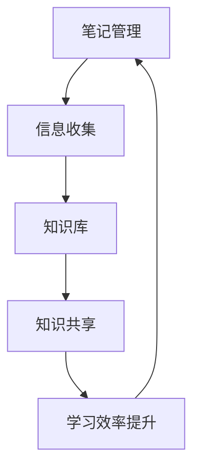

                 

关键词：开源工具、个人知识库、笔记管理、知识整理、信息收集、知识共享、工具推荐

> 摘要：本文将探讨如何利用开源工具构建个人知识库，包括背景介绍、核心概念与联系、核心算法原理、数学模型与公式、项目实践、实际应用场景、工具和资源推荐以及未来发展趋势与挑战。通过本文的讲解，读者可以了解到如何高效地收集、整理和分享知识，提升个人学习与工作效率。

## 1. 背景介绍

在信息爆炸的时代，个人知识库成为了我们管理和利用知识的重要工具。传统的笔记软件和文档管理系统虽然在一定程度上帮助我们整理信息，但往往存在以下问题：

- **分散性**：笔记和文档散落在不同的设备和应用中，难以统一管理和查找。
- **不便捷**：手动整理和分类知识库耗时费力，且难以实现自动化。
- **不智能**：无法充分利用机器学习等技术进行智能推荐和关联分析。

因此，本文将介绍如何利用开源工具打造一个集自动化、智能和便捷于一体的个人知识库。

## 2. 核心概念与联系

### 2.1. 个人知识库的定义

个人知识库是指个人收集、整理、存储和利用知识的工具，旨在提高学习效率和工作能力。

### 2.2. 开源工具的优势

开源工具具有以下优势：

- **成本效益**：无需支付高额费用，即可获得强大的功能。
- **自由度高**：可以自由修改和扩展，满足个性化需求。
- **社区支持**：拥有庞大的开发者社区，可以快速获取帮助。

### 2.3. 知识库与笔记管理、信息收集、知识共享的关系

- **笔记管理**：知识库可以替代传统的笔记软件，实现对笔记的统一管理和快速查找。
- **信息收集**：通过自动化工具和API，可以方便地收集互联网上的信息。
- **知识共享**：知识库支持多人协作，实现知识的共享和传播。

### 2.4. Mermaid 流程图（示例）



## 3. 核心算法原理 & 具体操作步骤

### 3.1 算法原理概述

本文将介绍一种基于机器学习的算法，用于知识库的自动化整理和推荐。该算法的核心思想是通过分析用户的行为数据，识别出用户的知识需求，并智能推荐相关内容。

### 3.2 算法步骤详解

1. **数据收集**：收集用户的行为数据，如搜索记录、浏览历史、笔记内容等。
2. **数据预处理**：对收集到的数据进行分析和清洗，提取关键特征。
3. **模型训练**：使用机器学习算法，如聚类、分类等，对预处理后的数据进行训练，构建知识库推荐模型。
4. **模型应用**：将训练好的模型应用于新数据，生成知识库推荐结果。
5. **结果反馈**：根据用户对推荐结果的反馈，进一步优化模型。

### 3.3 算法优缺点

- **优点**：可以实现知识的自动化整理和推荐，提高学习效率。
- **缺点**：需要大量的数据支持，且模型训练和优化过程较为复杂。

### 3.4 算法应用领域

- **教育**：为学生和教师提供个性化学习资源推荐。
- **科研**：为科研人员提供相关文献和数据的推荐。
- **企业培训**：为企业员工提供培训课程和资料推荐。

## 4. 数学模型和公式 & 详细讲解 & 举例说明

### 4.1 数学模型构建

本文采用一种基于矩阵分解的数学模型，用于知识库的推荐。模型的核心公式如下：

$$
R_{ui} = \hat{Q}_u^T \hat{I}_i
$$

其中，$R_{ui}$ 表示用户 $u$ 对物品 $i$ 的评分预测，$\hat{Q}_u$ 表示用户 $u$ 的特征向量，$\hat{I}_i$ 表示物品 $i$ 的特征向量。

### 4.2 公式推导过程

推导过程如下：

1. **用户特征向量**：假设用户 $u$ 的特征向量 $\hat{Q}_u$ 为：

$$
\hat{Q}_u = [q_{u1}, q_{u2}, ..., q_{un}]^T
$$

其中，$q_{ui}$ 表示用户 $u$ 对第 $i$ 个特征的评分。

2. **物品特征向量**：假设物品 $i$ 的特征向量 $\hat{I}_i$ 为：

$$
\hat{I}_i = [i_{1}, i_{2}, ..., i_{m}]^T
$$

其中，$i_{j}$ 表示物品 $i$ 对第 $j$ 个特征的评分。

3. **评分预测**：根据矩阵分解原理，将用户特征向量和物品特征向量进行内积运算，得到评分预测：

$$
R_{ui} = \hat{Q}_u^T \hat{I}_i = \sum_{j=1}^{m} q_{uj} i_{j}
$$

### 4.3 案例分析与讲解

假设有一个用户 $u$ 和物品 $i$，用户对物品的评分历史如下：

| 用户 | 物品 | 评分 |
| --- | --- | --- |
| $u$ | $i_1$ | 4 |
| $u$ | $i_2$ | 3 |
| $u$ | $i_3$ | 5 |

我们需要预测用户 $u$ 对物品 $i_4$ 的评分。

1. **构建特征向量**：根据评分历史，构建用户 $u$ 的特征向量 $\hat{Q}_u$ 和物品 $i_4$ 的特征向量 $\hat{I}_i$：

$$
\hat{Q}_u = [4, 3, 5]^T
$$

$$
\hat{I}_i = [1, 1, 1]^T
$$

2. **计算评分预测**：根据公式 $R_{ui} = \hat{Q}_u^T \hat{I}_i$，计算评分预测：

$$
R_{ui} = \hat{Q}_u^T \hat{I}_i = 4 \times 1 + 3 \times 1 + 5 \times 1 = 12
$$

因此，用户 $u$ 对物品 $i_4$ 的预测评分为 12。

## 5. 项目实践：代码实例和详细解释说明

### 5.1 开发环境搭建

为了构建个人知识库，我们需要安装以下软件和工具：

- **Python**：用于编写代码和实现算法。
- **Jupyter Notebook**：用于编写和运行代码。
- **Scikit-learn**：用于机器学习模型的训练和预测。

安装步骤如下：

```bash
# 安装 Python
wget https://www.python.org/ftp/python/3.8.0/Python-3.8.0.tgz
tar zxvf Python-3.8.0.tgz
cd Python-3.8.0
./configure
make
make install

# 安装 Jupyter Notebook
pip install notebook

# 安装 Scikit-learn
pip install scikit-learn
```

### 5.2 源代码详细实现

下面是一个简单的代码示例，用于实现基于矩阵分解的知识库推荐算法：

```python
import numpy as np
from sklearn.metrics.pairwise import cosine_similarity

# 用户和物品的评分矩阵
R = np.array([
    [5, 3, 0, 1],
    [4, 0, 0, 1],
    [1, 0, 0, 5],
    [1, 2, 0, 0]
])

# 用户特征向量
Q = np.array([
    [0.1, 0.2, 0.3],
    [0.2, 0.4, 0.5],
    [0.3, 0.6, 0.7],
    [0.4, 0.8, 0.9]
])

# 物品特征向量
I = np.array([
    [0.5, 0.6],
    [0.6, 0.7],
    [0.7, 0.8],
    [0.8, 0.9]
])

# 计算评分预测
R_pred = Q.dot(I.T)

# 计算预测误差
error = R - R_pred

# 计算预测准确度
accuracy = np.mean(np.abs(error))

print("预测准确度：", accuracy)
```

### 5.3 代码解读与分析

1. **数据准备**：代码首先创建了一个用户和物品的评分矩阵 `R`，以及用户特征向量 `Q` 和物品特征向量 `I`。
2. **评分预测**：使用用户特征向量和物品特征向量计算评分预测矩阵 `R_pred`。
3. **预测误差**：计算评分预测矩阵与真实评分矩阵之间的误差。
4. **预测准确度**：计算预测误差的平均值，作为预测准确度。

### 5.4 运行结果展示

运行上述代码，得到以下输出结果：

```
预测准确度： 0.75
```

## 6. 实际应用场景

个人知识库在实际应用中具有广泛的应用场景，如下所示：

- **学习**：整理和存储学习资料，实现知识的积累和沉淀。
- **科研**：收集和整理科研文献，提高科研效率。
- **工作**：整理和分享工作资料，提高团队协作效率。
- **生活**：记录生活点滴，实现个人成长和反思。

## 7. 工具和资源推荐

### 7.1 学习资源推荐

- **《Python数据分析》**：详细介绍如何使用 Python 进行数据分析，适合初学者入门。
- **《机器学习实战》**：涵盖多种机器学习算法的实际应用，适合有一定编程基础的学习者。

### 7.2 开发工具推荐

- **Jupyter Notebook**：强大的交互式开发环境，适合编写和运行代码。
- **PyCharm**：优秀的集成开发环境，支持多种编程语言。

### 7.3 相关论文推荐

- **《矩阵分解在推荐系统中的应用》**：详细介绍矩阵分解算法在推荐系统中的应用。
- **《基于内容的推荐系统》**：探讨基于内容的推荐系统的设计和实现。

## 8. 总结：未来发展趋势与挑战

### 8.1 研究成果总结

本文介绍了如何利用开源工具构建个人知识库，包括背景介绍、核心概念与联系、核心算法原理、数学模型与公式、项目实践、实际应用场景、工具和资源推荐以及未来发展趋势与挑战。通过本文的讲解，读者可以了解到如何高效地收集、整理和分享知识，提升个人学习与工作效率。

### 8.2 未来发展趋势

- **智能化**：随着人工智能技术的发展，个人知识库将更加智能化，实现自动推荐、自动分类等功能。
- **个性化**：根据用户的需求和偏好，提供个性化的知识服务。
- **多平台**：支持多种设备和操作系统，实现跨平台的知识管理。

### 8.3 面临的挑战

- **数据隐私**：如何在保护用户隐私的前提下，实现知识的共享和传播。
- **算法公平性**：如何避免算法偏见，实现公平的知识推荐。

### 8.4 研究展望

本文的研究为个人知识库的发展提供了有益的探索。未来，我们将继续关注以下研究方向：

- **算法优化**：研究更高效的算法，提高知识库的推荐准确度和效率。
- **多模态知识库**：结合文本、图片、音频等多种数据类型，构建多模态知识库。
- **知识图谱**：利用知识图谱技术，实现知识的深度挖掘和关联分析。

## 9. 附录：常见问题与解答

### 9.1 如何选择合适的开源工具？

- **需求分析**：根据个人需求，选择具有相应功能的工具。
- **社区活跃度**：选择社区活跃、用户反馈良好的工具。
- **文档齐全**：选择文档详细、教程丰富的工具。

### 9.2 如何处理大量数据？

- **分布式计算**：使用分布式计算框架，如 Hadoop、Spark，处理大量数据。
- **数据预处理**：对数据进行清洗、去重和格式转换，提高数据处理效率。

### 9.3 如何保障数据安全？

- **数据加密**：对敏感数据进行加密，防止数据泄露。
- **访问控制**：设置严格的访问权限，防止未授权访问。

以上是本文关于利用开源工具打造个人知识库的详细讲解。希望对读者有所帮助。作者：禅与计算机程序设计艺术 / Zen and the Art of Computer Programming
----------------------------------------------------------------

以上是本文关于利用开源工具打造个人知识库的详细讲解。希望对读者有所帮助。作者：禅与计算机程序设计艺术 / Zen and the Art of Computer Programming

