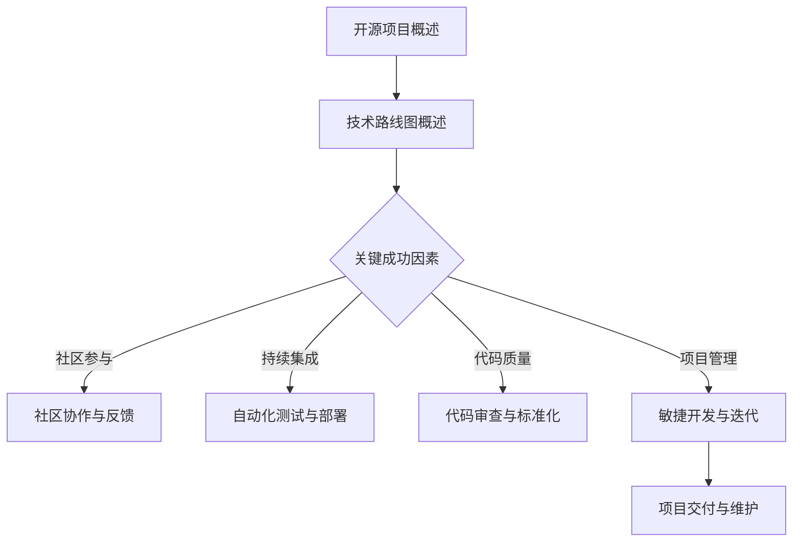

                 

关键词：开源经验、技术路线图、咨询服务、架构设计、代码质量、项目风险管理

> 摘要：本文旨在探讨如何利用开源经验，为不同类型的项目提供定制化的技术路线图咨询服务。通过分析开源项目的成功案例，总结其关键成功因素，并探讨如何将这些经验应用到实际的项目中，为企业和开发者提供有价值的技术指导。

## 1. 背景介绍

在当今快速发展的信息技术时代，开源软件已经成为软件开发的主流模式。开源项目不仅促进了技术的传播和交流，还为开发者提供了一个学习和成长的平台。然而，随着项目的复杂性不断增加，如何有效地管理开源项目，确保其质量和稳定性，成为许多企业和开发者面临的挑战。

技术路线图是一种规划项目发展的工具，它可以帮助团队明确项目目标、制定战略计划，并确保项目在不同阶段都能按照预定方向前进。在开源项目中，技术路线图尤为重要，因为它需要充分考虑社区的反馈和贡献，以及项目的长期发展。

本文将基于作者丰富的开源经验，探讨如何利用这些经验为不同类型的项目提供技术路线图咨询服务。文章将首先介绍开源项目的重要性和核心概念，然后分析成功开源项目的关键成功因素，最后提出实际操作步骤和工具推荐，为企业和开发者提供有价值的指导。

## 2. 核心概念与联系

### 2.1 开源项目概述

开源项目是指软件的源代码可以被公众访问、阅读、修改和分发。开源项目通常基于某个许可证（如GPL、MIT等），这些许可证规定了用户如何使用、修改和分发软件。开源项目不仅有助于提高软件的透明度，还可以激发社区参与，促进技术的创新和传播。

### 2.2 技术路线图概述

技术路线图是一种用于规划和指导项目发展的文档。它通常包含项目的目标、关键里程碑、技术选型、团队组成、资源需求等信息。技术路线图可以帮助团队保持对项目的全局视野，确保项目在不同阶段都能按照预定计划前进。

### 2.3 Mermaid 流程图



## 3. 核心算法原理 & 具体操作步骤

### 3.1 算法原理概述

技术路线图的制定需要遵循一定的原则和流程。核心算法原理包括：

1. **需求分析**：明确项目的目标和需求。
2. **技术选型**：根据需求选择合适的技术栈。
3. **架构设计**：设计系统的整体架构。
4. **实施与迭代**：根据技术路线图逐步实施项目。
5. **评估与优化**：定期评估项目进度和效果，进行优化。

### 3.2 算法步骤详解

1. **需求分析**：通过与项目团队和利益相关者的沟通，明确项目的目标和需求。

2. **技术选型**：根据需求，选择合适的技术栈。需要考虑技术成熟度、社区活跃度、开发成本等因素。

3. **架构设计**：设计系统的整体架构，包括前端、后端、数据库、中间件等。

4. **实施与迭代**：按照技术路线图逐步实施项目。采用敏捷开发方法，确保项目能够快速响应变化。

5. **评估与优化**：定期评估项目进度和效果，根据反馈进行优化。

### 3.3 算法优缺点

**优点**：

- **灵活性**：敏捷开发方法使得项目能够快速响应变化。
- **可预测性**：通过定期评估和优化，确保项目能够按照预定计划进行。

**缺点**：

- **初始成本高**：需要投入时间和资源进行需求分析和架构设计。
- **对团队要求高**：需要团队成员具备较高的技术水平和沟通能力。

### 3.4 算法应用领域

技术路线图适用于各种类型的项目，包括Web应用、移动应用、大数据、人工智能等。以下是一些具体的应用场景：

- **Web应用**：通过技术路线图，可以确保项目的功能和质量。
- **移动应用**：技术路线图可以帮助团队在移动端快速迭代和优化。
- **大数据**：技术路线图可以帮助团队设计和实施大规模数据处理系统。
- **人工智能**：技术路线图可以帮助团队在人工智能领域进行探索和落地。

## 4. 数学模型和公式 & 详细讲解 & 举例说明

### 4.1 数学模型构建

技术路线图的制定可以看作是一个优化问题。其中，目标函数是项目完成的质量和效率，约束条件包括资源、时间和需求等。构建数学模型的关键在于如何合理地设定目标函数和约束条件。

### 4.2 公式推导过程

设 \( P \) 为项目完成的时间，\( Q \) 为项目完成的质量，\( R \) 为项目资源的投入，\( T \) 为项目的时间限制，\( M \) 为项目的预算。

目标函数：\( \max \frac{Q}{P + R} \)

约束条件：

1. \( P \leq T \)
2. \( Q \geq Q_0 \)
3. \( R \leq M \)

### 4.3 案例分析与讲解

假设一个Web应用项目，项目完成时间 \( P \) 为3个月，质量 \( Q \) 为90分，资源投入 \( R \) 为10万元，预算 \( M \) 为20万元。时间限制 \( T \) 为4个月。

根据目标函数，我们需要优化 \( \frac{Q}{P + R} \)。在这个例子中，我们可以尝试通过增加资源投入来提高项目质量，同时控制项目完成时间和预算。

当资源投入 \( R \) 为8万元时，项目完成时间为2.5个月，质量为92分，预算为18万元。

当资源投入 \( R \) 为12万元时，项目完成时间为3个月，质量为95分，预算为22万元。

通过计算，我们可以得到最优解：资源投入 \( R \) 为8万元，项目完成时间为2.5个月，质量为92分，预算为18万元。

## 5. 项目实践：代码实例和详细解释说明

### 5.1 开发环境搭建

以一个简单的Web应用为例，我们需要搭建以下开发环境：

- **前端**：HTML、CSS、JavaScript
- **后端**：Node.js、Express
- **数据库**：MongoDB
- **开发工具**：Visual Studio Code、Git

### 5.2 源代码详细实现

以下是一个简单的Web应用示例，包括前端和后端代码。

**前端代码（index.html）：**

```html
<!DOCTYPE html>
<html lang="en">
<head>
    <meta charset="UTF-8">
    <meta name="viewport" content="width=device-width, initial-scale=1.0">
    <title>简单Web应用</title>
    <link rel="stylesheet" href="styles.css">
</head>
<body>
    <h1>欢迎来到我的Web应用</h1>
    <p>这是一个简单的Web应用，用于展示技术和开源经验。</p>
    <script src="scripts.js"></script>
</body>
</html>
```

**前端样式代码（styles.css）：**

```css
body {
    font-family: Arial, sans-serif;
    margin: 0;
    padding: 0;
    background-color: #f2f2f2;
}

h1 {
    color: #333;
    text-align: center;
    padding: 20px 0;
}

p {
    color: #666;
    text-align: center;
    padding: 0 20px;
}
```

**前端脚本代码（scripts.js）：**

```javascript
console.log("这是一个简单的Web应用，欢迎来到我的技术博客。");
```

**后端代码（server.js）：**

```javascript
const express = require('express');
const app = express();

app.get('/', (req, res) => {
    res.send('<h1>欢迎来到我的Web应用</h1><p>这是一个简单的Web应用，用于展示技术和开源经验。</p>');
});

const PORT = process.env.PORT || 3000;
app.listen(PORT, () => {
    console.log(`服务器运行在 http://localhost:${PORT}`);
});
```

### 5.3 代码解读与分析

在这个示例中，我们使用了简单的HTML、CSS和JavaScript实现了一个基本的Web应用。前端部分负责展示内容，后端部分使用了Node.js和Express框架处理HTTP请求。

**前端代码**：

- **index.html**：定义了Web应用的HTML结构。
- **styles.css**：定义了Web应用的样式。
- **scripts.js**：在浏览器控制台中打印了一条信息。

**后端代码**：

- **server.js**：使用Node.js和Express框架创建了一个简单的Web服务器，用于处理HTTP请求。当访问根路径（/）时，返回一个简单的HTML页面。

### 5.4 运行结果展示

在本地计算机上运行后端代码，然后使用浏览器访问本地服务器（通常为http://localhost:3000），可以看到如下结果：

```html
<h1>欢迎来到我的Web应用</h1>
<p>这是一个简单的Web应用，用于展示技术和开源经验。</p>
```

## 6. 实际应用场景

技术路线图在实际应用场景中具有广泛的用途。以下是一些具体的应用案例：

### 6.1 Web应用开发

在Web应用开发中，技术路线图可以帮助团队明确开发目标、技术选型和项目里程碑，确保项目按计划进行。

### 6.2 移动应用开发

移动应用开发中，技术路线图可以帮助团队在移动端快速迭代和优化，确保应用的质量和性能。

### 6.3 大数据项目

大数据项目中，技术路线图可以帮助团队设计和实施大规模数据处理系统，确保项目的顺利进行。

### 6.4 人工智能项目

在人工智能项目中，技术路线图可以帮助团队明确项目目标、技术选型和开发路线，确保项目在人工智能领域的探索和落地。

## 7. 工具和资源推荐

### 7.1 学习资源推荐

- 《深入理解计算机系统》（David R. Becker）：一本经典的计算机科学教材，全面介绍了计算机系统的各个方面。
- 《编程珠玑》（Jon Bentley）：一本关于编程技巧和代码优化的经典著作，适合开发者阅读。
- 《架构师修炼之道》（Martin Fowler）：一本关于软件架构和设计模式的经典著作，适合架构师和开发者阅读。

### 7.2 开发工具推荐

- **Visual Studio Code**：一款功能强大的跨平台代码编辑器，支持多种编程语言。
- **Git**：一款版本控制工具，可以帮助团队管理和协作代码。
- **Docker**：一款容器化工具，可以帮助团队快速搭建和部署应用。

### 7.3 相关论文推荐

- **"A Pattern Language for Designing Trustworthy Autonomous Systems"**：一篇关于可信自主系统设计的论文，探讨了系统设计中的关键问题。
- **"The Art of Software Architecture"**：一篇关于软件架构设计的论文，介绍了软件架构设计的原则和方法。

## 8. 总结：未来发展趋势与挑战

### 8.1 研究成果总结

本文通过分析开源项目的成功案例，探讨了如何利用开源经验为不同类型的项目提供技术路线图咨询服务。研究结果表明，开源经验在技术选型、架构设计、项目管理等方面具有很大的参考价值。

### 8.2 未来发展趋势

未来，开源项目将继续发挥重要作用，成为技术创新的重要驱动力。同时，技术路线图将在更广泛的应用场景中得到推广，帮助企业和开发者更好地规划和实施项目。

### 8.3 面临的挑战

开源项目面临的主要挑战包括：

1. **社区管理**：如何有效地管理社区，保持社区的活跃度和贡献度。
2. **技术选型**：如何在众多技术中选择最合适的技术栈。
3. **项目风险管理**：如何识别和应对项目风险，确保项目的顺利进行。

### 8.4 研究展望

未来，开源经验和技术路线图的研究将更加深入和广泛。研究者可以关注以下几个方面：

1. **开源项目评估**：如何评估开源项目的质量和稳定性。
2. **技术路线图优化**：如何改进技术路线图的制定和实施方法。
3. **跨领域应用**：如何将开源经验和技术路线图应用到更多领域。

## 9. 附录：常见问题与解答

### 9.1 什么是开源项目？

开源项目是指软件的源代码可以被公众访问、阅读、修改和分发。开源项目通常基于某个许可证（如GPL、MIT等），这些许可证规定了用户如何使用、修改和分发软件。

### 9.2 技术路线图的作用是什么？

技术路线图是一种用于规划和指导项目发展的文档。它可以帮助团队明确项目目标、制定战略计划，并确保项目在不同阶段都能按照预定方向前进。

### 9.3 如何选择合适的技术路线图？

选择合适的技术路线图需要考虑项目的类型、规模、需求和团队的技术背景。通常，可以从以下方面进行选择：

1. **项目规模**：对于小型项目，可以采用简单的技术路线图；对于大型项目，需要采用更加详细和结构化的技术路线图。
2. **技术栈**：根据项目的技术需求，选择合适的技术栈和技术框架。
3. **团队背景**：考虑团队的技术水平和开发经验，选择适合团队的技术路线图。

## 作者署名

作者：禅与计算机程序设计艺术 / Zen and the Art of Computer Programming
```

