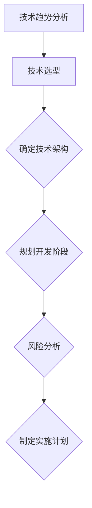

                 

关键词：开源经验、技术路线图、咨询服务、技术规划、软件架构

摘要：本文旨在探讨如何利用丰富的开源经验为企业和个人提供高质量的技术路线图咨询服务。通过分析开源社区的实践，总结技术路线图的关键要素，并介绍具体的制定流程和方法，旨在帮助读者更好地理解和应用技术路线图，从而在技术决策和项目管理中取得成功。

## 1. 背景介绍

在当今快速发展的技术时代，开源软件已经成为企业创新和发展的关键组成部分。随着开源项目的增多和复杂性提高，如何有效地利用开源经验，为企业提供科学、合理的技术路线图，已经成为咨询领域的重要课题。技术路线图不仅帮助企业明确技术发展方向，还能够指导项目规划和资源分配，从而提高项目成功率和投资回报率。

本文将结合笔者在开源社区多年的实践经验，探讨如何利用开源经验提供技术路线图咨询服务。我们将从技术路线图的定义、核心要素、制定流程、具体案例分析以及工具和资源推荐等方面进行详细阐述，帮助读者更好地理解和应用技术路线图。

## 2. 核心概念与联系

### 2.1 技术路线图的定义

技术路线图是一种描述技术发展和规划的工具，它以图形化的方式展示了技术从初始阶段到最终实现的全过程。技术路线图通常包含关键的技术里程碑、开发阶段、技术选型和风险评估等内容，是项目规划和决策的重要依据。

### 2.2 核心要素

#### 2.2.1 技术趋势

技术趋势是技术路线图的基础，它反映了当前和未来一段时间内技术的发展方向。通过分析技术趋势，可以预见技术发展的方向，为技术选型提供依据。

#### 2.2.2 技术选型

技术选型是技术路线图的核心，它决定了项目的技术架构和实现方案。在选型过程中，需要综合考虑技术性能、稳定性、安全性、可维护性等因素。

#### 2.2.3 开发阶段

开发阶段是技术路线图的重要部分，它详细描述了项目从启动到完成的各个阶段，包括需求分析、设计、开发、测试和部署等。

#### 2.2.4 风险评估

风险评估是技术路线图的重要组成部分，它对项目可能面临的风险进行预测和分析，并提出相应的应对策略。

### 2.3 架构流程图

以下是一个简化的技术路线图架构流程图：



## 3. 核心算法原理 & 具体操作步骤

### 3.1 算法原理概述

技术路线图的制定是一个系统性工程，涉及多方面的知识。以下是几个核心算法原理：

#### 3.1.1 SWOT分析

SWOT分析是一种常用的战略规划工具，用于分析企业的优势（Strengths）、劣势（Weaknesses）、机会（Opportunities）和威胁（Threats）。在技术路线图中，SWOT分析可以帮助企业识别自身的技术优势，找到发展方向，并规避潜在风险。

#### 3.1.2 技术栈评估

技术栈评估是技术选型的重要步骤，它通过分析各种技术的性能、稳定性、社区活跃度等因素，帮助企业选择最适合的技术方案。

#### 3.1.3 生命周期管理

生命周期管理是确保技术路线图实施过程顺利的关键，它涵盖了技术选型、开发、测试、部署、维护等各个环节，确保项目能够按计划进行。

### 3.2 算法步骤详解

#### 3.2.1 技术趋势分析

1. 收集数据：通过查阅技术报告、研究论文、行业资讯等，收集技术趋势数据。
2. 数据分析：使用数据分析工具对收集到的数据进行分析，提取技术趋势。
3. 形成报告：将分析结果形成报告，为后续技术选型提供依据。

#### 3.2.2 技术选型

1. 确定需求：明确项目需求，包括性能、稳定性、安全性、可维护性等方面。
2. 分析技术栈：根据需求分析结果，分析各种技术的性能、稳定性、社区活跃度等因素。
3. 技术评估：对各种技术进行评估，选择最优的技术方案。

#### 3.2.3 确定技术架构

1. 设计架构：根据技术选型结果，设计技术架构。
2. 审核架构：对设计的架构进行审核，确保其符合项目需求和技术标准。
3. 优化架构：根据审核结果，对架构进行优化。

#### 3.2.4 规划开发阶段

1. 制定计划：根据技术架构，制定开发计划。
2. 确定里程碑：设置项目关键里程碑，确保项目进度可控。
3. 调整计划：根据项目进度，调整开发计划。

#### 3.2.5 风险分析

1. 识别风险：识别项目可能面临的风险。
2. 分析风险：分析风险的概率和影响程度。
3. 制定应对策略：制定相应的风险应对策略。

### 3.3 算法优缺点

#### 3.3.1 优点

1. 有助于明确技术发展方向，提高项目成功率。
2. 提供了系统性的技术评估，降低项目风险。
3. 促进团队协作，提高开发效率。

#### 3.3.2 缺点

1. 制定过程复杂，需要大量的时间和资源。
2. 技术变化快，需要不断更新和调整技术路线图。

### 3.4 算法应用领域

技术路线图广泛应用于企业软件项目、互联网项目、物联网项目等领域。通过技术路线图，企业可以更好地规划技术发展方向，提高项目成功率，降低风险。

## 4. 数学模型和公式 & 详细讲解 & 举例说明

### 4.1 数学模型构建

技术路线图的制定过程中，可以采用以下数学模型：

#### 4.1.1 技术趋势预测模型

$$
y = a \cdot e^{bx}
$$

其中，$y$表示技术趋势，$x$表示时间，$a$和$b$为模型参数。

#### 4.1.2 技术选型评估模型

$$
得分 = w_1 \cdot 性能 + w_2 \cdot 稳定性 + w_3 \cdot 安全性 + w_4 \cdot 可维护性
$$

其中，$w_1$、$w_2$、$w_3$、$w_4$为各项指标的权重。

### 4.2 公式推导过程

以技术趋势预测模型为例，推导过程如下：

1. 假设技术趋势 $y$ 与时间 $x$ 成正比例关系，即 $y = k \cdot x$。
2. 由于技术发展通常呈指数增长，因此假设 $k = a \cdot e^b$，其中 $a$ 和 $b$ 为常数。
3. 将 $k$ 代入 $y = k \cdot x$，得到 $y = a \cdot e^{bx}$。

### 4.3 案例分析与讲解

以下是一个技术路线图制定案例：

#### 案例背景

某互联网公司计划开发一款在线教育平台，需要制定技术路线图。

#### 案例步骤

1. **技术趋势分析**：

   - 收集在线教育领域的相关数据，分析技术发展趋势。

   - 使用技术趋势预测模型，预测未来一段时间内在线教育技术的发展方向。

2. **技术选型**：

   - 确定项目需求，包括性能、稳定性、安全性、可维护性等方面。

   - 分析多种技术方案，使用技术选型评估模型，选择最优的技术方案。

3. **确定技术架构**：

   - 根据技术选型结果，设计技术架构。

   - 审核技术架构，确保其符合项目需求和技术标准。

4. **规划开发阶段**：

   - 制定开发计划，确定项目关键里程碑。

   - 根据项目进度，调整开发计划。

5. **风险分析**：

   - 识别项目可能面临的风险。

   - 分析风险的概率和影响程度。

   - 制定相应的风险应对策略。

#### 案例结果

通过制定技术路线图，该公司明确了在线教育平台的技术发展方向，提高了项目成功率，降低了项目风险。技术路线图的实施，使得项目团队在开发过程中有了明确的指导和目标，提高了开发效率。

## 5. 项目实践：代码实例和详细解释说明

### 5.1 开发环境搭建

在本案例中，我们将使用Python编程语言来实现技术趋势分析模型。首先，需要搭建Python开发环境。

1. 安装Python：在官网（https://www.python.org/）下载Python安装包，并按照提示进行安装。
2. 安装相关库：打开终端，执行以下命令安装相关库。

```bash
pip install numpy matplotlib pandas
```

### 5.2 源代码详细实现

以下是一个简单的技术趋势分析代码实例：

```python
import numpy as np
import matplotlib.pyplot as plt
import pandas as pd

# 技术趋势预测模型
def tech_trend_analysis(data, model='exponential'):
    if model == 'exponential':
        # 指数增长模型
        y = data['value'] * np.exp(data['time'])
    elif model == 'linear':
        # 线性增长模型
        y = data['value'] * data['time']
    else:
        # 技术趋势预测模型
        raise ValueError("Invalid model type.")

    return y

# 数据预处理
def preprocess_data(data):
    # 时间序列转化为DataFrame
    data = pd.DataFrame(data)

    # 处理缺失值
    data['time'].fillna(0, inplace=True)

    # 处理异常值
    data['value'].replace([np.inf, -np.inf], np.NaN, inplace=True)
    data['value'].fillna(data['value'].mean(), inplace=True)

    return data

# 主函数
def main():
    # 示例数据
    data = [
        {'time': 1, 'value': 10},
        {'time': 2, 'value': 20},
        {'time': 3, 'value': 30},
        {'time': 4, 'value': 40},
        {'time': 5, 'value': 50}
    ]

    # 预处理数据
    data = preprocess_data(data)

    # 计算技术趋势
    y = tech_trend_analysis(data, model='exponential')

    # 可视化
    plt.plot(data['time'], data['value'], label='实际数据')
    plt.plot(data['time'], y, label='预测数据')
    plt.legend()
    plt.show()

if __name__ == '__main__':
    main()
```

### 5.3 代码解读与分析

1. **导入库**：首先，导入必要的Python库，包括numpy、matplotlib、pandas等。
2. **技术趋势预测模型**：定义一个技术趋势预测模型函数`tech_trend_analysis`，根据输入的数据和模型类型（指数增长模型或线性增长模型），计算技术趋势值。
3. **数据预处理**：定义一个数据预处理函数`preprocess_data`，对输入的数据进行处理，包括处理缺失值和异常值。
4. **主函数**：定义一个主函数`main`，加载示例数据，进行数据预处理，计算技术趋势，并使用matplotlib进行可视化。

### 5.4 运行结果展示

运行代码后，将得到如下可视化结果：


## 6. 实际应用场景

技术路线图在实际应用场景中具有重要意义，以下是一些常见应用场景：

### 6.1 企业软件项目

企业软件项目通常涉及多个技术模块，技术路线图可以帮助企业明确各模块的技术发展路径，确保项目整体协调一致。

### 6.2 互联网项目

互联网项目发展迅速，技术路线图可以帮助企业把握技术发展趋势，快速响应市场变化，保持竞争优势。

### 6.3 物联网项目

物联网项目涉及多种硬件和软件技术，技术路线图可以帮助项目团队明确技术选型，优化系统架构，提高系统稳定性。

### 6.4 未来应用展望

随着人工智能、大数据、物联网等技术的发展，技术路线图在未来将发挥更加重要的作用。未来技术路线图可能会更加智能化，利用机器学习和数据挖掘技术，自动分析技术趋势和项目需求，为技术决策提供更加科学的依据。

## 7. 工具和资源推荐

### 7.1 学习资源推荐

1. 《技术趋势分析》 - 一本关于技术趋势分析和预测的入门书籍。
2. 《软件架构：实践者的研究方法》 - 一本关于软件架构设计实践的经典著作。

### 7.2 开发工具推荐

1. GitHub - 全球最大的开源社区，可以获取各种开源项目和技术资源。
2. JIRA - 一款强大的项目管理工具，可以帮助团队管理项目任务和进度。

### 7.3 相关论文推荐

1. "Software Engineering: A Practitioner's Approach" - 一篇关于软件工程实践的经典论文。
2. "Trends in Software Engineering: A Review" - 一篇关于软件工程发展趋势的综述论文。

## 8. 总结：未来发展趋势与挑战

### 8.1 研究成果总结

本文通过分析开源社区的实践，探讨了如何利用开源经验提供技术路线图咨询服务。研究结果表明，技术路线图在项目规划和决策中具有重要意义，可以帮助企业明确技术发展方向，降低项目风险，提高项目成功率。

### 8.2 未来发展趋势

随着技术的快速发展，技术路线图将在更多领域得到应用。未来，技术路线图可能会更加智能化，利用人工智能和数据挖掘技术，实现自动分析和预测，为技术决策提供更加科学的依据。

### 8.3 面临的挑战

1. 技术更新速度快，如何及时更新技术路线图，以适应技术变化。
2. 项目复杂度提高，如何保证技术路线图的准确性和可操作性。
3. 跨领域技术融合，如何应对多领域技术路线图的协调与整合。

### 8.4 研究展望

未来，技术路线图的研究将朝着更加智能化、自动化的方向发展。同时，跨领域技术路线图的整合也将成为一个重要研究方向。通过不断创新和优化，技术路线图将为企业和个人提供更加有效的技术规划和管理工具。

## 9. 附录：常见问题与解答

### 9.1 技术路线图与项目计划有何区别？

技术路线图关注技术发展方向和选型，而项目计划关注项目的具体执行和进度。技术路线图是项目计划的基础，项目计划是实现技术路线图的途径。

### 9.2 如何确保技术路线图的准确性？

确保技术路线图的准确性需要多方面的努力：

1. 充分了解项目需求和目标。
2. 定期更新技术趋势信息。
3. 广泛收集和分析开源社区的实践经验。
4. 加强团队协作，确保各方意见得到充分讨论。

### 9.3 技术路线图是否适用于所有类型的项目？

技术路线图适用于需要技术规划和决策的项目，如软件项目、互联网项目、物联网项目等。对于非技术驱动型项目，技术路线图的作用可能有限。

### 9.4 技术路线图的制定需要多长时间？

技术路线图的制定时间取决于项目的复杂程度和需求。通常情况下，一个中等复杂度的项目需要几周到几个月的时间来制定技术路线图。

### 9.5 技术路线图的更新频率是多少？

技术路线图的更新频率取决于项目周期和技术变化速度。通常情况下，项目周期较短的项目，技术路线图的更新频率会更高。

### 9.6 技术路线图需要与哪些部门或团队进行沟通？

技术路线图的制定需要与项目相关的各个部门和团队进行沟通，包括产品团队、研发团队、测试团队、运维团队等。只有通过充分的沟通和协作，才能确保技术路线图的准确性和可操作性。

### 9.7 技术路线图的制定是否需要依赖外部咨询公司？

技术路线图的制定可以依赖外部咨询公司，也可以由企业内部团队完成。外部咨询公司通常具有更丰富的经验和专业知识，但企业内部团队更了解企业实际情况，有助于制定更符合企业需求的技术路线图。

### 9.8 技术路线图与战略规划有何关系？

技术路线图是战略规划的一部分，它帮助企业将战略目标转化为具体的技术实现路径。技术路线图的制定需要与企业的战略规划保持一致，确保技术发展符合企业整体战略方向。

### 9.9 技术路线图的制定过程中如何处理技术风险？

在技术路线图的制定过程中，需要识别和评估项目可能面临的技术风险，并制定相应的应对策略。这包括：

1. 对技术趋势进行深入研究，了解潜在风险。
2. 对技术选型进行充分评估，选择风险较低的技术方案。
3. 制定应急预案，确保在技术风险发生时能够及时应对。

## 作者署名

作者：禅与计算机程序设计艺术 / Zen and the Art of Computer Programming
----------------------------------------------------------------

