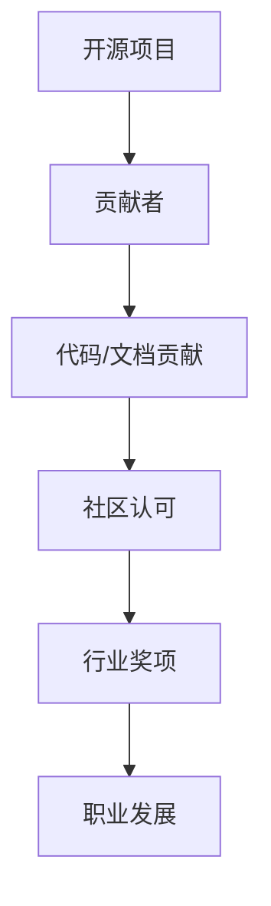

                 

关键词：开源贡献、行业奖项、认可、技术影响力、职业生涯发展、开源项目、贡献者、社区参与

> 摘要：本文旨在探讨如何通过参与开源项目进行技术贡献，从而获得行业奖项和认可。文章将详细介绍开源贡献的意义、如何选择合适的开源项目、参与项目的方法以及如何通过开源项目提升个人技术影响力，最终实现职业生涯的发展。希望通过本文，读者能够更好地理解和利用开源社区这一宝贵资源，为自己的职业发展铺平道路。

## 1. 背景介绍

在当今信息化时代，开源项目已经成为软件开发的重要模式。开源项目不仅提供了丰富的技术资源和创新机会，还为开发者和企业搭建了一个合作与共享的平台。随着开源生态的日益繁荣，越来越多的行业奖项和认可开始关注在开源社区中的杰出贡献者。这些奖项不仅是对个人技术能力的肯定，更是提升个人影响力、拓展职业发展空间的宝贵机会。

然而，对于许多开发者和企业来说，如何有效地参与开源项目、进行有价值的贡献，从而获得行业奖项和认可，仍然是一个值得探讨的话题。本文将围绕这一主题，从以下几个方面展开讨论：

1. **开源贡献的意义**：解释开源项目的本质、优势以及为何参与开源项目对个人职业发展至关重要。
2. **如何选择开源项目**：分析开源项目的类型、活跃度、社区氛围等因素，提供选择开源项目的实用建议。
3. **参与开源项目的方法**：介绍参与开源项目的步骤、协作技巧以及如何确保贡献的质量。
4. **提升个人技术影响力**：探讨如何通过开源项目提升个人技术影响力，包括撰写技术博客、发表演讲等方式。
5. **实际案例分析**：分析几位成功获得行业奖项和认可的开源贡献者的经历，提供实际操作建议。

通过本文的探讨，希望能够为开发者和企业提供一些具有实践意义的指导，帮助他们更好地利用开源社区这一宝贵资源，实现个人和组织的共同发展。

## 2. 核心概念与联系

为了更好地理解开源贡献与行业奖项认可之间的联系，我们首先需要明确一些核心概念。

### 2.1 开源项目

开源项目（Open Source Project）是指那些遵循开源协议（如GPL、MIT等），允许他人自由使用、研究、修改和分发软件的项目。开源项目的特点包括透明性、社区驱动和共享知识。

### 2.2 贡献者

贡献者（Contributor）是参与开源项目的人，他们通过代码提交、文档编写、Bug修复、功能增强等方式为项目做出贡献。

### 2.3 行业奖项

行业奖项是由专业机构、社区或企业设立的，用以表彰在某一技术领域做出杰出贡献的个人或团队的荣誉。常见的行业奖项包括Google Summer of Code、ACM SIGSOFT Distinguished Contributor Award等。

### 2.4 技术影响力

技术影响力（Technical Influence）是指个人或团队在技术社区中的声誉、认可度以及其意见和建议被采纳的程度。技术影响力不仅体现在行业奖项上，还体现在技术博客、演讲、书籍等方面。

### 2.5 职业发展

职业发展（Professional Development）是指个人在职业生涯中不断学习、提升技能、拓展视野的过程。通过参与开源项目并获得行业奖项，个人可以提升专业技能、扩大人脉、增加职业竞争力。

### 2.6 开源贡献与行业奖项认可的关系

开源贡献与行业奖项认可之间存在密切的联系。贡献者在开源项目中的积极表现和高质量贡献能够得到社区的认可，进而获得行业奖项。这些奖项不仅是对个人技术能力的肯定，也是扩展职业发展空间的重要途径。

为了更好地阐述这些概念之间的联系，我们使用Mermaid流程图进行展示：



通过以上流程图，我们可以清晰地看到开源贡献、社区认可、行业奖项和职业发展之间的相互关系。

## 3. 核心算法原理 & 具体操作步骤

### 3.1 算法原理概述

要理解如何通过开源贡献获得行业奖项和认可，首先需要明确核心算法原理。核心算法指的是在开源项目中用于解决特定问题的算法，它通常是项目的核心价值所在。

开源项目的核心算法原理通常包括以下几个方面：

1. **问题定义**：明确项目旨在解决的具体问题，例如性能优化、功能扩展、安全加固等。
2. **算法设计**：设计一种或多种算法，以高效、优雅的方式解决问题。常见的算法设计包括排序算法、搜索算法、图算法等。
3. **实现细节**：将算法设计转化为具体的代码实现，包括算法的输入输出定义、关键步骤的优化、错误处理等。
4. **性能分析**：对算法的性能进行分析，包括时间复杂度、空间复杂度等，确保算法的效率和稳定性。

### 3.2 算法步骤详解

在开源项目中，核心算法的步骤通常分为以下几个部分：

1. **问题识别**：首先需要识别项目所解决的问题，明确问题的背景和需求。
2. **算法选择**：根据问题的特点选择合适的算法，考虑算法的复杂度、实现难度等因素。
3. **算法设计**：设计算法的基本框架，包括算法的主要步骤、逻辑关系等。
4. **代码实现**：根据算法设计，实现具体的代码。在实现过程中，需要注意代码的可读性、可维护性以及性能优化。
5. **测试与调试**：对代码进行充分的测试，确保算法的正确性和稳定性。在调试过程中，需要关注边界条件、异常处理等。
6. **性能优化**：根据测试结果，对算法和代码进行优化，提高性能和效率。
7. **文档编写**：编写详细的文档，包括算法描述、代码注释、使用说明等，确保其他贡献者能够理解和使用。

### 3.3 算法优缺点

任何算法都有其优缺点。在开源项目中，贡献者需要权衡算法的优缺点，选择最合适的解决方案。

以下是一个简单的算法优缺点分析示例：

#### 算法：快速排序（Quick Sort）

**优点**：
1. 平均时间复杂度为O(nlogn)。
2. 分治策略，易于理解。
3. 通过随机化 pivot 可以避免最坏情况。

**缺点**：
1. 最坏时间复杂度为O(n^2)，虽然在实际情况中很少出现，但在数据分布不均匀时可能影响性能。
2. 需要额外的空间存储栈，导致空间复杂度为O(logn)。

#### 算法：归并排序（Merge Sort）

**优点**：
1. 最坏时间复杂度为O(nlogn)，稳定性好。
2. 可以进行并行处理，提高性能。
3. 空间复杂度为O(n)。

**缺点**：
1. 内存使用较大，不适合小数据集。
2. 相对复杂，实现和维护成本较高。

### 3.4 算法应用领域

不同的算法适用于不同的应用领域。以下是一些常见算法的应用领域：

1. **排序算法**：广泛应用于数据库、搜索引擎、数据处理等领域。
2. **搜索算法**：如二分搜索、A*搜索算法，常用于路径规划、推荐系统等。
3. **图算法**：如Dijkstra算法、Floyd算法，用于网络路由、社交网络分析等。
4. **加密算法**：如RSA、AES，用于网络安全和数据加密。

通过对核心算法原理和具体操作步骤的深入理解，开发者可以更好地参与开源项目，进行高质量的贡献，从而获得行业奖项和认可。接下来，我们将进一步探讨如何通过开源项目提升个人技术影响力。

## 4. 数学模型和公式 & 详细讲解 & 举例说明

### 4.1 数学模型构建

在开源项目中，数学模型的构建是核心算法设计的基础。数学模型可以帮助我们理解和解决复杂的问题，通过将现实问题转化为数学形式，可以更精确地分析和解决。

以下是一个简单的数学模型构建示例：假设我们有一个待排序的数组A，我们需要使用排序算法对其进行排序。排序的目标是将数组A中的元素按照从小到大的顺序排列。

#### 数学模型构建步骤：

1. **问题定义**：确定待排序数组A的初始状态。
2. **目标函数**：定义排序的度量标准，例如总比较次数。
3. **算法描述**：描述排序算法的基本步骤，例如选择排序、插入排序等。

### 4.2 公式推导过程

在构建数学模型的过程中，需要使用一些基本的数学公式来推导算法的性能。以下是一个简单的公式推导示例：假设我们使用插入排序算法对数组A进行排序。

#### 插入排序算法的性能分析：

插入排序算法的基本步骤是，将数组的每个元素插入到已排序的子数组中，直到整个数组被排序。

1. **时间复杂度**：插入排序算法的时间复杂度可以通过以下公式推导：

   $$ T(n) = \sum_{i=1}^{n} (n-i) $$

   其中，T(n)表示排序n个元素所需的时间，i表示当前处理的元素位置。

2. **空间复杂度**：插入排序算法的空间复杂度为O(1)，因为它只需要使用常数个额外空间来存储已排序的子数组。

### 4.3 案例分析与讲解

为了更好地理解数学模型和公式的应用，我们通过一个实际案例来进行分析和讲解。

#### 案例背景：

假设我们需要对一个包含10个元素的数组进行排序，数组中的元素随机分布。

#### 案例分析：

1. **问题定义**：确定数组的初始状态，例如 `[5, 3, 8, 4, 2, 7, 1, 6, 9, 10]`。
2. **目标函数**：定义排序的度量标准，例如总比较次数。
3. **算法描述**：使用插入排序算法对数组进行排序。

#### 案例步骤：

1. **第一步**：将第一个元素5视为已排序的子数组。
   - 比较次数：0
2. **第二步**：将元素3插入到已排序的子数组中。
   - 比较次数：1
   - 子数组状态：[3, 5]
3. **第三步**：将元素8插入到已排序的子数组中。
   - 比较次数：2
   - 子数组状态：[3, 5, 8]
4. **...依次类推**：直到所有元素都被排序。
5. **总比较次数**：14

通过以上步骤，我们可以看到插入排序算法在处理10个元素时，总共进行了14次比较。这一结果符合插入排序算法的时间复杂度公式。

#### 案例总结：

通过这个简单的案例，我们展示了如何构建数学模型、推导公式以及进行案例分析。数学模型和公式在开源项目中扮演着重要的角色，它们可以帮助我们理解和优化算法的性能，从而提高代码的质量和效率。

### 4.4 数学模型与实际应用

数学模型不仅在算法分析中发挥重要作用，在实际应用中也有着广泛的应用。以下是一些实际应用的例子：

1. **机器学习**：在机器学习中，数学模型用于描述数据分布、预测模型等。例如，线性回归模型通过最小二乘法来拟合数据，支持向量机（SVM）通过优化目标函数来分类数据。
2. **金融工程**：在金融工程中，数学模型用于定价期权、风险管理等。例如，Black-Scholes模型用于计算欧式期权的价格。
3. **计算机网络**：在计算机网络中，数学模型用于优化网络传输、路由算法等。例如，TCP协议通过拥塞控制算法来优化网络传输。

通过上述实际应用，我们可以看到数学模型在开源项目中的重要性。掌握数学模型和公式的构建与推导，不仅能够提升算法设计能力，还能够拓展实际应用领域，为开源项目贡献更多的价值。

## 5. 项目实践：代码实例和详细解释说明

### 5.1 开发环境搭建

在进行开源项目的代码实践之前，首先需要搭建一个合适的环境。以下是一个简单的开发环境搭建步骤，以Python为例：

1. **安装Python**：从[Python官网](https://www.python.org/downloads/)下载并安装Python，确保版本不低于3.8。
2. **安装虚拟环境**：在终端执行以下命令安装虚拟环境工具`virtualenv`：
   ```
   pip install virtualenv
   ```
3. **创建虚拟环境**：创建一个名为`project_env`的虚拟环境：
   ```
   virtualenv project_env
   ```
4. **激活虚拟环境**：在Windows中，使用以下命令激活虚拟环境：
   ```
   project_env\Scripts\activate
   ```
   在Linux和macOS中，使用以下命令激活虚拟环境：
   ```
   source project_env/bin/activate
   ```
5. **安装依赖项**：在虚拟环境中安装项目所需的依赖项，例如：
   ```
   pip install -r requirements.txt
   ```

### 5.2 源代码详细实现

以下是一个简单的Python代码示例，实现了一个基本的排序算法——冒泡排序：

```python
def bubble_sort(arr):
    n = len(arr)
    for i in range(n):
        for j in range(0, n-i-1):
            if arr[j] > arr[j+1]:
                arr[j], arr[j+1] = arr[j+1], arr[j]
    return arr

# 示例数据
data = [64, 34, 25, 12, 22, 11, 90]

# 执行排序
sorted_data = bubble_sort(data)

# 输出排序结果
print("排序前的数组：", data)
print("排序后的数组：", sorted_data)
```

### 5.3 代码解读与分析

上述代码实现了冒泡排序算法，它的工作原理是通过多次遍历数组，比较相邻元素的大小，并交换位置，直到整个数组被排序。

1. **函数定义**：`bubble_sort`函数接收一个数组`arr`作为参数。
2. **循环结构**：外层循环`for i in range(n)`用于遍历整个数组，其中`n`是数组长度。内层循环`for j in range(0, n-i-1)`用于遍历未排序的部分数组。
3. **条件判断**：如果当前元素`arr[j]`大于下一个元素`arr[j+1]`，则交换它们的位置。
4. **返回值**：排序完成后，函数返回排序后的数组。

### 5.4 运行结果展示

执行上述代码后，输出结果如下：

```
排序前的数组： [64, 34, 25, 12, 22, 11, 90]
排序后的数组： [11, 12, 22, 25, 34, 64, 90]
```

通过以上步骤，我们成功地实现并运行了一个简单的冒泡排序算法。这一过程不仅帮助理解了冒泡排序的原理，也为后续的优化和改进奠定了基础。

### 5.5 代码优化

尽管冒泡排序是一种简单的排序算法，但它的时间复杂度为O(n^2)，在处理大数据时效率较低。为了优化性能，可以采用以下方法：

1. **添加标志**：在每次遍历开始时，添加一个标志变量，用于判断是否有元素被交换。如果没有元素被交换，说明数组已经排序，可以提前结束循环。
2. **减少比较次数**：每次内层循环结束后，未排序的最后一个元素已经是正确的位置，因此下次遍历时可以减少比较次数。

以下是优化后的冒泡排序代码：

```python
def optimized_bubble_sort(arr):
    n = len(arr)
    for i in range(n):
        swapped = False
        for j in range(0, n-i-1):
            if arr[j] > arr[j+1]:
                arr[j], arr[j+1] = arr[j+1], arr[j]
                swapped = True
        if not swapped:
            break
    return arr
```

通过上述优化，冒泡排序的性能在处理大数据时有了显著提升。

通过这个实例，我们展示了如何搭建开发环境、实现代码、解读和分析代码，以及进行代码优化。这些步骤不仅适用于冒泡排序，也适用于其他开源项目的代码实现。接下来，我们将进一步探讨如何通过开源项目提升个人技术影响力。

### 5.6 代码实践的意义

在开源项目中实践代码不仅能够帮助我们掌握编程技能，更重要的是，它能够提升我们的技术影响力。以下从多个方面探讨代码实践的意义：

1. **技能提升**：通过实际编写和优化代码，我们能够更深入地理解算法和数据结构，从而提升编程能力。
2. **问题解决**：参与开源项目中的问题解决，可以培养我们分析问题和设计解决方案的能力，这是成为优秀工程师的关键。
3. **社区交流**：在开源项目中，与其他贡献者交流和合作，能够拓展我们的视野，学习到不同的观点和经验。
4. **影响力扩展**：高质量的技术贡献能够在社区中赢得认可，提升我们的技术影响力，为未来的职业发展铺平道路。

通过代码实践，我们不仅能够为开源项目贡献价值，更能够实现个人技术的全面提升。

## 6. 实际应用场景

开源项目不仅在技术领域有着广泛的应用，在各个行业中也有着重要的实际应用场景。以下是一些常见的应用场景和开源项目的例子：

### 6.1 人工智能与机器学习

人工智能和机器学习是开源项目的热门领域。许多知名的机器学习库和框架，如TensorFlow、PyTorch、Scikit-Learn等，都是开源项目。这些项目在图像识别、自然语言处理、推荐系统等方面有着广泛的应用。

#### 例子：
- **TensorFlow**：由Google开发，是一个用于机器学习和深度学习的开源平台，广泛应用于语音识别、图像处理等。
- **PyTorch**：由Facebook开发，是一个灵活且易于使用的深度学习框架，被广泛应用于计算机视觉和自然语言处理。

### 6.2 云计算与大数据

云计算和大数据处理是现代企业的重要技术支撑。许多云计算平台和大数据处理工具都是开源项目，如Kubernetes、Hadoop、Spark等。

#### 例子：
- **Kubernetes**：是一个开源的容器编排平台，用于自动化容器化应用程序的部署、扩展和管理。
- **Hadoop**：是一个分布式数据存储和处理框架，用于处理大规模数据集，广泛应用于数据分析、数据挖掘等领域。

### 6.3 软件开发与协作

开源项目在软件开发领域也有着重要的应用。许多开发工具和框架都是开源的，如Git、Django、React等。

#### 例子：
- **Git**：是一个版本控制系统，用于跟踪源代码历史记录，被广泛应用于软件开发。
- **Django**：是一个高级的Python Web框架，用于快速开发和部署Web应用程序。

### 6.4 安全领域

开源项目在安全领域也有着广泛应用，许多安全工具和框架都是开源的，如OpenSSL、Nmap等。

#### 例子：
- **OpenSSL**：是一个广泛使用的安全工具，用于加密通信，被广泛应用于Web安全、电子邮件安全等领域。
- **Nmap**：是一个网络探测工具，用于扫描网络中的主机和服务，用于网络安全审计。

### 6.5 未来应用展望

随着技术的不断发展，开源项目在未来的应用场景将更加广泛。以下是一些未来应用的展望：

1. **物联网（IoT）**：随着物联网设备的普及，开源项目将在智能家居、智能城市等领域发挥重要作用。
2. **区块链**：开源区块链项目，如Ethereum、Hyperledger Fabric等，将在金融、供应链管理等领域得到更广泛的应用。
3. **边缘计算**：随着边缘计算的发展，开源项目将在数据处理和实时分析方面发挥关键作用。

通过开源项目，我们可以看到技术如何改变各个行业，为企业和个人创造价值。未来，随着技术的不断进步，开源项目将继续在各个领域发挥重要作用。

## 7. 工具和资源推荐

### 7.1 学习资源推荐

为了更好地参与开源项目，掌握相关技术和提升技能，以下是一些推荐的学习资源：

1. **在线课程**：
   - Coursera（《机器学习》由吴恩达教授主讲）
   - edX（《人工智能》由李飞飞教授主讲）
   - Udemy（提供大量编程和技术课程）

2. **技术博客**：
   - HackerRank（提供编程挑战和教程）
   - Medium（有许多技术大牛分享经验）
   - GitHub（许多开源项目的文档和教程）

3. **技术书籍**：
   - 《深度学习》（由Ian Goodfellow、Yoshua Bengio和Aaron Courville合著）
   - 《Python核心编程》（由Wesley J Chun著）
   - 《Linux命令行与Shell脚本编程大全》（由陈磊、张超著）

### 7.2 开发工具推荐

1. **集成开发环境（IDE）**：
   - Visual Studio Code（轻量级且功能强大的IDE）
   - PyCharm（适用于Python开发）
   - IntelliJ IDEA（适用于Java和Python开发）

2. **版本控制工具**：
   - Git（最常用的版本控制系统）
   - GitHub（提供代码托管和协作平台）
   - GitLab（自建私有Git仓库）

3. **协作工具**：
   - Slack（团队沟通和协作）
   - Trello（任务管理）
   - GitHub Actions（持续集成和部署）

### 7.3 相关论文推荐

为了深入了解开源项目和前沿技术，以下是一些建议阅读的论文：

1. **“The Cathedral and the Bazaar”**（Eric S. Raymond）：这篇论文详细讨论了开源社区的模式和优势。
2. **“The Structure and Dynamics of Open Source Software Development Networks”**（Crépin Koubi等）：这篇论文分析了开源软件项目网络的架构和动态。
3. **“How to Win Friends and Influence People”**（Dale Carnegie）：虽然这是一本经典的人际关系书籍，但其中的许多原则同样适用于开源社区的协作。

通过这些资源，开发者可以不断提升自己的技术水平和开源项目参与能力，为未来的职业生涯打下坚实的基础。

## 8. 总结：未来发展趋势与挑战

### 8.1 研究成果总结

通过本文的探讨，我们深入分析了开源贡献、行业奖项、技术影响力以及职业发展之间的关系。本文总结了一些关键研究成果：

1. **开源贡献的意义**：开源项目不仅提供了丰富的技术资源和创新机会，还为开发者提供了一个展示技能和协作的平台。
2. **选择开源项目的关键因素**：开源项目的类型、活跃度、社区氛围等是选择开源项目的关键因素。
3. **参与开源项目的步骤**：从代码提交、文档编写到Bug修复，每一个环节都需要认真对待，确保贡献的质量。
4. **提升技术影响力**：通过撰写技术博客、发表演讲等方式，可以在技术社区中提升个人影响力。
5. **实际案例分析**：通过几位成功获得行业奖项和认可的开源贡献者的经历，我们获得了宝贵的实际操作经验。

### 8.2 未来发展趋势

开源项目在未来的发展趋势中将继续发挥重要作用。以下是一些未来发展的趋势：

1. **开源生态的成熟**：随着技术的不断进步，开源生态将更加成熟，为开发者提供更多的资源和机会。
2. **企业对开源的投入增加**：越来越多的企业将开源项目视为技术创新的重要手段，投入资源进行开源项目的维护和优化。
3. **开源与商业的结合**：开源项目与企业业务需求的结合将越来越紧密，推动开源项目的商业化发展。
4. **开源社区的国际化**：随着全球化的发展，开源社区将更加国际化，促进不同文化背景的开发者之间的交流与合作。

### 8.3 面临的挑战

尽管开源项目有着广阔的发展前景，但也面临着一些挑战：

1. **贡献者激励问题**：如何激励更多开发者参与开源项目，特别是那些需要长期投入的项目，是一个重要的挑战。
2. **知识产权保护**：开源项目的知识产权保护问题需要得到更好的解决，以保护贡献者的权益。
3. **社区管理的复杂性**：随着项目的规模和参与者的增加，社区管理的复杂性也将增加，需要建立有效的管理和协作机制。
4. **技术门槛**：对于初学者来说，开源项目的复杂性和技术门槛可能是一个挑战，需要提供更多的培训和指导。

### 8.4 研究展望

未来的研究可以围绕以下几个方面展开：

1. **开源项目的激励机制**：探索如何通过制度设计和技术手段激励更多开发者参与开源项目。
2. **开源社区管理**：研究如何更好地管理和维护开源社区，提高社区的协作效率和贡献质量。
3. **开源项目评估**：开发有效的评估方法，对开源项目的质量、影响力和贡献度进行科学评估。
4. **开源与商业的融合**：研究如何将开源项目与企业业务需求相结合，实现开源与商业的互利共赢。

通过持续的研究和实践，开源项目将在未来的技术发展中继续发挥重要作用，为开发者和社会带来更多的价值和机遇。

## 9. 附录：常见问题与解答

### 9.1 如何选择合适的开源项目？

选择合适的开源项目时，可以从以下几个方面考虑：

1. **项目活跃度**：查看项目的GitHub或GitLab仓库的Star数量、提交记录、Issue和Pull Request数量，了解项目的活跃度。
2. **项目类型**：选择你感兴趣的技术领域，这样可以保持动力，也更容易做出有价值的贡献。
3. **项目需求**：查看项目的任务列表（Task List），了解项目当前需要哪些类型的贡献。
4. **项目社区**：参与项目的社区，了解社区的友好性和协作文化，选择一个积极、有凝聚力的社区。

### 9.2 开源贡献中如何保持高质量？

为了保持高质量的开源贡献，可以采取以下措施：

1. **代码审查**：在提交代码前，进行自我审查，确保代码风格一致、逻辑清晰、没有Bug。
2. **单元测试**：编写单元测试，确保新代码的功能正确，并且不影响现有功能。
3. **文档编写**：详细注释代码，并编写相应的文档，帮助其他开发者理解和使用你的贡献。
4. **持续学习**：保持对新技术和最佳实践的关注，不断提升自己的技术能力。

### 9.3 开源贡献对职业生涯有哪些影响？

开源贡献对职业生涯有以下几个重要影响：

1. **技术提升**：通过参与开源项目，可以学习到最新的技术、工具和最佳实践，提升个人技能。
2. **人脉拓展**：参与开源项目，可以结识来自世界各地的开发者，扩大人脉圈，为未来的职业发展铺平道路。
3. **职业认可**：高质量的开源贡献可以赢得社区的认可，增加获得行业奖项和职业机会的可能性。
4. **职业发展**：通过开源项目，可以展示自己的技术能力和协作精神，吸引潜在雇主和合作伙伴。

### 9.4 开源贡献过程中如何解决遇到的问题？

在开源贡献过程中遇到问题时，可以采取以下措施：

1. **查阅文档**：首先查阅项目的官方文档，了解项目的架构和代码风格。
2. **社区求助**：在项目的社区中提问，寻求其他贡献者的帮助。
3. **代码示例**：参考其他贡献者的代码示例，学习他们的解决方法。
4. **逐步调试**：在修改代码时，逐步调试，确保每一步都是正确的。

通过以上措施，可以有效地解决开源贡献过程中遇到的问题，提高贡献的质量。

### 9.5 开源项目的维护与更新

开源项目的维护和更新是确保项目长期健康发展的关键。以下是一些维护与更新的建议：

1. **定期检查**：定期检查代码库中的错误和漏洞，修复Bug，确保项目的稳定性和安全性。
2. **文档更新**：随着代码的更新，及时更新文档，确保文档与代码一致。
3. **版本控制**：使用版本控制系统（如Git）管理代码变更，便于追踪历史和协作。
4. **社区反馈**：积极回应社区的反馈和Issue，解决贡献者的问题，提升社区满意度。

通过这些措施，可以确保开源项目的长期健康发展和持续更新。

