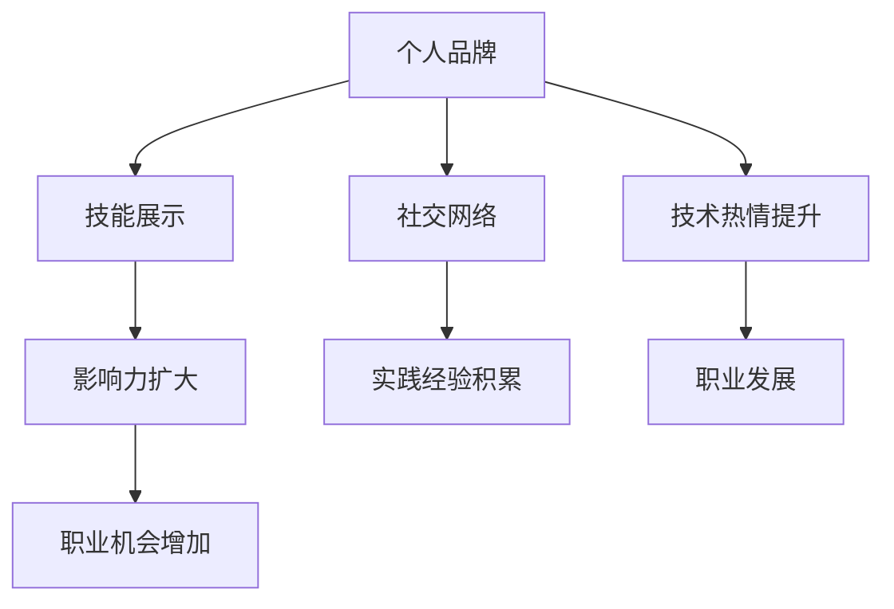
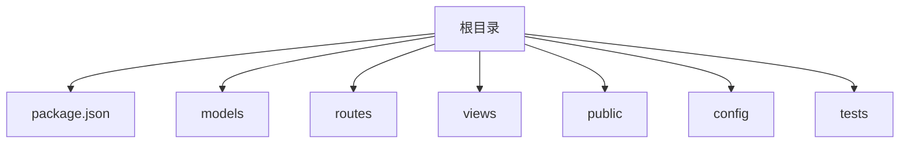

                 

关键词：个人品牌、开源项目、技术博客、社交媒体、知识共享、影响力、持续学习

> 摘要：在当今数字化时代，个人品牌的重要性日益凸显。作为一名技术专家，如何通过参与开源项目来打造和提升个人品牌？本文将探讨如何利用开源项目进行个人品牌建设，分享一些实用的策略和技巧，帮助您在技术领域脱颖而出。

## 1. 背景介绍

在信息技术飞速发展的今天，个人品牌已经成为职业发展中不可或缺的一部分。在互联网的世界里，个人品牌不仅能够帮助您在同行中脱颖而出，还能为您带来更多的职业机会和社交资源。开源项目作为知识共享的重要平台，为技术爱好者提供了学习和成长的土壤。参与开源项目不仅能提升技术水平，还能扩大您的影响力，从而帮助打造个人品牌。

本文将围绕以下几个方面展开讨论：

1. 开源项目对个人品牌建设的重要性。
2. 如何选择适合的开源项目参与。
3. 参与开源项目时应注意的事项。
4. 如何利用开源项目进行个人品牌宣传。
5. 开源项目与职业发展的结合。

通过阅读本文，您将了解如何通过开源项目这个平台，打造和提升个人品牌，实现职业发展的新高度。

## 2. 核心概念与联系

### 2.1 开源项目的定义

开源项目是指那些提供源代码，允许用户查看、修改和分发的软件项目。这类项目通常遵循某种开源许可证，如GPL、Apache等，确保项目的透明性和可扩展性。

### 2.2 个人品牌的定义

个人品牌是指个人在公众面前的形象和声誉，包括专业技能、个人特质、职业成就等。个人品牌有助于提升个人在职场中的竞争力，扩大社交圈，增加职业机会。

### 2.3 开源项目与个人品牌建设的关系

开源项目提供了一个展示个人技术能力和贡献的平台。通过参与开源项目，您可以：

- 展示您的技术能力，吸引潜在雇主和合作伙伴。
- 建立专业网络，与同行业专家互动。
- 提升代码质量和项目管理能力。
- 为职业生涯积累宝贵的实践经验。
- 增强对技术的热情和求知欲。

### 2.4 Mermaid 流程图



通过上述流程图，我们可以看出开源项目如何通过多个环节帮助个人品牌建设。

## 3. 核心算法原理 & 具体操作步骤

### 3.1 算法原理概述

在开源项目中，个人品牌建设可以类比于一种“算法”，其核心原理是通过持续的贡献和互动，逐步提升个人的知名度和影响力。这个算法主要包括以下几个步骤：

1. **选择合适的开源项目**：找到与您专业领域相关的项目，并确保项目有足够的影响力和活跃度。
2. **积极参与项目**：通过提交代码、修复bug、优化文档等方式，为项目做出实际贡献。
3. **建立良好的人际关系**：与其他贡献者保持良好的沟通和合作，建立专业网络。
4. **展示个人专业技能**：在贡献过程中，尽可能多地展示您的专业技能和解决方案。
5. **持续学习和成长**：不断学习新技术，提升自己的专业能力，为项目带来更多的价值。

### 3.2 算法步骤详解

#### 3.2.1 选择合适的开源项目

选择适合您的开源项目是成功的关键。以下是一些建议：

- **与专业领域相关**：选择与您专业背景相关的项目，这样您能更快地理解项目的需求和挑战。
- **项目活跃度**：查看项目的活跃度，如GitHub上的Issue和Pull Request数量，确保项目有足够的影响力。
- **社区规模**：参与一个有规模的社区，这样您有机会结识更多专业人士。
- **项目愿景**：了解项目的愿景和目标，确保您与项目的方向一致。

#### 3.2.2 积极参与项目

参与开源项目可以通过以下几种方式：

- **提交代码**：修复bug、添加新功能、优化现有代码。
- **修复文档**：更新项目文档，确保它们清晰、准确。
- **参与讨论**：在GitHub等平台上，参与项目讨论，为其他贡献者提供帮助。
- **组织活动**：参与或组织项目相关的会议、研讨会等，提升项目的知名度。

#### 3.2.3 建立良好的人际关系

在开源项目中，人际关系非常重要。以下是一些建议：

- **尊重他人**：保持尊重和礼貌，即使与他人意见不同，也要以建设性的方式沟通。
- **积极参与**：主动参与项目讨论，分享您的观点和经验。
- **帮助他人**：在他人需要帮助时，提供支持，建立信任关系。
- **建立联系**：与其他贡献者保持联系，扩大您的社交网络。

#### 3.2.4 展示个人专业技能

在开源项目中，您可以通过以下方式展示个人专业技能：

- **高质量的代码**：编写清晰、优雅、高效的代码，展示您的编程能力。
- **详细的注释**：为代码添加详细的注释，说明设计思路和实现细节。
- **解决方案的创新性**：提出创新性的解决方案，展示您的技术视野。
- **分享经验**：在项目文档、博客或社交媒体上分享您的经验，提升个人影响力。

#### 3.2.5 持续学习和成长

开源项目是一个不断学习和成长的过程。以下是一些建议：

- **跟进新技术**：关注行业动态，学习新技术，不断提升自己的技能。
- **参与培训**：参加相关的培训课程，提高自己的专业能力。
- **反思和总结**：定期反思自己的贡献，总结经验教训，持续改进。

### 3.3 算法优缺点

#### 优点

- **提升技能**：通过参与开源项目，您可以学习到新的技术和工具，提升自己的技能。
- **建立影响力**：开源项目提供了一个展示个人能力和价值的平台，有助于建立个人品牌。
- **扩大社交圈**：参与开源项目可以结识来自世界各地的专业人士，扩大您的社交圈。
- **实践经验**：参与开源项目可以帮助您积累宝贵的实践经验，为职业生涯打下坚实基础。

#### 缺点

- **时间投入**：参与开源项目需要投入大量时间和精力，可能会影响您的工作和生活。
- **不确定性**：开源项目的结果和反馈具有不确定性，有时可能会面临挫折和失败。
- **竞争压力**：开源项目中有很多优秀的贡献者，竞争压力较大。

### 3.4 算法应用领域

开源项目的算法原理和具体操作步骤适用于以下领域：

- **软件开发**：参与开源软件项目，提升编程技能和项目管理能力。
- **人工智能**：参与人工智能开源项目，学习最新的AI技术和应用。
- **数据分析**：参与数据分析开源项目，提升数据分析和处理能力。
- **云计算**：参与云计算开源项目，学习云计算技术和架构。
- **网络安全**：参与网络安全开源项目，提升网络安全防护能力。

## 4. 数学模型和公式 & 详细讲解 & 举例说明

### 4.1 数学模型构建

在开源项目个人品牌建设中，我们可以构建一个简单的数学模型来量化个人品牌的提升过程。模型包括以下几个变量：

- **B0**：初始品牌影响力
- **C**：持续贡献度
- **T**：时间变量
- **I**：互动强度

个人品牌提升的数学模型可以表示为：

\[ B(T) = B0 + C \times T \times I \]

其中，\( B0 \) 代表初始品牌影响力，\( C \) 代表持续贡献度，\( T \) 代表时间变量，\( I \) 代表互动强度。这个模型表明，个人品牌建设是一个持续的过程，通过持续的贡献和互动，个人品牌会逐渐提升。

### 4.2 公式推导过程

为了推导这个数学模型，我们首先需要定义几个基本概念：

- **贡献度 (C)**：个人在开源项目中的贡献程度，可以通过提交的代码量、修复的bug数量、文档贡献等来衡量。
- **时间变量 (T)**：个人在开源项目中的参与时间，可以按照月份或年份来计算。
- **互动强度 (I)**：个人在项目中的互动程度，包括参与项目讨论、回答问题、组织活动等。

基于以上概念，我们可以推导出以下公式：

\[ B(T) = B0 + C \times T \times I \]

其中，\( B0 \) 可以通过个人在开源项目开始时的知名度来估计，通常是一个较小的常数。

### 4.3 案例分析与讲解

为了更好地理解这个数学模型，我们可以通过一个具体的案例来进行分析。

假设某人初始品牌影响力 \( B0 \) 为10，每月的贡献度 \( C \) 为20，每月的互动强度 \( I \) 为0.8。根据上述公式，我们可以计算出他一年后的品牌影响力 \( B(12) \)：

\[ B(12) = 10 + 20 \times 12 \times 0.8 = 10 + 192 = 202 \]

这意味着，经过一年的持续贡献和互动，该人的品牌影响力将从10提升到202。

### 4.4 模型应用与展望

这个数学模型不仅帮助我们理解了个人品牌建设的量化过程，还可以用于实际应用和预测。例如，我们可以通过调整贡献度、时间和互动强度，来优化个人品牌建设的策略。

此外，这个模型还可以扩展到更复杂的场景，如考虑个人品牌的影响范围、特定领域的专业度等。通过这些扩展，我们可以更准确地预测个人品牌建设的趋势和效果。

总之，数学模型为我们提供了量化个人品牌建设的工具，有助于我们在实践中进行科学的决策和优化。

## 5. 项目实践：代码实例和详细解释说明

### 5.1 开发环境搭建

要参与开源项目，首先需要搭建一个合适的开发环境。以下是搭建开发环境的基本步骤：

1. **安装Git**：Git是版本控制工具，用于管理代码仓库。您可以在[Git官网](https://git-scm.com/)下载并安装Git。
2. **安装编辑器**：选择一款适合您的代码编辑器，如Visual Studio Code、Sublime Text等。这些编辑器提供了丰富的插件和功能，方便代码编写。
3. **配置SSH密钥**：为了方便与GitHub等平台进行身份验证，您需要生成SSH密钥。执行以下命令生成SSH密钥：

```bash
ssh-keygen -t rsa -b 4096 -C "your_email@example.com"
```

将生成的SSH密钥添加到GitHub的账户设置中。
4. **克隆开源项目**：找到您感兴趣的开源项目，使用Git命令克隆项目到本地：

```bash
git clone https://github.com/your-username/your-project.git
```

### 5.2 源代码详细实现

接下来，我们将以一个简单的开源项目为例，详细讲解代码实现过程。

假设我们选择了一个名为“TechBlog”的博客项目。该项目基于Node.js和Express框架构建。

1. **项目结构**：首先，我们了解项目的基本结构：



2. **初始化项目**：进入项目目录，初始化npm依赖：

```bash
npm init -y
```

3. **安装依赖**：安装项目所需的依赖：

```bash
npm install express mongoose body-parser ejs
```

4. **创建模型**：在“models”目录下创建“User.js”模型，定义用户数据结构：

```javascript
const mongoose = require('mongoose');

const UserSchema = new mongoose.Schema({
  username: {
    type: String,
    required: true,
    unique: true
  },
  email: {
    type: String,
    required: true,
    unique: true
  },
  password: {
    type: String,
    required: true
  }
});

module.exports = mongoose.model('User', UserSchema);
```

5. **创建路由**：在“routes”目录下创建“users.js”路由文件，定义用户相关的路由：

```javascript
const express = require('express');
const router = express.Router();
const UserController = require('../controllers/UserController');

router.post('/register', UserController.register);
router.post('/login', UserController.login);

module.exports = router;
```

6. **创建控制器**：在“controllers”目录下创建“UserController.js”文件，编写用户注册和登录的逻辑：

```javascript
const User = require('../models/User');
const bcrypt = require('bcrypt');

exports.register = async (req, res) => {
  try {
    const { username, email, password } = req.body;
    const hashedPassword = await bcrypt.hash(password, 10);
    const user = new User({ username, email, password: hashedPassword });
    await user.save();
    res.status(201).json({ message: 'User registered successfully' });
  } catch (error) {
    res.status(500).json({ message: 'Error registering user' });
  }
};

exports.login = async (req, res) => {
  try {
    const { email, password } = req.body;
    const user = await User.findOne({ email });
    if (!user || !(await bcrypt.compare(password, user.password))) {
      return res.status(401).json({ message: 'Invalid credentials' });
    }
    res.status(200).json({ message: 'User logged in successfully' });
  } catch (error) {
    res.status(500).json({ message: 'Error logging in user' });
  }
};
```

7. **配置服务器**：在“config”目录下创建“config.js”文件，配置项目的基本设置：

```javascript
const dotenv = require('dotenv');

dotenv.config();
const PORT = process.env.PORT || 3000;

module.exports = { PORT };
```

8. **启动服务器**：在“app.js”文件中，引入所有依赖并启动服务器：

```javascript
const express = require('express');
const mongoose = require('mongoose');
const dotenv = require('dotenv');
const userRoutes = require('./routes/users');

dotenv.config();

const app = express();

app.use(express.json());
app.use('/users', userRoutes);

mongoose.connect(process.env.MONGODB_URI, { useNewUrlParser: true, useUnifiedTopology: true })
  .then(() => {
    console.log('Connected to MongoDB');
    app.listen(process.env.PORT, () => {
      console.log(`Server is running on port ${process.env.PORT}`);
    });
  })
  .catch(err => console.error('Could not connect to MongoDB', err));
```

### 5.3 代码解读与分析

在上述代码实例中，我们创建了一个简单的博客项目，包括用户注册和登录功能。以下是对关键代码的解读与分析：

1. **用户模型 (User.js)**：该模型定义了用户的数据结构，包括用户名、邮箱和密码。使用Mongoose作为O

