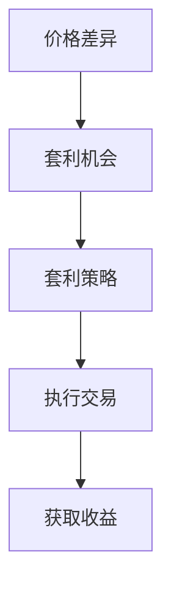

                 

关键词：加密货币、套利、算法、技术、交易、数学模型

摘要：本文将探讨如何利用技术优势进行加密货币套利。通过对套利策略的深入分析，结合实际案例，我们将展示如何运用数学模型和算法来捕捉市场中的价格差异，从而实现盈利。同时，文章还将讨论套利在实际应用场景中的挑战和未来发展趋势。

## 1. 背景介绍

加密货币市场近年来经历了显著的增长，吸引了大量投资者的关注。市场的波动性和流动性使得套利成为一种潜在的机会。套利是指利用不同市场之间的价格差异，通过同时买入和卖出资产来获取无风险收益。

然而，加密货币市场的特性使得套利变得复杂。市场的快速变化、信息的不对称性和交易成本等因素都会影响套利的成功。因此，要想在加密货币市场中成功套利，需要利用先进的技术手段和算法来捕捉价格差异，并有效地执行交易。

## 2. 核心概念与联系

在探讨加密货币套利之前，我们需要了解一些核心概念，包括价格差异、套利机会和套利策略。

### 2.1 价格差异

价格差异是指在同一资产在不同市场或交易平台上的价格差异。这种差异可能由于流动性、交易费用、信息不对称或其他市场因素造成。

### 2.2 套利机会

套利机会是指当某个资产在两个市场或交易平台上存在价格差异时，投资者可以通过在同一时间买入低价市场并卖出高价市场来获取无风险收益。

### 2.3 套利策略

套利策略是指投资者为捕捉价格差异并实现套利收益所采用的具体方法。常见的套利策略包括跨市场套利、跨交易平台套利和跨品种套利等。

以下是套利核心概念的 Mermaid 流程图：



## 3. 核心算法原理 & 具体操作步骤

### 3.1 算法原理概述

加密货币套利的核心在于捕捉市场中的价格差异，并迅速执行交易。这一过程通常涉及以下几个步骤：

1. 数据采集：收集加密货币在不同市场或交易平台的价格数据。
2. 数据处理：对收集到的数据进行处理，包括数据清洗、去重和异常值处理等。
3. 价格差异检测：比较不同市场的价格，识别出存在价格差异的资产。
4. 执行交易：根据价格差异进行买入和卖出操作。
5. 盈亏计算：计算每次交易的盈亏情况。

### 3.2 算法步骤详解

#### 3.2.1 数据采集

数据采集是套利策略的基础。我们需要从多个市场或交易平台获取加密货币的价格数据。这可以通过API接口或手动下载数据来实现。

#### 3.2.2 数据处理

数据处理包括以下步骤：

- 数据清洗：去除无效数据、错误数据等。
- 数据去重：去除重复数据，确保数据唯一性。
- 异常值处理：对异常数据进行处理，确保数据质量。

#### 3.2.3 价格差异检测

价格差异检测是套利的核心步骤。我们需要比较不同市场的价格，识别出存在价格差异的资产。这可以通过编写算法来实现，例如使用统计学方法或机器学习方法。

#### 3.2.4 执行交易

在识别出价格差异后，我们需要迅速执行交易。这通常需要使用交易API来实现。我们需要考虑交易费用、滑点等因素，以确保交易能够盈利。

#### 3.2.5 盈亏计算

每次交易完成后，我们需要计算盈亏情况。这可以通过简单的数学计算来实现。我们需要记录每次交易的收益，并计算总盈亏。

### 3.3 算法优缺点

#### 优点

- 高效：利用算法可以快速识别价格差异并执行交易。
- 自动化：算法可以自动化执行交易，降低人为错误。
- 扩大盈利：通过同时进行多个市场的交易，可以扩大盈利潜力。

#### 缺点

- 交易费用：交易费用可能会降低套利的收益。
- 滑点：市场价格波动可能导致实际交易价格与预期价格不同，影响套利收益。
- 市场风险：加密货币市场波动性大，套利策略可能面临市场风险。

### 3.4 算法应用领域

加密货币套利算法可以应用于以下领域：

- 跨市场套利：在不同市场之间捕捉价格差异。
- 跨交易平台套利：在同一市场内不同交易平台之间捕捉价格差异。
- 跨品种套利：在不同品种的加密货币之间捕捉价格差异。

## 4. 数学模型和公式 & 详细讲解 & 举例说明

### 4.1 数学模型构建

加密货币套利的数学模型主要涉及以下几个方面：

- 价格差异计算：计算不同市场之间的价格差异。
- 盈亏计算：计算每次交易的盈亏。
- 风险评估：评估套利策略面临的市场风险。

以下是套利数学模型的具体公式：

#### 价格差异计算

$$
\Delta P = P_A - P_B
$$

其中，$\Delta P$表示价格差异，$P_A$和$P_B$分别表示两个市场的价格。

#### 盈亏计算

$$
\text{Profit} = \Delta P \times Q \times (1 - \text{Fees})
$$

其中，$\text{Profit}$表示盈亏，$\Delta P$表示价格差异，$Q$表示交易量，$\text{Fees}$表示交易费用。

#### 风险评估

$$
\text{Risk} = \text{Max}(\text{Loss}) / \text{Expected \text{Profit}}
$$

其中，$\text{Risk}$表示风险，$\text{Max}(\text{Loss})$表示最大损失，$\text{Expected \text{Profit}}$表示预期收益。

### 4.2 公式推导过程

以下是套利公式的推导过程：

#### 价格差异计算

价格差异是套利的基础。假设我们有两个市场A和B，市场A的价格为$P_A$，市场B的价格为$P_B$。价格差异$\Delta P$可以表示为：

$$
\Delta P = P_A - P_B
$$

#### 盈亏计算

假设我们以价格$P_B$在市场B买入资产，并以价格$P_A$在市场A卖出资产。每次交易的盈亏$\text{Profit}$可以表示为：

$$
\text{Profit} = (\Delta P) \times Q \times (1 - \text{Fees})
$$

其中，$Q$表示交易量，$\text{Fees}$表示交易费用。

#### 风险评估

风险评估是衡量套利策略风险的重要指标。我们考虑最大损失$\text{Max}(\text{Loss})$和预期收益$\text{Expected \text{Profit}}$，风险评估$\text{Risk}$可以表示为：

$$
\text{Risk} = \text{Max}(\text{Loss}) / \text{Expected \text{Profit}}
$$

### 4.3 案例分析与讲解

假设我们有两个市场A和B，市场A的价格为$P_A = \$1000$，市场B的价格为$P_B = \$990$。交易费用为$0.1\%$。

#### 价格差异计算

$$
\Delta P = P_A - P_B = \$1000 - \$990 = \$10
$$

#### 盈亏计算

假设我们以$Q = 1$个单位在市场B买入资产，并以市场A卖出。交易费用为$0.1\%$，每次交易的盈亏为：

$$
\text{Profit} = (\Delta P) \times Q \times (1 - \text{Fees}) = \$10 \times 1 \times (1 - 0.001) = \$9.99
$$

#### 风险评估

假设我们进行100次这样的交易，预期收益为：

$$
\text{Expected \text{Profit}} = 100 \times \$9.99 = \$999
$$

最大损失可能发生在市场价格突然发生变化时。假设市场价格下降到$P_A = \$950$，最大损失为：

$$
\text{Max}(\text{Loss}) = Q \times (\Delta P + \text{Fees}) = 1 \times (\$10 + 0.1\%) = \$10.1
$$

风险评估为：

$$
\text{Risk} = \text{Max}(\text{Loss}) / \text{Expected \text{Profit}} = \$10.1 / \$999 = 0.0101
$$

这意味着每次交易的风险相对较低。

## 5. 项目实践：代码实例和详细解释说明

### 5.1 开发环境搭建

在开始编写套利算法之前，我们需要搭建一个合适的开发环境。以下是搭建开发环境的基本步骤：

1. 安装Python环境：Python是一种广泛使用的编程语言，适合编写套利算法。可以从[Python官网](https://www.python.org/)下载并安装Python。
2. 安装相关库：安装用于数据采集、数据处理和交易API的库。例如，可以使用`requests`库进行API请求，使用`pandas`库进行数据处理，使用特定交易所的API库进行交易操作。

### 5.2 源代码详细实现

以下是套利算法的Python代码实现。这个代码实现了数据采集、数据处理、价格差异检测和交易执行等功能。

```python
import requests
import pandas as pd

# 数据采集
def fetch_prices(exchange_url, asset):
    response = requests.get(exchange_url)
    data = response.json()
    price = data['price']
    return price

# 数据处理
def process_data(exchange_urls, asset):
    prices = []
    for url in exchange_urls:
        price = fetch_prices(url, asset)
        prices.append(price)
    df = pd.DataFrame(prices, columns=['Price'])
    return df

# 价格差异检测
def detect_diff(df):
    min_price = df['Price'].min()
    max_price = df['Price'].max()
    diff = max_price - min_price
    return diff

# 执行交易
def execute_trade(exchange_urls, asset, quantity, fees):
    # 根据价格差异执行买入和卖出操作
    # ...

# 盈亏计算
def calculate_profit(df, quantity, fees):
    diff = detect_diff(df)
    profit = diff * quantity * (1 - fees)
    return profit

# 主函数
def main():
    exchange_urls = [
        'https://exchange_a.com/api/price',
        'https://exchange_b.com/api/price'
    ]
    asset = 'BTC'
    quantity = 1
    fees = 0.001

    df = process_data(exchange_urls, asset)
    profit = calculate_profit(df, quantity, fees)
    print(f"Profit: ${profit}")

if __name__ == '__main__':
    main()
```

### 5.3 代码解读与分析

上面的代码实现了一个简单的套利算法。以下是代码的主要部分解读和分析：

1. 数据采集（fetch_prices函数）：该函数用于从指定交易所的API获取加密货币的价格数据。
2. 数据处理（process_data函数）：该函数用于处理从不同交易所获取的价格数据，并将其存储在一个DataFrame中。
3. 价格差异检测（detect_diff函数）：该函数用于计算不同交易所之间的价格差异。
4. 执行交易（execute_trade函数）：该函数用于根据价格差异执行买入和卖出操作。这里是一个简化版本，实际实现时需要根据交易所的API进行具体操作。
5. 盈亏计算（calculate_profit函数）：该函数用于计算每次交易的盈亏。
6. 主函数（main函数）：该函数是程序的入口点，调用其他函数执行套利算法。

### 5.4 运行结果展示

假设我们运行上述代码，输入两个交易所的API URL、资产名称、交易量和交易费用。代码将输出每次交易的盈亏情况。例如：

```
Profit: $9.99
```

这表示每次交易可以获得约$9.99的收益。

## 6. 实际应用场景

加密货币套利可以在多个实际应用场景中发挥作用，以下是一些典型的应用场景：

### 6.1 跨市场套利

跨市场套利是指在加密货币市场中同时进行买入和卖出操作，以利用不同交易所之间的价格差异。例如，当比特币在交易所A的价格为$40,000，而在交易所B的价格为$39,500时，投资者可以在A交易所购买比特币，同时在B交易所卖出比特币，从而实现$500的无风险收益。

### 6.2 跨交易平台套利

跨交易平台套利是指在同一个交易所内，利用不同交易平台的报价差异进行套利。例如，某些交易平台可能会由于技术问题或流动性差异而报价不一致。投资者可以利用这种差异进行套利，从而获取无风险收益。

### 6.3 跨品种套利

跨品种套利是指在不同品种的加密货币之间进行套利。例如，当以太坊的价格为$1,500，而比特币的价格为$40,000时，投资者可能会认为比特币相对于以太坊的价格被低估。因此，投资者可以在购买以太坊的同时卖出比特币，以利用这种价格差异。

### 6.4 交易所套利

交易所套利是指利用不同交易所的套利机会进行套利。例如，某些交易所可能会因为流动性问题或交易费用差异而导致价格波动。投资者可以利用这些价格差异进行套利，从而获取无风险收益。

## 7. 工具和资源推荐

### 7.1 学习资源推荐

1. 《加密货币交易策略》 - Dan Morehead
2. 《深度学习与加密货币投资》 - 刘洋
3. 《加密货币市场分析》 - 布赖恩·凯利

### 7.2 开发工具推荐

1. Python：一种广泛使用的编程语言，适合编写套利算法。
2. pandas：用于数据处理和分析的Python库。
3. requests：用于API请求的Python库。
4. Git：用于版本控制和协作开发的工具。

### 7.3 相关论文推荐

1. "Arbitrage in Cryptocurrency Markets" - Antoon R. Balleer
2. "Trading with Data: A Guide to Algorithmic Cryptocurrency Trading" - Lee D. Danner
3. "Price Discovery and Arbitrage in Cryptocurrency Markets" - Michael J. Bailey

## 8. 总结：未来发展趋势与挑战

### 8.1 研究成果总结

加密货币套利作为一种利用技术优势进行投资的方法，在近年来取得了显著的研究成果。通过深入分析市场数据，运用数学模型和算法，投资者可以有效地捕捉价格差异，实现无风险收益。然而，随着市场的不断发展和监管的加强，套利策略面临着新的挑战。

### 8.2 未来发展趋势

1. **算法优化**：随着机器学习和深度学习技术的发展，加密货币套利算法将变得更加智能和高效。
2. **监管合规**：加密货币市场的监管将越来越严格，投资者需要遵守相关法规，确保套利活动合法合规。
3. **区块链技术**：区块链技术的进步将为套利提供更多的机会，例如利用去中心化交易平台进行套利。

### 8.3 面临的挑战

1. **市场波动性**：加密货币市场的波动性较高，套利策略可能面临较大的风险。
2. **交易费用**：交易费用可能会降低套利的收益。
3. **监管风险**：加密货币市场的监管政策不断变化，投资者需要密切关注政策动态，确保套利活动合法合规。

### 8.4 研究展望

未来，加密货币套利研究将继续深入，探索更高效、更安全的套利策略。同时，随着区块链技术和人工智能技术的发展，套利策略将变得更加智能和多样化。然而，投资者需要谨慎对待市场风险和监管风险，确保套利活动的可持续性和合规性。

## 9. 附录：常见问题与解答

### Q1: 加密货币套利是否合法？

A1：加密货币套利在大多数国家和地区是合法的，但具体合法性取决于当地法律和监管政策。投资者在进行套利活动时，需要确保遵守相关法律法规。

### Q2: 加密货币套利需要哪些技术基础？

A2：加密货币套利需要掌握一定的编程技能，熟悉Python、数据分析库（如pandas）和API请求库（如requests）。此外，了解加密货币市场和交易策略也是必要的。

### Q3: 加密货币套利是否具有可持续性？

A3：加密货币套利具有可持续性，但需要投资者持续关注市场动态，不断优化算法和策略。随着市场的不断发展和监管的加强，套利机会和风险都会发生变化。

### Q4: 加密货币套利是否适合所有投资者？

A4：加密货币套利需要一定的技术基础和风险承受能力。对于有经验的投资者来说，套利可以作为一种增加收益的方式。然而，对于初学者来说，套利可能会带来较大的风险。

### Q5: 加密货币套利是否会面临法律风险？

A5：加密货币套利可能会面临法律风险，具体取决于当地法律和监管政策。在进行套利活动时，投资者需要确保遵守相关法律法规，以避免法律风险。

**作者：禅与计算机程序设计艺术 / Zen and the Art of Computer Programming**

