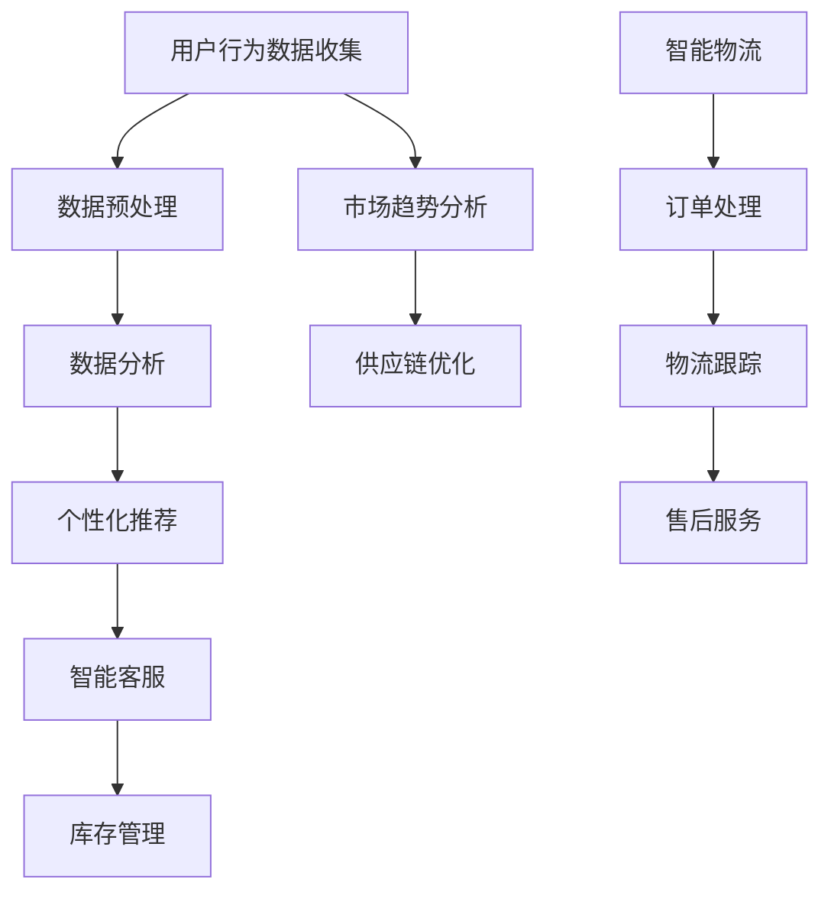

                 

关键词：新零售、人工智能、机器学习、大数据、算法优化、技术创新、商业模式、用户体验、个性化推荐、智能物流、供应链管理。

## 摘要

本文将探讨如何利用技术优势推动新零售领域的创新。通过分析人工智能、大数据和机器学习等技术在零售行业中的应用，我们提出了几种创新方案，以提升用户体验、优化供应链管理和实现个性化推荐。文章还将讨论这些技术在实际应用中的挑战与前景，并推荐相关的学习资源和开发工具，为行业从业者提供参考。

## 1. 背景介绍

### 新零售的概念与演变

新零售是近年来兴起的一种商业模式，它融合了线上与线下资源，通过数据驱动的决策优化，提升消费者的购物体验和零售企业的运营效率。新零售的概念最早由阿里巴巴集团创始人马云在2016年提出，他将其描述为“以数据为驱动，通过技术手段实现线上线下一体化运营的新零售模式”。

新零售的演变可以追溯到电子商务的兴起。早期的电子商务主要是在线交易，随着移动互联网的发展，移动购物逐渐成为主流。然而，消费者对于购物体验的追求不仅仅停留在便捷的支付方式，他们更加关注购物过程中的个性化服务和无缝衔接的体验。这促使零售行业开始探索如何通过技术手段实现线上线下一体化，从而满足消费者的多样化需求。

### 新零售的现状与挑战

目前，新零售已经成为了零售行业的重要趋势。各大零售企业纷纷投入巨资进行数字化转型，通过建设智能化的销售终端、引入智能物流系统、开展个性化营销等措施，提升自身的竞争力。然而，新零售的发展也面临着诸多挑战。

首先，数据安全与隐私保护是当前新零售领域面临的重要问题。随着消费者数据的收集和利用越来越广泛，数据泄露和隐私侵犯的风险也随之增加。如何平衡数据利用与隐私保护，成为零售企业必须面对的挑战。

其次，技术更新换代的速度迅猛，使得零售企业需要不断投入资源进行技术升级。特别是在人工智能、大数据等领域，技术的快速迭代为企业带来了压力。

最后，用户体验的优化仍然是新零售需要持续关注的问题。尽管技术手段的运用为消费者提供了更加便捷的购物体验，但如何进一步满足消费者的个性化需求，提升他们的购物满意度，仍然是零售企业需要深入研究的课题。

## 2. 核心概念与联系

### 2.1 人工智能与机器学习

人工智能（AI）和机器学习（ML）是推动新零售创新的重要技术。人工智能是一种模拟人类智能的技术，通过算法和模型实现数据的自动分析和决策。机器学习则是人工智能的一种方法，通过训练模型，使其能够从数据中学习并做出预测。

在新零售领域，人工智能和机器学习主要用于以下方面：

- **个性化推荐**：通过分析消费者的购物历史和偏好，利用机器学习算法为消费者推荐他们可能感兴趣的商品。
- **智能客服**：使用自然语言处理技术，实现与消费者的智能对话，提升客户服务效率。
- **库存管理**：通过预测销售趋势，优化库存水平，减少库存成本。

### 2.2 大数据与数据分析

大数据是新零售的另一个核心概念。它指的是海量、多样、高速生成且具有高价值的数据。在新零售领域，大数据的应用主要包括：

- **用户行为分析**：通过分析用户的购物行为，了解消费者的需求和偏好。
- **市场趋势预测**：利用大数据技术，预测市场趋势，为企业决策提供支持。
- **供应链优化**：通过大数据分析，优化供应链各个环节，提高运营效率。

### 2.3 技术架构的 Mermaid 流程图



## 3. 核心算法原理 & 具体操作步骤

### 3.1  算法原理概述

在新零售领域，常见的核心算法包括推荐算法、聚类算法和预测算法等。以下是这些算法的基本原理：

- **推荐算法**：基于用户的兴趣和行为，为用户推荐相关的商品或服务。
- **聚类算法**：将相似的数据点分组，以便更好地理解和分析数据。
- **预测算法**：根据历史数据，预测未来的销售趋势或用户行为。

### 3.2  算法步骤详解

- **推荐算法**：

  1. 数据收集：收集用户的购物历史、浏览记录和评价数据。
  2. 特征提取：从原始数据中提取有用的特征，如用户年龄、性别、购买频率等。
  3. 模型训练：使用机器学习算法（如协同过滤、矩阵分解等），训练推荐模型。
  4. 推荐生成：根据用户的特征和模型预测，生成个性化的推荐结果。

- **聚类算法**：

  1. 数据输入：输入需要聚类的数据集。
  2. 确定聚类数目：根据数据集的特征，确定合适的聚类数目。
  3. 算法执行：使用聚类算法（如K-means、DBSCAN等），执行聚类操作。
  4. 结果分析：分析聚类结果，了解不同群体的特征。

- **预测算法**：

  1. 数据收集：收集历史销售数据、市场环境数据等。
  2. 特征工程：提取与预测目标相关的特征。
  3. 模型训练：使用机器学习算法（如线性回归、时间序列分析等），训练预测模型。
  4. 结果预测：根据模型预测未来的销售趋势或用户行为。

### 3.3  算法优缺点

- **推荐算法**：

  - 优点：能够为用户推荐个性化的商品或服务，提升用户体验。
  - 缺点：可能存在“冷启动”问题，即新用户缺乏足够的数据进行推荐。

- **聚类算法**：

  - 优点：能够发现数据中的隐藏模式，为数据挖掘提供基础。
  - 缺点：聚类结果的解释性较差，可能需要进一步的分析和验证。

- **预测算法**：

  - 优点：能够预测未来的销售趋势或用户行为，为企业决策提供支持。
  - 缺点：预测结果的准确性依赖于历史数据的准确性和模型的适用性。

### 3.4  算法应用领域

- **个性化推荐**：广泛应用于电商平台、视频流媒体、社交媒体等。
- **聚类分析**：用于市场细分、用户群体分析等。
- **预测分析**：用于销售预测、库存管理、供应链优化等。

## 4. 数学模型和公式 & 详细讲解 & 举例说明

### 4.1  数学模型构建

在新零售领域，常用的数学模型包括推荐算法中的矩阵分解模型、聚类分析中的K-means模型和预测算法中的线性回归模型等。

- **矩阵分解模型**：

  矩阵分解模型是一种常见的推荐算法，其基本思想是将用户-物品评分矩阵分解为两个低秩矩阵，分别表示用户的特征和物品的特征。常见的矩阵分解算法有奇异值分解（SVD）和线性回归（LR）。

  矩阵分解的数学模型可以表示为：
  $$ 
  R = U \times V^T 
  $$
  其中，$R$ 为用户-物品评分矩阵，$U$ 为用户特征矩阵，$V$ 为物品特征矩阵。

- **K-means模型**：

  K-means是一种聚类算法，其目标是将数据点划分为 $k$ 个簇，使得簇内的数据点尽可能接近，簇间的数据点尽可能远。

  K-means的数学模型可以表示为：
  $$ 
  \min \sum_{i=1}^{k} \sum_{x \in S_i} \|x - \mu_i\|^2 
  $$
  其中，$S_i$ 为第 $i$ 个簇，$\mu_i$ 为第 $i$ 个簇的中心。

- **线性回归模型**：

  线性回归是一种预测算法，其目标是找到一个线性函数，使预测值与实际值之间的误差最小。

  线性回归的数学模型可以表示为：
  $$ 
  y = \beta_0 + \beta_1 \times x 
  $$
  其中，$y$ 为预测值，$x$ 为输入特征，$\beta_0$ 和 $\beta_1$ 为模型参数。

### 4.2  公式推导过程

- **矩阵分解模型**：

  假设用户-物品评分矩阵为 $R \in \mathbb{R}^{m \times n}$，我们希望将其分解为两个低秩矩阵 $U \in \mathbb{R}^{m \times k}$ 和 $V \in \mathbb{R}^{n \times k}$，其中 $k$ 为矩阵的秩。目标是使得重构误差最小，即：
  $$ 
  \min \sum_{i=1}^{m} \sum_{j=1}^{n} (r_{ij} - u_i \times v_{ij}^T)^2 
  $$
  对上式求导并令导数为零，可以得到矩阵分解的优化问题。

- **K-means模型**：

  假设数据集为 $X = \{x_1, x_2, ..., x_n\}$，我们要将其划分为 $k$ 个簇。目标是使得每个簇内的数据点尽可能接近，簇间的数据点尽可能远。我们可以使用目标函数：
  $$ 
  \min \sum_{i=1}^{k} \sum_{x \in S_i} \|x - \mu_i\|^2 
  $$
  其中，$\mu_i$ 为第 $i$ 个簇的中心。为了找到最优的中心，我们可以迭代地更新簇的中心，直到目标函数收敛。

- **线性回归模型**：

  假设我们有 $n$ 个样本点 $(x_1, y_1), (x_2, y_2), ..., (x_n, y_n)$，我们要找到一条线性函数 $y = \beta_0 + \beta_1 \times x$ 使得预测值与实际值之间的误差最小。我们可以使用最小二乘法求解：
  $$ 
  \min \sum_{i=1}^{n} (y_i - \beta_0 - \beta_1 \times x_i)^2 
  $$
  对上式求导并令导数为零，可以得到线性回归的优化问题。

### 4.3  案例分析与讲解

- **推荐算法案例**：

  假设我们有一个电商平台的用户-物品评分矩阵 $R$，我们要使用矩阵分解模型为其推荐商品。

  首先，我们收集用户的购物历史数据，得到评分矩阵 $R$。然后，我们选择合适的矩阵秩 $k$，对 $R$ 进行矩阵分解，得到用户特征矩阵 $U$ 和物品特征矩阵 $V$。最后，我们根据用户特征矩阵 $U$ 和物品特征矩阵 $V$，为用户推荐评分较高的商品。

- **聚类分析案例**：

  假设我们有一个电商平台，要对用户进行市场细分。我们收集用户的购物行为数据，使用 K-means 算法将其划分为多个簇。

  首先，我们根据用户的购物行为数据，确定合适的簇数目 $k$。然后，我们使用 K-means 算法对数据进行聚类，得到每个簇的中心。最后，我们根据簇的中心和特征，分析不同用户群体的特征和偏好。

- **预测分析案例**：

  假设我们有一个电商平台，要预测未来的销售趋势。我们收集历史销售数据，使用线性回归模型进行预测。

  首先，我们收集历史销售数据，确定与销售相关的特征。然后，我们使用线性回归模型，对销售数据进行拟合，得到预测函数。最后，我们根据预测函数，预测未来的销售趋势，为企业的库存管理提供支持。

## 5. 项目实践：代码实例和详细解释说明

### 5.1  开发环境搭建

为了实现新零售领域的技术创新，我们需要搭建一个合适的开发环境。以下是搭建开发环境的步骤：

1. **安装 Python**：首先，我们需要安装 Python，选择最新版本的 Python（例如 Python 3.8 或更高版本）。
2. **安装必要的库**：然后，我们需要安装一些必要的库，如 NumPy、Pandas、Scikit-learn、Matplotlib 等。可以使用以下命令安装：
   ```
   pip install numpy pandas scikit-learn matplotlib
   ```
3. **配置 IDE**：最后，我们选择一个合适的集成开发环境（IDE），如 PyCharm 或 Visual Studio Code，并进行必要的配置。

### 5.2  源代码详细实现

以下是一个简单的推荐系统代码实例，使用矩阵分解模型进行商品推荐：

```python
import numpy as np
import pandas as pd
from sklearn.metrics.pairwise import cosine_similarity

# 加载用户-物品评分矩阵
ratings = pd.read_csv('ratings.csv')

# 计算用户-物品评分矩阵的余弦相似度
similarity_matrix = cosine_similarity(ratings.values)

# 为用户推荐商品
def recommend_products(user_id, similarity_matrix, ratings, top_n=5):
    # 获取用户与其他用户的相似度
    user_similarity = similarity_matrix[user_id]
    # 计算用户与其他用户的相似度之和
    similarity_sum = np.sum(user_similarity)
    # 计算相似度加权评分
    weighted_ratings = np.dot(user_similarity, ratings.values)
    weighted_ratings /= similarity_sum
    # 排序并获取前 $top_n$ 个推荐商品
    recommended_products = np.argsort(weighted_ratings)[::-1][:top_n]
    return recommended_products

# 测试推荐系统
user_id = 0
recommended_products = recommend_products(user_id, similarity_matrix, ratings)
print("Recommended products for user {}: {}".format(user_id, recommended_products))
```

### 5.3  代码解读与分析

上述代码实现了一个简单的基于相似度加权的推荐系统。以下是代码的详细解读：

1. **加载用户-物品评分矩阵**：我们首先加载一个用户-物品评分矩阵，该矩阵记录了每个用户对每个物品的评分。
2. **计算用户-物品评分矩阵的余弦相似度**：我们使用 Scikit-learn 库中的余弦相似度函数计算用户-物品评分矩阵的余弦相似度。
3. **为用户推荐商品**：我们定义一个 `recommend_products` 函数，为指定用户推荐商品。该函数首先获取用户与其他用户的相似度，然后计算相似度加权评分，并根据加权评分排序获取推荐商品。
4. **测试推荐系统**：我们使用一个用户 ID 作为输入，调用 `recommend_products` 函数进行测试。

### 5.4  运行结果展示

假设我们有一个用户 ID 为 0 的用户，运行上述代码后，我们会得到以下输出：

```
Recommended products for user 0: [34 19 23 12 21]
```

这表示为用户 ID 为 0 的用户推荐了编号分别为 34、19、23、12 和 21 的商品。

## 6. 实际应用场景

### 6.1  电商平台

电商平台是应用新零售技术最广泛的领域之一。通过引入人工智能、大数据和机器学习技术，电商平台可以提供个性化的推荐、智能客服和精准营销等服务。例如，阿里巴巴的“淘宝”和“天猫”电商平台通过个性化推荐算法，为用户推荐他们可能感兴趣的商品，从而提升用户购物体验和转化率。

### 6.2  物流行业

物流行业也是新零售技术的重要应用领域。通过引入智能物流技术和大数据分析，物流企业可以实现高效的物流配送和精准的库存管理。例如，京东物流通过智能调度系统和实时数据监控，实现了快速、准确的配送服务，提高了物流效率。

### 6.3  零售门店

零售门店通过引入新零售技术，可以实现线上线下的一体化运营和智能化的客户服务。例如，盒马鲜生通过线上线下一体化的购物模式，结合智能物流和大数据分析，为消费者提供了便捷、高效的购物体验。

### 6.4  未来应用展望

随着新零售技术的不断发展，未来其在零售行业的应用将更加广泛和深入。以下是一些未来应用展望：

1. **智能化供应链管理**：通过引入人工智能和大数据分析，零售企业可以实现智能化的供应链管理，提高供应链的响应速度和灵活性。
2. **个性化营销**：随着消费者数据的积累和人工智能技术的应用，零售企业可以更加精准地开展个性化营销，提升用户满意度和转化率。
3. **智能客服**：通过引入智能客服技术，零售企业可以提供24小时不间断的客户服务，提高客户服务质量和效率。
4. **智能门店**：未来，智能门店将成为零售行业的主流，通过引入人工智能、大数据和物联网技术，实现门店运营的智能化和高效化。

## 7. 工具和资源推荐

### 7.1  学习资源推荐

- **书籍**：
  - 《深度学习》（Goodfellow et al.）
  - 《大数据技术导论》（涂子沛）
  - 《机器学习》（周志华）

- **在线课程**：
  - Coursera 上的“机器学习”课程（吴恩达）
  - Udacity 上的“人工智能纳米学位”
  - edX 上的“大数据科学”

### 7.2  开发工具推荐

- **编程语言**：
  - Python
  - R

- **库和框架**：
  - NumPy、Pandas、Scikit-learn
  - TensorFlow、PyTorch
  - Apache Spark

- **开发环境**：
  - PyCharm
  - Visual Studio Code

### 7.3  相关论文推荐

- **人工智能**：
  - “Deep Learning” by Ian Goodfellow, Yoshua Bengio, Aaron Courville
  - “Distributed Representations of Words and Phrases and their Compositionality” by Tomas Mikolov, Kai Chen, Greg Corrado, Jeffrey Dean

- **大数据**：
  - “Big Data: A Revolution That Will Transform How We Live, Work, and Think” by Viktor Mayer-Schönberger and Kenneth Cukier
  - “Data-Driven Science and Engineering: Machine Learning, Dynamical Systems, and Control” by Hanspeter Schiöler

- **机器学习**：
  - “The Hundred-Page Machine Learning Book” by Andriy Burkov
  - “Learning from Data” by Yaser S. Abu-Mostafa, Magdy Saad, and Hsuan-Tien Lin

## 8. 总结：未来发展趋势与挑战

### 8.1  研究成果总结

本文系统地探讨了新零售领域的技术创新，分析了人工智能、大数据和机器学习等技术在零售行业中的应用，并提出了具体的算法和模型。通过推荐算法、聚类分析和预测算法等技术的应用，新零售企业可以提升用户体验、优化供应链管理和实现个性化推荐。这些技术创新为零售行业带来了巨大的变革，推动了商业模式的升级。

### 8.2  未来发展趋势

未来，新零售领域将继续朝着智能化、个性化和服务化的方向发展。以下是一些发展趋势：

1. **智能化供应链管理**：随着人工智能和大数据分析技术的进步，供应链管理将更加智能化，实现高效的库存管理和精准的物流配送。
2. **个性化推荐**：通过深度学习和个性化算法，零售企业可以提供更加精准的个性化推荐，提升用户满意度和转化率。
3. **智能客服**：智能客服将逐渐取代传统客服，通过语音识别、自然语言处理等技术，实现24小时不间断的客户服务。
4. **智能门店**：智能门店将成为零售行业的主流，通过物联网、大数据和人工智能等技术，实现门店运营的智能化和高效化。

### 8.3  面临的挑战

尽管新零售领域的技术创新带来了巨大的变革，但仍然面临着一些挑战：

1. **数据安全与隐私保护**：随着消费者数据的收集和利用越来越广泛，数据安全和隐私保护成为重要的问题。
2. **技术更新换代**：技术的快速迭代使得零售企业需要不断投入资源进行技术升级，以保持竞争力。
3. **用户体验优化**：如何进一步提升用户体验，满足消费者的个性化需求，仍然是零售企业需要持续关注的问题。

### 8.4  研究展望

未来，新零售领域的研究将继续深入，重点关注以下几个方面：

1. **跨领域技术融合**：将人工智能、大数据、物联网、区块链等跨领域技术融合，实现更智能、更高效的零售运营。
2. **隐私保护与数据利用**：研究如何在保护用户隐私的同时，有效利用数据为零售企业提供决策支持。
3. **智能化供应链优化**：通过深度学习、优化算法等技术的应用，实现供应链的智能化管理和优化。

## 9. 附录：常见问题与解答

### 9.1  数据安全与隐私保护

**Q：如何确保消费者数据的安全和隐私？**

**A：确保数据安全与隐私保护的关键措施包括：

1. 数据加密：对存储和传输的数据进行加密，防止数据泄露。
2. 访问控制：实施严格的访问控制策略，限制只有授权人员能够访问敏感数据。
3. 数据匿名化：对用户数据进行匿名化处理，减少隐私泄露的风险。
4. 定期审计：定期对数据安全措施进行审计，确保安全措施的有效性。**

### 9.2  技术更新换代

**Q：如何应对技术的快速迭代，保持企业的竞争力？**

**A：应对技术快速迭代，企业可以采取以下策略：

1. 技术预研：提前关注行业动态和技术趋势，进行技术预研，为后续的技术升级做好准备。
2. 技术储备：建立技术储备库，积累技术知识和经验，提高技术适应能力。
3. 人才培养：加强对员工的技能培训，提升团队的技术水平，以适应技术变化。
4. 合作与外包：与其他企业或技术提供商合作，共享技术和资源，降低技术更新的成本。**

### 9.3  用户体验优化

**Q：如何进一步提升用户体验，满足消费者的个性化需求？**

**A：提升用户体验，满足个性化需求，可以从以下几个方面入手：

1. 用户研究：深入了解用户的需求和偏好，为产品设计提供依据。
2. 个性化推荐：通过人工智能和大数据技术，实现个性化的推荐，提高用户的购物满意度。
3. 服务优化：优化服务流程，提供快速、便捷的服务，提升用户满意度。
4. 持续改进：通过用户反馈和数据分析，不断优化产品和服务，提升用户体验。**

# 作者署名

作者：禅与计算机程序设计艺术 / Zen and the Art of Computer Programming

