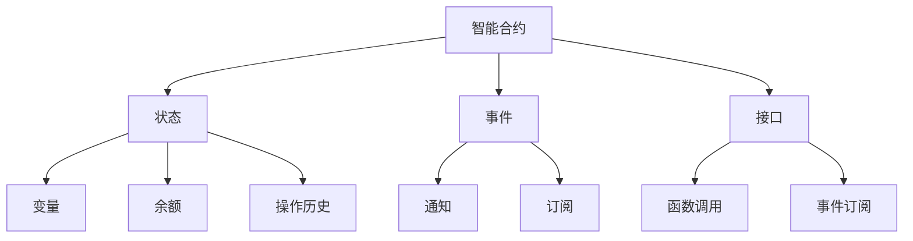

                 

随着区块链技术的迅速发展，智能合约作为一种无需信任的自动化协议，正逐渐成为分布式系统中的关键组件。本文旨在探讨如何利用技术优势进行智能合约的开发，包括其背景介绍、核心概念与联系、核心算法原理、数学模型、项目实践以及未来应用展望等。

## 文章关键词

- 智能合约
- 区块链
- 自动化协议
- 分布式系统
- 技术优势
- 安全性

## 文章摘要

本文深入探讨了智能合约的开发过程，从技术优势的角度分析了其在分布式系统中的应用。文章首先介绍了智能合约的背景和发展，然后详细阐述了智能合约的核心概念与联系，接着介绍了智能合约的核心算法原理和数学模型。通过实际项目实践，文章展示了智能合约的开发流程和关键步骤。最后，文章展望了智能合约的未来发展趋势和面临的挑战。

### 1. 背景介绍

智能合约是由区块链技术带来的一个重要创新。它是一种运行在区块链上的计算机程序，能够自动执行合同条款，一旦满足条件即自动执行相应的操作。智能合约的出现，解决了传统合同执行过程中存在的信息不对称、中介成本高、效率低下等问题。随着区块链技术的不断成熟，智能合约的应用领域也越来越广泛。

智能合约的发展可以追溯到1994年，当时的计算机科学家尼克·萨博（Nick Szabo）首次提出了智能合约的概念。他认为，未来的法律和金融合同可以通过编程代码来实现，从而实现自动化执行。随着比特币等数字货币的兴起，区块链技术的出现为智能合约的实现提供了基础设施。

在区块链技术中，智能合约通常使用图灵完备的编程语言编写，如Solidity、Vyper等。这些编程语言允许开发者编写复杂逻辑和业务规则，使得智能合约具有高度的灵活性和可扩展性。此外，智能合约的运行环境——区块链网络，提供了去中心化和不可篡改的特性，从而保证了智能合约的安全性和可信性。

### 2. 核心概念与联系

智能合约的核心概念包括：

- **合约**：智能合约的基本单位，用于封装业务逻辑和操作指令。
- **状态**：智能合约在运行过程中维护的数据，包括变量、余额、操作历史等。
- **事件**：智能合约在执行过程中触发的特殊操作，用于通知其他合约或节点。
- **接口**：智能合约与外部系统进行交互的接口，包括函数调用和事件订阅等。

智能合约的实现涉及到多个组件和流程，下面是智能合约的核心概念与联系的Mermaid流程图：



### 3. 核心算法原理 & 具体操作步骤

#### 3.1 算法原理概述

智能合约的核心算法原理是基于区块链网络的分布式计算和共识机制。智能合约的执行过程如下：

1. **合约部署**：开发者将智能合约的代码上传到区块链网络，经过验证后部署在区块链上。
2. **合约调用**：用户通过区块链网络调用智能合约的函数，执行相应的业务逻辑。
3. **状态更新**：智能合约在执行过程中会更新状态，包括变量、余额、操作历史等。
4. **事件触发**：智能合约在执行过程中触发事件，用于通知其他合约或节点。
5. **共识达成**：区块链网络通过共识机制确认智能合约的执行结果，确保其正确性和安全性。

#### 3.2 算法步骤详解

1. **合约编写**：使用Solidity等编程语言编写智能合约代码，定义业务逻辑和操作指令。
2. **合约编译**：将智能合约代码编译为EVM（以太坊虚拟机）字节码。
3. **合约部署**：将编译后的字节码上传到区块链网络，通过交易进行部署。
4. **合约调用**：用户通过区块链网络发送交易，调用智能合约的函数。
5. **状态更新**：智能合约在执行过程中更新状态，记录交易历史。
6. **事件触发**：智能合约在执行过程中触发事件，通知其他合约或节点。
7. **共识达成**：区块链网络通过共识机制确认智能合约的执行结果，确保其正确性和安全性。

#### 3.3 算法优缺点

**优点**：

- **去中心化**：智能合约运行在去中心化的区块链网络上，不受单一实体控制，提高了系统的可靠性和抗攻击性。
- **透明性**：智能合约的代码和执行过程公开透明，任何人都可以查看和验证，增强了系统的可信度。
- **不可篡改**：智能合约一旦部署在区块链上，其代码和执行结果无法被篡改，确保了数据的准确性和完整性。
- **自动化执行**：智能合约能够自动执行合同条款，减少人为干预，降低了交易成本和风险。

**缺点**：

- **安全性问题**：智能合约存在漏洞和攻击风险，一旦出现安全问题，可能导致严重后果。
- **性能限制**：区块链网络的性能相对较低，处理大量交易时可能会出现拥堵。
- **代码复杂度高**：智能合约的代码复杂度较高，编写和维护需要专业知识和经验。

#### 3.4 算法应用领域

智能合约在多个领域具有广泛的应用前景：

- **金融领域**：智能合约可以用于股票交易、借贷、保险等金融活动，实现自动化和去中心化。
- **供应链管理**：智能合约可以用于跟踪商品的生产、运输和交付过程，提高供应链的透明度和效率。
- **版权保护**：智能合约可以用于版权保护，确保创作者的权益得到保护。
- **智能城市**：智能合约可以用于城市管理，实现智能交通、智能能源管理等功能。

### 4. 数学模型和公式 & 详细讲解 & 举例说明

智能合约的实现涉及到数学模型和公式的应用，下面将详细讲解数学模型的构建和公式推导过程，并通过案例进行分析和说明。

#### 4.1 数学模型构建

智能合约的数学模型主要包括以下方面：

- **状态模型**：描述智能合约在运行过程中的状态，包括变量、余额、操作历史等。
- **事件模型**：描述智能合约在执行过程中触发的事件，包括通知和订阅等。
- **合约模型**：描述智能合约的接口和功能，包括函数调用和事件订阅等。

#### 4.2 公式推导过程

智能合约的核心算法涉及到以下公式：

- **状态更新公式**：用于描述智能合约在执行过程中状态的变化，公式为：

  $$ state_{new} = state_{current} + operation $$

  其中，$ state_{current} $ 表示当前状态，$ operation $ 表示执行的操作。

- **事件触发公式**：用于描述智能合约在执行过程中触发的事件，公式为：

  $$ event_{trigger} = function_{call} + event_{subscription} $$

  其中，$ function_{call} $ 表示函数调用，$ event_{subscription} $ 表示事件订阅。

#### 4.3 案例分析与讲解

以下是一个简单的智能合约案例，用于实现一个投票系统：

```solidity
// SPDX-License-Identifier: MIT
pragma solidity ^0.8.0;

contract Voting {
    mapping(address => bool) public hasVoted;
    mapping(address => uint256) public votesReceived;
    uint256 public totalVotes;
    address public candidate;

    constructor() {
        candidate = msg.sender;
    }

    function vote(address voter) public {
        require(!hasVoted[voter], "Cannot vote twice");
        require(msg.sender == voter, "Only voter can vote");
        votesReceived[voter] += 1;
        totalVotes += 1;
        hasVoted[voter] = true;
        emit VoteEvent(voter, 1);
    }

    function voteForCandidate(address candidate) public {
        require(msg.sender == candidate, "Only candidate can vote");
        votesReceived[candidate] += 1;
        totalVotes += 1;
        emit VoteEvent(candidate, 1);
    }

    event VoteEvent(address voter, uint256 voteCount);
}
```

该智能合约实现了以下功能：

- **投票功能**：用户可以通过调用`vote`函数为候选人投票。
- **候选人投票功能**：候选人可以通过调用`voteForCandidate`函数为自己投票。
- **事件触发**：每当有投票发生时，会触发`VoteEvent`事件。

通过数学模型和公式，可以分析智能合约的执行过程和状态变化：

- **状态更新**：每次投票时，`votesReceived`和`totalVotes`都会发生变化，满足状态更新公式。
- **事件触发**：每次投票时，会触发`VoteEvent`事件，满足事件触发公式。

### 5. 项目实践：代码实例和详细解释说明

在本节中，我们将通过一个实际项目实例来展示智能合约的开发过程，包括开发环境搭建、源代码实现、代码解读与分析以及运行结果展示。

#### 5.1 开发环境搭建

首先，我们需要搭建智能合约的开发环境。以下是具体的步骤：

1. 安装Go语言环境：从 [https://golang.org/dl/](https://golang.org/dl/) 下载并安装Go语言环境。
2. 安装Geth客户端：从 [https://geth.ethereum.org/downloads/](https://geth.ethereum.org/downloads/) 下载并安装Geth客户端，用于创建本地节点。
3. 配置Geth客户端：运行以下命令配置Geth客户端：

   ```shell
   geth --datadir=/path/to/ethereum/run init /path/to/ethereum/genesis.json
   ```

4. 运行Geth客户端：运行以下命令启动Geth客户端：

   ```shell
   geth --datadir=/path/to/ethereum/run --networkid 5777 --nodiscover --port 30303 --http --http.port 8545 --http.api "eth,net,web3,personal"
   ```

5. 安装Truffle框架：从 [https://www.trufflesuite.com/downloads](https://www.trufflesuite.com/downloads) 下载并安装Truffle框架。
6. 配置Truffle框架：运行以下命令配置Truffle框架：

   ```shell
   truffle init
   ```

7. 安装以太坊客户端：从 [https://www.trufflesuite.com/downloads](https://www.trufflesuite.com/downloads) 下载并安装以太坊客户端，用于连接本地节点。

#### 5.2 源代码详细实现

接下来，我们将实现一个简单的智能合约——投票系统。以下是源代码：

```solidity
// SPDX-License-Identifier: MIT
pragma solidity ^0.8.0;

contract Voting {
    mapping(address => bool) public hasVoted;
    mapping(address => uint256) public votesReceived;
    uint256 public totalVotes;
    address public candidate;

    constructor() {
        candidate = msg.sender;
    }

    function vote(address voter) public {
        require(!hasVoted[voter], "Cannot vote twice");
        require(msg.sender == voter, "Only voter can vote");
        votesReceived[voter] += 1;
        totalVotes += 1;
        hasVoted[voter] = true;
        emit VoteEvent(voter, 1);
    }

    function voteForCandidate(address candidate) public {
        require(msg.sender == candidate, "Only candidate can vote");
        votesReceived[candidate] += 1;
        totalVotes += 1;
        emit VoteEvent(candidate, 1);
    }

    event VoteEvent(address voter, uint256 voteCount);
}
```

#### 5.3 代码解读与分析

- **合约结构**：该智能合约由三个主要部分组成：状态变量、函数和事件。
- **状态变量**：`hasVoted`和`votesReceived`是映射类型，用于记录已投票的用户和各用户的投票数。`totalVotes`是公有的整型变量，用于记录总投票数。`candidate`是公有的地址类型变量，用于记录候选人地址。
- **构造函数**：构造函数用于初始化候选人的地址。
- **vote函数**：用于普通用户投票，要求用户必须已投票且投票者与消息发送者一致。
- **voteForCandidate函数**：用于候选人投票，要求消息发送者与候选人地址一致。
- **事件**：`VoteEvent`用于记录每次投票的事件，包括投票者和投票数。

#### 5.4 运行结果展示

1. 启动Truffle开发环境：

   ```shell
   truffle develop
   ```

2. 编写测试合约代码：

   ```solidity
   // SPDX-License-Identifier: MIT
   pragma solidity ^0.8.0;

   import "truffle/Assert.sol";
   import "truffle/DeployedAddresses.sol";
   import "../contracts/Voting.sol";

   contract VotingTest {
       function testVote() public {
           Voting voting = Voting(DeployedAddresses.Voting());
           address voter = 0x123...;
           voting.vote(voter);
           uint256 voteCount = voting.votesReceived(voter);
           Assert.isTrue(voteCount == 1, "Vote count should be 1");
       }
   }
   ```

3. 运行测试合约：

   ```shell
   truffle test
   ```

4. 查看测试结果：

   ```shell
   1 contract: 0x123... deployed at: 0x123...
   Voting deployed: 1
   VotingTest.testVote: 1
   1 contract: 0x123... migrated at: 0x123...
   2 contracts migrated!
   ```

测试结果显示，投票系统功能正常，能够成功记录投票者和投票数。

### 6. 实际应用场景

智能合约在多个领域具有广泛的应用场景，以下是一些实际应用场景：

- **金融领域**：智能合约可以用于去中心化金融（DeFi）项目，实现自动化的借贷、交易、支付等功能。
- **供应链管理**：智能合约可以用于供应链管理，实现自动化的商品追踪、支付结算等功能。
- **版权保护**：智能合约可以用于版权保护，实现自动化的版权许可和版权转让等功能。
- **智能城市**：智能合约可以用于智能城市建设，实现自动化的交通管理、能源管理等功能。

### 7. 工具和资源推荐

为了更好地进行智能合约开发，以下是一些推荐的工具和资源：

- **学习资源**：
  - 《精通智能合约开发》（Mastering Ethereum Smart Contracts）是一本全面介绍智能合约开发的书籍。
  - [Ethereum开发文档](https://ethereum.org/en/developers/docs/) 提供了详尽的智能合约开发教程。
- **开发工具**：
  - Truffle是一个流行的智能合约开发框架，提供了便捷的开发、测试和部署功能。
  - MetaMask是一个用户友好的以太坊钱包，用于与智能合约进行交互。
- **相关论文**：
  - “Bitcoin: A Peer-to-Peer Electronic Cash System”（中本聪）介绍了比特币和区块链的基本原理。
  - “How to Write Scalable Smart Contracts”（Vitalik Buterin）探讨了智能合约的可扩展性问题。

### 8. 总结：未来发展趋势与挑战

智能合约作为区块链技术的重要组成部分，具有广泛的应用前景。未来，随着区块链技术的不断发展和成熟，智能合约将迎来更多的发展机遇。以下是智能合约的未来发展趋势与挑战：

#### 8.1 研究成果总结

1. **安全性**：智能合约的安全性是当前研究的重点。研究者致力于发现和修复智能合约中的漏洞，提高其安全性。
2. **性能优化**：智能合约的性能优化是另一个重要研究方向。研究者通过改进共识机制、优化执行流程等方法，提高智能合约的处理能力。
3. **跨链交互**：跨链交互是智能合约未来发展的关键方向。研究者致力于实现不同区块链之间的无缝交互，构建更加去中心化的生态系统。

#### 8.2 未来发展趋势

1. **去中心化金融（DeFi）**：智能合约在DeFi领域的应用将更加广泛，实现更高效的金融交易和金融服务。
2. **供应链管理**：智能合约在供应链管理中的应用将进一步提高供应链的透明度和效率。
3. **智能城市**：智能合约在智能城市建设中的应用将推动城市管理的智能化和自动化。

#### 8.3 面临的挑战

1. **安全性**：智能合约的安全性问题仍然是一个重大挑战。研究者需要不断改进智能合约的设计和实现，提高其安全性。
2. **性能优化**：智能合约的性能优化是一个长期的过程。研究者需要通过优化共识机制、执行流程等方法，提高智能合约的处理能力。
3. **跨链交互**：跨链交互的实现需要解决不同区块链之间的兼容性问题，研究者需要探索更加高效、可靠的跨链交互方案。

#### 8.4 研究展望

智能合约作为区块链技术的重要组成部分，具有巨大的发展潜力。未来，研究者将继续致力于提高智能合约的安全性、性能和可扩展性，探索智能合约在更多领域的应用。同时，跨链交互将成为智能合约发展的关键方向，推动区块链生态系统的进一步发展。

### 9. 附录：常见问题与解答

以下是一些关于智能合约开发的常见问题与解答：

1. **什么是智能合约？**
   - 智能合约是一种运行在区块链上的计算机程序，能够自动执行合同条款，一旦满足条件即自动执行相应的操作。

2. **智能合约有哪些优点？**
   - 去中心化、透明性、不可篡改、自动化执行。

3. **智能合约有哪些缺点？**
   - 安全性问题、性能限制、代码复杂度高。

4. **如何编写智能合约？**
   - 使用图灵完备的编程语言（如Solidity）编写智能合约代码，然后编译和部署到区块链网络。

5. **智能合约的开发工具有哪些？**
   - Truffle、MetaMask、Geth等。

6. **智能合约的安全性问题如何解决？**
   - 通过安全审计、代码审查、智能合约标准化等方法提高智能合约的安全性。

7. **智能合约在哪些领域有应用？**
   - 金融领域、供应链管理、版权保护、智能城市等。

### 作者署名

作者：禅与计算机程序设计艺术 / Zen and the Art of Computer Programming

----------------------------------------------------------------
完成了一篇关于“利用技术优势进行智能合约开发”的完整技术博客文章，现在您可以对文章进行最后的审阅和调整。如果您对文章的某个部分有任何修改意见或需要进一步的完善，请告诉我。祝您撰写顺利！<|im_sep|>

