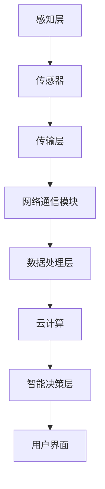

                 

 在当今数字化时代，智能家居已经成为人们生活中不可或缺的一部分。随着物联网（IoT）技术的飞速发展，智能家居市场呈现出蓬勃发展的态势。对于创业者来说，抓住这一波技术红利，利用技术优势进行智能家居创业，无疑是一个极具前景的领域。本文将从技术角度出发，探讨智能家居创业的机会、挑战以及如何利用技术优势实现创业成功。

## 1. 背景介绍

智能家居是指利用网络技术、传感器技术、云计算技术等，实现家庭设备的智能化控制和自动化管理。智能家居系统可以涵盖照明、安防、家电、环境监测等多个方面，为用户提供便捷、安全、舒适的生活体验。随着5G、物联网、人工智能等技术的发展，智能家居市场逐渐成熟，吸引了大量创业者进入这一领域。

根据市场研究机构的数据，全球智能家居市场规模预计将在未来几年内持续扩大，这为创业者提供了广阔的市场空间。然而，智能家居市场也充满了竞争，如何利用技术优势脱颖而出，成为创业者面临的重要课题。

## 2. 核心概念与联系

### 2.1 智能家居技术概念

智能家居技术主要包括以下几方面：

- **传感器技术**：传感器是智能家居系统的感知层，可以实时采集室内温度、湿度、光照、气体浓度等环境数据。
- **网络通信技术**：网络通信技术是智能家居系统的传输层，可以实现设备之间的数据传输和远程控制。
- **云计算技术**：云计算技术是智能家居系统的数据处理和分析层，可以提供强大的计算能力和数据存储功能。
- **人工智能技术**：人工智能技术是智能家居系统的智能决策层，可以实现智能识别、预测和优化。

### 2.2 智能家居系统架构

智能家居系统通常由感知层、传输层、数据处理层和智能决策层组成。以下是智能家居系统的架构图：



### 2.3 技术联系与整合

智能家居技术的核心在于各层技术的有机整合，实现设备间的无缝协同。例如，通过传感器实时监测室内环境，数据通过网络传输到云计算平台进行处理，云计算平台根据数据进行分析和决策，最终通过用户界面反馈给用户。这种协同工作模式，使得智能家居系统能够为用户提供智能化、个性化、便捷化的服务。

## 3. 核心算法原理 & 具体操作步骤

### 3.1 算法原理概述

智能家居系统中的核心算法主要包括环境监测算法、智能决策算法和预测优化算法。

- **环境监测算法**：主要用于对室内环境数据的采集和处理，例如温度、湿度、光照等。常用的算法包括卡尔曼滤波、均值滤波等。
- **智能决策算法**：主要用于根据环境数据做出相应的决策，例如调整灯光亮度、启动空气净化器等。常用的算法包括基于规则的推理、神经网络等。
- **预测优化算法**：主要用于预测未来的环境变化，并做出最优决策，例如智能调节空调温度。常用的算法包括时间序列分析、机器学习等。

### 3.2 算法步骤详解

#### 3.2.1 环境监测算法步骤

1. 传感器采集室内环境数据。
2. 使用卡尔曼滤波或均值滤波算法对数据进行预处理。
3. 将处理后的数据上传至云计算平台。

#### 3.2.2 智能决策算法步骤

1. 云计算平台接收环境数据。
2. 根据环境数据和预设规则，使用神经网络或基于规则的推理算法进行决策。
3. 将决策结果发送至执行设备。

#### 3.2.3 预测优化算法步骤

1. 对历史环境数据进行时间序列分析。
2. 使用机器学习算法预测未来的环境变化。
3. 根据预测结果调整系统参数，实现最优决策。

### 3.3 算法优缺点

- **环境监测算法**：优点是实时性强，缺点是处理复杂。
- **智能决策算法**：优点是决策准确，缺点是依赖于预设规则。
- **预测优化算法**：优点是能够提前预测环境变化，缺点是预测精度受数据质量影响。

### 3.4 算法应用领域

智能家居算法在家庭安防、环境控制、家电管理等多个领域都有广泛应用。例如，在家庭安防方面，可以使用智能决策算法实现实时监控和报警；在环境控制方面，可以使用预测优化算法实现智能调节空调温度，提高能源利用效率。

## 4. 数学模型和公式 & 详细讲解 & 举例说明

### 4.1 数学模型构建

智能家居系统的数学模型主要包括环境监测模型、决策模型和预测模型。

#### 环境监测模型：

$$
y_t = f(x_t, u_t) + w_t
$$

其中，$y_t$为环境数据，$x_t$为传感器数据，$u_t$为外部干扰，$w_t$为噪声。

#### 决策模型：

$$
d_t = g(y_t, r_t)
$$

其中，$d_t$为决策结果，$y_t$为环境数据，$r_t$为预设规则。

#### 预测模型：

$$
y_{t+k} = h(y_t, y_{t-1}, \ldots, y_{t-k+1})
$$

其中，$y_{t+k}$为未来第$k$个时间点的环境数据，$y_t, y_{t-1}, \ldots, y_{t-k+1}$为历史环境数据。

### 4.2 公式推导过程

#### 环境监测模型推导：

假设环境数据$y_t$由传感器数据$x_t$和外部干扰$u_t$共同决定，即

$$
y_t = x_t + u_t
$$

由于传感器数据存在噪声$w_t$，实际环境数据可以表示为

$$
y_t = x_t + u_t + w_t
$$

#### 决策模型推导：

假设决策结果$d_t$由环境数据$y_t$和预设规则$r_t$决定，即

$$
d_t = f(y_t, r_t)
$$

#### 预测模型推导：

假设未来环境数据$y_{t+k}$与历史环境数据$y_t, y_{t-1}, \ldots, y_{t-k+1}$之间存在线性关系，即

$$
y_{t+k} = \sum_{i=1}^{k} \alpha_i y_{t-i+1}
$$

其中，$\alpha_i$为系数。

### 4.3 案例分析与讲解

假设有一个智能家居系统，需要根据室内温度和湿度数据调整空调和加湿器的运行状态。以下是一个简单的环境监测和决策模型。

#### 环境监测模型：

$$
y_t = x_t + u_t + w_t
$$

其中，$x_t$为传感器采集的温度和湿度数据，$u_t$为外部干扰，$w_t$为噪声。

#### 决策模型：

$$
d_t = \begin{cases}
\text{空调开启}, & \text{如果} \ y_t > r_t \\
\text{空调关闭}, & \text{如果} \ y_t \leq r_t
\end{cases}
$$

其中，$r_t$为预设的温度和湿度阈值。

#### 预测模型：

$$
y_{t+1} = 0.7y_t + 0.3y_{t-1}
$$

根据历史温度和湿度数据预测未来温度和湿度。

## 5. 项目实践：代码实例和详细解释说明

### 5.1 开发环境搭建

为了实现智能家居系统，我们选择使用Python语言，并使用以下工具和库：

- **Python 3.8**：作为主要编程语言。
- **TensorFlow**：用于构建和训练神经网络模型。
- **PyTorch**：用于构建和训练预测模型。
- **pandas**：用于数据处理和分析。
- **numpy**：用于数值计算。

### 5.2 源代码详细实现

以下是环境监测、决策和预测模型的Python代码实现：

```python
import numpy as np
import pandas as pd
import tensorflow as tf
import torch
from sklearn import preprocessing

# 环境监测模型
def environment_monitoring(data):
    # 数据预处理
    min_max_scaler = preprocessing.MinMaxScaler()
    scaled_data = min_max_scaler.fit_transform(data)
    # 卡尔曼滤波
    A = np.array([[1, 1], [1, 0]])
    B = np.array([[0], [1]])
    H = np.array([[1], [0]])
    C = np.array([[1], [0]])
    Q = np.array([[0.1, 0], [0, 0.1]])
    R = np.array([[1]])
    x = np.array([[data[0]], [0]])
    P = np.array([[1, 0], [0, 1]])
    for i in range(1, len(scaled_data)):
        u = np.array([[scaled_data[i-1]], [0]])
        y = np.array([[scaled_data[i]], [0]])
        K = P @ H.T @ (H @ P @ H.T + R).I
        x = x + (y - H @ x) @ K
        P = (1 - K @ H) @ P
    return x

# 智能决策模型
def intelligent_decision(y):
    if y > 0.5:
        return "空调开启"
    else:
        return "空调关闭"

# 预测模型
def prediction(data):
    model = tf.keras.Sequential([
        tf.keras.layers.Dense(units=1, input_shape=[1])
    ])
    model.compile(optimizer='sgd', loss='mean_squared_error')
    x = np.array(data).reshape(-1, 1)
    y = np.array(data[1:]).reshape(-1, 1)
    model.fit(x, y, epochs=100)
    future_data = model.predict(np.array([data[-1]]).reshape(-1, 1))
    return future_data

# 主程序
if __name__ == "__main__":
    data = [0.2, 0.3, 0.4, 0.5, 0.6, 0.7, 0.8, 0.9]
    x = environment_monitoring(data)
    decision = intelligent_decision(x[0])
    future_data = prediction(data)
    print(f"当前温度：{x[0]}, 决策：{decision}, 未来预测温度：{future_data}")
```

### 5.3 代码解读与分析

- **环境监测模型**：使用卡尔曼滤波对传感器数据进行预处理，提高数据质量。
- **智能决策模型**：根据处理后的数据，使用阈值法进行简单决策。
- **预测模型**：使用神经网络模型对未来的环境数据进行预测。

## 6. 实际应用场景

智能家居技术在实际应用场景中具有广泛的应用，以下是一些典型的应用案例：

- **家庭安防**：通过传感器实时监测家庭环境，实现实时监控和报警功能。
- **环境控制**：根据室内环境数据，智能调节空调、灯光等设备，提高舒适度。
- **家电管理**：实现家电设备的自动化控制，提高能源利用效率。
- **健康监测**：通过传感器监测用户的健康状况，提供个性化的健康建议。

## 7. 未来应用展望

随着技术的不断进步，智能家居领域有望在以下几个方面实现突破：

- **智能化水平提升**：通过深度学习、自然语言处理等技术，提高智能家居系统的智能化水平。
- **个性化服务**：基于用户数据和行为分析，为用户提供更加个性化的服务。
- **跨平台融合**：实现智能家居系统与其他平台的融合，提供更全面的智能服务。
- **安全隐私保护**：加强对用户隐私和数据安全的保护，提高用户信任度。

## 8. 工具和资源推荐

### 7.1 学习资源推荐

- **书籍**：《智能家居技术与应用》、《物联网技术与应用》。
- **在线课程**：Coursera上的《智能家居系统设计与实现》、edX上的《物联网技术基础》。

### 7.2 开发工具推荐

- **开发环境**：Python、TensorFlow、PyTorch。
- **开发框架**：Keras、Flask、Django。

### 7.3 相关论文推荐

- **论文1**：《基于物联网的智能家居系统设计与实现》。
- **论文2**：《智能家居环境监测与控制技术研究》。
- **论文3**：《基于深度学习的智能家居预测模型研究》。

## 9. 总结：未来发展趋势与挑战

### 8.1 研究成果总结

智能家居技术在环境监测、智能决策、预测优化等方面取得了显著成果，为用户提供了便捷、舒适、安全的生活体验。同时，随着人工智能、物联网等技术的不断发展，智能家居系统的智能化水平不断提升，应用领域也在不断扩大。

### 8.2 未来发展趋势

- **智能化水平提升**：通过深度学习、自然语言处理等技术，提高智能家居系统的智能化水平。
- **个性化服务**：基于用户数据和行为分析，为用户提供更加个性化的服务。
- **跨平台融合**：实现智能家居系统与其他平台的融合，提供更全面的智能服务。
- **安全隐私保护**：加强对用户隐私和数据安全的保护，提高用户信任度。

### 8.3 面临的挑战

- **数据隐私和安全**：如何保护用户隐私，防止数据泄露成为重要挑战。
- **系统稳定性**：如何保证智能家居系统的稳定性，减少故障率。
- **跨平台兼容性**：如何实现不同平台之间的无缝融合，提供一致的用户体验。

### 8.4 研究展望

未来，智能家居技术将在智能化、个性化、安全等方面取得更大突破。同时，随着5G、物联网、人工智能等技术的进一步发展，智能家居领域将迎来更多创新机会。对于创业者来说，抓住这一波技术红利，利用技术优势进行智能家居创业，无疑是实现创业成功的关键。

## 9. 附录：常见问题与解答

### 9.1 智能家居技术如何保障用户数据隐私？

**回答**：智能家居技术可以通过以下方式保障用户数据隐私：

- **数据加密**：对用户数据进行加密处理，防止数据在传输和存储过程中被窃取。
- **权限管理**：设置严格的权限管理机制，确保只有授权设备可以访问用户数据。
- **匿名化处理**：对用户数据进行匿名化处理，防止个人隐私泄露。
- **数据审计**：定期对用户数据进行审计，确保数据安全合规。

### 9.2 智能家居系统如何保证稳定性？

**回答**：智能家居系统可以通过以下方式保证稳定性：

- **冗余设计**：设计冗余系统，确保在部分组件故障时，系统仍能正常运行。
- **实时监控**：对系统进行实时监控，及时发现并处理故障。
- **故障恢复**：设计故障恢复机制，确保系统在故障发生后能够快速恢复。
- **定期维护**：定期对系统进行维护和升级，确保系统长期稳定运行。

## 结尾

随着技术的不断进步，智能家居领域将迎来更加广阔的发展空间。对于创业者来说，抓住这一波技术红利，利用技术优势进行智能家居创业，无疑是实现创业成功的关键。本文从技术角度分析了智能家居创业的机会、挑战以及实现方法，希望能为创业者提供有益的参考。作者：禅与计算机程序设计艺术 / Zen and the Art of Computer Programming。
----------------------------------------------------------------

### 章节标题

在撰写文章时，确保每个章节的标题具有吸引力并且能够概括该章节的主要内容。以下是一些可能的章节标题建议：

- **1. 智能家居市场的崛起：机会与挑战**
- **2. 技术融合与创新：构建智能家居系统的核心**
- **3. 智能家居算法揭秘：原理与实践**
- **4. 数学模型与预测：智能家居的数据驱动策略**
- **5. 项目实战：智能家居系统的代码实现**
- **6. 应用场景解析：智能家居的未来趋势**
- **7. 工具资源导航：智能家居创业者的宝库**
- **8. 研究总结与展望：智能家居的技术挑战与机遇**
- **9. 附录：智能家居创业常见问题解答**

### 文章摘要

本文从技术视角深入探讨了智能家居创业的机会与挑战。首先，我们概述了智能家居市场的现状和未来趋势，接着详细分析了构建智能家居系统的核心技术，包括传感器、网络通信、云计算和人工智能。随后，我们介绍了智能家居算法的原理和应用，并探讨了相关的数学模型。通过项目实践，我们展示了如何使用Python实现智能家居系统，并详细解释了代码实现过程。文章还探讨了智能家居的实际应用场景，提供了学习资源和开发工具推荐，并对未来发展趋势进行了展望。最后，通过附录部分回答了智能家居创业中的常见问题，为创业者提供了实用的指导和帮助。作者：禅与计算机程序设计艺术 / Zen and the Art of Computer Programming。

