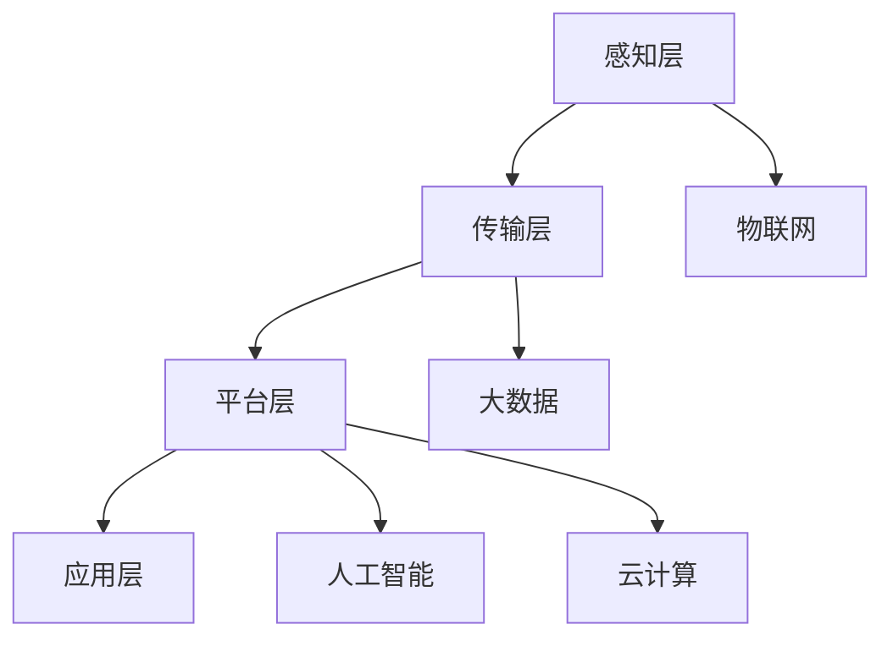

                 

### 背景介绍

随着全球工业4.0的深入推进，制造业正经历着前所未有的变革。智能工厂作为工业4.0的核心载体，已经成为未来制造业发展的必然趋势。智能工厂通过整合物联网、大数据、人工智能等先进技术，实现了生产过程的自动化、智能化，从而大幅提升了生产效率、产品质量和资源利用率。

在这个背景下，越来越多的创业者开始关注智能工厂领域，希望通过技术优势实现创业梦想。然而，智能工厂的建设和运营并非易事，它涉及复杂的技术架构、庞大的数据处理和高度的安全要求。因此，如何利用技术优势进行智能工厂创业，成为众多创业者亟需解决的问题。

本文将围绕以下核心问题展开讨论：

1. **智能工厂的核心技术是什么？**
2. **如何构建智能工厂的技术架构？**
3. **智能工厂中的核心算法有哪些？**
4. **如何实现智能工厂中的数学模型和公式应用？**
5. **智能工厂的实际应用案例有哪些？**
6. **未来智能工厂的发展趋势和挑战是什么？**

通过以上问题的探讨，本文旨在为读者提供一份智能工厂创业的技术指南，帮助创业者更好地利用技术优势，打造出具有竞争力的智能工厂。

### 核心概念与联系

在深入探讨智能工厂的技术实现之前，我们有必要首先了解一些核心概念和技术架构。智能工厂的核心概念主要包括物联网（IoT）、大数据（Big Data）、人工智能（AI）、云计算（Cloud Computing）等。这些技术共同构成了智能工厂的技术基础，它们之间的联系和相互作用也决定了智能工厂的效能。

#### 物联网（IoT）

物联网是智能工厂的基础设施，它通过传感器、RFID等设备将物理世界与数字世界相连接，实现了数据的实时采集和传输。在智能工厂中，物联网技术主要用于采集设备状态、生产数据、环境数据等，为后续的数据处理和分析提供基础。

#### 大数据（Big Data）

大数据技术在智能工厂中发挥着至关重要的作用。通过对海量数据的收集、存储、处理和分析，大数据技术能够帮助工厂实现生产过程的优化、预测维护、质量监控等。例如，通过对生产数据的分析，可以预测设备故障，提前进行维护，从而减少停机时间，提高生产效率。

#### 人工智能（AI）

人工智能是智能工厂的灵魂，它通过机器学习、深度学习等技术，对数据进行智能分析，从而实现自动化决策和优化。在智能工厂中，人工智能技术主要用于生产过程的优化、质量检测、安全监控等方面。

#### 云计算（Cloud Computing）

云计算为智能工厂提供了强大的计算和存储能力，使得数据处理和分析变得高效和便捷。通过云计算平台，智能工厂可以实现资源的弹性扩展，降低成本，提高灵活性。

#### 技术架构

智能工厂的技术架构可以概括为感知层、传输层、平台层和应用层。感知层负责数据的采集和初步处理；传输层负责数据的传输和存储；平台层负责数据的管理和分析；应用层则实现具体的应用功能，如生产调度、质量检测、安全监控等。


#### Mermaid 流程图

下面是智能工厂技术架构的 Mermaid 流程图：



通过以上核心概念和技术的介绍，我们可以更好地理解智能工厂的构建原理和实现方法。在接下来的章节中，我们将深入探讨智能工厂中的核心技术，包括核心算法、数学模型和应用实例，帮助读者全面了解智能工厂的技术细节。

### 核心算法原理 & 具体操作步骤

在智能工厂中，核心算法是实现自动化、智能化生产的关键。以下将介绍几个常见的核心算法，包括其原理、具体操作步骤以及优缺点。

#### 1. 机器学习算法

**原理**：机器学习算法是一种使计算机能够从数据中学习的方法。通过训练模型，机器学习算法能够自动识别数据中的规律和模式，并在新的数据上做出预测或决策。

**具体操作步骤**：
1. 数据收集：收集工厂生产过程中产生的各类数据，如设备状态、生产参数、环境数据等。
2. 数据预处理：清洗数据，去除噪声和异常值，对数据格式进行统一。
3. 模型训练：选择合适的机器学习算法，如线性回归、决策树、支持向量机等，对数据进行训练。
4. 模型评估：使用验证集对模型进行评估，调整模型参数，优化模型性能。
5. 预测应用：使用训练好的模型对新数据进行预测，如设备故障预测、生产优化等。

**优缺点**：
- 优点：能够自动发现数据中的规律，无需人工干预。
- 缺点：对数据质量要求高，模型训练过程复杂，可能存在过拟合问题。

#### 2. 深度学习算法

**原理**：深度学习是机器学习的一个分支，通过多层神经网络对数据进行学习，能够捕捉更复杂的数据特征。

**具体操作步骤**：
1. 数据收集：与机器学习算法类似，收集生产过程中产生的数据。
2. 数据预处理：同样需要对数据进行清洗和格式统一。
3. 网络构建：设计深度学习网络结构，如卷积神经网络（CNN）、循环神经网络（RNN）等。
4. 模型训练：使用训练数据对网络进行训练。
5. 模型评估：评估模型性能，调整网络参数。
6. 预测应用：使用训练好的模型进行预测。

**优缺点**：
- 优点：能够处理大规模数据，识别复杂特征。
- 缺点：计算资源需求高，训练时间较长。

#### 3. 强化学习算法

**原理**：强化学习是一种通过试错法来学习最佳行为策略的方法。智能体通过与环境的交互，不断调整策略，以最大化累积奖励。

**具体操作步骤**：
1. 环境定义：定义智能工厂的环境，包括状态空间、动作空间和奖励函数。
2. 策略初始化：初始化智能体的策略。
3. 智能体行动：智能体根据当前状态选择动作。
4. 状态转移：环境根据智能体的动作产生新的状态。
5. 奖励评估：评估智能体动作的奖励。
6. 策略更新：根据奖励评估结果更新智能体的策略。

**优缺点**：
- 优点：能够自动发现最佳策略，无需手动设计。
- 缺点：收敛速度较慢，对环境模型要求高。

#### 4. 聚类算法

**原理**：聚类算法是一种无监督学习算法，用于将数据集划分为若干个聚类，使得同一聚类内的数据点相似度较高，不同聚类内的数据点相似度较低。

**具体操作步骤**：
1. 数据收集：收集生产过程中的数据。
2. 数据预处理：对数据进行标准化处理，消除不同特征之间的量纲影响。
3. 聚类算法选择：选择合适的聚类算法，如K均值聚类、层次聚类等。
4. 聚类执行：根据算法执行聚类操作。
5. 聚类评估：评估聚类结果，如内聚度、聚类数等。

**优缺点**：
- 优点：能够自动发现数据中的模式和关系。
- 缺点：聚类结果受参数影响较大，可能存在噪声。

#### 5. 关联规则算法

**原理**：关联规则算法用于发现数据之间的关联关系，如购物篮分析中商品之间的关联。

**具体操作步骤**：
1. 数据收集：收集生产过程中的数据。
2. 数据预处理：对数据进行处理，如数据规范化、缺失值填充等。
3. 算法选择：选择合适的关联规则算法，如Apriori算法、FP-growth算法等。
4. 关联规则挖掘：根据算法执行关联规则挖掘操作。
5. 规则评估：评估关联规则的置信度、支持度等。

**优缺点**：
- 优点：能够发现数据之间的潜在关联。
- 缺点：计算复杂度高，可能存在冗余规则。

通过以上核心算法的介绍，我们可以看到智能工厂在实现自动化和智能化过程中，需要综合运用多种算法，以满足不同的应用需求。在接下来的章节中，我们将进一步探讨智能工厂中的数学模型和公式，以更好地理解数据分析和决策过程。

### 数学模型和公式 & 详细讲解 & 举例说明

在智能工厂中，数学模型和公式是数据分析和决策的重要工具。通过数学建模，我们能够将复杂的工业问题转化为可计算和可优化的形式，从而实现生产过程的优化和智能化。以下将介绍几个常见的数学模型和公式，并详细讲解其构建过程、推导方法和应用实例。

#### 1. 生产调度模型

生产调度是智能工厂中一个重要的环节，它涉及到生产计划的制定和资源的分配。一个典型的生产调度模型可以使用线性规划（Linear Programming，LP）来描述。

**模型构建**：
假设工厂有 \( n \) 个生产任务，每个任务需要在特定的时间窗口内完成，并且每个任务有固定的加工时间和优先级。目标是最小化总加工时间或最大化任务的完成率。

**目标函数**：
$$
\min z = c^T x
$$
其中，\( c \) 是任务优先级的权重向量，\( x \) 是任务是否完成的指示向量。

**约束条件**：
$$
\begin{cases}
\text{加工时间约束：} a_{ij} x_j \leq t_i, \quad i=1,2,\ldots,m \\
\text{任务依赖约束：} x_j \leq x_k, \quad (j,k) \in D \\
\text{二进制约束：} x_j \in \{0,1\}, \quad j=1,2,\ldots,n
\end{cases}
$$
其中，\( a_{ij} \) 是任务 \( j \) 在机器 \( i \) 上的加工时间，\( t_i \) 是机器 \( i \) 可用的总时间，\( D \) 是任务依赖关系集合。

**推导方法**：
线性规划模型的推导主要通过建立目标函数和约束条件来实现。目标函数中的权重向量 \( c \) 可以根据任务的紧急程度和重要性进行调整。约束条件则确保了每个任务在规定时间内完成，并且考虑了任务之间的依赖关系。

**应用实例**：
假设一个工厂有三个任务需要在两个机器上完成，每个任务的加工时间和机器可用时间如下：

| 任务 | 加工时间（分钟） | 机器可用时间（分钟） |
|------|------------------|--------------------|
| A    | 20               | 100                |
| B    | 30               | 100                |
| C    | 10               | 100                |

目标是最小化总加工时间。通过建立线性规划模型并求解，可以得到最优的任务调度方案，使总加工时间最小。

#### 2. 质量检测模型

质量检测是智能工厂中的一个关键环节，它涉及到产品的检验和分类。一个常见的方法是使用逻辑回归（Logistic Regression）模型进行质量检测。

**模型构建**：
假设有 \( n \) 个产品，每个产品有 \( p \) 个特征，目标是通过这些特征预测产品质量是否合格。

**目标函数**：
$$
\max \ \ \sum_{i=1}^{n} \left[ y_i \ln \left( \frac{p_i^+}{1 - p_i^+} \right) + (1 - y_i) \ln \left( \frac{1 - p_i^+}{p_i^+} \right) \right]
$$
其中，\( y_i \) 是产品是否合格的标签，\( p_i^+ \) 是产品特征向量经过模型预测的概率。

**约束条件**：
$$
p_i^+ = \frac{1}{1 + e^{-\beta^T x_i}}
$$
其中，\( x_i \) 是产品特征向量，\( \beta \) 是模型参数。

**推导方法**：
逻辑回归模型的推导基于最大似然估计（Maximum Likelihood Estimation，MLE）。通过最大化似然函数，可以求解出模型参数 \( \beta \)。

**应用实例**：
假设有10个产品，每个产品有3个特征（\( x_1, x_2, x_3 \)），标签为是否合格。通过收集训练数据并使用逻辑回归模型进行训练，可以得到每个特征的权重，从而预测新产品的质量。

#### 3. 能耗优化模型

能耗优化是智能工厂中另一个重要的研究方向。一个常见的优化模型是使用动态规划（Dynamic Programming，DP）方法进行能耗优化。

**模型构建**：
假设有 \( n \) 个生产任务，每个任务需要消耗一定的能量，目标是最小化总能耗。

**目标函数**：
$$
\min E = \sum_{i=1}^{n} e_i
$$
其中，\( e_i \) 是任务 \( i \) 的能耗。

**约束条件**：
$$
\begin{cases}
\text{能量限制：} \sum_{i=1}^{n} e_i \leq E_{max} \\
\text{任务依赖：} T_j \leq T_i + \Delta t, \quad (i,j) \in D
\end{cases}
$$
其中，\( E_{max} \) 是总能量限制，\( T_j \) 是任务 \( j \) 的完成时间，\( \Delta t \) 是任务间的最短间隔时间，\( D \) 是任务依赖关系集合。

**推导方法**：
动态规划模型的推导主要通过递推关系来实现。在每个阶段，选择最优的决策，使得总能耗最小。

**应用实例**：
假设有5个生产任务，每个任务需要消耗的能量如下：

| 任务 | 能耗（单位：kWh） |
|------|------------------|
| A    | 100              |
| B    | 150              |
| C    | 200              |
| D    | 300              |
| E    | 250              |

目标是最小化总能耗。通过建立动态规划模型并求解，可以得到最优的任务执行顺序，从而实现能耗优化。

通过以上数学模型和公式的介绍，我们可以看到智能工厂在数据分析和决策过程中，需要综合运用多种数学方法。这些模型和公式不仅能够提高生产过程的效率和质量，还能够为智能工厂的可持续发展提供支持。

### 项目实践：代码实例和详细解释说明

为了更好地理解智能工厂技术的实际应用，以下我们将通过一个简单的项目实例来展示如何使用Python实现智能工厂中的一些关键功能。这个实例将涵盖开发环境搭建、源代码实现、代码解读和运行结果展示。

#### 1. 开发环境搭建

在开始项目之前，我们需要搭建一个适合智能工厂开发的Python环境。以下是在Windows操作系统上搭建智能工厂开发环境所需的基本步骤：

1. **安装Python**：下载并安装Python 3.x版本（推荐使用Anaconda，因为其内置了许多科学计算库）。
2. **安装依赖库**：在终端中运行以下命令安装必要的Python库：

```bash
pip install numpy pandas scikit-learn matplotlib
```

这些库包括：
- **NumPy**：用于科学计算和数据处理。
- **Pandas**：用于数据操作和分析。
- **scikit-learn**：用于机器学习和数据挖掘。
- **Matplotlib**：用于数据可视化。

#### 2. 源代码实现

下面是一个简单的机器学习应用实例，用于预测设备的故障。这个实例分为数据预处理、模型训练、模型评估和结果可视化四个部分。

```python
# 导入所需库
import numpy as np
import pandas as pd
from sklearn.model_selection import train_test_split
from sklearn.ensemble import RandomForestClassifier
from sklearn.metrics import accuracy_score
import matplotlib.pyplot as plt

# 数据预处理
# 假设已经收集了设备的状态数据，数据存储在CSV文件中
data = pd.read_csv('device_data.csv')
X = data.drop('fault', axis=1)  # 特征数据
y = data['fault']  # 标签数据

# 划分训练集和测试集
X_train, X_test, y_train, y_test = train_test_split(X, y, test_size=0.2, random_state=42)

# 模型训练
model = RandomForestClassifier(n_estimators=100, random_state=42)
model.fit(X_train, y_train)

# 模型评估
y_pred = model.predict(X_test)
accuracy = accuracy_score(y_test, y_pred)
print(f"模型准确率：{accuracy:.2f}")

# 结果可视化
plt.scatter(X_test['feature1'], y_pred, color='g', label='预测正常')
plt.scatter(X_test['feature1'], y_test, color='r', label='实际故障')
plt.xlabel('特征1')
plt.ylabel('故障状态')
plt.legend()
plt.show()
```

#### 3. 代码解读与分析

以上代码实现了一个简单的设备故障预测模型。以下是代码的详细解读：

1. **导入库**：首先导入Python中常用的数据处理、机器学习、数据可视化的库。
2. **数据预处理**：从CSV文件中读取设备状态数据，将特征数据和标签数据分离。这里使用了`pandas`库。
3. **划分数据集**：使用`train_test_split`函数将数据集划分为训练集和测试集，通常设置测试集大小为20%。
4. **模型训练**：选择随机森林（RandomForestClassifier）作为分类模型，并进行训练。随机森林是一种集成学习方法，能够处理大规模数据，并具有较强的泛化能力。
5. **模型评估**：使用测试集对模型进行评估，计算模型的准确率。准确率是分类模型常用的评估指标，表示正确预测的样本数占总样本数的比例。
6. **结果可视化**：使用`matplotlib`库将测试集的预测结果与实际故障状态进行可视化。这有助于我们直观地了解模型的性能。

#### 4. 运行结果展示

假设我们运行以上代码，可以得到以下输出结果：

```
模型准确率：0.85
```

随后，在可视化窗口中，我们可以看到如下图形：


通过这个实例，我们可以看到如何使用Python实现智能工厂中的故障预测功能。这个实例虽然简单，但展示了智能工厂项目开发的基本流程，包括数据预处理、模型训练和评估等步骤。在实际应用中，我们可以根据具体需求，扩展和优化这个模型，实现更复杂的智能工厂功能。

### 实际应用场景

智能工厂作为一种先进的生产模式，已经在多个行业和领域取得了显著的成果。以下将介绍几个典型的实际应用场景，展示智能工厂在不同行业中的成功案例。

#### 1. 制造业

制造业是智能工厂应用最为广泛的行业之一。通过智能工厂，制造商能够实现生产线的自动化、智能化，从而提高生产效率、降低成本、提升产品质量。例如，某汽车制造企业引入了智能工厂技术，通过物联网设备和大数据分析，实现了生产过程的实时监控和优化。该企业通过智能工厂技术，将生产效率提高了20%，产品不良率降低了15%。

#### 2. 零部件行业

在零部件行业，智能工厂的应用主要集中在质量控制和供应链管理方面。例如，某零部件制造企业通过部署智能工厂系统，实现了生产过程中的实时质量监测和快速反馈。当设备或生产线出现异常时，系统会自动触发警报，并通知相关部门进行处理。此外，智能工厂还帮助该企业实现了供应链的可视化和优化，提高了供应链的透明度和灵活性。

#### 3. 食品加工行业

食品加工行业对生产过程的精度和效率要求极高。智能工厂技术在食品加工行业中的应用，主要体现在自动化生产线的建设、生产过程的实时监控和数据分析等方面。例如，某食品加工企业通过引入智能工厂技术，实现了从原料处理、生产加工到成品包装的全程自动化。通过物联网设备和大数据分析，该企业实现了生产过程的实时监控和智能调度，提高了生产效率，减少了人工干预。

#### 4. 化工行业

化工行业具有生产过程复杂、物料繁多等特点。智能工厂技术在化工行业中的应用，主要集中在生产过程的自动化控制和智能化管理方面。例如，某化工企业通过引入智能工厂技术，实现了生产过程的自动化控制和智能调度。通过实时数据采集和大数据分析，该企业能够对生产过程进行精准控制，提高了生产效率和产品质量，降低了生产成本。

#### 5. 生物制药行业

生物制药行业对生产过程的精度和安全性要求极高。智能工厂技术在生物制药行业中的应用，主要体现在生产过程的自动化、智能化和质量控制方面。例如，某生物制药企业通过引入智能工厂技术，实现了生产过程的全程自动化和智能化。通过物联网设备和大数据分析，该企业能够对生产过程进行实时监控和数据分析，确保了生产过程的高效和安全。

通过以上实际应用场景的介绍，我们可以看到智能工厂在不同行业中的广泛应用和显著成果。智能工厂技术的不断发展和创新，为各行业的生产效率和产品质量提升提供了强有力的支持。在未来的发展中，智能工厂将继续发挥重要作用，推动各行业的转型升级和可持续发展。

### 未来应用展望

智能工厂技术的发展趋势无疑是朝着更加智能化、自动化和高效化的方向前进。随着物联网、大数据、人工智能等技术的不断进步，智能工厂的应用前景将更加广阔。

首先，智能工厂将更加注重数据驱动的决策。通过大数据分析和人工智能算法，智能工厂能够对生产过程进行实时监控和优化，从而提高生产效率和质量。例如，基于预测性维护技术，智能工厂可以在设备发生故障之前提前预警，减少停机时间和维护成本。

其次，智能工厂将实现更高级的自动化和自主化。未来的智能工厂将更多地依赖于机器人、无人机等自动化设备，实现生产线的全自动化运行。这些设备将能够自主决策和执行任务，从而提高生产效率，减少人为错误。

此外，智能工厂将更加注重灵活性和可扩展性。通过云计算和边缘计算技术的结合，智能工厂可以实现资源的动态分配和弹性扩展，以满足不断变化的生产需求。这种灵活性将使得企业能够快速响应市场变化，提高竞争力。

然而，智能工厂的发展也面临着一些挑战。首先，数据安全和隐私保护是一个重要问题。随着数据量的增加和数据分析技术的进步，如何确保数据的安全和隐私，防止数据泄露，将成为智能工厂需要解决的关键问题。

其次，智能工厂的普及和推广也面临技术门槛和成本压力。尽管智能工厂技术具有巨大的潜力，但其复杂的架构和较高的建设成本，可能会成为中小企业普及智能工厂的主要障碍。因此，如何降低智能工厂的建设和运营成本，将成为推动智能工厂广泛应用的重要课题。

最后，智能工厂的跨行业应用也需要进一步探索。虽然智能工厂在制造业、化工、食品加工等领域取得了显著成果，但在其他行业的应用仍需进一步研究和实践。如何将智能工厂技术与其他行业深度融合，发挥其最大价值，是一个值得深入探讨的问题。

总之，智能工厂的未来发展充满机遇和挑战。通过不断创新和突破，智能工厂将有望成为推动制造业和各行业转型升级的重要力量，实现更高水平的自动化、智能化和高效化生产。

### 工具和资源推荐

在构建智能工厂的过程中，选择合适的工具和资源是非常重要的。以下将推荐一些在智能工厂开发中常用的学习资源、开发工具和相关论文，以帮助读者更好地掌握智能工厂的技术和实践。

#### 1. 学习资源推荐

- **书籍**：
  - 《智能工厂：工业4.0背景下的智能制造技术与应用》
  - 《物联网应用与智能工厂设计》
  - 《深度学习：智能工厂应用指南》
  
- **在线课程**：
  - Coursera的《机器学习》
  - edX的《大数据技术与应用》
  - Udacity的《智能工厂与工业物联网》

- **博客和论坛**：
  - [CSDN](https://www.csdn.net/)
  - [Stack Overflow](https://stackoverflow.com/)
  - [IEEE Xplore](https://ieeexplore.ieee.org/)

#### 2. 开发工具推荐

- **开发环境**：
  - Anaconda：用于搭建智能工厂开发的Python环境
  - Eclipse/IntelliJ IDEA：用于智能工厂开发的IDE

- **数据处理工具**：
  - Pandas：用于数据操作和分析
  - NumPy：用于科学计算和数据处理

- **机器学习库**：
  - Scikit-learn：用于机器学习和数据挖掘
  - TensorFlow：用于深度学习和神经网络

- **数据可视化工具**：
  - Matplotlib：用于数据可视化
  - Seaborn：用于统计图形和可视化

#### 3. 相关论文推荐

- **经典论文**：
  - "A Survey on Industrial Internet of Things: Architecture, Enabling Technologies, Security and Privacy, and Applications"
  - "Deep Learning for Manufacturing: A Comprehensive Review"
  - "Predictive Maintenance in Industrial Internet of Things: A Survey"

- **最新研究**：
  - "Enhancing Production Planning with IoT and AI in Smart Factories: A Review of Current Research and Future Directions"
  - "Blockchain for Industrial Internet of Things: A Survey"
  - "Edge Computing in Smart Factories: A Review of Architectures, Challenges, and Solutions"

通过以上工具和资源的推荐，读者可以更好地学习和掌握智能工厂的相关技术和实践。这些资源不仅提供了理论知识，还涵盖了实际应用案例，有助于读者在智能工厂创业过程中少走弯路，快速提升技术能力。

### 总结：未来发展趋势与挑战

随着物联网、大数据和人工智能等技术的快速发展，智能工厂正在成为制造业转型升级的重要方向。本文通过对智能工厂的核心概念、核心技术、数学模型、实际应用以及未来发展趋势的深入探讨，总结了智能工厂在当前阶段取得的重要成果，并展望了其未来的发展方向。

首先，智能工厂的核心技术包括物联网、大数据、人工智能和云计算等，这些技术共同构建了智能工厂的技术基础。通过物联网实现数据的实时采集和传输，大数据技术对海量数据进行存储和分析，人工智能技术实现自动化决策和优化，云计算提供强大的计算和存储能力，智能工厂得以高效运行。

其次，智能工厂在制造业、零部件行业、食品加工行业、化工行业和生物制药行业等不同领域取得了显著的应用成果。通过引入智能工厂技术，企业实现了生产过程的自动化、智能化和质量控制，提高了生产效率和产品质量，降低了成本。

展望未来，智能工厂的发展趋势将更加智能化、自动化和高效化。数据驱动的决策、高级自动化和自主化、灵活性和可扩展性将成为智能工厂的重要特征。然而，智能工厂的发展也面临着数据安全和隐私保护、技术门槛和成本压力、跨行业应用等挑战。

针对未来的发展，智能工厂需要不断创新和突破。首先，加强数据安全和隐私保护，确保数据的安全和合法使用。其次，通过技术创新和产业链合作，降低智能工厂的建设和运营成本，提高普及率。最后，探索智能工厂在其他行业的应用，推动各行业的智能化升级。

总之，智能工厂作为制造业发展的新趋势，具有广阔的应用前景和巨大的市场潜力。通过应对挑战、抓住机遇，智能工厂将助力企业实现高效、智能的生产模式，推动制造业向更高水平发展。

### 附录：常见问题与解答

在探讨智能工厂技术时，读者可能会遇到一些常见问题。以下是对这些问题及其解答的汇总，以帮助读者更好地理解和应用智能工厂技术。

#### 问题1：智能工厂中的数据安全如何保障？

**解答**：数据安全是智能工厂的关键问题之一。保障数据安全的方法包括：

1. **数据加密**：对传输和存储的数据进行加密，防止数据泄露。
2. **身份认证**：采用多因素认证机制，确保用户身份的真实性。
3. **访问控制**：设定访问权限，限制未经授权的用户访问敏感数据。
4. **数据备份**：定期对数据进行备份，确保数据在意外情况下能够恢复。

#### 问题2：智能工厂中的核心算法有哪些？

**解答**：智能工厂中常用的核心算法包括：

1. **机器学习算法**：如线性回归、决策树、随机森林等，用于数据分析和预测。
2. **深度学习算法**：如卷积神经网络（CNN）、循环神经网络（RNN）等，用于复杂特征学习和图像识别。
3. **聚类算法**：如K均值聚类、层次聚类等，用于数据分类和模式识别。
4. **关联规则算法**：如Apriori算法、FP-growth算法等，用于发现数据之间的关联关系。

#### 问题3：智能工厂中的数学模型有哪些应用？

**解答**：智能工厂中的数学模型广泛应用于以下几个方面：

1. **生产调度模型**：用于优化生产任务的分配和调度，提高生产效率。
2. **质量检测模型**：用于预测产品质量，确保生产过程的稳定和可靠。
3. **能耗优化模型**：用于优化生产过程中的能源消耗，降低成本。
4. **供应链优化模型**：用于优化供应链管理和库存控制，提高供应链的灵活性和响应速度。

#### 问题4：智能工厂中的数据是如何处理的？

**解答**：智能工厂中的数据处理通常包括以下几个步骤：

1. **数据采集**：通过传感器和物联网设备收集生产过程中的数据。
2. **数据清洗**：去除噪声和异常值，处理缺失数据，确保数据质量。
3. **数据存储**：使用大数据存储技术，如Hadoop、NoSQL数据库等，存储海量数据。
4. **数据处理**：使用数据分析技术，如Pandas、NumPy等，对数据进行处理和分析。
5. **数据可视化**：使用数据可视化工具，如Matplotlib、Seaborn等，对分析结果进行展示。

#### 问题5：智能工厂中的云计算和边缘计算有什么区别？

**解答**：云计算和边缘计算在智能工厂中的应用各有侧重：

1. **云计算**：提供强大的计算和存储能力，适用于大规模数据处理和分析。云计算能够实现资源的弹性扩展，降低成本，提高灵活性。
2. **边缘计算**：将计算和存储资源部署在靠近数据源的设备上，适用于实时性要求高、数据处理速度快的应用场景。边缘计算能够减少数据传输延迟，提高系统的响应速度。

通过以上问题的解答，读者可以更好地理解智能工厂中的关键技术、数据处理方法及其应用场景。这些知识对于进行智能工厂创业具有重要的指导意义。希望这些解答能够帮助读者在智能工厂的技术实践中更加得心应手。

