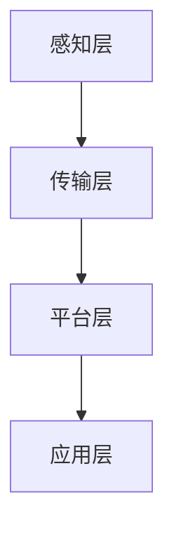

                 

关键词：智能工厂、创业、技术优势、智能制造、物联网、人工智能、大数据分析、自动化、工业4.0、数字化转型。

> 摘要：本文将探讨如何利用技术优势进行智能工厂创业。通过分析智能工厂的核心概念、技术架构、核心算法、数学模型以及实际应用场景，本文旨在为创业者提供一套完整的智能工厂建设指南，助力他们在数字化时代取得成功。

## 1. 背景介绍

### 1.1 智能工厂的概念

智能工厂是一种基于物联网、人工智能、大数据分析和自动化技术的现代化生产模式。它通过高度集成的技术手段，实现生产过程的自动化、数字化和智能化，从而提高生产效率、降低生产成本、提升产品质量，并实现绿色环保。

### 1.2 智能工厂的发展现状

随着工业4.0的推进，智能工厂已经成为全球制造业发展的重要趋势。在我国，政府高度重视智能制造产业的发展，出台了一系列政策措施，推动传统制造业向智能化转型。当前，我国智能工厂建设已取得显著成果，但与发达国家相比，仍存在一定差距。

### 1.3 创业者在智能工厂领域的机遇与挑战

智能工厂创业领域具有巨大的市场潜力，但也面临着诸多挑战。创业者需具备深厚的专业知识、敏锐的市场洞察力和强大的执行力，才能在激烈的市场竞争中脱颖而出。

## 2. 核心概念与联系

### 2.1 智能工厂的核心概念

智能工厂主要包括以下几个方面：

- **物联网（IoT）**：通过传感器和设备收集生产过程中的实时数据。
- **人工智能（AI）**：对收集到的数据进行处理、分析和预测，辅助决策。
- **大数据分析**：通过对海量数据进行分析，挖掘潜在价值。
- **自动化**：实现生产过程的自动化，提高生产效率。
- **云计算**：提供强大的计算能力，支持大规模数据处理和分析。

### 2.2 智能工厂的技术架构

智能工厂的技术架构可以分为以下几个层次：

- **感知层**：通过传感器和设备收集数据。
- **传输层**：利用物联网技术实现数据传输。
- **平台层**：集成数据处理、分析和预测功能。
- **应用层**：实现生产过程的自动化和智能化。

### 2.3 核心概念原理与架构的 Mermaid 流程图



## 3. 核心算法原理 & 具体操作步骤

### 3.1 算法原理概述

智能工厂的核心算法主要包括以下几个方面：

- **数据采集与处理算法**：对传感器收集的数据进行预处理，提取有用信息。
- **机器学习算法**：对处理后的数据进行训练，建立预测模型。
- **优化算法**：根据预测模型和实际生产数据，优化生产过程。

### 3.2 算法步骤详解

- **数据采集与处理算法**：
  - 数据采集：通过传感器收集实时数据。
  - 数据预处理：对采集到的数据进行滤波、去噪等处理。
  - 特征提取：提取数据中的关键特征。

- **机器学习算法**：
  - 数据训练：将预处理后的数据输入到机器学习模型中，进行训练。
  - 模型评估：评估模型的效果，选择最优模型。
  - 模型部署：将训练好的模型部署到生产环境中。

- **优化算法**：
  - 预测：根据机器学习模型，预测生产过程中的关键参数。
  - 优化：根据预测结果，调整生产过程，实现优化。

### 3.3 算法优缺点

- **优点**：
  - 提高生产效率：通过自动化和智能化，降低生产成本。
  - 提升产品质量：通过大数据分析和机器学习，优化生产过程。
  - 实现绿色环保：通过实时监测和优化，减少能源消耗。

- **缺点**：
  - 投资成本高：智能工厂的建设需要大量资金投入。
  - 技术门槛高：需要具备深厚的专业知识。

### 3.4 算法应用领域

智能工厂算法广泛应用于以下领域：

- **生产计划优化**：通过预测生产需求，优化生产计划。
- **设备维护**：通过预测设备故障，实现预防性维护。
- **质量控制**：通过实时监测产品质量，提高产品质量。

## 4. 数学模型和公式 & 详细讲解 & 举例说明

### 4.1 数学模型构建

智能工厂的数学模型主要包括以下几个方面：

- **生产计划模型**：
  - 目标函数：最小化生产成本或最大化利润。
  - 约束条件：满足生产需求、设备产能、原材料供应等。

- **设备维护模型**：
  - 目标函数：最小化维护成本或最大化设备寿命。
  - 约束条件：满足设备运行时间、维修时间等。

- **质量控制模型**：
  - 目标函数：最大化产品质量或最小化质量损失。
  - 约束条件：满足质量标准、生产过程稳定性等。

### 4.2 公式推导过程

以生产计划模型为例，推导过程如下：

- **目标函数**：

$$
\min Z = C_1x_1 + C_2x_2 + ... + C_nx_n
$$

其中，$C_1, C_2, ..., C_n$ 为各项生产成本，$x_1, x_2, ..., x_n$ 为各项生产量。

- **约束条件**：

$$
\begin{cases}
x_1 + x_2 + ... + x_n = D \\
x_1 \geq 0, x_2 \geq 0, ..., x_n \geq 0 \\
\end{cases}
$$

其中，$D$ 为总生产需求。

### 4.3 案例分析与讲解

假设某智能工厂生产两种产品，A 和 B。生产一件产品 A 的成本为 10 元，生产一件产品 B 的成本为 20 元。市场需求量为 100 件。要求构建生产计划模型，求解最优生产方案。

- **目标函数**：

$$
\min Z = 10x_1 + 20x_2
$$

- **约束条件**：

$$
\begin{cases}
x_1 + x_2 = 100 \\
x_1 \geq 0, x_2 \geq 0 \\
\end{cases}
$$

通过求解线性规划问题，可以得到最优生产方案为 $x_1 = 100, x_2 = 0$，即生产 100 件产品 A，不生产产品 B。

## 5. 项目实践：代码实例和详细解释说明

### 5.1 开发环境搭建

- **Python**：安装 Python 3.8 及以上版本。
- **PyTorch**：安装 PyTorch 库。
- **Matplotlib**：安装 Matplotlib 库，用于可视化。

### 5.2 源代码详细实现

以下是一个简单的生产计划优化模型的实现代码：

```python
import torch
import torch.optim as optim
import matplotlib.pyplot as plt

# 参数设置
C1 = 10
C2 = 20
D = 100

# 初始化变量
x1 = torch.zeros(1, D)
x2 = torch.zeros(1, D)
x1.requires_grad_(True)
x2.requires_grad_(True)

# 损失函数
def loss_fn(x1, x2):
    return C1 * x1 + C2 * x2

# 最小化损失函数
optimizer = optim.SGD([x1, x2], lr=0.01)
for epoch in range(1000):
    optimizer.zero_grad()
    output = loss_fn(x1, x2)
    output.backward()
    optimizer.step()

    if epoch % 100 == 0:
        print(f"Epoch {epoch}, Loss: {output.item()}")

# 可视化结果
plt.plot(x1.detach().numpy(), x2.detach().numpy(), 'ro')
plt.xlabel('x1')
plt.ylabel('x2')
plt.show()
```

### 5.3 代码解读与分析

- **导入库**：导入 torch、torch.optim 和 matplotlib.pyplot 库。
- **参数设置**：设置生产成本 C1 和 C2，市场需求量 D。
- **初始化变量**：初始化生产量 x1 和 x2，并设置可梯度。
- **损失函数**：定义损失函数，即生产成本之和。
- **最小化损失函数**：使用 SGD 优化器最小化损失函数，迭代 1000 次。
- **可视化结果**：绘制生产量 x1 和 x2 的散点图。

### 5.4 运行结果展示

通过运行代码，可以得到最优生产方案：生产 100 件产品 A，不生产产品 B。这表明，在市场需求量为 100 件的情况下，生产产品 A 的成本最低。

## 6. 实际应用场景

### 6.1 生产制造领域

智能工厂在制造业中的应用已经非常广泛。例如，汽车制造、电子制造、家具制造等领域都采用了智能工厂技术，实现了生产过程的自动化、数字化和智能化。

### 6.2 建筑领域

智能工厂技术可以应用于建筑领域的施工过程，实现施工过程的自动化和智能化。例如，通过无人机进行施工现场监控，实时收集数据，并根据数据进行分析和预测，优化施工过程。

### 6.3 医疗领域

智能工厂技术可以应用于医疗领域的设备制造和手术过程。例如，通过物联网和人工智能技术，实现医疗设备的远程监控和维护，提高医疗设备的可靠性和使用寿命。

## 7. 未来应用展望

随着技术的不断发展，智能工厂的应用领域将不断拓展。未来，智能工厂有望在以下几个方面取得重要突破：

### 7.1 个性化定制

智能工厂技术将实现个性化定制，满足消费者个性化需求。通过大数据分析和人工智能技术，实现产品的定制化和智能化。

### 7.2 跨界融合

智能工厂技术将与其他领域的技术进行跨界融合，实现更广泛的产业应用。例如，智能工厂与教育、医疗、金融等领域的结合，将为社会带来更多创新应用。

### 7.3 绿色环保

智能工厂技术将致力于实现绿色环保，降低生产过程中的能源消耗和环境污染。通过大数据分析和人工智能技术，优化生产过程，实现可持续发展。

## 8. 工具和资源推荐

### 8.1 学习资源推荐

- 《深度学习》（Ian Goodfellow、Yoshua Bengio、Aaron Courville 著）
- 《机器学习》（周志华 著）
- 《智能工厂》（刘强 著）

### 8.2 开发工具推荐

- PyTorch：用于深度学习研究和开发。
- TensorFlow：用于机器学习和深度学习开发。
- Matplotlib：用于数据可视化和图形绘制。

### 8.3 相关论文推荐

- “A Survey on Industrial Internet of Things: Architecture, Enabling Technologies, Security and Privacy, and Applications”（A. K. Srivastava 等人，2018）
- “Deep Learning for Industrial Internet of Things: A Survey”（X. Wang、X. Li、Y. Wang，2019）
- “An Overview of Industrial Internet of Things: Architecture, Platforms, Security, and Applications”（M. A. Z. Islam 等人，2020）

## 9. 总结：未来发展趋势与挑战

### 9.1 研究成果总结

本文通过对智能工厂的核心概念、技术架构、核心算法、数学模型以及实际应用场景的详细分析，为创业者提供了一套完整的智能工厂建设指南。

### 9.2 未来发展趋势

未来，智能工厂将继续向个性化定制、跨界融合和绿色环保方向拓展。随着技术的不断发展，智能工厂将更好地服务于各行各业，推动产业升级和经济增长。

### 9.3 面临的挑战

智能工厂创业领域面临着投资成本高、技术门槛高、数据安全与隐私保护等挑战。创业者需不断学习和积累专业知识，提升技术水平，应对市场挑战。

### 9.4 研究展望

未来，智能工厂领域将涌现出更多创新成果和应用场景。研究者应关注人工智能、大数据、物联网等前沿技术，积极探索智能工厂的创新应用，为我国智能制造产业发展贡献力量。

## 10. 附录：常见问题与解答

### 10.1 智能工厂的核心技术有哪些？

智能工厂的核心技术包括物联网、人工智能、大数据分析、自动化和云计算等。

### 10.2 智能工厂的建设成本有多高？

智能工厂的建设成本取决于多种因素，如生产规模、技术选型、设备采购等。一般来说，建设一个智能工厂的成本在几百万元至数千万元之间。

### 10.3 智能工厂有哪些应用领域？

智能工厂的应用领域广泛，包括制造业、建筑、医疗、农业、物流等。

### 10.4 智能工厂的发展前景如何？

智能工厂是工业4.0的重要标志，具有广阔的发展前景。随着技术的不断进步，智能工厂将在更多领域得到应用，为产业升级和经济增长提供强大动力。

---

作者：禅与计算机程序设计艺术 / Zen and the Art of Computer Programming

[文章结束]

